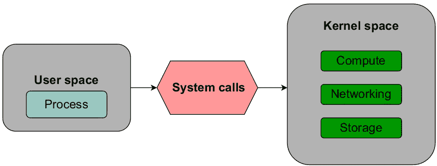
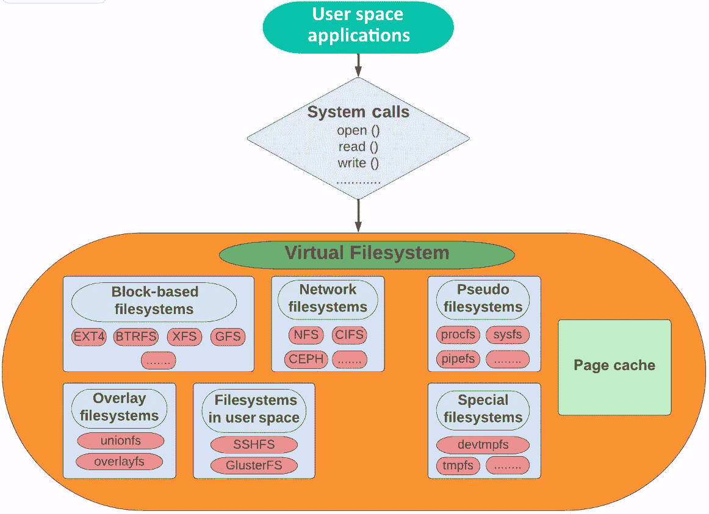
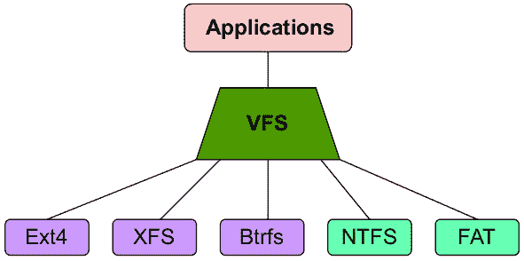
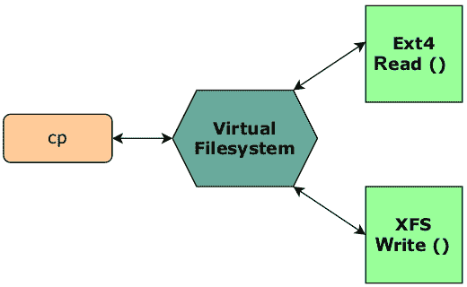
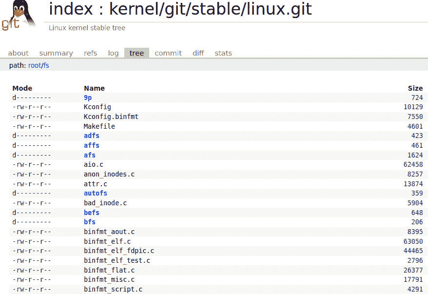

# 1

# 一切从哪里开始——虚拟文件系统

即使在软件开发取得了惊人的进展的今天，Linux 内核仍然是最复杂的代码之一。开发者、程序员和未来的内核黑客们不断试图深入内核代码并推动新特性，而爱好者和技术爱好者则尝试理解并解开这些谜团。

自然地，关于 Linux 及其内部工作原理，已经写了很多，从一般的管理到内核编程。在过去的几十年里，已经出版了数百本书，涵盖了许多重要的操作系统主题，如进程创建、线程、内存管理、虚拟化、文件系统实现和 CPU 调度。本书（感谢你选择它！）将专注于 Linux 中的存储堆栈及其多层次的组织。

我们将从介绍 Linux 内核中的虚拟文件系统以及它在允许最终用户程序访问文件系统数据方面的关键作用开始。由于本书的目的是覆盖整个存储堆栈，从上到下，深入理解虚拟文件系统非常重要，因为它是内核中 I/O 请求的起点。我们将介绍用户空间和内核空间的概念，了解系统调用，并看看 Linux 中的*一切皆文件*哲学是如何与虚拟文件系统相关联的。

本章我们将涵盖以下主要主题：

+   理解现代数据中心中的存储

+   定义系统调用

+   解释虚拟文件系统的需求

+   描述虚拟文件系统

+   解释*一切皆文件*哲学

# 技术要求

在深入之前，我认为有必要在这里指出，某些技术主题对于初学者来说可能比其他主题更具挑战性。由于这里的目标是理解 Linux 内核及其主要子系统的内部工作原理，因此，拥有一定的操作系统基础知识，尤其是 Linux 的基础知识，将非常有帮助。最重要的是，要以耐心、好奇心和愿意学习的态度来接触这些话题。

本章中呈现的命令和示例与特定的发行版无关，可以在任何 Linux 操作系统上运行，例如 Debian、Ubuntu、Red Hat 和 Fedora。文中提到了一些内核源代码的参考。如果你想下载内核源代码，可以从[`www.kernel.org`](https://www.kernel.org)下载。本章相关的操作系统软件包可以按如下方式安装：

+   对于 Ubuntu/Debian 系统：

    +   `sudo apt` `install strace`

    +   `sudo apt` `install bcc`

+   对于 Fedora/CentOS/Red Hat 系统：

    +   `sudo yum` `install strace`

    +   `sudo yum` `install bcc-tools`

# 理解现代数据中心中的存储

在没有数据的情况下进行理论推测是一项严重的错误。人们往往会开始扭曲事实以适应理论，而不是让理论适应事实。——亚瑟·柯南·道尔爵士

计算、存储和网络是任何基础设施的基本构件。您的应用程序表现如何，通常取决于这三层的综合性能。现代数据中心中运行的工作负载从流媒体服务到机器学习应用都有。随着云计算平台的迅猛崛起和普及，所有这些基本构件现在都被从终端用户那里抽象出来。随着应用程序变得资源需求更大，向应用程序添加更多硬件资源已成为新常态。故障排除性能问题通常被跳过，转而将应用程序迁移到更好的硬件平台。

在计算、存储和网络这三个基础构件中，存储通常被认为是大多数场景中的瓶颈。对于像数据库这样的应用程序，底层存储的性能至关重要。在托管关键任务和时间敏感应用（例如**在线事务处理**（**OLTP**））的基础设施中，存储性能经常受到关注。即便是微小的 I/O 请求延迟，也可能影响整个应用程序的响应。

测量存储性能的最常见指标是延迟。存储设备的响应时间通常以毫秒为单位进行测量。而与此相比，您的处理器或内存的测量通常以纳秒为单位，您就会发现存储层的性能如何影响系统的整体工作。这就导致了应用程序需求与底层存储实际能够提供的性能之间的不一致。在过去的几年里，现代存储硬盘的进展大多集中在大小方面——**容量领域**。然而，存储硬件的性能提升并没有按相同的速度发展。与计算功能相比，存储性能相形见绌。因此，它常被称为*数据中心的三条腿狗*。

在讨论存储介质的选择时，需要指出的是，无论硬件多么强大，它总会有其功能上的限制。应用程序和操作系统根据硬件进行调优同样重要。对您的应用程序、操作系统和文件系统参数进行精细调优，可以显著提升整体性能。为了充分利用底层硬件的潜力，I/O 层次结构的所有层次都需要高效运作。

## 在 Linux 中与存储交互

Linux 内核明确区分了用户空间和内核空间进程。所有硬件资源，如 CPU、内存和存储，都位于内核空间。任何想要访问内核空间资源的用户空间应用程序，都必须生成一个 **系统调用**，如 *图 1.1* 所示：



图 1.1 – 用户空间与内核空间之间的交互

**用户空间** 指的是所有位于内核之外的应用程序和进程。内核空间包括设备驱动程序等程序，这些程序可以不受限制地访问底层硬件。用户空间可以视为一种沙箱机制，用来限制最终用户程序修改关键的内核功能。

用户空间与内核空间的概念深深植根于现代处理器的设计中。传统的 x86 CPU 使用保护域的概念，称为 **环**，来共享和限制对硬件资源的访问。处理器提供四个环或模式，编号从 0 到 3。现代处理器设计只在其中两个模式下运行，即环 0 和环 3。用户空间应用程序运行在环 3 中，具有有限的内核资源访问权限。内核则占据环 0。内核代码在这里执行，并与底层硬件资源进行交互。

当进程需要读取或写入文件时，它们需要与物理磁盘上方的文件系统结构进行交互。每种文件系统使用不同的方法来组织磁盘上的数据。进程的请求不会直接到达文件系统或物理磁盘。为了让物理磁盘服务于进程的 I/O 请求，必须经过内核中整个存储层级。该层级中的第一层称为 **虚拟文件系统**。以下的图 *图 1.2* 突出了虚拟文件系统的主要组件：



图 1.2 – 内核中的虚拟文件系统 (VFS) 层

Linux 中的存储栈由多个紧密相连的层组成，这些层共同确保通过统一的接口抽象了对物理存储介质的访问。在接下来的内容中，我们将基于这一结构进行扩展，增加更多的层次。我们将尽力深入探讨每一层，了解它们如何协同工作。

本章将专注于虚拟文件系统及其各种特性。在接下来的章节中，我们将解释并揭示 Linux 中更常用的文件系统的一些底层工作原理。然而，考虑到这里将多次提到 *文件系统* 这一词汇，我认为有必要简要地对不同的文件系统类型进行分类，以避免任何混淆：

+   **块级文件系统**：块级或基于磁盘的文件系统是存储用户数据的最常见方式。作为普通操作系统用户，这些就是用户大多数交互的文件系统。像**扩展文件系统版本 2/3/4**（**Ext 2/3/4**）、**扩展文件系统**（**XFS**）、Btrfs、FAT 和 NTFS 等文件系统都被归类为基于磁盘或块级文件系统。这些文件系统以**块**为单位。块大小是文件系统的一个属性，只有在创建设备上的文件系统时才能设置。块大小表示文件系统在读写数据时使用的大小。我们可以将其视为文件系统中存储分配和检索的逻辑单位。一个可以按块访问的设备因此被称为**块设备**。任何连接到计算机的存储设备，无论是硬盘还是外部 USB，都可以归类为块设备。传统上，块级文件系统是挂载在单个主机上的，不允许多个主机之间共享。

+   **集群文件系统**：集群文件系统也是块级文件系统，使用基于块的访问方法来读写数据。不同之处在于，它们允许单个文件系统被多个主机同时挂载和使用。集群文件系统基于**共享存储**的概念，这意味着多个主机可以同时访问同一个块设备。Linux 中常用的集群文件系统包括 Red Hat 的**全球文件系统 2**（**GFS2**）和**Oracle 集群文件系统**（**OCFS**）。

+   **网络文件系统（NFS）**：NFS 是一种允许远程文件共享的协议。与常规的块级文件系统不同，NFS 基于多个主机之间共享数据的概念。NFS 的工作模式是客户端和服务器的概念。后端存储由 NFS 服务器提供。挂载 NFS 文件系统的主机系统称为**客户端**。客户端和服务器之间的连接是通过常规以太网实现的。所有 NFS 客户端共享 NFS 服务器上的单一文件副本。NFS 的性能不如块级文件系统，但它仍然广泛应用于企业环境，主要用于存储长期备份和共享常用数据。

+   `/proc (procfs)`和`/sys (sysfs)`属于这一类别。这些目录包含虚拟或临时文件，其中包含有关不同内核子系统的信息。这些伪文件系统也是虚拟文件系统的一部分，正如我们将在*万物皆文件*章节中看到的那样。

现在我们对用户空间、内核空间和不同类型的文件系统有了基本的了解，接下来我们将解释应用程序如何通过系统调用在内核空间中请求资源。

# 理解系统调用

在查看说明应用程序与虚拟文件系统交互的图示时，你可能注意到了用户空间程序与虚拟文件系统之间的中介层；该层被称为**系统调用接口**。为了从内核请求某些服务，用户空间程序调用系统调用接口。这些系统调用为最终用户应用程序提供了访问内核空间资源（如处理器、内存和存储）的方式。系统调用接口有三个主要目的：

+   **确保安全性**：系统调用防止用户空间的应用程序直接修改内核空间的资源。

+   **抽象性**：应用程序不需要关注底层硬件规格

+   **可移植性**：用户程序可以在所有实现相同接口集的内核上正确运行

关于系统调用和**应用程序编程接口**（**API**）之间的区别，常常存在一些混淆。API 是程序使用的一组编程接口，这些接口定义了两个组件之间的通信方式。API 实现于用户空间，描述了如何获取特定的服务。而系统调用是一个更底层的机制，通过中断向内核发出显式请求。系统调用接口由 Linux 的标准 C 库提供。

如果调用进程生成的系统调用成功，将返回一个文件描述符。`open ()`系统调用会返回一个文件描述符给调用进程。一旦文件被打开，程序使用文件描述符对文件进行操作。所有的读取、写入以及其他操作都通过文件描述符来执行。

每个进程始终至少有三个打开的文件——标准输入、标准输出和标准错误，分别由文件描述符 0、1 和 2 表示。接下来的文件将分配文件描述符值为 3。如果我们通过`ls`进行文件列表并运行一个简单的`strace`，`open`系统调用将返回一个值为 3 的文件描述符，代表文件——在此案例中为`/etc/hosts`。之后，这个文件描述符值 3 将被`fstat`和`close`调用用于执行进一步操作：

```
strace ls /etc/hosts
root@linuxbox:~# strace ls /etc/hosts
execve("/bin/ls", ["ls", "/etc/hosts"], 0x7ffdee289b48 /* 22 vars */) = 0
brk(NULL)                               = 0x562b97fc6000
access("/etc/ld.so.nohwcap", F_OK)      = -1 ENOENT (No such file or directory)
access("/etc/ld.so.preload", R_OK)      = -1 ENOENT (No such file or directory)
openat(AT_FDCWD, "/etc/ld.so.cache", O_RDONLY|O_CLOEXEC) = 3
fstat(3, {st_mode=S_IFREG|0644, st_size=140454, ...}) = 0
mmap(NULL, 140454, PROT_READ, MAP_PRIVATE, 3, 0) = 0x7fbaa2519000
close(3)                                = 0
access("/etc/ld.so.nohwcap", F_OK)      = -1 ENOENT (No such file or directory)
openat(AT_FDCWD, "/lib/x86_64-linux-gnu/libselinux.so.1", O_RDONLY|O_CLOEXEC) = 3
```

[由于篇幅原因，省略其余代码。]

在 x86 系统上，大约有 330 个系统调用。对于其他架构，这个数字可能不同。每个系统调用都有一个唯一的整数编号。你可以通过`ausyscall`命令列出系统上可用的系统调用，这将列出系统调用及其对应的整数值：

```
ausyscall –dump
root@linuxbox:~# ausyscall --dump
Using x86_64 syscall table:
0       read
1       write
2       open
3       close
4       stat
5       fstat
6       lstat
7       poll
8       lseek
9       mmap
10      mprotect
```

[由于篇幅原因，省略其余代码。]

```
root@linuxbox:~# ausyscall --dump|wc -l
334
root@linuxbox:~#
```

以下表格列出了一些常见的系统调用：

| **系统调用** | **描述** |
| --- | --- |
| `open ()`, `close ()` | 打开和关闭文件 |
| `create ()` | 创建文件 |
| `chroot ()` | 更改`root`目录 |
| `mount ()`, `umount ()` | 挂载和卸载文件系统 |
| `lseek ()` | 更改文件中的指针位置 |
| `read ()`, `write ()` | 读写文件 |
| `stat ()`, `fstat ()` | 获取文件状态 |
| `statfs ()`, `fstatfs ()` | 获取文件系统统计信息 |
| `execve ()` | 执行路径名所指的程序 |
| `access ()` | 检查调用进程是否能访问文件路径名 |
| `mmap ()` | 在调用进程的虚拟地址空间中创建一个新的映射 |

表 1.1 – 一些常见的系统调用

那么，系统调用在与文件系统交互中扮演什么角色呢？正如我们将在后续章节中看到的，当用户空间进程生成系统调用来访问内核空间中的资源时，它首先与虚拟文件系统交互。该系统调用首先由内核中的相应系统调用处理程序处理，在验证请求的操作后，处理程序会调用 VFS 层中的适当函数。VFS 层将请求传递给适当的文件系统驱动模块，该模块执行文件上的实际操作。

我们需要理解这里的*原因*——为什么进程会与虚拟文件系统交互，而不是与磁盘上的实际文件系统交互？在接下来的章节中，我们将尝试弄清楚这个问题。

总结一下，Linux 中的系统调用接口实现了通用的方法，用户空间的应用程序可以通过这些方法访问内核空间中的资源。

# 解释虚拟文件系统的需求

**标准文件系统**是一组数据结构，决定了用户数据在磁盘上的组织方式。最终用户能够通过常规的文件访问方法与这个标准文件系统交互，并执行常见任务。每个操作系统（无论是 Linux 还是非 Linux）至少提供一个这样的文件系统，显然，它们每个都宣称自己比其他的*更好、更快、更安全*。绝大多数现代 Linux 发行版将 **XFS 或 Ext4** 作为默认文件系统。这些文件系统具有多个特性，并被认为在日常使用中稳定可靠。

然而，Linux 对文件系统的支持不仅仅限于这两种。使用 Linux 的一个重要好处是它支持多种文件系统，所有这些文件系统都可以被视为 Ext4 和 XFS 的完美替代方案。因此，Linux 可以与其他操作系统和谐共存。一些常用的文件系统包括 Ext4 的旧版本，如 Ext2 和 Ext3，Btrfs、ReiserFS、OpenZFS、FAT 和 NTFS。在使用多个分区时，用户可以从长长的文件系统列表中进行选择，根据需求在每个磁盘分区上创建不同的文件系统。

物理硬盘上最小的可寻址单位是扇区。对于文件系统来说，最小的可写单位称为块（block）。**块**可以视为一组连续的扇区。文件系统的所有操作都是以块为单位进行的。不同文件系统在如何寻址和组织这些块上并没有统一的方法。每个文件系统可能会使用不同的数据结构来分配和存储这些块上的数据。每个存储分区上可能存在不同的文件系统，这会使管理变得复杂。考虑到 Linux 支持的文件系统种类繁多，试想一下，如果应用程序需要理解每种文件系统的具体细节，会是多么麻烦。为了与文件系统兼容，应用程序需要为每种文件系统实现独特的访问方法，这几乎使应用程序的设计变得不切实际。

抽象接口在 Linux 内核中起着至关重要的作用。在 Linux 中，无论使用哪种文件系统，最终用户或应用程序都可以通过统一的访问方法与文件系统进行交互。所有这些都是通过虚拟文件系统层（VFS）实现的，它通过一个包容性接口隐藏了文件系统的实现。

# 描述 VFS

为了确保应用程序在处理不同文件系统时不会遇到上述障碍，Linux 内核在最终用户应用程序和存储数据的文件系统之间实现了一层抽象。这一层被称为`mkfs.vfs`命令！因此，一些人更喜欢使用**虚拟** **文件系统切换**这一术语。

想象一下*纳尼亚传奇*中的*神奇衣橱*。衣橱实际上是通往纳尼亚魔法世界的门户。一旦你穿过衣橱，你就可以探索新世界并与其中的居民互动。衣橱帮助你进入魔法世界。同样地，VFS 为不同的文件系统提供了一个通道。

VFS 定义了一个通用接口，使得多个文件系统能够在 Linux 中共存。值得再次强调的是，VFS 并非指标准的基于块的文件系统。我们在谈论的是一个抽象层，它提供了最终用户应用程序与实际块文件系统之间的联系。通过 VFS 中的标准化，应用程序可以执行读写操作，而无需担心底层的文件系统。

如*图 1.3*所示，VFS 位于用户空间程序与实际文件系统之间：



图 1.3 – VFS 作为用户空间程序与文件系统之间的桥梁

为了使 VFS 能够为双方提供服务，以下条件必须成立：

+   所有最终用户应用程序需要根据 VFS 提供的标准接口来定义它们的文件系统操作

+   每个文件系统需要提供 VFS 提供的通用接口的实现。

我们已经解释过，用户空间中的应用程序在需要访问内核空间中的资源时，需要生成系统调用。通过 VFS 提供的抽象，像`read()`和`write()`这样的系统调用可以正常工作，而不管使用的是哪种文件系统。这些系统调用能够跨文件系统边界工作。我们不需要特别的机制将数据移到不同或非本地文件系统。例如，我们可以轻松地将数据从 Ext4 文件系统移动到 XFS，反之亦然。从高层次来说，当进程发出`read()`或`write()`系统调用以读取或写入文件时，VFS 会搜索要使用的文件系统驱动程序，并将这些系统调用转发给该驱动程序。

## 通过 VFS 实现通用文件系统接口

VFS 的主要目标是以最小的开销在内核中表示多种文件系统。当进程请求对文件进行读写操作时，内核将其替换为该文件所在文件系统的特定函数。为了实现这一点，每个文件系统必须根据 VFS 进行适配。

为了更好地理解，我们来看看以下示例。

以 Linux 中的`cp`（`copy`）命令为例。假设我们要将一个文件从 Ext4 文件系统复制到 XFS 文件系统。那么，这个复制操作是如何完成的？`cp`命令是如何与这两个文件系统进行交互的？请参见*图 1.4*：



图 1.4 – VFS 确保不同文件系统之间的互操作性

首先，`cp`命令并不关心所使用的文件系统。我们已经将 VFS 定义为实现抽象的层。因此，`cp`命令无需关心文件系统的细节。它将通过标准的系统调用接口与 VFS 层进行交互。具体来说，它将发出`open()`和`read()`系统调用来打开和读取要复制的文件。一个已打开的文件在内核中由文件数据结构表示（正如我们将在下一章*第二章*中学习的那样，*解释 VFS 中的数据结构*）。

当`cp`生成这些通用系统调用时，内核将通过指针将这些调用重定向到文件所在文件系统的适当函数。为了将文件复制到 XFS 文件系统，`write()`系统调用会传递给 VFS。然后，这个调用会再次被重定向到实现该功能的 XFS 文件系统的特定函数。通过向 VFS 发出的系统调用，`cp`进程可以使用 Ext4 的`read()`方法和 XFS 的`write()`方法执行复制操作。就像一个*开关*，VFS 将在它们指定的文件系统实现之间切换通用的文件访问方法。

内核中的读、写或任何其他功能没有默认定义——这也是**虚拟**一词的含义。对于这些操作的解释取决于底层文件系统。就像利用 VFS 提供的抽象的用户程序一样，文件系统也能从这种方法中受益。文件系统不需要重新实现文件的常见访问方法。

这还挺酷的，对吧？但是如果我们想从 Ext4 复制一些东西到一个非原生文件系统呢？像 Ext4、XFS 和 Btrfs 这样的文件系统是专门为 Linux 设计的。如果其中一个文件系统是 FAT 或 NTFS，情况会怎样呢？

不得不承认，VFS 的设计偏向于源自 Linux 系列的文件系统。对于最终用户来说，文件和目录之间有明确的区别。在 Linux 的哲学中，一切都是文件，包括目录。原生 Linux 文件系统，如 Ext4 和 XFS，都是在考虑到这些细微差别的情况下设计的。由于实现上的差异，非原生文件系统如 FAT 和 NTFS 并不支持所有 VFS 操作。Linux 中的 VFS 使用 inode、超级块和目录项等结构来表示文件系统的通用视图。非原生 Linux 文件系统并不使用这些结构。那么，Linux 是如何适配这些文件系统的呢？以 FAT 文件系统为例，FAT 文件系统来源于不同的世界，并未使用这些结构来表示文件和目录。它不会将目录视为文件。那么，VFS 是如何与 FAT 文件系统交互的呢？

内核中与文件系统相关的所有操作都与 VFS 数据结构紧密集成。为了支持 Linux 上的非原生文件系统，内核动态构建相应的数据结构。例如，为了满足 FAT 等文件系统的通用文件模型，将在内存中动态创建对应于目录的文件。这些*文件*是*虚拟的*，只存在于内存中。这是一个需要理解的重要概念。在原生文件系统中，像 inode 和超级块这样的结构不仅存在于内存中，还存储在物理介质上。相反，非 Linux 文件系统只需要在内存中执行这些结构的实现。

## 查看源代码

如果我们查看内核源代码，可以看到 VFS 提供的不同函数都在 `fs` 目录下。所有以 `.c` 结尾的源文件都包含了不同 VFS 方法的实现。子目录包含特定文件系统的实现，如*图 1.5*所示：



图 1.5 – 内核 5.19.9 的源代码

你会注意到诸如 `open.c` 和 `read_write.c` 这样的源文件，这些文件是在用户空间进程生成 `open ()`、`read ()` 和 `write ()` 系统调用时被调用的。这些文件包含了大量的代码，鉴于我们在这里不会创建任何新代码，这仅仅是一次探索练习。不过，这些文件中确实有几段重要的代码，突显了我们之前所讲解的内容。让我们快速看一下 `read` 和 `write` 函数。

`SYSCALL_DEFINE3` 宏是定义系统调用的标准方法，接收系统调用名称作为参数之一。

对于 `write` 系统调用，其定义如下。请注意，参数之一是文件描述符：

```
SYSCALL_DEFINE3(write, unsigned int, fd, const char __user *, buf, size_t, count)
{
        return ksys_write(fd, buf, count);
}
```

类似地，这是 `read` 系统调用的定义：

```
SYSCALL_DEFINE3(read, unsigned int, fd, char __user *, buf, size_t, count)
{
        return ksys_read(fd, buf, count);
}
```

两者都调用了 `ksys_write ()` 和 `ksys_read ()` 函数。我们来看一下这两个函数的代码：

```
ssize_t ksys_read(unsigned int fd, char __user *buf, size_t count)
{
        struct fd f = fdget_pos(fd);
        ssize_t ret = -EBADF;
******* Skipped *******
                ret = vfs_read(f.file, buf, count, ppos);
******* Skipped *******
        return ret;
}
ssize_t ksys_write(unsigned int fd, const char __user *buf, size_t count)
{
        struct fd f = fdget_pos(fd);
        ssize_t ret = -EBADF;
******* Skipped *******
                ret = vfs_write(f.file, buf, count, ppos);
                ******* Skipped *******
        return ret;
}
```

`vfs_read ()` 和 `vfs_write ()` 函数的存在表明我们正在过渡到 VFS。这些函数查找底层文件系统的 `file_operations` 结构，并调用适当的 `read ()` 和 `write ()` 方法：

```
ssize_t vfs_read(struct file *file, char __user *buf, size_t count, loff_t *pos)
{
******* Skipped *******
        if (file->f_op->read)
                ret = file->f_op->read(file, buf, count, pos);
        else if (file->f_op->read_iter)
                ret = new_sync_read(file, buf, count, pos);
******* Skipped *******
return ret;
}
ssize_t vfs_write(struct file *file, const char __user *buf, size_t count, loff_t *pos)
{
******* Skipped *******
        if (file->f_op->write)
                ret = file->f_op->write(file, buf, count, pos);
        else if (file->f_op->write_iter)
                ret = new_sync_write(file, buf, count, pos);
 ******* Skipped *******
       return ret;
}
```

每个文件系统定义了支持操作的 `file_operations` 结构体。内核源代码中有多个 `file_operations` 结构体的定义，每个文件系统都有独特的定义。该结构体中定义的操作描述了读写函数如何执行：

```
root@linuxbox:/linux-5.19.9/fs# grep -R "struct file_operations" * | wc -l
453
root@linuxbox:/linux-5.19.9/fs# grep -R "struct file_operations" *
9p/vfs_dir.c:const struct file_operations v9fs_dir_operations = {
9p/vfs_dir.c:const struct file_operations v9fs_dir_operations_dotl = {
9p/v9fs_vfs.h:extern const struct file_operations v9fs_file_operations;
9p/v9fs_vfs.h:extern const struct file_operations v9fs_file_operations_dotl;
9p/v9fs_vfs.h:extern const struct file_operations v9fs_dir_operations;
9p/v9fs_vfs.h:extern const struct file_operations v9fs_dir_operations_dotl;
9p/v9fs_vfs.h:extern const struct file_operations v9fs_cached_file_operations;
9p/v9fs_vfs.h:extern const struct file_operations v9fs_cached_file_operations_dotl;
9p/v9fs_vfs.h:extern const struct file_operations v9fs_mmap_file_operations;
9p/v9fs_vfs.h:extern const struct file_operations v9fs_mmap_file_operations_dotl;
```

[其余代码因简洁性省略。]

如你所见，`file_operations` 结构体适用于各种文件类型，包括常规文件、目录、设备文件和网络套接字。一般来说，任何可以使用标准文件 I/O 操作打开和操作的文件类型，都可以通过此结构体来处理。

# 跟踪 VFS 函数

Linux 提供了相当多的跟踪机制，可以让我们窥见其底层工作原理。其中之一是 `funccount`。顾名思义，`funccount` 用于计算函数调用的次数：

```
root@linuxbox:~# funccount --help
usage: funccount [-h] [-p PID] [-i INTERVAL] [-d DURATION] [-T] [-r] [-D]
                 [-c CPU]
                 pattern
Count functions, tracepoints, and USDT probes
```

为了测试和验证我们之前的理解，我们将在后台运行一个简单的复制进程，并使用 `funccount` 程序跟踪由于执行 `cp` 命令而调用的 VFS 函数。由于我们只需要计算 `cp` 进程的 VFS 调用次数，因此需要使用 `-p` 标志来指定进程 ID。`vfs_*` 参数将跟踪该进程的所有 VFS 函数。你会看到 `vfs_read ()` 和 `vfs_write ()` 函数是由 `cp` 进程调用的。`COUNT` 列显示该函数被调用的次数：

```
funccount -p process_ID 'vfs_*'
[root@linuxbox ~]# nohup cp myfile /tmp/myfile &
[1] 1228433
[root@linuxbox ~]# nohup: ignoring input and appending output to 'nohup.out'
[root@linuxbox ~]#
[root@linuxbox ~]# funccount -p 1228433 "vfs_*"
Tracing 66 functions for "b'vfs_*'"... Hit Ctrl-C to end.
^C
FUNC                                    COUNT
b'vfs_read'                             28015
b'vfs_write'                            28510
Detaching...
[root@linuxbox ~]#
```

我们再运行一次，看看在执行简单的复制操作时使用了哪些系统调用。正如预期的那样，在执行 `cp` 时最常用的系统调用是 `read` 和 `write`：

```
funccount 't:syscalls:sys_enter_*' -p process_ID
[root@linuxbox ~]# nohup cp myfile /tmp/myfile &
[1] 1228433
[root@linuxbox ~]# nohup: ignoring input and appending output to 'nohup.out'
[root@linuxbox ~]#
[root@linuxbox ~]# /usr/share/bcc/tools/funccount -p 1228433 "vfs_*"
Tracing 66 functions for "b'vfs_*'"... Hit Ctrl-C to end.
^C
FUNC                                    COUNT
b'vfs_read'                             28015
b'vfs_write'                            28510
Detaching...
[root@linuxbox ~]#
```

让我们总结一下本节内容。Linux 支持多种文件系统，内核中的 VFS 层确保了这一目标能够轻松实现。VFS 为终端用户进程与不同的文件系统交互提供了标准化的方法。这一标准化是通过实现通用文件模式来实现的。VFS 定义了多个虚拟函数来执行常见的文件操作。由于这种方法，应用程序可以普遍地执行常规文件操作。当一个进程发出系统调用时，VFS 会将这些调用重定向到相应的文件系统函数。

# 解释“一切皆文件”哲学

在 Linux 中，以下所有内容都被视为文件：

+   目录

+   磁盘驱动器及其分区

+   套接字

+   管道

+   光盘

*一切皆文件*这一说法意味着，Linux 中的所有上述实体都通过文件描述符表示，并通过 VFS 进行了抽象。你也可以说*一切都有文件描述符*，不过我们不在此展开这个辩论。

特征化 Linux 系统架构的*一切皆文件*理念也得益于 VFS 的实现。之前我们定义了伪文件系统，它们是动态生成内容的文件系统。这些文件系统也被称为 VFS，并在实现这一理念中发挥了重要作用。

你可以通过`procfs`伪文件系统获取当前已注册到内核的文件系统列表。在查看这个列表时，注意第一列中有些文件系统会标记为`nodev`。`nodev`表示这是一个伪文件系统，不依赖于块设备。像 Ext2、3、4 这样的文件系统是基于块设备创建的，因此它们在第一列中没有`nodev`标记：

```
cat /proc/filesystems
[root@linuxbox ~]# cat /proc/filesystems
nodev   sysfs
nodev   tmpfs
nodev   bdev
nodev   proc
nodev   cgroup
nodev   cgroup2
nodev   cpuset
nodev   devtmpfs
nodev   configfs
nodev   debugfs
nodev   tracefs
nodev   securityfs
nodev   sockfs
nodev   bpf
nodev   pipefs
nodev   ramfs
```

[其余代码省略以简化内容。]

你也可以使用`mount`命令来查看当前系统中已挂载的伪文件系统：

```
mount | grep -v sd | grep -ivE ":/|mapper"
[root@linuxbox ~]# mount | grep -v sd | grep -ivE ":/|mapper"
sysfs on /sys type sysfs (rw,nosuid,nodev,noexec,relatime)
proc on /proc type proc (rw,nosuid,nodev,noexec,relatime)
devtmpfs on /dev type devtmpfs (rw,nosuid,size=1993552k,nr_inodes=498388,mode=755)
securityfs on /sys/kernel/security type securityfs (rw,nosuid,nodev,noexec,relatime)
tmpfs on /dev/shm type tmpfs (rw,nosuid,nodev)
devpts on /dev/pts type devpts (rw,nosuid,noexec,relatime,gid=5,mode=620,ptmxmode=000)
tmpfs on /run type tmpfs (rw,nosuid,nodev,mode=755)
tmpfs on /sys/fs/cgroup type tmpfs (ro,nosuid,nodev,noexec,mode=755)
cgroup on /sys/fs/cgroup/systemd type cgroup (rw,nosuid,nodev,noexec,relatime,xattr,release_agent=/usr/lib/systemd/systemd-cgroups-agent,name=systemd)
pstore on /sys/fs/pstore type pstore (rw,nosuid,nodev,noexec,relatime)
efivarfs on /sys/firmware/efi/efivars type efivarfs (rw,nosuid,nodev,noexec,relatime)
```

[其余代码省略以简化内容。]

让我们来浏览一下`/proc`目录。你会看到一长串编号的目录；这些数字代表了系统中当前运行的所有进程的 ID：

```
[root@linuxbox ~]# ls /proc/
1    1116   1228072  1235  1534  196  216  30   54   6  631  668  810      ioports     scsi
10   1121   1228220  1243  1535  197  217  32   55   600  632  670  9      irq         self
1038  1125  1228371  1264  1536  198  218  345  56   602  
633  673  905      kallsyms     slabinfo
1039  1127  1228376  13    1537  199  219  347  570  603  
634  675  91       kcore      softirqs
1040  1197  1228378  14    1538  2    22   348  573  605  635  677  947      keys       stat
1041  12    1228379  1442  16    20   220  37   574  607  
636  679  acpi     key-users  swaps
1042  1205  1228385  1443  1604  200  221  38   576  609  
637  681  buddyinfo  kmsg       sys
1043  1213  1228386  1444  1611  201  222  39   577  610  638  684  bus      kpagecgroup  sysrq-
```

[其余代码省略以简化内容。]

`procfs`文件系统让我们得以窥见内核的运行状态。`/proc`中的内容是在我们查看时生成的。这些信息并不是持久保存在你的磁盘上的，所有这一切都发生在内存中。正如你从`ls`命令中看到的那样，`/proc`在磁盘上的大小为零字节：

```
[root@linuxbox ~]# ls -ld /proc/
dr-xr-xr-x 292 root root 0 Sep 20 00:41 /proc/
[root@linuxbox ~]#
```

`/proc`提供了一个实时视图，展示了系统中正在运行的进程。考虑一下`/proc/cpuinfo`文件。这个文件显示了与你系统相关的处理器信息。如果我们检查这个文件，它会显示为`empty`：

```
[root@linuxbox ~]# ls -l /proc/cpuinfo
-r--r--r-- 1 root root 0 Nov  5 02:02 /proc/cpuinfo
[root@linuxbox ~]#
[root@linuxbox ~]# file /proc/cpuinfo
/proc/cpuinfo: empty
[root@linuxbox ~]#
```

然而，当通过`cat`查看文件内容时，会显示大量信息：

```
[root@linuxbox ~]# cat /proc/cpuinfo
processor       : 0
vendor_id       : GenuineIntel
cpu family      : 6
model           : 79
model name      : Intel(R) Xeon(R) CPU E5-2683 v4 @ 2.10GHz
stepping        : 1
microcode       : 0xb00003e
cpu MHz         : 2099.998
cache size      : 40960 KB
physical id     : 0
siblings        : 1
core id         : 0
cpu cores       : 1
apicid          : 0
initial apicid  : 0
fpu             : yes
fpu_exception   : yes
cpuid level     : 20
wp              : yes
```

[其余代码省略以简化内容。]

Linux 将所有实体（如进程、目录、网络套接字和存储设备）抽象为 VFS（虚拟文件系统）。通过 VFS，我们可以从内核中获取信息。大多数 Linux 发行版提供多种工具来监控存储、计算和内存资源的消耗。所有这些工具通过`procfs`中的数据收集各种指标的统计信息。例如，`mpstat`命令提供关于系统中所有处理器的统计信息，它从`/proc/stat`文件中获取数据，然后以人类可读的格式呈现这些数据，便于理解：

```
[root@linuxbox ~]# cat /proc/stat
cpu  5441359 345061 4902126 1576734730 46546 1375926 942018 0 0 0
cpu0 1276258 81287 1176897 394542528 13159 255659 280236 0 0 0
cpu1 1455759 126524 1299970 394192241 13392 314865 178446 0 0 0
cpu2 1445048 126489 1319450 394145153 12496 318550 186289 0 0 0
cpu3 1264293 10760 1105807 393854806 7498 486850 297045 0 0 0
```

[为了简洁，省略了其余的代码。]

如果我们在`mpstat`命令上使用`strace`工具，它将显示在后台，`mpstat`使用`/proc/stat`文件来显示处理器统计信息：

```
strace mpstat 2>&1 |grep "/proc/stat"
[root@linuxbox ~]# strace mpstat 2>&1 |grep "/proc/stat"
openat(AT_FDCWD, "/proc/stat", O_RDONLY) = 3
[root@linuxbox ~]#
```

类似地，常用命令如`top`、`ps`和`free`会从`/proc/meminfo`文件中收集与内存相关的信息：

```
[root@linuxbox ~]# strace free -h 2>&1 |grep meminfo
openat(AT_FDCWD, "/proc/meminfo", O_RDONLY) = 3
[root@linuxbox ~]#
```

类似于`/proc`，另一个常用的伪文件系统是`/sys`。**sysfs 文件系统**主要包含关于系统硬件设备的信息。例如，要查找系统中磁盘驱动器的信息，如其型号，可以执行以下命令：

```
cat /sys/block/sda/device/model
[root@linuxbox ~]# cat /sys/block/sda/device/model
SAMSUNG MZMTE512
[root@linuxbox ~]#
```

即使是键盘上的 LED 灯也有一个对应的文件在`/sys`中：

```
[root@linuxbox ~]# ls /sys/class/leds
ath9k-phy0  input4::capslock  input4::numlock  input4::scrolllock
[root@linuxbox ~]#
```

*一切皆文件*的哲学是 Linux 内核的一个定义性特征。它意味着系统中的一切，包括常规文本文件、目录和设备，都可以通过内核中的 VFS 层进行抽象。因此，所有这些实体都可以通过 VFS 层表示为类似文件的对象。Linux 中有几个伪文件系统，包含有关不同内核子系统的信息。这些伪文件系统的内容仅存在于内存中，并动态生成。

# 总结

Linux 存储栈是一个复杂的设计，由多个层次组成，所有这些层次都协同工作。像其他硬件资源一样，存储位于内核空间。当用户空间程序想要访问这些资源时，它必须调用系统调用。Linux 中的系统调用接口允许用户空间程序访问内核空间中的资源。当用户空间程序想要访问磁盘上的内容时，它首先与 VFS 子系统交互。VFS 提供文件系统相关接口的抽象，并负责在内核中容纳多个文件系统。通过其通用文件系统接口，VFS 拦截来自用户空间程序的通用系统调用（如`read()`和`write()`），并将它们重定向到文件系统层中的适当接口。由于这种方式，用户空间程序无需关心底层使用的文件系统，它们可以统一地执行文件系统操作。

本章作为对主要 Linux 内核子系统虚拟文件系统（VFS）的介绍，讲解了其在 Linux 内核中的主要功能。VFS 通过数据结构，如索引节点（inode）、超级块（superblock）和目录项（directory entries），为所有文件系统提供了一个统一的接口。在下一章，我们将深入探讨这些数据结构，并解释它们如何帮助 VFS 管理多个文件系统。
