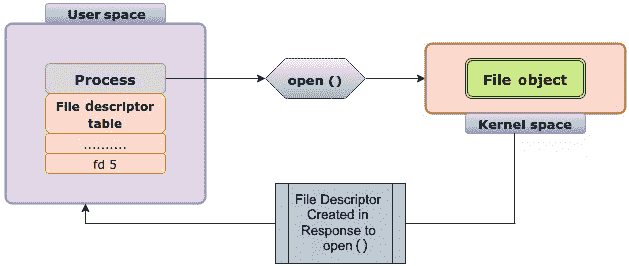
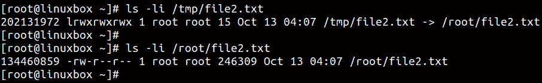

# 解释 VFS 中的数据结构

在本书的第一章中，我们详细介绍了**虚拟文件系统**（**VFS**），它最常见的功能、为何它是必要的以及它如何在实现 Linux 中的*一切皆文件*概念中发挥关键作用。我们还解释了 Linux 中的系统调用接口，以及用户空间应用程序如何使用通用系统调用与 VFS 进行交互。VFS 位于用户空间程序和实际文件系统之间，实施了一个通用的文件模型，使得应用程序能够使用统一的访问方式来执行操作，无论使用的是哪种文件系统。

在讨论不同的文件系统时，我们提到过 VFS 使用诸如 inode、超级块和目录项等结构来表示文件系统的通用视图。这些结构至关重要，因为它们确保了文件的元数据与实际数据之间的清晰区分。

本章将介绍内核 VFS 中的不同数据结构。你将了解内核如何使用诸如 inode 和目录项等结构来存储文件的元数据。你还将学习内核如何通过超级块结构记录文件系统的特性。最后，我们将解释 VFS 中的缓存机制。

我们将涵盖以下主要内容：

+   inode

+   超级块

+   目录项

+   文件对象

+   页面缓存

# 技术要求

拥有一定的 Linux 操作系统概念的理解会非常有帮助。这包括对文件系统、进程和内存管理的知识。本书不会创建任何新代码，但如果你想更深入地探索 Linux 内核，理解 C 编程概念对于理解 VFS 数据结构至关重要。作为一般规则，你应该养成查阅官方内核文档的习惯，因为它能提供有关内核内部工作机制的深入信息。

本章中介绍的命令和示例与发行版无关，可以在任何 Linux 操作系统上运行，例如 Debian、Ubuntu、Red Hat、Fedora 等等。文中有一些涉及内核源代码的参考。如果你想下载内核源代码，可以从[`www.kernel.org`](https://www.kernel.org)下载。本章和本书中提到的代码段来自内核 `5.19.9`。

# VFS 中的数据结构

VFS 使用多种数据结构来实现所有文件系统的通用抽象方法，并为用户空间程序提供文件系统接口。这些结构确保了文件系统设计和操作的某种共通性。要记住的一个重要点是，VFS 定义的所有方法并不一定适用于所有文件系统。是的，文件系统应遵循 VFS 中定义的结构，并在此基础上建立以确保它们之间的共通性。但是，在某些情况下，这些结构中可能有许多方法和字段对于特定文件系统是不适用的。在这种情况下，文件系统会根据其设计坚持使用相关字段，并且放弃多余的信息。因为我们将要解释常见的 VFS 数据结构，所以有必要查看内核中的相关代码片段以便澄清一些问题。尽管如此，我已尽力以一种通用的方式呈现材料，以便大多数概念即使没有开发对代码的理解也能被理解。

古希腊人相信四大元素构成了一切：土、水、空气和火。同样，以下结构构成了 VFS 的大部分内容：

+   索引节点

+   目录条目

+   文件对象

+   超级块

# Inodes – 索引文件和目录

在磁盘上存储数据时，Linux 遵循一个严格的规则：*封装之外的所有信息必须与封装内部的内容分开存放*。换句话说，描述文件的数据与文件中实际数据是隔离的。保存这些元数据的结构称为**索引节点**，简称**inode**。inode 结构包含 Linux 中文件和目录的元数据。文件或目录的名称仅是指向 inode 的指针，并且每个文件或目录恰好有一个 inode。

把“魔法地图”作为一个类比来考虑（*哈利·波特*，有人认为？）。地图显示了学校每个人的位置。每个人在地图上由一个点表示，当你点击这个点时，它会显示关于这个人的信息，如他们的姓名、位置和状态。把“魔法地图”想象成文件系统，把点代表的人想象成显示元数据的 inode。

但是，文件的元数据包括什么呢？当你通过`ls`命令简单列出文件时，你会看到许多信息，例如文件权限、所有权、时间戳等。所有这些细节构成了文件的元数据，因为它们描述了文件的某些属性，而不是其实际内容。

通过简单的`ls`命令可以检查一些文件元数据。尽管显示文件元数据的略微更好的命令是`stat`，因为它提供了关于文件属性的更多信息。例如，它显示访问、修改、更改时间戳，文件所在设备，驱动器上为文件保留的块数，以及文件的索引节点号。

如果要获取关于文件元数据的详细信息，如 `/etc/hosts`，我们可以使用以下 `stat` 命令：

```
stat /etc/hosts
```

注意 `/etc/hosts` 的索引节点号（`67118958`）在 `stat` 命令的输出中：

```
[root@linuxbox ~]# stat /etc/hosts
  File: /etc/hosts
  Size: 220             Blocks: 8          IO Block: 4096   regular file
Device: fd00h/64768d    Inode: 67118958    Links: 1
Access: (0644/-rw-r--r--)  Uid: (    0/    root)   Gid: (    0/    root)
Access: 2022-11-20 04:00:38.054988422 -0500
Modify: 2022-06-15 22:30:32.755324938 -0400
Change: 2022-06-15 22:30:32.755324938 -0400
Birth: 2022-06-15 22:30:32.755324938 -0400
[root@linuxbox ~]#
```

文件的索引节点号（inode number）作为文件的唯一标识符。例如，`find` 命令提供 `inum` 参数来通过索引节点号搜索文件：

```
find / -inum 67118958 -exec ls -l {} \;
```

如果我们通过 `stat` 命令检索到索引节点号，可以检索到相应的文件：

```
[root@linuxbox ~]# find / -inum 67118958 -exec ls -l {} \;
-rw-r--r-- 1 root root 220 Jun 15 22:30 /etc/hosts
[root@linuxbox ~]#
```

索引节点号仅在文件系统边界内唯一。如果系统上的目录（如 `/home` 和 `/tmp`）位于不同的磁盘分区和文件系统上，则同一索引节点号可能分配给每个文件系统中的不同文件：

```
[root@linuxbox ~]# ls -li /home/pokemon/pikachu 
134460858 -rw-r--r-- 1 root root 1472 Oct 11 05:10 /home/pokemon/pikachu
[root@linuxbox ~]# 
[root@linuxbox ~]# ls -li /tmp/bulbasaur
134460858 -rw-r--r-- 1 root root 259 Nov 20 04:36 /tmp/bulbasaur
[root@linuxbox ~]#
```

索引节点号在文件系统边界内的唯一性与 **链接** 的概念相关联。由于同一索引节点号可能由不同的文件系统使用，硬链接不跨文件系统边界。

## 在内核中定义索引节点

在内核源代码中，索引节点的定义位于 `linux/fs.h`。此定义中有无数个字段。请注意，此 **struct inode** 的定义是通用且包罗万象的。索引节点是特定于文件系统的属性。文件系统不必在其索引节点定义中定义所有这些字段。索引节点结构的定义相当长，因此我们将限制到一些基本字段：

```
struct inode {
        umode_t                 i_mode;
        unsigned short          i_opflags;
        kuid_t                  i_uid;
        kgid_t                  i_gid;
        unsigned int            i_flags;
        const struct inode_operations   *i_op;
        struct super_block      *i_sb;
[………………………...]
```

以下是一些定义：

+   `i_mapping`：这是一个指针，指向保存索引节点数据块映射的地址空间结构。当创建索引节点或从磁盘读取时，文件系统会初始化此字段。例如，当进程向文件写入数据时，内核使用此字段将适当的内存页面映射到文件的数据块中。（数据块在下一节中有解释。）

+   `i_uid` 和 `i_gid`：分别是用户和组的所有者。

+   `i_flags`：这定义了特定于文件系统的标志。

+   `i_acl`：这是用于文件系统访问控制列表的字段。

+   `i_op`：这指向索引节点操作结构，定义了可以对索引节点执行的所有操作，如创建、读取、写入和修改文件属性。

+   `i_sb`：这指向包含索引节点所在的底层文件系统的超级块结构。（有一个单独的主题来解释超级块结构。）

+   `i_rdev`：此字段存储某些特殊文件的设备号。例如，内核为系统中的硬盘和其他设备创建特殊文件。创建特殊文件时，内核为其分配唯一的设备号，创建设备的索引节点，并将此字段设置为指向设备的标识符。

+   `i_atime`、`i_mtime` 和 `i_ctime`：分别是访问时间、修改时间和更改时间戳。

+   `i_bytes`：文件中的字节数。

+   `i_blkbits`：此字段存储表示 inode 所属文件系统块大小所需的位数。

+   `i_blocks`：此字段存储 inode 所表示的文件使用的磁盘块的总数。

+   `i_fop`：这是指向与 inode 关联的文件操作结构的指针。例如，当进程打开文件时，内核使用这个字段获取该文件的文件操作结构的指针。然后它可以使用文件操作结构中定义的函数来对文件进行操作，比如读取或写入。

+   `i_count`：用于跟踪指向 inode 的活动引用次数。每当一个新进程访问一个文件时，这个计数器就会为该文件递增。如果这个字段的值为零，意味着没有更多的引用指向该 inode，此时可以安全地释放它。

+   `i_nlink`：此字段引用指向该 inode 的硬链接数量。

+   `i_io_list`：这是一个用于跟踪有待处理 I/O 请求的 inode 的列表。当内核将 I/O 请求添加到某个 inode 的队列时，该 inode 会被添加到这个列表中。当 I/O 请求完成后，inode 会从该列表中移除。

在 inode 结构的定义中大约有 50 个字段，因此我们这里只是略微触及了表面。但这应该可以让我们了解到，inode 定义的内容远不止文件的表层信息。如果你感到困惑，不用担心，我们会详细解释 inode。对于 inode 结构，有两种操作类型，它们分别由`file_operations`和`inode_operations`结构定义。稍后我们会在*文件对象 – 代表已打开文件*部分中稍微介绍一下`file_operations`结构。

## 定义 inode 操作

inode 操作结构包含一组函数指针，定义了文件系统如何与 inode 交互。每个文件系统都有自己的 inode 操作结构，在文件系统挂载时会注册到虚拟文件系统（VFS）。

`inode_operations`结构由`i_op`指针引用。还记得我们在*第一章*中解释的*一切皆文件*概念吗？*一切皆文件*，虽然是不同类型的文件，因此每个文件都会分配一个 inode。磁盘驱动器、磁盘分区、常规文本文件、文档、管道和套接字都有一个 inode。每个目录也有一个 inode。但所有这些*文件*的性质不同，并且在你的系统中代表不同的实体。例如，适用于目录的 inode 操作与常规文本文件不同。`inode_operations`结构提供了每种类型文件需要实现的所有函数，用于管理 inode 数据。

每个 inode 都与`inode_operations`结构的一个实例相关联，该结构提供了一组可以对 inode 执行的操作。该结构包含指向不同函数的指针，这些函数用于操作 inode：

```
struct inode_operations {
        struct dentry * (*lookup) (struct inode *,struct dentry *, unsigned int);
        const char * (*get_link) (struct dentry *, struct inode *, struct delayed_call *);
        int (*permission) (struct user_namespace *, struct inode *, int);
        struct posix_acl * (*get_acl)(struct inode *, int, bool);
        int (*readlink) (struct dentry *, char __user *,int);
        int (*create) (struct user_namespace *, struct inode *,struct dentry *, umode_t, bool);
        int (*link) (struct dentry *,struct inode *,struct dentry *);
        int (*unlink) (struct inode *,struct dentry *);
        int (*symlink) (struct user_namespace *, struct inode *,struct dentry *,
[……………………………………….]
```

一些可以通过该结构执行的重要操作在这里描述：

+   `lookup`：用于在目录中查找 inode 条目。它接受一个目录 inode 和文件名作为参数，返回一个指向与文件名对应的 inode 的指针。

+   `create`：当创建新文件或目录时调用此函数，它负责使用适当的元数据（如所有权和权限）初始化 inode。这用于响应`open ()`系统调用时构建 inode 对象。

+   `get_link`：用于操作符号链接。符号链接指向另一个 inode。

+   `permission`：当文件需要访问时，VFS 调用此函数来检查文件的访问权限。

+   `link`：这是响应`link ()`系统调用时调用的，它创建一个新的硬链接。它增加了 inode 的链接计数，并更新了其元数据。

+   `symlink`：这是响应`symlink ()`系统调用时调用的，它创建一个新的软链接。

+   `unlink`：这是响应`unlink ()`系统调用时调用的，用于删除文件链接。它减少 inode 的链接计数，并在链接计数为零时从磁盘中删除 inode。

+   `mkdir` 和 `rmdir`：这些是响应`mkdir ()`和`rmdir ()`系统调用时分别用于创建和删除目录的函数。

## 通过 inode 跟踪文件在磁盘上的数据。

由于系统中的每个文件都会有一些元数据，它将始终与一个 inode 相关联。由于每个 inode 都存储了一些信息，文件系统需要为它们预留一些空间，通常只有几个字节。例如，`Ext4`文件系统默认为单个 inode 使用 256 字节。文件系统维护一个**inode 表**来跟踪已用和空闲的 inode。

inode 结构中存在的字段提供了关于文件的以下两类信息：

+   **文件属性**：有关文件所有权、权限、时间戳、链接和使用的块数的详细信息。

+   **数据块**：指向磁盘上的数据块，实际文件内容存储的位置。

除了文件权限、所有权和时间戳外，inode 提供的另一个重要信息是实际数据在磁盘上的位置。文件的大小决定了它可能跨越多个磁盘块。inode 结构使用指针来追踪这些信息。为什么需要这样做呢？因为没有保证文件中的数据会以顺序或连续的方式存储和访问。inode 使用的指针通常为 4 字节大小，可以分为直接指针和间接指针。对于较小的文件，inode 包含指向文件数据块的直接指针。每个直接指针指向存储文件数据的磁盘地址。

使用直接指针来引用磁盘地址注定会有一个主要的局限性。问题是：多少个直接指针足够？文件大小可以从几个字节到几太字节不等。在结构中使用 15 个直接指针意味着，对于 4 KB 的块大小，我们最多只能指向 60 KB 的数据。当然，这在任何维度上都行不通，因为即使是小的文本文件也通常大于 60 KB。这在*图 2.1*中得到了展示：


图 2.1 – 使用直接指针时的限制：对于 4 KB 的块大小，仅能寻址 60 KB 的数据

为了解决这个问题，使用了间接指针。一个 inode 结构包含 12 个直接指针和 3 个间接指针。与直接指针不同，**间接指针**是指向指针块的指针。当所有直接指针用尽时，文件系统使用数据块来存储额外的指针。inode 中的倒霉的第 13 个或者单间接指针指向这个数据块。这个块中的指针指向实际包含文件数据的数据块。当文件大小无法通过单间接指针寻址时，就会使用双间接指针。**双间接指针**指向一个包含指向间接块的指针的块，每个间接块包含指向磁盘地址的指针。类似地，当文件的大小超出双间接指针的限制时——是的，你猜对了——**三重间接指针**被使用。

到这个时候，你可能已经头晕眼花，觉得根本没有意义（指针）。不用说，这整个层次结构相当复杂。一些现代文件系统利用了一种叫做**范围**（extents）的概念来存储更大的文件。我们将在讨论块文件系统时详细讲解这个概念，具体内容会在*第三章*，*探索 VFS 下的实际文件系统*中介绍。

现在，让我们简化这一点，并为自己指明正确的方向。我们将利用一些基础数学来解释间接指针如何帮助存储更大的文件。我们将考虑 4 KB 的块大小，因为这是大多数文件系统的默认设置：

+   一个 inode 中的总指针数量 = 15

+   直接指针的数量 = 12

+   间接指针的数量 = 1

+   双重间接指针的数量 = 1

+   三重间接指针的数量 = 1

+   每个指针的大小（直接或间接）= 4 字节

+   每个块的指针数量 = （块大小）/（指针大小）= （4 KB / 4）= 1,024 个指针

+   使用直接指针可以引用的最大文件大小 = 12 x 4 KB = 48 KB

+   使用 12 个直接指针和 1 个间接指针可以引用的最大文件大小 = [(12 x 4 KB) + (1,024 x 4 KB)] ≈ 4 MB

+   使用 12 个直接指针、1 个间接指针和 1 个双级间接指针可以引用的最大文件大小 = [(12 x 4 KB) + (1,024 x 4 KB) + (1,024 x 1,024 x 4 KB)] ≈ 4 GB

+   使用 12 个直接指针、1 个单级间接指针、1 个双级间接指针和 1 个三级间接指针可以引用的最大文件大小 = （12 x 4 KB）+ （1,024 x 4 KB）+ （1,024 x 1,024 x 4 KB）+ （1 x 1,024 x 1,024 x 1,024 x 4 KB）≈ 4 TB

以下图示展示了如何通过使用间接指针来帮助处理更大的文件：


图 2.2 – inode 结构的可视化表示

如*图 2.2*所示，文件系统可能会为较小的文件使用单级间接块，然后对于较大的文件切换到双级间接块。使用间接 inode 指针有多个优点。首先，它消除了为了容纳大文件而需要连续存储分配的需求，从而使文件系统能够有效地处理这些文件。其次，它有助于高效的空间利用，因为可以根据需要为文件分配块，而不是预先保留大量空间。每个 inode 通常有 12 个直接块指针，1 个单级间接块指针，1 个双级间接块指针和 1 个三级间接块指针。

## 文件系统会耗尽 inode 吗？

在管理存储时，保持空间可用是一个主要关注点。磁盘空间耗尽是常见的情况。每个文件和目录都分配了一个 inode，但如果所有的 inode 都已分配了怎么办？这不太可能发生，因为文件系统通常有数百万个可用的 inode。但是，是的，文件系统确实有可能耗尽 inode。如果发生这种情况，磁盘上可用的空间将无济于事，因为文件系统将无法创建任何新文件。文件系统创建后，inode 的数量无法扩展，因此备份将是唯一的选择。你可以使用 `df` 命令检查已挂载文件系统的 inode 使用情况：

```
df -Thi
```

*Figure 2**.3*图示了这种情况。挂载在`/ford`上的文件系统有接近 40%的剩余空间，但由于已经耗尽了 630 万个索引节点，无法创建任何新文件。


图 2.3 – 文件系统可能耗尽索引节点

让我们用几个关键的索引节点指针来总结我们的讨论：

+   除了元数据外，索引节点还保存文件在物理磁盘上存储位置的信息。为了追踪文件的物理位置，索引节点使用多个直接和间接指针。

+   索引节点存储在磁盘上的文件系统结构中的索引节点表中。当需要打开一个文件时，相应的索引节点被加载到内存中。

+   对于仅在内存中生成其内容的文件系统（如`procfs`和`sysfs`），它们的索引节点仅存在于内存中。

+   虽然索引节点存储了关于文件的大量元数据，但它们不存储文件的名称。因此，索引节点结构中不包括文件内容和文件名。

+   索引节点使用 15 个指针来追踪文件在磁盘上的数据块。前 12 个指针是直接指针，只能寻址最大 48 KB 的文件大小。剩余的三个指针提供单一、双重和三重间接。通过使用这些间接指针，可以寻址大文件。

+   如果文件系统的索引节点用完，就无法在其上创建新文件。这种情况非常罕见，因为文件系统通常拥有数量庞大的索引节点，数量可达数百万。

# 目录条目 – 将索引节点映射到文件名

目录充当用户文件的目录或容器。适用于目录的操作与常规文件不同。有不同的命令用于处理目录。文件始终位于一个目录中，并且要访问该文件，需要以目录的绝对或相对路径指定。但是像 Linux 中的大多数事物一样，目录也被视为文件。那么这一切是如何工作的呢？

本地 Linux 文件系统将目录视为文件并像文件一样存储它们。像所有常规文件一样，目录也分配了一个索引节点。目录索引节点和文件之间有一个区别。在目录的情况下，索引节点中的**类型**字段是**目录**。请记住，从我们关于索引节点的讨论中得知，索引节点包含了关于文件的大量元数据，但它不包含文件名。文件名存在于目录中。可以将目录视为包含表格的特殊文件。该表格包含文件名及其相应的索引节点号。

当尝试访问文件时，进程必须遍历分层目录结构。该结构中的每个级别定义了绝对或相对路径，可以是`/etc/ssh/sshd_config`绝对路径，也可以是`ssh/sshd_config`相对路径。相对路径名中没有前导的`/`。

*完全限定的*，*将名称映射到数字*，注意这听起来有点像名称解析的概念。在描述 inode 时，我们用了 DNS 的类比，这里也将继续使用这个类比。就像常规的 DNS 记录将网站名称映射到 IP 地址，目录将所有文件名映射到对应的 inode 编号。文件名和 inode 之间的这种组合被称为 **链接**。链接的概念将在本章末尾解释。

如果你喜欢用流行文化的参考，想象一下 *星际大战* 中的星图。为了前往特定的星球，角色们会查阅星图来找到正确的位置。将星图想象为一个目录，每个星球则是一个文件或子目录。星图列出了每个星球的确切位置和坐标，就像目录列出了每个文件的 inode 编号和位置。

这种映射在执行查找操作时非常有用。查找路径名是一个以目录为中心的操作，因为文件总是存在于目录内。对于查找路径名，VFS 使用目录条目，也就是 `dentry objects`。`dentry objects` 负责在内存中表示目录。当遍历路径时，每个组件都被视为一个 `dentry object`。以 `/etc/hosts` 文件为例，`/etc` 目录和 `hosts` 文件都被视为 `dentry objects`，并映射到内存中。这有助于缓存 `lookup` 操作的结果，从而加快查找路径名时的整体性能。

考虑以下示例：在 `/` 分区中有一个 `/cars` 目录，里面有三个文件：`McLaren`、`Porsche` 和 `Lamborghini`。以下步骤提供了当进程想要访问 `/cars` 目录中的 McLaren 文件时发生的简化版事件：

+   VFS 会将路径重构为 `dentry object`。

+   对路径名中的每个组件都会创建一个 `dentry object`。VFS 将跟踪每个目录条目以进行路径解析。对于查找 `/cars/McLaren`，将为 `/`、`cars` 和 `McLaren` 分别创建独立的 `dentry objects`。

+   由于我们的进程已经指定了绝对路径，VFS 将从路径名中的第一个组件开始，即 `/`，然后继续处理子对象。

+   VFS 将检查 inode 上的相关权限，查看调用进程是否具有所需的权限。

+   VFS 还会计算 `dentry objects` 的哈希值，并将其与哈希表中的值进行比较。

+   `/` 目录包含文件和子目录与其对应的 inode 编号的映射。一旦 `/cars` 的 inode 被检索到，内核就可以使用块指针查看该目录的磁盘上的内容。

+   `/cars`目录将包含三个文件（`McLaren`、`Porsche`和`Lamborghini`）与它们的 inode 号之间的映射。从这里，我们可以使用`McLaren`的 inode，它将指向包含文件数据的磁盘数据块。

重要的是要知道，通过`dentry 对象`表示目录仅存在于内存中。它们不会被存储在磁盘上。这些对象是由 VFS 动态创建的：


图 2.4 – 目录与 inode 之间的交换

目光敏锐的读者可能会想，我们是如何知道`/`目录的 inode 的？大多数文件系统从`2`开始分配 inode 值。inode 号`0`未被使用。inode 号`1`用于跟踪物理磁盘上的坏块和损坏的块。因此，文件系统中的 inode 分配从`2`开始，文件系统的根目录总是被分配 inode 号`2`。

## Dentry 缓存

在性能方面，路径名遍历和目录查找可能是昂贵的操作，尤其是在需要解析多个递归路径时。一旦路径被解析，且一个进程再次需要访问同一路径，VFS 必须重新执行整个操作，这是不必要的。此外，还依赖于底层存储介质：它能多快地检索所需信息。这会拖慢操作速度。

我们再次使用我们的比喻——DNS。当一个 DNS 客户端执行相同的 DNS 查询时，客户端的本地 DNS 服务器会缓存查询结果。这样做是为了确保对于任何相同的请求，DNS 服务器不必遍历整个 DNS 服务器层级。类似地，为了加速路径名查找过程，内核使用**目录项缓存**。经常访问的路径名会被保存在内存中，以加速查找过程。这可以节省大量不必要的 I/O 请求，避免对底层文件系统造成负担。dentry 缓存在文件名查找操作中起着关键作用。

目录将文件名映射到 inode。你可能会问，如果 dentry 对象创建了目录的内存表示，并且查找操作的结果被缓存，这是否意味着对应的 inode 也被缓存？答案是肯定的。没有必要只缓存一个而不缓存另一个。如果目录项被缓存，相应的 inode 也会被缓存。dentry 对象将对应的 inode 固定在内存中，并且它们会一直驻留在内存中，直到 dentry 对象被释放。

Dentry 对象在`include/linux/dcache.h`文件中定义：

```
struct dentry {
        unsigned int d_flags;           /* protected by d_lock */
        seqcount_spinlock_t d_seq;      /* per dentry seqlock */
        struct hlist_bl_node d_hash;    /* lookup hash list */
        struct dentry *d_parent;        /* parent directory */
        struct qstr d_name;
        struct inode *d_inode;          /* Where the name belongs to – NU
[…………..]
```

这里描述了一些常用的术语：

+   `d_name`：该字段包含指向`struct qstr`对象的指针，表示文件或目录的名称。`qstr`对象是内核用于表示字符串或字符序列的结构体。

+   `d_parent`：此字段包含指向与目录项相关联的文件或目录的父目录的指针。

+   `d_inode`：此字段是指向文件或目录的`struct inode`对象的指针。

+   `d_lock`：此字段包含一个自旋锁，用于保护对`struct dentry`对象的访问。`dentry`和`inode`对象通常被多个进程共享，这些进程打开相同的文件或目录。`d_lock`字段保护这些对象，避免并发修改，防止导致文件系统数据不一致或损坏。

+   `d_op`：此字段包含指向`struct dentry_operations`结构的指针，该结构包含一组函数指针，用于定义可以对`dentry`对象执行的操作。

+   `d_sb`：这是指向`struct super_block`结构的指针，该结构定义了目录项所属的文件系统的超级块。

缓存通过哈希表在内存中表示。哈希表结构中的每个条目指向具有相同哈希值的目录缓存条目列表。当一个进程尝试访问文件或目录时，内核会使用文件或目录名称作为键，在 dentry 缓存中查找对应的目录项。如果在缓存中找到该条目，它将返回给调用进程。如果未找到该条目，内核必须访问磁盘并执行 I/O 操作，从文件系统中读取目录项。

## Dentry 状态

Dentry 对象通常处于以下三种状态之一：

+   **已使用**：已使用的 dentry 表示一个当前被 VFS 使用的 dentry 对象，并表明与之关联的 inode 结构有效。这意味着一个进程正在积极使用这个条目。

+   **未使用**：未使用的条目也与有效的 inode 关联，但它没有被 VFS 使用。如果再次执行与此条目相关的路径查找操作，可以使用这个缓存的条目来完成该操作。如果需要回收内存，则可以处理该条目。

+   **负值**：负值状态有点特殊，它表示一个查找操作失败的情况。例如，如果要访问的文件已经被删除，或者路径名根本不存在，通常会返回**没有此文件或目录**的消息给调用进程。由于此查找失败，VFS 将创建一个负值 dentry。过多的查找失败可能会创建不必要的负值 dentry，从而对性能产生不利影响。

## Dentry 操作

可以对 dentry 对象执行的各种文件系统相关操作由`dentry_operations`结构定义：

```
struct dentry_operations {
        int (*d_revalidate)(struct dentry *, unsigned int);
        int (*d_weak_revalidate)(struct dentry *, unsigned int);
        int (*d_hash)(const struct dentry *, struct qstr *);
        int (*d_compare)(const struct dentry *, unsigned int, const char *, const struct qstr *);
        int (*d_delete)(const struct dentry *);
        int (*d_init)(struct dentry *);
        void (*d_release)(struct dentry *);
        void (*d_prune)(struct dentry *);
        [……………………….]
```

下面描述了一些重要的操作：

+   `d_revalidate`：目录项缓存中的 dentry 对象可能会与磁盘上的数据不同步，尤其在网络文件系统中常见。内核依赖网络来获取磁盘结构的信息。在这种情况下，VFS 使用 `d_revalidate` 操作来重新验证一个 dentry。

+   `d_weak_revalidate`：当路径查找操作结束时，dentry 不是通过父目录查找得到的，VFS 会调用 `d_weak_revalidate` 操作。

+   `d_hash`：用于计算 dentry 的哈希值。它以一个 dentry 作为输入，返回一个哈希值，用于在目录缓存中查找该 dentry。

+   `d_compare`：用于比较两个 dentry 的文件名。它接受两个 dentry 作为参数，如果它们指向同一个文件或目录，返回 `true`；如果它们不同，则返回 `false`。

+   `d_init`：在初始化一个 `dentry 对象` 时调用。

+   `d_release`：当一个 dentry 需要被释放时调用。它释放 dentry 占用的内存以及任何相关资源，例如缓存的数据。

+   `d_iput`：当一个 dentry 对象失去其 inode 时调用。这个操作在 `d_release` 之前被调用。

+   `d_dname`：用于为伪文件系统（如 `procfs` 和 `sysfs`）生成路径名。

让我们总结一下关于目录项的讨论：

+   Linux 将目录视为文件。目录也会分配一个 inode。文件的名称存储在目录中。

+   文件和目录的 inode 之间的区别在于它们对应磁盘块的内容。目录的磁盘数据包含文件名及其 inode 编号的映射。

+   目录在内存中通过 dentry 对象表示。dentry 对象由 VFS 在内存中创建，并不会存储在物理磁盘上。

+   为了优化查找操作，使用了目录项缓存（dentry cache）。dentry 缓存将最近访问过的路径名及其 inode 保存在内存中。

# 文件对象 – 代表已打开的文件

类似于 dentry 对象，`read` 和 `write`。这些操作的背后思想是确保用户空间程序不必关心文件系统及其数据结构。

当应用程序发起系统调用访问文件时（如 `open()`），会在内存中创建一个文件对象。同样，当应用程序不再需要访问该文件并决定使用 `close()` 关闭文件时，文件对象将被丢弃。需要注意的是，VFS 可以为一个特定的文件创建多个文件对象，因为对特定文件的访问不限于单个进程；一个文件可以被多个进程同时打开。因此，文件对象是由每个进程私有使用的。

以下是 inode 和文件对象在内核中使用方式的一些不同之处：

+   文件对象和 inode 一起使用，当进程需要访问文件时。

+   要访问文件的 inode，进程需要一个指向文件 inode 的文件对象。文件对象属于单个进程，而 inode 可以被多个进程使用。

+   每当文件被打开时，都会创建一个文件对象。当另一个进程想要访问相同的文件时，会创建一个新的文件对象，这个文件对象是该进程私有的。因此，我们可以说每个打开的文件都会有一个文件对象。但每个文件始终只有一个 inode。

+   当进程关闭文件时，相应的文件对象将被销毁，但其 inode 可能仍然保留在缓存中。

文件对象和用于访问文件的另一个类似实体之间可能会有些混淆，进程通过`open()`系统调用通常会返回一个文件描述符，进程用它来访问文件。从某种程度上讲，文件描述符也能说明进程与文件之间的关系。那么，它们有什么区别呢？从字面上看，文件对象提供的是**打开文件描述**。文件对象将包含与文件描述符相关的所有数据。文件描述符是用户空间对内核对象的引用。文件对象将包含诸如表示当前文件位置的文件指针以及文件是如何打开的信息：



图 2.5 – 文件对象是由 open()函数创建的结果

文件对象的定义出现在`include/linux/fs.h`中。该结构体存储了进程与已打开文件之间关系的信息。`f_inode`指针指向文件的 inode：

```
struct file {
        union {
                struct llist_node       fu_llist;
                struct rcu_head         fu_rcuhead;
        } f_u;
        struct path             f_path;
        struct inode            *f_inode;       /* cached value */
        const struct file_operations    *f_op;
[……..]
```

这里描述了一些重要字段：

+   `f_path`：此字段表示与打开文件关联的文件的目录路径。当文件被打开时，VFS 会创建一个新的`struct file`对象，并将其`f_path`字段初始化为指向文件的目录路径。

+   `f_inode`：这是一个指向表示与`struct file`对象关联的文件的`struct inode`对象的指针。

+   `f_op`：这是一个指向`struct file_operations`对象的指针，该对象包含用于文件操作的一组函数指针。

+   `f_lock`：此字段用于确保不同线程之间对同一文件对象的访问同步。

## 定义文件操作

与其他结构体一样，适用于文件对象的文件系统方法在`file_operations`表中定义。`f_op`指针指向`file_operations`表。VFS 为所有文件系统实现了一个通用接口，连接到底层文件系统的实际机制：

```
struct file_operations {
        struct module *owner;
        loff_t (*llseek) (struct file *, loff_t, int);
        ssize_t (*read) (struct file *, char __user *, size_t, loff_t *);
        ssize_t (*write) (struct file *, const char __user *, size_t, loff_t *);
        ssize_t (*read_iter) (struct kiocb *, struct iov_iter *);
        ssize_t (*write_iter) (struct kiocb *, struct iov_iter *);
        int (*iopoll)(struct kiocb *kiocb, struct io_comp_batch *, unsigned int flags);
        int (*iterate) (struct file *, struct dir_context *);
        int (*iterate_shared) (struct file *, struct dir_context *);
        __poll_t (*poll) (struct file *, struct poll_table_struct *);
        long (*unlocked_ioctl) (struct file *, unsigned int, unsigned long);
        long (*compat_ioctl) (struct file *, unsigned int, unsigned long);
        int (*mmap) (struct file *, struct vm_area_struct *);
[………………]
```

这里定义的操作看起来与我们在*第一章*中描述的通用系统调用非常相似：

+   `llseek`：当 VFS 需要移动文件位置索引时会调用此函数。

+   `read`：这是由`read()`及相关系统调用调用的函数。

+   `open`：当需要打开文件（inode）时调用此操作。

+   `write`：此操作由`write()`及相关系统调用触发。

+   `release`：当一个打开的文件正在被关闭时调用此操作。

+   `map`：当进程通过`mmap()`系统调用希望将文件映射到内存时，会调用此操作。

这些是通用操作，并不是所有操作都可以应用于单一文件。归根结底，由各个文件系统来选择适用哪些操作。如果某个特定方法不适用于某个文件系统，则可以简单地设置为`NULL`。

## 进程会耗尽文件描述符吗？

内核会强制限制每次可以打开的最大进程数。这些限制可以在用户、组或全局系统级别应用。如果所有的文件描述符都已分配，进程将无法打开更多的文件。许多大型应用程序需要的文件描述符数量远超默认的限制。在这种情况下，单个用户的限制可以在`/etc/security/limits.conf`文件中进行设置。对于系统级设置，可以使用`sysctl`命令：


图 2.6 – 打开的文件过多会破坏应用程序

在我们到达打开文件的限制之前，让我们总结一下我们的讨论：

+   文件对象是一个内存中的打开文件表示，且没有任何对应的磁盘映像。

+   文件对象是在进程通过`open()`系统调用响应时创建的。

+   文件对象是进程私有的。由于多个进程可以访问同一个文件，VFS 会为每个文件创建多个文件对象。

# 超级块 – 描述文件系统元数据

如果你曾通过在块设备上运行`mkfs`创建文件系统，可能会在输出中看到**超级块**一词。超级块是 Linux 用户较为熟悉的结构之一。你可能注意到，VFS 中使用的结构彼此相似。目录项（Dentry）和文件对象分别存储目录和打开文件的内存表示。两个结构都没有磁盘映像，仅存在于内存中。类似地，超级块结构与 inode 有很多相似之处。inode 存储文件的元数据，而超级块存储文件系统的元数据。

以一个图书馆目录系统为例，该系统记录了书籍的标题、作者以及它们在书架上的位置。如果目录系统丢失或损坏，可能很难在图书馆中找到并取回特定的书籍。同样，如果内核中的超级块结构被破坏或损坏，可能会导致数据丢失或文件系统错误。

就像每个文件都有一个分配给它的 inode 编号一样，每个文件系统也有一个对应的超级块结构。与 inode 类似，超级块也有其磁盘映像。对于那些动态生成内容的文件系统，如 `procfs` 和 `sysfs`，它们的超级块结构仅存储在内存中。当文件系统需要挂载时，超级块是第一个被读取的结构。类似地，当文件系统被挂载后，关于已挂载文件系统的信息会存储在超级块中。

文件系统的超级块包含有关文件系统的复杂信息，如总块数、已用块数、未用块数、空闲块数、文件系统状态和类型、inode 等等。随着文件系统的变化，存储在超级块中的信息会被更新。由于在挂载文件系统时会读取超级块，因此我们需要思考，如果存储在超级块中的信息被擦除或损坏会发生什么。简而言之，文件系统没有超级块是无法挂载的。鉴于其关键性质，超级块的多个副本会保存在不同的磁盘位置。若主超级块损坏，文件系统可以通过任何一个备份超级块进行挂载。

超级块结构在 `include/linux/fs.h` 中定义。`s_list` 包含指向已挂载超级块的指针，`s_dev` 用于标识设备。超级块操作在 `super_operations` 表中定义，由 `s_op` 指针指向：

```
struct super_block {
        struct list_head        s_list;         /* Keep this first */
        dev_t                   s_dev;          /* search index; _not_ kdev_t */
        unsigned char           s_blocksize_bits;
        unsigned long           s_blocksize;
        loff_t                  s_maxbytes;     /* Max file size */
        struct file_system_type *s_type;
        const struct super_operations   *s_op;
        const struct dquot_operations   *dq_op;
        const struct quotactl_ops       *s_qcop;
        const struct export_operations *s_export_op;
[…………………………] 
```

超级块结构中的一些重要字段如下所述：

+   `s_list`：该字段用于维护当前挂载的所有文件系统的列表。

+   `s_dev`：该字段指定与文件系统根目录 inode 对应的设备编号。用于识别文件系统所在的设备。

+   `s_type`：该字段指向用于解释文件系统中存储数据的特定文件系统的定义。例如，如果该字段指向 XFS 文件系统，内核便知道需要使用 XFS 特定的函数与文件系统进行交互。

+   `s_root`：该字段由内核在挂载文件系统时用于定位根目录。一旦根目录被识别，便可以遍历目录树，访问文件系统中的其他文件和目录。

+   `s_magic`：该字段用于标识特定设备或分区上的文件系统类型。

同样，由于字段数量众多，因此不可能逐一解释所有字段。有些字段是简单的整数，而另一些则有更为复杂的数据结构和函数指针。

## 内核中的超级块操作

与所有 VFS 结构一样，`include/linux/fs.h` 中的所有超级块操作对于文件系统来说并不是强制的。内核将文件系统超级块的副本保存在内存中。当文件系统发生变化时，超级块中的信息会在内存中更新。因此，内存中的超级块副本被标记为 `脏`，因为内核需要将更新后的信息写入磁盘上的超级块：

```
struct super_operations {
        struct inode *(*alloc_inode)(struct super_block *sb);
        void (*destroy_inode)(struct inode *);
        void (*free_inode)(struct inode *);
        void (*dirty_inode) (struct inode *, int flags);
        int (*write_inode) (struct inode *, struct writeback_control *wbc);
        int (*drop_inode) (struct inode *);
        void (*evict_inode) (struct inode *);
        void (*put_super) (struct super_block *);
        int (*sync_fs)(struct super_block *sb, int wait);
        int (*freeze_super) (struct super_block *);
[………………………..]
```

一些重要的方法定义如下：

+   `alloc_inode`：调用此方法以初始化并分配 `struct inode` 的内存。

+   `destroy_inode`：此方法由 `destroy_inode()` 调用，用于释放分配给 `struct inode` 的资源。

+   `dirty_inode`：VFS 调用此方法将 inode 标记为 `脏`。

+   `write_inode`：当 VFS 需要将 inode 写入磁盘时调用此方法。

+   `delete_inode`：当 VFS 想要删除 inode 时调用此方法。

+   `sync_fs`：当 VFS 正在写出所有与超级块相关的 `脏` 数据时调用此方法。

+   `statfs`：当 VFS 需要获取文件系统统计信息（例如文件系统的大小、可用空间和 inode 数量）时调用此方法。

+   `umount_begin`：当 VFS 卸载文件系统时调用此方法。

让我们总结一下：

+   超级块结构记录了所有文件系统特性。

+   超级块结构在挂载和卸载文件系统时被读取。文件系统会在多个磁盘位置保存超级块的副本。

## 链接

在我们讨论目录条目时，提到了**链接**操作。链接有两种类型：符号链接（或软链接）和硬链接，正如大多数用户所知道的那样。符号（软）链接表现为快捷方式，尽管存在一些微妙的差异。**软链接**指向包含数据的路径，而**硬链接**指向数据本身。

再往回一点，inode 中不包含文件的名称。文件名包含在目录中。这意味着在目录列表中可以有多个文件名，它们都指向相同的 inode。硬链接正是利用了这一逻辑。硬链接指向文件的 inode。这意味着链接和文件是不可区分的，因为它们都指向相同的 inode。过一段时间后，你甚至可能无法分辨哪个是原始文件：


图 2.7 – 无法判断哪个是原始文件，因为它们有相同的 inode。

相反，符号链接与原始文件的 inode 编号不同。注意这个符号链接指向原始文件，并在文件的权限部分显示出`l`：



图 2.8 – 对于软链接，文件权限中的第一个字符是“l”。

对多个文件使用相同的 inode 编号会导致一些限制。由于 inode 编号仅在单一文件系统内唯一，因此硬链接不能跨文件系统边界存在。它们只能存在于同一文件系统中。硬链接仅能用于常规文件，而不能用于目录。这是为了防止破坏文件系统结构。硬链接到目录可能会创建一个无限循环结构。

## 总结四个结构

我们在这里讨论的一些概念，等到在*第三章*中讨论块文件系统时，可能会变得更加清晰，*探索 VFS 下的实际文件系统*。不过我们已经对 VFS 如何构建抽象网络有所了解。

如在*第一章*中讨论的，VFS 的设计偏向于源自 Linux 系列的文件系统。大多数非本地文件系统并不使用 inode、超级块、文件和目录对象的概念。为了为它们实现通用的文件模型，VFS 在内存中创建了这些结构。因此，像 inode 和超级块这样的对象，在本地文件系统中可能既存在于磁盘上也存在于内存中，而在非本地文件系统中可能仅存在于内存中。由于非本地文件系统设计的不同，它们可能不支持一些 Linux 中常见的文件系统操作，如符号链接。

以下表格提供了主要 VFS 结构的简要总结：

| **结构** | **描述** | **存储位置** **磁盘/内存** |
| --- | --- | --- |
| Inode | 包含除文件名以外的所有文件元数据 | 存储在磁盘和内存中 |
| Dentry | 表示目录项与文件之间的关系 | 仅在内存中 |
| 文件对象 | 存储进程与打开文件之间关系的信息 | 仅在内存中 |
| 超级块 | 保存文件系统特征和元数据 | 存储在磁盘和内存中 |

表 2.1 – 总结主要 VFS 数据结构

下图展示了进程如何打开存储在磁盘上的文件：


图 2.9 – 常见 VFS 结构之间的关系

请记住，超级块结构是在文件系统挂载过程中创建和初始化的，它包含指向根目录项的指针，而根目录项又包含指向表示文件系统根目录的 inode 的指针。

当进程调用 `open()` 系统调用打开文件时，VFS 创建一个 `struct file` 对象来表示进程地址空间中的文件，并初始化其 `f_path` 字段，指向文件的目录路径。`struct dentry` 对象包含指向 `struct inode` 对象的指针，后者表示文件的磁盘 inode。

`struct inode` 对象与 `struct super_block` 对象相关联，后者代表了磁盘上的文件系统。`struct super_block` 对象包含指向文件系统特定功能的指针，这些功能在 `struct super_operations` 结构中定义，并由 VFS 用于与文件系统交互。

## 页面缓存

Linux 中用于定义不同概念和术语的命名法有些奇怪。用于创建文件的系统调用被称为 `creat`。Unix 的创始人 Ken Thompson 曾开玩笑地说，`creat` 中缺失的 *e* 是他在 Unix 设计中最大的遗憾。在解释 VFS 结构的一些操作时，使用了 *dirty* 这个词。Linux 中为何以及如何使用这个术语，没人知道。这里的 *dirty* 指的是那些已经被修改但尚未 *flush* 到磁盘的内存页面。

缓存是硬件和软件应用程序中常用的提高性能的做法。在硬件方面，CPU、内存子系统和物理磁盘的速度与性能是相互关联的。CPU 的速度远远快于内存子系统，而内存子系统又比物理磁盘更快。这种速度差异可能导致在等待内存或磁盘响应时浪费 CPU 周期。

为了解决这个问题，CPU 中增加了缓存层，用来存储从主内存中频繁访问的数据。这样，只要所需的数据在缓存中可用，CPU 就能够以其自然速度运行。同样，软件应用程序也使用缓存，将频繁访问的数据或指令存储在更快、更易访问的位置，以提高性能。

Linux 的设计以性能为导向，而页面缓存在确保这一点上发挥了至关重要的作用。页面缓存的主要目的是通过确保数据保存在内存中（前提是有足够的可用空间），从而减少频繁访问底层物理磁盘的时间，以提高 `read` 和 `write` 操作的延迟。所有这些都有助于提升性能，因为磁盘访问速度远低于内存。

操作系统与硬件在更低层次进行交互，并使用不同的单位来管理和利用可用资源。例如，文件系统将磁盘空间划分为块，这是比单个字节或比特更高级的抽象。这是因为在字节或比特级别管理数据可能非常复杂且耗时。页面是内核中内存的基本单位，默认大小为 4 KB。这一点非常重要，因为所有的 I/O 操作都是以一定数量的页面为单位进行对齐的。下图总结了如何通过页面缓存从磁盘读取和写入数据：


图 2.10 – 通过页面缓存提高 I/O 性能

*图 2.10* 重点展示了页面缓存如何通过在内存中缓存频繁访问的文件数据，从而减少磁盘访问并提高系统性能，进而改善读写性能。

## 读取

以下几点简要总结了当用户空间中的进程请求从磁盘读取数据时会发生的情况：

1.  内核首先检查所需的数据是否已经存在于缓存中。如果数据在缓存中找到了，内核可以避免执行任何磁盘操作，直接将请求的数据提供给进程。这种情况被称为**缓存命中**。

1.  如果请求的数据未能在缓存中找到，内核必须去底层磁盘进行操作。这被称为`读取`操作，从磁盘获取请求的数据，保存到缓存中，然后将其交给调用进程。

1.  如果之后有更多请求访问此页面，它们可以从页面缓存中获取。

1.  在请求的数据已在缓存中找到但已标记为`脏`的情况下，内核会先将其写回磁盘，然后再执行之前提到的过程。

类似地，当进程需要将数据写入磁盘时，会发生以下情况：

1.  内核更新映射到文件的页面缓存，并将数据标记为`脏`。尚未写入磁盘的页面被称为**脏页面**。

1.  内核不会立即将所有脏数据写入磁盘。根据内核刷写线程的配置，脏数据会被刷新到磁盘。

在`写入`请求完成后，内核会向调用进程发送确认消息。然而，它不会告知进程对应的脏页面何时会被实际写入磁盘。值得注意的是，这种异步处理使得写入操作比读取操作要快得多，因为内核避免了访问底层物理磁盘的操作。这也引出了一个问题：*如果我的 I/O 请求来自内存，在突发性断电的情况下，我的数据会怎么样？* 内存中的脏页面在一定时间后会被刷新到物理磁盘，这个过程称为`sysctl`，可以用来控制页面缓存的这一行为。

尽管页面缓存存在一定的风险，但毫无疑问它能提升性能。页面缓存的大小并非固定，而是动态变化的。页面缓存可以使用系统中可用的内存资源。然而，当系统中可用的空闲内存低于某个阈值时，刷新调度程序会启动并开始将页面缓存中的数据卸载到磁盘。

# 总结

Linux 文件系统的支持灵活性直接来源于 VFS 实现的一组抽象接口。在本章中，我们学习了 VFS 中的主要数据结构，以及它们如何协同工作。VFS 使用多个数据结构来实现不同原生和非原生文件系统的通用抽象方法。四个最常见的结构是 inode、目录项、文件对象和超级块。这些结构确保了不同文件系统在设计和操作上的一致性。由于 VFS 定义的方法是通用的，因此文件系统不必实现所有方法，尽管文件系统应该遵循 VFS 中定义的结构，并在其基础上构建，以确保保持通用接口。

除了文件系统抽象，VFS 还提供了许多缓存，以提高文件系统操作的性能，如目录项缓存和 inode 缓存。我们还解释了内核中页缓存的机制，并展示了它如何加速用户空间程序发出的读写请求。在 *第三章* 中，我们将探索 VFS 层下的实际文件系统。我们将介绍一些流行的 Linux 文件系统，主要是扩展文件系统以及它如何在磁盘上组织用户数据。我们还将解释与 Linux 中不同文件系统相关的一些常见概念，如日志记录、写时复制和用户空间中的文件系统。
