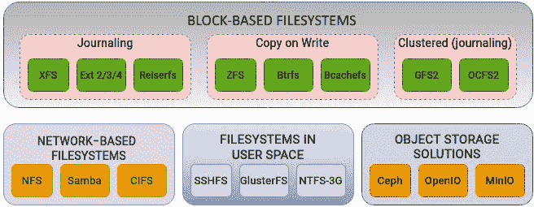
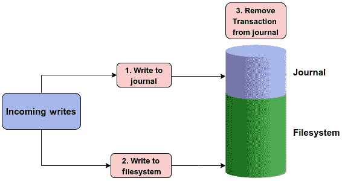
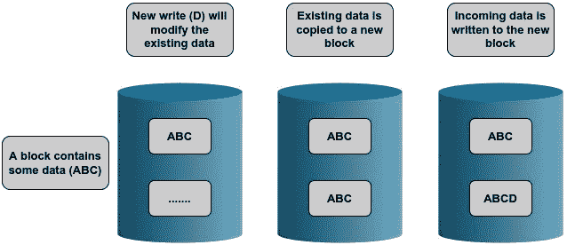
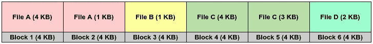
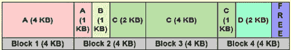
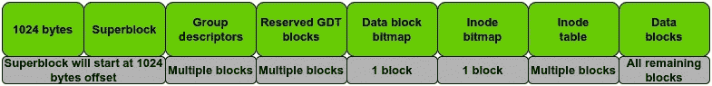
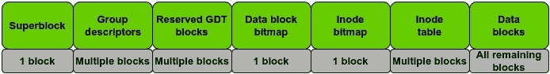
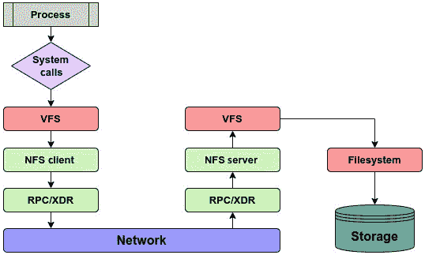
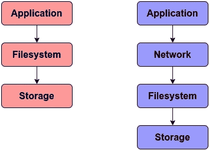
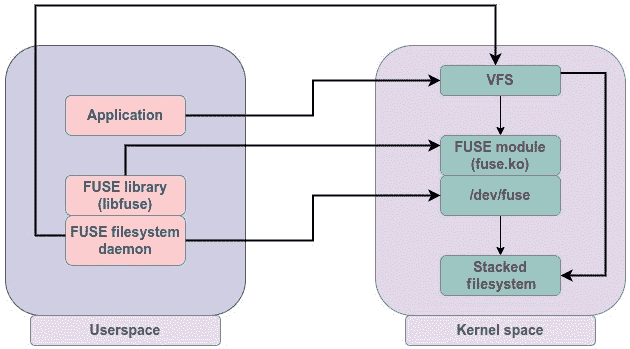

# 第三章：探索 VFS 下的实际文件系统

“不是所有的根都埋在地下，有些根在树顶。” — Jinvirle

内核的 I/O 栈可以分为三个主要部分：**虚拟文件系统**（**VFS**）、**块层**和**物理层**。Linux 支持的不同类型的文件系统可以视为 VFS 层的尾端。前两章使我们对 VFS 的角色、VFS 使用的主要结构以及它如何帮助终端用户进程通过通用文件模型与不同的文件系统交互有了一个不错的理解。这意味着，我们现在将能够以通常接受的方式使用 *文件系统* 这个词。终于。

在 *第二章* 中，我们定义并解释了 VFS 使用的一些重要数据结构，这些数据结构为不同的文件系统定义了一个通用框架。为了使某个特定的文件系统能够被内核支持，它应该在这个框架定义的边界内运行。但是，并非所有由 VFS 定义的方法都必须被文件系统使用。文件系统应遵循 VFS 中定义的结构并在此基础上进行扩展，以确保它们之间的通用性，但由于每个文件系统在组织数据方面的方式不同，这些结构中可能会有许多方法和字段对于某个特定文件系统并不适用。在这种情况下，文件系统根据其设计定义相关字段，省略不必要的信息。

如我们所见，VFS 位于用户空间程序与*实际*文件系统之间，并实现了一个通用文件模型，以便应用程序可以使用统一的访问方法来执行操作，而不管底层使用的是哪种文件系统。现在，我们将重点关注这个*三明治*的一个方面，即包含用户数据的文件系统。

本章将向你介绍一些在 Linux 中使用的更常见和流行的文件系统。我们将详细讨论扩展文件系统的工作原理，因为它是最常用的。我们还将介绍一些**网络文件系统**，并探讨与文件系统相关的一些重要概念，如日志记录、用户空间中的文件系统和**写时复制**（**CoW**）机制。

我们将覆盖以下主要主题：

+   日志记录的概念

+   CoW 机制

+   扩展文件系统家族

+   网络文件系统

+   用户空间中的文件系统

# 技术要求

本章完全聚焦于文件系统及相关概念。如果你有 Linux 存储管理经验，但尚未深入了解文件系统的内部工作原理，那么本章将成为一个宝贵的练习。了解文件系统概念的前置知识将有助于你更好地理解本章所涉及的内容。

本章中展示的命令和示例与发行版无关，可以在任何 Linux 操作系统上运行，如 Debian、Ubuntu、Red Hat、Fedora 等等。文中有一些关于内核源代码的参考。如果你想下载内核源代码，可以从[`www.kernel.org`](https://www.kernel.org)下载。本书中提到的代码片段来自内核 `5.19.9`。

# Linux 文件系统画廊

如前所述，使用 Linux 的一个主要好处是支持的文件系统种类繁多。内核对其中一些文件系统提供开箱即用的支持，如 XFS、Btrfs 和扩展文件系统 2、3 和 4 版本。这些被认为是**本地文件系统**，因为它们在设计时就考虑到了 Linux 的原则和理念。另一方面，像 NTFS 和 FAT 这样的文件系统可以被视为**非本地文件系统**。这是因为，尽管 Linux 内核能够理解这些文件系统，但它们通常需要额外的配置支持，因为它们不符合本地文件系统采用的约定。我们将重点讨论本地文件系统，并解释与它们相关的关键概念。

尽管每个文件系统都声称比其他文件系统更好、更快、更可靠和更安全，但需要注意的是，没有任何一个文件系统能够适用于所有类型的应用程序。每个文件系统都有其优点和局限性。从功能的角度来看，文件系统可以分类如下：



图 3.1 – Linux 文件系统画廊

*图 3.1* 展示了一些支持的文件系统及其各自的类别。由于 Linux 支持大量的文件系统，覆盖所有文件系统将占用我们太多空间（这是一个文件系统的双关语！）。尽管实现细节有所不同，但文件系统通常会利用一些常见的技术来进行内部操作。一些核心概念，如日志记录，在文件系统中更为常见。类似地，一些文件系统使用了流行的 CoW 技术，因此它们不需要日志记录。

让我们来解释文件系统中的日志记录概念。

# 文件系统的日志记录 – 日志记录的概念

文件系统使用复杂的结构来组织物理磁盘上的数据。在系统崩溃或突然故障的情况下，文件系统无法以优雅的方式完成其操作，这可能会损坏其组织结构。当系统下次启动时，用户需要对文件系统进行一致性或完整性检查，以检测和修复那些损坏的结构。

在 *第二章* 中解释 VFS 数据结构时，我们讨论了 Linux 遵循的一个基本原则——将元数据与实际数据分离。文件的元数据在一个独立的结构中定义，称为 **inode**。我们还看到，目录作为特殊文件来处理，并包含文件名到其 inode 编号的映射。记住这一点，假设我们正在创建一个简单的文件并向其中添加一些文本。为了实现这一点，内核需要执行以下操作：

1.  为要创建的文件创建并初始化一个新的 inode。一个 inode 在文件系统中应该是唯一的。

1.  更新文件所在目录的时间戳。

1.  更新目录的 inode。这是必需的，以便更新文件名到 inode 的映射关系。

即使是像文本文件创建这样简单的操作，内核也需要执行多个 I/O 操作以更新多个结构。假设在执行这些操作时，由于硬件或电力故障导致系统突然关闭。此时，创建新文件所需的所有操作都没有成功完成，这将导致文件系统结构不完整。如果文件的 inode 已初始化但未链接到包含该文件的目录，则该 inode 将被视为*孤立*的。一旦系统重新上线，文件系统将进行一致性检查，删除任何未链接到任何目录的 inode。系统崩溃后，文件系统本身可能保持完整，但个别文件可能会受到影响。在最坏的情况下，文件系统本身也可能会永久损坏。

为了提高文件系统在发生中断和系统崩溃时的可靠性，文件系统引入了日志功能。第一个支持此功能的文件系统是 IBM 的 **JFS**，即 **日志文件系统**。近年来，日志记录已成为文件系统设计中的重要组成部分。

文件系统日志功能的概念起源于数据库系统的设计。在大多数数据库中，日志记录保证了数据的一致性和完整性，以防事务因外部事件（如硬件故障）而失败。数据库日志会通过记录操作来跟踪未提交的更改。当系统重新上线时，数据库将使用日志进行恢复。文件系统的日志功能也遵循相同的方式。

任何需要在文件系统上执行的更改，首先会顺序地写入日志。这些更改或修改被称为事务。一旦事务被写入日志，它会被写入磁盘上的相应位置。如果发生系统崩溃，文件系统会回放日志，查看是否有任何事务未完成。当事务已写入磁盘上的位置后，它就会从日志中删除。

根据日志记录的方式，首先会将元数据或实际数据（或两者）写入日志。一旦数据被写入文件系统，事务就会从日志中删除：



图 3.2 – 文件系统中的日志记录

需要注意的是，默认情况下，文件系统日志也存储在同一文件系统中，尽管它被存储在一个隔离的区域。有些文件系统还允许将日志存储在独立的磁盘上。日志的大小通常只有几兆字节。

## 那个令人迫切想知道的问题——日志记录不会对性能产生负面影响吗？

日志记录的整个意义在于提高文件系统的可靠性，并在系统崩溃和硬件故障的情况下保护其结构。在启用日志记录的文件系统中，数据首先写入日志，然后再写入其指定的磁盘位置。显而易见，我们在到达目的地时增加了额外的步骤，因为我们需要将相同的数据写两次。这肯定会适得其反，破坏文件系统的性能吧？

这是一个看似答案显而易见，但实际上并非如此的问题。使用日志记录并不一定会导致文件系统性能下降。事实上，在大多数情况下，情况恰恰相反。某些工作负载下，两者之间的差异可能微不足道，但在大多数场景中，尤其是在元数据密集型的工作负载下，文件系统日志记录实际上可以提高性能。性能提升的程度可能有所不同。

考虑一个没有日志记录的文件系统。每次修改文件时，采取的自然行动是直接在磁盘上执行相关的修改。对于元数据密集型操作，这可能会对性能产生负面影响。例如，文件内容的修改还需要相应地更新文件的时间戳。这意味着每次处理和修改文件时，文件系统不仅需要更新实际的文件数据，还需要更新元数据。启用日志记录后，**对物理磁盘的查找次数较少**，因为数据仅在事务已提交到日志或日志已满时才会写入磁盘。另一个好处是日志中使用了顺序写入。在使用日志时，随机写操作会转化为顺序写操作。

在大多数情况下，性能的提升是通过取消元数据操作来实现的。当需要快速更新元数据时，比如递归地对目录及其内容进行操作，使用日志记录可以通过减少频繁的磁盘访问并在原子操作中执行多个更新来提高性能。

当然，文件系统如何实现日志记录在其中也起着重要作用。不同的文件系统在日志记录方面提供了不同的处理方式。例如，一些文件系统只记录文件的元数据，而另一些则在日志中同时记录元数据和实际数据。一些文件系统还提供灵活的处理方式，允许最终用户自行决定日志记录模式。

总结来说，日志记录是现代文件系统的重要组成部分，因为它确保即使在系统崩溃的情况下，文件系统仍然保持结构的完整性。

# CoW 文件系统的奇特情况

`fork()`系统调用。`fork()`系统调用通过复制调用进程来创建一个新进程。当使用`fork()`系统调用创建新进程时，父子进程之间会共享内存页面。只要页面被共享，它们就不能被修改。当父进程或子进程尝试修改页面时，内核会复制该页面并将其标记为可写。

在 Linux 中，长期存在的大多数文件系统在核心设计原则上采用了非常传统的方法。在过去的几年里，扩展文件系统的两个主要变化是使用日志记录和扩展（extents）。尽管已经采取了一些措施来扩展文件系统以适应现代应用，但一些关键领域如错误检测、快照和去重等却被忽略了。这些功能是当今企业存储环境中的需求。

使用 CoW（写时复制）方法的文件系统与其他文件系统有一个显著的不同。当在 Ext4 或 XFS 文件系统上覆盖数据时，新数据会写到现有数据上方。这意味着原始数据会被销毁。而使用 CoW 方法的文件系统则将旧数据复制到磁盘的其他位置，新的数据会写入这个新位置。因此，才有了*写时复制*这一术语。由于旧数据或其快照仍然存在，文件系统上的空间利用率会比用户预期的要高得多。这常常让新手用户感到困惑，可能需要一段时间才能适应。一些 Linux 用户对此有一种相当幽默的看法：*写时复制吃掉了我的数据*。如*图 3.3*所示，使用 CoW 方法的文件系统会将新数据写入新的块：



图 3.3 – 文件系统中的 CoW 方法

作为类比，我们可以将其与电影中的时间旅行概念进行粗略比较。当有人回到过去并对过去做出更改时，会创建一条平行时间线。这会产生与原始时间线不同的副本。CoW 文件系统的操作方式类似。当请求修改文件时，系统不会直接修改原始数据，而是创建数据的一个单独副本。原始数据保持不变，而修改后的版本则存储在另一个位置。

由于在此过程中保留了原始数据，这为我们开辟了一些有趣的方向。正因如此，在系统崩溃的情况下，文件系统恢复变得更加简化。数据的先前状态被保存在磁盘上的另一个位置。因此，如果发生故障，文件系统可以轻松恢复到先前的状态。这使得维护任何日志文件的需求变得多余。它还允许在文件系统级别实现快照。只有被修改的数据块才会被复制到新位置。当需要通过特定的快照恢复文件系统时，数据可以轻松地重建。

*表 3.1* 突出了日志文件系统和基于 CoW 文件系统之间的一些主要区别。请注意，这些功能的实现和可用性可能会根据文件系统类型的不同而有所变化：

|  | **日志文件系统** | **写时复制（CoW）** |
| --- | --- | --- |
| **写入处理** | 在应用更改之前，修改内容会先记录在日志中 | 创建数据的单独副本并进行修改 |
| **原始数据** | 原始数据会被覆盖 | 原始数据保持不变 |
| **数据一致性** | 通过记录元数据更改并在需要时重放日志来确保一致性 | 通过从不修改原始数据来确保一致性 |
| **性能** | 取决于日志模式的类型，通常只有最小的开销 | 由于写入速度更快，性能有所提升 |
| **空间利用率** | 日志大小通常为 MB，因此不需要额外的空间 | 由于需要为数据创建单独的副本，因此需要更多的空间 |
| **恢复时间** | 恢复时间较快，因为日志可以立即重放 | 恢复时间较慢，因为需要使用最近的副本重建数据 |
| **功能** | 不支持如压缩或去重等功能 | 内建支持压缩和去重功能 |

表 3.1 – CoW 与日志文件系统之间的区别

使用基于 CoW（写时复制）方法来组织数据的文件系统包括**Zettabyte 文件系统**（**ZFS**）、**B 树文件系统**（**Btrfs**）和 Bcachefs。ZFS 最初在 Solaris 上使用，并因其强大的功能迅速获得了广泛的应用。尽管由于许可问题未能纳入内核，但它已经通过*ZFS on Linux*项目移植到了 Linux 上。Bcachefs 文件系统是从内核的块缓存代码开发而来的，并且正迅速获得流行。它可能会成为未来内核发布的一部分。Btrfs，也被亲切地称为 ButterFS，直接受 ZFS 启发。不幸的是，由于早期版本中的一些 bug，它在 Linux 社区的采用进程放缓。然而，它一直在积极开发，并且已经成为 Linux 内核的一部分超过十年。

尽管存在一些问题，Btrfs 仍然是内核中最先进的文件系统，因其丰富的功能集。如前所述，Btrfs 受到了 ZFS 的深刻影响，并力图提供几乎相同的功能。像 ZFS 一样，Btrfs 不仅仅是一个简单的磁盘文件系统，它还提供了逻辑卷管理器和软件**独立磁盘冗余阵列**（**RAID**）的功能。它的一些功能包括快照、校验和、加密、去重和压缩，这些功能通常在常规块文件系统中无法使用。所有这些特点极大简化了存储管理。

总结来说，像 Btrfs 和 ZFS 这样的文件系统的 CoW 方法确保现有数据永远不会被覆盖。因此，即使在系统突然崩溃的情况下，现有数据也不会处于不一致的状态。

# 扩展文件系统

**扩展文件系统**，简称**Ext**，自 Linux 内核诞生以来一直是其可信赖的助手，几乎与 Linux 内核本身一样古老。它最早在内核版本 0.96c 中被引入。多年来，扩展文件系统经历了一些重大变化，导致了多个版本的文件系统。这些版本简要介绍如下：

+   **第一个扩展文件系统**：第一个运行 Linux 的文件系统是 Minix，支持的最大文件系统大小为 64 MB。扩展文件系统的设计旨在克服 Minix 中的不足，通常被认为是 Minix 文件系统的扩展。扩展文件系统支持最大 2 GB 的文件系统大小。它也是第一个使用 VFS（虚拟文件系统）的文件系统。第一个 Ext 文件系统每个文件只能有一个时间戳，而与今天的三个时间戳相比，它有些简陋。

+   **第二扩展文件系统**：在第一个扩展文件系统发布约一年后，第二版 Ext2 文件系统发布了。Ext2 文件系统解决了前一个版本的限制，如分区大小、碎片化、文件名长度、时间戳和最大文件大小等。它还引入了多个新特性，包括文件系统块的概念。Ext2 的设计灵感来自 BSD 的 Berkeley Fast File System。Ext2 文件系统支持更大的文件系统大小，最多可达到几 TB。

+   **第三扩展文件系统**：Ext2 文件系统得到了广泛应用，但在系统崩溃时仍然存在碎片化和文件系统损坏的巨大问题。第三扩展文件系统 Ext3 在设计时考虑到了这一点。该版本引入的最重要特性是**日志功能**。通过日志功能，Ext3 文件系统可以跟踪未提交的更改。这在系统因硬件或电力故障崩溃时，减少了数据丢失的风险。

+   **第四扩展文件系统**：Ext4 是扩展文件系统家族中目前最新的版本。Ext4 文件系统在性能、碎片化和可扩展性方面相较于 Ext2 和 Ext3 提供了若干改进，同时保持了与 Ext2 和 Ext3 的向后兼容性。在 Linux 发行版中，Ext4 可能是最常部署的文件系统。

我们将主要关注最新版本的扩展文件系统 Ext4 的设计和结构。

## 块 —— 文件系统的通用语言

在最低层次上，硬盘是以扇区为单位进行寻址的。扇区是磁盘驱动器的物理属性，通常大小为 512 字节。尽管如今，使用 4 KB 扇区大小的驱动器并不罕见。扇区大小是我们无法更改的，因为它是由驱动器制造商决定的。由于扇区是驱动器上最小的可寻址单位，任何对物理驱动器执行的操作，都会大于或等于扇区大小。

文件系统是建立在物理驱动器之上的，并且不以扇区为单位来访问驱动器。所有文件系统（扩展文件系统系列也不例外）都是以块为单位来访问物理驱动器。块是物理扇区的集合，是文件系统的基本单位。Ext4 文件系统在进行所有操作时，都是以块为单位。在 x86 系统上，文件系统的块大小默认设置为 4 KB。虽然可以设置为更小或更大的值，但块大小应始终满足以下两个约束条件：

+   块大小应始终是磁盘扇区大小的二次幂倍数。

+   块大小应始终小于或等于内存页大小。

文件系统的最大块大小是架构的页面大小。在大多数基于 x86 的系统上，内核的默认页面大小为 4 KB。因此，文件系统块大小不能超过 4 KB。VFS 缓存的页面大小也为 4 KB。块大小限制不仅限于扩展文件系统。页面大小在内核编译时定义，对于 x86_64 系统为 4 KB。如下所示，对于 Ext4 的`mkfs`程序，如果指定的块大小大于页面大小，将会发出警告。即使使用大于页面大小的块大小创建文件系统，也无法挂载：

```
[root@linuxbox ~]# getconf PAGE_SIZE
4096
[root@linuxbox ~]# mkfs.ext4 /dev/sdb -b 8192
Warning: blocksize 8192 not usable on most systems.
mke2fs 1.44.6 (5-Mar-2019)
mkfs.ext4: 8192-byte blocks too big for system (max 4096)
Proceed anyway? (y,N) y
Warning: 8192-byte blocks too big for system (max 4096), forced to continue
[....]
[root@linuxbox ~]# mount /dev/sdb /mnt
mount: /mnt: wrong fs type, bad option, bad superblock on /dev/sdb, missing codepage or helper program, or other error.
[root@linuxbox ~]#
[root@linuxbox ~]# dmesg |grep bad
[ 5436.033828] EXT4-fs (sdb): bad block size 8192
[ 5512.534352] EXT4-fs (sdb): bad block size 8192
[root@linuxbox ~]#
```

一旦文件系统创建完成，块大小就无法更改。默认情况下，Ext4 文件系统将可用存储空间分割为 4 KB 的逻辑块。选择块大小对文件系统的空间利用效率和性能有重大影响。块大小决定了文件的最小磁盘大小，即使实际大小小于块大小。假设我们的文件系统使用 4 KB 的块大小，我们在其上保存一个包含 10 字节的简单文本文件。这个 10 字节的文件，在物理磁盘上存储时将占用 4 KB 的空间。一个块只能容纳一个文件。这意味着对于一个 10 字节的文件，块中剩余的空间（4 KB - 10 字节）将被浪费。如下所示，一个包含字符串`"hello"`的简单文本文件将占用整个文件系统块：

```
robocop@linuxbox:~$ echo "hello" > file.txt
robocop@linuxbox:~$ stat file.txt
  File: file.txt
  Size: 6               Blocks: 8          IO Block: 4096   regular file
Device: 803h/2051d      Inode: 2622288     Links: 1
Access: (0664/-rw-rw-r--)  Uid: ( 1000/   robocop)   Gid: ( 1000/   robocop)
Access: 2022-11-10 12:55:55.406596713 +0500
Modify: 2022-11-10 13:01:12.962761327 +0500
Change: 2022-11-10 13:01:12.962761327 +0500
 Birth: -
robocop@linuxbox:~$
```

`stat`命令给出了一个块计数为`8`，但这有点误导，因为实际上这是扇区计数。这是因为`stat`系统调用假设每个块分配了 512 字节的磁盘空间。这里的块计数表示在磁盘上实际分配了`4096`字节（8 x 512）。文件大小只有`6`字节，但它占据了一个完整的块。如下所示，当我们在文件中添加另一行文本时，文件大小从`6`增加到`19`字节，但使用的扇区和块的数量保持不变：

```
robocop@linuxbox:~$ echo "another line" >> file.txt
robocop@linuxbox:~$ stat file.txt
  File: file.txt
  Size: 19              Blocks: 8          IO Block: 4096   regular file
Device: 803h/2051d      Inode: 2622288     Links: 1
Access: (0664/-rw-rw-r--)  Uid: ( 1000/   robocop)   Gid: ( 1000/   robocop)
Access: 2022-11-10 12:55:55.406596713 +0500
Modify: 2022-11-10 13:01:59.772249416 +0500
Change: 2022-11-10 13:01:59.772249416 +0500
 Birth: -
robocop@linuxbox:~$
```

## 有没有更有效的数据组织方法？

由于一个小文本文件占据一个完整的块，可以看出文件系统块大小的影响。在大块大小的文件系统上有很多小文件可能导致磁盘空间的浪费，并且文件系统很快可能用尽块。我们来看一个更清晰理解的可视化表示。

假设我们有四个不同大小的文件如下：

+   文件 A -> 5 KB

+   文件 B -> 1 KB

+   文件 C -> 7 KB

+   文件 D -> 2 KB

按照分配一个完整块（4 KB）给单个文件的方法，文件将存储在磁盘上如下：



图 3.4 - 即使是最小的文件也占据一个完整的块

正如*图 3.4*所示，我们在第 2 和第 3 块中浪费了 3 KB 的空间，在第 5 和第 6 块中分别浪费了 1 KB 和 2 KB 的空间。显然，太多的小文件会浪费块空间！

让我们尝试一种替代方法，并尝试以更紧凑的格式存储文件，以避免浪费空间：



图 3.5 – 存储文件的另一种方法

不难看出，第二种方法更紧凑且高效。现在，我们能够仅用四个块存储相同的四个文件，而不是第一个方法中的六个块。我们甚至能够节省 1 KB 的文件系统空间。显然，为单个文件分配一个完整的文件系统块似乎是一种低效的空间管理方法，但实际上，这是必要的权宜之计。

从第一眼看，第二种方法似乎好得多，但你看出设计缺陷了吗？如果文件系统采用这种方法，可能会遇到重大的问题。如果文件系统设计为在单一块中容纳多个文件，它们需要设计一种机制来跟踪单个块内每个文件的边界。这会大大增加设计的复杂性。此外，这还会导致严重的碎片化，从而降低文件系统的性能。如果文件的大小增加，新增的数据将不得不调整到一个单独的块中。文件将存储在随机块中，没有顺序访问。所有这些都会导致文件系统性能差，并使这种紧凑方法的任何优势都变得毫无意义。因此，每个文件都占据一个完整的块，即使它的大小小于文件系统块的大小。

## Ext4 文件系统的结构布局

Ext4 中的各个块被组织成另一种单元，称为块组。**块组**是一个连续块的集合。关于块组的组织，有两种情况。对于第一个块组，第一个 1,024 字节不使用。这些字节保留用于安装启动扇区。第一个块组的布局如下：



图 3.6 – 块组 0 的布局

如果文件系统是以 1 KB 的块大小创建的，则超级块将保存在下一个块中。对于所有其他块组，布局变为如下所示：



图 3.7 – 块组 1 及之后的布局

让我们讨论一下 Ext4 块组的组成部分。

### 超级块

如*第二章*所述，`fs/ext4/ext4.h`，如下面所示，它包含定义文件系统不同属性的多个字段：

```
struct ext4_super_block {
  __le32  s_inodes_count;         /* Inodes count */
        __le32  s_blocks_count_lo;      /* Blocks count */
        __le32  s_r_blocks_count_lo;    /* Reserved blocks count */
        __le32  s_free_blocks_count_lo; /* Free blocks count */
    __le32  s_free_inodes_count;    /* Free inodes count */
        __le32  s_first_data_block;     /* First Data Block */
        __le32  s_log_block_size;       /* Block size */
        __le32  s_log_cluster_size;     /* Allocation cluster size */
/*20*/  __le32  s_blocks_per_group;     /* # Blocks per group */
        __le32  s_clusters_per_group;   /* # Clusters per group */
        __le32  s_inodes_per_group;     /* # Inodes per group */
        __le32  s_mtime;                /* Mount time */
/*30*/  __le32  s_wtime;                /* Write time */
        __le16  s_mnt_count;            /* Mount count */
[……]
```

`__le32` 数据类型表示数据采用小端序（little-endian）表示。正如其在内核源代码中的定义所示，Ext4 超级块定义了多个属性来描述文件系统。它包含的信息包括文件系统中的块总数和块组总数、已用和未用块的总数、块大小、已用和未用的 inode 总数、文件系统状态等。超级块中包含的信息至关重要，因为它是挂载文件系统时第一个被读取的内容。鉴于其关键性质，超级块的多个副本会保存在不同位置。

超级块定义中的大多数字段都容易理解。这里解释了一些有趣的字段：

+   **块大小计算**：Ext4 文件系统的块大小是通过此 32 位值计算的。块大小计算方法如下：

*Ext4 块大小 = 2 ^ (10 +* *s_log_block_size)*

当 `s_log_block_size` 为零时，Ext4 文件系统的最小块大小为 1 KB。Ext4 文件系统支持最大 64 KB 的块大小。

+   `s_log_cluster_size`。

+   `s_mnt_count` 字段表示自上次一致性检查以来，文件系统已挂载的次数。`s_max_mnt_count` 字段对挂载次数施加了硬性限制，超过该限制将强制执行一致性检查。文件系统状态保存在 `s_state` 中，可能的状态有以下几种：

    +   `已干净卸载`

    +   `检测到错误`

    +   `孤儿` `正在恢复中`

如果 `s_state` 中的文件系统状态不是干净的，将自动强制执行检查。上次一致性检查的日期保存在 `s_lastcheck` 中。如果自上次检查以来，`s_checkinterval` 字段指定的时间已过去，文件系统将强制执行一致性检查。

+   超级块中的 `s_magic` 字段包含此魔数。对于 Ext4，其值为 `0xEF53`。`s_rev_level` 和 `s_minor_rev_level` 字段用于区分文件系统版本。

+   `0`（根用户）。Ext4 文件系统为超级用户或根用户保留了 5% 的文件系统块。这是为了确保即使非根用户进程无法写入文件系统，根用户进程仍然可以继续运行。

+   `11`，属于 Ext4 文件系统中的 `lost+found` 目录。

+   `sda` 和 `sdb`）通常会发生变化，从而导致混淆和不正确的挂载点。UUID 是文件系统的唯一标识符，可以在 `/etc/fstab` 中用于挂载文件系统。

+   `s_feature_compat` 字段包含一个 32 位的兼容特性位掩码。文件系统可以自由支持此字段中定义的特性。另一方面，如果 `s_feature_incompat` 中定义的任何特性内核无法理解，文件系统挂载操作将无法成功。

### 数据块和 inode 位图

Ext4 文件系统使用极少的空间来组织一些内部结构。文件系统中大部分空间用于存储用户数据。Ext4 文件系统将用户数据存储在数据块中。正如我们在 *第二章* 中所学到的，每个文件的元数据存储在一个单独的结构中，称为索引节点。索引节点也存储在磁盘上，尽管是在一个保留空间中。每个文件系统中的索引节点是唯一的。每个文件系统都使用某种技术来跟踪已分配和可用的索引节点。同样，必须有一种方法来跟踪已分配和空闲的块的数量。

Ext4 使用位图作为分配结构。位图是一个由位组成的序列。单独的位图用于跟踪索引节点和数据块的数量。数据块位图用于跟踪块组内数据块的使用情况。类似地，索引节点位图用于跟踪索引节点表中的条目。位值为 `0` 表示块或索引节点可用；位值为 `1` 表示块或索引节点已被占用。

索引节点和数据块的位图各占一个块。由于一个字节由 8 位组成，这意味着，对于默认的 4 KB 块大小，块位图每个块组可以表示最多 8 x 4 KB = 32,768 个块。这可以通过 `mkfs` 的输出或 `tune2fs` 程序进行验证。

### 索引节点表

除了索引节点位图外，块组还包含一个索引节点表。索引节点表跨越一系列连续的块。Ext4 索引节点的定义存在于 `fs/ext4/ext4.h` 文件中：

```
struct ext4_inode {
        __le16  i_mode;         /* File mode */
        __le16  i_uid;          /* Low 16 bits of Owner Uid */
        __le32  i_size_lo;      /* Size in bytes */
        __le32  i_atime;        /* Access time */
        __le32  i_ctime;        /* Inode Change time */
        __le32  i_mtime;        /* Modification time */
        __le32  i_dtime;        /* Deletion Time */
        __le16  i_gid;          /* Low 16 bits of Group Id */
        __le16  i_links_count;  /* Links count */
        __le32  i_blocks_lo;    /* Blocks count */
        __le32  i_flags;        /* File flags */
[…………..]
```

Ext4 索引节点的大小为 256 字节。以下是一些特别关注的字段：

+   `i_uid` 和 `i_gid` 字段用作用户和组标识符。

+   `i_atime`、`i_ctime` 和 `i_mtime`。它们分别描述了最后访问时间、索引节点变更时间和数据修改时间。文件删除时间保存在 `i_dtime` 中。这 4 个字段是 32 位带符号整数，表示自 Unix 纪元时间（1970 年 1 月 1 日 00:00:00 UTC）以来经过的秒数。为了进行亚秒级别的时间计算，使用 `i_atime_extra`、`i_mtime_extra` 和 `i_ctime_extra` 字段。

+   `i_links_count` 字段。这是一个 16 位值，意味着 Ext4 允许每个文件最多有 65K 个硬链接。

+   `i_block`，它是一个长度为 `EXT4_N_BLOCKS` 的数组。`EXT4_N_BLOCKS` 的值为 `15`。正如在 *第二章* 中讨论的，索引节点结构使用指针进行块地址映射。首先，12 个指针直接指向块地址，称为 **直接指针**。接下来的三个指针是间接指针。**间接指针** 指向一个包含指针的块。第 13、第 14 和第 15 个指针分别提供单级、双级和三级间接指向。

### 块组描述符

分组描述符存储在超级块之后的文件系统布局中。每个块组都有一个与之关联的分组描述符，因此块组的数量与分组描述符的数量相同。理解块组描述符是描述文件系统中每个块组的内容这一点非常重要。这意味着它们包含了有关本地块组以及文件系统中所有其他块组的信息。分组描述符结构定义在`fs/ext4/ext4.h`中：

```
struct ext4_group_desc
{
        __le32  bg_block_bitmap_lo;     /* Blocks bitmap block */
        __le32  bg_inode_bitmap_lo;     /* Inodes bitmap block */
        __le32  bg_inode_table_lo;      /* Inodes table block */
        __le16  bg_free_blocks_count_lo;/* Free blocks count */
        __le16  bg_free_inodes_count_lo;/* Free inodes count */
        __le16  bg_used_dirs_count_lo;  /* Directories count */
        __le16  bg_flags;               /* EXT4_BG_flags (INODE_UNINIT, etc) */
[…………]
```

下面是一些重要字段的进一步描述：

+   `bg_block_bitmap_lo`、`bg_inode_bitmap_lo` 和 `bg_inode_table_lo`，而最重要的位则存储在 `bg_block_bitmap_hi`、`bg_inode_bitmap_hi` 和 `bg_inode_table_hi` 中。

+   `bg_free_blocks_count_lo`、`bg_free_blocks_count_hi`、`bg_free_inodes_count_lo`、`bg_free_inodes_count_hi`、`bg_used_dirs_count_lo` 和 `bg_used_dirs_count_hi`。

由于每个块组描述符包含关于本地和非本地块组的信息，因此它包含文件系统中每个块组的描述符。因此，可以从任何单一块组中确定以下信息：

+   空闲块和 inode 的数量

+   文件系统中 inode 表的位置

+   块和 inode 位图的位置

### 保留的 GDT 块

Ext4 文件系统最有用的功能之一是其动态扩展功能。Ext4 文件系统的大小可以在不中断的情况下动态增加。保留的**组描述符表**（**GDT**）块在文件系统创建时就被预留出来。这是为了帮助文件系统扩展过程。增加文件系统的大小涉及到增加物理磁盘空间并在新增加的磁盘空间中创建文件系统块。这也意味着，为了容纳新增的空间，将需要更多的块组和组描述符。当要扩展一个 Ext4 文件系统时，这些预留的 GDT 块就会被使用。

### 日志记录模式

像大多数文件系统一样，Ext4 也实现了日志记录的概念，以防止系统崩溃时数据损坏和不一致。默认的日志大小通常只有几兆字节。Ext4 中的日志记录使用内核中的通用日志记录层，称为`jbd2`进程。这是负责更新 Ext4 日志的内核线程。

Ext4 在日志记录方面提供了极大的灵活性。Ext4 文件系统支持三种日志记录模式。根据需求，如果需要，日志记录模式可以更改。默认情况下，在创建文件系统时启用日志记录。如果需要，可以稍后禁用它。不同的日志记录模式在这里进行了解释：

+   **Ordered**（有序模式）：在有序模式下，只有元数据被日志记录。实际数据直接写入磁盘。操作的顺序严格按照规定执行。首先，元数据被写入日志；其次，实际数据被写入磁盘；最后，元数据被写入磁盘。如果发生崩溃，文件系统结构会被保留。然而，在崩溃时正在写入的数据可能会丢失。

+   **Writeback**（回写模式）：回写模式也只记录元数据的日志。不同之处在于，实际数据和元数据可以按任何顺序写入。这种方法比有序模式稍微有风险，但性能要好得多。

+   **Journal**（日志模式）：在日志模式下，数据和元数据都首先被写入日志，然后才提交到磁盘。这提供了最高级别的安全性和一致性，但可能会影响性能，因为所有写操作必须执行两次。

默认的日志模式是*ordered*（有序模式）。如果你想更改日志模式，你需要卸载文件系统，并在相应的`fstab`条目中添加所需的模式。例如，要将日志模式更改为*writeback*（回写模式），在`/etc/fstab`文件中相应的文件系统条目中添加`data=writeback`。完成后，你可以通过以下方式验证日志模式：

```
[root@linuxbox ~]# mount |grep sdc
/dev/sdc on /mnt type ext4 (rw,relatime,data=writeback)
[root@linuxbox ~]#
```

你还可以使用`debugfs`中的`logdump`命令显示文件系统日志的信息。例如，你可以通过如下方式查看`sdc`设备的日志：

```
[root@linuxbox ~]#  debugfs -R 'logdump -S' /dev/sdc
debugfs 1.44.6 (5-Mar-2019)
Journal features:         journal_64bit journal_checksum_v3
Journal size:             32M
Journal length:           8192
Journal sequence:         0x00000005
Journal start:            1
Journal checksum type:    crc32c
Journal checksum:         0xb78622f2
Journal starts at block 1, transaction 5
Found expected sequence 5, type 1 (descriptor block) at block 1
Found expected sequence 5, type 2 (commit block) at block 13
Found expected sequence 6, type 1 (descriptor block) at block 14
[…............]
```

### 文件系统扩展

我们已经介绍了使用间接指针来处理大文件的问题。通过使用间接指针，一个 inode 可以跟踪包含文件内容的数据块。对于大文件，这种方法变得有些低效。文件占用的块数越多，跟踪每个块所需的指针数量就越多。这就创建了一个复杂的映射方案，并增加了每个文件的元数据使用量。因此，对于大文件的一些操作执行起来会相对较慢。

Ext4 通过使用扩展来解决这个问题，并减少跟踪数据块所需的元数据。**扩展**是一个指针加上块的长度——基本上是一组连续的物理块。在使用扩展时，我们只需要知道这个连续范围的第一个和最后一个块的地址。例如，假设我们使用 4 MB 的扩展大小。要存储一个 100 MB 的文件，我们可以分配 25 个连续的块。由于这些块是连续的，我们只需要记住第一个和最后一个块的地址。假设块大小为 4 KB，在使用指针时，我们需要创建一个间接映射来存储一个 100 MB 的文件，这需要 25,600 个块。

### 块分配策略

在文件系统性能方面，碎片化是一个隐形的杀手。Ext4 文件系统使用多种技术来提高整体性能并减少碎片化。Ext4 中的块分配策略确保相关信息存在于同一文件系统块组内。

当要创建并保存新文件时，文件系统需要为该文件初始化一个 inode。然后，Ext4 会为该文件选择一个合适的块组。Ext4 的设计确保最大程度地做以下操作：

+   在包含文件父目录的块组中分配 inode

+   将文件分配到包含文件 inode 的块组

一旦文件已保存在磁盘上，过了一段时间，用户可能想向该文件添加新数据。Ext4 将开始从最近分配给该文件的块开始，寻找空闲块。

在写入数据到 Ext3 文件系统时，块分配器每次只分配一个 4KB 的块。假设块大小为 4KB，对于一个单独的 100MB 文件，块分配器需要调用 25600 次。同样，当文件被扩展并从块组中分配新的块时，这些块可能是随机顺序的。这样的随机分配可能导致过度的磁盘寻道。该方法扩展性差，且会导致碎片化和性能问题。Ext4 文件系统通过使用多块分配器显著改进了这一点。当创建新文件时，Ext4 中的多块分配器会在一次调用中分配多个块。这减少了开销并提高了性能。如果文件使用了这些块，数据将写入一个单一的多块范围。如果文件没有使用额外分配的块，这些块将被释放。

Ext4 文件系统使用延迟分配，并不会在写入操作时立即分配块。这是因为内核大量使用页面缓存。所有操作首先在内核的页面缓存中执行，然后在一段时间后刷新到磁盘。通过使用延迟分配，只有在数据实际写入磁盘时才会分配块。这非常有用，因为文件系统可以为保存文件分配连续的块。

Ext4 尽量将文件的数据块保存在与其 inode 相同的块组中。同样，目录中的所有 inode 也被放置在与目录相同的块组中。

### 检查 mkfs 操作的结果

让我们总结一下关于 Ext4 的讨论，看看当我们使用`mkfs`创建 Ext4 文件系统时会发生什么。以下命令在一个只有 1GB 的磁盘上运行：

```
[root@linuxbox ~]# mkfs.ext4 -v /dev/sdb
mke2fs 1.44.6 (5-Mar-2019)
fs_types for mke2fs.conf resolution: 'ext4'
Discarding device blocks: done
Filesystem label=
OS type: Linux
Block size=4096 (log=2)
Fragment size=4096 (log=2)
Stride=0 blocks, Stripe width=0 blocks
65536 inodes, 262144 blocks
13107 blocks (5.00%) reserved for the super user
First data block=0
Maximum filesystem blocks=268435456
8 block groups
32768 blocks per group, 32768 fragments per group
8192 inodes per group
Filesystem UUID: ebcfa024-f87b-4c52-b3e1-25f1d4d31fec
Superblock backups stored on blocks:
        32768, 98304, 163840, 229376
Allocating group tables: done
Writing inode tables: done
Creating journal (8192 blocks): done
Writing superblocks and filesystem accounting information: done
```

让我们检查一下输出结果。

如`mkfs.ext4`的手册页所述，丢弃设备块功能对固态硬盘特别有用。默认情况下，`mkfs`命令会发出`TRIM`命令，通知底层驱动器擦除未使用的块。

该文件系统由 262,144 个 4 KB 的块组成。文件系统中的总 inode 数量为 65,536。UUID 可以在`fstab`中用于挂载文件系统。

当底层存储是 RAID 卷时，会使用跨步（stride）和条带宽度（stripe width）。

默认情况下，Ext4 文件系统会为超级用户保留 5%的空间。

我们可以看到文件系统将 262,144 个块划分为 8 个块组。每个块组共有 32,768 个块。每个块有 8,192 个 inode。这与前面提到的 inode 总数一致——即 8 x 8,192 = 65,536。

超级块结构的副本存储在多个块上。文件系统将始终使用主超级块进行挂载。但如果主超级块由于某种原因损坏，可以使用存储在不同块位置的备份来挂载文件系统。文件系统日志占用 8,192 个块，这使得日志的大小为 8,192 x 4 KB = 32 MB。

扩展文件系统是最古老的 Linux 特定软件项目之一。多年来，它在可靠性、可扩展性和性能方面经历了几次增强。大多数与 Ext4 相关的概念，如日志记录、使用扩展区和延迟分配，也适用于 XFS，尽管 XFS 使用不同的技术来实现这些功能。与所有基于块的文件系统一样，Ext4 将可用磁盘空间划分为固定大小的块。作为本地文件系统，它广泛使用在 VFS 中定义的结构，并根据自己的设计实现它们。由于其经过验证的稳定性，它是 Linux 发行版中最常用的文件系统。

# 网络文件系统

计算机网络和网络协议的发展使得远程文件共享成为可能。这催生了分布式计算和客户端-服务器架构的概念，这些可以称为分布式文件系统。其思想是将数据存储在一个或多个服务器上的中央位置。多个客户端通过不同的程序和协议请求访问这些数据。包括**文件传输协议**（**FTP**）和**安全文件传输协议**（**SFTP**）等协议。使用这些程序使得在两台计算机之间传输数据成为可能。

与任何传统文件系统相比，使用分布式方法的文件系统在运行时需要一些额外的元素。我们已经看到进程通过通用系统调用层发出读写请求。在传统文件系统的情况下，发出请求的进程和提供该请求的存储都属于同一系统。在分布式系统中，可能会有一个专门的客户端应用程序用于访问文件系统。响应如`read ()`等通用系统调用时，客户端会向服务器发送消息，请求访问特定资源的读取权限。

遵循这种方法的最古老的文件系统之一是 **网络文件系统**，简称 **NFS**。NFS 协议由 Sun Microsystems 于 1984 年创建。NFS 是一个分布式文件系统，允许访问存储在远程位置的文件。NFS 第 4 版是该协议的最新版本。由于客户端和服务器之间的通信是通过网络进行的，因此客户端的任何请求都会经过 **开放系统互联**（**OSI**）模型中的所有层。

## NFS 架构

从架构的角度来看，NFS 有三个主要组成部分：

+   **远程过程调用**（**RPC**）：为了允许进程相互发送和接收消息，内核提供了不同的**进程间通信**（**IPC**）机制。NFS 使用 RPC 作为 NFS 客户端与服务器之间的通信方式。RPC 是 IPC 机制的扩展。如其名称所示，在 RPC 中，客户端调用的过程不需要与客户端处于同一地址空间，它可以在远程地址空间中。RPC 服务在会话层实现。

+   **外部数据表示**（**XDR**）：NFS 使用 XDR 作为 OSI 模型中表示层的二进制数据编码标准。使用 XDR 可以确保所有参与者在通信时使用相同的语言。采用标准化的数据传输方法是必要的，因为数据表示在不同系统之间可能有所不同。例如，NFS 的参与者可能在架构上有所不同，并且具有不同的字节序。例如，如果数据从一个使用大端架构的系统传输到一个使用小端架构的系统，字节将以相反的顺序接收。XDR 使用规范化的数据表示方法。当 NFS 客户端需要在 NFS 服务器上写入数据时，它将把相关数据的本地表示转换为其等效的 XDR 编码。同样，当服务器接收到这个 XDR 编码的数据时，它将解码并转换回本地表示。

+   **NFS 程序**：所有的 NFS 操作都在 OSI 模型的应用层执行。此层定义的程序指定了可以在 NFS 服务器上执行的不同任务。这些程序包括文件操作、目录操作和文件系统操作。

*图 3.8* 描述了使用 NFS 时 I/O 请求的流向：



图 3.8 – NFS 中 I/O 请求的流向

在版本 2 中，NFS 使用 UDP 作为底层传输协议，因此，NFS v2 和 v3 是无状态的。这种方法的一个优点是，由于使用 UDP 时的开销较低，性能稍微更好。自版本 4 以来，默认协议已更改为 TCP。使用 TCP 挂载 NFS 共享是一个更可靠的选项。NFS 版本 4 是有状态的，这意味着 NFS 客户端和服务器都会维护关于打开文件和文件锁定的信息。在服务器崩溃的情况下，客户端和服务器都会努力恢复故障之前的状态。NFS 版本 4 还引入了**复合**请求格式。通过使用复合请求格式，NFS 客户端可以将多个操作合并为单个请求。复合过程充当包装器，将一个或多个操作合并为单个 RPC 请求。

与任何常规文件系统一样，NFS 也需要挂载以建立客户端和服务器之间的逻辑连接。此挂载操作与本地文件系统有所不同。在挂载 NFS 文件系统时，我们不需要创建文件系统，因为文件系统已经存在于远程侧。`mount`命令将包括要挂载的远程目录的名称。在 NFS 术语中，这称为**导出**。NFS 服务器会保留可以导出的文件系统列表以及允许访问这些导出的主机列表。

NFS 服务器使用特殊结构来唯一标识文件。这种结构称为**文件句柄**。此句柄利用 inode 号码、文件系统标识符和生成号码。生成号码在此识别过程中起着关键作用。假设文件 A 的 inode 号为 100，并被用户删除。然后创建了一个新文件 B，并分配了最近释放的 inode 号 100。当尝试使用其文件句柄访问文件时，这可能会导致混淆，因为现在文件 B 使用了之前分配给文件 A 的 inode 号。因此，文件句柄结构还使用生成号码。每当服务器重用 inode 时，生成号码都会递增。

## 将 NFS 与常规块文件系统进行比较

网络文件系统也被称为*文件级存储*。因此，对 NFS 执行的 I/O 操作被称为文件级 I/O 操作。与块文件系统不同，文件级 I/O 在请求操作时并不指定文件的块地址。跟踪文件在磁盘上的确切位置是 NFS 服务器的工作。当 NFS 服务器接收到来自 NFS 客户端的请求时，它会将请求转换为块级请求并执行相应操作。这确实引入了额外的开销，也是 NFS 性能远逊色于常规块文件系统的主要原因之一。在块文件系统和存储的情况下，应用程序可以自由决定如何访问或修改文件系统块。而对于 NFS，文件系统结构的管理完全由 NFS 服务器负责。

我们可以看到 NFS 和块文件系统之间的区别：



图 3.9 —— NFS 与块文件系统的对比

总结一下，NFS 是最流行的远程文件共享协议之一。它具有分布式特性，并遵循客户端-服务器架构。从 NFS 客户端发出的请求最终会经过整个网络栈到达 NFS 服务器。为了在客户端和服务器之间标准化数据表示，NFS 在 OSI 模型的表示层使用 XDR 进行数据编码。尽管与常规块存储相比其性能较差，但它仍在大多数企业基础设施中得到应用，主要用于备份和归档。

# FUSE —— 一种独特的创建文件系统的方法

我们已经讨论过内核是如何将系统分为两个部分的：用户空间和内核空间。所有特权系统资源都驻留在内核空间。包括文件系统在内的内核代码也存在于内核空间中的一个单独内存区域。普通的用户空间应用程序无法访问这些代码。用户空间和内核空间程序之间的区分限制了任何常规进程修改内核代码。

尽管这种方法对内核设计至关重要，但它在开发过程中确实会带来一些问题。以任何文件系统为例。由于所有的文件系统代码都存在于内核空间，一旦文件系统代码出现 bug，调试和故障排除会变得极为困难，因为存在这种隔离。任何对文件系统的操作也必须由 root 用户来执行。

**用户空间文件系统**（**FUSE**）框架的设计旨在解决这些限制。通过使用 FUSE 接口，可以创建文件系统，而无需修改内核代码。因此，这种文件系统的代码只存在于用户空间。文件系统上的实际数据和元数据由用户空间进程管理。这是非常灵活的，因为它允许非特权用户挂载文件系统。值得注意的是，基于 FUSE 的文件系统是可以叠加的，这意味着它们可以部署在现有文件系统之上，例如 Ext4 和 XFS。使用这种方法的最广泛使用的 FUSE 解决方案之一是 **GlusterFS**。GlusterFS 作为一个用户空间文件系统运行，并可以叠加在任何现有的基于块的文件系统之上，如 Ext4 或 XFS。

FUSE 提供的功能是通过使用一个内核模块（`fuse.ko`）和一个使用 `libfuse` 库的用户空间守护进程来实现的。FUSE 内核模块负责将文件系统注册到 VFS。用户空间守护进程与内核之间的交互是通过一个字符设备 `/dev/fuse` 来实现的。这个设备在用户空间守护进程和内核模块之间充当桥梁角色。用户空间守护进程将从该设备读取并写入请求：



图 3.10 – FUSE 方法

当用户空间中的进程对 FUSE 文件系统执行任何操作时，相关的系统调用会发送到 VFS 层。VFS 检查该操作是否对应于 FUSE 基于的文件系统，如果是，它将把请求转发到 FUSE 内核模块。FUSE 驱动程序将创建一个请求结构并将其放入 `/dev/fuse` 中的 FUSE 队列。内核模块与 `libfuse` 库之间的通信是通过一个特殊的文件描述符来实现的。用户空间守护进程将打开 `/dev/fuse` 设备以处理结果。如果 FUSE 文件系统叠加在现有文件系统之上，那么请求将再次被路由到内核空间，以便传递给底层的文件系统。

FUSE 文件系统不像传统文件系统那样强大，但它们提供了极大的灵活性。它们易于部署，并且可以由非特权用户挂载。由于文件系统代码位于用户空间，因此更容易进行故障排除和修改。即使代码中存在 bug，也不会影响内核的功能。

# 摘要

在前两章介绍了 VFS 的工作原理后，本章向您介绍了常见文件系统及其概念。Linux 内核能够支持约 50 种文件系统，涵盖每一种是一项不可能的任务。我们专注于 Linux 中的本地文件系统，因为内核可以直接支持它们。我们解释了一些在一组文件系统中常见的特性，例如日志记录、CoW 机制和 FUSE。本章的重点是扩展文件系统的工作和内部设计。扩展文件系统自内核版本 0.96 以来就存在，并且是计算平台上部署最广泛的文件系统。我们还介绍了网络文件系统的体系结构，并解释了文件与块存储之间的区别。最后，我们讨论了 FUSE，它为用户空间程序向 Linux 内核导出文件系统提供了接口。

通过这一章，我们已经完成了对 VFS 和内核文件系统层的探索。这标志着本书*第一部分*的结束。我希望迄今为止这是一次良好的学习旅程，并希望它能继续保持下去。本书的第二部分将从*第四章*开始，重点介绍内核中的块层，它为文件系统提供了上游接口。

# 第二部分：穿越块层

本部分介绍了块层在 Linux 内核中的作用。块层是内核存储栈的关键部分，因为用户空间应用程序使用块层中实现的接口来访问可用的存储设备。本部分将解释块层及其主要组件，如设备映射器框架、块设备、块层数据结构、多队列框架和不同的 I/O 调度器。

本部分包含以下章节：

+   *第四章*，*理解块层、块设备和数据结构*

+   *第五章*，*理解块层、多队列和设备映射器*

+   *第六章*，*理解块层中的 I/O 处理和调度*
