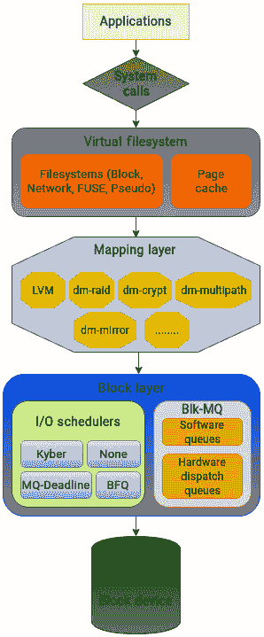
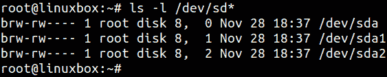
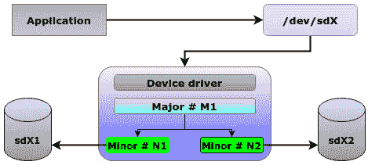

# 第四章：理解块层、块设备和数据结构

本书的前三章主要围绕内核 I/O 层次结构的第一个组成部分——VFS 层展开。我们解释了 VFS 的功能和目的，以及它如何充当通用系统调用接口与文件系统之间的中介层，并介绍了其主要数据结构。此外，我们还讨论了可以在 VFS 层下找到的文件系统，并介绍了一些与之相关的基本概念。

我们现在将重点转向内核存储层次结构中的第二个主要部分：块层。块层处理块设备，并负责处理在块设备上执行的 I/O 操作。所有的用户空间程序都使用块层接口来寻址和访问底层存储设备。在过去的十多年里，物理存储介质发生了显著变化，从较慢的机械硬盘转向了更快的闪存驱动器。因此，内核中的块层也经历了大量修改。由于存储硬件的性能至关重要，内核代码进行了多项优化，以便磁盘驱动器能够充分发挥其潜力。本章中，我们将介绍块层，定义块设备，然后深入探讨块层中的主要数据结构。

以下是接下来内容的总结：

+   解释块层的作用

+   定义块设备

+   块设备的定义特征

+   块设备的表示

+   查看块层中的主要数据结构

+   I/O 请求在块层的传递过程

# 技术要求

Linux 内核的块层是一个稍显复杂的话题。理解前三章中介绍的内容将有助于你理解块层与各种文件系统之间的交互。具备 C 编程语言的经验将帮助你理解本章中展示的代码。此外，任何 Linux 系统的实践经验都将增强你对本文中讨论的概念的理解。

如果你想下载内核源码，可以从[`www.kernel.org`](https://www.kernel.org)下载。本章和本书中引用的代码片段来自内核 `5.19.9`。

# 解释块层的作用

块层负责实现内核接口，使文件系统能够与存储设备交互。在访问物理存储的过程中，应用程序使用块设备，所有对这些设备数据的访问请求都由块层管理。内核还包含一个位于块层之上的映射层。该层提供了一种灵活而强大的方式，将一个块设备映射到另一个设备，从而支持创建快照、加密数据和创建跨多个物理设备的逻辑卷等操作。块层中实现的接口对于管理 Linux 中的物理存储至关重要。块设备的设备文件位于`/dev`目录下。

像 VFS 一样，抽象是块层的核心功能。VFS 层允许应用程序以通用的方式进行文件交互请求，而无需担心底层文件系统。同样，块层也允许应用程序以统一的方式访问存储设备。应用程序无需关心后端存储介质的选择。

为了突出块层的主要功能，让我们在描述 VFS 时所定义的存储层次结构基础上进行扩展。下图概述了块层的主要组件：



图 4.1 – 从 VFS 到块层的 I/O 层次结构

让我们简要了解这些功能：

+   块层提供了一个向上接口供文件系统使用，使其能够以统一的方式访问各种存储设备。同样，它也为驱动程序和存储设备提供下行接口，通过提供一个所有应用程序都可以访问的单一入口点。

+   正如我们将在本章中看到的，块层包含了一些复杂的结构，以通用的方式提供其服务。其中最重要的结构可能是`bio`结构。文件系统层创建一个 bio 结构来表示 I/O 请求，并将其传递到块层。bio 结构负责将所有 I/O 请求传输到驱动程序。映射层则负责提供一个基础设施，将物理块设备映射到逻辑设备。映射层可以通过使用内核中的设备映射框架来实现这一点。设备映射器为内核中的几种技术奠定了基础，包括卷管理、多路径、精简配置、加密和软件 RAID。其中最著名的技术是**逻辑卷管理**（**LVM**）。设备映射器将每个逻辑卷创建为一个映射设备。LVM 为存储管理员提供了极大的灵活性，并简化了存储管理。

+   `blk-mq` 框架已经成为块层的重要组成部分，因为它通过为每个 CPU 核心隔离请求队列解决了性能限制。这个框架负责将块 I/O 请求引导到多个派发队列。我们将在*第五章*中详细介绍 `blk-mq` 框架。

+   块层还包括几个用于处理 I/O 请求的调度程序。这些调度程序是可插拔的，并且可以为单个块设备设置。非多队列调度程序已被弃用，并且在现代内核中不再受支持。正如我们在*第六章*中看到的，这些调度程序利用多种技术来做出关于 I/O 调度的智能决策。

+   此外，块层还实现了如错误处理和收集块设备 I/O 统计信息等功能。

块层的核心是块设备。除了像磁带驱动器这样的流式数据设备外，大多数存储设备，如机械硬盘和固态硬盘（闪存卡），都被认为是基于块的设备。让我们来看看块设备的定义特征以及它们在 Linux 中的表现。

# 定义块设备

内核与外部设备交换数据有两种主要方式。一种方法是与设备逐个字符地交换数据。通过这种方法寻址的设备被称为字符设备。字符设备通过一串连续的数据进行寻址。程序可以通过它们来执行逐字符的输入和输出操作。由于缺少随机访问方法，内核管理字符设备相对简单。键盘、基于文本的控制台和串行端口等设备都是字符设备的例子。

当数据量较少时，通过逐个字符进行通信是可以接受的，例如使用串行端口或键盘时。键盘一次只能接受一个字符，因此使用字符接口是合理的。但当传输大量数据时，这种方式就变得不可行。当写入物理磁盘时，我们希望它们能够一次处理多个字符，并允许数据随机访问。内核以固定大小的块（称为块）来寻址物理驱动器。除了传统磁盘外，光盘驱动器和闪存驱动器等设备也使用这种方法。这些设备被称为块设备。与字符设备相比，块设备更复杂，管理起来需要更多的注意。内核必须在块设备的寻址和组织上做出重要决策，因为这些决策不仅会影响块设备本身，还会影响整个系统的性能。

块设备可以存在于内存中。这可以通过创建一个 *ramdisk* 来实现。ramdisk 的一个显著应用场景是在 Linux 系统的启动序列中。**初始 ramdisk**（**initrd**）负责在内存中加载一个临时根文件系统，以帮助启动过程。可以在 ramdisk 上创建文件系统并像常规文件系统一样挂载。由于 RAM 的速度非常快，ramdisk 的速度也非常快。但由于 RAM 的易失性，写入 ramdisk 的任何数据仅在设备开机时保留。

尽管 ramdisk 也是基于块的，但它们很少被使用。正如你在本书中将看到的，块设备通常被视为具有文件系统层的持久数据存储介质。

所有对块设备的操作都由内核以固定大小的 *N* 字节块进行，这些块被称为 *块*，是处理块设备时的交换货币。*N* 的实际值在内核 I/O 层次结构中的不同层次中有所不同，因为不同的层次使用不同大小的块来处理块设备。因此，术语“块”根据其在堆栈中的位置有不同的定义：

+   **用户空间应用程序**：当应用程序通过标准系统调用与内核空间交互时，**块**在此上下文中指的是通过系统调用读取和写入的数据量。根据应用程序的不同，这个大小可以有所不同。

+   **页面缓存**：内核广泛使用 VFS 页面缓存来提高读写操作的性能。在这里，数据传输的基本单元是 *页面*，其大小为 4 KB。

+   **基于磁盘的文件系统**：如在*第三章*中所述，块表示文件系统进行 I/O 操作时固定数量的字节。尽管文件系统允许更大的块大小，通常最大可达 64 KB，但由于页面大小的原因，文件系统的块大小通常在 512 字节到 4 KB 之间。

+   **物理存储**：在物理磁盘上，最小的可寻址单元被称为扇区，通常为 512 字节。该扇区通常会进一步分类为逻辑扇区或物理扇区。

我们在*第三章*中讨论了文件系统块。不要混淆；文件系统块的大小不是块 I/O 的基本单元。块 I/O 的基本单元是扇区。块层中的数据结构在内核代码中定义了一个 `sector_t` 类型的变量，表示一个偏移量或大小，它是 512 的倍数。`sector_t` 变量被定义为一个无符号整数类型，足够大以表示块设备可以寻址的最大扇区数。它在块层中被广泛使用，在诸如 “bio” 等结构中表示磁盘地址和偏移量。

总结一下，按块组织和寻址的设备称为块设备。它们允许随机访问，并且相比字符设备提供更优的性能。为了充分利用块设备，内核必须做出关于其寻址和组织的明智决策。

让我们简要回顾一下定义块设备的一些关键特性。

# 块设备的定义特征

如前所述，块设备允许使用更为高级的方式来处理 I/O 请求。块设备的一些定义特征如下：

+   **随机访问**：块设备允许随机访问。这意味着设备可以从一个位置*跳跃*到另一个位置。

+   **块大小**：块设备以固定大小的块进行寻址和数据传输。

+   **可堆叠性**：块设备可以通过设备映射框架进行堆叠。这扩展了物理磁盘的基本功能，并允许扩展逻辑卷。

+   **缓冲 I/O**：块设备使用缓冲 I/O，这意味着数据在写入设备之前会先写入内存中的缓冲区。对块设备的读写操作广泛使用页面缓存。读取块设备中的数据时，会将其加载并保留在内存中一段时间。同样，任何要写入块设备的数据都会先写入缓存。

+   **文件系统/分区**：块设备可以被分割成较小的逻辑单元，并在其上创建独立的文件系统。

+   **请求队列**：块设备实现了请求队列的概念，负责管理提交到块设备的 I/O 请求。

让我们看看块设备在 Linux 中是如何表示的。

# 查看块设备的表示方式

在讨论 VFS 时，我们看到抽象是内核 I/O 堆栈的核心。块层也不例外。无论物理设备的型号和制造方式如何，内核都应该能够统一地与存储设备进行交互。为了为所有设备实现标准接口，操作应该独立于底层存储设备的属性。

如在 *第一章* 中解释的那样，几乎所有的东西都以文件的形式表示，包括硬件设备。块设备是一个特殊的文件，之所以如此命名，是因为内核通过固定数量的字节与其交互。根据设备的性质，表示它们的文件会在系统中的特定位置创建和存储。系统中的块设备位于 `/dev` 目录下。表示磁盘驱动器的文件名以 `sd` 开头，后面跟着一个字母表示发现顺序。第一个驱动器命名为 `sda`，依此类推。类似地，`sda` 驱动器上的第一个分区表示为 `sda1`。如果我们查看 `/dev` 中的 `sd*` 设备，会注意到文件类型是 `b`，表示块设备。你也可以使用 `lsblk` 命令列出块设备，如下图所示：



图 4.2 – 主次设备号

在修改时间戳之前，注意到两个数字之间用逗号分隔。内核将块设备表示为一对数字。这些数字被称为设备的主设备号和次设备号。*主设备号* 标识与设备关联的驱动程序，而 *次设备号* 用于区分不同的设备。

在前面的图中，所有三个设备——`sda`、`sda1` 和 `sda2`——使用相同的驱动程序，因此具有相同的主设备号 `8`。次设备号——`0`、`1` 和 `2`——用于标识每个设备的驱动程序实例。



图 4.3 – 设备主次设备号

`/dev` 目录下的设备文件与相应的设备驱动程序连接，以建立与实际硬件的通信链接。当程序与块设备文件交互时，内核通过主设备号识别该设备的适当驱动程序，并发送请求。由于一个驱动程序可能负责处理多个设备，因此必须有一种方法，使内核能够区分使用相同主设备号的设备。为此，使用次设备号。

现在我们将探讨在块层中使用的主要数据结构。

# 查看块层中的数据结构

处理块设备相对复杂，因为内核必须实现诸如队列管理、调度和随机数据访问等功能。块设备的速度远高于字符设备，这使得块设备对性能极为敏感，内核必须做出智能决策，以发挥其最大性能。因此，有必要将这两种设备区分开来处理。正因如此，内核有一个专门的子系统来管理块设备。所有这些使得块层成为 Linux 内核中最复杂的代码部分。

在本书中，我们提到了一些内核代码的相关部分，以便你能熟悉某些概念的实现。如果你有兴趣从事内核开发，这可能是一个很好的起点。然而，如果你更关注理论理解，代码的使用可能会让人稍感困惑。但了解某些事物在内核中如何表示是非常必要的。具体来说，关于块层（block layer），无法讨论所有构成其复杂设计的结构。然而，我们必须强调一些更为重要的构造，它们能帮助我们理解内核中块设备的表示和组织。

用于处理块设备的一些主要数据结构如下：

+   `register_blkdev`

+   `block_device`

+   `gendisk`

+   `buffer_head`

+   `bio`

+   `bio_vec`

+   `request`

+   `request_queue`

让我们逐一看一下它们。

## `register_blkdev` 函数（块设备注册）

为了使块设备可供使用，它们必须首先在内核中注册。注册过程由 `register_blkdev()` 函数执行，该函数定义在 `include/linux/blkdev.h` 中：

```
int __register_blkdev(unsigned int major, const char *name,
                void (*probe)(dev_t devt))
```

`register_blkdev` 函数由块设备驱动程序用于注册自己，它是一个宏，指向 `__register_blkdev`。`__register_blkdev` 函数执行实际的注册过程。设置一个单独的内部函数是为了在修改内核数据结构之前提供额外的错误处理和验证。

注册函数执行以下任务：

+   它从内核的动态主设备号分配池请求一个主设备号。主设备号在系统中唯一标识块设备驱动程序。

+   一旦成功获取主设备号，函数将创建一个 `block_device` 结构体，代表块设备驱动程序。该结构体包含诸如主设备号、驱动程序名称和指向各种驱动操作的函数指针等信息。

总结来说，`register_blkdev` 函数作为一个友好的接口，使得块设备驱动程序能够启动与内核块层的注册过程。它处理获取主设备号、创建 `block_device` 结构体以及与块层建立必要连接的步骤。

## `block_device` 结构体（表示块设备）

块设备在内核中通过 `include/linux/blk_types.h` 中的 `block_device` 结构体定义：

```
struct block_device {
        sector_t                bd_start_sect;
        sector_t                bd_nr_sectors;
        struct disk_stats __percpu *bd_stats;
        unsigned long           bd_stamp;
        bool                    bd_read_only;
        dev_t                   bd_dev;
        atomic_t                bd_openers;
        struct inode *          bd_inode;
[……..]
```

`block_device` 结构体实例在设备文件打开时创建。块设备可以是整个磁盘或单个分区，`block_device` 结构体可以表示这两者。当使用分区时，个别分区通过 `bd_partno` 字段进行标识。由于对块设备的访问是通过 VFS 层完成的，相应的设备文件也会被分配一个 inode 编号。块设备的 inode 是虚拟的，存储在 `bdev` 虚拟文件系统中。块设备的 inode 还包含其主设备号和次设备号的信息。

`block_device` 结构体还提供了有关设备的信息，如名称、大小和块大小。它还包含指向 `gendisk` 结构体的指针，该结构体表示磁盘，并包含一个 `request_queues` 结构体列表，用于处理 I/O 请求。

## `gendisk` 结构体（表示物理磁盘）

`block_device` 结构体定义中的一个重要字段是 `bd_disk` 指针，它指向 `gendisk` 结构体。`gendisk` 结构体定义在 `include/linux/blkdev.h` 中，表示关于磁盘的信息，并用于在内核中实现物理硬盘的概念。

`gendisk` 结构体表示磁盘的属性及用于访问磁盘的方法。它用于向内核注册一个块设备及其相关的 I/O 操作，使内核能够与设备进行通信：

```
struct gendisk {
        int major;
        int first_minor;
        int minors;
        char disk_name[DISK_NAME_LEN];
        unsigned short events;
        unsigned short event_flags;
[……]
```

`gendisk` 可以被看作是前述块设备接口与文件系统接口以及硬件接口之间的一个桥梁。在 `gendisk` 中，会有一个 `block_device` 结构体来表示整个物理磁盘。同样，也会有单独的 `block_device` 结构体来描述 `gendisk` 中的各个分区。需要注意的是，`gendisk` 是由块设备驱动分配和控制的，并通过 `register_blkdev` 函数向内核注册。一旦注册，块设备驱动就可以使用 `gendisk` 结构体对设备进行 I/O 操作。

让我们来看看这个结构体的一些重要字段：

+   `major`：该字段指定与 `gendisk` 结构体关联的主设备号。如前所述，主设备号由内核用于标识负责处理块设备的驱动程序。

+   `first_minor`：该字段表示分配给给定块设备的最小次设备号。可以将其视为一个偏移量，后续设备分区的次设备号会从这个偏移量开始分配。

+   `minors`：该字段指定与 `gendisk` 结构体关联的次设备号总数。

+   `fops`：该字段指向与 `gendisk` 结构体关联的文件操作结构体。这些文件操作由内核用于处理对设备的读、写及其他文件操作。

+   `private_data`：该字段由驱动程序用于存储与`gendisk`结构相关的任何私有数据，例如任何特定于驱动程序的信息。

+   `queue`：该字段指向与`gendisk`结构相关联的请求队列。请求队列负责管理发送到设备的 I/O 请求。因此，这是一个非常重要的字段，它使内核能够将特定的 I/O 队列与每个块设备关联起来。通过为每个块设备设置独立的 I/O 队列，内核可以独立管理多个块设备，并更高效地处理它们的 I/O 操作。这使得内核能够优化性能，应用适当的调度策略，并防止 I/O 瓶颈。

+   `disk_name`：该字段是一个字符串，指定设备的名称。该名称由内核用来识别设备，通常会在系统日志中显示。

让我们继续查看下一个结构。

## `buffer_head`结构（表示内存中的块）

块设备的一个显著特点是它广泛使用页面缓存。对块设备的读写操作是在缓存中进行的。当应用程序首次从块中读取时，数据块会从物理磁盘加载到内存中。同样，当程序想要写入数据时，写操作首先会在缓存中进行。稍后会将数据写入物理磁盘。

从磁盘读取或要写入磁盘的块存储在一个缓冲区中。这个缓冲区由`buffer_head`结构表示，它在内核的`include/linux/buffer_head.h`中定义。我们可以说，这个缓冲区是一个内存中表示的单独块：

```
struct buffer_head {
        unsigned long b_state;
        struct buffer_head *b_this_page;
        struct page *b_page;
        sector_t b_blocknr;
        size_t b_size;
[………...]
```

`buffer_head`结构中的字段包含了唯一标识块设备中特定块所需的信息。`buffer_head`结构中的字段描述如下：

+   `b_data`：该字段指向与`buffer_head`关联的数据缓冲区的起始位置。缓冲区的大小由文件系统的块大小决定。

+   `b_size`：该字段指定缓冲区的大小（以字节为单位）。

+   `b_page`：这是一个指向内存中存储该块的页面的指针。该字段通常与`b_data`和`b_size`等字段一起使用，以操作缓冲区数据。

+   `b_blocknr`：该字段指定文件系统中文件缓冲区的逻辑块号。文件系统中的每个块都分配一个唯一的编号，称为逻辑块号。这个编号表示块在文件系统中的顺序，从 0 开始为第一个块。

+   `b_state`：该字段是一个位域，表示缓冲区的状态。它可以具有多个值。例如，值为`BH_Uptodate`表示缓冲区包含最新数据，而`BH_Dirty`表示缓冲区包含脏数据（已修改的数据），需要写入磁盘。

+   `b_count`：该字段跟踪`buffer_head`的使用者数量。

+   `b_page`：该字段指向页面缓存中包含与`buffer_head`结构相关数据的页面。

+   `b_assoc_map`：该字段用于一些文件系统追踪当前与`buffer_head`关联的块。

+   `b_private`：该字段是指向与`buffer_head`关联的私有数据的指针。文件系统可以使用它来存储与缓冲区相关的信息。

+   `b_bdev`：该字段是指向缓冲区所属的块设备的指针。

+   `b_end_io`：该字段是一个函数指针，指定对缓冲区进行 I/O 操作的完成函数，并用于执行任何必要的清理操作。

默认情况下，由于文件系统的块大小等于页面大小，因此内存中的单个页面可以容纳一个块。如果块大小小于页面大小，则页面可以容纳多个块。

`buffer_head`维持内存中页面与其对应的磁盘版本之间的映射。尽管它仍然保存重要信息，但在 2.6 版本之前，它是内核中的一个更加核心的组成部分。当时，除了维持页面与磁盘块的映射外，它还充当块层所有 I/O 操作的容器。将`buffer_head`作为 I/O 容器的使用导致了大量内存的占用。在处理大量 I/O 请求时，内核必须将其拆分为更小的请求，每个请求都与一个`buffer_head`结构相关联。

## `bio`结构（表示活动块 I/O）

由于`buffer_head`结构的限制，`bio`结构被创建来表示正在进行的块 I/O 操作。自内核 2.5 版本以来，`bio`结构一直是块层 I/O 的基本单元。当应用程序发出 I/O 请求时，底层文件系统将其转换为一个或多个`bio`结构，并将这些结构传递到块层。块层随后使用这些`bio`结构向底层块设备发出 I/O 请求。`bio`结构在`include/linux/blk_types.h`中定义：

```
struct bio {
        struct bio              *bi_next;
        struct block_device     *bi_bdev;
        unsigned int            bi_opf;
……
        unsigned short          bi_max_vecs;
        atomic_t                __bi_cnt;
        struct bio_vec          *bi_io_vec;
[……….]
```

以下是一些特别有趣的字段：

+   `bi_next`：这是指向列表中下一个`bio`结构的指针，用于链接表示单个 I/O 操作的多个`bio`结构。理解这一点非常重要，因为一个 I/O 操作可能需要拆分成多个`bio`结构。

+   `bi_vcnt`：该字段指定用于描述 I/O 操作的`bio_vec`结构的数量。向量中的每个`bio_vec`结构描述一个在块设备和用户空间程序之间传输的连续内存块。

+   `bi_io_vec`：这是一个指向`bio_vec`结构数组的指针，该数组描述了与 I/O 操作关联的数据缓冲区的位置和长度。这为执行`scatter-gather` I/O 奠定了基础——即，数据可以分布在多个不连续的内存位置。

+   `bi_vcnt`：此字段指定与 I/O 操作关联的数据缓冲区的数量。每个数据缓冲区由一个`bio_vec`结构表示，包含指向内存缓冲区的指针和缓冲区的长度。

+   `bi_end_io`：这是一个指向函数的指针，当 I/O 操作完成时会调用该函数。该函数负责清理与 I/O 操作相关的任何资源，并唤醒任何等待操作完成的进程。

+   `bi_private`：这是一个指向与 I/O 操作关联的任何私有数据的指针。

+   `bi_opf`：这是一个位掩码，用于指定与 I/O 操作关联的任何附加选项或标志。这可能包括诸如*强制同步 I/O*或*禁用* *写缓存*等选项。

当用户空间应用程序发起 I/O 请求时，bio 结构跟踪块层中的所有活动 I/O 事务。一旦 bio 结构构建完成，它会通过`submit_bio`函数交给块 I/O 层。`submit_bio()`函数用于将 I/O 请求提交到块设备。一旦 I/O 被提交到块设备，它会被加入到请求队列中。`submit_bio()`函数不会等待 I/O 完成。

可以说，bio 结构充当了文件系统与块设备层之间的桥梁，使文件系统能够对块设备执行 I/O 操作。

## `bio_vec`结构（表示向量 I/O）

`bio_vec`结构定义了块层中的向量或散布-聚集 I/O 操作。

`bio_vec`结构定义在`include/linux/bvec.h`中：

```
struct bio_vec {
        struct page     *bv_page;
        unsigned int    bv_len;
        unsigned int    bv_offset;
};
```

各字段描述如下：

+   `bv_page`：此字段保存指向包含要传输数据的页结构（struct page）的引用。如我们在*第二章*中所解释，页面是固定大小的内存块。

+   `bv_offset`：此字段保存页面内数据传输起始位置的偏移量。

+   `bv_len`：此字段保存要传输数据的长度。

`bio_vec`结构用于表示一个散布-聚集 I/O 操作。块层可能会构建一个包含多个`bio_vec`结构的单一 bio，每个结构表示内存中不同的物理页面和该页面内的不同偏移量。

## 请求和请求队列（表示挂起的 I/O 请求）

当 I/O 请求提交到块层时，块层会创建一个`request`结构来表示该请求。

`request`和`request_queue`结构分别定义在`include/linux/blk-mq.h`和`include/linux/blkdev.h`中：

```
struct request {
        struct request_queue *q;
        struct blk_mq_ctx *mq_ctx;
        struct blk_mq_hw_ctx *mq_hctx;
[……..]
```

这里解释了一些主要字段：

+   `struct request_queue *q`：每个 I/O 请求都会添加到块设备的请求队列中。此处的`q`字段指向该请求队列。

+   `struct blk_mq_ctx *mq_ctx`：`blk_mq_ctx *mq_ctx`字段指向软件暂存队列；此结构是按每个 CPU 核心分配的。每个 CPU 都有一个`blk_mq_ctx`，它用于跟踪该 CPU 上处理的请求状态。

+   `struct blk_mq_hw_ctx *mq_hctx`：此字段表示与请求队列关联的硬件上下文。它用于跟踪请求所属的硬件队列。

+   `struct list_head queuelist`：这是一个等待处理的请求的链表。当一个请求提交给块层时，它会被添加到此列表中。

+   `struct request *rq_next`：这是指向队列中下一个请求的指针，用于在请求队列内链接请求。

+   `sector_t sector`：此字段指定 I/O 操作的起始扇区号。

+   `struct bio *bio`：此字段指向一个包含 I/O 操作信息的`bio`结构，例如它的类型（读取或写入）。

+   `struct bio *biotail`：此字段指向队列中的最后一个`bio`结构。当一个新的 bio 被添加到队列时，它将被链接到 `biotail` 指向的列表末尾。

`request_queue`结构表示与块设备关联的请求队列。请求队列负责管理所有提交给块设备的 I/O 请求：

```
struct request_queue {
        struct request          *last_merge;
        struct elevator_queue   *elevator;
        struct percpu_ref       q_usage_counter;
[………..]
```

让我们来看一下其中一些重要的字段：

+   `struct request *last_merge`：此字段由 I/O 调度器使用，用来跟踪与另一个请求合并的最后一个请求。

+   `struct elevator_queue *elevator`：此字段指向请求队列的 I/O 调度器。I/O 调度器决定请求的服务顺序。

+   `struct percpu_ref q_usage_counter`：此字段表示请求队列的使用计数器。内核使用每个 CPU 的计数器来跟踪每个 CPU 上资源的引用计数。

+   `struct rq_qos *rq_qos`：此字段指向一个请求队列，该队列提供质量服务协议，用于块设备。它们用于根据不同的标准（例如请求的优先级）来优先处理 I/O 请求。

+   `const struct blk_mq_ops *mq_ops`：此结构包含函数指针，定义了多队列 I/O 调度器请求队列的行为。

+   `struct gendisk *disk`：此字段指向与请求队列关联的`gendisk`结构。`gendisk`表示一个通用的磁盘设备。

哇！这些字段太多了。让我们总结一下每个结构的作用，看看它们是如何协同工作的。

# I/O 请求在块层的旅程

以下表格简明地概述了上一节中介绍的结构：

| **结构** | **表示的内容** | **描述** |
| --- | --- | --- |
| `gendisk` | 物理磁盘 | 用于表示物理设备的整体，包含诸如磁盘容量和几何结构等信息 |
| `block_device` | 块设备 | 表示设备的特定实例，包含诸如主次设备号、分区信息和处理 I/O 请求的队列等信息 |
| `buffer_head` | 内存中的数据块 | 用于跟踪从块设备读取或写入到内存的数据 |
| `request` | I/O 请求 | 这包括诸如 I/O 操作类型和起始块号等信息 |
| `request_queue` | I/O 请求队列 | 该队列包含有关当前状态的信息，例如等待处理的请求数量 |
| `bio` | 块 I/O | 这是一个更高层次的 I/O 请求，可以包含多个请求结构 |
| `bio_vec` | 内存缓冲区的散布-聚集列表 | 作为 `bio` 结构的一部分，用于描述一个单独的数据缓冲区 |

表 4.1 – 主要块层结构总结

让我们来看看这些结构之间的关系，当一个进程发出 I/O 请求时：

1.  当应用程序在其地址空间的缓冲区中写入数据时，块层创建一个 `buffer_head` 结构来表示这些数据。

1.  块层构建一个 `bio` 结构来表示块 I/O 请求，并将 `buffer_head` 结构映射到 `bio_vec` 结构。对于每个 `bio`，块层创建一个或多个 `bio_vec` 结构来表示读取或写入的数据。

1.  然后，`bio` 结构通过 `request` 结构添加到目标块设备的 `request_queue` 结构中。

1.  该设备的设备驱动程序通过 `register_blkdev` 注册后，将从 `bio` 结构队列中取出，并安排进行处理。

1.  然后，`bio` 根据设备的块大小被拆分为一个或多个 `request` 结构。

1.  每个 `request` 对象随后被添加到相应设备驱动程序的 `request_queue` 结构中进行处理。

1.  在处理请求后，设备驱动程序将数据写入物理存储。

1.  一旦 I/O 请求完成，设备驱动程序会通知块层。

1.  然后，块层更新缓冲区缓存和相关的数据结构。它将请求结构标记为已完成，并通知任何等待的进程，I/O 操作已经完成。

1.  相应的 `buffer_head` 结构被更新，以反映块设备上数据的当前状态。

块层通过其复杂的设计，使用一些复杂的结构来与块设备进行交互。我们介绍了一些主要结构，以帮助你理解系统内部如何运作。每个结构定义了大量的字段；我们尝试突出一些要点以帮助理解。

需要注意的是，旧版内核中的请求队列是单线程的，无法充分利用现代硬件的能力。Linux 内核在版本`3.13`中增加了多队列支持。实现多队列支持的框架被称为`blk-mq`。我们将在下一章中详细讨论多队列框架。

# 摘要

本书的第一部分，包括*第一章*、*第二章*和*第三章*，主要讲解了 VFS 和文件系统。第二部分，包括*第四章*、*第五章*和*第六章*，则全都关于块层。本章介绍了块层在 Linux 内核中的角色。`/dev`目录。与字符设备相比，操作块设备要复杂得多，因为字符设备只能按顺序工作。字符设备只有一个当前的位置。管理块设备对内核来说是一个更复杂的任务，因为块设备必须能够移动到任何位置，以提供对数据的随机访问。因此，性能在操作块设备时是一个主要的关注点。Linux 内核在块层提供了一个复杂的结构生态系统，用于操作块设备。

在下一章中，我们将基于我们的理解，看到 I/O 请求如何在块层中得到处理。我们还将讲解设备映射器和内核中的多队列框架。
