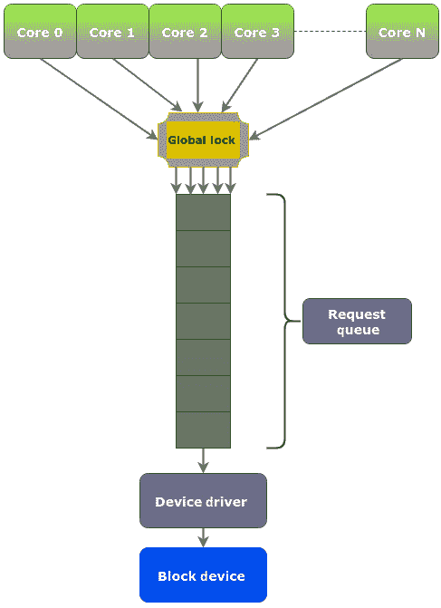
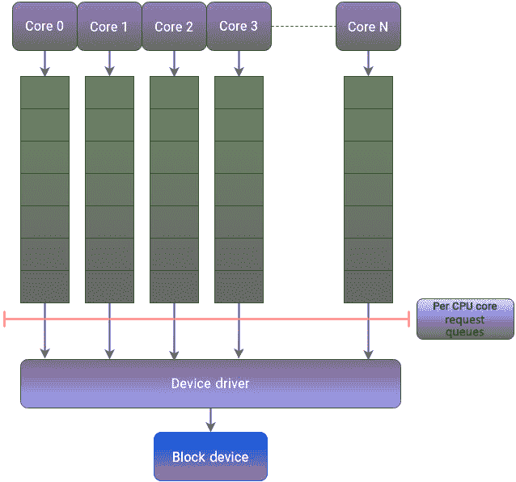
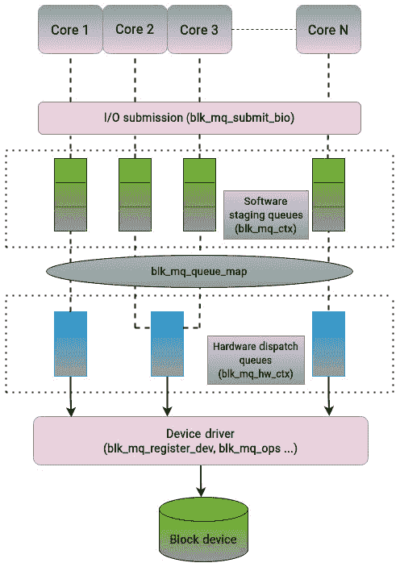
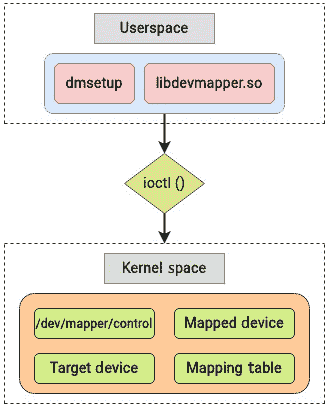
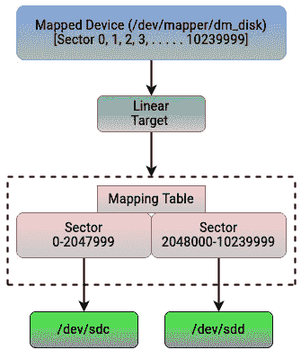
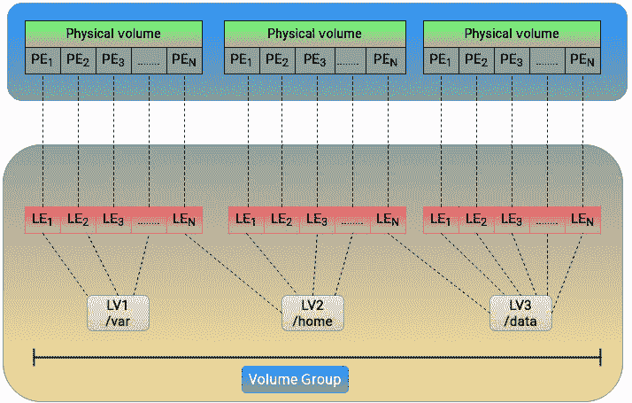

# 5

# 理解块层、多队列和设备映射器

“我感到需要……需要速度。”——《壮志凌云》中的 Maverick

*第四章*介绍了内核中块层的作用。我们了解了块设备的构成，并探索了块层中的主要数据结构。本章将在此基础上继续加深对块层的理解。

本章将介绍两个主要概念：多队列块 I/O 机制和设备映射框架。近年来，为了应对性能问题，内核的块层经历了重大变化。多队列框架的引入是这一方向的重要里程碑，正如在*第四章*中讨论的那样。性能是处理块设备时的关键考虑因素，内核已经实施了多种改进来优化磁盘驱动器性能。在*第四章*中，我们查看了块层中的请求和响应队列结构，它们处理块设备的 I/O 请求。在本章中，我们将首先介绍单请求队列模型、其性能限制以及在使用现代高性能存储设备（如 NVMe 和 SSD）时块层面临的挑战。我们还将解释单请求队列模型如何影响多核系统的性能。

本章的第二个主要主题将是内核中的映射框架，称为设备映射器。内核中的设备映射器框架与块层协同工作，负责将物理块设备映射到逻辑块设备。正如我们将看到的，设备映射器框架为实现各种技术（如逻辑卷管理、RAID、加密和薄配置）奠定了基础。最后，我们还将简要讨论块层中的缓存机制。

我们将讨论以下主要主题：

+   单请求队列的问题

+   多队列块 I/O 机制

+   设备映射器框架

+   块层中的多级缓存

# 技术要求

除了我们之前讨论的 Linux 操作系统概念外，本章讨论的主题需要对现代处理器和存储技术有基本了解。任何在 Linux 存储管理方面的实践经验，都将大大增强你对某些方面的理解。

本章中展示的命令和示例是与发行版无关的，可以在任何 Linux 操作系统上运行，如 Debian、Ubuntu、Red Hat、Fedora 等。文中有许多与内核源代码相关的引用。如果你想下载内核源代码，可以从[`www.kernel.org`](https://www.kernel.org)下载。本章和本书中提到的代码片段来自内核`5.19.9`。

# 看看单请求队列的问题

操作系统必须处理块设备，以确保它们能够充分发挥潜力。应用程序可能需要对块设备的任意位置执行 I/O 操作，这需要寻址多个磁盘位置，并可能延长操作的时间。当使用旋转机械硬盘时，持续的随机访问不仅会降低性能，还可能产生显著的噪音。尽管如今仍在使用，像 **串行先进技术附件** (**SATA**) 这样的接口曾是机械硬盘的首选协议。内核块层的原始设计是为机械硬盘作为首选介质的时代所设计的。这些传统硬盘只能处理几百次 IOPs。两件事改变了这一点：多核处理器的崛起和硬盘技术的进步。随着这些变化，存储堆栈中的瓶颈从物理硬件转移到了内核中的软件层。

在传统设计中，内核的块层以以下方式处理 I/O 请求：

+   块层维护了一个单一的请求队列，采用链表结构来处理 I/O 请求。新请求会被插入到队列的尾部。在将这些请求交给驱动程序之前，块层会对其进行合并和聚合等技术处理（我们将在下一章中解释）。

+   在某些情况下，I/O 请求必须绕过请求队列，直接进入设备驱动程序。这意味着所有在请求队列中完成的处理都会由驱动程序执行。通常，这会导致性能负面影响。

即使使用了现代固态硬盘，这种设计仍然存在重大局限性。这种方法进一步导致了三重问题：

+   包含 I/O 请求的请求队列无法扩展以满足现代处理器的需求。在多核系统中，单一请求队列必须在多个核心之间共享。因此，为了访问请求队列，使用了锁机制。这个全局锁用于同步对块层请求队列的共享访问。为了实现不同的 I/O 处理技术，CPU 核心需要获取请求队列的锁。这意味着，如果另一个核心需要操作请求队列，它必须等待相当长的时间。所有 CPU 核心都处于对请求队列锁的争用状态。很容易看出，这种设计使得请求队列成为多核系统中的单点争用。

+   单一请求队列还会引入缓存一致性问题。每个 CPU 核心都有自己的 L1/L2 缓存，可能包含共享数据的副本。当一个 CPU 核心在获取请求队列的全局锁后修改一些数据，并在其缓存中更新这些数据时，其他核心的缓存中可能仍然包含这些数据的过时副本。因此，一个核心所做的修改可能不会及时传播到其他核心的缓存中。这会导致不同核心之间对于共享数据的视图不一致。当某个核心释放请求队列的全局锁时，其所有权会转移到已经在等待该锁的另一个核心。尽管存在几种缓存一致性协议，确保缓存保持共享数据的一致视图，但关键问题是，单队列设计本身并没有提供机制来同步不同 CPU 核心的缓存。这增加了确保缓存一致性所需的总体工作负载。

+   这种在核心之间频繁切换请求队列锁的做法导致了中断次数的增加。

总的来说，使用多个核心意味着多个执行线程会同时竞争同一个共享锁。系统中 CPU/核心的数量越高，请求队列的锁竞争就越激烈。由于获取锁时的旋转和竞争，浪费了大量的 CPU 周期。在多插槽系统中，这大大减少了 IOPs 的数量。

*图 5**.1* 突出了使用单队列模型的局限性：



图 5.1 – 单请求队列模型

从 *图 5**.1* 中可以清楚地看出，无论 CPU 核心数和底层物理存储的类型如何，单队列块层的设计都无法扩展以匹配它们的性能需求。

在过去十年左右，企业存储环境已经转向固态硬盘和非易失性存储器。这些设备没有机械部件，能够并行处理 I/O 请求。这些设备的设计确保了在进行随机访问时不会出现性能惩罚。随着闪存驱动器成为首选的持久存储介质，过去在块层中用于处理 HDD 的传统技术已经过时。为了充分利用 SSD 的增强能力，块层的设计也需要相应成熟。

在接下来的章节中，我们将看到块层如何发展以应对这一挑战。

# 理解多队列块 I/O 框架

Linux 中的存储层次结构与 Linux 中的网络堆栈有些相似。两者都是多层次的，并严格定义了堆栈中每一层的角色。设备驱动程序和物理接口的参与决定了整体性能。与块层的行为类似，当一个网络包准备好传输时，它被放入一个单一队列中。这种方法使用了好几年，直到网络硬件发展到支持多个队列。因此，对于支持多个队列的设备，这种方法变得过时。

这个问题与后来内核中的块层面临的问题非常相似。Linux 内核中的网络堆栈比存储堆栈更早解决了这个问题。因此，内核的存储堆栈借鉴了这一点，最终创建了一个新的框架，称为 **多队列块** I/O 排队机制，简称 **blk-mq**。

多队列框架通过为每个 CPU 核心隔离请求队列，解决了块层的局限性。*图 5.2* 展示了这种方法如何修复单队列框架设计中的三个局限：



图 5.2 – 多队列框架

通过使用这种方法，CPU 核心可以专注于执行其线程，而无需担心其他核心上的线程。这种方法解决了共享全局锁所带来的局限性，并且最小化了中断的使用以及对缓存一致性的需求。

`blk-mq` 框架实现了以下两级队列设计，用于处理 I/O 请求：

+   `bio` 结构。一个块设备将有多个软件 I/O 提交队列，通常每个 CPU 核心一个队列，每个队列会有一个锁。一个拥有 *M* 个插槽和 *N* 个核心的系统，可以至少有 *M* 个队列，最多有 *N* 个队列。每个核心在其队列中提交 I/O 请求，并且不会与其他核心交互。这些队列最终会汇聚成一个设备驱动程序的单一队列。I/O 调度程序可以在暂存队列中的请求上进行操作，以重新排序或合并它们。然而，这种重新排序并不重要，因为 SSD 和 NVMe 驱动并不在乎 I/O 请求是随机的还是顺序的。这个调度仅发生在同一队列中的请求之间，因此不需要锁机制。

+   `blk-mq` 会将请求直接发送到硬件队列。

多队列 API 利用标签来指示哪个请求已经完成。每个请求都有一个标签，这是一个从零到分派队列大小之间的整数值。块层生成一个标签，随后该标签被设备驱动程序使用，从而消除了重复标识符的需要。一旦驱动程序完成请求的处理，标签将被返回到块层，以示操作完成。以下部分突出了在多队列块层实现中起着至关重要作用的一些主要数据结构。

## 查看数据结构

以下是实现多队列块层所必需的一些主要数据结构：

+   多队列框架使用的第一个相关数据结构是`blk_mq_register_dev`结构，它包含了在将新块设备注册到块层时所需的所有必要信息。它包含多个字段，提供有关驱动程序能力和要求的详细信息。

+   `blk_mq_ops`数据结构作为多队列块层访问设备驱动程序特定例程的参考。该结构充当驱动程序与`blk-mq`层之间通信的接口，使得驱动程序能够无缝地集成到多队列处理框架中。

+   软件暂存队列由`blk_mq_ctx`结构表示。该结构是按每个 CPU 核心分配的。

+   硬件分派队列的对应结构由`blk_mq_hw_ctx`结构定义。它表示与请求队列关联的硬件上下文。

+   将软件暂存队列映射到硬件分派队列的任务由`blk_mq_queue_map`结构执行。

+   请求通过`blk_mq_submit_bio`函数创建并发送到块设备。

以下图展示了这些功能是如何相互连接的：



图 5.3 – 多队列框架中主要结构的相互作用

总结来说，多队列接口解决了块层在处理具有多个队列的现代存储设备时所面临的限制。历史上，不管底层物理存储介质的能力如何，块层都保持一个单一的请求队列来处理 I/O 请求。在具有多个核心的系统中，这很快就成为了一个主要瓶颈。由于请求队列是通过全局锁在所有 CPU 核心之间共享的，每个 CPU 核心都花费了相当多的时间等待其他核心释放锁。为了克服这一挑战，开发了一个新的框架，来满足现代处理器和存储设备的需求。多队列框架通过为每个 CPU 核心隔离请求队列来解决块层的限制。该框架采用了双队列设计，包括软件分阶段队列和硬件调度队列。

到此为止，我们已经分析了块层中的多队列框架。现在，我们将转向探讨设备映射器框架。

## 查看设备映射器框架

默认情况下，管理物理块设备是比较僵化的，应用程序只能通过少数几种方式使用这些设备。在处理块设备时，必须做出关于磁盘分区和空间管理的明智决策，以确保可用资源的最佳使用。在过去，薄配置、快照、卷管理和加密等功能仅限于企业存储阵列。然而，随着时间的推移，这些功能已成为任何本地存储基础设施的关键组成部分。在操作物理驱动器时，操作系统的上层通常需要具备实施和维持这些功能的能力。Linux 内核提供了设备映射器框架，用于实现这些概念。设备映射器由内核用于将物理块设备映射到更高级别的虚拟块设备。设备映射器框架的主要目标是为物理设备创建一个高级抽象层。设备映射器提供了一种机制，可以修改传输中的 bio 结构并将其映射到块设备。使用设备映射器框架为实现诸如逻辑卷管理等功能奠定了基础。

设备映射器提供了一种通用方法，用于在物理设备之上创建虚拟块设备层，并实现如条带化、镜像、快照和多路径等功能。像 Linux 中的大多数功能一样，设备映射器框架的功能被划分为内核空间和用户空间。与策略相关的工作，如定义物理到逻辑的映射，位于用户空间，而实现这些策略以建立映射的功能则位于内核空间。

设备映射器的应用程序接口是 `ioctl` 系统调用。此系统调用调整特殊文件的底层设备参数。采用设备映射器框架的逻辑设备通过 `dmsetup` 命令和 `libdevmapper` 库进行管理，后者实现了相应的用户接口，如下图所示：



图 5.4 – 设备映射器框架的主要组件

如果我们在 `dmsetup` 命令上运行 `strace`，我们会看到它利用了 `libdevmapper` 库和 `ioctl` 接口：

```
root@linuxbox:~# strace dmsetup ls
execve("/sbin/dmsetup", ["dmsetup", "ls"], 0x7fffbd282c58 /* 22 vars */) = 0
[..................]
access("/etc/ld.so.nohwcap", F_OK)      = -1 ENOENT (No such file or directory)
openat(AT_FDCWD, "/lib/x86_64-linux-gnu/libdevmapper.so.1.02.1", O_RDONLY|O_CLOEXEC) = 3
[...............…]
stat("/dev/mapper/control", {st_mode=S_IFCHR|0600, st_rdev=makedev(10, 236), ...}) = 0
openat(AT_FDCWD, "/dev/mapper/control", O_RDWR) = 3
openat(AT_FDCWD, "/proc/devices", O_RDONLY) = 4
[...............…]
ioctl(3, DM_VERSION, {version=4.0.0, data_size=16384, flags=DM_EXISTS_FLAG} => {version=4.41.0, data_size=16384, flags=DM_EXISTS_FLAG}) = 0
ioctl(3, DM_LIST_DEVICES, {version=4.0.0, data_size=16384, data_start=312, flags=DM_EXISTS_FLAG} => {version=4.41.0, data_size=528, data_start=312, flags=DM_EXISTS_FLAG, ...}) = 0
[..................]
```

建立映射设备的应用程序，如 LVM，通过 `libdevmapper` 库与设备映射器框架进行通信。`libdevmapper` 库使用 `ioctl` 命令将数据传输到 `/dev/mapper/control` 设备。`/dev/mapper/control` 设备是一个专用设备，作为设备映射器框架的控制机制。

从 *图 5.4* 中，我们可以看到，内核空间中的设备映射器框架实现了一个模块化的存储管理架构。设备映射器框架的功能包括以下三个主要组件：

+   映射设备

+   映射表

+   目标设备

我们简要看看它们各自的角色。

### 查看映射设备

一个块设备，例如整个磁盘或单个分区，可以被 *映射* 到另一个设备。映射设备是设备映射器驱动程序提供的逻辑设备，通常存在于 `/dev/mapper` 目录中。LVM 中的逻辑卷就是映射设备的例子。映射设备在 `drivers/md/dm-core.h` 中定义。如果我们查看这个定义，会遇到一个熟悉的结构：

```
struct mapped_device {
[……..]
struct gendisk *disk;
[………..]
```

如 *第四章* 所述，`gendisk` 结构代表内核中的物理硬盘概念。

### 查看映射表

映射设备由映射表定义。该映射表表示从映射设备到目标设备的映射。映射设备由一个表定义，描述设备的每个逻辑扇区范围如何映射，使用设备映射器框架支持的设备表映射。`drivers/md/dm-core.h` 中定义的映射表包含指向映射设备的指针：

```
struct dm_table {
        struct mapped_device *md;
[……………..]
```

该结构允许在设备映射器堆栈中创建、修改和删除映射。可以通过运行 `dmsetup` 命令查看映射表的详细信息。

### 查看目标设备

如前所述，设备映射框架通过定义物理块设备上的映射来创建虚拟块设备。逻辑设备是通过“目标”创建的，可以将其视为模块化插件。可以使用这些目标创建不同的映射类型，如线性、镜像、快照等。数据通过这些映射从虚拟块设备传递到物理块设备。目标设备结构定义在`include/linux/device-mapper.h`中。用于映射的单位是扇区：

```
struct dm_target {
        struct dm_table *table;
        sector_t begin;
        sector_t len;
[………….]
```

设备映射器可能有点令人困惑，所以让我们通过说明我们之前解释的构建模块的一个简单用例来帮助理解。我们将使用*线性*目标，它为逻辑卷管理奠定了基础。如前所述，我们将使用`dmsetup`命令，因为它实现了设备映射器的用户空间功能。我们将创建一个名为`dm_disk`的线性映射目标。如果你打算运行以下命令，请确保在空白磁盘上运行它们。这里，我使用了两块磁盘，`sdc`和`sdd`（你可以使用任何空的磁盘进行练习！）。注意，在按下`dmsetup create`命令后，它会提示你输入数据。`sdc`和`sdd`磁盘通过它们的主次设备号进行引用。你可以使用`lsblk`命令来查找磁盘的主次设备号。`sdc`的主次设备号是 8 和 32，表示为`8:32`。同样，`sdd`的组合是`8:48`。其余的输入字段将在稍后解释。一旦你输入了所需的数据，使用*Ctrl* + *D*退出。以下示例将创建一个 5 GiB 的线性目标：

```
[root@linuxbox ~]# dmsetup create dm_disk
dm_disk: 0 2048000 linear 8:32 0
dm_disk: 2048000 8192000 linear 8:48 1024
[root@linuxbox ~]#
[root@linuxbox ~]# fdisk -l /dev/mapper/dm_disk
Disk /dev/mapper/dm_disk: 4.9 GiB, 5242880000 bytes, 10240000 sectors
Units: sectors of 1 * 512 = 512 bytes
Sector size (logical/physical): 512 bytes / 512 bytes
I/O size (minimum/optimal): 512 bytes / 512 bytes
[root@linuxbox ~]#
```

这是我们所做的：

1.  我们通过使用两块物理磁盘` sdc`和`sdd`的特定部分或范围，创建了一个名为`dm_disk`的逻辑设备。

1.  我们输入的第一行数据`dm_disk: 0 2048000 linear 8:32 0`意味着`dm_disk`的前`2048000 个扇区（0-2047999）`将使用来自`/dev/sdc`的扇区，从扇区 0 开始。因此，`sdc`的前`2048000 个扇区（0-2047999）`将被`dm_disk`使用。

1.  第二行`dm_disk: 2048000 8192000 linear 8:48 1024`表示`dm_disk`的下一个`8192000 个扇区`（从`扇区号 2047999`开始）将从`sdd`中分配。这些来自`sdd`的`8192000`个扇区将从扇区号`1024`开始分配。如果磁盘上没有数据，我们可以在这里使用任何扇区号。如果已有数据，则应从未使用的范围分配扇区。

1.  `dm_disk`中的总扇区数将是`8192000 + 2048000 =` `10240000`。

1.  以 512 字节为扇区大小，`dm_disk`的大小将是`(8192000 x 512) + (2048000 x 512) ≈` `5 GiB`。

`dm_disk`的`0-2047999`扇区号映射自`sdc`，而`2048000-10239999`扇区号映射自`sdd`。我们讨论的这个例子是一个简单的例子，但应该能显而易见，我们可以将逻辑设备映射到任意数量的硬盘，并实现不同的概念。

下图总结了我们之前解释的内容：



图 5.5 – 设备映射框架中的线性目标映射

设备映射框架支持多种目标类型。以下是其中一些目标的解释：

+   **线性**：如我们之前所看到的，线性映射目标可以将一段连续的块范围映射到另一个块设备。这是逻辑卷管理的基本构建块。

+   **RAID**：RAID 目标用于实现软件 RAID 的概念。它支持不同类型的 RAID。

+   **加密**：加密目标用于在块设备上加密数据。

+   `(raid 0)` 跨多个底层磁盘。

+   **多路径**：多路径映射目标用于存储环境中，主机有多个路径通向存储设备的情况。它允许将多路径设备进行映射。

+   **精简**：精简目标用于精简配置——即创建大于底层物理设备大小的设备。物理空间仅在写入时分配。

如前所述，线性映射目标通常在 LVM 中实现。大多数 Linux 发行版默认使用 LVM 进行空间分配和分区。对于普通用户来说，LVM 可能是 Linux 中最著名的功能之一。通过之前提到的例子，可以很容易理解它如何应用于 LVM 或任何其他目标。

如大多数人所知，LVM 分为三个基本实体：

+   **物理卷**：物理卷位于最底层。底层的物理磁盘或分区即为物理卷。

+   **卷组**：卷组将物理卷中可用的空间划分为一系列块，称为物理区。物理区表示一段连续的块范围。它是 LVM 可以单独管理的最小磁盘空间单位。默认情况下，使用 4 MB 的区块大小。

+   **逻辑卷**：在卷组中可用的空间中，可以创建逻辑卷。逻辑卷通常被划分为更小的数据块，每个数据块称为逻辑区。由于 LVM 使用线性目标映射，物理区和逻辑区之间存在直接的对应关系。因此，逻辑卷可以视为 LVM 建立的映射，它将逻辑区与物理区关联起来。可以通过下图进行可视化：



图 5.6 – LVM 架构

正如我们所知道的，逻辑卷可以像任何常规的块设备一样使用，文件系统可以在其上创建。一个跨多个物理磁盘的单一逻辑卷类似于`RAID-0`。物理和逻辑扩展之间使用何种映射方式由目标决定。由于 LVM 基于线性目标，因此物理扩展和逻辑扩展之间存在一对一的映射关系。假设我们使用`dm-raid`目标并配置`RAID-1`在多个块设备之间进行镜像。在这种情况下，多个物理扩展将映射到单个逻辑扩展。

让我们通过将一些关键事实牢记在心来总结一下关于设备映射框架的讨论。设备映射框架在内核中扮演着至关重要的角色，负责实现存储层次结构中的多个关键概念。内核使用设备映射框架将物理块设备映射到更高级别的虚拟块设备。设备映射框架的功能被划分为用户空间和内核空间。用户空间接口由`libdevmapper`库和`dmsetup`工具组成。内核部分由三个主要组件构成：映射设备、映射表和目标设备。设备映射框架为 Linux 中的几个重要技术提供了基础，例如 LVM。LVM 在物理磁盘和分区之上提供了一个薄的抽象层。这层抽象使得存储管理员可以根据空间需求轻松调整文件系统的大小，从而提供了高度的灵活性。在结束本章之前，让我们简要了解一下块层使用的缓存机制。

## 查看块层中的多级缓存机制

物理存储的性能通常比处理器和内存慢几个数量级。Linux 内核深知这一限制，因此，它利用可用内存作为缓存，在将所有数据写入底层磁盘之前，先在内存中执行所有操作。这种缓存机制是内核的默认行为，并在提高块设备性能方面起着核心作用。这也有助于提高系统的整体性能。

尽管固态硬盘和 NVMe 驱动器现在在大多数存储基础设施中已经非常普及，但传统的旋转硬盘仍然被用于容量需求较大且性能不是主要关注点的场景。当我们谈论硬盘性能时，随机工作负载是旋转机械硬盘的*致命弱点*。相比之下，闪存驱动器的性能并不受这种限制，但它们的价格远高于机械硬盘。理想情况下，能够同时获得两种介质的优势将是非常理想的。大多数存储环境都是混合型的，努力高效利用两种类型的硬盘。最常见的技术之一是将*热数据*或频繁使用的数据放置在最快的物理介质上，而将*冷数据*迁移到较慢的机械硬盘上。大多数企业级存储阵列都提供内置的存储分层功能，实现这种缓存功能。

Linux 内核也能够实现这种缓存解决方案。内核提供了几种选项，可以将旋转机械硬盘提供的容量与 SSD 提供的访问速度结合起来。正如我们之前所看到的，设备映射框架提供了多种目标，可以在块设备上添加额外的功能。其中一个目标是 `dm-cache` 目标。`dm-cache` 目标可以通过将部分数据迁移到更快的驱动器（如 SSD）来提高机械硬盘的性能。这种方法有点与内核的默认缓存机制相悖，但在某些情况下它可能非常有用。

大多数缓存机制提供以下操作模式：

+   **回写（Write-back）**：此模式缓存新写入的数据，但不会立即将其写入目标设备。

+   **直写（Write-through）**：在此模式下，数据写入目标设备的同时，仍然保留在缓存中，以便后续读取。

+   **写绕（Write-around）**：此模式实现只读缓存。写入设备的数据直接写入较慢的机械硬盘，而不会写入快速的 SSD。

+   **直通（Pass-through）**：要启用直通模式，缓存需要保持清洁。读取操作将绕过缓存，从源设备直接提供。写入操作会转发到源设备并*使缓存块无效*。

`dm-cache` 目标支持前述所有模式，除了写绕（write-around）模式。所需的功能通过以下三个设备实现：

+   **源设备（Origin device）**：这将始终是较慢的主存储设备。

+   **缓存设备（Cache device）**：这是一个高性能驱动器，通常是 SSD。

+   **元数据设备（Metadata device）**：尽管这是可选的，并且这些信息也可以保存在快速缓存设备上，但该设备用于跟踪所有元数据，例如哪些磁盘块在缓存中，哪些块是脏的，等等。

另一个类似的缓存解决方案是 `dm-writecache`，它也是一个设备映射器目标。顾名思义，`dm-writecache` 的主要功能是写回缓存。它只缓存写操作，不执行任何读取或写直通缓存。之所以不缓存读取操作，是因为读取的数据应该已经在页缓存中。写操作会缓存到更快的存储设备上，然后在后台迁移到较慢的磁盘。

另一个获得广泛关注的解决方案是`bcache`。`bcache`解决方案支持之前定义的所有四种缓存模式。`bcache`采用了更为复杂的方法，并默认将所有顺序操作发送到机械硬盘。由于 SSD 在随机操作中表现优异，因此在 SSD 上缓存大规模顺序操作通常不会带来太多好处。因此，`bcache` 会检测顺序操作并跳过它们。`bcache`的开发者将其与 L2 `bcache` 项目进行了对比，这也推动了 *Bcachefs* 文件系统的发展。

# 总结

本章是我们探索内核块层的第二章。我们详细讨论的两个主要主题是多队列和设备映射框架。在本章开始时，我们探讨了块层中的传统单请求队列模型、其局限性以及在现代存储驱动器和多核系统上运行时对性能的负面影响。接下来，我们介绍了内核中的多队列框架。我们描述了多队列框架如何解决单请求模型的局限性，并提升现代存储驱动器的性能，这些驱动器能够支持多个硬件队列。

我们还获得了机会，了解了内核中的设备映射框架。设备映射框架是内核的重要组成部分，负责实现多项技术，如多路径、逻辑卷、加密和 RAID。其中最著名的是逻辑卷管理。我们了解了设备映射器如何通过映射技术实现这些强大的功能。

在下一章中，我们将在探索内核中不同的 I/O 调度器后，总结关于块层的讨论。
