# 理解块层中的 I/O 处理和调度

“关键不是优先安排你的日程，而是安排你的优先事项。” – 史蒂芬·柯维

*第四章* 和 *第五章* 聚焦于内核中块层的作用。我们能够看到构成块设备的内容、块层中的主要数据结构、多队列块 I/O 框架和设备映射器。本章将重点介绍块层的另一个重要功能——调度。

调度是任何系统中至关重要的组件，因为调度器做出的决策对整体系统性能的影响至关重大。块层中的 I/O 调度也不例外。I/O 调度器在决定 I/O 请求传递给下层的方式和时机方面具有重要作用。因此，仔细分析应用程序的 I/O 模式变得至关重要，因为某些请求需要优先处理。

本章将介绍块层中可用的不同 I/O 调度器及其工作方式。每个调度器使用不同的技术集将 I/O 请求分发到下层。正如我们反复提到的，在处理块设备时，性能是一个关键问题。块层经历了几次改进，以便从磁盘驱动器中提取最大性能。这包括开发调度器来处理现代和高性能存储设备。

我们将首先介绍不同调度器用来更高效处理 I/O 请求的常见技术。尽管这些技术是为传统的旋转硬盘开发的，但它们对于现代闪存驱动器仍然被认为是有用的。这些技术的主要目标是减少机械硬盘的磁盘寻道操作，因为这些操作会对性能产生不利影响。大多数调度器默认使用这些方法，无论底层存储硬件是什么。

本章讨论的主要话题将是内核中可用的不同 I/O 调度类型。早期的磁盘调度器是为使用单队列机制访问的设备开发的，它们已经过时，因为无法扩展以满足现代硬盘的性能需求。在过去几年中，四个多队列 I/O 调度器已被集成到内核中。这些调度器能够将 I/O 请求映射到多个队列。

在本章中，我们将讨论以下主要内容：

+   理解块层中的 I/O 处理技术

+   解释 Linux 中的 I/O 调度器：

    +   MQ-deadline 调度器 – 保证开始服务时间

    +   预算公平排队 – 提供按比例分配的磁盘共享

    +   Kyber – 优先考虑吞吐量

    +   None – 最小化调度开销

+   讨论调度难题

# 技术要求

要理解本章中提出的概念，了解一些磁盘 I/O 基础知识会非常有帮助。了解不同类型的存储介质，以及磁盘寻址时间和旋转延迟等概念，有助于理解本章中介绍的内容。

本章中提供的命令和示例是与发行版无关的，可以在任何 Linux 操作系统上运行，例如 Debian、Ubuntu、Red Hat 和 Fedora。本书中有不少涉及内核源代码的内容。如果你想下载内核源代码，可以从[`www.kernel.org`](https://www.kernel.org)下载。本章和本书中提到的代码段来自`5.19.9`内核。

# 理解块层中的 I/O 处理技术

在探索**第四章**和**第五章**的块层时，我们经常提到块设备的性能敏感性，以及块层如何做出有根据且智能的决策，以发挥其最大潜力。到目前为止，我们还没有真正讨论任何能够帮助提升块设备性能的技术。

回到旋转硬盘的时代，存储驱动器的性能是 I/O 栈中的一个主要瓶颈。机械硬盘在执行顺序 I/O 操作时表现得相当不错。然而，对于随机工作负载，它们的性能会急剧下降。这是可以理解的，因为机械硬盘必须通过旋转并将读写头定位到特定位置来*寻址*请求的磁盘位置。随机寻址的次数越多，性能惩罚就越大。在块设备上创建的文件系统尝试实施一些优化磁盘性能的做法，但完全避免随机操作几乎是不可能的。

鉴于机械硬盘的巨大寻址时间，在将 I/O 请求交给底层存储之前，必须应用某种优化来减少寻址。简单地将请求交给底层物理存储显得有些原始。这时，I/O 调度程序就显得尤为重要。块层中的 I/O 调度程序采用一些常见方法，以确保尽量减少随机访问操作所带来的开销。这些技术解决了旋转硬盘的一些性能问题，尽管在使用闪存硬盘时，它们的效果可能不明显，因为闪存硬盘不受随机操作的影响。

大多数调度程序结合以下几种技术来优化磁盘性能：

+   排序

+   合并

+   合并

+   插件

让我们更详细地讨论这些。

## 排序

假设有四个 I/O 请求 A、B、C 和 D，分别对应扇区 2、3、1 和 4，按照该顺序接收，如*图 6.1*所示。如果请求按此顺序传递给底层旋转硬盘，它们将按照以下顺序完成：

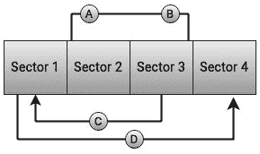

图 6.1 – 磁盘寻址

这意味着，在按顺序完成请求 A 和 B 之后，对于请求 C，磁头将必须回到扇区 1。完成请求 C 后，它还需执行另一个*寻址*操作并前往扇区 D。从这种方法所带来的低效是显而易见的。如果请求按接收的顺序直接交给磁盘，磁盘性能将大打折扣。

对于旋转硬盘，随机访问操作会大大降低性能，因为磁盘必须执行多个*寻址*操作。如果传入请求仅仅按照先进先出的队列顺序插入，队列中的每个请求都需要单独处理，随机寻址所带来的开销将增加。因此，大多数调度器保持请求队列有序，并尽量以排序的方式插入新传入的请求。请求队列按扇区逐个排序。这确保了对相邻扇区的请求能够顺序执行。

## 合并

合并作为排序机制的补充，进一步减少了随机访问。合并可以通过两种方式进行：前向合并和回合并。如果两个请求针对的是连续的扇区，它们就可以合并。如果一个 I/O 请求进入调度器并与已入队的请求相邻，它就符合前向或回合并的条件。如果传入请求与现有请求合并，则称为回合并。回合并的概念如*图 6.2*所示：

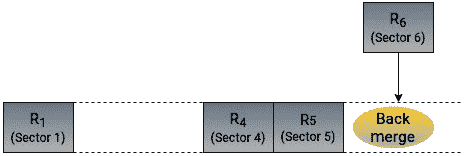

图 6.2 – 回合并

同理，当新生成的请求与现有请求合并时，称之为前向合并，如*图 6.3*所示：

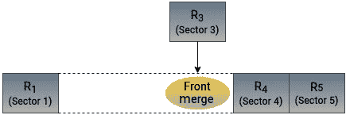

图 6.3 – 前向合并

这个思路很简单——避免不断地访问随机位置。这对旋转机械硬盘尤其有效。默认情况下，大多数块层调度器会尝试将传入请求与现有请求合并。

## 合并

合并操作包括前向合并和回合并。合并发生在一个新的 I/O 请求填补了两个现有请求之间的空隙，如下图所示：

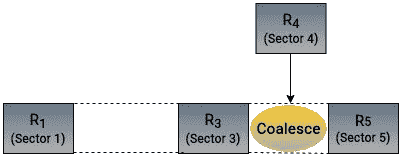

图 6.4 – 合并

合并被用来减少小而频繁的 I/O 操作的开销，尤其是在旋转硬盘驱动器中。通过合并多个请求，磁盘可以执行顺序读写，从而加快 I/O 操作速度并减少磁头的移动。

## 插入

内核使用*plugging*概念来停止队列中请求的处理。我们在这里讨论的是提升性能，那么为何将请求挂起有助于提升性能呢？正如我们所学，合并对硬盘性能有非常积极的作用。然而，为了让较小的 I/O 请求合并成一个较大的统一请求，队列中必须存在相邻扇区的现有请求。因此，为了执行合并，内核首先需要通过一些请求来填充请求队列，从而增加合并的概率。将队列插入（plugging）有助于批量处理请求，为合并和排序操作的机会做好准备。

插入（plugging）是一种确保队列中有足够请求以进行潜在合并操作的技术。它涉及等待更多的请求填满请求队列，并帮助调节请求向设备队列的调度速率。插入的目的是控制请求向设备队列的调度速率。当块设备队列中没有待处理的请求或仅有非常少的请求时，传入的请求不会立即调度到设备驱动程序，这样设备就处于插入（plugged）状态。以下图示说明了这一概念：

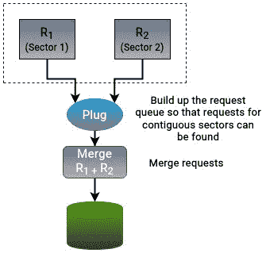

图 6.5 – 插入（Plugging）

插入（plugging）是在进程级别而非设备级别执行的。当进程执行 I/O 操作时，内核会启动一个插入序列。在进程提交其 I/O 请求到队列之后，请求会被转发到块层（block layer），然后调度到设备驱动程序。一旦进程完成提交 I/O 请求，设备就被认为是“拔出”（unplugged）状态。如果在插入序列中应用程序被阻塞，调度器将继续处理已经在队列中的请求。

在讨论了 I/O 调度器中最常用的 I/O 调度技术之后，接下来让我们深入探讨 Linux 中最广泛使用的 I/O 调度器的决策过程背后的推理和原理。

# 解释 Linux I/O 调度器

磁盘调度器是一个有趣的话题。它们作为块层和低级设备驱动程序之间的桥梁。发出的对块设备的请求会被 I/O 调度器修改后交给设备驱动程序。调度器的工作是对 I/O 请求进行合并、排序和插入等操作，并将存储资源分配给排队的 I/O 请求。Linux 中磁盘调度器的一个显著优势是它们的即插即用功能，允许它们实时切换。此外，根据所使用存储硬件的特性，可以为系统中的每个块设备分配不同的调度器。磁盘调度器的选择并不是经常被关注的事情，除非你试图从系统中挤出最大性能。I/O 调度器负责决定 I/O 请求交给设备驱动程序的顺序。这个顺序是基于以下任务的优先级来决定的：

+   降低磁盘寻道

+   确保 I/O 请求的公平性

+   最大化磁盘吞吐量

+   降低对时间敏感任务的延迟

在这些目标之间取得平衡是一项艰巨的任务。不同的调度器利用多个队列来实现这些目标。合并和排序等操作会在请求队列中执行。调度器还会根据其内部算法在这些队列中执行额外的处理。一旦请求准备就绪，它们会被交给设备驱动程序管理的调度队列。

早期块层设计中的主要性能优化针对的是硬盘驱动器。这一点对于磁盘调度算法尤其适用。我们到目前为止讨论的大部分 I/O 处理技术，在底层存储介质由旋转机械驱动器组成时最为有效。正如我们将在*第七章*中看到的，SSD 和 NVMe 驱动器是不同性质的硬件，并不受阻碍机械驱动器的限制影响。

调度器控制底层磁盘的行为，因此在决定应用程序性能时起着至关重要的作用。就像物理存储的不同特性一样，每个应用程序的构建方式也不同。了解所调优环境的工作负载类型至关重要。没有任何一个调度器能够被认为是足够适合匹配所有应用程序不同 I/O 特性的。选择调度器时，必须问以下问题：

+   主机系统类型是什么——是桌面、笔记本、虚拟机还是服务器？

+   将运行什么样的工作负载？是什么类型的应用程序？数据库、多用户桌面界面、游戏还是视频？

+   托管的应用程序是处理器密集型还是 I/O 密集型？

+   后端存储介质类型是什么？HDD、SSD 还是 NVMe？

+   存储是本地的还是来自大型企业存储区域网络的？

实时应用生成的 I/O 请求应在特定的截止时间内完成。例如，在通过多媒体播放器播放视频时，必须保证视频帧能够及时读取，以便视频能够流畅播放。另一方面，交互式应用必须等待任务完成后才能进行下一个任务。例如，在文档编辑器中输入文字时，最终用户期望编辑器在按下键时立即响应。并且，文本必须按输入的顺序显示出来。

对于单个系统，调度器的选择可能不太重要，默认设置可能足够。对于运行企业工作负载的服务器，性能要求就更为严格，调度器如何处理 I/O 请求可能决定了应用程序的整体性能。正如我们在本书中反复提到的，磁盘 I/O 比处理器和内存子系统慢得多。因此，任何关于选择磁盘调度器的决策都应该经过深思熟虑，并伴随着性能基准测试。

磁盘调度不应与 CPU 调度混淆。处理任何请求时，都需要 I/O 和 CPU 时间。简单来说，一个进程向 CPU 请求时间，获得时间后它就可以运行（如果时间被分配）。进程可以向磁盘发出读写请求。然后，磁盘调度程序的工作就是对这些请求进行排序，并将它们引导到底层磁盘。

Linux 中的 I/O 调度器也称为电梯。电梯算法，也叫`SCAN`，将传统机械硬盘的操作与电梯或升降机进行比较。当电梯上下移动时，它会保持一个方向并在途中停下让人上下。在磁盘调度中，驱动的读写头从磁盘的一端开始，向另一端移动，同时服务沿途的请求。继续这个类比，机械硬盘需要在不同的磁盘位置（“楼层”）读取（“接载”）和写入（“卸载”）请求（“人”）。

内核中可用的不同类型的 I/O 调度器适用于特定的使用场景，有些比其他的更合适。正如我们在*第五章*中学到的，单队列框架不能满足现代存储设备的性能要求。驱动技术和多核系统的进步促使了多队列块 I/O 框架的发展。即使实现了这个框架，内核在处理现代驱动时仍然缺少一个重要的成分——一个能够与多队列设备配合使用的 I/O 调度器。为单队列框架设计、用于单队列设备的调度器，在现代驱动上并不能发挥最佳性能。

*图 6.6* 突出了适用于单队列和多队列框架的各种 I/O 调度器类型：

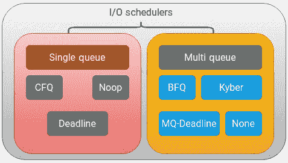

图 6.6 – 不同的 I/O 调度选项

单队列 I/O 调度器已被弃用，并且自版本 5.0 起不再包含在内核中。尽管你可以禁用这些并恢复为单队列调度器，但最新的内核版本默认使用多队列调度器，因此我们将重点关注作为内核一部分的多队列调度器。这个类别中有四个主要的调度器。这些调度器将 I/O 请求映射到多个队列，这些队列由分布在多个 CPU 核心上的内核线程处理：

+   MQ-截止日期

+   **预算公平** **排队** (**BFQ**)

+   Kyber

+   无

让我们来看一下这些调度器的操作逻辑。

## MQ-截止日期调度器 – 保证启动服务时间

截止日期调度器顾名思义，为 I/O 请求服务施加一个截止日期。由于其以延迟为导向的设计，它通常用于延迟敏感的工作负载。由于其高性能，它也被采用于多队列设备。它在多队列设备上的实现被称为*mq-deadline*。

截止日期调度器的主要目标是确保每个请求都有指定的启动服务时间。这是通过对所有 I/O 操作强制实施一个截止日期来实现的，帮助防止请求被忽视。截止日期调度器利用以下队列：

+   **排序**：该队列中的读写操作按其访问的扇区号进行排序。

+   **截止日期**：截止日期队列是一个标准的**先进先出**（**FIFO**）队列，包含按截止日期排序的请求。为了防止请求饥饿，截止日期调度器为读写请求使用单独的截止日期队列实例，并为每个 I/O 请求分配一个过期时间。

截止日期调度器将每个 I/O 请求放入排序队列和截止日期队列中。在决定服务哪个请求之前，截止日期调度器会从中选择一个队列来选择读请求或写请求。如果读写队列中都有请求，优先选择读队列。这是因为写请求可能会导致读操作饥饿。这使得截止日期调度器在读密集型工作负载中非常有效。

截止日期调度器的操作逻辑如以下图所示：

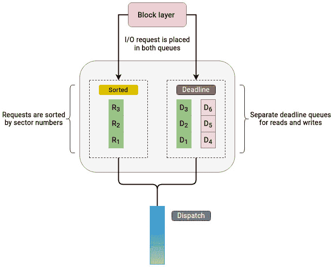

图 6.7 – MQ-截止日期 I/O 调度器

要服务的 I/O 请求决定如下：

1.  假设调度器已经决定处理读请求。它将检查截止时间队列中的第一个请求。如果该请求的计时器已到期，它将被交给调度队列，并插入到调度队列的尾部。调度器接着会将注意力转向排序队列，并选择一个请求批次（默认 16 个请求），这些请求会紧随选中的请求后面。这样做是为了增加顺序操作。可以想象为电梯在前往最终目的地的途中在不同楼层停靠并放人。每批请求的数量是一个可调参数，可以进行更改。

1.  也可能发生在截止时间队列中没有任何请求的截止时间已经过期。在这种情况下，调度器会检查排序队列中最后一个被处理的请求，并选择序列中的下一个请求。调度器随后会选择一个包含 16 个请求的批次，这些请求紧跟在被选择的请求后面。

1.  在处理完每个请求批次后，截止时间调度器会检查写操作截止时间队列中的请求是否已被饿死太久，然后决定是否开始新的读或写操作批次。

下图解释了这个过程。如果收到一个针对磁盘第 19 扇区的读请求，它会被分配一个截止时间，并插入到读操作的截止时间队列的尾端。根据扇区号，该请求也会被放入排序的扇区队列，位于第 11 扇区请求之后。截止时间调度器的操作流程，关于请求如何处理，在*图 6.8*中展示：

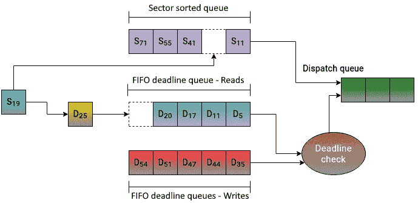

图 6.8 – MQ-deadline I/O 调度器中的请求处理

以下是 `block/mq-deadline` 中 mq-deadline 的代码片段，它控制了前述图示中的某些行为。读请求的截止时间（HZ/2）为 500 毫秒，而写请求的截止时间则为 5 秒（5*HZ）。这确保了读请求具有更高的优先级。术语 `HZ` 代表每秒钟生成的时钟滴答数。`writes_starved` 的定义表示读请求可以饿死写请求。写请求仅在经过两轮读请求后才能得到服务。`fifo_batch` 设置了可以批量处理的请求数量：

```
[……….]
static const int read_expire = HZ / 2;
static const int write_expire = 5 * HZ;
static const int writes_starved = 2;
static const int fifo_batch = 16;
[……….]
```

总结来说，截止时间调度器通过为每个传入请求实现开始服务时间，努力减少 I/O 延迟。每个新请求都会分配一个截止时间计时器。当请求的截止时间到达时，调度器会强制处理该请求，以防止请求饿死。

## 预算公平排队 – 提供按比例的磁盘共享

**预算公平排队**（**BFQ**）调度器在磁盘调度器的世界中是一个相对较新的成员，但它已经获得了相当大的普及。它的设计灵感来源于**完全公平排队**（**CFQ**）调度器。它提供了相当不错的响应时间，并且被认为特别适用于较慢的设备。凭借其丰富而全面的调度技术，BFQ 通常被认为是最完整的磁盘调度器之一，尽管其复杂的设计也使其成为所有调度器中最复杂的一个。

BFQ 是一个按比例分配的磁盘调度器。BFQ 的主要目标是公平地对待所有 I/O 请求。为了实现这种公平性，它采用了一些复杂的技术。在内部，BFQ 使用`最坏情况公平加权公平排队+（B-WF2Q+）`算法来辅助调度决策。

BFQ 调度器为系统中的每个进程保证一个与磁盘资源成比例的份额。它将 I/O 请求收集到以下两个队列中：

+   **每个进程队列**：BFQ 调度器为每个进程分配一个队列。每个进程队列包含同步 I/O 请求。

+   **每设备队列**：所有异步 I/O 请求都被收集到每个设备的队列中。这个队列是进程共享的。

每当创建一个新队列时，它会被分配一个变量预算。与大多数调度器通过分配时间片不同，BFQ 的预算是通过每个进程下次调度访问磁盘资源时允许转移的扇区数来实现的。这个预算的数值最终决定了每个进程的磁盘吞吐量份额。因此，预算的计算是复杂的，并且基于多个因素。主要的因素包括 I/O 权重和进程的近期 I/O 活动。根据这些观察，调度器为进程分配一个与其 I/O 活动成比例的预算。进程的 I/O 权重有一个默认值，但可以更改。预算的分配方式确保单个进程无法独占所有存储资源的带宽。*图 6.9*展示了 BFQ 调度器使用的不同队列：

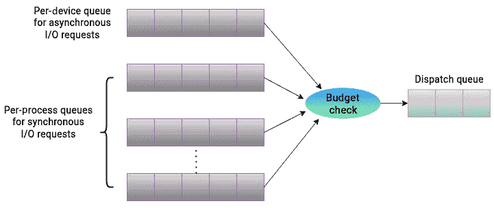

图 6.9 – BFQ I/O 调度器

在服务 I/O 请求时，一些影响调度决策的因素如下所述：

+   BFQ 调度器通过 C-LOOK 算法选择要服务的队列。它从所选队列中取出第一个请求并将其交给驱动程序。队列的预算会根据请求的大小减少。这个过程在本讨论的最后部分会做更详细的说明。BFQ 每次只服务一个队列。

+   BFQ 调度器优先安排具有较小 I/O 预算的进程。通常，这些是具有一小部分随机 I/O 请求的进程。相比之下，具有大量顺序 I/O 请求的 I/O 密集型进程分配了较大预算。在选择要为其提供服务的进程队列时，BFQ 调度器选择具有最低 I/O 预算的队列，为磁盘资源提供独占访问。这种方法实现了两个目标。首先，具有较小预算的进程能够及时得到服务，而无需过度等待。其次，具有较大预算的 I/O 密集型进程获得了比例更大的磁盘资源份额，促进顺序 I/O 操作，从而提升磁盘性能。BFQ 调度器利用稍微非正统的方法来增加磁盘吞吐量，通过检查同步 I/O 请求进行磁盘空闲。当应用程序生成同步 I/O 请求时，它进入阻塞状态并等待操作完成。这些通常是读取请求，因为写入操作是异步的，可以直接在缓存中执行。如果进程队列中的最后一个请求是同步的，则进程进入等待状态。此请求不会立即发送到磁盘，因为 BFQ 调度器允许进程生成另一个请求。在此时间段内，驱动器保持空闲状态。通常情况下，进程会生成另一个请求，因为它等待当前同步请求完成后才会发出新请求。新请求通常与上一个请求相邻，这提高了顺序操作的机会。有时，这种方法可能适得其反，并且可能并不总是对性能产生积极影响。

+   如果两个进程在磁盘上相邻区域上操作，合并它们的请求是有意义的，以便增加顺序操作。在这种情况下，BFQ 合并两个进程的队列，以实现请求的整合。传入的请求与正在服务的进程的下一个请求进行比较，如果两个请求接近，则合并两个进程的请求队列。

如果执行读取请求的应用程序在仍然有剩余预算的情况下耗尽其队列，磁盘将短暂空闲，以使该进程有机会发出另一个 I/O 请求。

调度器在以下事件之一发生前一直为队列提供服务：

+   队列预算用尽。

+   所有队列请求都已完成。

+   在等待来自进程的新请求时，空闲计时器超时。

+   在为队列提供服务时花费了过多时间。

在查看`block/bfq-iosched.c`中找到的 BFQ 代码时，您将发现一个被称为**费用因子**的显著概念，用于异步请求：

```
static const int bfq_async_charge_factor = 3;
```

如前所述，当从队列中选择一个请求进行处理时，队列的预算会减少该请求的大小——也就是请求中的扇区数。这对于同步请求是成立的，但对于异步请求来说，这个成本要高得多。这也是读取操作优先于写入操作的一种方式。对于异步请求，队列会按请求中的扇区数进行收费，并乘以`bfq_async_charge_factor`的值，即 3。根据内核文档，当前的收费因子值是通过一项调优过程确定的，该过程涉及了各种硬件和软件配置。

总结来说，BFQ 调度器通过分配一定比例的 I/O 吞吐量给每个进程，采用公平排队的方法。它使用每个进程的队列来处理同步请求，并使用每个设备的队列来处理异步请求。它为每个进程分配一个预算。这个预算是根据 I/O 优先级以及进程上次调度时传输的扇区数来计算的。尽管 BFQ 调度器比较复杂，并且相较于其他调度器会带来稍微更大的开销，但它被广泛使用，因为它提高了系统的响应时间，并减少了对时间敏感应用的延迟。

## Kyber – 优先考虑吞吐量

Kyber 调度器也是磁盘调度领域中相对较新的一个成员。尽管 BFQ 调度器比 Kyber 调度器更早，但两者都在内核版本 4.12 中正式成为一部分。Kyber 调度器特别为现代高性能存储设备设计。

从历史上看，磁盘调度器的最终目标是减少机械硬盘的寻道时间，从而降低随机访问操作所带来的开销。因此，不同的磁盘调度器使用了复杂且精密的技术来实现这一共同目标。每个调度器以不同的方式优先考虑某些性能方面，这在处理 I/O 请求时会引入额外的开销。随着现代硬盘，如 SSD 和 NVMe，已经不再受随机访问操作的限制，一些调度器所使用的复杂技术可能不再适用于这些设备。例如，BFQ 调度器每个请求的开销稍微较高，因此它不被认为适合具有高吞吐量硬盘的系统。这就是 Kyber 调度器发挥作用的地方。

Kyber 调度器没有复杂的内部调度算法。它旨在用于包含高性能存储设备的环境。它使用非常简单的方法并实施一些基本策略来管理 I/O 请求。Kyber 调度器将底层设备划分为多个域。其理念是为不同类型的 I/O 请求维护队列。通过检查 `block/kyber-iosched.c` 中的代码，我们可以观察到以下请求类型：

```
[…….]
static const char *Kyber_domain_names[] = {
        [KYBER_READ] = "READ",
        [KYBER_WRITE] = "WRITE",
        [KYBER_DISCARD] = "DISCARD",
        [KYBER_OTHER] = "OTHER",
};
[…….]
```

Kyber 调度器将请求分为以下几类——读取、写入、丢弃和其他请求。Kyber 调度器为这些类型的请求维护队列。丢弃请求用于如 SSD 这样的设备。设备上的文件系统可以发出此请求，以丢弃文件系统未使用的块。对于前面提到的请求类型，调度器会对设备队列中相应操作的数量进行限制：

```
[…...]
static const unsigned int Kyber_depth[] = {
        [KYBER_READ] = 256,
        [KYBER_WRITE] = 128,
        [KYBER_DISCARD] = 64,
        [KYBER_OTHER] = 16,
};
[…...]
```

Kyber 调度方法的关键在于限制调度队列的大小。这直接与在请求队列中等待 I/O 请求所花费的时间相关。调度器只将有限数量的操作发送到调度队列，确保调度队列不会过于拥挤，从而实现调度队列中请求的快速处理。因此，请求队列中的 I/O 操作不必等待太长时间即可得到服务。这种方法减少了延迟。以下图示说明了 Kyber 调度器的逻辑：

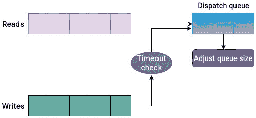

图 6.10 – Kyber I/O 调度器

为了确定允许进入调度队列的请求数量，Kyber 调度器采用了一种简单但有效的方法。它计算每个请求的完成时间，并根据这一反馈调整调度队列中的请求数量。此外，读取和同步写入的目标延迟是可调参数，可以进行修改。根据这些值，调度器将限制请求以满足这些目标延迟。

Kyber 调度器优先处理读取队列中的请求，而不是写入队列中的请求，除非写入请求已经等待过长时间，意味着目标延迟已被突破。

Kyber 调度器在现代存储设备方面是一款性能强大的工具。它专为高速存储设备（如 SSD 和 NVMe）量身定制，并优先考虑低延迟 I/O 操作。该调度器通过仔细检查 I/O 请求动态调整自身，并使得可以为同步写入和读取操作设定目标延迟。因此，它调节 I/O 请求，以满足指定的目标。

## 无 – 最小调度开销

I/O 请求的调度是一个多方面的问题。调度程序必须处理多个方面，例如重新排序队列中的请求、为每个进程分配一定比例的磁盘资源、控制每个请求的执行时间，并确保单个请求不会垄断可用的存储资源。每个调度程序都假设主机本身无法优化请求。因此，它会介入并应用复杂的技术，试图最大限度地利用可用的存储资源。调度技术越复杂，处理开销就越大。在优化请求时，调度程序通常会对底层设备做出一些假设。除非堆栈的低层能够更好地了解可用存储资源，并能自行做出调度决策，否则这种方法通常有效，例如：

+   在高端存储环境中，如存储区域网络，存储阵列通常包括它们自己的调度逻辑，因为它们对底层设备的细微差别有更深的了解。因此，I/O 请求的调度通常发生在较低层次。当使用 RAID 控制器时，主机系统无法完全了解底层磁盘。即使调度程序对 I/O 请求进行了一些优化，可能也没有太大区别，因为主机系统缺乏足够的可见性，无法准确地重新排序请求以降低寻道时间。在这种情况下，直接将请求发送到 RAID 控制器是有意义的。

+   大多数调度程序优化针对的是较慢的机械硬盘。如果环境中使用的是 SSD 和 NVMe 驱动器，那么这些调度优化带来的处理开销可能显得过于冗余。

在这种情况下，一种独特但有效的解决方案是使用 *none* 调度程序。none 调度程序是一个多队列的 *no-op I/O 调度程序*。对于单队列设备，相同的功能是通过 *no-op* 调度程序实现的。

none 调度程序是所有调度程序中最简单的，它不执行任何调度优化。每个传入的 I/O 请求都会被追加到一个 FIFO 队列中，并委托给块设备处理。当已经确定主机不应根据包含的扇区号重新排列请求时，这一策略非常有用。none 调度程序有一个单一的请求队列，包含读写 I/O 请求。由于其原始的方法，尽管 none I/O 调度程序对系统的开销最小，但它不确保任何特定的服务质量。none 调度程序也不对请求进行重新排序，它只进行请求合并以减少寻道时间并提高吞吐量。与所有其他调度程序不同，none 调度程序没有优化的可调参数或设置。请求合并操作是其复杂性的全部。由于这个原因，none 调度程序每个 I/O 请求所需的 CPU 指令最少。none 调度程序的操作基于这样的假设：底层设备，如 RAID 控制器或存储控制器，将优化 I/O 性能。

none 调度程序的简单操作逻辑如*图 6.11*所示：

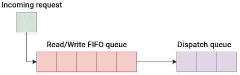

图 6.11 – none I/O 调度程序

尽管每个环境都有许多变量，但根据操作模式，none 调度程序似乎是企业存储区域网络的首选调度程序，因为它不会对底层物理设备做出任何假设，并且不会实施任何可能与低层 I/O 控制器逻辑冲突的调度决策。

鉴于可供选择的选项繁多，确定哪个调度程序最适合你的需求可能是一个挑战。在接下来的部分中，我们将概述本章中介绍的调度程序的常见使用场景。

# 讨论调度难题

我们已经讨论并解释了不同 I/O 调度策略的工作方式，但选择调度程序时应始终伴随通过实际应用工作负载收集的基准测试结果。如前所述，大多数时候，默认设置可能已经足够好。只有当你尝试达到最佳效率时，才会尝试调整默认设置。

这些调度程序的可插拔特性意味着我们可以动态地更改块设备的 I/O 调度程序。有两种方法可以做到这一点。可以通过`sysfs`检查特定磁盘设备的当前活动调度程序。在以下示例中，活动调度程序设置为`mq-deadline`：

```
[root@linuxbox ~]# cat /sys/block/sda/queue/scheduler
[mq-deadline] none bfq kyber
[root@linuxbox ~]#
```

要更改活动调度程序，将所需调度程序的名称写入调度程序文件。例如，要为`sda`设置 BFQ 调度程序，可以使用以下命令：

```
echo bfq > /sys/block/sda/queue/scheduler
```

上述方法只会暂时设置调度器，并在重启后恢复默认设置。要使此更改永久生效，请编辑 `/etc/default/grub` 文件，并将 `elevator=bfq` 参数添加到 `GRUB_CMDLINE_LINUX_DEFAULT` 行中。然后，重新生成 `GRUB` 配置并重启系统。

单纯改变调度器并不会带来两倍的性能提升。通常，性能提升在 10% 到 20% 之间。

尽管每个环境不同，调度器的性能可能会根据多个变量而有所变化，但作为基准，以下是我们在本章中讨论的调度器的一些使用场景：

| **使用场景** | **推荐的** **I/O 调度器** |
| --- | --- |
| 桌面 GUI、交互式应用程序和软实时应用程序，如音频和视频播放器 | BFQ，因为它能保证良好的系统响应性和低延迟，适用于时间敏感型应用 |
| 传统机械驱动 | BFQ 或 MQ-deadline – 都被认为适用于较慢的驱动。Kyber/none 偏向于支持更快的磁盘。 |
| 高性能 SSD 和 NVMe 驱动作为本地存储 | 最好使用 none，但在某些情况下 Kyber 也可能是一个不错的替代方案 |
| 企业存储阵列 | None，因为大多数存储阵列内置了逻辑来更高效地调度 I/O |
| 虚拟化环境 | MQ-deadline 是一个不错的选择。如果虚拟机管理程序层已经自行调度 I/O，那么使用 none 调度器可能会有帮助。 |

表 6.1 – I/O 调度器的典型使用场景

请注意，这些并非严格的使用场景，因为通常多个条件可能会重叠。应用类型、工作负载、主机系统和存储介质等因素在选择调度器之前都需要考虑。通常，deadline 调度器被认为是一个多用途的选择，因为它的 CPU 开销较小。BFQ 在桌面环境中表现良好，而 none 和 Kyber 更适合高端存储设备。

# 总结

本章概述了 I/O 调度，这是块层的一个关键功能。当一个读写请求穿过虚拟文件系统的所有层时，最终会到达块层。本章探讨了各种 I/O 调度器及其特性，包括优点和缺点。块层包含多个适用于特定使用场景的 I/O 调度器。I/O 调度器的选择在决定如何处理下层的 I/O 请求中起着至关重要的作用。为了做出更具性能导向的决策，大多数调度器使用一些常见技术，以帮助提高整体磁盘性能。本章讨论的技术包括合并、聚合、排序和插入。

我们还解释了内核中不同的调度选项。内核为单队列和多队列设备提供了不同的 I/O 调度程序。自内核版本 5.0 起，单队列调度器已经被弃用。多队列调度选项包括多队列 Deadline 调度器、BFQ、Kyber 和 None 调度器。每个调度器适用于特定的使用场景，没有一个适用于所有情况的单一推荐方案。MQ-deadline 调度器具有良好的通用性能。BFQ 调度器更倾向于交互式应用，而 Kyber 和 None 则面向高端存储设备。选择调度器时，了解环境的详细信息至关重要，其中包括工作负载类型、应用程序、主机系统和后端物理介质等细节。

本章总结了本书第二部分的内容，我们深入探讨了块层。下一章，我们将看到当前可用的不同类型存储介质，并解释它们之间的差异。

# 第三部分：深入物理层

本部分将介绍 Linux 内核中 SCSI 子系统的架构和主要组件。你还将了解当前可用的不同类型物理存储介质及其实现差异。

本部分包含以下章节：

+   *第七章*，*SCSI 子系统*

+   *第八章*，*物理介质布局示意*
