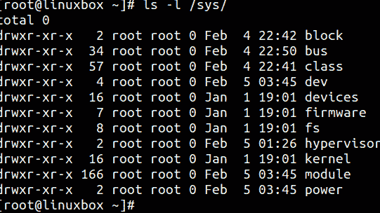
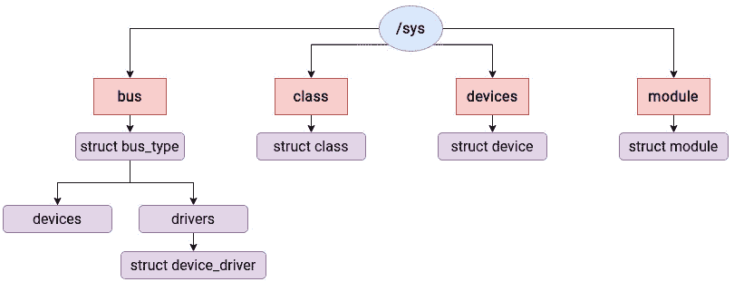
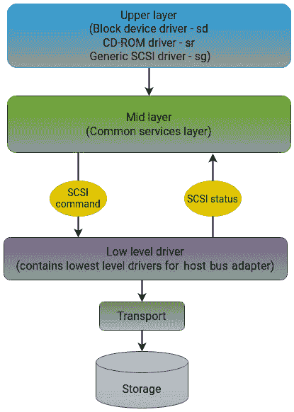
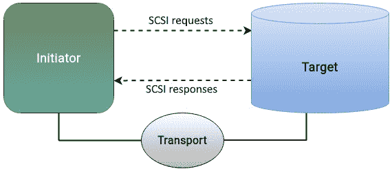
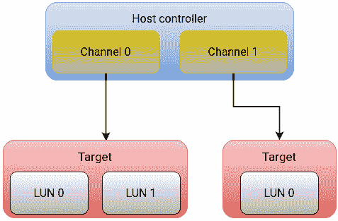
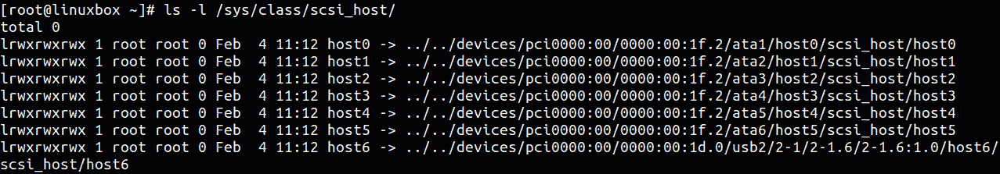
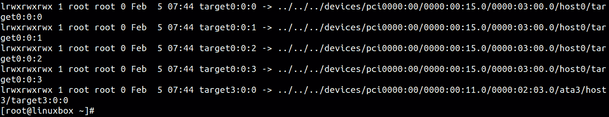
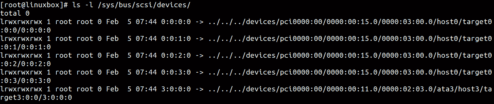
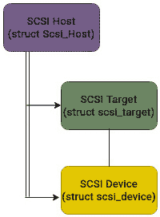
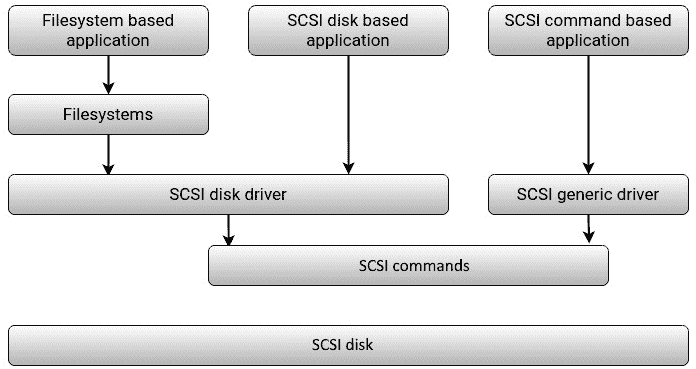

# SCSI 子系统

在本书中，我们逐步从存储栈的高层走向低层。我们从 VFS 开始，探讨了主要的 VFS 结构和文件系统，接着研究了块层中的结构和调度技术。VFS 和块层代表了 I/O 层次结构中软件部分的一个重要组成部分。随着我们逐步进入物理层，事情变得稍微更通用，因为用于访问物理硬盘的底层标准在大多数系统中是相同的。

本书的*第三部分*包含了两章，专门用于建立对物理层面的理解。在本章中，我们将主要关注一个已经存在一段时间的子系统，它是最常用的标准和协议，用于访问物理设备——**小型计算机系统接口**（**SCSI**）。

SCSI 协议的发展旨在促进计算机与外设之间无缝的数据传输，包括磁盘驱动器、光盘驱动器、打印机、扫描仪以及其他各种资源，从而确保高效可靠的通信。由于我们这里主要关注存储，我们将仅讨论它在磁盘驱动器方面的作用。任何传递给 SCSI 的读写请求都会被转换成等效的 SCSI 命令。需要理解的是，SCSI 不处理数据块的传输安排或它们在磁盘上的物理布局，这些属于 I/O 层次结构中的上层职责。

在我们深入了解 SCSI 之前，首先需要对 Linux 中的设备模型有一个基本的了解。内核中的 `kobject` 结构提供了一系列构造体，使硬件设备与相应的设备驱动程序之间能够顺利地进行通信和交互。掌握了设备模型的一些基本知识后，我们将尝试解释 SCSI 子系统的主要组成部分。

在本章中，我们将讨论以下主要主题：

+   设备驱动程序模型

+   SCSI 子系统

# 技术要求

由于 SCSI 是一种用于与外设通信的协议，例如硬盘，了解这些设备的基本工作原理有助于理解 SCSI 子系统。

本章中展示的命令和示例不依赖于特定的发行版，可以在任何 Linux 操作系统上运行，例如 Debian、Ubuntu、Red Hat 或 Fedora。本书中有不少引用了内核源代码。如果你想下载内核源代码，可以从 [`www.kernel.org`](https://www.kernel.org) 下载。

# 设备驱动程序模型

内核中有不同的子系统，例如 **系统调用接口**、**虚拟文件系统（VFS）**、**进程和内存管理**、以及 **网络栈**。在本书中，我们严格聚焦于 Linux I/O 层级结构中的各个结构和实体。然而，实际上，读取和写入存储设备的数据过程必须经过这些子系统中的大部分。正如我们所见，抽象层次是 I/O 栈的核心，但这种抽象方式不仅限于存储设备。对于内核来说，磁盘只是其必须管理的多个硬件中的一个。如果有一个专门的子系统来管理不同类型的设备，那么代码将会变得臃肿。当然，不同类型的设备通常会有不同的处理方式，因为它们的角色可能截然不同，但对于最终用户来说，应该有一个关于系统结构的通用抽象视图。

为了实现这种统一，Linux 设备模型提取了设备操作的共性属性，将其抽象化，并在内核中实现这些共性属性，为新加入的设备提供统一的接口。这使得驱动开发过程更加简便顺畅，因为开发者只需要熟悉接口即可。

设备模型的主要目标是维护准确反映系统状态和配置的内部数据结构。这包括设备的存在、它们的关联总线和驱动程序，以及系统中总线、设备和驱动的整体层级和结构等重要信息。为了跟踪这些信息，设备模型利用以下实体将它们映射到物理对应物：

+   **总线**：系统中有多个组件，例如 CPU、内存以及输入输出设备。这些设备之间的通信依赖于一个通道，这个通道就是总线。总线是用来传输数据的通道。你可以把它想象成一个线性通道，用于传递交通信号，类似于一条道路。为了方便设备模型的抽象，所有设备都应该连接到总线上。设备模型中的总线是基于物理总线的抽象。

+   **设备**：这是指连接到总线的物理设备。在设备模型中，*设备*抽象了系统中的所有硬件设备，并描述了它们的属性、所连接的总线以及其他信息。

+   **设备驱动**：驱动程序是与设备关联的软件实体。设备模型通过驱动程序来抽象硬件设备的驱动，包括设备初始化和电源管理相关的接口实现。

+   **Class**: 类的概念有些有趣。类代表具有类似功能或属性的设备集合。例如，SCSI 和 **Advanced Technology Attachment** (**ATA**) 驱动程序属于同一磁盘类别。类用于根据功能而不是连接性或操作机制对设备进行分类。这与面向对象编程中类的概念有些相似。

设备模型提供一种通用机制来表示和操作系统中的每个设备。正如我们在本书的 *第一章* 中解释的那样，内核通过 VFS 提供了一个窗口来导出有关各种内核子系统的信息。用户空间中设备模型的表示可以通过 `Sysfs` VFS 查看。`Sysfs` 文件系统被挂载在 `/sys` 目录下，如下截图所示:



图 7.1 – Sysfs 的内容

目录包含以下信息:

+   `block`: 这包含系统中所有可用的块设备，包括磁盘和分区

+   `bus`: 这表示连接物理设备的各种总线类型，例如 PCI、IDE 和 USB

+   `class`: 这表示系统中可用的驱动程序类别，如网络、声音和 USB

+   `devices`: 这表示系统中连接设备的分层结构

+   `firmware`: 这包含从系统固件检索的信息，特别是 ACPI

+   `fs`: 这提供有关已挂载文件系统的详细信息

+   `kernel`: 这提供内核状态信息，包括已登录用户和热插拔事件

+   `module`: 这显示当前加载的模块列表

+   `power`: 这包含有关电源管理子系统的信息。

描述模型中内核数据结构与 `Sysfs` VFS 中的子目录之间存在关联。设备模型中有多个结构允许设备驱动程序与相应的硬件设备之间进行通信。我们不打算探索这些结构，但只需知道，Linux 设备模型的基本结构是 `kobject`。将 `kobject` 想象为将设备模型和 `Sysfs` 接口粘合在一起的胶水。模型较高级别中的结构如 *图 7**.2* 所示:

+   `struct bus_type`

+   `struct device`

+   `struct device_driver`

这里是 *图 7**.2*:



图 7.2 – 设备模型组件

总结来说，Linux 设备模型通过一套标准的数据结构和接口对硬件设备进行分类和抽象。通过查看 `Sysfs` 文件系统的内容，可以在用户空间中看到这个模型。`Sysfs` 中的实体与实际的物理实现紧密相关。接下来，让我们更详细地探讨 SCSI 子系统的架构。

# 解释 SCSI 子系统

当提到**SCSI**（发音为 SKUZ-ee）时，人们可能指代几个不同的意思：

+   连接外设与计算机的硬件总线

+   一组用于通过不同总线与设备通信的命令集

长时间以来，SCSI 是计算机中 I/O 总线的主要技术。SCSI 定义了一个接口和一个数据协议，用于将不同类型的设备连接到计算机上。作为一种媒介，SCSI 定义了一个用于数据传输的总线。作为协议，它定义了设备如何通过 SCSI 总线进行相互通信。

最初，外设设备的连接是通过并行 SCSI 总线实现的。多年来，SCSI 并行总线逐渐被淘汰，取而代之的是串行接口。其中最常见的接口包括**串行附加 SCSI**（**SAS**）和**SCSI 通过光纤通道**。串行接口提供了更高的数据传输速率和可靠性。还有一种通过 TCP/IP 实现的 SCSI 协议，称为**互联网 SCSI**（**iSCSI**）。

我们将在这里聚焦于 Linux 方面，讨论 SCSI 子系统在 I/O 层次结构中的组织方式。SCSI 标准为各种设备定义了命令集，不仅仅是硬盘。SCSI 命令可以通过几乎任何类型的传输机制发送。这使得 SCSI 成为通过 SATA、SAS 或光纤通道协议访问存储设备的事实标准。

## SCSI 架构

SCSI 子系统采用三层架构。顶部的层代表内核的最高接口，用于最终用户应用程序。中间层为 SCSI 堆栈的上下层提供一些公共服务。最底层是底层，它包含与底层物理设备交互的实际驱动程序。每个涉及 SCSI 子系统的操作都在三个层级中各使用一个驱动程序。*图 7.3* 强调了 SCSI 子系统的多层设计：



图 7.3 – SCSI 架构

以下小节中将更详细描述这三层。

### 上层

**上层**包含最接近用户空间应用程序的特定设备类型驱动程序。这些上层驱动程序提供用户空间和内核空间之间的接口。最常用的上层驱动程序包括以下几种：

+   `sd`：磁盘驱动程序

+   `sr`：CD-ROM 驱动程序

+   `sg`：通用的 SCSI 驱动程序

在查看这些驱动程序名称之后，设备名称通常会以驱动程序的前缀缩写表示，如 `sda`，这也就不足为奇了。上层接受来自存储栈更高层的请求，如 VFS，并通过中间层和下层将它们转化为相应的 SCSI 请求。在 SCSI 命令完成后，上层驱动程序会通知更高层。通用的 SCSI 驱动程序 `sg` 允许直接向 SCSI 设备发送 SCSI 命令，绕过文件系统层。

上层 SCSI 磁盘驱动程序实现于 `/linux/drivers/scsi/sd.c`。上层 SCSI 磁盘驱动程序通过调用 `register_blkdev` 注册为块设备，进行自我初始化，并通过 `scsi_register_driver` 函数提供一组功能来表示所有 SCSI 设备。

### 中间层

**中间层** 是所有 SCSI 操作的共同部分，包含了 SCSI 支持的核心。中间层通过定义内部接口并向上下层驱动程序提供公共服务，将上层和下层连接起来。它负责管理 SCSI 命令队列，确保高效的错误处理，并促进电源管理功能。没有中间层提供的功能，上层和下层驱动程序无法正常工作。

通用的中间层 SCSI 驱动程序实现于 `linux/drivers/scsi/scsi.c`。中间层抽象了低层驱动程序的实现，并将上层的命令转化为等效的 SCSI 请求。中间层还实现了命令排队功能。当接收到上层的请求时，中间层会将请求排队以便处理。一旦请求处理完成，它会接收来自下层的响应并通知上层。如果请求超时，中间层负责执行错误处理或重新发送请求。

有几个重要的函数，通过它们，中间层作为上层和下层之间的桥梁，`sd_probe` 和 `sd_init`。在驱动程序初始化期间以及每当新的 SCSI 设备连接到系统时，`sd_probe` 函数在确定设备是否受 SCSI 磁盘驱动程序管理方面发挥着关键作用。如果设备在管理范围内，`sd_probe` 会生成一个新的 `scsi_disk` 结构体来作为该设备的代表实体。当来自存储栈更高层的读取或写入请求（如文件系统）被接收时，`sd_init_command` 函数将该请求转换为相应的 SCSI 读写命令。

### 下层

`lpfc` 是 Emulex HBA 的设备驱动程序。低层驱动程序位于 `linux/drivers/scsi/` 目录中。

现在，让我们更深入地探讨 SCSI 子系统如何在客户端-服务器模型中运行。

## 客户端和服务器模型

SCSI 子系统接收来自存储栈上层的请求，要求从存储设备发送或检索数据块。当应用程序发起读取或写入请求时，SCSI 层通过将该请求转换为等效的 SCSI 命令来处理它。SCSI 子系统不处理数据块如何在存储设备上组织和存放；这是 I/O 栈上层的工作。SCSI 将数据块发送到目标设备，这个目标设备可以是一个单独的磁盘，或一个**独立冗余磁盘阵列**（**RAID**）控制器。

当操作系统侧的 SCSI 层开始对存储设备执行操作，并且存储设备反过来响应并执行该操作时，这一事件流程可以被归类为客户端-服务器交换模型。在 SCSI 术语中，双方被称为**发起者**和**目标**。发起请求的主机操作系统被称为 SCSI 发起者。接收并处理此请求的目标存储设备被称为 SCSI 目标。

SCSI 发起者驻留在主机上，代表 I/O 栈中的上层（如应用程序和文件系统）生成请求。SCSI 目标等待发起者的命令，并执行请求的数据传输。必须有一个底层的传输机制来确保发起者的 SCSI 命令能够传送到目标。这是通过 SCSI 传输层来实现的。有多种传输协议可用，例如用于直接附加磁盘的**串行附加 SCSI**（**SAS**），以及用于 SCSI 目标的光纤通道或 iSCSI，这些 SCSI 目标属于**存储区域网络**（**SAN**）。SCSI 发起者和目标之间的关系如*图 7.4*所示：



图 7.4 – SCSI 发起者和目标

接下来让我们来讨论地址方案。

### 设备地址

Linux 使用四部分层次化的地址方案来标识 SCSI 设备。这四个数字的组合唯一标识了系统中 SCSI 设备的位置。如果你在命令行中运行 `lsscsi` 或 `sg_map -x`，你会看到每个 SCSI 设备都会用一组四个数字来表示：

```
[root@linuxbox ~]# lsscsi
[0:0:0:0]    disk    ATA      SAMSUNG MZMTE512 400Q  /dev/sda
[4:0:0:0]    disk    ATA      ST9320320AS      SD57  /dev/sdb
[6:0:0:0]    disk    Generic- Multi-Card       1.00  /dev/sdc
[root@linuxbox ~]#
```

这种四元地址方案被称为**主机、总线、目标和 LUN**（**HBTL**），其字段解释如下：

+   **主机**：主机表示一个能够发送和接收 SCSI 命令的控制器。SCSI 主机 ID 是 HBA 的 ID，也被称为 SCSI 控制器或 SCSI 适配器。该标识符表示分配给内部系统总线上的适配器卡的任意编号。内核根据适配器发现顺序按升序分配这个编号。例如，第一个适配器将被分配为零，第二个适配器为一，依此类推。

+   **总线**：这是在 SCSI 控制器中使用的总线或通道。一个控制器可以有多个 SCSI 总线。此标识符由内核分配，反映了 SCSI 控制器的硬件和固件架构的一部分。通常，SCSI 控制器只有一个总线。高端设备，如 RAID 控制器，可以拥有多个总线。

+   **目标**：每个总线可以连接多个设备或目标。目标是总线内的目的设备。这个标识符也由内核分配，按给定 SCSI 控制器内目标发现的顺序进行分配。

+   **逻辑单元号（LUN）**：这是主机操作系统看到的 SCSI 目标中的逻辑设备。LUN 是能够接收主机发送的 SCSI 命令的实体，意味着一个磁盘驱动器。每个 LUN 在内核的块层中都有一个独占的请求队列。LUN 标识符由存储设备分配，使其成为 SCSI 寻址方案中唯一一个不是由内核分配的部分。

下图说明了这一寻址机制以及从主机到 SCSI 硬盘的路径。请注意，与 SCSI 控制器或 HBA 相关联的是一个相对的 SCSI 目标索引。第一次在 `host0` 上发现的 SCSI 存储目标被分配为 SCSI 目标（相对索引）0，然后是 1、2，以此类推：



图 7.5 – SCSI 寻址

如果你查看 `/sys/class/scsi_host/`，你会看到主机 0 到 6 对应于 SCSI 控制器：



图 7.6 – Sysfs 中的 SCSI 主机

类似地，`targetX:Y:Z` 格式的结构存在于 `/sys/bus/scsi/devices/` 中，并附加到 SCSI 总线：



图 7.7 – Sysfs 中的 SCSI 目标

LUN 可以通过之前讨论的四级层次寻址方案进行标识：



图 7.8 – Sysfs 中的 SCSI LUN

现在我们将探索一些与 SCSI 子系统相关的内核中的主要数据结构。

### 主要数据结构

上述概念通过三个主要数据结构在内核中实现——`Scsi_Host`、`scsi_target`和`scsi_device`。当然，这些并不是内核中唯一与 SCSI 相关的结构。除了这三种结构外，还有几个辅助结构，例如`scsi_host_template`和`scsi_transport_template`。顾名思义，这些结构用于表示 SCSI 适配器和传输类型的一些共通特性。例如，`scsi_host_template`为相同型号的主机适配器提供共通内容，包括请求队列深度、SCSI 命令处理回调函数以及错误处理恢复函数。SCSI 设备包括硬盘、SSD、光驱等，所有这些设备都具有一些共通功能。这些共通功能被提取为内核中的模板。

这三种主要结构如下：

+   `Scsi_Host`：这是对应于控制器或 HBA 的数据结构，位于 SCSI 总线下。它包含关于 HBA 的信息，例如其唯一标识符、最大传输大小、支持的特性和主机特定的数据。系统中可以存在多个 SCSI 主机结构，每个结构代表一个独立的主机适配器。`SCSI_Host`结构作为管理 SCSI 通信的顶级结构。

+   `scsi_target`：该结构对应于附加到特定主机适配器的目标设备。它包含关于目标的信息，例如其 SCSI ID、**LUN**以及其他一些标志和参数。SCSI 目标结构与特定的 SCSI 主机结构相关联，并用于管理与该目标设备相关的通信和命令。目标设备可以是物理设备或虚拟设备。

+   `scsi_device`：该结构表示 SCSI 目标设备中的一个 LUN。它表示目标内的特定设备或分区。当操作系统扫描连接到主机适配器的逻辑设备时，它会为上层 SCSI 驱动程序创建一个`scsi_device`结构，以便与设备进行通信。它包含设备的 SCSI ID、LUN 和队列深度等信息。它与 SCSI 目标结构和 SCSI 主机结构都相关联，并用于管理该特定设备的通信和 I/O 操作。

这个分层方案允许内核高效地管理 SCSI 设备及其通信。命令和数据传输可以被定向到特定的 SCSI 设备或逻辑单元，并且可以在层次结构的每一层进行错误处理和状态跟踪。这些结构的相互作用在*图 7.9*中得到了突出展示：



图 7.9 – 主要的 SCSI 结构

请注意，Linux 内核中 SCSI 设备的实际实现要复杂得多，涉及到额外的数据结构和接口。然而，这个简化的图示展示了 SCSI 主机、SCSI 目标和 SCSI 设备结构之间的基本连接。

### 与 SCSI 设备通信

如*图 7.10*所示，和 SCSI 设备通信有三种不同的方式：



图 7.10 – 与 SCSI 设备通信

如下所述：

+   **基于文件系统**：最常见的方法是通过文件系统提供的接口访问 SCSI 设备。这是大多数常规用户空间应用与 SCSI 设备交互的方式。

+   Linux 中的`dd`命令。使用原始访问方法不需要文件系统进行地址映射。

+   在 Linux 中可用的`sg3_utils`包提供了一组工具，可以通过主机操作系统提供的 SCSI 直通接口将 SCSI 命令发送到设备。

### SCSI 层与块层之间的交互

SCSI 层和块层协同工作，以促进 SCSI 设备与文件系统之间的交互。SCSI 层作为块层与特定 SCSI 主机适配器设备驱动程序之间的中间层。

以下是 SCSI 层与块层交互的概述：

1.  当文件系统发送 I/O 请求（如读写操作）时，块层将其转换为 SCSI 命令。块层构建一个与请求操作对应的 SCSI **命令描述块**（**CDB**），并将其传递给 SCSI 层。

1.  SCSI 中间层从块层接收 SCSI 命令并执行必要的处理，包括命令排队、错误处理和数据传输。

1.  SCSI 中间层将 SCSI 命令转发给与特定 SCSI 主机适配器相关的适当底层 SCSI 设备驱动程序。设备驱动程序直接与硬件交互，并通过 SCSI 总线将 SCSI 命令发送到目标设备。

1.  一旦目标设备执行了 SCSI 命令，底层的 SCSI 设备驱动程序接收到命令完成状态，并将此信息传递回 SCSI 中间层，随后再传递给块层。

1.  块层接收来自 SCSI 中间层的命令完成状态，并使用此信息处理任何错误，更新 I/O 请求状态，并通知文件系统关于 I/O 请求的完成或失败。

请注意，这是块层和 SCSI 层之间交互的概述视图。块层为高层（如文件系统）提供标准化接口，而 SCSI 层负责将块级 I/O 请求转换为等效的 SCSI 命令，并通过特定于 SCSI 主机适配器的底层设备驱动程序管理与 SCSI 设备的通信。

# 概要

本章重点讨论了两个主要主题：Linux 中的设备模型和 SCSI 子系统。我们首先简要概述了 Linux 中的设备模型，以及内核如何通过`Sysfs`虚拟文件系统在用户空间提供其视图。接着我们探讨了 SCSI 子系统，并解释了其三级架构。

如本章所述，SCSI 定义了一个接口和一个数据协议，用于将不同类型的设备连接到系统。作为一种媒介，它定义了一个用于数据传输的总线；作为协议，它定义了设备如何通过 SCSI 总线相互通信。当用户空间中的应用程序发起写入请求以存储数据时，SCSI 子系统将此写入请求转换为 SCSI 命令，将请求的数据写入指定的磁盘位置。它充当 I/O 栈中高层和物理存储之间的中介。SCSI 不负责传输过程中数据块的组装或它们在磁盘上的物理放置。在 SCSI 术语中，发起请求的一方被称为发起者，而目标方则称为目标。SCSI 协议的目标可以是单个物理驱动器、HBA 或 RAID 控制器。SCSI 协议的主要职责是确保写入任务的成功完成，并将其状态报告给高层。

在下一章，我们将讨论当今世界中可用的不同物理存储选项，如机械硬盘、固态硬盘（SSD）和 NVMe 硬盘。我们将描述它们在设计上的差异，并比较它们之间的异同。
