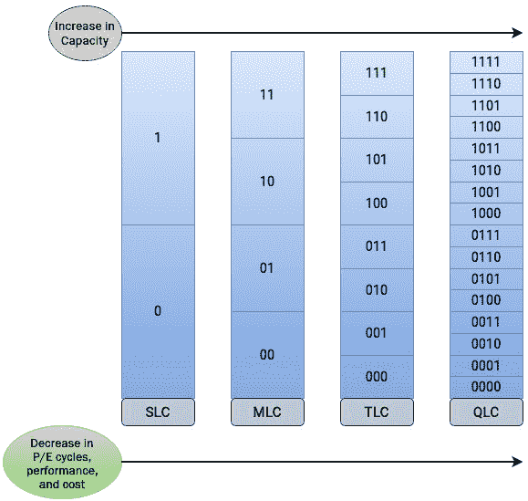

# 8

# 说明物理介质的布局

“如果我问人们他们想要什么，他们会说更快的马。” — 亨利·福特

在本书的前七章中，我们探讨了 Linux 内核中存储层次结构的组织方式、不同层次的组织方式、不同的抽象方法以及物理存储设备的表示方式。我们现在已经完成了对存储堆栈中软件部分的解释，这意味着是时候看看实际硬件，了解其中的奥秘了。我认为最好的方式是通过了解不同类型的存储介质，这样我们不仅能理解它们的工作原理，还能看到为什么 Linux 内核使用不同的调度器和技术来处理不同类型的硬盘。简而言之，了解磁盘驱动器的内部结构将使本书中之前呈现的信息更具相关性。

硬件介质的选择在过去几年中发生了变化，因为市场上现在有大量的选择，不仅适用于企业存储，也适用于个人使用。这些不同的存储选项适用于特定的环境和工作负载类型。例如，在某些场景中，人们寻求容量优先的解决方案，而在其他场景中，最大化性能是最终目标。无论如何，每种场景都有相应的解决方案。对于企业环境，供应商提供可以实现混合解决方案的存储阵列，包含这些选项的组合。

大多数协议和系统在设计时都考虑到了旋转硬盘。Linux 中的存储堆栈也不例外。在讨论块层调度时，我们看到合并和合并等技术是针对机械硬盘的，以便增加顺序操作的数量。由于本章完全涉及不同类型硬盘的物理布局和结构，我们将详细了解为什么旋转硬盘比其他硬盘更慢。

我们将从介绍今天最传统、最古老的存储形式——旋转硬盘开始。我们将讨论其物理结构、设计和工作原理。之后，我们将转向固态硬盘，看看它们与机械硬盘有何不同。我们将讨论它们的内部结构和布局，并解释它们的工作原理。我们还将简要讨论硬盘耐久性的概念，并了解机械硬盘和固态硬盘在这方面的区别。最后，我们将讨论**非易失性内存快车道**（**NVMe**）接口，它彻底改变了固态硬盘的性能。

我们将讨论以下主要话题：

+   理解机械硬盘

+   解释固态硬盘的架构

+   理解硬盘耐久性

+   使用 NVMe 重新定义固态硬盘

# 技术要求

本章节介绍的内容与操作系统无关。因此，没有与 Linux 特定绑定的命令或概念。不过，如果你对今天可用的不同类型的存储介质选项有一些基本知识，会有所帮助。

# 了解机械硬盘

机械硬盘，也称为硬盘、磁盘、旋转盘或旋转盘，是现代计算机系统中唯一的机械组件。在本书中，我们通常通过称它们为更慢或遗留驱动器来描述它们。事实上，尽管近年来机械硬盘的使用有所下降，但它们仍然广泛存在于今天的企业环境中，扮演了稍有不同角色。由于性能敏感的应用程序有更好的存储选项可用，因此硬盘主要用于冷数据存储。由于更高的容量和较低的成本，机械硬盘仍然是任何环境中不可或缺的一部分。

让我们简要描述机械硬盘的主要组成部分：

+   **盘片**：硬盘由多个薄圆盘组成，称为盘片。所有硬盘上的数据都记录在这些盘片上。为了最大化容量，数据可以从盘片表面的顶部和底部进行读写。盘片表面从两端磁化。这些盘片的总数和它们的存储容量决定了硬盘的总容量。

+   **主轴**：驱动盘片旋转依靠驱动主轴电机的动力，该电机设计用于保持恒定的转速。硬盘盘片以每分钟数千转（**rpm**）的速度旋转，标准主轴转速为 5,400 rpm、7,200 rpm、10,000 rpm 和 15,000 rpm，因为所有盘片都连接到单个主轴电机上。因此，它们同时旋转并以相同的速度旋转。

+   **读写（R/W）头**：作为新手，我一直以为数据是以书面形式或书写形式刻在硬盘上的。事实上，数据是通过移动介质上磁信号的模式来表达的。每个盘片上有两个读写头，分别位于顶部和底部。在写数据时，读写头修改盘片表面的磁方向，而在读取数据模式下，读头检测盘片表面的磁方向。值得注意的是，读写头永远不会触碰盘片表面。

+   **臂式臂**：臂式臂组件负责安装**读写**头。臂式臂在将读写头精确定位到需要读取或写入数据的特定位置方面起着至关重要的作用。

+   **控制器**：磁盘控制器是一个重要组件，负责管理之前提到的各个组件的运行，并与主机系统进行交互。它执行来自主机的指令，管理读写头，并控制驱动臂。

现在我们已经熟悉了机械硬盘的主要组件，让我们来看看机械硬盘的几何结构。

## 查看物理布局和寻址

硬盘的几何描述了数据在盘片上的组织方式。这种组织方式是基于将盘片表面分成同心圆环，称为磁道。柱面是一个垂直部分，穿过所有盘片上的相应磁道，用于指代磁盘上的特定位置。柱面由每个盘片上的相同磁道号组成。每个磁道进一步划分为更小的单元，称为扇区。扇区是硬盘上最小的可寻址单元。我们在*第三章*中讨论过块大小的概念。块是一组扇区，是文件系统的属性。扇区是硬盘的物理属性，其结构由硬盘制造商在初次格式化时创建。最初，最常见的扇区大小是 512 字节。然而，一些现代硬盘也使用 4KB 的扇区。以下是机械硬盘物理结构的示意图：

图 8.1 – 机械硬盘结构

有几种技术可以用来寻址硬盘上的物理位置。一种被称为**柱面、磁头和扇区**（**CHS**）。硬盘的物理几何通常通过 CHS 表示。CHS 的组合可以用来标识磁盘上的任何位置。为了在硬盘上定位一个地址，主机操作系统必须知道磁盘的 CHS 几何信息。

CHS 现在已被**逻辑块寻址**（**LBA**）所取代。LBA 是另一种磁盘寻址方式，它简化了操作系统侧的地址管理。LBA 使用线性寻址方案来访问物理数据块。使用 LBA 时，不再通过 CHS 寻址扇区，而是为每个扇区分配一个唯一的逻辑编号。通过这种方式，硬盘被简化为一个单一的大设备，只需从 0 开始计数现有的扇区。然后，磁盘控制器的任务是将 LBA 地址转换为 CHS 地址。主机操作系统只需要知道磁盘驱动器的大小，以逻辑块地址的数量表示即可。

## 查看坏道

坏扇区或坏块是硬盘上无法再写入或读取的区域，可能是因为它们已损坏或受到损坏。在这种情况下，硬盘控制器会将逻辑扇区重映射到另一个物理扇区。这一过程可以透明地进行，操作系统不会察觉到。

坏扇区有两种类型——硬坏扇区和软坏扇区。**硬坏扇区**是由于物理损坏（例如，物理冲击或制造缺陷）导致的。硬错误通常是无法修复的，这样的扇区无法再用于存储数据。**软坏扇区**是硬盘上由主操作系统识别为有问题的区域。如果该扇区的**纠错码**（**ECC**）与写入该位置的信息不匹配，操作系统可以识别该扇区为有问题。如果应用程序尝试从某个扇区读取数据并发现 ECC 与该扇区的内容不匹配，这可能表示该扇区存在软坏扇区错误。这些错误可以通过多种方法进行修正和解决。

## 查看硬盘性能

在强调机械硬盘的性能限制时，我们经常使用*寻道*或*寻道时间*这个术语。硬盘的寻道时间是指将读写头移动到磁盘表面正确轨道所花费的时间。如前所述，机械硬盘的随机访问操作非常昂贵。当访问随机轨道上的数据时，寻道时间会增加，因为读写头需要不断移动。硬盘的寻道时间越低，I/O 请求的服务速度越快。

一旦读写头定位到正确的轨道，接下来的任务是将所需的扇区定位到头部下方。为此，磁盘盘片会旋转，以将请求的扇区定位到读写头下方。完成这一任务的总时间被称为旋转延迟。这个操作依赖于主轴电机的速度。电机的转速越高，旋转延迟就越低。同样，如果请求的是同一轨道上的相邻扇区，旋转延迟会较低。要在随机扇区上读写数据时，旋转延迟会更高。

驱动头需要在旋转磁盘的特定区域进行对准才能读取或写入数据，这导致在数据能够访问之前会出现延迟。要启动程序或加载文件，驱动器可能需要从多个位置读取数据，这可能导致多次延迟，因为每次磁盘盘片都需要旋转到正确的位置。

## 理解机械硬盘的延迟问题

自从固态硬盘问世以来，显而易见，机械硬盘无法与 CPU 的运行速度相匹配。机械硬盘的响应时间以毫秒为单位，而 CPU 则以纳秒为单位。设计中存在的机械部件也限制了性能。这并不是说没有努力改善硬盘的物理结构。例如，硬盘配备了小型磁盘缓存以提升性能。多年来，主轴电机的转速从几百转每分钟提升到高达 15,000 转每分钟。还设计了更小的盘片表面以提高性能。所有这些因素都有助于显著提高机械硬盘的性能。然而，尽管如此，即便是最快的旋转硬盘，与 CPU 相比依然太慢。大部分时间都花费在机械部件的运动上。

由于机械部件速度的限制，硬盘性能在与一些现代存储选项相比时显得力不从心。硬盘的性能深受应用程序读写模式的影响。对于顺序操作，性能显著更好。然而，对于随机访问操作，硬盘的性能会退化，因为这些操作涉及频繁移动读写头和盘片的连续旋转。尽管存在这些缺点，机械硬盘仍然被视为企业环境中重要的组成部分。机械硬盘每千兆字节的成本较低，使其在容量为首要考量的情况下，仍然是一个非常好的选择。

现在我们已经对机械硬盘有了基本的了解，让我们来探讨一下固态硬盘，并看看它们与传统旋转介质有何不同。

# 解释固态硬盘的架构

企业存储性能随着**固态硬盘（SSDs）**的引入发生了巨大的飞跃。SSD 之所以被称为固态硬盘，是因为它们基于半导体材料。与旋转硬盘不同，SSD 没有任何机械部件，使用非易失性内存芯片来存储数据。由于没有活动部件，SSD 的速度远远快于机械硬盘也就不足为奇了。它们提供了对传统硬盘的显著升级，并逐渐取代了机械硬盘，成为首选存储介质。

SSD 使用闪存芯片来实现数据的永久存储。在这方面有两个选择，NAND 和 NOR 闪存。大多数 SSD 使用 NAND 闪存芯片，因为它们提供更快的写入和擦除速度。冒着过多探讨电子学的风险（这是我大学时最不喜欢的科目），NAND 闪存由浮栅晶体管组成，电子存储在浮栅中。当浮栅中包含电荷时，它被读取为零。这意味着数据存储在单元中，这与我们通常的想法相反（你可以理解为什么我不喜欢电子学了）。

SSD 的主要组件如下所示：

图 8.2 – SSD 的架构

SSD 控制器执行各种功能，并将 NAND 闪存中的原始存储呈现给主机。

## 查看物理布局和寻址

SSD 中的每个 NAND 闪存内存包含以下组件：

+   **门**：浮栅晶体管是 SSD 的关键组件，负责电荷在单元中的传导、保持和释放，利用存储在浮栅中的电子。

+   **单元**：单元是存储的基本单位，可以包含单个数据，其电荷表示位的值。正如我们将要看到的，单元可以存储单一电平或多个电平的电荷。

+   **字节**：一个字节包含八个单元。

+   **页**：在 SSD 中，页类似于硬盘上的扇区，表示可以被写入和读取的最小单位。通常，页面大小为 4 KB，尽管它也可以大于此值。

+   **块**：块是 SSD 中一组页的集合。SSD 中的擦除操作是按块进行的，这意味着块中的所有页面必须一起擦除。

在内部，SSD 中的位被存储在单元中，这些单元然后被组织成页。页面被分组成块，块又封装在一个平面中，如*图 8.3*所示。一个芯片通常由多个平面组成：

图 8.3 – SSD 中的芯片布局

*SLC*和*MLC*这两个术语描述了每个单元存储的位数。除了 SLC 和 MLC 之外，还有`SLC NAND`，此时闪存控制器只需知道该位是 0 还是 1。对于`MLC NAND`，单元可以有四个值——`00`、`01`、`10`或`11`。同样，对于`TLC NAND`，单元可以有`8`个值，而 QLC 可以有`16`个值。下图显示了不同类型 SSD 之间的关系：

图 8.4 – SLC、MLC、TLC 和 QLC 闪存的比较

类似于机械硬盘，固态硬盘（SSD）也使用逻辑块地址（LBA）来寻址物理位置，但这个过程涉及到一些额外的组件。NAND 闪存使用**闪存转换层**（**FTL**）将逻辑块地址映射到物理页面。FTL 隐藏了 NAND 闪存内部的复杂性，只向主机暴露逻辑块地址的数组。这样做是故意模拟机械硬盘，因为操作系统端的大部分技术栈都是为机械硬盘优化的。

## 查看读写操作

与硬盘不同，硬盘的扇区是所有操作的基本单位，而 SSD 使用不同的单位来执行不同的操作。SSD 在页面级别读取和写入数据，而所有的擦除操作都在块级别进行。机械硬盘中的扇区可以反复重写，而 SSD 中的页面则无法被覆盖，正如我们在后续部分将看到的那样，这背后有其原因。

SSD 中扇区的等价物是页面。无法单独读取单个单元。读操作与设备的原生页面大小对齐。例如，假设页面大小为 4 KB，如果你想读取 2 KB 的数据，闪存控制器将获取整个 4 KB 页面。同样，写入操作也遵循相同的规律。写入操作按页面对齐，并按页面大小发生。假设页面大小为 4 KB，写入 6 KB 的数据将使用两个 4 KB 的页面。

## 擦除、垃圾回收和可用空间的假象

当应用程序向 NAND 闪存写入数据时，闪存必须为新数据分配一个新的空白页面。擦除 NAND 闪存需要高电压，如果在页面级别进行擦除，可能会对相邻单元造成负面影响，限制其寿命。因此，SSD 在块级别擦除数据，以减少这一问题，尽管这增加了擦除操作的复杂性。擦除操作是决定 NAND 闪存寿命的关键因素。**编程和擦除周期**（**P/E**）这个术语反映了 SSD 的寿命，基于 NAND 闪存可以承受的 P/E 周期数。当一个块被写入并擦除时，这算作一个周期。这很重要，因为块可以写入有限次数，超出这个次数后，它们就无法再写入新数据了。

那么，SSD 是如何擦除数据的呢？假设我们向 SSD 写入一些数据。写入操作，也称为编程操作，发生在页面级别。一段时间后，我们意识到之前写入的数据需要用一些新内容更新。这里有两种情况：

+   足够的空闲页面是以块为单位提供的。

+   有足够的空闲页面，但所有块包含自由页面、已使用页面和陈旧页面的混合，或者包含已使用页面和陈旧页面的混合。

假设有空闲页面可用。闪存控制器将把更新后的数据写入任何空闲的空页面，而旧页面将被标记为过时。这些被标记为过时的页面是一个块的一部分。很可能，块中其他页面包含的是正在使用的数据。当块中的某个页面需要更新时，闪存控制器会在内存中读取整个块的内容（其中包括该页面），并计算该页面的更新值。然后，它会对该块执行擦除操作。该块擦除操作会擦除整个块的内容，包括除了要更新的页面之外的所有页面。接着，闪存控制器会写回该块的先前内容和该页面的更新值。这个过程叫做写放大。写放大是指存储设备执行的写操作次数多于主机设备执行的操作次数。

由于所有擦除操作都在块级别进行，那么我们如何回收被过时页面占用的空间呢？控制器肯定不会等到一个块中的所有页面都变为过时状态后才擦除它们吧？如果真是这样，驱动器很快就会用尽空闲页面。显然，这种方法可能带来一些危险后果。这就引出了第二个问题——当没有足够的空闲页面来容纳新的写入，或者所有块都包含已用和过时页面的组合时，SSD 如何应对这种情况？为了回收过时页面，擦除操作需要在块级别进行，但我们应该将当前正在使用的所有页面放在哪里呢？下面的图示突出展示了这一特定场景：

图 8.5 – 我们将如何写入 incoming 数据？

这就是过度配置幻象的来源。闪存驱动器中有比终端用户可见的更多空间。这些未分配的空间被 SSD 控制器保留，用于像磨损均衡和垃圾回收这样的操作。额外的空间在一些情况下非常有用，例如需要释放过时的块时。清理过时块的过程称为垃圾回收。通常，SSD 的实际容量可以比宣传的多 20-40%。闪存驱动器供应商在各类 SSD 中普遍使用这种技巧，从个人系统使用的 SSD 到企业存储阵列中使用的 SSD 都有。这部分额外的空间有助于提升 SSD 的耐用性和写入性能。

## 观察磨损均衡情况

鉴于 P/E 循环的次数有限，均衡操作的目的是通过确保数据在页面之间均匀分布来延长 SSD 的使用寿命。当某个特定单元中的数据需要修改时，均衡过程会通知 FTL 将 LBA 重新映射到新块。均衡操作会将旧数据标记为过时。如前所述，当前的块不需要擦除。所有这些决策都是为了延长单元的使用寿命。例如，如果主机应用程序频繁更新单个单元中的值，而闪存控制器不断修改同一块，则该单元的绝缘材料将更快地磨损。

## 查看坏块管理

由于每个单元只能经历有限次数的 P/E 循环，因此必须跟踪那些已经成为缺陷、无法再被编程或擦除的单元。从这个时刻起，该单元被视为坏块。控制器维护一个所有坏块的表格。如果块中的页面包含有效数据，则将该块中的现有数据复制到新的块中，并更新坏块表。

## 查看 SSD 性能

SSD 中使用 NAND 闪存使得其非常快速。尽管性能仍然远不及主存储器的速度，但它比旋转硬盘快了多个数量级。没有任何机械部件的存在确保 SSD 不受限制机械硬盘性能的因素影响。随机访问操作是机械硬盘的阿基琉斯之踵，使用 SSD 时，这不再是问题。

## 理解 SSD 的瓶颈

电子设备的问题在于它们通常被设计为只能使用一定的时间。这对于 SSD 也是如此；它们有一定的使用寿命。为了简化物理和电子学方面的内容，SSD 中的写入过程是存储电子，而擦除过程则是排放浮栅晶体管中的电压。这个事件的顺序被称为 P/E 循环。每个 NAND 单元都包含帮助保持电压的绝缘材料。每当一个单元经历一次 P/E 循环时，绝缘材料就会遭受一些损伤。这种损伤是有限的，但随着时间的推移，它会逐渐积累，最终，绝缘材料将失去其功能。这可能导致电压泄漏，进而引起电压状态之间的变化。之后，该单元将被认为是有缺陷的，无法再用于存储。如果有太多的单元达到其极限，硬盘将无法正常工作。这就是为什么机械硬盘比 SSD 具有更强的耐用性的原因。

你会经常看到 SSD 的规格表中包含它可以承受的 P/E 循环次数。但这并不意味着 SSD 不能用于长期存储。尽管其使用寿命是有限的，但这个限制通常是相当长的，可以继续使用多年。市面上有许多工具可以检查 SSD 的健康状况和磨损水平。*表 8.1*展示了机械硬盘和 SSD 的一些常见操作，显示了它们的基本单位：

| **驱动器** | **操作** | **单位** |
| --- | --- | --- |
| 机械硬盘 | 读取 | 扇区 |
| 写入 | 扇区 |
| 更新 | 扇区 |
| 擦除 | 扇区 |
| 坏块管理 | 扇区 |
| SSD | 读取 | 页 |
| 写入 | 页 |
| 更新 | 块 |
| 擦除 | 块 |
| 坏块管理 | 块 |

表 8.1 – SSD 和 HDD 的操作单位

在性能方面，与传统的机械硬盘相比，SSD 提供了巨大的优势。它们具有更低的延迟，这推动了应用程序向新的性能门槛发展。如今，SSD 不仅在企业环境中常见，在个人系统中也已普及。它们没有任何机械组件，大多数驱动器使用 NAND 闪存来持久存储数据。它们的内部结构和策略比旋转硬盘更加复杂。虽然它们比机械硬盘贵，但在几乎所有其他方面都优于机械硬盘。

在深入了解 NVMe 驱动器的世界之前，让我们简要讨论一下驱动器的耐用性问题。

# 理解驱动器耐用性

通常，机械硬盘和固态硬盘（SSD）都有一个耐用性评分。驱动器的耐用性定义了多个方面，如其最大性能、工作负载限制以及**平均故障时间**（**MTBF**）。由于它们本质上的差异，机械硬盘和 SSD 的耐用性测量方式也不同。

两种驱动器的耐用性评分表达方式不同。如前所述，NAND 闪存中的单元可以经历有限次数的 P/E 循环。一旦达到这个限制，单元将变得有缺陷。SSD 的耐用性评分是根据 NAND 的 P/E 循环次数来确定的。需要注意的是，NAND 单元仅在写（编程）和擦除操作时才会磨损。对于读取操作，这种开销可以忽略不计。衡量 SSD 耐用性的指标如下：

+   **每日写入驱动次数（DWPD）**：DWPD 评分显示了在驱动器的整个生命周期中，每天可以覆盖整个 SSD 的次数

+   **写入的字节数（TBW）**：TBW 评分表示在整个生命周期内，驱动器可以写入多少数据，超出此范围后可能需要更换

如果你有一个 100 GB 的 SSD，保修期为三年，并且 DWPD 评分为 1，这意味着你可以每天将 100 GB 的数据写入该驱动器，持续三年，这意味着你的 TBW 评分将为 109 TBW：

*100 GB x 365 天 x 3 年 ≈ **109 TB***

机械硬盘不同，因为它们不受 P/E 循环的影响。机械硬盘的磁性盘片表面支持数据的覆盖写入。如果要写入的物理位置已经有数据，现有数据可以直接被新数据覆盖。然而，虽然 SSD 的评级仅受写操作影响，与读取操作无关，机械硬盘则受到读写操作的双重影响。因此，机械硬盘的评级是以读取和/或写入的字节数来表示的。这个工作负载限制没有官方术语，但根据 SSD 的术语，非正式地可以称之为 **每天写入/读取次数** (**DWRPD**)。读写操作对硬盘耐用性的影响见于 *表 8.2*：

| **硬盘类型** | **工作负载评级** | **操作** | **对耐用性的影响** |
| --- | --- | --- | --- |
| 机械硬盘 | DWPD | 读取 | 降低 |
| 写入 | 降低 |
| SSD | DWRPD | 读取 | 影响微乎其微 |
| 写入 | 降低 |

表 8.2 – 硬盘耐用性

*表 8.2* 总结了读取和写入操作对两种硬盘的影响。实际的保修值会因存储供应商的不同而有所差异。机械硬盘的工作负载限制也以每年可读取/写入的 TB 数据量来表示。在检查耐用性时，请记住，DWPD 和 TBW 等术语仅仅是数字。理解保修期是确定实际耐用性的关键。选择硬盘时，最好同时考虑保修期和 DWPD。

现在，让我们来探讨一下 NVMe 接口如何彻底改变传统的 SSD。

# 通过 NVMe 重塑 SSD

有几种传输协议用于访问机械硬盘和固态硬盘（SSD）。像 SATA、SCSI 和 SAS 等协议最初是为机械硬盘设计的，因此这些协议更侧重于利用旋转硬盘的潜力。随着 SSD 的出现，这些协议也开始用于这些类型的硬盘。大多数 SSD，尤其是在早期，使用 SATA 和 SAS 接口，就像任何其他机械硬盘一样。它们可以轻松地安装到现有的机械硬盘插槽中，并通过 SATA 或 SAS 控制器与系统连接。尽管使用 SSD 时性能有了显著提升，但最初为机械硬盘编写的接口、协议和命令集仍然被用于 SSD，这被认为是一种额外的负担，许多人认为这在某种程度上限制了闪存硬盘的潜力发挥。

NVMe 接口是专门为 NAND 闪存等技术设计的。人们常常误认为 NVMe 是一种新型硬盘，但从技术上讲，NVMe 并不是。NVMe 是一种用于 SSD 的存储访问和传输协议。它充当一个通信接口，直接通过 PCIe 接口进行操作。标准 SSD 是带有 SATA 或 SAS 接口的硬盘。这些硬盘通过传统的 SCSI 协议由主机操作系统访问。NVMe SSD 使用 M2 物理形态，并使用专门为这类硬盘开发的 NVMe 逻辑接口。NVMe 硬盘只能通过 PCIe 接口进行访问。在主机操作系统中，使用独立的驱动程序和协议来访问 NVMe 硬盘。简而言之，记住以下几点：

*每个 NVMe 硬盘都是 SSD，但并非每个 SSD 都是* *NVMe 硬盘。*

NVMe 跳过了传统 SSD 所经过的路径，直接通过 PCIe 接口连接到 CPU，利用主板上的 PCIe 插槽。存储与 CPU 之间的信号路径越小，性能越好。此外，PCIe 为存储设备提供四条通道，使得数据交换速度是 SATA 连接的四倍，而 SATA 只有一条通道。当与 NVMe SSD 配合使用时，性能会呈指数级增长。

性能提升不仅仅是因为强大的硬件。软件堆栈也需要优化，以充分利用硬件。有时，一个硬件组件的表现仅能达到控制它的软件的水平。例如，SATA 和 SAS 接口分别支持 32 个和 256 个命令的单个队列。相比之下，NVMe 拥有 64,000 个队列，每个队列有 64,000 个命令。这是一个惊人的差距。NVMe 接口有一套专门的命令集，这与所有旧的 SATA 和 SCSI 协议完全不同。旧的协议是专门为机械硬盘设计的，软件负担较重。而 NVMe 只包含少数几个命令，确保处理 I/O 请求时占用非常少的 CPU 周期。

由于 NVMe 定义了通信接口和存储如何呈现给系统的方法，这使得在软件堆栈中使用单一驱动程序来控制设备成为可能。对于传统协议，每个厂商都需要为每个设备开发一个驱动程序，以支持所需的功能。*图 8.6* 表示了存储堆栈的简要层次结构，同时突出了使用 NVMe 和 SCSI 协议时的开销差异：

图 8.6 – NVMe 与 SCSI 堆栈对比

在性能方面，NVMe 驱动器轻松提供市场上所有 SSD 中最快的传输速度。NVMe SSD 的读写性能远远优于任何标准 SSD。由于其卓越的性能，NVMe SSD 的价格明显高于标准 SSD，这并不意外，因为 NVMe 接口和协议旨在充分利用 SSD 的能力。

# 摘要

在大部分时间都集中在软件方面之后，本章专注于实际的物理硬件。因此，本章中呈现的几乎所有信息都可以视为与平台无关。硬件能力是相同的；关键在于驱动硬件的软件，如何使其发挥最大的潜力。

我们讨论了市场上最常见的三种存储选项——旋转硬盘、SSD 和 NVMe 驱动器。旋转机械硬盘是市场上最古老的存储介质之一。过去几十年，它经历了一些变化，虽然在某种程度上提升了性能，但由于其由多个机械组件组成，所以它的性能有一个硬性限制。毕竟，旋转硬盘的主轴电机只能以一定的速度旋转磁盘表面。由于硬盘性能的局限性，SSD 应运而生。SSD 没有任何机械零件，仅由电子组件组成。它们使用 NAND 闪存进行数据的永久存储，这使得它们相比旋转硬盘速度极快。由于写入和擦除过程涉及电压对单元的应用和释放，SSD 能够承受有限次数的编程和擦除周期，这在一定程度上限制了它们的使用寿命。

之前，SSD 受限于为机械硬盘设计的协议和接口。然而，随着 NVMe 的出现，这一限制得以突破。NVMe 是专为 NAND 闪存开发的，作为一种存储访问和传输协议，专门用于 SSD。与传统的 SSD 不同，NVMe 直接通过 PCIe 接口操作，这使得它的速度大大提高。

我们现在已经完成了本书的*第三部分*。希望你觉得其中的信息有用。在*第四部分*，我们将讨论和探索一些故障排除和分析存储性能的工具和技术。

# 第四部分：分析与故障排除存储性能

本部分将重点介绍可以用来评估和衡量存储性能的不同标准。我们将介绍评估性能的不同指标，并讨论在存储堆栈的每一层中，可以使用的不同工具和技术来调查性能。我们还将介绍一些推荐的实践，帮助提高存储性能。

本部分包含以下章节：

+   *第九章*，*分析物理存储性能*

+   *第十章*，*分析文件系统和块层*

+   *第十一章*，*调优 I/O 栈*
