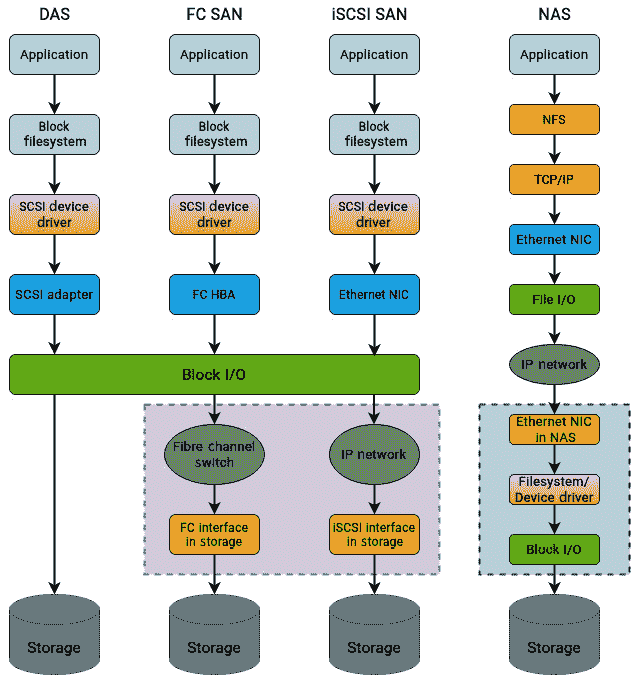
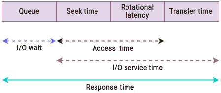
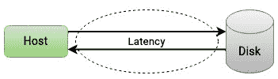
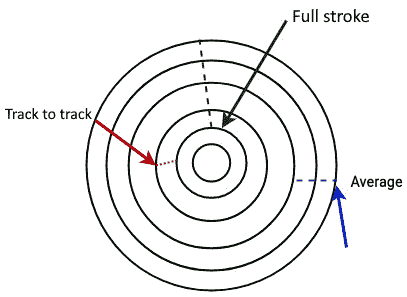
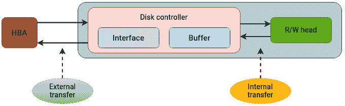
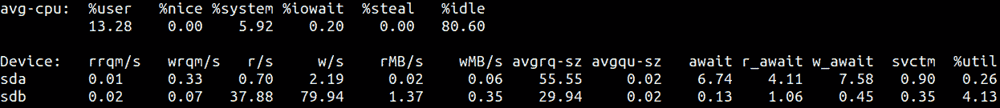
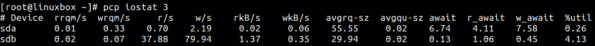
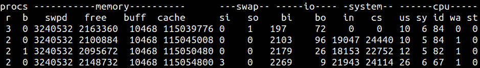

# 分析物理存储性能

*“当你排除了不可能的事情后，剩下的，无论多么不可能，必须就是事实。”— 亚瑟·柯南·道尔*

现在我们已经理解了 Linux 存储环境的细节，可以将这些理解应用于实际操作。我总是喜欢将 I/O 堆栈与网络中的 OSI 模型进行比较，每一层都有其专门的功能，并使用不同的数据单元进行通信。在*前八章*中，我们已经加深了对存储堆栈分层结构及其概念模型的理解。如果你还在继续跟随，你可能已经理解了即使是最基本的应用请求也需要经过多个层级才能被底层磁盘处理。

作为好人，我们在与他人合作时，可能过于挑剔，喜欢吹毛求疵。这将引领我们进入下一个阶段——我们如何评估和衡量存储性能？计算资源与存储资源之间总会有显著的性能差距，因为磁盘的速度比处理器和内存慢几个数量级。这使得性能分析成为一个非常广泛且复杂的领域。你如何判断多少才算过多，多少才算过慢？一组数值可能对某个环境非常合适，而在另一个环境中却会引发警报。根据工作负载，这些变量在每个环境中都会有所不同。

在 Linux 中，有许多工具和跟踪机制可以帮助识别系统性能的潜在瓶颈。我们将重点关注存储子系统，利用这些工具来了解幕后发生的情况。一些工具在大多数 Linux 发行版中默认提供，可以作为一个很好的起点。

以下是我们将在本章中讨论的内容概述：

+   我们如何评估性能？

+   了解存储拓扑

+   分析物理存储

+   使用磁盘 I/O 分析工具

# 技术要求

本章更注重实践操作，要求读者有一定的 Linux 命令行经验。大多数读者可能已经熟悉本章讨论的一些工具和技术。具备基本的系统管理技能会有所帮助，因为这些工具涉及资源监控和分析。最好拥有所需的权限（root 或 sudo）来运行这些工具。根据你选择的 Linux 发行版，你需要安装相关的包。在 Debian/Ubuntu 上安装 `iostat` 和 `iotop`，使用以下命令：

```
apt install sysstat iotop
```

在 Fedora/Red Hat 上安装 `iostat` 和 `iotop`，使用以下命令：

```
yum install sysstat iotop
```

要安装 Performance Co-Pilot，你可以参考他们官方文档中的安装说明，网址如下：[`pcp.readthedocs.io/en/latest/HowTos/installation/index.html`](https://pcp.readthedocs.io/en/latest/HowTos/installation/index.html)。

这些命令在所有 Linux 发行版中的使用方法相同。

# 我们如何评估性能？

我们可以通过不同的视角来评估系统的性能。一种常见的方法是将整体系统性能与处理器的速度等同。如果我们回到单处理器系统普遍存在的简单时代，并与现代的多插槽、多核心系统进行比较，我们会发现处理器的性能已经以一种简单来说是史诗般的速度增长。如果我们将处理器性能的提升与磁盘性能的提升做比较，处理器无疑是遥不可及的赢家。

存储设备的响应时间通常以毫秒为单位进行测量。对于处理器和内存，这个值通常是纳秒级别的。这导致了应用程序需求与底层存储实际能够提供的性能之间的矛盾。存储子系统的性能进展速度并没有跟上处理器的脚步。因此，将系统性能等同于处理器性能的观点逐渐消失。就像链条的强度取决于最弱的一环，整个系统的性能也依赖于最慢的组件。

大多数工具和实用程序通常只关注磁盘性能，并未深入分析更高层次的性能。正如我们在这个过程中发现的那样，当应用程序向存储设备发送 I/O 请求时，幕后发生了大量的操作。考虑到这一点，我们将把性能分析分为以下两部分：

+   物理存储的分析

+   对 I/O 栈中更高层次的分析，如文件系统和块层

在这两种情况下，我们将解释相关的度量标准以及它们如何影响性能。文件系统和块层的分析将在*第十章*中进行讨论。我们还将看到如何通过 Linux 发行版中的可用工具检查这些度量标准。

# 理解存储拓扑

大多数企业环境通常包含以下几种类型的存储。

+   **直接附加存储（DAS）**：这是最常见的存储类型，直接连接到系统，例如你笔记本电脑中的硬盘。由于数据中心环境需要在每一层都有一定级别的冗余，企业服务器中的直接附加存储由多个磁盘组成，这些磁盘被组合成 RAID 配置，以提高性能和数据保护。

+   **光纤通道存储区域网络**：这是一种块级存储协议，利用光纤通道技术，使服务器能够访问存储设备。与传统的 DAS 相比，它提供了极高的性能和低延迟，并用于运行关键任务应用。由于需要专用硬件，如光纤通道适配器、光纤通道交换机和存储阵列，因此其成本远高于其他选项。

+   **iSCSI SAN**：这也是一种块级存储协议，可以利用现有的网络基础设施，使主机能够访问存储设备。iSCSI SAN 通过 TCP/IP 网络传输 SCSI 数据包，实现源端与目标块存储之间的通信。由于它不依赖于专用网络（如 FC SAN），因此性能低于 FC SAN。然而，由于不需要专用适配器或交换机，iSCSI SAN 的实施要容易且成本较低。

+   **网络附加存储（NAS）**：NAS 是一种文件级存储协议。像 iSCSI SAN 一样，NAS 阵列也依赖现有的网络基础设施，不需要额外的硬件。然而，由于存储是通过文件级机制访问的，其性能较低。尽管如此，NAS 阵列是最具成本效益的选择，通常用于存储长期备份。

这些技术的简化比较见*图 9.1*。为了专注于访问每种存储类型的差异，已省略了高层中的附加细节：



图 9.1 – 不同的存储拓扑结构

我们在讨论中不会包括光纤交换机或任何 SAN 阵列。然而，请记住，访问不同类型存储技术涉及许多组件。每一层都需要仔细检查，因此在诊断存储环境时，您应该始终心中有一张拓扑图。

# 分析物理存储

性能定义了磁盘驱动器在访问、检索或保存数据时的表现。有很多指标可以帮助定义磁盘子系统的性能。对于那些在评估和购买高端存储阵列时与存储供应商合作过的人来说，IOPS（每秒输入输出操作数）是一个非常熟悉的术语。供应商通常会频繁提到这个缩写，并将存储系统的 IOPS 作为其主要卖点之一。

**每秒输入输出操作数**（**IOPS**）可能是一个完全没有用的数字，除非它与存储系统的其他能力结合使用，比如响应时间、读写比、吞吐量和块大小。IOPS 通常被称为*英雄数字*，除非与其他指标结合，否则它很少能提供系统能力的任何洞见。当你购买一辆汽车时，你需要了解诸如加速、燃油经济性以及它如何应对弯道等详细信息。你很少会考虑它的最高速度。同样，你也需要了解存储系统的所有能力。

聚焦于物理磁盘，我们首先定义**基于时间的性能指标**，因为它们是解释时间如何以及在哪里花费的指标。每当你在分析性能时听到**延迟**或**延时**这两个词时，通常是*失去的时间*的一个标志。这是本可以用于处理某些事情的时间，但却花费在等待某些事情发生上。

## 了解磁盘服务时间

首先让我们了解在分析物理磁盘时需要关注的时间相关指标。一旦我们对这些指标有了概念性的理解，我们将使用具体工具来寻找潜在的瓶颈。下图展示了用于衡量磁盘性能的最常见的*时间中心*指标：



图 9.2 – 磁盘服务时间

需要强调的是，上述指标并没有考虑到通过内核 I/O 层级（如文件系统、块层和调度）所花费的时间。我们将分别探讨这些内容。目前，我们只关注物理层。

*图 9.2* 中使用的术语在这里解释：

+   **I/O 等待**：I/O 请求可以在队列中等待，也可以被积极处理。I/O 请求在被调度处理之前会先被插入到磁盘的队列中。在队列中等待的时间量被量化为 I/O 等待时间。

+   **I/O 服务时间**：I/O 服务时间是指磁盘控制器在积极处理 I/O 请求期间的时间。换句话说，它是 I/O 请求未在队列中等待的时间。服务时间包括以下内容：

    +   *磁盘寻道时间*是指将磁盘读写头通过径向运动移动到指定磁道所花费的时间。

    +   一旦读写头放置在正确的磁道上，盘片表面将旋转，将准确的扇区（从中读取或写入数据的区域）对齐到读写头的位置。在此处花费的时间被称为*旋转延迟*。

    +   一旦读写磁头定位到正确的扇区，就会执行实际的 I/O 操作。这就是*传输时间*。传输时间是指将数据从磁盘传输到主机系统或从主机系统传输到磁盘所需的时间。

+   **响应时间**：响应时间或延迟是服务时间和等待时间的总和，可以看作是 I/O 请求的*往返时间*。它以毫秒为单位，是与存储设备工作时最重要的术语，因为它表示从发出 I/O 请求到实际完成所需的全部时间，如*图 9.3*所示：



图 9.3 – 磁盘延迟

如*图 9.4*所示，存储供应商通常会提到以下寻道时间规格：

+   **全程寻道**：这是读写磁头从磁盘最内圈移动到最外圈轨道所需的时间。

+   **平均寻道时间**：这是读写磁头从一个随机轨道移动到另一个轨道所需的平均时间。

+   **轨道到轨道**：这是读写磁头在两个相邻轨道之间移动所需的时间。

磁盘寻道时间规格见*图 9.4*：



图 9.4 – 磁盘寻道时间规格

传输速率可以分为内部和外部传输速率：

+   **内部传输速率**：这是数据从磁盘的盘片表面传输到其内部缓存或缓冲区的速度。

+   **外部传输速率**：一旦数据被提取到缓冲区，它将通过磁盘支持的接口或协议传输到主机总线适配器控制器。如*图 9.5*所示，从缓冲区到主机总线适配器的数据传输速度决定了外部传输速率：



图 9.5 – 磁盘传输速率

正如我们在*第八章*中解释的那样，与机械硬盘不同，SSD 不使用任何机械组件。因此，诸如旋转延迟和寻道时间等概念不适用于它们。*响应时间*涵盖了所有与时间相关的方面，它是检查性能相关问题时最常用的术语。

## 磁盘访问模式

机械硬盘最受 I/O 访问模式的影响。应用程序生成的 I/O 模式可以是顺序操作和随机操作的组合：

+   **顺序 I/O**：顺序 I/O 操作指的是从连续或相邻磁盘位置读取或写入数据的 I/O 请求。对于机械硬盘，这会显著提高性能，因为这只需要读写磁头移动极小的距离，从而减少了磁盘寻道时间。

+   **随机 I/O**：随机 I/O 请求会在磁盘的非连续位置上执行，正如你所猜测的那样，这会导致更长的磁盘寻道时间，从而对磁盘性能产生负面影响。

再次强调，随机 I/O 操作影响旋转机械硬盘，但不会像机械硬盘那样影响 SSD。尽管如此，由于在磁盘上读取相邻字节对控制器的要求要小得多，因此在 SSD 上进行顺序操作比随机操作更快。然而，与机械硬盘相比，这种差异要小得多。

## 确定读取/写入比例和 I/O 大小

单独的 IOPS 并不能完全反映磁盘的性能，应该谨慎对待。重要的是要查看 I/O 请求的大小以及读取和写入操作的比例。例如，复杂的存储系统是为特定的读写比例和 I/O 大小设计的，例如`70/30 读写`或`32 KB`块大小。

不同的应用程序对底层驱动器有不同的需求和期望。了解存储设备上将执行的 I/O 操作类型的百分比非常重要。例如，在线事务处理应用程序通常由`70/30 读写`比例组成。另一方面，日志应用程序可能总是忙于写入，并可能需要较少的读取操作。

应用程序的 I/O 请求大小也会有所不同，这取决于应用程序的类型。在某些情况下，传输较大的数据块是一种更有效的方法。处理此类请求所需的时间比单个较小的请求要长。另一方面，考虑相同的数据量，许多较小请求的综合处理和响应时间可能会大于单个较大请求的时间。

## 磁盘缓存

现代硬盘通常配备有内置的**磁盘缓存**或**缓冲区**。磁盘缓冲区是磁盘驱动器中嵌入的内存，它充当**主机总线适配器**（**HBA**）与磁盘盘片或用于存储的闪存之间的缓冲区。

下表突出了缓存对不同类型 I/O 模式的影响：

| **I/O 类型** | **读取** | **写入** |
| --- | --- | --- |
| 随机 | 由于模式无法预测，因此很难缓存和预取。 | 缓存非常有效，因为随机写入需要大量的磁盘寻道时间。 |
| 顺序 | 缓存非常有效，因为数据可以轻松预取。 | 缓存有效且可以迅速刷新，因为数据会被写入连续的位置。 |

表 9.1 – 缓存对读/写的影响

使用缓存可以加速从硬盘存储和访问数据的过程。企业级存储阵列通常为此目的提供大量的缓存。

## IOPS 和吞吐量

与延迟一起，IOPS 和吞吐量定义了物理存储的基本特性：

+   **IOPS**：IOPS 表示在特定时间段内可以执行的 I/O 操作的速率。IOPS 的测量值可以告诉你存储系统当前每秒能处理的操作数。

+   **吞吐量**：吞吐量指的是从硬盘驱动器传输到或从硬盘驱动器传输的数据量——换句话说，就是你一次能吃掉多少披萨。这也叫带宽。由于吞吐量衡量的是实际的数据传输量，因此它以每秒 MB 或 GB 为单位。

这里有几点重要的内容需要记住：

+   IOPS 指标应始终与延迟、读写比例和 I/O 请求大小相关联。如果单独使用 IOPS，它的价值不大。

+   在处理大量数据时，带宽统计可能比 IOPS 更为相关。

## 队列深度

**队列深度**决定了每次可以并发处理的 I/O 请求数量。一般来说，这个值不需要修改。在大规模 SAN 环境中，主机通过光纤通道 HBA 连接到存储阵列时，队列深度变得尤为重要。在这种情况下，硬盘、HBA 和存储阵列端口都有独立的队列深度值。

如果发出的 I/O 请求数量超过了支持的队列深度，任何新的请求将不会被存储设备处理。相反，存储设备会返回“队列已满”的消息给主机。一旦队列中有空位，主机需要重新发送失败的 I/O 请求。队列深度的设置会影响机械硬盘和固态硬盘。使用 SATA 和 SAS 接口的机械硬盘和 SSD 只支持一个队列，且每个队列分别支持 32 个和 256 个命令。相反，NVMe 硬盘支持 64,000 个队列，每个队列有 64,000 个命令。

在大多数情况下，队列深度的默认设置可能已经足够。存储环境中的每个组件都有自己的队列深度设置。例如，RAID 控制器也有自己的队列深度，且这个队列深度可能大于单个硬盘的组合队列深度。

## 确定硬盘忙碌程度

有几个概念决定了硬盘的实际使用程度，具体如下所述：

+   **利用率**：磁盘利用率是一个非常常见的指标，你会看到各种工具报告这个数据。利用率意味着在给定的时间间隔内磁盘被积极使用。这个值以时间的百分比表示。例如，70%的利用率意味着，如果内核检查磁盘 100 次，70 次磁盘在执行某些 I/O 请求时是忙碌的。类似地，一个 100%利用率的磁盘意味着它不断地处理 I/O 请求。同样，完全利用的磁盘可能成为瓶颈，也可能不会。这个值需要与其他一些指标相关联，如关联的延迟和队列深度。可能是，尽管 I/O 请求持续不断，但它们相当小且是顺序的，因此磁盘能够及时处理它们。类似地，RAID 阵列能够并行处理请求，因此一个 100%利用的磁盘也许不会成为问题。

+   **饱和度**：饱和度意味着发给磁盘的请求数量可能超过它实际能够处理的能力。这意味着我们正试图超过磁盘的额定容量。当发生饱和时，应用程序必须等待才能从磁盘读取或写入数据。饱和将导致响应时间增加，影响系统的整体性能。

## I/O 等待

很容易理解的是，**I/O 等待**通常是检查性能问题时最容易被误解的指标。尽管它的名称中有*I/O*，但 I/O 等待时间实际上是一个 CPU 指标，它并不表示 CPU 性能的问题。明白了吗？

I/O 等待时间是 CPU 空闲的时间百分比，在这些空闲时间内系统有待处理的磁盘 I/O 请求。之所以难以理解，是因为即使系统 I/O 等待百分比较高，也可能是健康的系统；同样，即使系统 I/O 等待百分比较低，也可能是性能较慢的系统。高 I/O 等待意味着 CPU 在等待磁盘请求完成时处于空闲状态。我们可以通过几个例子来解释这一点：

+   例如，如果一个进程发送了一些 I/O 请求，而底层磁盘无法立即满足该请求，那么 CPU 就处于等待状态，因为它在等待请求的完成。在这里，等待意味着 CPU 周期被浪费，且底层磁盘可能响应 I/O 请求较慢。

+   然后，有一个相反的情况。假设进程 A 极度依赖 CPU，持续让 CPU 忙碌。另一个在系统上运行的进程 B 是 I/O 密集型的，占用了磁盘。即使磁盘响应进程 B 的请求很慢，且成为系统瓶颈的来源，I/O 等待值在这种情况下也会非常低。为什么？因为 CPU 并没有空闲，它一直在为进程 A 提供服务。因此，尽管 I/O 等待值较低，但存储可能仍然存在潜在的瓶颈。

高 I/O 等待值可能是以下任何一个或多个因素导致的：

+   物理存储中的瓶颈

+   大量的 I/O 请求排队

+   磁盘接近饱和或已完全饱和

+   处于不可中断睡眠状态的进程，称为 `D` 状态（当存储通过 **网络文件系统** (**NFS**) 访问时，这种情况相当常见）

+   在 NFS 的情况下，网络速度慢

+   高交换活动

我认为我们已经涵盖了在分析存储设备时需要注意的许多事项。再次强调，如果你的存储环境包含传统 SAN 环境中的所有组件，那么你还需要关注更多内容，例如 **光纤通道** (**FC**) 交换机以及存储阵列中的潜在瓶颈。要排查 FC 交换机的问题，你需要对 FC 协议有基本的了解。

让我们看看如何使用现有工具识别这些红旗。

# 使用磁盘 I/O 分析工具

我们现在已经对诊断底层存储问题时需要关注的内容有了基本了解。大多数时候，问题行为首先是在应用层报告的，通常需要检查多个层次才能最终识别问题。问题情况可能也会是间歇性的，这使得检测起来更加困难。幸运的是，Linux 有一系列强大的工具可以帮助识别这些问题行为。我们将逐一查看它们，并重点介绍在故障排除过程中需要关注的有价值的内容。

## 使用 top 建立基准

`top` 是故障排除性能问题时最常用的命令之一。它之所以有效，是因为它能够快速展示系统的当前状态，并可能给出潜在问题的线索。尽管大多数人使用它来进行 CPU 和内存分析，但有一个特定的字段可以表明底层存储存在问题。如下所示，`top` 命令可以快速提供当前系统状态的总结视图：

```
top - 19:11:56 up 96 days, 12:38,  0 users,  load average: 9.44, 6.71, 3.75
Tasks: 498 total,   14 running, 484 sleeping,   0 stopped,   0 zombie
%Cpu(s): 20.6%us,  7.9%sy,  0.0%ni, 13.4%id, 57.1%wa,  0.1%hi,  0.9%si,  0.0%st
KiB Mem : 19791910+total, 10557456 free, 80016952 used, 10734470+buff/cache
KiB Swap:  8388604 total,  5058092 free,  3330512 used. 11555254+avail Mem
```

正如我们之前讨论的，高 I/O 等待是存储层瓶颈的一个迹象。`wa` 字段是等待平均值，表示 CPU 因磁盘原因而等待的时间比例。高等待平均值意味着磁盘响应不及时。尽管这里没有讨论，负载平均值也可能因为等待平均值的增加而上升。这是因为负载平均值包括了磁盘等待活动。

`top` 工具有几个选项可以提供有关 CPU 和内存消耗的洞察，但我们不会在这里重点关注这些。因为我们主要关注的是存储问题，所以需要特别留意 `wa` 列中的高值以及负载平均值。

## iotop 工具

`iotop`命令是一个类似于`top`的工具，用于监控与磁盘相关的活动。`top`命令默认按 CPU 使用率对输出进行排序。同样，`iotop`命令按每个进程读取和写入的数据量对进程进行排序。它显示了突出显示系统中磁盘带宽消耗的列。此外，它还显示了线程/进程在交换和等待 I/O 操作过程中所占用的时间比例。每个进程的 I/O 优先级，包括类别和级别，也会显示。

最好使用`-o`标志运行`iotop`，这样它会显示当前向磁盘写入的进程：

```
Total DISK READ :       231.10 K/s | Total DISK WRITE :     556.40 K/s
Actual DISK READ:       233.13 K/s | Actual DISK WRITE:     593.72 K/s
  TID  PRIO  USER     DISK READ  DISK WRITE  SWAPIN     IO>    COMMAND
23744 be/2 root        0.00 B/s  519.08 K/s  0.00 %  3.03 %  mysql
10395 be/4 root        231.10 K/s   37.32 K/s  0.00 % 1.58 % java
```

`iotop`命令显示了进程从磁盘读取或写入的数据量。检查支持的磁盘读写速度，并将其与占用带宽最多的进程的吞吐量进行比较。这也有助于识别应用程序的异常磁盘活动，并确定是否有进程正在向底层磁盘读取或写入异常的数据量。

有时，`iotop`命令可能会提示内核中未启用延迟计数。这可以通过以下方式修复：

`sysctl kernel.task_delayacct = 1`

## iostat 工具

`iostat`命令是最受欢迎的磁盘分析工具，因为它显示了各种有助于分析性能问题的信息。之前解释的多数指标，如磁盘饱和、利用率和 I/O 等待，都可以通过`iostat`进行分析。

`iostat`的磁盘统计输出的第一行是自系统最近启动以来的总结，显示了系统运行期间的平均值。随后的行则按秒统计显示，根据命令行指定的时间间隔计算，如下图所示：



图 9.6 – iostat 命令

需要注意的是：

+   第一行，`avg-cpu`，显示了在每个状态下执行时 CPU 利用率的百分比。

+   `r/s`和`w/s`数字提供了每秒发往设备的读写请求数。

+   `avgqu-sz`表示处于队列状态或正在被服务的操作的计数。`await`值对应于请求被放入队列到完成之间的平均时间。`r_await`和`w_await`列显示了读写操作的平均等待时间。如果这里的值持续较高，设备可能接近饱和。

+   `%util`列显示了磁盘在服务至少一个 I/O 请求期间的繁忙时间。若底层存储是基于 RAID 的卷，利用率值可能会产生误导。

一般假设，当设备的使用率接近 100%时，它变得更为饱和。这适用于表示单一磁盘的存储设备。然而，SAN 阵列或 RAID 卷由多个驱动器组成，可以同时处理多个请求。内核无法直接看到 I/O 设备的设计方式，这使得在某些情况下，这个数字是值得怀疑的。

## 性能协同驾驶员

`sysstat`包。PCP 工具还包括一个图形用户界面应用程序，可以根据生成的指标创建图表，并能够保存历史数据供以后查看。以下是几个可以协助存储分析的工具：

+   `pcp atop`：此命令提供的信息类似于`iotop`和`atop`命令。该命令列出了执行 I/O 的进程以及它们使用的磁盘带宽。像`iotop`和`top`一样，`pcp atop`是快速了解系统变化的好工具。

+   `pcp iostat`：`pcp iostat`命令报告实时磁盘 I/O 统计信息，类似于我们之前看到的`iostat`命令。如*图 9.7*所示，输出中的列与`iostat`类似：



图 9.7 – pcp iostat

在排查磁盘性能或资源相关问题时，`vmstat`可以提供有价值的信息，因为它有助于识别磁盘 I/O 拥堵、过度分页或交换活动。

## vmstat 命令

`vmstat`命令，源自“虚拟内存统计”，是几乎所有 Linux 发行版中都包含的原生监控工具。如*图 9.8*所示，它报告有关进程、内存、分页、磁盘和处理器活动的信息：



图 9.8 – vmstat 命令

输出中的`b`列显示的是等待资源（如磁盘 I/O）时被阻塞的进程数。对排查 I/O 问题最有用的附加信息如下：

+   `si`：该字段表示每秒从磁盘交换空间交换到系统内存的内存量（以千字节为单位）。`si`字段的值越高，表示交换活动越频繁，表明系统经常从交换空间检索数据。

+   `so`：该字段表示每秒从系统内存交换到磁盘交换空间的内存量（以千字节为单位）。`so`字段的值越高，表示交换活动越频繁，这可能发生在系统内存紧张，需要释放物理内存时。

+   `bi`：该字段专门指从磁盘到内存的数据传输速率。`bi`字段的值越高，表示磁盘读取活动越频繁。

+   `bo`：此项反映了系统内存写入到磁盘的输出活动或数据量。`bo` 字段的值越高，表示磁盘写入活动增加，说明数据经常从内存写入磁盘。

+   `wa`：此字段表示 CPU 空闲时，系统等待 I/O 操作完成的时间百分比。`wa` 字段的值越高，表示系统经历了 I/O 瓶颈或延迟，CPU 经常等待 I/O 操作完成。

## 压力停滞指数

**压力停滞指数**（**PSI**）是 Linux 中故障排除工具集的一个相对较新的功能，提供了一种新的方式来获取内存、CPU 和磁盘 I/O 的利用率指标。当 CPU、内存或 I/O 设备发生竞争时，可能会出现延迟峰值，导致工作负载的等待时间增加。PSI 功能可以识别这种情况，并实时打印出这些信息的总结视图。

PSI 值通过 `/proc pseudo` 文件系统访问。原始的全局 PSI 值出现在 `/proc/pressure` 目录下的 `cpu`、`io` 和 `memory` 文件中。我们来看一下 `io` 文件：

```
[root@linuxbox ~]# cat /proc/pressure/io
some avg10=51.30 avg60=41.28 avg300=23.33 total=84845633
full avg10=48.28 avg60=39.22 avg300=22.78 total=75033948
```

`avg` 字段表示最近 10 秒、60 秒和 300 秒内，进程因磁盘 I/O 而被饿死的*百分比*时间。以 `some` 为前缀的行表示由于资源不足，某些任务被延迟的时间部分。以 `full` 为前缀的行表示所有任务因资源限制而被延迟的时间百分比，表明无效时间的程度。这与 `top` 命令中的负载平均值有些相似。这里的输出显示，`10`、`60` 和 `300` 秒间隔的平均值较高，表明进程正在被暂停。

总结来说，Linux 提供了许多工具来分析系统性能。我们在这里介绍的工具不仅用于存储分析，还用于建立系统的整体视图，包括处理器和内存子系统。每个工具提供了广泛的选项，可以用于分析特定方面。我们强调了使用这些工具时需要关注的主要指标，但由于每个环境中都有不同的变量，因此没有*固定*的故障排除方法。

# 总结

故障排除性能问题是一个复杂的过程，因为它可能需要很长时间才能诊断和分析。在环境中的三个主要组件——存储、计算和内存——中，存储是最慢的。它们的性能总是会存在不匹配的情况，任何磁盘性能的下降都可能影响系统的整体运行。

鉴于此目标，我们将本章分为两部分。在第一部分，我们解释了在排查任何问题之前，您应该了解的最重要的指标。我们讨论了与存储设备相关的时间相关指标、CPU 等待平均值、磁盘饱和度和磁盘利用率，以及从物理磁盘读取或写入时的不同访问模式。

在第二部分，我们看到了解析第一部分中突出的指标的不同方式。Linux 中有许多可用的机制，可以帮助识别整体系统性能中的潜在瓶颈。我们使用了`top`、`PSI`、`iostat`、`iotop`和`vmstat`等工具来分析磁盘性能。

在下一章，我们将继续分析存储堆栈，重点关注更高层次的部分，如块层和文件系统。为此，我们将利用 Linux 中提供的不同跟踪机制。
