# 分析文件系统和块层

对存储设备的读写访问通常会经过几个中间层，如文件系统和块层。还有页面缓存，在数据被延迟写入底层存储之前，所请求的数据会被保留在其中。到目前为止，我们已经尝试理解可能影响磁盘性能的不同因素，并检查与物理磁盘相关的重要指标，但是，正如福尔摩斯所说：“*完全合理的分析，但我希望你能* *深入一点*。”

应用程序通常与文件系统进行交互，而不是与物理存储进行交互。文件系统的工作就是将应用程序的请求转换并发送到下层进行进一步处理。请求将在块层进行进一步处理，最终被调度并发送到存储设备。这个层次结构中的每个阶段都会增加处理开销。因此，检查文件系统和块层的行为对于进行任何性能分析至关重要。

本章将重点介绍可以用于调查文件系统和块层的技术。在这一阶段，我想认为前六章帮助我们建立了对这些层的相当理解（*我当然希望如此*）。熟悉相关的分析方法应该不成问题。

这里是我们将要涵盖的内容摘要：

+   调查文件系统和块层

+   不同类型的文件系统 I/O

+   什么导致文件系统延迟？

+   确定目标层

+   寻找合适的工具

# 技术要求

本章将重点介绍如何使用 `root` 或 `sudo` 来运行这些工具。

本章相关的操作系统软件包可以通过以下方式安装：

+   对于 Ubuntu/Debian：

    +   `sudo apt` `install strace`

    +   `sudo apt` `install bpfcc-tools`

+   对于 Fedora/CentOS/基于 Red Hat 的系统：

    +   `sudo yum` `install strace`

    +   `sudo yum` `install bcc-tools`

# 调查文件系统和块层

鉴于存储比系统中的其他组件更慢，性能问题通常与 I/O 相关也就不足为奇了。然而，简单地将性能问题归类为基于 I/O 的问题是一种过度简化。

文件系统是应用程序的第一个接触点，并且被认为夹在应用程序和物理存储之间。传统上，在进行任何性能分析时，物理存储总是受到关注的中心。大多数工具关注的是物理驱动器的利用率、吞吐量和延迟，而忽略了 I/O 请求的其他方面。对存储的检查通常以物理磁盘为起点并结束，从而忽略了对文件系统的分析。

类似地，块层发生的事件在性能分析中也往往容易被忽视。我们在*第九章*中讨论的工具通常提供特定时间间隔内的平均值，这可能会导致误导。例如，假设一个应用程序在 10 秒的时间间隔内生成了以下数量的 I/O 请求：

| **秒数** | **请求数** | **秒数** | **请求数** |
| --- | --- | --- | --- |
| 1 | 10 | 6 | 20 |
| 2 | 15 | 7 | 5 |
| 3 | 500 | 8 | 15 |
| 4 | 20 | 9 | 8 |
| 5 | 5 | 10 | 2 |

表 10.1 – I/O 请求的平均统计数据

如果我每 10 秒收集一次 I/O 统计信息，那么每秒发出的平均 I/O 请求数将是 60——也就是总请求数除以时间间隔。平均值可能被认为是正常的，但它完全忽略了大约在三秒钟时发出的 I/O 请求爆发。提供磁盘级统计的工具无法提供每个 I/O 请求的详细信息。

传统方法一直是从文件系统的底层收集信息——也就是物理磁盘。然而，这是一个多方面的问题，涉及到分析以下几个层次：

+   **系统和库调用**：应用程序使用通用系统调用接口从内核空间请求资源。当应用程序调用内核提供的函数时，执行时间将在内核空间内度过。这个函数被称为**系统调用**。相反，库调用是在用户空间中执行的。当应用程序希望使用编程库中定义的函数（例如 GNU C 库）时，它会发送一个请求，称为**库调用**。为了准确评估性能，必须衡量在内核空间和用户空间中花费的时间。通过追踪这些调用，可以获得有关应用程序行为的宝贵洞察，并识别可能导致进程卡住的潜在问题，例如资源争用或锁定。

+   **VFS**：正如本书中一直所解释的，VFS 充当用户和底层文件系统之间的接口。它将应用程序的文件操作与特定文件系统解耦，通过通用系统调用隐藏了实现细节。VFS 还包括页缓存、inode 和 dentry 缓存，以加速磁盘访问。分析 VFS 对于一般工作负载特征化很有帮助，可以识别应用程序随时间变化的操作模式，并找出应用程序如何使用不同类型的可用缓存。

+   **文件系统**：每个文件系统在磁盘上组织数据时都使用不同的方法。正如我们在*第九章*中解释的那样，重要的是要表征文件系统将管理的工作负载类型 - 例如，应用程序的访问模式、同步和异步操作、读写请求的比例、缓存命中和失误比率以及 I/O 请求的大小。在内部，文件系统执行诸如预读、预取、锁定和日志记录等操作，这些操作可能以某种方式影响整体 I/O 性能。

+   **块层**：当 I/O 请求进入块层时，它可以映射到另一个设备，如 LVM、软件**独立磁盘冗余阵列**（**RAID**）或多路径设备。通常在这些逻辑设备上创建文件系统。在这种情况下，对于任何文件系统 I/O，这些技术的相应任务需要资源，可能是 I/O 争用的来源，如 RAID 条带化或多路径 I/O 驱动程序。

+   **调度程序**：磁盘调度程序的选择也会影响应用程序的 I/O 性能。调度程序可以使用合并和排序等技术，这可以改变请求最终落在磁盘上的顺序。正如我们在*第六章*中所学到的，Linux 内核提供了不同类型的磁盘调度程序。一些 I/O 调度程序适合高端存储设备，而另一些则适用于较慢的驱动器。由于每个环境都不同，在决定适当的磁盘调度程序之前，需要考虑多种因素。

+   **物理存储**：在任何故障排除场景中，物理层通常是关注的焦点。我们在*第九章*中讨论了分析不同物理磁盘指标的部分。

虽然这里没有详细涵盖，但重要的是要知道，可以绕过文件系统，直接将数据写入物理存储设备。这被称为**原始访问**，通过这种方法访问的设备称为**原始设备**。一些应用程序，如数据库，能够写入原始设备。采用这种方法的主要原因是，任何抽象层，比如文件系统或卷管理器，都会增加处理开销。文件系统利用缓冲区缓存读写操作，延迟将它们提交到磁盘，直到稍后。在没有文件系统的情况下，像数据库这样的大型应用程序能够绕过文件系统缓存，从而管理自己的缓存。这种方法可以更精细地控制设备 I/O，并可能有助于测试存储设备的原始速度，因为它绕过了任何额外的处理开销。

*图 10**.1* 强调了影响应用程序 I/O 性能的一些因素：

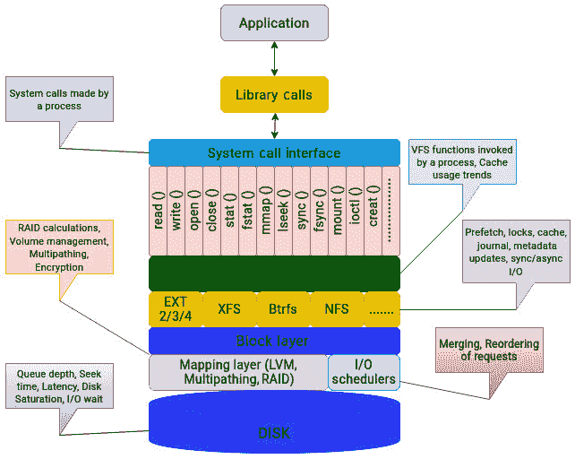

图 10.1 – 影响应用程序 I/O 性能的因素

总结来说，I/O 栈中的不同层级可以通过多种方式影响应用程序的 I/O 性能。因此，在排查性能问题时，第一步是将问题分解成更小的部分；通过去除尽可能多的层级来简化问题。

# 不同类型的文件系统 I/O

文件系统可以发出许多不同类型的 I/O 请求。为了便于理解，我们将由进程发出的 I/O 请求称为逻辑 I/O，而实际在磁盘上执行的操作则称为物理 I/O。正如你可能猜到的那样，这两者并不相等。**逻辑 I/O** 指的是在逻辑层面上读取或写入数据，也就是说在文件系统或应用程序层面。相反，**物理 I/O** 涉及在存储设备和内存之间传输数据。在这个阶段，数据在硬件层面进行移动，并由磁盘控制器等硬件设备进行管理。

磁盘 I/O 可能会膨胀或收缩。一次逻辑 I/O 请求可能会导致多次物理磁盘操作。相反，来自进程的逻辑请求可能不需要任何物理 I/O 操作。

为了详细说明这个概念，下面我们来看一些导致这两种请求不成比例的因素：

+   **缓存**：Linux 内核大量利用可用内存来缓存数据。如果数据是从磁盘加载的，它会保存在缓存中，以便对同一数据的后续访问能够快速响应。如果应用程序的读取请求是从缓存中提供的，它将不会导致物理操作。

+   **写回**：由于文件系统写操作默认会被缓存，这也导致了物理操作和逻辑操作数量的差异。写回缓存机制将延迟并合并写操作，然后最终将其刷新到磁盘。

+   **预取**：大多数文件系统都有预取机制，在从磁盘读取一个数据块时，它们可以预先将相邻的顺序数据块加载到缓存中。文件系统预测应用程序将需要的数据，并在应用程序实际请求之前将其读取到内存中。预取操作使得顺序读取非常快速。如果数据已经被预取到缓存中，文件系统可以避免未来访问物理存储，从而减少物理操作的次数。

+   **日志记录**：根据文件系统采用的日志记录技术不同，写操作的数量可能会翻倍。最初，它们会被写入文件系统的日志中，然后再刷新到磁盘。

+   **元数据**：每当访问或修改文件时，文件系统需要更新其时间戳。同样，在写入新数据时，文件系统也需要更新其内部元数据，例如已使用和空闲块的数量。所有这些更改都需要在磁盘上执行物理操作。

+   **RAID**：这一点常常被忽视，但底层存储的 RAID 配置类型对是否需要额外写入有着重要影响。例如，像数据条带化到多个磁盘、写入奇偶校验信息、创建镜像副本以及重建数据等操作都会产生额外的写入。

+   **调度**：I/O 调度器通常采用合并和重排序等技术，以最小化磁盘寻道时间并提高磁盘性能。因此，多个请求可以在调度层合并为一个请求。

+   **数据减少**：如果进行任何压缩或去重操作，磁盘上执行的物理 I/O 请求数量将低于应用程序发起的逻辑请求数量。

# 什么导致了文件系统延迟？

如我们在*第九章*中讨论的那样，延迟是任何性能测量和分析中最重要的指标。从文件系统的角度来看，延迟是指从逻辑请求发起到物理磁盘上完成该请求所花费的时间。

由于物理存储瓶颈导致的延迟是影响整体文件系统响应时间的一个因素。然而，正如我们在上一节中讨论的那样，由于文件系统不仅仅是将 I/O 请求交给物理磁盘处理，延迟可以通过多种方式表现出来，例如以下几种：

+   **资源争用**：如果多个进程同时写入同一个文件，可能会影响文件系统性能。文件锁定对于大型应用程序（如数据库）来说可能是一个重大性能问题。锁定的目的是串行化文件访问。Linux 中的文件系统使用通用 VFS 方法进行锁定。

+   **缓存未命中**：将数据缓存到内存中的目的是避免频繁访问磁盘。如果应用程序配置为避免使用页缓存，则可能会经历一些延迟。

+   **块大小**：大多数存储系统设计时会使用特定的块大小，如 8K、32K 或 64K。如果发出的 I/O 请求较大，它们首先需要被拆分成合适的大小，这会涉及额外的处理。

+   **元数据更新**：文件系统的元数据更新可能是延迟的主要来源。更新文件系统元数据涉及执行多个磁盘操作，包括定位适当的磁盘位置、写入更新的数据，然后将磁盘缓存与磁盘同步。根据更新的元数据的大小和位置，这一过程可能会消耗相当长的时间，尤其是当文件系统被频繁使用，且磁盘正忙于其他操作时。这可能导致请求积压，并整体降低文件系统的性能。

+   **逻辑 I/O 的拆分**：如前节所述，逻辑 I/O 操作可能需要拆分为多个物理 I/O 操作。这可能增加文件系统的延迟，因为每个物理 I/O 操作都需要额外的磁盘访问时间，从而导致额外的处理开销。

+   **数据对齐**：文件系统分区必须正确对齐物理磁盘几何结构。分区对齐不正确会导致性能下降，特别是在 RAID 卷方面。

鉴于可能影响应用程序 I/O 性能的因素众多，毫不奇怪，大多数人不愿意探索这个方向，而只是专注于磁盘级的统计数据，因为这些数据更易理解。到目前为止，我们仅讨论了一些可能影响 I/O 请求生命周期的常见问题。故障排除是一项复杂的技能，确定一个良好的起点可能是一个困难的决策。令人困惑的是，有大量的工具可以用于性能分析。尽管我们这里只关注存储方面的内容，但要一一涵盖所有能够在某种程度上帮助我们实现目标的工具，几乎是不可能的。

# 确定目标层

下表总结了性能分析的不同目标层，并展示了每种方法的优缺点：

| **层** | **优点** | **缺点** |
| --- | --- | --- |
| 应用程序 | 应用程序日志、特定工具或调试技术可以确定问题的范围，帮助后续步骤。 | 调试技术不常见，并且因应用程序而异。 |
| 系统调用接口 | 跟踪进程生成的调用很容易。 | 难以过滤，因为同一功能有多个系统调用。 |
| VFS | 所有文件系统使用通用调用。 | 需要隔离目标文件系统，因为追踪可能包含所有文件系统的数据，包括伪文件系统。 |
| 文件系统 | 文件系统是应用程序的第一个接触点，这使它们成为分析的理想对象。 | 可用的特定于文件系统的追踪机制非常少。 |
| 块层 | 提供多种追踪机制，可以用于识别请求的处理方式。 | 一些组件（如调度器）没有太多可调参数。 |
| 磁盘 | 这更容易分析，因为它不需要对更高层次有深入的理解。 | 这无法清晰地描绘应用程序的行为。 |

表 10.2 – 比较分析每一层的优缺点

一般共识（并且确实有一定道理）是，调查每一层次的工作量太大！有专门的性能分析工程师的企业习惯性地检查每一个细节，并识别系统中的潜在瓶颈。然而，近年来更常见的方法是增加更多的计算能力，特别是对于基于云的工作负载。当应用程序变得资源密集时，增加更多硬件资源成为了新常态。故障排除性能问题往往被忽视，而更倾向于将应用程序迁移到更好的硬件平台。

# 寻找合适的工具

试图深入挖掘应用程序的行为可能是一个艰巨的任务。I/O 堆栈中的抽象层在这方面并没有让我们的工作变得更容易。要分析 I/O 层次结构中的每一层，你必须对每一层所使用的概念有一定的掌握。当你把应用程序包括在内时，这项工作变得更加困难。虽然 Linux 中的跟踪机制有助于理解应用程序产生的模式，但并不是每个人都能对应用程序的设计和实现细节有相同程度的可视化。

如果你正在运行一个关键应用程序，例如一个**在线事务处理**（**OLTP**）数据库，每天处理数百万次事务，那么了解 CPU 周期的浪费位置可能会有所帮助。例如，事务与几个服务级别协议（SLA）相关，并且必须在几秒钟内完成。如果一个事务需要在 10 秒内完成，而仅花费 1 秒钟处理文件系统和磁盘 I/O，那么显然你的存储并不是瓶颈，因为总时间的 10% 仅用于 I/O 堆栈。如果应用程序在文件系统级别被阻塞了 5 秒钟，那么显然需要进行调整。

让我们来看一下可用的工具选项来分析 I/O 堆栈。请注意，这绝不是工具的完整列表。BCC 本身包含了大量此类工具。以下介绍的工具仅根据个人经验挑选出来。

## 跟踪应用程序调用

`strace` 命令有助于识别程序所花费时间的内核函数。例如，以下命令提供了一个总结报告，并显示每个系统调用的频率和所花费的时间。`-c` 开关显示计数。这里，`myapp` 只是一个简单的用户空间程序：

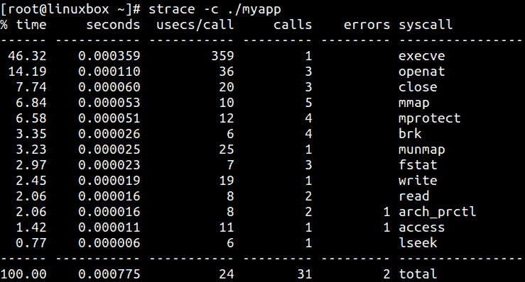

图 10.2 – 使用 strace 跟踪系统调用

这个命令对于找出某些类型的进程性能瓶颈非常有用。要过滤输出并只显示特定系统调用的统计信息，请使用`-``e`标志：

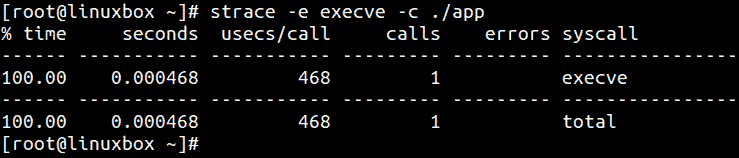

图 10.3 – 过滤特定的调用

让我们再深入一些，看看能否从实际的跟踪输出中获取一些有用信息。你还可以打印每个系统调用的时间戳以及花费的时间。跟踪输出可以使用`-``o`标志保存到文件中：

```
strace -T -ttt -o output.txt ./myapp
```

只关注应用程序 I/O 部分的子集，注意第一个写调用中等号后的数字。我们可以看到，写调用能够将所有数据缓冲到一个单独的写函数调用中。应用程序在 156 微秒内写入了 319,488 字节：

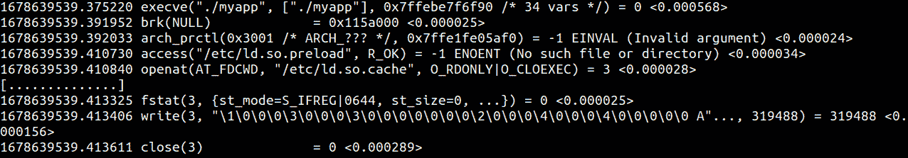

图 10.4 – 分析 strace 输出

`strace` 命令也可以附加到正在运行的进程上。strace 输出相当庞大，你通常需要费力地浏览大量信息才能得到有用的结果。这就是为什么了解应用程序最常生成的调用非常重要的原因。对于 I/O 分析，专注于常见的系统调用，如`open`、`read`和`write`。这有助于从应用程序的角度理解应用程序的 I/O 模式。尽管`strace`不会告诉你操作系统在之后如何处理 I/O 请求，但它告诉你应用程序生成了什么。

总结一下，进行快速分析时，执行以下操作：

+   生成应用程序生成的系统调用的摘要。

+   检查每个调用的执行时间。

+   隔离你想获取信息的调用。对于 I/O 分析，关注读写调用。

## 跟踪 VFS 调用

在你开始调查的最初阶段，分析 VFS 对于一般的工作负载特征化是非常有益的。它也有助于识别应用程序如何高效地利用 VFS 中可用的不同类型缓存。BCC 程序包含一些工具，如`vfsstat`和`vfscount`，可以帮助理解 VFS 中的事件。

`vfsstat`工具显示一些常见 VFS 调用的统计摘要，如`read`、`write`、`open`、`create`和`fsync`：

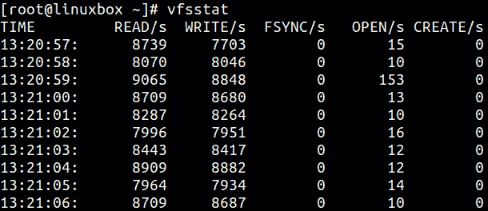

图 10.5 – vfsstat 输出

除了 **READ** 和 **WRITE** 调用外，留意 **OPEN** 列。它显示了每秒打开的文件数量。打开文件数量的突然增加可能会显著增加 I/O 请求的数量，尤其是对于元数据操作。

单独运行这些工具可能不会提供太多见解。一个好的使用方法是将它们与一些磁盘分析工具结合使用，如`iostat`。这将使你能够比较逻辑 I/O 请求与物理 I/O 请求。

`vfsstat` 的一个限制是它没有在文件系统层面上区分 I/O 活动。另一个程序 `fsrwstat` 跟踪读取和写入功能，并按不同文件系统进行分类。下图展示了不同文件系统的读取和写入调用的数量：

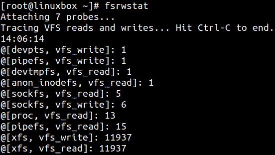

图 10.6 – fsrwstat 输出

继续分析 `vfsstat` 的输出，如果发现大量文件被打开，考虑使用 `filetop`。该工具显示系统中访问频率最高的文件，并显示它们的读取和写入活动：

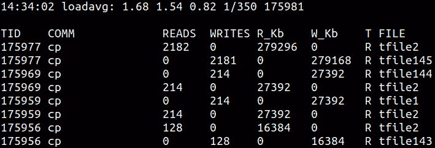

图 10.7 – filetop 输出

发往 VFS 的请求构成了逻辑 I/O 请求。分析 VFS 时，执行以下操作：

+   尝试了解系统的一般工作负载

+   检查常见 VFS 调用的频率

+   将获得的数字与物理层面的请求进行比较

## 分析缓存使用情况

VFS 包含多个缓存，以加速对常用对象的访问。在 Linux 中，默认行为是将所有写操作完成后先存入缓存，稍后再将已写入的数据刷新到磁盘。同样，内核也会尝试从缓存中提供读取操作，并显示页面缓存的命中与未命中统计信息。

`cachestat` 工具可用于显示页面缓存命中与未命中比率的统计信息：

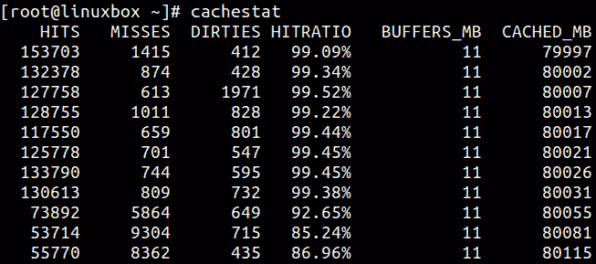

图 10.8 – 使用 cachestat

从上图可以看出，缓存命中率非常高，有时接近 100%。这表明内核能够从内存中满足应用程序的 I/O 请求。缓存命中率越高，应用程序的性能提升越好。

同样，`cachetop` 工具提供按进程划分的缓存命中与未命中统计数据。输出结果通过类似于 `top` 命令的交互式界面显示：

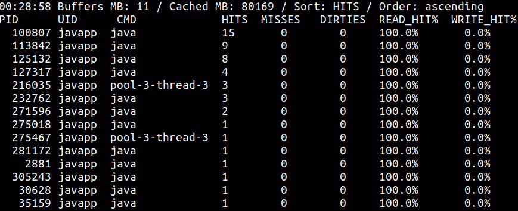

图 10.9 – 使用 cachetop

使用这些工具分析缓存使用情况时，执行以下操作：

+   查看命中与未命中比率，以了解有多少请求是从内存中服务的

+   如果比率较低，可能需要调整应用程序或操作系统参数

## 分析文件系统

尽管没有很多工具可以跟踪文件系统级操作，但 BCC 提供了一些优秀的脚本来观察文件系统。两个脚本 `ext4slower` 和 `xfsslower` 用于分析两个最常用文件系统 Ext4 和 XFS 上的慢操作。

`ext4slower` 和 `xfsslower` 两个工具的输出是相同的。默认情况下，这两个工具会打印出完成时间超过 10 毫秒的操作，但你可以通过传递持续时间值作为参数来更改该设置。两个工具也可以附加到特定进程：

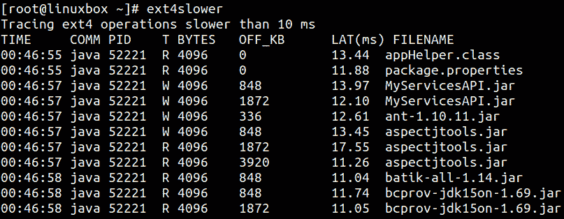

图 10.10 – 跟踪慢速的 Ext4 操作

**T** 列显示操作类型，可能为 **R**（读取）、**W**（写入）和 **O**（打开）。**BYTES** 列显示 I/O 的字节数，**OFF_KB** 列显示 I/O 的文件偏移量（以 KB 为单位）。最重要的值来自 **LAT(ms)** 列，它显示 I/O 请求的持续时间，从 VFS 向文件系统发出请求到完成的时间。这是一个相当准确的度量，反映了应用程序在执行文件系统 I/O 时所承受的延迟。

该工具集中的另两个工具是 `xfsdist` 和 `ext4dist`。这两个工具显示相同的信息，只是针对不同的文件系统——即 XFS 和 Ext4。它们总结了执行常见文件系统操作时所花费的时间，并提供了经验延迟的分布情况，形式为直方图。这些工具可以附加到特定的进程上：

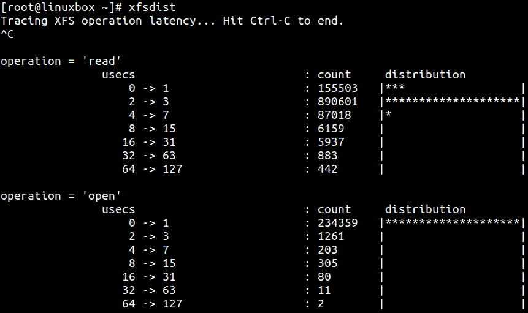

图 10.11 – 使用 xfsdist

使用文件系统专用工具时，请记住以下几点：

+   `ext4dist`/`xfsdist` 工具可以帮助建立基线——也就是说，区分工作负载是以读操作为主还是写操作为主。

+   两个 `ext4slower`/`xfsslower` 脚本在确定进程执行文件系统 I/O 时实际经历的延迟方面非常有效。运行这些脚本时，请检查延迟列以确定应用程序所承受的延迟量。

## 分析块 I/O

正如我们在 *第九章* 中看到的那样，标准磁盘分析工具如 `iostat` 提供了每秒读取和写入的字节数、磁盘利用率以及与特定设备相关的请求队列等信息。这些指标是按时间段平均得出的，无法提供每次 I/O 的详细信息。无法提取某个特定间隔内发生的事件。

与 VFS 和文件系统类似，BCC 还包括一些工具，可以帮助分析块层中发生的事件。其中一个工具是 `biotop`，它类似于磁盘的 `top` 命令。默认情况下，`biotop` 工具跟踪块设备上的 I/O 操作，并每秒显示每个进程活动的汇总信息。汇总信息按吞吐量排序，以 KB 为单位，表示每个进程对磁盘的消耗。汇总中显示的进程 ID 和名称表示 I/O 操作最初创建的时间，这有助于识别负责的进程：

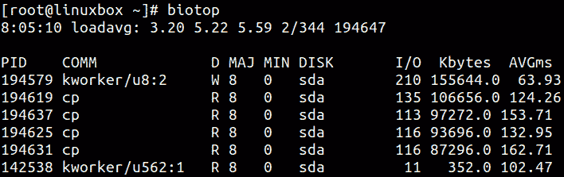

图 10.12 – 使用 biotop

另一个用于分析块层的 BCC 工具是 `biolatency`。顾名思义，`biolatency` 跟踪块设备 I/O，并打印出显示 I/O 延迟分布的直方图：

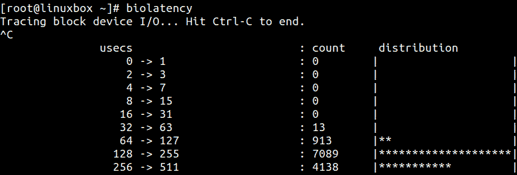

图 10.13 – 使用 biolatency

从前面的输出可以看出，大部分 I/O 请求的完成时间为 128-255 微秒。根据工作负载的不同，这些数字可能会高得多。

来自 BCC 的`biosnoop`工具可以跟踪块设备 I/O 并打印详细信息，包括发起请求的进程：

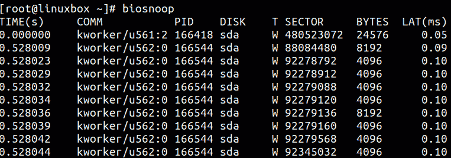

图 10.14 – 使用 biosnoop

`biosnoop`的输出包括从请求发出到设备的时间，直到完成的延迟。`biosnoop`的输出可用于识别导致磁盘过度写入的进程。

我想提到的最后一个工具是`bitesize`，它用于描述块设备 I/O 大小的分布：

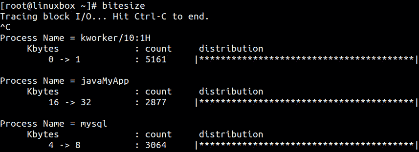

图 10.15 – 使用 bitesize

如前面的输出所示，**javaMyApp**进程（一个简单的基于 Java 的应用程序）生成介于 16-32 KB 之间的请求，而**mysql**则使用 4-8 KB 范围。

在分析块层时，请记住以下内容：

+   要获取系统中磁盘活动的顶端视图，请使用`biotop`。

+   要跟踪应用程序的 I/O 大小，使用`bitesize`。如果应用程序的工作负载是顺序的，那么使用更大的块大小可能会带来更好的性能。

+   要观察块设备的延迟，请使用`biolatency`。该工具将总结块 I/O 请求的时间范围。如果看到较高的值，可能需要进一步挖掘。

+   要进一步检查，请使用`biosnoop`。要找出从创建 I/O 请求到发出请求给设备的时间，请使用`-Q`标志与`biosnoop`。

## 工具总结

以下表格总结了可用于分析不同层次事件的工具：

| **层** | **分析工具** |
| --- | --- |
| 应用程序 | 特定应用程序工具 |
| 系统调用接口 | `strace` 和 `syscount`（BCC） |
| VFS | `vfsstat`、`vfscount` 和 `funccount` |
| 缓存 | `slabtop`、`cachestat`、`cachetop`、`dcstat` 和 `dcsnoop` |
| 文件系统 | `ext4slower`、`xfsslower`、`ext4dist`、`xfsdist`、`filetop`、`fileslower`、`stackcount`、`funccount`、`nfsslower` 和 `nfsdist` |
| 块层 | `biolatency`、`biosnoop`、`biotop`、`bitesize` 和 `blktrace` |
| 磁盘 | `iostat`、`iotop`、`systemtap`、`vmstat` 和 `PCP` |

表 10.3 – 工具总结

请注意，工具不仅限于表格中提到的那些。BCC 工具集本身就包含了其他多个可用于性能分析的工具。此外，还可以向每个工具传递多个参数，以获得更有意义的输出。考虑到层次结构中涉及的多个层次，诊断 I/O 性能问题是一项复杂的任务，就像其他任何故障排除场景一样，这将需要多个团队的参与。

# 总结

在本章中，我们恢复了性能分析，并将其扩展到 I/O 栈中的更高层次。大多数时候，分析更高层次的工作会被跳过，焦点仅仅放在物理层。然而，对于时间敏感型应用程序，我们需要拓宽我们的分析视野，寻找可能的延迟源，进而优化应用响应时间。

我们在本章开始时解释了当应用程序从文件系统读取或写入数据时，可能观察到的不同延迟来源。文件系统操作超出了由应用程序发起的 I/O 请求。除了应用程序的 I/O 请求，文件系统还可能在执行诸如元数据更新、日志记录或将现有缓存数据刷新到磁盘等任务上花费时间。所有这些都导致额外的操作，从而引发额外的 I/O 操作。在*第九章*中讨论的工具主要集中在磁盘上，未能提供关于 VFS 和块层中发生事件的可视化。BCC 提供了一套丰富的脚本，可以追踪内核中的事件，并为我们提供对单个 I/O 请求的洞察。

在下一章，我们将进一步分析，并学习可以在 I/O 层级的不同层次应用的各种优化方法，从而提高性能。
