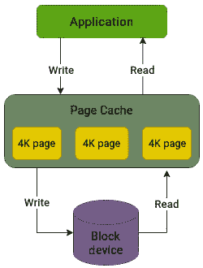
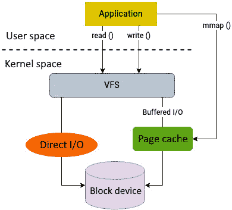
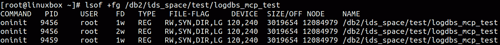

# 调优 I/O 堆栈

好的，我们已经到了旅程的终点。仅仅因为你正在阅读最后一章的介绍，并不意味着你已经读完了整本书，但我还是要冒险这么说。如果你真的跟随我们走到这里，那么我希望这段旅程对你来说是值得的，并且让你渴望了解更多。

回到正题，前两章主要集中在 I/O 堆栈的性能分析。*第九章* 重点介绍了最常见的磁盘指标以及帮助我们识别物理磁盘性能瓶颈的工具。在任何性能分析中，物理磁盘往往比任何其他层次受到更多的关注，这有时可能会产生误导。因此，在*第十章*中，我们探讨了如何检查 I/O 堆栈中的更高层次，如文件系统和块层。

这将引导我们进入下一个逻辑步骤：一旦我们识别出环境中的瓶颈，接下来可以采取哪些步骤来缓解这些限制？设定具体的目标对于调优结果至关重要，因为最终，性能调优是不同选择之间的权衡。例如，调优系统以降低延迟可能会减少其整体吞吐量。首先应确定一个性能基线，任何调整或改动都应分小范围进行。本章将探讨可以应用的不同调整方法，以改善 I/O 性能。

接下来是大纲：

+   内存使用如何影响 I/O

+   调优内存子系统

+   调优文件系统

+   选择合适的调度器

# 技术要求

本章中展示的内容是基于前面章节讨论的概念。如果你已经跟随阅读并熟悉了磁盘 I/O 层次中每一层的功能，那么你会发现本章内容更容易理解。如果你对 Linux 中的内存管理有先前了解，那将是一个巨大的优势。

本章中展示的命令和示例与发行版无关，可以在任何 Linux 操作系统上运行，如 Debian、Ubuntu、Red Hat 或 Fedora。文中提到了一些内核源代码的参考。如果你想下载内核源代码，可以从[`www.kernel.org`](https://www.kernel.org)下载。

# 内存使用如何影响 I/O

正如我们所见，VFS 作为我们 I/O 请求的入口点，并包含不同类型的缓存，其中最重要的是页面缓存。页面缓存的目的是提高 I/O 性能，并最小化由于交换和文件系统操作产生的 I/O 成本，从而避免不必要的访问底层物理磁盘。虽然我们在这些页面中没有详细探讨，但了解内核如何管理其内存管理子系统是很重要的。内存管理子系统也被称为**虚拟内存管理器**（**VMM**）。虚拟内存管理器的一些职责包括：

+   管理所有用户空间和内核空间应用程序的物理内存分配

+   虚拟内存和需求分页的实现

+   将文件映射到进程的地址空间

+   在内存不足的情况下，释放内存，要么通过修剪缓存，要么通过换出缓存

正如人们常说的，*最好的 I/O 就是避免 I/O*。内核遵循这一方法，充分分配空闲内存，用于填充不同类型的缓存。空闲内存越多，缓存机制越有效。这一方法在一般使用场景中表现良好，尤其是在应用程序执行小规模请求且有一定数量的页面缓存可用的情况下：



图 11.1 – 页面缓存可以加速 I/O 性能

相反，如果内存资源稀缺，不仅缓存会定期被修剪，数据可能还会被换出到磁盘，这最终会影响性能。内核遵循**时间局部性原理**，意味着最近访问的数据块更可能会再次被访问。这对大多数情况来说通常是有利的。从磁盘的随机位置读取数据可能需要几毫秒，而如果该数据已经缓存到内存中，访问它只需几纳秒。因此，任何能够直接从页面缓存中提供的数据请求都能最小化 I/O 操作的成本。

# 调优内存子系统

有点奇怪的是，Linux 如何处理内存实际上可能会对磁盘性能内存产生重大影响。正如之前所解释的，内核的默认行为在大多数情况下效果良好。然而，正如人们所说，凡事过犹不及。频繁缓存可能会导致一些问题场景：

+   当内核在页面缓存中积累了大量数据，并最终开始将数据刷新到磁盘时，由于频繁的写入操作，磁盘将会长时间处于忙碌状态。这可能会对整体 I/O 性能产生不利影响，并增加磁盘响应时间。

+   内核并不理解页面缓存中数据的重要性。因此，它不会区分*重要*和*不重要*的 I/O。内核会选择它认为合适的数据块，并安排进行读写操作。例如，如果一个应用程序同时执行后台和前台 I/O 操作，通常前台操作的优先级应该更高。然而，属于后台任务的 I/O 可能会压倒前台任务。

内核提供的缓存通常能够使应用程序在读取和写入数据时获得更好的性能，但页面缓存所使用的算法并不是为特定应用程序设计的；它们是为了通用用途而设计的。在大多数情况下，这种默认行为效果很好，但在某些情况下，这可能适得其反。对于一些自缓存应用程序，例如数据库管理系统，这种方法可能不会提供最佳的结果。像数据库这样的应用程序更好地理解数据在内部的组织方式。因此，这些系统更倾向于使用自己的缓存机制，以提高读写性能。

## 使用直接 I/O

如果数据直接在应用程序级别进行缓存，那么将数据从磁盘移动到页面缓存，再返回到应用程序缓存将构成显著的开销，导致更多的 CPU 和内存使用。在这种情况下，可能希望完全绕过内核的页面缓存，将缓存的责任交给应用程序。这就是**直接 I/O**。

使用直接 I/O 时，所有文件的读写操作直接从应用程序传输到存储设备，绕过了内核的页面缓存。`O_DIRECT` 标志用于系统调用，例如`open()`。`O_DIRECT` 标志仅仅是一个状态标志（表示为 DIR），它由应用程序在打开或创建文件时传递，以便绕过内核的页面缓存：



图 11.2 – 执行 I/O 的不同方式

对于常规应用程序来说，直接 I/O 并不合理，因为它可能导致性能下降。然而，对于自缓存应用程序，它可以提供显著的性能提升。推荐的方法是通过应用程序检查直接 I/O 的状态。然而，如果你想通过命令行进行检查，可以使用`lsof`命令查看文件是通过哪些标志打开的。



图 11.3 – 检查直接 I/O

对于通过`O_DIRECT`标志由应用程序打开的文件，输出的**FILE-FLAG**列将包括**DIR**标志。

直接 I/O 带来的性能提升源于避免了将数据从磁盘复制到页面缓存的 CPU 开销，并避免了双重缓存，一次是在应用程序中，一次是在文件系统中。

## 控制写回频率

如前所述，缓存有其优势，因为它加速了对文件的访问。一旦大多数空闲内存被缓存占用，内核就必须做出决定，如何释放内存以处理即将到来的 I/O 操作。使用**最近最少使用**（**LRU**）方法，内核做了两件事——它从页面缓存中驱逐旧数据，甚至将部分数据卸载到交换区，以腾出空间处理新的请求。

归根结底，一切都取决于具体情况。默认的处理方法已经足够好，这正是内核处理如何为即将到来的数据腾出空间的方式。然而，考虑到以下几种场景：

+   如果当前缓存中的数据将来不会再次被访问怎么办？对于大多数备份操作来说，这种情况是成立的。备份操作会从磁盘读取和写入大量数据，这些数据将被内核缓存。然而，缓存中的这些数据在不久的将来不太可能被再次访问。不过，内核仍然会将这些数据保留在缓存中，并可能驱逐更旧的页面，这些页面更有可能再次被访问。

+   将数据交换到磁盘会产生大量的磁盘 I/O，这对性能是不利的。

+   当大量数据被缓存时，系统崩溃可能会导致大量数据丢失。如果数据具有敏感性，这可能是一个重要问题。

无法禁用页面缓存。即使有这种选项，也不建议这样做。不过，确实有一些参数可以调整，以控制其行为。如这里所示，有几个参数可以通过`sysctl`接口进行控制：

```
[root@linuxbox ~]# sysctl -a | grep dirty
vm.dirty_background_ratio = 10
vm.dirty_background_bytes = 0
vm.dirty_ratio = 20
vm.dirty_bytes = 0
vm.dirty_writeback_centisecs = 500
vm.dirty_expire_centisecs = 3000
```

让我们详细看看这些情况：

+   `vm.dirty_background_ratio`：当缓存中脏页的百分比超过某个阈值时，写回刷新线程会启动，将脏页刷新到磁盘。在此阈值之前，页面不会被写入磁盘。一旦刷新开始，它会在后台进行，不会打扰前台进程。

+   `vm.dirty_ratio`：这是指系统内存利用率的阈值，超过该阈值后，写入过程会被阻塞，脏页将被写入磁盘。

对于大内存系统，大量的 GB 数据可能会从页面缓存刷新到磁盘，这将导致显著的延迟，不仅会影响磁盘的性能，还会影响整体系统的性能。在这种情况下，降低这些值可能会有所帮助，因为数据将定期刷新到磁盘，避免了写入风暴。

你可以使用`sysctl`检查这些参数的当前值——例如，如果这些值如下：

```
vm.dirty_background_ratio=10
vm.dirty_ratio=20
```

将 `vm.dirty_ratio` 看作上限。使用前面提到的这些值意味着，当缓存中脏页的百分比达到 10% 时，后台线程会被触发，将它们写入磁盘。然而，当缓存中脏页的总数超过 20% 时，所有写入都会被阻塞，直到部分脏页被写入磁盘。这两个参数有以下两个对应参数：

+   `vm.dirty_background_bytes`：这是触发后台刷写线程启动磁盘写入的脏内存数量，以字节为单位。它是 `vm.dirty_background_ratio` 的对应参数，也只能配置其中一个。该值可以以百分比或确切的字节数定义。

+   `vm.dirty_bytes`：这是脏内存的数量，以字节为单位，当该值达到一定程度时，写入过程会被阻塞，直到脏页被写入磁盘。它控制与 `vm.dirty_ratio` 相同的可调参数，二者只能设置一个。

+   `vm.dirty_expire_centisecs`：这表示某个数据在缓存中可以存在多久，直到需要写入。这个可调参数指定了脏数据被认为适合由刷写线程回写的年龄。时间单位是百分之一秒。

总结来说，内核的页面缓存默认行为在大多数情况下表现良好，通常不需要做任何调整。然而，对于像大规模数据库这样的智能应用程序，频繁缓存数据可能会成为一个障碍。幸运的是，存在一些解决方法。此类应用程序可以配置为使用直接 I/O，这样可以绕过页面缓存。内核还提供了几个参数，可以用来调整页面缓存的行为。然而，值得注意的是，改变这些值可能会导致 I/O 流量增加。因此，在进行更改之前，应进行特定工作负载的测试。

# 调优文件系统

在我们专注于调优可能影响 I/O 性能的不同组件时，我们会尽量避免讨论硬件方面的内容。鉴于硬件的进步，升级内存、计算、网络和存储设备肯定会带来一定的性能提升。然而，大多数时候，这些提升的幅度是有限的。你需要一个设计良好且配置得当的软件堆栈来充分利用这些硬件。由于我们并不专注于某种特定类型的应用程序，因此我们会尝试提供一些通用的调整方法，用于微调 I/O。再次强调，下面提到的参数或之前讨论的参数需要进行充分的测试，并且在不同的环境中可能不会得到相同的结果。

回到我们讨论的主题，文件系统负责在磁盘上组织数据，并且是应用程序执行 I/O 操作的接触点。这使得它们成为调优和故障排除过程的理想候选者。有些应用程序明确指出应使用哪种文件系统来获得最佳性能。由于 Linux 支持多种不同类型的文件系统，这些文件系统使用不同的技术存储用户数据，因此一些挂载选项可能在文件系统之间并不通用。

## 块大小

文件系统以块为单位处理物理存储。**块**是物理扇区的组合，是文件系统的基本 I/O 单元。文件系统中的每个文件至少占用一个块，即使文件为空。默认情况下，大多数文件系统使用 4 KB 的块大小。如果应用程序主要在文件系统中创建大量小文件，通常是几字节或不到几 KB，那么最好使用比默认的 4 KB 小的块大小。

如果应用程序使用与块大小相同的读写大小，或使用块大小的倍数，文件系统的性能会更好。文件系统的块大小只能在创建时指定，之后无法更改。因此，在创建文件系统之前需要确定块大小。

## 文件系统 I/O 对齐

I/O 对齐的概念通常被忽视，但它对文件系统的性能有巨大的影响。尤其对于今天复杂的企业存储系统来说更为明显，这些系统由具有不同页面大小的闪存驱动器组成，并且上面可能有某种形式的 RAID 配置。

文件系统的 I/O 对齐涉及数据在文件系统中的分布和组织方式。这是一个方面。如果底层物理存储由条带化 RAID 配置组成，为了获得最佳性能，数据应该与底层存储几何结构对齐。例如，对于一个每磁盘 64K 条带大小和 10 个数据承载磁盘的 RAID 设备，应该如下创建文件系统：

+   对于 XFS，应如下所示：

```
mkfs.xfs -f -d su=64k,sw=10  /dev/sdX
```

XFS 提供了两组可调参数。在你设置的规格单位的基础上，可以使用以下内容：

+   `Sunit`：条带单元，以 512 字节为单位的块

+   `swidth`：条带宽度，以 512 字节为单位的块

或者，你可以使用以下内容：

+   `su`：每磁盘条带单元，如果带有 *k* 后缀，则以 KB 为单位

+   `sw`：条带宽度，按数据磁盘数量计算

+   对于 Ext4，命令应如下所示：

```
mkfs.ext4 -E stride=16,stripe-width=160 /dev/sdX
```

Ext4 还提供了几个可调参数，可按以下方式使用：

+   `stride`：每个数据承载磁盘上每个条带中的文件系统块数

+   `stripe-width`：文件系统块中的总条带宽度，等于（步幅）x（数据承载磁盘数量）

## LVM I/O 对齐

在 RAID 设备上创建的每一层抽象都必须对齐到`Stripe Width`的倍数，并加上任何所需的初始对齐偏移量。这可以确保文件系统中单个块的读写请求不会跨越 RAID 条带边界，从而避免在磁盘级别读取和写入多个条带，进而影响性能。

在物理卷内分配的第一个物理区段应该对齐到 RAID `Stripe Width`的倍数。如果物理卷是直接在原始磁盘上创建的，则它也应当根据需要偏移任何初始对齐偏移量。要检查物理区段的起始位置，可以使用以下命令：

```
pvs -o +pe_start
```

这里，`pe_start`指的是第一个物理区段。

逻辑卷在可能的情况下总是分配一个连续的物理区段范围。如果不存在连续范围，可能会分配非连续范围。由于非连续的区段范围可能会影响性能，因此在创建逻辑卷时有一个选项（`--contiguous`），可以防止分配非连续的区段。

## 日志记录

如*第三章*所述，日志记录的概念确保了在由于外部事件导致文件系统的 I/O 操作失败时，数据的一致性和完整性。任何需要对文件系统进行的更改都会先写入日志。一旦数据被写入日志，它将被写入磁盘上的相应位置。如果发生系统崩溃，文件系统会回放日志，检查是否有任何操作处于不完整状态。这减少了文件系统在硬件故障时损坏的可能性。

显然，日志记录方法会增加额外的开销，可能会影响文件系统性能。然而，考虑到日志写入的顺序性，文件系统性能不会受到影响。因此，建议保持启用文件系统日志以确保数据完整性。

然而，建议根据需要更改文件系统日志的模式。大多数文件系统没有多种日志记录模式，但 Ext4 在这方面提供了很大的灵活性。Ext4 提供了三种日志记录模式。其中，**写回模式**的性能明显优于有序模式和数据模式。写回模式仅记录元数据，并且在将数据和元数据写入磁盘时不遵循任何顺序。而**有序模式**则遵循严格的顺序，首先写入实际数据，然后再写入元数据。**数据模式**提供最低的性能，因为它必须将数据和元数据都写入日志，导致操作次数翻倍。

另一个可以用来改进日志记录的做法是使用外部日志。文件系统日志的默认位置是与数据存储在同一块设备上。如果 I/O 工作负载是以元数据为主，而且在开始任何关联数据写入之前，必须确保同步的元数据写入日志成功完成，这可能导致 I/O 争用并影响性能。在这种情况下，使用外部设备进行文件系统日志记录可能是一个不错的选择。日志的大小通常非常小，所需存储空间也很少。外部日志最好放置在具有电池备份写回缓存的快速物理介质上。

## 屏障

如前所述，大多数文件系统使用日志记录来跟踪尚未写入磁盘的更改。**写屏障**是一种内核机制，确保文件系统元数据在持久存储上按正确的顺序和准确地写入，即使存储设备的写缓存因失电而丢失。写屏障通过强制存储设备在某些间隔刷新其缓存来强制保证日志提交的磁盘顺序。这使得不稳定的写缓存可以安全使用，但可能会带来一些性能损失。如果存储设备的缓存有电池备份，禁用文件系统屏障可能会提高一些性能。

## 时间戳

内核记录关于文件创建时间（`ctime`）、最后修改时间（`mtime`）以及最后访问时间（`atime`）的信息。如果一个应用程序频繁修改大量文件，那么每次都会需要更新它们相应的时间戳。执行这些修改还需要进行 I/O 操作，而当这些操作过多时，会带来一定的成本。

为了缓解这一问题，文件系统有一个特殊的挂载选项叫做 `noatime`。当文件系统以 `noatime` 选项挂载时，从文件系统读取数据将不会更新文件的 `atime` 信息。`noatime` 设置很重要，因为它消除了系统为仅读取的文件执行写操作的要求。这可以显著提高性能，因为写操作可能是非常昂贵的。

## 预读

文件系统中的预读功能可以通过主动获取预计很快需要的数据并将其存储在页缓存中来提高文件访问性能，这比从磁盘中读取数据更快。较高的预读值表示系统将在当前读取位置之前更远的地方预取数据。这对于顺序工作负载尤其有效。

## 丢弃未使用的块

正如我们在*第八章*中解释的那样，在 SSD 中，写操作可以在页面级别进行，但擦除操作总是影响整个块。因此，只要能使用空闲页面，写入 SSD 的数据非常快。然而，一旦需要覆盖先前写入的页面，写入速度会显著变慢，影响性能。`trim`命令告诉 SSD 丢弃那些不再需要并且可以删除的块。文件系统是 I/O 堆栈中唯一知道哪些 SSD 部分应该被修剪的组件。大多数文件系统提供了实现这一功能的挂载参数。

总结来说，文件系统在一定程度上将逻辑地址映射到物理地址。当应用程序写入数据时，文件系统决定如何适当地分配写入操作，以便更好地利用底层的物理存储。这使得文件系统在性能调优方面非常重要。大多数文件系统的更改无法即时完成；它们要么在文件系统创建时执行，要么需要卸载并重新挂载文件系统。因此，关于选择文件系统参数的决定应提前做出，因为事后更改可能会带来干扰。

# 选择合适的调度程序

I/O 调度程序的唯一目的是优化磁盘访问请求。调度程序使用一些常见技术，例如合并磁盘上相邻的 I/O 请求。其目的是避免频繁访问物理存储。将磁盘上相近的请求聚集在一起，可以减少硬盘寻道操作的频率，从而提高磁盘操作的总体响应时间。I/O 调度程序旨在通过将访问请求重新排列成顺序来优化吞吐量。然而，这种策略可能导致某些 I/O 请求等待较长时间，从而在某些情况下造成延迟问题。I/O 调度程序努力在最大化吞吐量和在所有进程之间公平分配 I/O 请求之间找到平衡。像其他所有事物一样，Linux 提供了多种 I/O 调度程序，每个调度程序都有其自身的优点：

| **使用场景** | **推荐的** **I/O 调度程序** |
| --- | --- |
| 桌面 GUI、交互式应用程序和软实时应用程序，如音频和视频播放器 | **预算公平队列** (**BFQ**)，因为它保证了良好的系统响应性和低延迟，适用于时间敏感型应用程序 |
| 传统机械硬盘 | BFQ 或**多队列** (**MQ**)-Deadline – 这两者都被认为适用于较慢的硬盘。Kyber/none 偏向于支持更快的磁盘。 |
| 高性能 SSD 和 NVMe 驱动器作为本地存储 | 最佳选择是没有，但在某些情况下 Kyber 也可能是一个不错的替代方案 |
| 企业存储阵列 | 无，因为大多数存储阵列都具有内置逻辑，可以更高效地调度 I/O |
| 虚拟化环境 | MQ-Deadline 是一个不错的选择。如果虚拟机管理程序（hypervisor）层执行自身的 I/O 调度，那么使用 none 调度器可能会带来好处， |

表 11.1 – I/O 调度器的一些使用案例

好的一点是，I/O 调度器可以在运行时动态更换。还可以为系统上的每个存储设备使用不同的 I/O 调度器。选择或微调 I/O 调度器的一个良好起点是确定系统的用途或角色。普遍认为，没有单一的 I/O 调度器能够满足系统所有多样化的 I/O 需求。

# 总结

在花费了两章时间尝试诊断和分析 I/O 堆栈不同层次的性能后，本章重点关注 I/O 堆栈的性能调优方面。在本书中，我们已经熟悉了 I/O 堆栈的多层次层级，并建立了对可能影响整体 I/O 性能的各个组件的理解。

本章开始时，我们简要介绍了内存子系统的功能及其如何影响系统的 I/O 性能。由于所有写操作默认首先在页缓存中执行，因此页缓存的配置行为在很大程度上会影响应用程序的 I/O 性能。我们还解释了直接 I/O 的概念，并定义了一些可以用于调整写回缓存的不同参数。

我们还探讨了文件系统的不同调优选项。文件系统提供了不同的挂载选项，这些选项可以改变以减少一些 I/O 开销。此外，文件系统的块大小、其几何结构和基于底层 RAID 配置的 I/O 对齐方式也可能影响性能。最后，我们解释了 Linux 中不同调度策略的使用案例。

我想这就结束了！我真诚地希望本书带领你深入探索了构成 Linux 内核存储堆栈的复杂层次。从 *第一章* 的 VFS 介绍开始，我们试图探索存储架构的复杂领域。每一章都深入探讨了 Linux 存储堆栈的细节，涉及了 VFS 数据结构、文件系统、块层的作用、多队列和设备映射框架、I/O 调度、SCSI 子系统、物理存储硬件及其性能调优与分析等主题。我们的目标是优先考虑概念方面的内容，分析磁盘 I/O 活动的流向，这也是我们没有过多深入一般存储管理任务的原因。

当我们结束这次探索时，我希望你已经全面理解了 Linux 存储堆栈、其主要组件及其相互作用，并且现在具备了做出明智决策、分析、故障排除和优化 Linux 环境中存储性能的必要知识和技能。
