3. 安装 CentOS 8 到全新硬盘

现在，部署 CentOS 8 系统有两种方式。一种方法是购买新硬件或重新利用现有的计算机系统来安装和运行操作系统。另一种选择是使用 Amazon AWS、Google Cloud 或 Microsoft Azure 等服务创建基于云的操作系统实例（仅举几例）。由于基于云的实例通常通过选择一个已经为云平台优化、预配置且可运行的操作系统镜像来创建，并以此为基础构建 CentOS 系统，因此在这种情况下无需手动进行操作系统安装。

另一方面，如果你计划在自己的硬件上安装 CentOS 8，那么了解 CentOS 8 的第一步就是安装操作系统。

CentOS 可以在干净的硬盘环境中安装（即将整个硬盘上的现有分区清除，并完全用于 CentOS），也可以在双重启动环境中安装，其中 CentOS 与另一个操作系统（通常是 Microsoft Windows 系列操作系统）共存。

本章将介绍从本地或远程安装介质进行清空硬盘安装的方法。与 Windows 10 系统的双重启动安装将在“与 Windows 双重启动 CentOS 8”中讨论。

3.1 获取 CentOS 安装介质

CentOS 发行版可以通过以下 URL 从 CentOS 项目网站下载：

[`www.centos.org/download/`](https://www.centos.org/download/)

安装介质以 DVD ISO 镜像的形式提供，并有以下几种形式：

•CentOS Linux DVD ISO - 包含从 RHEL 8 源代码构建的 CentOS 版本的安装镜像。

•CentOS Stream DVD ISO - 包含一个持续发展的 CentOS 版本，最终将成为下一个版本的 RHEL 和 CentOS。

本书所需的 CentOS Linux DVD ISO 镜像，下载时请使用 DVD ISO 镜像格式。该镜像包含安装 CentOS 系统所需的所有软件包，命名格式如下：

CentOS-<版本>-<架构>-dvd.iso

例如，针对 64 位 Intel 系统的 CentOS 8 DVD 镜像命名如下：

CentOS-8-x86_64-1905-dvd1.iso

下载镜像后，可以将其刻录到光盘上，或者使用下一节中的步骤将介质写入 USB 驱动器，配置你的虚拟化环境将其视为 DVD 驱动器，或者使用本章稍后提到的步骤通过网络连接访问安装镜像。

3.2 将 ISO 安装镜像写入 USB 驱动器

现在，操作系统安装更可能是通过 USB 驱动器进行，而非 DVD。下载了 CentOS 8 的 ISO 安装镜像后，将该镜像写入 USB 驱动器的步骤会根据驱动器是连接到 Linux、macOS 还是 Windows 系统而有所不同。本节后续内容假设 USB 驱动器是新的，或者已被重新格式化以删除任何现有数据或分区：

3.2.1 Linux

在 Linux 上将 ISO 镜像写入 USB 驱动器的第一步是识别设备名称。在插入 USB 驱动器之前，通过列出 /dev 中已检测到的存储设备来识别系统中已有的设备，方法如下：

# ls /dev/sd*

/dev/sda /dev/sda1 /dev/sda2

将 USB 驱动器连接到 Linux 系统，并运行 dmesg 命令获取最近的系统消息，其中之一将报告 USB 驱动器已被检测到，类似于以下内容：

[445597.988045] sd 6:0:0:0: [sdb] 附加 SCSI 可移动磁盘

该输出告诉我们，设备名称应包含“sdb”，我们可以通过再次列出 /dev 中的设备名称来确认：

# ls /dev/sd*

/dev/sda /dev/sda1 /dev/sda2 /dev/sdb

从这个输出我们可以看出，USB 驱动器已被分配到 /dev/sdb。写入 ISO 镜像到设备之前的下一步是运行 findmnt 命令，确保它没有被自动挂载：

# findmnt /dev/sdb

目标 源 文件系统类型 选项

/run/media/neil/d6bf9574-7e31-4f54-88b1 /dev/sdb ext3 rw,nosuid,no

如果 findmnt 命令显示 USB 驱动器已被挂载，请在继续之前先卸载它：

umount /run/media/neil/d6bf9574-7e31-4f54-88b1

文件系统卸载后，使用以下 dd 命令将 ISO 镜像写入磁盘：

# dd if=/path/to/iso/image.iso of=/dev/sdb bs=512k

写入过程可能需要一些时间（最多 10 - 15 分钟），具体取决于镜像大小和运行系统的速度。镜像写入完成后，将出现类似以下的输出，USB 驱动器已准备好用于安装 CentOS 8：

5956+0 记录输入

5956+0 记录输出

3122659328 字节（3.1 GB，2.9 GiB）已复制，426.234 秒，7.3 MB/s

3.2.2 macOS

将 ISO 镜像写入附加到 macOS 系统的 USB 驱动器的第一步是使用 diskutil 工具识别设备。在连接 USB 设备之前，打开终端窗口并运行以下命令：

$ diskutil list

/dev/disk0（内部，物理）：

#: 类型 名称 大小 标识符

0：GUID 分区方案 *1.0 TB 磁盘 0

1：EFI EFI 209.7 MB 磁盘 0s1

2：Apple_APFS 容器 磁盘 2 1000.0 GB 磁盘 0s2

/dev/disk1（内部）：

#: 类型 名称 大小 标识符

0：GUID 分区方案 28.0 GB 磁盘 1

1：EFI EFI 314.6 MB 磁盘 1s1

2：Apple_APFS 容器 磁盘 2 27.7 GB 磁盘 1s2

/dev/disk2（合成）：

#: 类型 名称 大小 标识符

0：APFS 容器方案 - +1.0 TB 磁盘 2

物理存储 磁盘 1s2，磁盘 0s2

1：APFS 卷 Macintosh HD 473.6 GB 磁盘 2s1

2: APFS 卷 Preboot 42.1 MB disk2s2

3: APFS 卷 Recovery 517.0 MB disk2s3

4: APFS 卷 VM 1.1 GB disk2s4

在建立了检测到的设备的基准后，将 USB 驱动器插入 macOS 系统的端口并重新运行命令。应显示相同的结果，并且会多出一个 USB 驱动器条目，类似如下：

/dev/disk3（外部，物理）：

#: 类型 名称 大小 标识符

0: *16.0 GB disk3

在上述示例中，USB 驱动器已分配给/dev/disk3。继续之前，请按以下方式卸载磁盘：

$ diskutil unmountDisk /dev/disk3

成功卸载 disk3 上的所有卷

最后，使用 dd 命令将 ISO 镜像写入设备，注意引用原始磁盘设备（/dev/rdisk3），并在提示时输入用户密码：

$ sudo dd if=/path/to/iso/image.iso of=/dev/rdisk3 bs=1m

镜像写入完成后，USB 驱动器就可以使用了。

3.2.3 Windows

有许多免费的 Windows 工具可以将 ISO 镜像写入 USB 驱动器，但专门为写入 Linux ISO 镜像编写的工具是 Fedora Media Writer 工具，可以从以下网址下载：

[`getfedora.org/en/workstation/download/`](https://getfedora.org/en/workstation/download/)

安装完成后，启动写入工具并选择“自定义镜像”选项，如图 3-1 中所示：

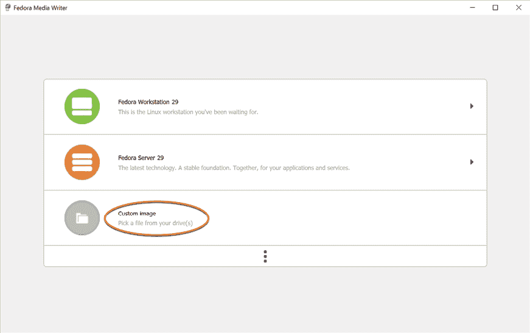

图 3-1

在随后的文件选择对话框中，导航到并选择 CentOS 8 安装 ISO 镜像，然后点击“打开”按钮。选择镜像后，将弹出一个对话框，在其中可以将镜像写入 USB 驱动器。在点击“写入磁盘”按钮之前，请从设备菜单中选择目标 USB 驱动器：

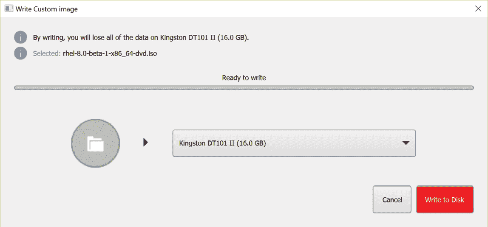

图 3-2

镜像写入设备后，该设备就可以用于执行安装。

3.3 安装 CentOS 8

将 CentOS 8 安装介质插入适当的驱动器并启动系统。如果系统尝试从硬盘驱动器启动，您需要进入计算机的 BIOS 设置并更改启动顺序，使其首先从安装介质驱动器启动。系统启动后，您将看到以下屏幕：

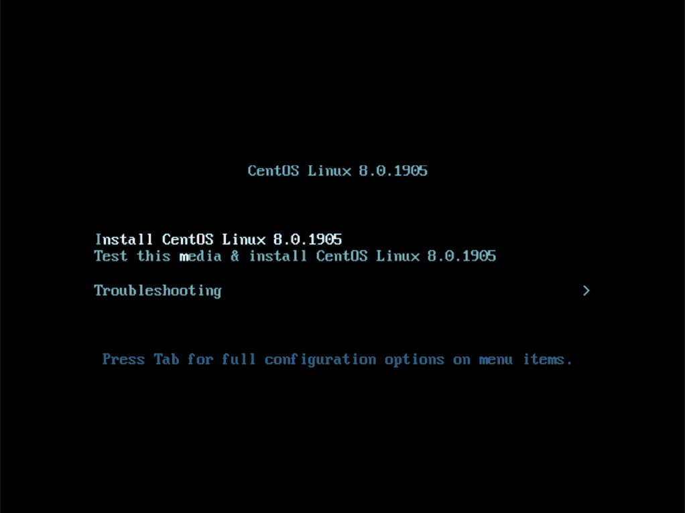

图 3-3

使用箭头键在选项之间导航，并使用<Enter>键进行选择。如果选择了“故障排除”选项，则会显示图 3-4 中的屏幕，包括从本地驱动器上的当前操作系统启动（如果已安装）、测试系统内存或修复已安装的 CentOS 8 系统的选项。对于没有图形控制台的系统，还可以选择以基本图形模式执行安装：

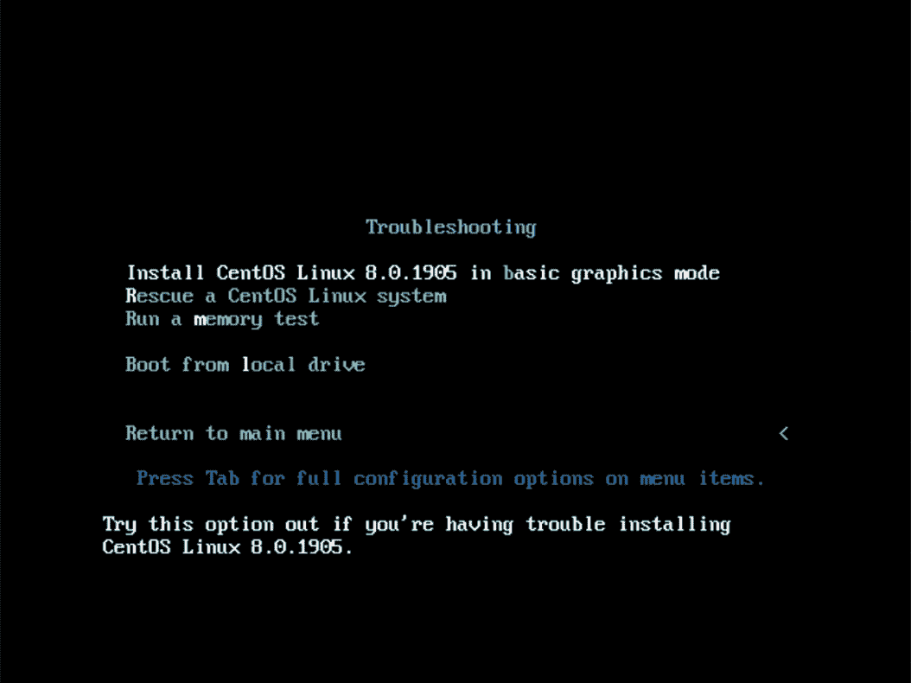

图 3-4

在主屏幕上选择安装 CentOS 选项，经过短暂的延迟后，图形安装程序的第一个界面将出现：

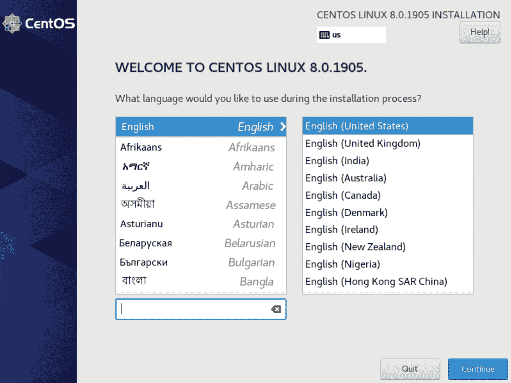

图 3-5

在第一个屏幕上选择您偏好的语言，然后点击“继续”进入主安装界面，如图 3-6 所示：

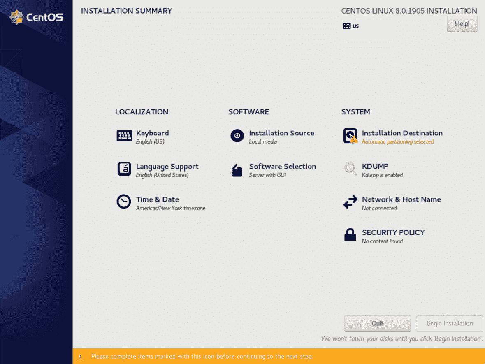

图 3-6

首先选择“网络与主机名”选项，启用系统上的网络设备并输入主机名，然后点击“应用”按钮：

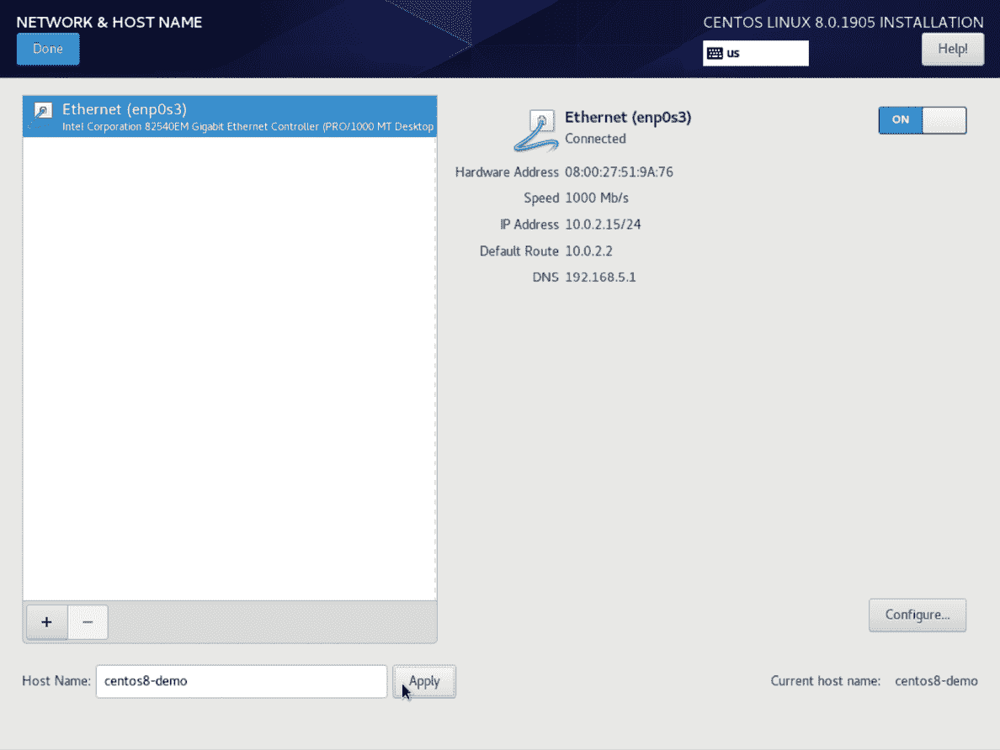

图 3-7

如果您的网络连接需要额外设置，点击“配置...”按钮进入图 3-8 所示的高级网络设置屏幕：

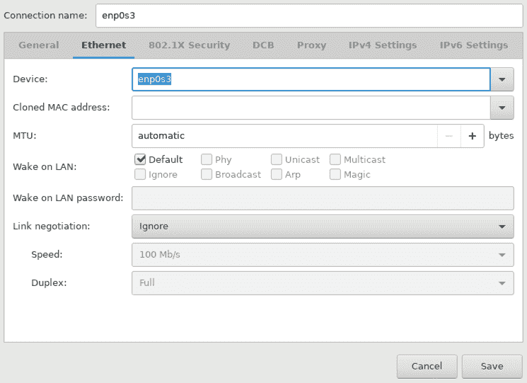

图 3-8

一旦定义了主机名并启用了网络连接，点击“完成”返回到主屏幕。

如果您希望更改键盘、语言或时间和日期设置，请从主屏幕的“本地化”栏目中选择相应选项。在“时间与日期”屏幕上，选择与您地理位置相对应的选项。还提供了使用网络时间选项，它会自动将系统与外部网络时间协议服务器同步。

由于安装是从本地媒体进行的，因此无需更改安装源设置。如果需要从远程服务器上的媒体进行安装，请选择“安装源”，启用“网络上”选项，然后指定安装媒体的位置和使用的 URL 类型。安装媒体可以是一个 ISO 镜像，安装在远程 Web 服务器上，或使用 NFS 在本地网络中的系统上进行安装（关于 NFS 文件共享的详细内容，请参阅章节“使用 NFS 共享 CentOS 8 文件与远程系统”），或者是远程仓库的 URL（仓库本质上是在线集合，包含操作系统所需的软件、软件包和应用程序，可以用来在本地系统上执行安装）。

默认情况下，CentOS 8 的带 GUI 安装将由安装程序执行。该安装将包括运行操作系统和图形桌面环境所需的最小软件包集。要选择不同的安装配置，请选择“软件选择”选项以显示如下图所示的界面：

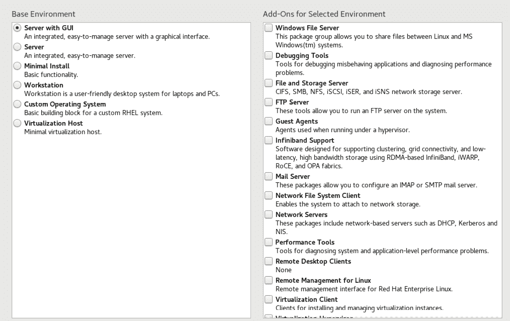

图 3-9

使用左侧面板选择基本配置，并使用右侧面板添加启动后需要的额外包。如果 CentOS 8 系统打算与图形桌面环境一起使用，选择工作站或带 GUI 的服务器选项。否则，一般推荐从最小化系统开始，在系统启动后根据需要安装额外的包。这可以避免安装任何可能永远不需要的包。

安全策略选项允许在系统上安装额外的安全包，这些包可以强制执行符合安全内容自动化协议（SCAP）标准的安全限制。选择列表中的一个配置文件会安装必要的包，但政策限制不会被强制执行，直到在运行的系统上启用它们。除非你为政府机构或公司工作，并且该机构要求此级别的安全性，否则无需在此屏幕上选择策略。

Kdump 功能启用时，在系统崩溃时会写出操作系统内核的状态。这个转储文件对于识别崩溃原因非常有用，但启用后会占用系统内存。除非系统内存有限，否则可以保持启用状态。

配置完基本设置后，下一步是决定如何分区硬盘以容纳操作系统。

3.4 为 CentOS 8 分区硬盘

当选择安装目标选项时，安装程序将显示一个类似于下面图 3-10 所示的界面：

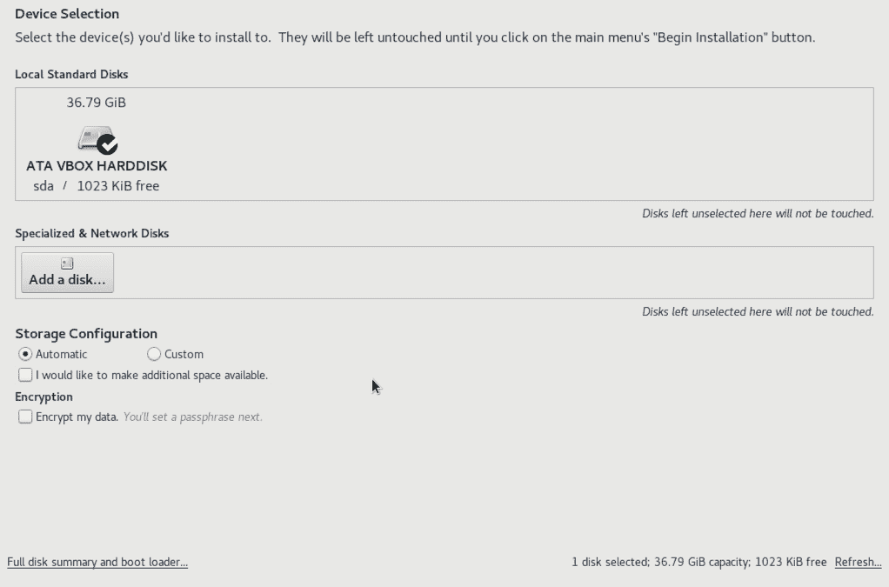

图 3-10

默认情况下，安装程序配置为自动使用当前选择的磁盘驱动器上的可用空间安装操作系统，并配置标准分区大小。如果磁盘之前包含其他操作系统，这些现有的分区不会被删除，可能在 CentOS 8 安装后在磁盘上留下未使用的空间。要删除现有分区以便回收并供 CentOS 8 使用，请启用“我想提供额外的空间”选项，并点击完成按钮，显示图 3-11 所示的对话框。

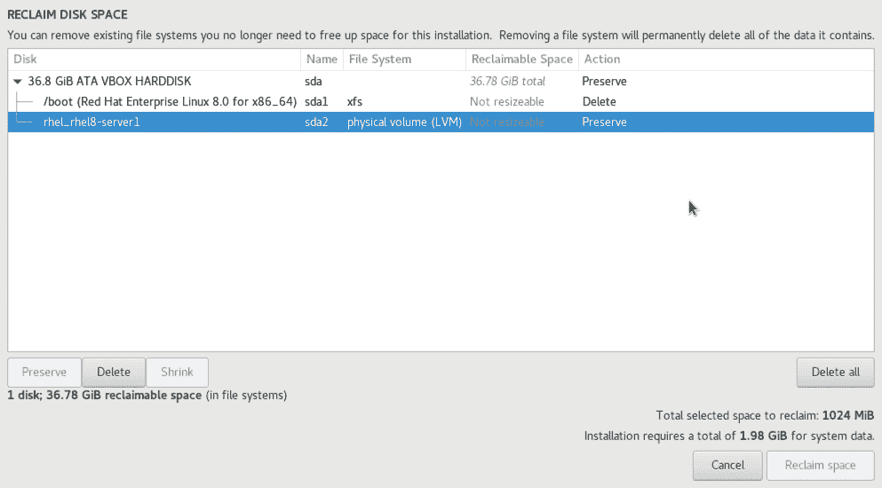

图 3-11

要回收空间，选择一个不再需要的分区，并点击删除按钮标记其为删除。选择完所有要删除的分区后，点击回收空间按钮以执行删除操作。回收的空间将自动由 CentOS 8 安装程序使用。

若要手动配置磁盘布局以及如何分配可用空间，请将存储分配设置从“自动”更改为“自定义”，然后点击“完成”以显示手动分区屏幕（图 3-12）：

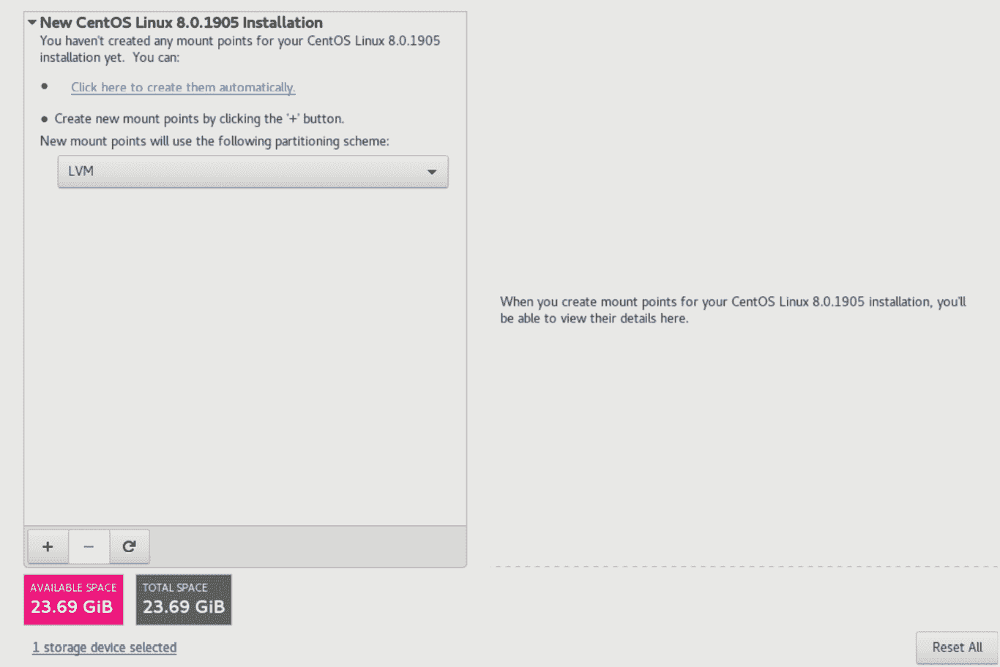

图 3-12

手动分区屏幕提供了使用逻辑卷管理（LVM）或标准分区配置磁盘的选项。LVM 是推荐选项，因为它在系统启动并运行后提供了在管理分区大小方面的灵活性（LVM 详细介绍请参见章节 “将新磁盘添加到 CentOS 8 卷组和逻辑卷”）。

一旦选择了分区方案，最后一步是决定各个分区的大小以及相应的文件系统挂载点。一般而言，点击“自动创建”选项提供的默认配置即可满足大多数系统需求。若要手动创建分区并分配挂载点，请点击 + 按钮手动声明并分配每个分区。

另一种选择是选择自动分区创建，然后使用生成的屏幕根据需要手动更改分区配置。例如，图 3-13 显示了选择自动创建选项后定义的分区配置，并允许在对磁盘进行任何更改之前修改每个分区的设置：

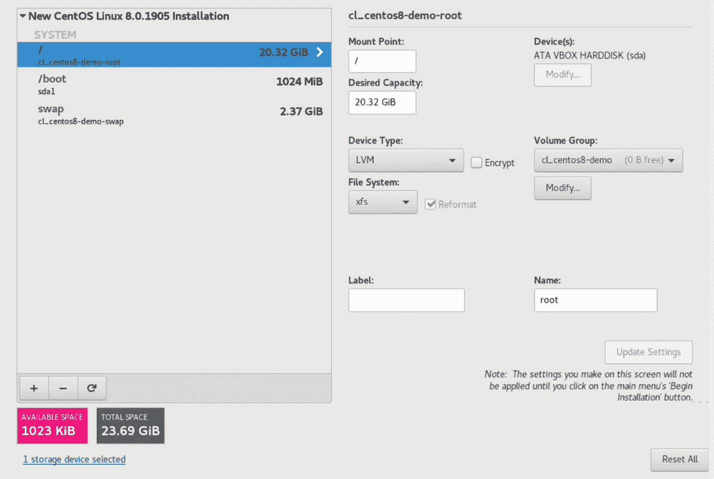

图 3-13

配置完磁盘后，点击“完成”，查看要对磁盘进行的更改摘要（图 3-14），然后点击“接受更改”按钮：

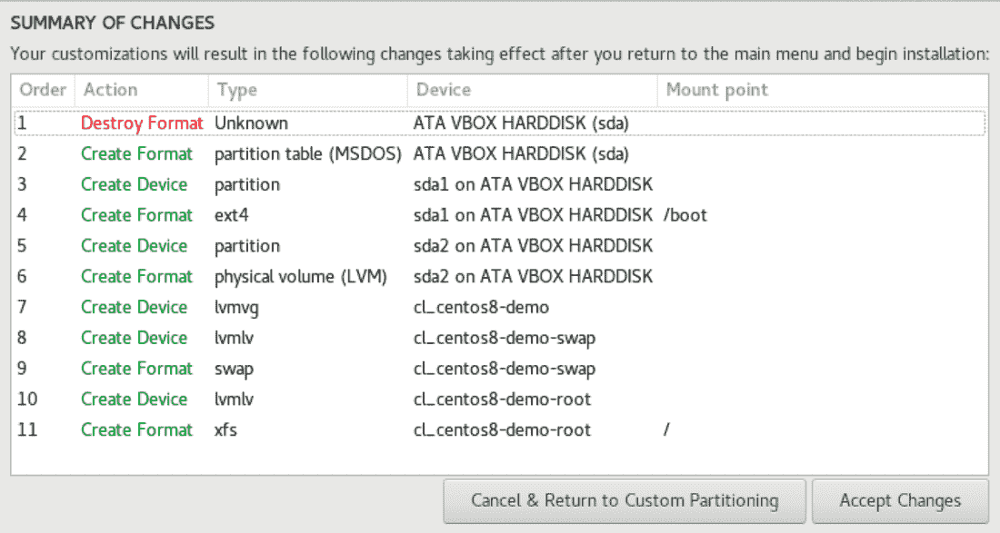

图 3-14

CentOS 8 还允许通过加密保护磁盘内容。每次系统启动时都需要输入密码短语才能访问。要启用加密，请在主安装目标屏幕上选择“加密我的数据”选项，点击“完成”按钮后，在图 3-15 所示对话框中输入密码短语：

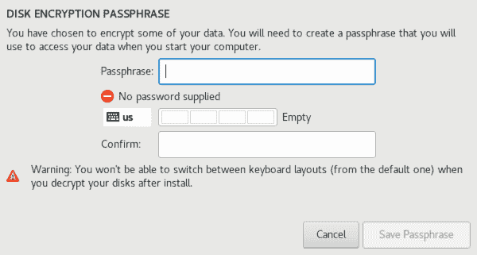

图 3-15

3.5 物理安装

完成合适的软件包选择后，点击“开始安装”将启动分区磁盘并安装与所选安装设置匹配的软件包的过程。在此阶段，将出现一个屏幕（图 3-16），要求创建根密码和一个可选的用户帐户：

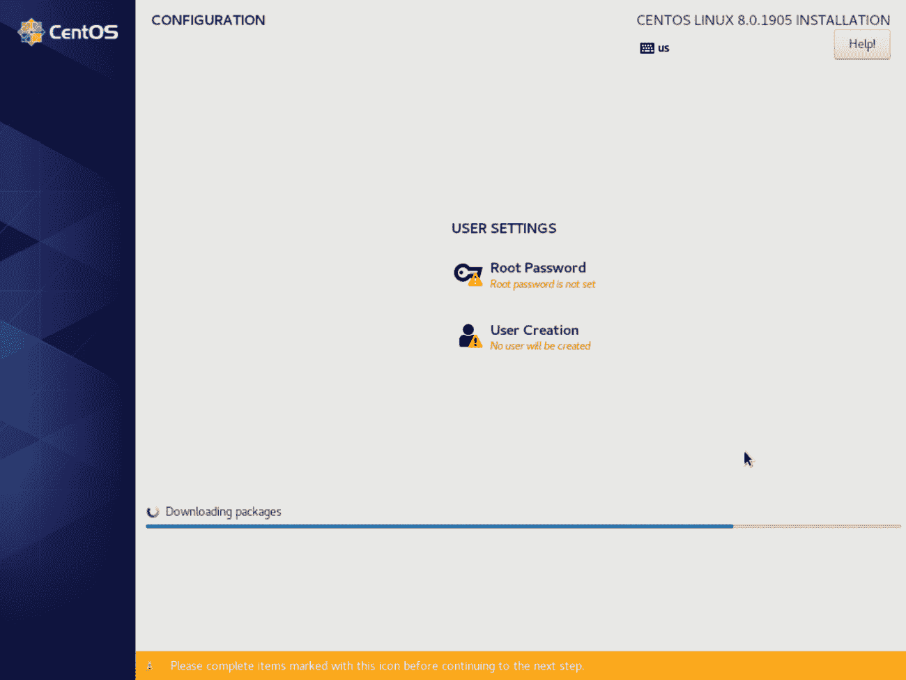

图 3-16

root（超级用户）账户是一个具有系统管理权限的特殊账户。虽然通常使用自己的账户登录系统，但为了配置系统和执行其他管理任务，你需要获得 root 权限。输入 root 密码，创建用户账户并等待安装完成。

一旦所有系统软件包安装并配置完成，移除安装介质并点击重启以重新启动系统。

3.6 最终配置步骤

系统启动时在控制台上显示的内容将取决于在软件选择安装屏幕中是否选择了带有图形用户界面（GUI）的工作站或服务器选项。如果在安装过程中选择了这些选项，则将显示 GNOME 显示管理器（GDM）登录界面。如果选择了最小或服务器配置选项，则会显示基于文本的登录提示。无论配置如何，都需要以在安装过程最后步骤中创建的用户身份登录系统。

在安装了图形用户界面（GUI）的工作站或服务器的情况下，GNOME 初始设置工具将启动，提供语言、键盘布局、位置服务以及连接到包括 Google 和 Facebook 在内的在线帐户等配置选项。在这些设置完成（或跳过）之后，GNOME 桌面欢迎界面将出现，包含有关如何使用桌面环境的教程链接。

3.7 安装更新

与今天大多数操作系统一样，每个特定版本的 CentOS 发行版在发布给公众后，都会不断演进。这通常表现为错误修复和安全更新，有时也包括可以通过互联网下载并安装到系统上的新功能。

最佳实践建议在安装 CentOS 后，第一步是确保系统安装了所有可用的更新。可以通过在终端窗口中使用 dnf 包管理工具来实现这一点。要检查是否有可用的更新，只需运行以下命令：

# dnf check-update

所有待处理的更新可以再次使用 dnf 工具进行应用：

# dnf update

执行时，dnf 工具将列出可更新的包，并提示是否执行更新。

一旦更新完成，安装过程基本上就结束了，CentOS 8 就可以开始使用了。

3.8 显示启动消息

在启动过程中，CentOS 8 将显示 Red Hat 图形启动（RHGB）屏幕，该屏幕隐藏了系统加载时生成的所有启动消息。要在启动过程中使这些消息可见（如 图 3-17 所示），只需在系统启动时按下键盘上的 Esc 键：

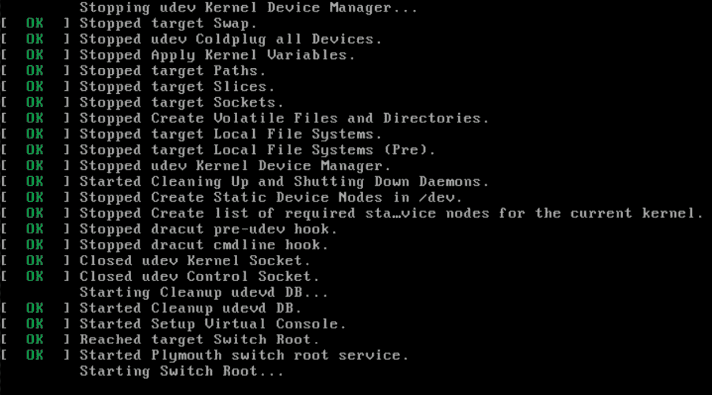

图 3-17

默认行为可以通过编辑 `/etc/default/grub` 文件并更改 GRUB_CMDLINE_LINUX 设置来更改，默认情况下，GRUB_CMDLINE_LINUX 的内容如下所示：

GRUB_CMDLINE_LINUX="crashkernel=auto rhgb quiet"

若要移除图形启动屏幕，使消息在无需按 Esc 键的情况下可见，请从设置中移除“rhgb”选项：

GRUB_CMDLINE_LINUX="crashkernel=auto rhgb quiet"

此更改将导致系统仅显示系统生成的部分启动消息。要显示系统生成的所有消息，还需要移除“quiet”选项：

GRUB_CMDLINE_LINUX="crashkernel=auto quiet"

一旦更改完成，运行以下命令以生成新的启动配置，以便下次系统启动时生效：

# grub2-mkconfig --output=/boot/grub2/grub.cfg

3.9 总结

使用 CentOS 8 的第一步是安装操作系统。如果是基于云的服务器，通常在选择操作系统镜像时，云服务提供商会自动执行此任务。对于自有硬件，安装过程包括下载 ISO 镜像形式的安装介质，将该镜像写入合适的存储介质（如 DVD 或 USB 驱动器），然后从中启动。安装运行后，可以配置一系列选项，包括网络设置、安装是否从本地介质还是远程服务器或仓库进行、需要安装的包，以及磁盘的分区方案。安装完成后，务必安装自原始安装镜像创建以来发布的操作系统更新。
