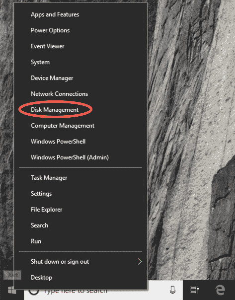
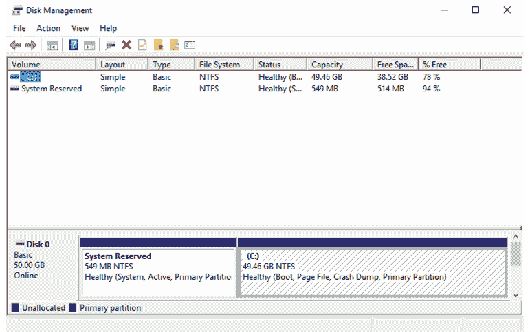
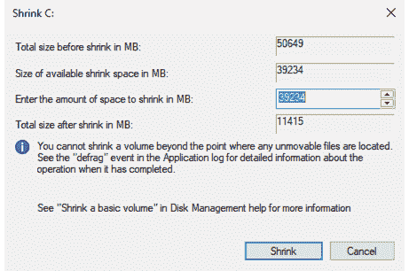
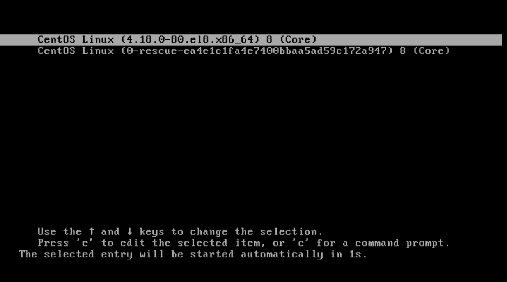
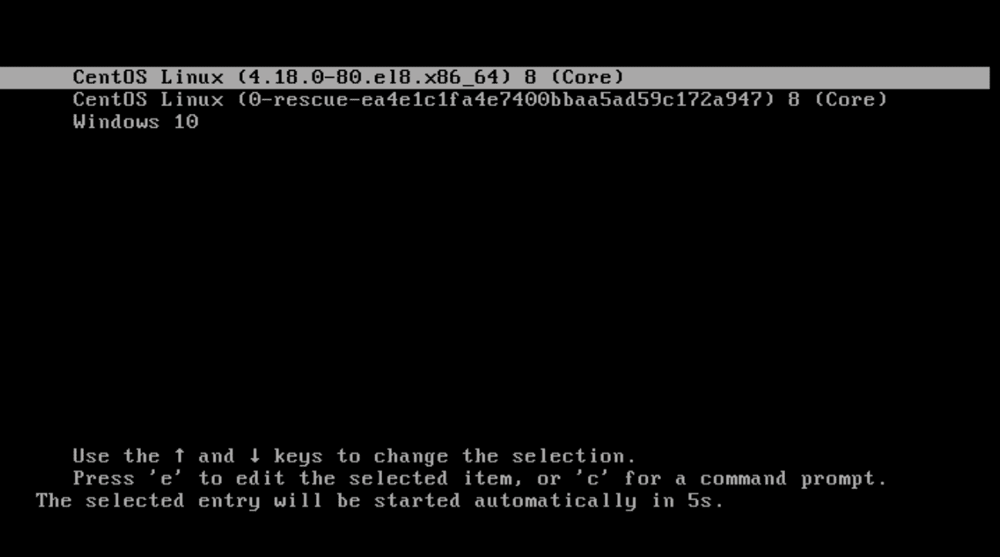

4. 双重启动 CentOS 8 和 Windows

CentOS 8，像大多数 Linux 发行版一样，可以与任何版本的 Windows（包括 Windows 10）共存于同一硬盘驱动器中。这种概念称为双重启动。简单来说，当你启动系统时，会出现一个菜单，供你选择启动 CentOS 8 安装或 Windows。显然，你一次只能运行一个操作系统，但需要注意的是，无论你的 Windows 分区是使用 NTFS、FAT16 还是 FAT32 格式化的，Windows 分区上的文件都可以在 CentOS 8 中访问。

这种安装方法涉及缩小现有 Windows 分区的大小，然后将 CentOS 8 安装到回收的空间中。本章假设 CentOS 8 正在安装到一台当前运行 Windows 10 的系统上。

4.1 分区调整大小

为了在已经包含 Windows 安装的磁盘驱动器上安装 CentOS，第一步是缩小 Windows 分区以腾出一些空间。推荐的操作方式是使用 Windows 磁盘管理界面来减少分区的大小，然后再尝试安装 CentOS 8\。

要访问 Windows 10 上的磁盘管理，右键点击“开始”菜单并从结果菜单中选择“磁盘管理”，如图 4-1 所示：

图 4-1

加载后，磁盘管理工具将显示系统检测到的磁盘驱动器的图形表示：

图 4-2

右键点击你想要缩小的分区，并从弹出菜单中选择“压缩卷...”。该工具将计算可以在不丢失数据的情况下缩小卷大小的最大值（这个过程可能需要几分钟，具体时间取决于分区的总体大小）。一旦分析完成，将会出现一个类似于下面图 4-3 的对话框：

图 4-3

在“输入要缩小的空间大小（以 MB 为单位）”字段中指定一个值，然后点击“压缩”按钮以继续操作。一旦调整大小操作完成，使用 CentOS 8 安装媒体重新启动系统（如“在全新硬盘驱动器上安装 CentOS 8”中所述），然后继续使用新腾出的空闲空间进行安装。

4.2 编辑 CentOS 8 启动菜单

一旦 CentOS 安装到磁盘并且系统重新启动，标准的 CentOS 启动菜单将会出现：

图 4-4

此时，引导菜单仅提供引导 CentOS 8 系统的选项。显然，还需要添加一个选项，以便仍然可以访问 Windows 系统。这些步骤需要在 CentOS 8 系统内执行，因此启动系统并以 root 身份登录。

第一步是使用 fdisk 命令在磁盘驱动器上识别 Windows 引导分区，具体如下：

# 第四章：fdisk -l

。

。

设备引导 起始 结束 扇区 大小 Id 类型

/dev/sda1 * 2048 1126399 1124352 549M 7 HPFS/NTFS/exFAT

/dev/sda2 1126400 53655551 52529152 25G 7 HPFS/NTFS/exFAT

/dev/sda3 53655552 55752703 2097152 1G 83 Linux

/dev/sda4 55752704 104857599 49104896 23.4G 5 扩展

/dev/sda5 55754752 104857599 49102848 23.4G 8e Linux LVM

在上述输出中，/dev/sda3 到/dev/sda5 显然是 CentOS 8 的分区。较小的/dev/sda1 分区是 Windows 系统分区，留下/dev/sda2 作为 Windows 引导分区。

CentOS 8 引导系统使用分区索引，其中第一个分区是分区 0，第二个是分区 1，依此类推。因此，从引导菜单的角度来看，Windows 引导分区位于硬盘 0 的分区索引位置 1，并在引导配置中定义为“hd0,1”。

引导菜单配置设置存储在生成的/boot/grub2/grub.cfg 文件中，使用 grub2-mkconfig 工具基于位于/etc/grub.d 目录中的配置文件的内容。要添加 Windows 引导选项到配置中，请编辑应读取如下内容的/etc/grub.d/40_custom 文件：

#!/bin/sh

exec tail -n +3 $0

# 这个文件提供了一个简单的方法来添加自定义菜单项。只需输入

# 在此注释后添加您想要添加的菜单项。请注意不要更改

# 上述“exec tail”行。

编辑文件，在 40_custom 文件的末尾添加以下条目：

menuentry "Windows 10" {

设置 root=(hd0,1)

chainloader +1

}

保存文件并生成引导菜单如下：

# grub2-mkconfig --output=/boot/grub2/grub.cfg

生成 grub 配置文件…

完成

在下一次重新启动时，Windows 现在将作为引导选项包括在图 4-5 中显示：

图 4-5

4.3 更改默认引导选项

当系统启动时，将显示引导选项屏幕，并等待 5 秒钟供用户选择操作系统。如果在超时之前没有进行选择，则将启动默认操作系统。在新配置的系统上，默认操作系统将是标准（非救援）CentOS 8 映像。但是，可以从 CentOS 内部更改此默认设置。

在新安装中，声明了一系列引导配置选项（包括 5 秒超时和在“在干净磁盘驱动器上安装 CentOS 8”中概述的 boot RHGB 设置），这些选项在/etc/default/grub 文件中定义如下：

GRUB_TIMEOUT=5

GRUB_DISTRIBUTOR="$(sed 's, release .*$,,g' /etc/system-release)"

GRUB_DEFAULT=saved

GRUB_DISABLE_SUBMENU=true

GRUB_TERMINAL_OUTPUT="console"

GRUB_CMDLINE_LINUX="crashkernel=auto resume=/dev/mapper/cl-swap rd.lvm.lv=cl/root rd.lvm.lv=cl/swap rhgb quiet"

GRUB_DISABLE_RECOVERY="true"

GRUB_ENABLE_BLSCFG=true

更改默认启动系统的第一步是在此文件中声明 GRUB_SAVEDEFAULT 设置：

GRUB_TIMEOUT=5

GRUB_DISTRIBUTOR="$(sed 's, release .*$,,g' /etc/system-release)"

GRUB_DEFAULT=saved

GRUB_SAVEDEFAULT=true

.

.

此设置允许将新的默认值保存在启动配置中。接下来，运行 grub2-set-default 命令，通过使用编号系统（第一个选项为 0）来更改默认设置。例如，对于上面图 4-5 中显示的启动选项，第一个 CentOS 项为位置 0，而 Windows 10 选项为位置 2。因此，将 Windows 10 设置为默认启动选项的命令如下所示：

# grub2-set-default 2

通过运行以下命令检查新设置是否生效：

# grub2-editenv list

saved_entry=2

kernelopts=root=/dev/mapper/cl-root ro crashkernel=auto resume=/dev/mapper/cl-swap rd.lvm.lv=cl/root rd.lvm.lv=cl/swap rhgb quiet

boot_success=0

boot_indeterminate=0

请注意，saved_entry 的值现在设置为 2。更改默认设置后，按如下方式重新生成启动配置文件：

# grub2-mkconfig --output=/boot/grub2/grub.cfg

重启系统并验证启动菜单是否默认选择 Windows 10 选项，并且在超时后 Windows 会启动。

4.4 从 CentOS 8 访问 Windows 分区

在双系统配置下运行 CentOS 时，仍然可以访问位于 Windows 分区上的文件。可以通过从命令行手动挂载分区来实现此目标。然而，在这样做之前，需要在系统上安装一些额外的软件包。首先，需要下载并安装 fuse 内核模块：

# dnf install fuse

# modprobe fuse

接下来，需要安装 Fuse NTFS 驱动程序。不幸的是，这个包不包含在标准的 CentOS 8 仓库中，因此需要将企业 Linux 附加包（EPEL）仓库添加到系统中，方法如下：

# dnf install wget

# wget http://dl.fedoraproject.org/pub/epel/epel-release-latest-8.noarch.rpm

# rpm -ivh epel-release-latest-8.noarch.rpm

添加了 EPEL 仓库后，可以安装驱动程序：

# dnf install fuse-ntfs-3g

一旦所需的软件包安装完成，下一步是创建一个目录作为我们 Windows 分区的挂载点。在此示例中，我们将创建一个名为 /mnt/windows 的目录：

# mkdir /mnt/windows

为了识别分配给 Windows 分区的设备名称，可以使用 fdisk 命令，如下所示：

# fdisk -l

.

.

Device Boot Start End Blocks Id System

/dev/sda1 * 1 13 102400 7 HPFS/NTFS

/dev/sda2 13 1400 11141120 7 HPFS/NTFS

/dev/sda3 1400 1464 512000 83 Linux

/dev/sda4 1464 2611 9214976 5 Extended

/dev/sda5 1464 2611 9213952 8e Linux LVM

在上面的输出中，包含我们需要访问的文件的主要 Windows 分区表示为 /dev/sda2\。接下来，我们需要运行 mount 命令（假设 Windows 分区是 /dev/sda2 并且是 NTFS 格式），如下所示：

# mount /dev/sda2 /mnt/windows

通过列出挂载点的顶级目录内容来检查挂载是否成功：

# ls /mnt/windows

‘$Recycle.Bin’ ProgramData swapfile.sys

‘Documents and Settings’ ‘Program Files’ ‘System Volume Information’

pagefile.sys ‘Program Files (x86)’ Users

PerfLogs Recovery Windows

要使每次系统启动时自动挂载，只需将适当的挂载行添加到 /etc/fstab 文件中：

/dev/sda2 /mnt/windows ntfs defaults 0 0

要随时卸载 Windows 文件系统：

umount /mnt/windows

4.5 总结

CentOS 8 可以通过创建双重启动环境与 Windows 操作系统在同一个硬盘驱动器上安全共存。这涉及到先缩小 Windows 系统所占的空间，为 CentOS 8 腾出空间，然后再执行安装。一旦 CentOS 安装完成，必须修改启动菜单配置，以包括从 Windows 启动的选项。要在 CentOS 中访问 Windows 文件系统，需要安装 Fuse NTFS 驱动程序，并用它来挂载 Windows 分区。
