6\. GNOME 3 桌面导览

CentOS 8 包含 GNOME 3 桌面环境。尽管缺乏 Windows 和 macOS 桌面环境的复杂性，GNOME 3 提供了一个简洁直观的桌面环境，具备窗口环境的所有基本功能，且具备快速学习的优势。

本章将介绍 GNOME 桌面的主要特点，并概述如何执行基本任务。

6.1 安装 GNOME 桌面

如果在 CentOS 8 安装过程中选择了工作站或带 GUI 的服务器软件配置，GNOME 桌面将已安装，并将在每次系统启动时自动启动。

如果在 CentOS 8 安装过程中选择了其他软件配置，系统安装的包中将不包括 GNOME 桌面。在没有显示器连接的服务器系统上，安装图形桌面环境的想法可能显得多余。然而，值得注意的是，GNOME 桌面也可以通过远程访问，因此，即使在所谓的无头服务器（即缺少显示器、键盘和鼠标的服务器）上，安装 GNOME 桌面包仍然可能是有益的。本书的“CentOS 8 远程桌面访问通过 VNC”章节将详细介绍建立远程桌面访问的相关内容。

如果安装配置中未包括 GNOME 桌面，可以随时使用以下命令进行安装：

# 第六章：dnf groupinstall "Workstation"

安装完成后，可以通过命令行提示符在显示器上启动桌面环境，如下所示：

$ startx

6.2 GNOME 3 桌面概述

下方的屏幕显示了图 6-1 所示的典型新启动的 GNOME 桌面会话的外观，在此之前没有启动其他程序或进行配置更改。

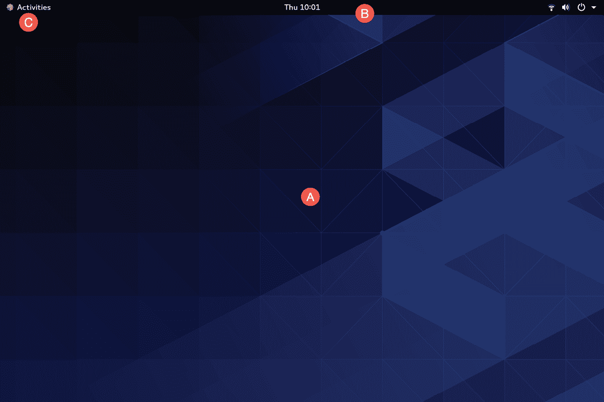

图 6-1

主要桌面区域（标记为 A）是当启动应用程序和实用工具时，窗口将出现在此处。与其他桌面环境不同，无法将文件或应用程序拖放到桌面上，从而提供了一个干净、整洁的工作区。

屏幕顶部的栏（B）称为顶部栏，包括活动菜单（C）、日期和时间以及一组按钮和图标，包含网络状态、音量、电池电量以及其他状态和账户设置。当前桌面上运行的应用程序菜单也会出现在顶部栏中。图 6-2 显示了终端程序的应用程序菜单：

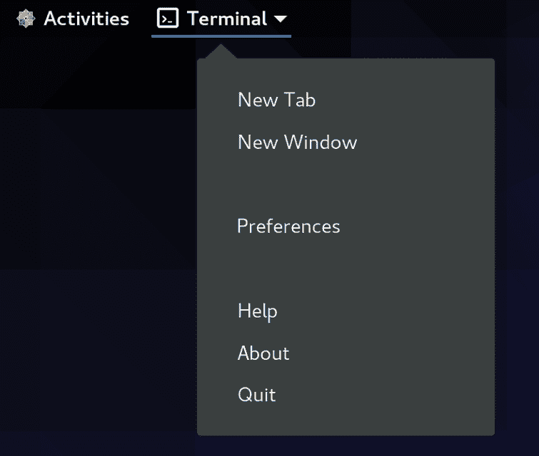

图 6-2

6.3 启动活动

应用程序和实用工具通过活动概览仪表盘（即仪表盘）启动，您可以通过点击顶部栏中的活动按钮或按下键盘上的特殊键来显示该仪表盘。在 Windows 系统中，这是 Windows 键；在 macOS 中，这是 Command 键；在 Chromebook 上，是显示放大镜的键。

显示时，仪表盘将如图 6-3 所示：

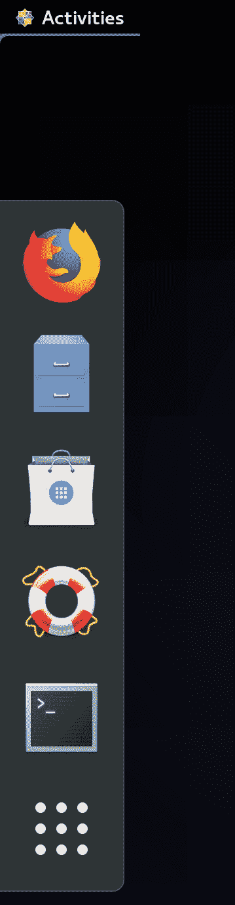

图 6-3

默认情况下，仪表盘将显示一组预定义的常用应用程序图标，还会显示任何当前正在运行的应用程序的图标。如果应用程序正在运行，它将在图标下方显示一个条形标记。

要启动应用程序，只需点击仪表盘中的图标。

要查找仪表盘中未包含的应用程序，一种选择是点击最底部的图标（由九个点组成的正方形），显示可浏览的应用程序列表，如图 6-4 所示：

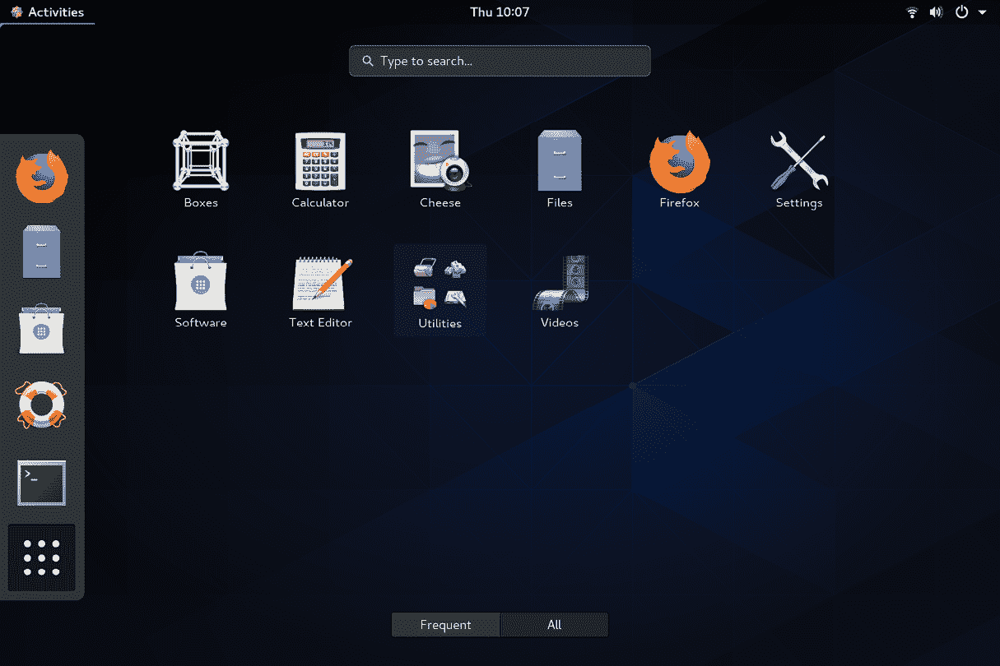

图 6-4

请注意，列表可以通过选择屏幕底部中间的按钮来筛选，以显示所有应用程序或仅显示常用应用程序。还需要注意的是，列表中的某些条目实际上是包含附加应用程序的文件夹。例如，在上面的截图中，“实用工具”条目提供了对其他工具的访问，如系统监视器、磁盘管理工具和终端窗口应用程序。

浏览应用程序的另一种方式是使用搜索栏，在显示仪表盘时会出现该搜索栏，如图 6-5 所示：

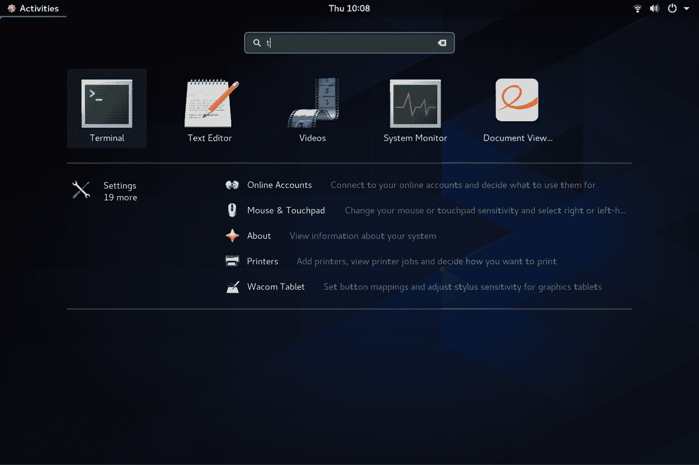

图 6-5

当在搜索框中输入文本时，可能的匹配项列表将被精细化。

要将应用程序添加到仪表盘以便更方便地访问，找到应用程序的图标，右键点击图标并选择“添加到收藏夹”菜单选项：

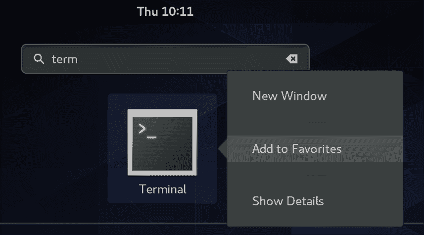

图 6-6

要从仪表盘中移除应用程序，重复这些步骤，这次选择“从收藏夹中移除”。

6.4 管理窗口

与其他桌面环境一样，GNOME 中的应用程序也以窗口形式运行。当多个应用程序窗口打开时，使用 Super + Tab 键盘快捷键将显示切换面板（图 6-7），允许选择另一个窗口作为当前活动窗口（Super 键是 Windows 键，或在 Mac 键盘中是 Cmd 键）：

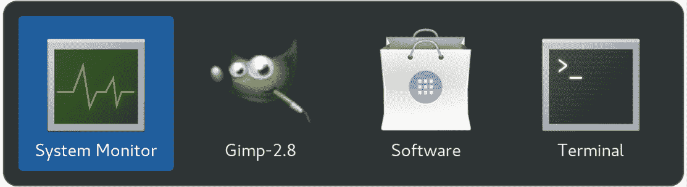

图 6-7

如果单个应用程序打开了多个窗口，切换器将在第二个面板中显示这些窗口，以便选择特定的窗口：

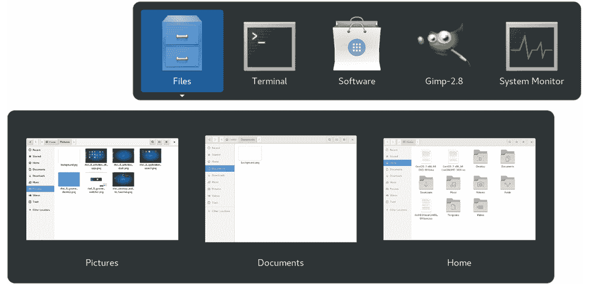

图 6-8

要在切换器中向后循环浏览图标，请使用 Shift + Tab 键盘快捷键。

要最大化一个窗口，使其填满整个屏幕，点击标题栏并将窗口拖动到屏幕顶部。要将窗口恢复到原来的大小，点击标题栏并向下拖动。或者，只需双击标题栏即可在窗口大小之间切换。类似地，将窗口拖动到屏幕的左侧或右侧会使窗口填满屏幕的一半。

6.5 使用工作区

应用程序窗口出现的屏幕区域称为工作区，GNOME 3 允许配置多个工作区。要创建一个新的工作区，显示活动概览并将鼠标指针移动到屏幕的最右侧，显示工作区面板（图 6-9）：

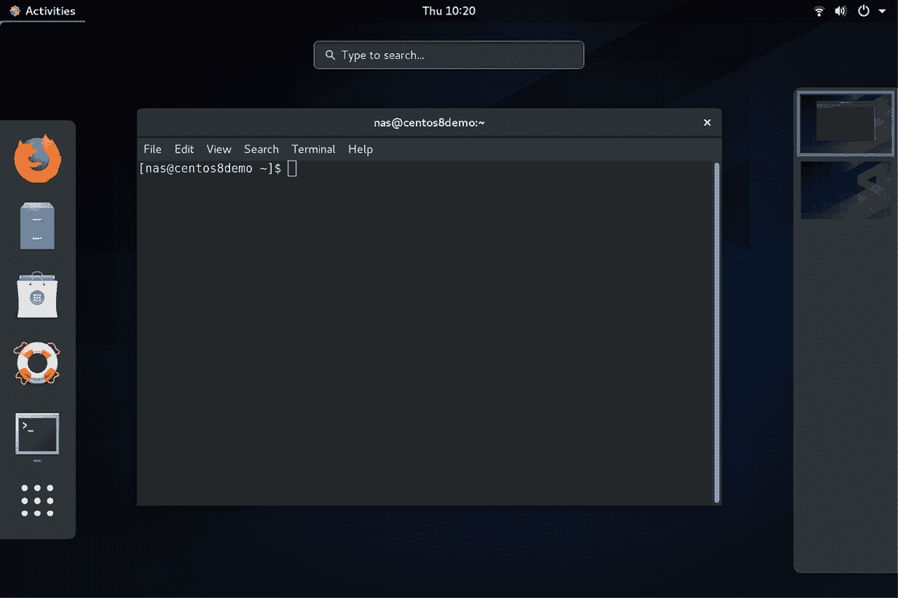

图 6-9

要切换到不同的面板，只需从列表中选择它。要将窗口从一个工作区移动到另一个工作区，显示工作区面板并将应用程序窗口（无论是当前工作区中的实际窗口，还是工作区面板中的缩略图窗口）拖放到目标工作区。当一个窗口被添加到空白工作区时，另一个空白工作区也会添加到工作区面板，从而允许创建多个工作区。

要移除一个工作区，可以关闭该工作区上的所有窗口，或者将它们移到另一个工作区。

6.6 日历和通知

当系统需要通知您某个事件（例如系统或应用程序更新可用）时，工作区顶部会弹出一个面板。可以通过点击顶部栏中的日期和时间来访问日历和任何之前的通知，如图 6-10 所示：

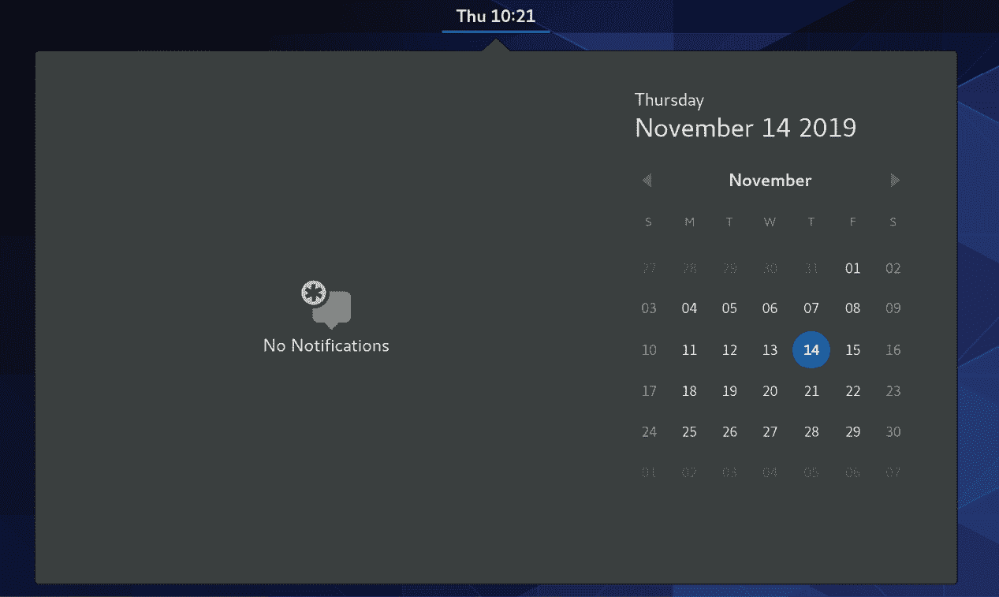

图 6-10

6.7 桌面设置

要访问设置应用程序，点击顶部栏最右侧的向下箭头，然后选择带有工具图标的按钮，如图 6-11 中所示：

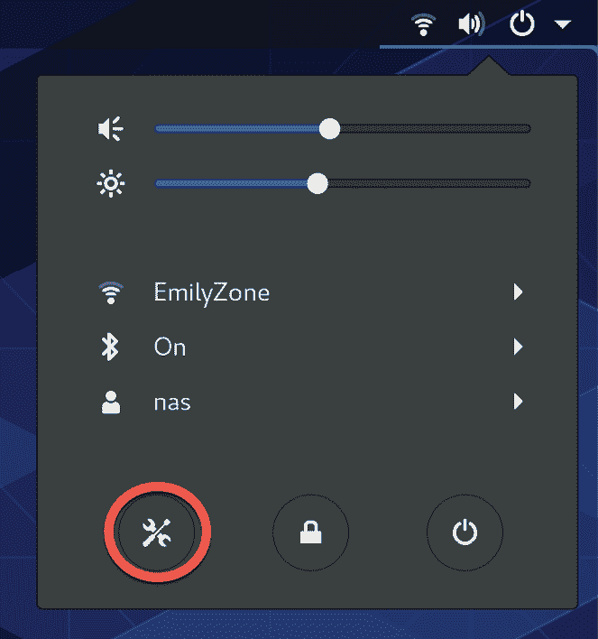

图 6-11

设置应用程序提供了广泛的选项，如以太网和 Wi-Fi 连接、屏幕背景自定义选项、屏幕锁定和电源管理控制以及语言偏好。要探索每个类别中可用的设置，只需从设置窗口的左侧面板中选择一个选项：

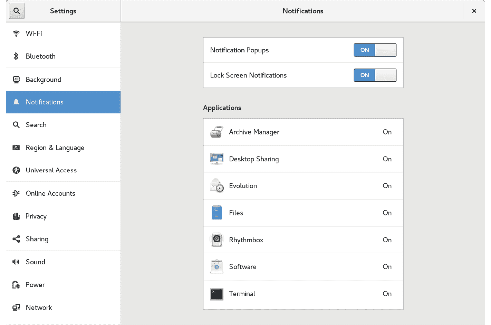

图 6-12

上述在图 6-11 中显示的菜单还包括切换用户、调整音量、切换到不同的 Wi-Fi 网络，以及注销、重启或关闭系统的选项。

6.8 摘要

CentOS 8 包含 GNOME 3 桌面环境，可以在初始安装时包含，也可以稍后使用 dnf 群组包安装功能安装。与大多数其他桌面环境不同，GNOME 3 旨在提供一个简洁且易于使用的窗口用户界面。GNOME 3 桌面的关键区域包括顶部栏、活动概览和启动器。此外，GNOME 3 支持多个工作区，可以保持正在运行的应用程序井然有序，屏幕也更加简洁。设置应用中还提供了多种配置选项，包括桌面背景设置、音频、网络配置和 Wi-Fi 网络选择。
