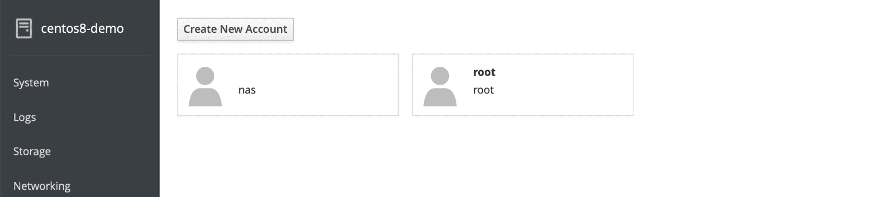
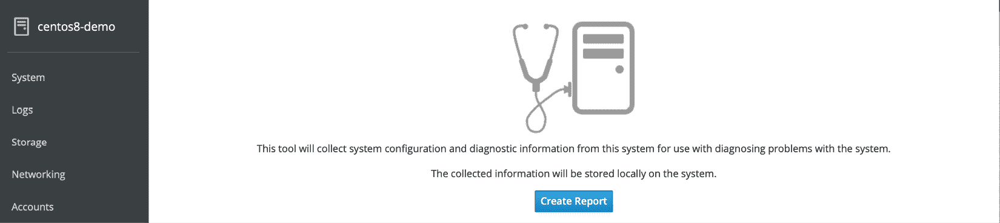
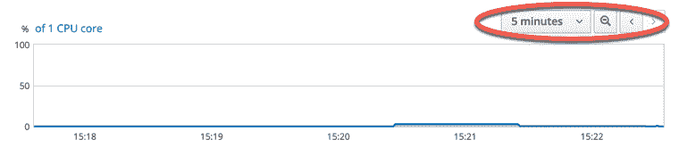

7. CentOS 8 Cockpit 网页界面概述

尽管 CentOS 8 配备了最新的 Linux 桌面环境，但它仍然是一个以服务器为主的操作系统。因此，大多数 CentOS 部署将会部署在远程物理服务器上，或作为云端虚拟机实例。通常，这些系统没有键盘、鼠标或显示器，只有通过网络连接的命令行访问。这在远程位置进行系统管理时带来了挑战。虽然通过远程访问命令行和桌面环境可以实现很多操作，但对于需要在企业级操作系统如 CentOS 8 上每天执行的管理和监控任务来说，这远远不是一个一致且连贯的解决方案。

这个问题通过引入 Cockpit 基于网页的管理界面得以解决。本章将解释如何安装、配置和访问 Cockpit 界面，同时概述 Cockpit 的关键功能，其中许多功能将在后续章节中详细介绍。

7.1 Cockpit 概述

Cockpit 是一个轻量级的基于网页的界面，允许远程执行常规系统管理任务。安装和配置完成后，系统管理员只需打开本地浏览器窗口并导航到远程服务器上的 Cockpit 端口。加载 Cockpit 界面并登录后，管理员可以使用管理和监控工具以可视化方式执行广泛的任务。

在后台，Cockpit 使用与命令行工作时相同的工具执行任务，并且会自动更新以反映系统其他地方的变化。这使得 Cockpit 可以与其他管理工具和技术一起使用，而不会出现某个方法覆盖另一个方法的风险。Cockpit 还可以配置为访问多个服务器，使得多个服务器可以通过单个浏览器会话同时进行管理和监控。

Cockpit 默认与一系列工具一起安装。它还允许根据需要安装额外的扩展插件。Cockpit 的设计还支持通过 HTML 和 JavaScript 的组合来创建自定义扩展，以添加缺失或自定义的功能。

Cockpit 的模块化设计还允许许多功能嵌入到其他基于网页的应用程序中。

7.2 安装与启用 Cockpit

默认情况下，CentOS 8 通常没有安装 Cockpit，但可以通过几个简单的步骤进行设置和启用。第一步是按照如下方式安装 Cockpit 软件包：

# dnf install cockpit

接下来，需要启用 Cockpit 套接字服务：

# systemctl enable --now cockpit.socket

最后，需要在防火墙上打开必要的端口，以允许远程浏览器连接到 Cockpit：

# firewall-cmd --add-service=cockpit --permanent

# firewall-cmd --reload

7.3 访问 Cockpit

如果您可以访问已安装 Cockpit 的服务器桌面环境，请打开浏览器并导航至 https://localhost:9090 以访问 Cockpit 登录界面。另一方面，如果服务器是远程的，只需使用域名或 IP 地址（例如 https://myserver.com:9090）导航到服务器即可。

建立连接后，浏览器可能会发出连接不安全的警告。这是因为 Cockpit 服务使用了自签名证书。您可以选择继续访问该网站，或者为了避免将来出现此消息，可以选择高级选项并为服务器地址添加例外。

一旦连接，浏览器将加载如下所示的登录页面：图 7-1：

图 7-1

使用 root 或者用户账户凭据登录到 Cockpit 界面。请注意，当以用户身份登录时，由于权限限制，某些任务在 Cockpit 界面中会受到限制。登录后，Cockpit 将显示系统屏幕。

7.4 系统

系统屏幕提供了当前系统的概览，包括 CPU、内存、磁盘 I/O 和网络使用情况的实时性能指标。此屏幕还包括有关系统的信息，包括底层硬件、主机名、系统时间以及系统软件是否为最新版本。还提供了重新启动或关闭系统的选项。

图 7-2 例如，显示了 Cockpit 界面的系统监控页面：

图 7-2

7.5 日志

当选择“日志”类别时，Cockpit 会显示 systemd 日志的内容。选择一个日志条目将显示完整的日志消息。日志条目按时间顺序排列，最新的在顶部，并且菜单中包含过滤日志的选项，可以根据时间段和消息的严重性进行筛选。

图 7-3

7.6 存储

选择存储选项以查看和管理系统上的存储，包括磁盘、分区和卷组、网络文件系统（NFS）挂载以及 RAID 存储。此屏幕还允许实时监控磁盘 I/O 活动，并列出系统 udisksd 服务的日志输出，该服务用于查询和管理存储设备。

图 7-4

7.7 网络

网络屏幕提供了广泛的网络相关配置和服务的信息，包括网络接口和防火墙设置，并允许进行配置更改，例如创建网络桥接或设置虚拟网络。

图 7-5

7.8 虚拟机

虚拟化允许多个操作系统实例在单个计算机系统上同时运行，每个系统都运行在自己的虚拟机中。虚拟机 Cockpit 扩展提供了一种方式来创建和管理安装在服务器上的虚拟机客户机。

图 7-6

虚拟机扩展默认未安装，但可以通过运行以下命令将其添加到 Cockpit 中：

# dnf install cockpit-machines

使用虚拟化技术的 CentOS 8 相关内容将从《在 CentOS 8 上安装 KVM 虚拟化》这一章开始介绍。

7.9 账户

选择此选项查看当前配置在系统上的用户账户，并为其他用户创建账户。用户管理的相关内容将在后面章节《管理 CentOS 8 用户和组》中详细介绍。

图 7-7

点击现有账户查看详细信息并进行更改。用户账户详细页面还可以用于查看和添加公共 SSH 密钥到用户账户，以便按章节《在 CentOS 8 上配置基于 SSH 密钥的身份验证》中所述进行远程访问服务器。

7.10 服务

此屏幕显示服务器上运行的系统服务列表，并允许对这些服务进行添加、删除、停止和启动操作。

图 7-8

服务的相关内容将在《配置 CentOS 8 systemd 单元》一章中详细介绍。

7.11 应用程序

如前所述，额外的功能可以通过扩展的形式添加到 Cockpit 中。这些扩展可以是自行开发的扩展，也可以是第三方提供的扩展。应用程序屏幕列出了已安装的扩展，并允许添加或删除扩展。

图 7-9

7.12 诊断报告

选中此选项后，可以生成诊断报告并下载到本地系统进行分析。生成的报告以压缩归档文件的形式提供，包含服务器系统上的所有日志文件。

图 7-10

7.13 内核转储

此屏幕仅显示当前 KDump 服务状态，并指示内核崩溃时内核转储文件将位于何处。此转储文件可用于识别崩溃的原因。提供了一个按钮来测试内核转储，通过触发内核崩溃来进行，但不建议在生产服务器系统上使用此选项：

图 7-11

7.14 SELinux

选择后，SELinux 类别显示当前是否执行 SELinux 策略，并显示该安全系统生成的任何警报。

图 7-12

7.15 软件更新

如果系统有任何可用的软件更新，它们将显示在此屏幕上。如果有更新，可以从此屏幕进行安装。

图 7-13

7.16 终端

顾名思义，终端屏幕提供对命令行提示符的访问。

图 7-14

7.17 连接到多个服务器

Cockpit 可以配置为从单一会话中管理多个服务器。这需要在主系统上安装 Cockpit 仪表盘（换句话说，就是建立初始 Cockpit 会话的系统）。要安装 Cockpit 仪表盘包，请运行以下命令：

# dnf install cockpit-dashboard

安装仪表盘后，退出 Cockpit 然后重新登录。仪表盘现在将出现在 Cockpit 界面中，如图 7-15 中所示：

图 7-15

选择后，仪表盘页面将显示当前系统的性能图表，并提供当前连接的系统列表：

图 7-16

要添加另一台系统，请单击图 7-16 中高亮显示的 + 按钮，输入另一台系统的 IP 地址或主机名，并选择一个颜色以便与之前添加到 Cockpit 的其他服务器区分，然后点击添加按钮：

图 7-17

输入用于连接到其他系统的用户名和密码，然后单击登录按钮。新添加的服务器现在将列在 Cockpit 仪表盘中，并在图表中以之前选择的颜色显示：

图 7-18

要在使用 Cockpit 时切换系统，只需使用下方图 7-19 中所示的下拉菜单：

图 7-19

7.18 启用存储的度量数据

在标准安装中，Cockpit 不会保留任何超出图表所显示的短时间窗口范围的数据。如果要保留 Cockpit 收集的数据，需要安装存储度量功能。首先按照以下步骤安装 cockpit-pcp 包：

# dnf install cockpit-pcp

要启用度量持久性，显示系统屏幕并点击图 7-20 中高亮显示的启用存储的度量数据...链接：

图 7-20

一旦选择了此选项，Cockpit 将请求安装 cockpit-pcp、pcp-libs 和 pcp-selinux 包。安装这些包后，启用持久性度量的链接将被一个名为“存储度量”的控件所替代。当启用此选项时，性能图表将包括额外的控件，允许您在时间轴上前后移动，以查看历史数据，并更改数据时间范围，从 1 小时到 1 周不等：

图 7-21

7.19 总结

Cockpit 网页界面允许通过网页浏览器进行远程系统管理任务，无需依赖命令行提示符和命令行工具。一旦安装并启用，系统管理员只需打开网页浏览器，连接到远程服务器并登录 Cockpit 界面。在后台，Cockpit 使用与命令提示符中可用的相同命令行工具，从而允许同时使用两者而不会出现配置冲突的风险。Cockpit 使用模块化框架，允许添加额外的扩展，并支持开发和集成自定义扩展。一个 Cockpit 会话可以用于管理单台服务器，或者配置为同时访问多台服务器。
