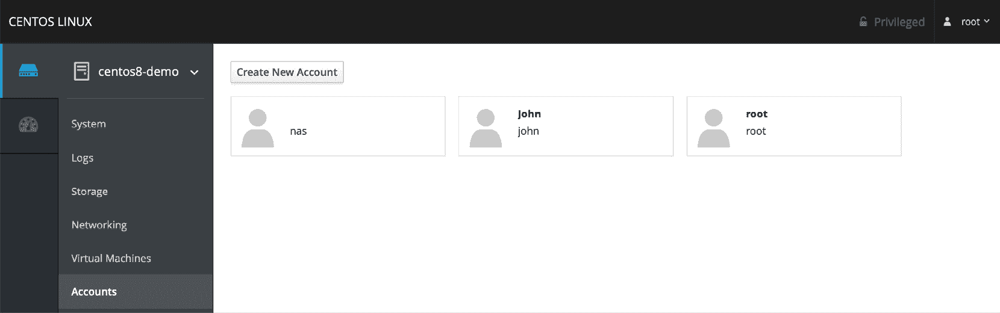
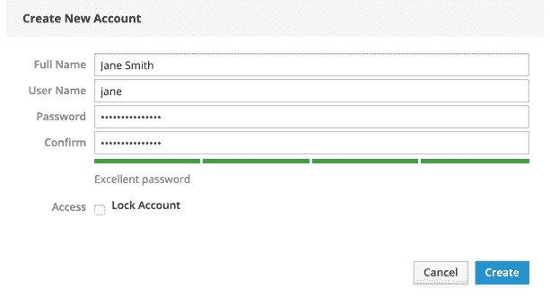
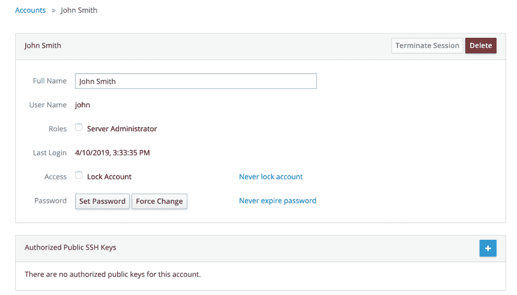

9\. 管理 CentOS 8 用户和组

在 CentOS 8 的安装过程中，安装程序创建了一个 root 或超级用户账户，并要求配置密码。安装程序还提供了为系统创建用户账户的机会。我们不应忽视 CentOS 8 实际上是一个企业级、多用户、多任务的操作系统。因此，为了充分发挥 CentOS 8 的功能，可能需要为多个用户提供系统访问权限。每个用户应该有自己的用户账户登录、密码、主目录和权限。

用户进一步被划分为组，以便于管理，这些组可以具有不同级别的权限。例如，你可能有一个会计部门的用户组。在这种环境下，你可能希望创建一个 accounts 组并将所有会计部门的用户分配到该组。

在本章中，我们将介绍如何在 CentOS 8 系统中添加、删除和管理用户和组。管理用户和组有多种方法，最常见的选项是命令行工具和 Cockpit Web 界面。在本章中，我们将讨论这两种方法。

9.1 从命令行管理用户

新用户可以通过命令行使用 useradd 工具添加到 CentOS 8 系统中。要创建新用户账户，请输入类似以下的命令：

# 第九章：useradd john

默认情况下，这将为用户在/home 目录下创建一个主目录（在此例中为/home/john）。要指定不同的主目录，创建账户时可以使用-d 命令行选项：

# useradd -d /users/johnsmith john

一旦账户创建完成，需要使用 passwd 工具设置密码，用户才能登录系统：

# passwd john

正在为用户 john 更改密码。

新密码：

重新输入新密码：

passwd: 所有身份验证令牌已成功更新。

可以使用 userdel 工具通过命令行删除现有用户：

# userdel john

在删除过程中，也可以将用户的主目录和邮件队列一起删除：

# userdel --remove john

CentOS 8 系统上的所有用户都是一个或多个组的成员。默认情况下，新用户会被添加到与用户名相同的私有组（在上述例子中，为用户 john 创建的账户也属于一个名为 john 的私有组）。作为管理员，将用户组织到更合理的组中是有意义的。例如，所有销售人员可能属于一个销售组，而会计人员则可能属于 accounts 组，依此类推。新的组可以通过命令行工具 groupadd 来添加，例如：

# groupadd accounts

使用 usermod 工具可以将现有用户从命令行添加到现有组：

# usermod -G accounts john

要将现有用户添加到多个现有组，可以使用 -G 选项运行 usermod 命令：

# usermod -G accounts,sales,support john

请注意，上述命令会将用户从 -G 后面未列出的所有附加组中移除，但这些组是用户当前的成员。为了保留当前的组成员身份，可以使用 -a 标志来附加新的组成员身份：

# usermod -aG accounts,sales,support john

可以使用 groupdel 工具从系统中删除现有组：

# groupdel accounts

请注意，如果要删除的组是某个用户的主组或初始组，则无法删除该组。必须先删除该用户，或使用 usermod 命令为该用户分配一个新的主组，然后才能删除该组。可以使用 usermod -g 选项将用户分配到新的主组：

# usermod -g sales john

# groupdel accounts

要查看某个用户所属的组，只需运行 groups 命令。例如：

$ groups john

john : john accounts support

默认情况下，用户账户无法执行需要超级用户（root）权限的任务，除非他们知道 root 密码。然而，可以配置用户账户，使其能够使用 sudo 命令执行特权任务。这涉及将用户账户添加为 wheel 组的成员，例如：

# usermod -aG wheel john

一旦将用户添加到 wheel 组，用户就可以使用 sudo 执行通常受限的任务，操作如下：

$ sudo dnf update

[sudo] demo 的密码：

正在更新订阅管理存储库。

.

.

可以通过编辑 /etc/sudoers 文件并找到以下部分，来修改 wheel 组的 sudo 权限：

## 允许 wheel 组中的人运行所有命令

%wheel ALL=(ALL) ALL

## 没有密码的相同操作

# %wheel ALL=(ALL) NOPASSWD: ALL

要禁用所有 wheel 组成员的 sudo 权限，可以将第二行注释掉，如下所示：

## 允许 wheel 组中的人运行所有命令

# %wheel ALL=(ALL) ALL

要允许 wheel 组成员在不输入密码的情况下使用 sudo（出于安全原因，不推荐这样做），请取消 sudoers 文件中相应行的注释：

## 没有密码的相同操作

%wheel ALL=(ALL) NOPASSWD: ALL

值得注意的是，在后台，所有这些命令只是对系统上的 /etc/passwd、/etc/group 和 /etc/shadow 文件进行更改。

9.2 使用 Cockpit 进行用户管理

如果系统上已安装并启用了 Cockpit Web 界面（该主题在名为 “CentOS 8 Cockpit Web 界面概述” 的章节中讲解），则可以在下面显示的帐户屏幕中执行多个用户管理任务：图 9-1：

图 9-1

屏幕将显示系统中现有的用户帐户，并提供一个按钮以添加额外的帐户。要创建新帐户，点击“创建新帐户”按钮，并在弹出的对话框中输入所需的信息（图 9-2）。请注意，也可以选择创建帐户，但将其锁定直到以后：

图 9-2

要修改用户帐户，请从主屏幕中选择该帐户，并对帐户详细信息进行任何修改：

图 9-3

此屏幕允许执行多种任务，包括锁定或解锁帐户、更改密码或强制用户配置新密码。如果选择“服务器管理员”选项，则该用户将被添加到 wheel 组，并允许使用 sudo 执行管理任务。还提供了一个按钮来删除系统中的用户。

如果用户将使用 SSH 密钥加密连接远程访问系统，可以在此屏幕中添加用户的公钥。SSH 访问和身份验证将在“在 CentOS 8 上配置基于 SSH 的身份验证”中进一步讲解。

9.3 总结

作为一款多用户操作系统，CentOS 8 被设计为支持多个用户的受控访问。在安装过程中，创建了 root 用户帐户并为其分配了密码，同时也提供了创建用户帐户的选项。可以使用一组命令行工具或通过 Cockpit Web 界面向系统添加额外的用户帐户。除了用户帐户，Linux 还实现了组的概念。可以使用命令行工具添加新组，并将用户分配到这些组中，每个用户必须至少属于一个组。默认情况下，标准的非 root 用户没有权限执行特权任务。然而，属于特殊 wheel 组的用户可以通过使用 sudo 命令执行特权任务。

10\. 理解 CentOS 8 软件安装与管理

新安装的 CentOS 8 系统不太可能包含所有执行其预期任务所需的软件包。即使在安装了所有必需的软件后，许多软件包的更新版本几乎肯定会在系统的生命周期中发布。在某些情况下，你需要确保这些最新的软件包版本被安装，以确保修复任何错误。然而，在其他情况下，可能需要保留某个特定软件包的旧版本，以与其他软件兼容。

本章介绍了 CentOS 8 中软件管理的基本概念，解释了如何处理这些问题，介绍了仓库、软件包和 CentOS 应用流（AppStream）的概念，并探讨了如何列出、安装和移除构成功能正常的 CentOS 8 系统的软件包。

10.1 仓库

Linux 本质上由一组基本包组成，这些包提供了操作系统的核心功能，以及一系列其他包和模块，增加了基于操作系统的功能和特性。

当 CentOS 8 首次安装时，会根据安装阶段选择的软件选项安装若干不同的包。然而，一旦系统运行起来，可以根据需要安装额外的软件。通常，所有 CentOS 8 的软件（即非第三方供应商提供的软件）都会使用 dnf 命令下载并安装到系统中。正如我们在前面的章节中所见，这通常包含在命令提示符下发出类似以下的命令：

# dnf install httpd

当发出这样的命令时，请求的软件会从远程仓库下载并安装到本地系统上。默认情况下，CentOS 8 配置为从两个名为 BaseOS 和 AppStream 的仓库下载软件。运行以下命令将提供系统当前配置的用于下载软件的仓库列表：

# dnf repolist

上次元数据过期检查：2019 年 11 月 14 日星期四 03:43:07 PM EST，0:01:02 前。

repo id repo name status

AppStream CentOS-8 - AppStream 5,089

BaseOS CentOS-8 - Base 2,843

extras CentOS-8 - Extras 3

google-chrome google-chrome 3

上面的示例显示，AppStream 和 BaseOS 的仓库都已在系统上启用。还需要注意的是，系统可能还会为第三方软件添加仓库，正如上面列出的 Google Chrome 仓库一样。

可以通过在 /etc/dnf/dnf.conf 文件中添加条目，或将 .repo 文件添加到 /etc/yum.repos.d/ 目录来将额外的仓库添加到系统中。或者，也可以使用 dnf config-manager 工具，传递 .repo 文件的 URL 作为命令行参数来添加仓库：

# dnf config-manager --add-repo https://url/of/repo/file

10.2 BaseOS 仓库

BaseOS 仓库包含组成操作系统核心功能的包。这些软件元素以 Red Hat 包管理器（RPM）包文件的形式下载，然后安装到系统中。典型的 CentOS 8 系统将安装大约 1500 个 RPM 包。要查看当前系统上已安装的所有 RPM 包，只需运行以下 rpm 命令：

# rpm -qa | more

qemu-kvm-block-rbd-2.12.0-41.el8+2104+3e32e6f8.x86_64

kyotocabinet-libs-1.2.76-17.el8.x86_64

cyrus-sasl-scram-2.1.27-0.3rc7.el8.x86_64

curl-7.61.1-5.el8.x86_64

.

.

可以通过如下命令列出来自 BaseOS 仓库的可安装包：

# dnf 列表

要获得匹配搜索字符串的软件包列表，可以使用如下 dnf 命令：

# dnf 搜索 "搜索字符串"

还可以识别哪个软件包包含特定的文件：

# dnf 提供文件名

例如：

# dnf 提供 /etc/httpd/conf/httpd.conf

最后一次元数据过期检查：2019 年 11 月 14 日星期四 03:43:07 PM EST，0 小时 03 分钟 03 秒前。

httpd-2.4.37-12.module_el8.0.0+185+5908b0db.x86_64 : Apache HTTP Server

仓库：AppStream

匹配来自：

文件名：/etc/httpd/conf/httpd.conf

要安装一个软件包，请运行以下命令：

# dnf 安装软件包名

同样地，要删除一个软件包：

# dnf 删除软件包名

当新的 BaseOS 包版本发布时，系统下次更新时会下载并安装它，通常通过 dnf 命令：

# dnf 更新

任何更新过的包将替换系统中当前安装的旧版本。虽然在处理基础操作系统包时，这通常是理想的情况，但在处理其他软件包（如编程环境或开发库）时，这种行为不一定是期望的，因为升级到新版本可能会导致与系统中已安装的其他包不兼容。这个问题通过 AppStream 仓库来解决。

10.3 AppStream 仓库

AppStream 仓库按软件包、模块、流和配置文件来管理软件。AppStream 包仍然是 RPM 包，如前面描述 BaseOS 部分所述。另一方面，AppStream 模块是属于一组相关或存在依赖关系的软件包（例如，构建 Web 服务器时需要一起安装的软件包组）。每个模块可以有多个流，每个模块流代表软件模块的不同版本。

例如，考虑一个 CentOS 8 系统，它托管了一个依赖 PHP 脚本语言 7.1 版本的网站。该服务器仍然需要接收 PHP 7.1 的任何更新，以便从补丁和 bug 修复中获益，但与 PHP 的最新版本（7.2 版本）不兼容。在引入 AppStream 之前，当新版本发布时，要继续接收 7.1 版本的更新是困难的。

为了解决这个问题，CentOS 软件管理工具可以使用 AppStream 仓库，只订阅特定模块的特定流（在此案例中为 PHP 模块的版本 7.1 流）。

除了流，模块还可以按模块配置文件进行子类化。模块配置文件提供了不同的包配置，这些包将根据系统的需求安装。以 nodejs JavaScript 运行时环境模块为例，可以通过开发版或最小化配置文件进行安装。在进行 nodejs 开发的系统上，很可能使用开发版配置文件。开发使用 nodejs 的软件在部署时，可能只会安装包含运行时环境的最小系统。

要查看可安装的模块列表，可以使用如下 dnf 命令：

# dnf module list

CentOS-8 - AppStream

名称 流 配置文件 概述

389-ds 1.4 默认 389 目录服务器（基础）

App-cpanminus 1.7044 [d] 默认 [d] 获取、解压、构建并安装 CPAN 模块

DBD-MySQL 4.046 [d] 默认 [d] 一个 MySQL 接口用于 Perl

DBD-Pg 3.7 [d] 默认 [d] 一个 PostgreSQL 接口用于 Perl

DBD-SQLite 1.58 [d] 默认 [d] SQLite DBI 驱动

DBI 1.641 [d] 默认 [d] 一个数据库访问 API 用于 Perl

YAML 1.24 [d] 默认 [d] Perl 的 YAML 解析器

.

.

.

提示: [d]efault, [e]nabled, [x]disabled, [i]nstalled

列表中的第一列是模块名称，第二列是流名称（通常是模块的版本）。流名称后的字母表示该流是否为默认流（即如果没有引用特定流，则使用此流进行安装）或是否在执行安装时启用。第三列列出了可用于相应包的配置文件，并指明该配置文件是默认的、已安装的还是已禁用的。

查看特定模块信息的 dnf 命令结构如下：

# dnf module list modulename

以下输出示例列出了可安装的 PHP 模块信息：

# dnf module list php

.

.

名称 流 配置文件 概述

php 7.1 开发版，最小化，默认 [d] PHP 脚本语言

php 7.2 [d] 开发版，最小化，默认 [d] PHP 脚本语言

显然，版本 7.2 会在系统中默认安装，并且该模块在开发版、默认和最小化配置文件中可用。

要使用默认流和配置文件安装模块，可以使用以下语法的 dnf 命令：

# dnf install @modulename

例如：

# dnf install @php

或者，可以指定一个流来执行安装：

# dnf install @modulename:stream

例如：

# dnf install @php:7.2

最后，配置文件也可以按如下方式声明：

# dnf install @modulename:stream/profile

例如，要安装 PHP 7.2 的最小软件包集：

# dnf install @php:7.2/minimal

执行上述命令后，PHP 模块将按如下方式列出：

php 7.1 [e] 开发版，最小化 [i]，默认 [d] PHP 脚本语言

php 7.2 [d][e] common [d], devel, minimal [i] PHP 脚本语言

“[e]” 指示符在流列中告诉我们，7.2 流已被启用，而 “[i]” 在配置文件列中显示该模块已使用最小配置文件进行安装。

要启用一个流而不安装模块，请使用以下 dnf 命令：

# dnf module enable modulename

同样，流也可以如下禁用：

# dnf module disable modulename

要卸载一个模块，请使用以下语法：

# dnf module remove modulename

可以使用以下 dnf 命令来识别有关模块的附加信息：

# dnf module info modulename

要找出组成特定模块和流组合的不同配置文件的 RPM 包，请使用 dnf，如下所示：

# dnf module info --profile modulename:stream

例如：

# dnf module info --profile php:7.2

上次元数据过期检查：2019 年 11 月 14 日星期四下午 04:31:25 EST，已过去 0:02:11。

名称 : php:7.2:8000020190628155007:ad195792:x86_64

common : php-cli

: php-common

: php-fpm

: php-json

: php-mbstring

: php-xml

devel : libzip

: php-cli

: php-common

: php-devel

: php-fpm

: php-json

: php-mbstring

: php-pear

: php-pecl-zip

: php-process

: php-xml

minimal : php-cli

: php-common

最后，要从一个模块流切换到另一个模块流，只需运行以下安装命令，引用新的流：

# dnf install @modulename:otherstream

该命令将下载新流的包，并将现有包升级或降级到指定版本。一旦此过程完成，重新同步新流的模块包：

# dnf distro-sync

10.4 摘要

CentOS 8 系统由 RPM 格式的软件包组成，这些包是从 CentOS BaseOS 和 AppStream 仓库下载并安装的。根据需要，可以向系统中添加其他仓库以安装包。

BaseOS 仓库包含实现操作系统基本核心功能的包。而 AppStream 包提供额外的功能和特性，这些包将根据系统配置的目的进行选择性安装。在这种复杂的系统中，可能会有大量的包之间的相互依赖关系，其中系统的某些部分可能需要另一个软件包的特定版本才能正常运行。AppStreams 允许创建包含所有必要依赖包的模块和配置文件，确保将特定功能与正确版本的包一起安装。AppStreams 还允许已安装的包在不需要下载下一个主要版本的情况下接收当前版本的更新，从而避免破坏其他包的依赖关系。
