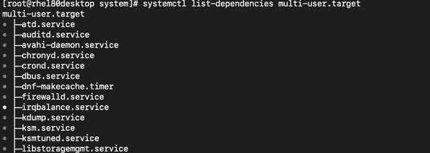
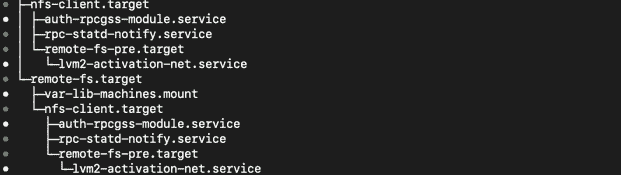
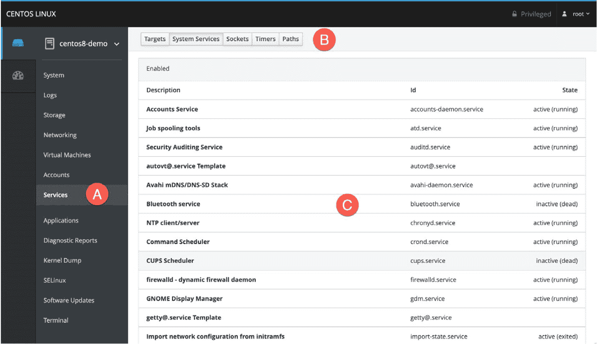
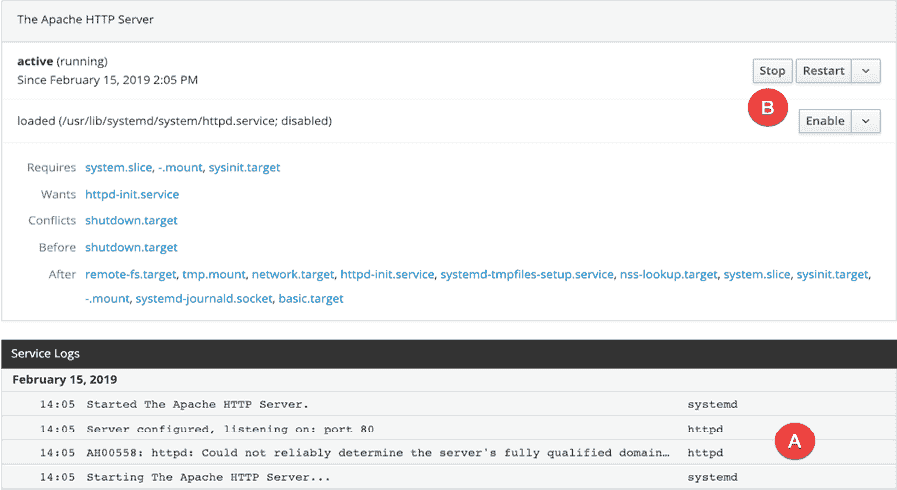

11. 配置 CentOS 8 systemd 单元

为了熟练掌握 CentOS 8 系统管理，了解 systemd 单元的概念非常重要，特别是要重点了解两种特定类型的单元：目标和服务。因此，本章的目标是提供一个关于 CentOS 8 支持的不同 systemd 单元的基本概述，并介绍如何配置运行中的 Linux 系统后台运行的多个服务。

11.1 理解 CentOS 8 systemd 目标

CentOS 8 可以配置为启动到多个状态（称为目标），每个目标旨在提供特定级别的操作系统功能。系统默认启动的目标由系统管理员根据系统用途配置。例如，桌面系统通常会配置为使用图形用户界面目标启动，而基于云的服务器系统更可能启动到多用户目标级别。

在启动过程中，一个名为 systemd 的进程会查看 /etc/systemd/system 文件夹，查找默认的目标设置。在确定默认目标后，它会启动与该目标相关联的 systemd 单元，以便系统启动时所有必要的进程都能运行。

对于熟悉旧版 CentOS 的用户来说，systemd 目标是对旧有运行级别系统的替代。

11.2 理解 CentOS 8 systemd 服务

服务本质上是一个进程，通常在后台运行，提供特定的功能。例如，sshd 服务是一个后台进程（也称为守护进程），提供系统的安全 shell 访问。不同的 systemd 目标会自动启动不同的服务集合，具体取决于该目标提供的功能。

目标和服务是 systemd 单元的类型，本章稍后将详细讲解这一主题。

11.3 CentOS 8 systemd 目标描述

如前所述，CentOS 8 可以启动到多个目标级别之一。系统默认配置的启动目标将决定启动哪些 systemd 单元。与系统启动和关闭相关的目标可以总结如下：

• poweroff.target - 这是系统关闭时的目标。出于显而易见的原因，这不太可能成为默认目标。

• rescue.target – 使系统在单用户模式下启动，此模式下只有 root 用户可以登录。在此模式下，系统不会启动任何网络、图形用户界面或多用户服务。此运行级别非常适合系统管理员执行系统维护或修复工作。

• multi-user.target - 将系统启动到多用户模式，并提供基于文本的控制台登录功能。

• graphical.target - 将系统启动到带有 X Window 系统功能的网络多用户状态。默认情况下，图形桌面环境将在引导过程结束时启动。这是桌面或工作站使用最常见的运行级别。

• reboot.target - 重启系统。由于显而易见的原因，你不太可能将其设置为默认目标。

除上述目标外，系统还包括大约 70 个其他目标，其中许多实际上是由上述主要目标使用的子目标。例如，后台，multi-user.target 还将启动一个名为 basic.target 的目标，它将启动 sockets.target 单元，该单元是不同进程之间通信所必需的。这确保了 multi-user.target 依赖的所有服务在引导过程中也会启动。

可以通过在终端窗口中运行以下命令来查看指定目标所依赖的目标和服务的列表：

# 第十章：systemctl list-dependencies <target>

图 11-1，例如，显示了 multi-user 目标的部分 systemd 单元依赖项列表（完整列表包含超过 120 个目标和服务，必要时用于完全功能的多用户系统）：

图 11-1

列表以层级树的形式呈现，说明某些依赖项有其自己的子依赖项。例如，滚动到列表底部，可以看到多用户目标依赖于两个与网络文件系统相关的目标（即 nfs-client.target 和 remote-fs.target），每个目标都有自己的服务和目标子依赖项：

图 11-2

列表中每个条目左侧的彩色点表示该服务或目标的当前状态，具体如下：

•绿色 - 服务或目标处于活动状态并正在运行。

•白色 - 服务或目标处于非活动状态（死状态）。通常是因为该服务或目标尚未启用，已因某种原因停止，或服务或目标依赖的条件未满足。

•红色 - 服务或目标因致命错误未能启动。

要了解系统 d 单元的更多详细信息，可以使用 systemctl 命令，后跟单元名称，如下所示：

# systemctl status systemd-machine-id-commit.service

◉ systemd-machine-id-commit.service - 提交一个暂时的 machine-id 到磁盘

Loaded: loaded (/usr/lib/systemd/system/systemd-machine-id-commit.service; static; vendor preset: disabled)

Active: inactive (dead)

Condition: 启动条件在 2019 年 2 月 14 日星期四 15:27:47 EST 失败；1 小时 14 分钟之前

ConditionPathIsMountPoint=/etc/machine-id 未满足

Docs: man:systemd-machine-id-commit.service(8)

11.4 确定和配置默认目标

CentOS 8 系统的当前默认目标可以使用 systemctl 命令识别，如下所示：

# systemctl get-default

multi-user.target

在上述情况下，系统被配置为默认使用 multi-user 目标启动。可以随时使用带有 set-default 选项的 systemctl 命令更改默认设置。以下示例将默认目标更改为在下次系统启动时启动图形用户界面：

# systemctl set-default graphical.target

已移除 /etc/systemd/system/default.target。

已创建符号链接 /etc/systemd/system/default.target → /usr/lib/systemd/system/graphical.target。

默认更改操作的输出显示了系统 ctl 命令在后台执行的步骤，以实现更改。当前默认配置通过在 /etc/systemd/system 中建立指向 /usr/lib/systemd/system 文件夹中相应目标文件的符号链接来实现（在本例中是 graphical.target 文件）。

11.5 理解 systemd 单元及单元类型

如前所述，目标和服务都是 systemd 单元类型。/usr/lib/systemd/system 文件夹中的所有文件都被称为 systemd 单元配置文件，每个文件代表一个 systemd 单元。每个单元又被分类为特定类型的单元。CentOS 8 支持 12 种不同的单元类型，包括本章已涉及的目标和服务单元类型。

单元文件的类型由文件名扩展名表示，详细信息见下表 Table 11-1：

| Unit Type | Filename Extension | 类型描述 |
| --- | --- | --- |
| Service | .service | 系统服务。 |
| Target | .target | systemd 单元组。 |
| Automount | .automount | 文件系统自动挂载点。 |
| Device | .device | 内核识别的设备文件。 |
| Mount | .mount | 文件系统挂载点。 |
| Path | .path | 文件系统中的文件或目录。 |
| Scope | .scope | 外部创建的进程。 |
| Slice | .slice | 层次结构组织的单元组，管理系统进程。 |
| Snapshot | .snapshot | systemd 管理器的保存状态。 |
| Socket | .socket | 进程间通信套接字。 |
| Swap | .swap | 交换设备或交换文件。 |
| Timer | .timer | systemd 定时器。 |

Table 11-1

请注意，目标单元类型与其他类型不同，它本质上由一组 systemd 单元（如服务或其他目标）组成。

11.6 动态更改当前目标

上述步骤指定了下次系统启动时将使用的目标，但不会改变当前运行的系统状态。要动态切换到不同的目标，请再次使用 systemctl 命令，这次使用 isolate 选项，后跟目标。举例来说，如果要在不重启的情况下将当前系统切换到图形目标，可以使用以下命令：

# systemctl isolate graphical.target

执行后，系统将启动图形桌面环境。  

11.7 启用、禁用和屏蔽 systemd 单元  

新安装的 CentOS 8 系统将包括基础 systemd 服务单元，但在系统进入生产环境后，可能不会包含系统最终需要的所有服务。例如，基本的 CentOS 8 安装通常不包括运行 Apache Web 服务器所需的包，其中一个关键元素是 httpd.service 单元。  

系统管理员将通过以下命令安装必要的 httpd 包来解决此问题：  

# dnf install httpd  

配置完 Web 服务器后，接下来的任务是检查 httpd 服务单元的状态，以确认它是否在安装过程中被激活：  

# systemctl status httpd.service  

httpd.service - Apache HTTP 服务器  

已加载：已加载（/usr/lib/systemd/system/httpd.service；禁用；供应商预设：禁用）  

活跃：非活动（已停止）  

文档：man:httpd.service(8)  

请注意，服务已加载，但处于非活动状态，因为供应商预设首次安装时禁用该服务。要启动该服务，可以使用以下命令：  

# systemctl start httpd.service  

状态检查现在会显示服务处于活动状态：  

httpd.service - Apache HTTP 服务器  

已加载：已加载（/usr/lib/systemd/system/httpd.service；禁用；供应商预设：禁用）  

活跃：活动（运行中），自 2019-02-15 11:13:26 EST 起；8 秒前  

文档：man:httpd.service(8)  

主 PID：10721（httpd）  

状态：“已启动，正在监听：端口 80”  

任务：213（限制：13923）

内存：24.1M  

。  

。  

。  

然而请注意，状态表明该服务仍处于禁用状态。这意味着下次系统重启时，httpd 服务不会自动启动，系统管理员需要手动启动该服务。  

若要配置 httpd 服务在每次系统启动时自动启动，必须按如下方式启用：  

# systemctl enable httpd.service  

一旦启用服务，状态输出的已加载部分将显示如下：  

已加载：已加载（/usr/lib/systemd/system/httpd.service；已启用；供应商预设：禁用）  

既然已启用，下次系统重启到当前目标时，httpd 服务将自动启动。例如，假设在系统运行多用户目标时启用了该服务，那么 httpd 服务将作为另一个依赖项添加到 multi-user.target systemd 单元中。  

在后台，systemctl 通过在/etc/systemd/system 文件夹内为目标创建符号链接，将依赖项添加到目标的.wants 文件夹中。例如，multi-user.target 单元在/etc/systemd/system 中有一个名为 multi-user.target.wants 的文件夹，里面包含指向位于/usr/lib/systemd/system 中的所有系统 d 单元的符号链接，这些单元是它的依赖项。查看该文件夹将显示与本章前面介绍的 systemctl list-dependencies 命令列出的依赖项的关联。

要禁用一个服务，使其不再作为目标依赖项自动启动，只需按如下方式禁用它：

# systemctl disable httpd.service

此命令将从.wants 目录中删除指向 httpd.service 单元文件的符号链接，使其不再是依赖项，因此在下一次系统启动时不会启动。

.wants 文件夹包含的依赖项，如果不可用，将不会阻止单元启动和运行。必须的依赖项（换句话说，若不可用会导致单元失败的依赖项）应放置在.requires 文件夹中（例如 multi-user.target.requires）。

除了启用和禁用之外，还可以按如下方式屏蔽 systemd 单元：

# systemctl mask httpd.service

被屏蔽的 systemd 单元在任何情况下都无法启用、禁用或启动，即使它被列为其他单元的依赖项。实际上，就系统而言，屏蔽的 systemd 单元就像是不存在一样。这在确保无论系统条件如何都永远不会启动该单元时非常有用。恢复对该服务的访问的唯一方法是取消屏蔽它：

# systemctl unmask httpd.service

11.8 在 Cockpit 中操作 systemd 单元

除了本章概述的命令行技巧外，还可以通过 Cockpit 的基于 Web 的界面来查看和管理 systemd 单元。假设 Cockpit 已按照“CentOS 8 Cockpit Web 界面概述”一章中的说明安装和设置，通过登录 Cockpit 并在图 11-3 中选择左侧导航面板中的“服务”选项 A，可以访问系统上的 systemd 单元列表：

图 11-3

标记为 B 的按钮将在标记为 C 的主区域显示特定类型的单元，其中每个单元的当前状态列将在状态列中列出。

从列表中选择一个单元将显示详细信息。例如，图 11-4 展示了 httpd.service 实例的详细信息，包括服务日志(A)和菜单选项(B)，用于执行任务，如启动、停止、启用/禁用以及屏蔽/取消屏蔽单元。

图 11-4

11.9 总结

新安装的 CentOS 8 系统包含一组基础的 systemd 单元，其中许多在后台运行，为系统提供大部分功能。这些单元按类型分类，其中最常见的是目标和服务。目标单元只是一些其他单元的组合，它们需要一起启动。系统有一个默认的目标单元，定义了每次系统启动时需要启动的其他单元。最常见的目标是将系统引导到多用户模式或图形模式。systemctl 命令行工具提供了一系列选项，用于执行 systemd 单元配置任务，许多选项也可以通过 Cockpit 基于 Web 的界面进行操作。
