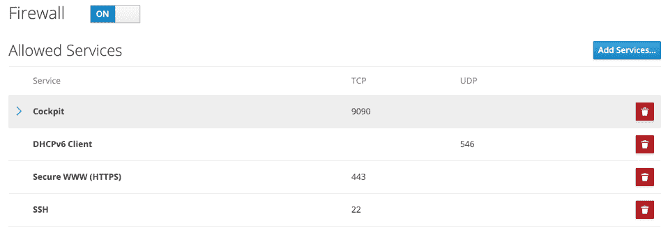

13. 基本的 CentOS 8 防火墙配置与 firewalld

防火墙是保护计算机系统或计算机网络免受外部攻击（通常是通过互联网连接的外部来源）至关重要的组成部分。任何直接连接到互联网的计算机都必须运行防火墙以防止恶意活动。类似地，任何内部网络必须在与外部互联网连接之间安装某种形式的防火墙。

所有 Linux 发行版都提供某种形式的防火墙解决方案。在 CentOS 8 中，防火墙解决方案以一个名为 firewalld 的服务形式提供。

虽然防火墙配置的话题可能比较复杂，但幸运的是 CentOS 8 提供了命令行、基于 Web 的以及图形化工具来简化防火墙配置过程。本章将介绍 firewalld 的基本概念，并涵盖使用操作系统提供的工具配置防火墙的必要步骤。

13.1 firewalld 简介

firewalld 服务使用一套规则来控制进入的网络流量，并定义哪些流量应该被阻止，哪些流量可以通过系统。它建立在一个更复杂的防火墙工具 iptables 之上。

firewalld 系统提供了一种灵活的方式来管理进入流量。例如，可以配置防火墙阻止来自特定外部 IP 地址的流量，或者阻止所有到达特定 TCP/IP 端口的流量。还可以定义规则，将进入的流量转发到不同的系统，或者充当互联网网关来保护网络上的其他计算机。

按照常见的安全实践，默认的 firewalld 安装会配置为阻止所有访问，除了 SSH 远程登录和系统用于获取动态 IP 地址的 DHCP 服务（这两者对系统管理员在完成安装后能够访问系统是至关重要的）。

CentOS 8 上防火墙配置的关键元素包括区域（zones）、接口（interfaces）、服务（services）和端口（ports）。

13.1.1 区域

默认情况下，firewalld 安装时会包含一系列预配置的区域。区域是一组可以随时应用于系统的预配置规则，用于快速实现特定场景下的防火墙配置。例如，block 区域会阻止所有进入流量，而 home 区域则假设系统运行在一个更安全的环境中，因此会施加较少的严格规则，并期望有更高的信任级别。新区域可以添加到系统中，现有区域可以修改以添加或移除规则。区域也可以完全从系统中删除。表 13-1 列出了 CentOS 8 系统默认提供的区域集：

| 区域 | 描述 |
| --- | --- |
| drop | 最安全的区域。仅允许传出连接，所有传入连接都会被丢弃，并且不会向连接的客户端发送任何通知。 |
| block | 类似于丢弃区，不同之处在于，传入连接会被 icmp-host-prohibited 或 icmp6-adm-prohibited 通知拒绝。 |
| public | 当连接到公共网络或互联网，且其他计算机不被认为是可信的时使用。允许选择性地接受传入连接。 |
| external | 当系统充当网络中计算机的互联网网关时，外部区域应用于连接到互联网的接口。本区域与内部区域一起使用，用于实现伪装或网络地址转换（NAT），如本章后续部分所述。允许选择性地接受传入连接。 |
| internal | 与外部区域一起使用，并应用于连接到内部网络的接口。假设内部网络中的计算机是可信的。允许选择性地接受传入连接。 |
| dmz | 当系统运行在隔离区（DMZ）时使用。这些通常是可以公开访问但与内部网络其他部分隔离的计算机。允许选择性地接受传入连接。 |
| work | 当在工作环境中的网络上运行系统，且其他计算机被信任时使用。允许选择性地接受传入连接。 |
| home | 当在家庭网络中运行系统，且其他计算机被信任时使用。允许选择性地接受传入连接。 |
| trusted | 最不安全的区域。所有传入连接都会被接受。 |

表 13-1

13.1.2 接口

任何连接到互联网或网络（或两者）的 CentOS 8 系统都会包含至少一个接口，可能是物理的或虚拟的网络设备。当 firewalld 处于活动状态时，这些接口中的每一个都会分配到一个区域，从而允许为不同的接口分配不同级别的防火墙安全。考虑一台包含两个接口的服务器，一个接口连接到外部互联网，另一个接口连接到内部网络。在这种情况下，面向外部的接口很可能会分配到更严格的外部区域，而内部接口可能会使用内部区域。

13.1.3 服务

TCP/IP 定义了一组在标准端口上进行通信的服务。例如，安全的 HTTPS web 连接使用端口 443，而 SMTP 邮件服务使用端口 25。为了选择性地启用特定服务的传入流量，可以向区域添加 firewalld 规则。例如，home 区域默认不允许传入 HTTPS 连接。可以通过向区域添加规则来启用此流量，从而无需引用特定端口号即可允许传入 HTTPS 连接。

13.1.4 端口

尽管可以在添加 firewalld 规则时引用常见的 TCP/IP 服务，但会出现需要在未分配给服务的特定端口上允许传入连接的情况。这可以通过添加引用特定端口的规则来实现，而不是服务。这种技术在名为 “CentOS 8 Cockpit Web 界面概述” 的章节中使用，当时打开了 9090 端口以允许访问 Cockpit Web 界面。

13.2 检查 firewalld 状态

firewalld 服务在所有 CentOS 8 安装中默认已安装并启用。可以通过以下命令检查服务的状态：

# 第十二章：systemctl status firewalld

firewalld.service - firewalld - 动态防火墙守护进程

已加载：已加载 (/usr/lib/systemd/system/firewalld.service; 启用; 供应商预设：启用)

活动状态：活动（运行中），自 2019-02-14 14:24:31 EST 起；3 天前

文档：man:firewalld(1)

主 PID：816 (firewalld)

任务：2（限制：25026）

内存：30.6M

CGroup: /system.slice/firewalld.service

816 /usr/libexec/platform-python -s /usr/sbin/firewalld --nofork --nopid

如果需要，可以按照以下方式安装 firewalld 服务：

# dnf 安装 firewalld

firewalld 服务默认启用，因此在安装完成后以及每次系统启动时都会自动启动。

13.3 使用 firewall-cmd 配置防火墙规则

firewall-cmd 命令行工具允许查看 firewalld 配置的信息，并从终端窗口中更改区域和规则。

在更改防火墙设置时，重要的是要理解运行时配置和永久配置的概念。默认情况下，任何规则更改都被视为运行时配置更改。这意味着，虽然更改会立即生效，但它们将在系统下次重启或 firewalld 服务重新加载时丢失，例如通过执行以下命令：

# firewall-cmd --reload

要使更改永久生效，必须使用 --permanent 命令行选项。永久更改不会立即生效，直到 firewalld 服务重新加载，但会保持有效，直到手动更改。

13.3.1 确定和更改默认区域

要识别默认区域（换句话说，所有接口将在没有特别选择其他区域时分配到该区域），可以使用 firewall-cmd 工具，如下所示：

# firewall-cmd --get-default-zone

public

要将默认设置更改为其他区域：

# firewall-cmd --set-default-zone=home

成功

13.3.2 显示区域信息

列出系统上所有可用的区域：

# firewall-cmd --get-zones

block dmz drop external home internal libvirt public trusted work

获取当前活动区域的列表，并查看它们分配的接口，如下所示：

# firewall-cmd --get-active-zones

external

网络接口：eth0

internal

网络接口：eth1

可以通过以下方式列出当前为特定区域配置的所有规则：

# firewall-cmd --zone=home --list-all

home (active)

target: default

icmp-block-inversion: no

interfaces: eth0

sources:

services: cockpit dhcpv6-client http mdns samba-client ssh

ports:

protocols:

masquerade: no

forward-ports:

source-ports:

icmp-blocks:

rich rules:

使用以下命令列出当前可用于包含在 firewalld 规则中的服务：

# firewall-cmd --get-services

RH-Satellite-6 amanda-client amanda-k5-client amqp amqps apcupsd audit bacula bacula-client bgp bitcoin bitcoin-rpc bitcoin-testnet bitcoin-testnet-rpc ceph ceph-mon cfengine cockpit ...

要列出当前为某个区域启用的服务：

# firewall-cmd --zone=public --list-services

cockpit dhcpv6-client ssh

可以通过以下方式获取端口规则列表：

# firewall-cmd --zone=public --list-ports

9090/tcp

13.3.3 添加和移除区域服务

要向区域添加服务，在本例中将 HTTPS 添加到公共区域，可使用以下命令：

# firewall-cmd --zone=public --add-service=https

success

默认情况下，这是一个运行时更改，因此添加的规则将在系统重启后丢失。要永久添加服务，以便下次系统重启时生效，请使用 --permanent 标志：

# firewall-cmd --zone=public --permanent --add-service=https

success

要验证某个服务是否已永久添加，确保在请求服务列表时包含 --permanent 标志：

# firewall-cmd --zone=public --permanent --list-services

cockpit dhcpv6-client http https ssh

请注意，作为永久更改，此新规则将直到系统重启或 firewalld 重新加载后才会生效：

# firewall-cmd --reload

使用 --remove-service 选项从区域中移除服务。由于这是一个运行时更改，因此规则将在系统重启后重新应用：

# firewall-cmd --zone=public --remove-service=https

要永久移除服务，请使用 --permanent 标志，并记得在更改需要立即生效时重新加载 firewalld：

# firewall-cmd --zone=public --permanent --remove-service=https

13.3.4 使用基于端口的规则

要启用特定端口，请使用 --add-port 选项。请注意，在手动定义端口时，需要提供端口号和协议（TCP 或 UDP）：

# firewall-cmd --zone=public --permanent --add-port=5000/tcp

也可以在向区域添加规则时指定端口范围：

# firewall-cmd --zone=public --permanent --add-port=5900-5999/udp

13.3.5 创建新区域

可以通过运行以下命令创建一个全新的区域。创建后，可以像管理任何预定义区域一样管理该区域：

# firewall-cmd --permanent --new-zone=myoffice

success

在添加新区域后，需要重新启动 firewalld 才能使区域生效：

# firewall-cmd --reload

success

13.3.6 更改区域/接口分配

如前所述，系统上的每个接口必须分配到一个区域。可以使用 firewall-cmd 工具更改接口的区域分配。在以下示例中，eth0 接口被分配到公共区域：

# firewall-cmd --zone=public --change-interface=eth0

成功

13.3.7 伪装

伪装（Masquerading）在网络管理领域更为人熟知，它也叫做网络地址转换（NAT）。当使用 CentOS 8 系统作为网络内计算机的互联网网关时，伪装允许所有内部系统在通过互联网通信时使用该 CentOS 8 系统的 IP 地址。这有助于隐藏内部系统的 IP 地址，避免恶意外部实体的攻击，并且还避免了为网络上每台计算机分配公共 IP 地址的需要。

使用以下命令检查防火墙上是否已经启用伪装：

# firewall-cmd --zone=external --query-masquerade

使用以下命令启用伪装（如果需要永久更改，记得使用 --permanent 标志）：

firewall-cmd --zone=external --add-masquerade

13.3.8 添加 ICMP 规则

网络控制消息协议（ICMP）用于网络中的客户端系统之间发送信息，如错误消息。它也是 ping 命令的基础，网络管理员和用户都使用该命令来检测特定客户端是否在线。ICMP 类别允许阻止特定的 ICMP 消息类型。例如，管理员可能会选择阻止传入的 ping（回显请求）ICMP 消息，以防止基于 ping 的拒绝服务（DoS）攻击（即服务器被恶意发送大量 ping 消息，导致其无法响应合法请求）。

要查看 firewalld 规则中可包含的 ICMP 类型，请运行以下命令：

# firewall-cmd --get-icmptypes

address-unreachable bad-header beyond-scope communication-prohibited destination-unreachable echo-reply ...

以下命令例如，永久添加一条规则，用于阻止公共区域的回显应答（ping 请求）消息：

# firewall-cmd --zone=public --permanent --add-icmp-block=echo-reply

13.3.9 实现端口转发

端口转发与伪装一起使用，当 CentOS 8 系统作为内部计算机网络的互联网网关时。端口转发允许通过互联网到达防火墙的特定端口的流量被转发到内部网络中的特定系统。这可以通过以下示例来更好地说明。

假设 CentOS 8 系统作为内部计算机网络的防火墙，并且网络中的一台系统被配置为 Web 服务器。假设该 Web 服务器系统的 IP 地址为 192.168.2.20。托管在该系统上的网站的域名记录配置了位于 CentOS 8 防火墙系统后面的公共 IP 地址。当一个 HTTP 网页请求到达端口 80 时，作为防火墙的 CentOS 8 系统需要知道如何处理它。通过配置端口转发，可以将所有 Web 流量定向到托管 Web 服务器的内部系统（在此案例中为 IP 地址 192.168.2.20），可以继续使用端口 80，或将流量重定向到目标服务器的不同端口。实际上，端口转发甚至可以配置为将流量转发到与防火墙相同系统上的不同端口（这种概念称为本地转发）。

要使用端口转发，首先启用伪装，如下所示（此处假设连接到互联网的接口已被分配到外部区域）：

# firewall-cmd --zone=external --add-masquerade

要将端口转发到不同的本地端口，可以使用类似于以下的命令：

# firewall-cmd --zone=external --add-forward-port=port=22:proto=tcp:toport=2750

在上面的例子中，任何到达端口 22 的 TCP 流量都将被转发到本地系统的端口 2750。另一方面，以下命令将本地系统的端口 20 转发到 IP 地址为 192.168.0.19 的系统上的端口 22：

# firewall-cmd --zone=external \

--add-forward-port=port=20:proto=tcp:toport=22:toaddr=192.168.0.19

类似地，以下命令将本地端口 20 转发到 IP 地址为 192.168.0.18 的系统上的端口 2750：

# firewall-cmd --zone=external --add-forward-port=port=20:proto=tcp:toport=2750:toaddr=192.168.0.18

13.4 从 Cockpit 界面管理 firewalld

到目前为止，本章已概述了 firewalld 并探讨了使用 firewall-cmd 命令行工具来管理防火墙区域和接口。虽然 firewall-cmd 提供了最灵活的方式来管理 firewalld 配置，但也可以通过 Cockpit Web 控制台查看和管理默认区域的服务。

要访问 firewalld 设置，请登录到 Cockpit 界面并从导航面板选择“Networking”。在网络页面上，选择防火墙选项，具体如图 13-1 所示：

图 13-1

防火墙页面显示了为默认区域配置的当前服务规则（并允许使用垃圾桶按钮删除服务），可以向区域添加新服务，并可打开或关闭防火墙：

图 13-2

13.5 使用 firewall-config 管理 firewalld

如果你可以访问图形桌面环境，也可以使用 firewall-config 工具来配置防火墙。虽然它默认没有安装，但可以通过以下方式安装 firewall-config：

# dnf install firewall-config

启动时，主 firewall-config 屏幕如 图 13-3 所示：

图 13-3

工具的关键区域可以总结如下：

A - 显示当前所有活动的接口及其分配的区域。要将接口分配到另一个区域，从此面板中选择接口，点击更改区域按钮，并从弹出的对话框中选择所需的区域。

B - 控制工具内显示的信息以及所做的更改是否适用于运行时或永久规则。

C - 系统上配置的区域、服务或 IPSets 的列表。此面板中列出的信息取决于工具栏 F 中所做的选择。从此面板中的列表中选择项目会更新标记为 D 的主面板。

D - 主面板，包含有关工具栏 E 中当前类别选择的信息。在此示例中，面板显示的是公共区域的服务。每个服务旁边的复选框控制该服务是否在防火墙中启用。可以在这些类别面板中添加新规则、配置现有规则或删除规则。

E - 控制面板 D 中显示的内容。从此栏中选择项目会显示所选类别的当前规则。

F - 控制面板 C 中显示的列表。

firewall-config 工具直观易用，允许在可视化环境中执行 firewall-cmd 提供的许多任务。

13.6 小结

精心规划和实施的防火墙是任何安全系统的重要组成部分。以 CentOS 8 为例，firewalld 服务提供了一个既灵活又易于管理的防火墙系统。

firewalld 服务使用区域的概念来将一组防火墙规则进行分组，并包括一套预定义的区域，旨在满足各种防火墙保护要求。这些区域可以修改以添加或删除规则，或者完全创建并配置新的区域。系统中连接到网络或互联网的网络设备被称为接口。每个接口都会被分配到一个区域。与 firewalld 一起工作的主要工具是 firewall-cmd 命令行工具和 firewall-config 图形工具。通过 Cockpit Web 界面，还可以使用最小的防火墙管理选项。
