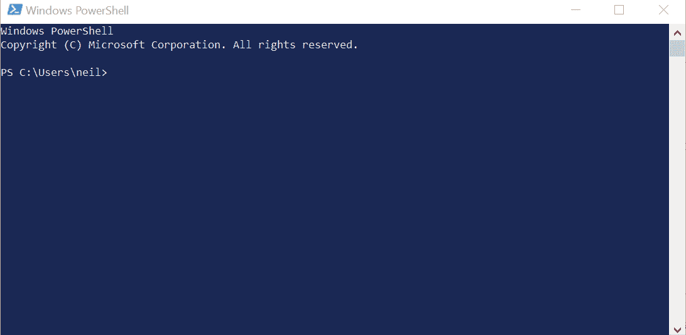
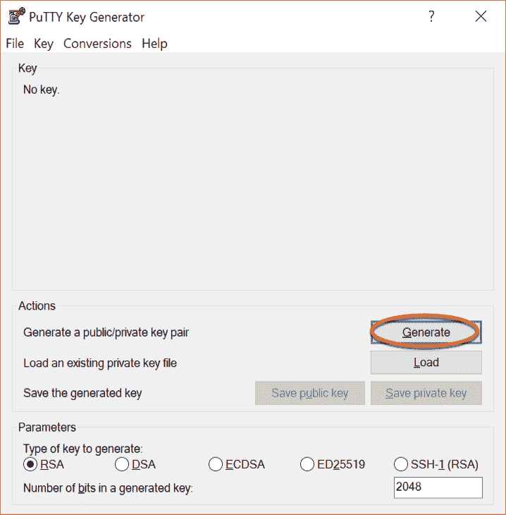
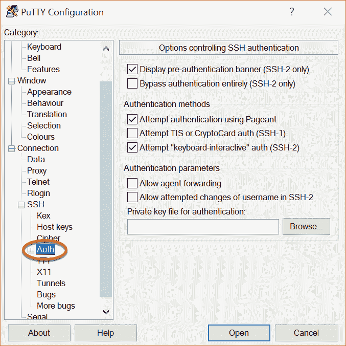
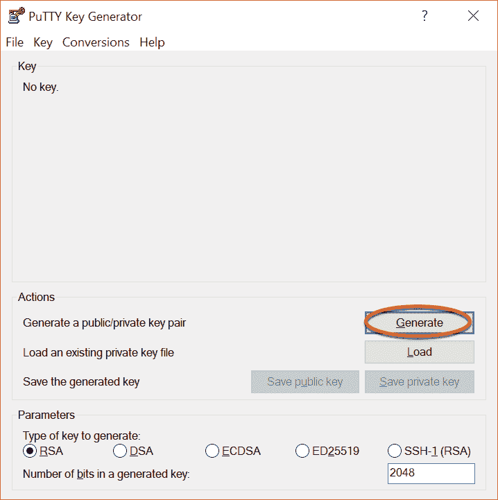
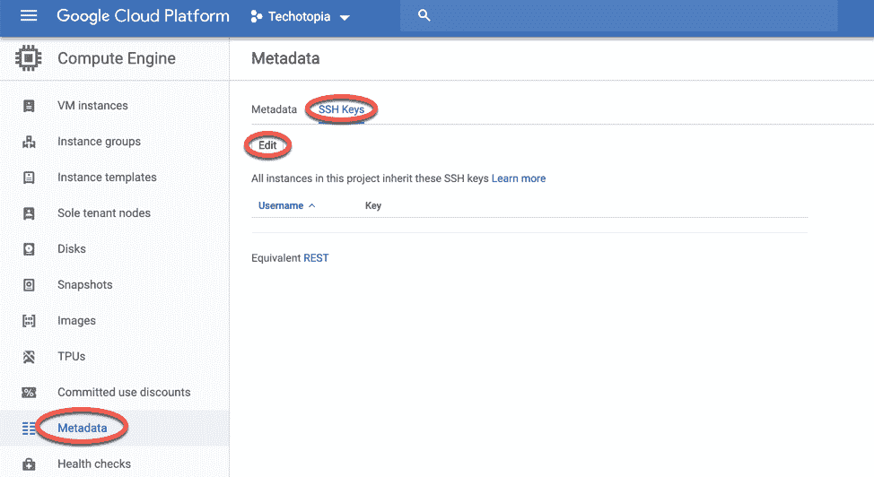
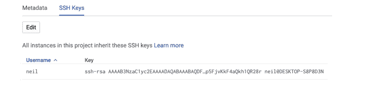

14. 配置 CentOS 8 上的 SSH 密钥身份验证

当 CentOS 8 系统首次安装时，默认配置为允许通过安全外壳（SSH）连接进行远程命令行访问。这为 root 帐户和在安装过程中添加的任何其他用户提供了受密码保护和加密的访问权限。这个安全级别远远不足，应尽早升级为基于 SSH 密钥的身份验证。

本章将概述通过实现基于密钥的 SSH 身份验证来提高 CentOS 8 系统安全性的步骤。

14.1 安全外壳（SSH）概述

SSH 设计用于允许安全的远程访问系统，以便获得 shell 访问权限并传输文件和数据。如在“CentOS 8 使用 VNC 远程桌面访问”中所述，SSH 也可以用来提供一个安全隧道，通过该隧道可以通过网络连接实现对 GNOME 桌面的远程访问。

基本的 SSH 配置由客户端（用于建立连接的计算机）和服务器（运行在要建立连接的系统上）组成。例如，用户可能会使用运行在 Linux、Windows 或 macOS 系统上的 SSH 客户端，连接到运行在 CentOS 8 系统上的 SSH 服务器，从而访问 shell 命令行提示符或执行文件传输。客户端和服务器之间的所有通信，包括输入的访问密码，都会加密，防止外部方截取数据。

基本 SSH 实现的固有弱点在于它完全依赖于分配给系统帐户的密码强度。如果恶意方能够识别某个帐户的密码（无论是通过猜测、欺骗还是暴力破解攻击），系统就会变得脆弱。通过实施基于 SSH 密钥的身份验证，可以解决这个弱点。

14.2 基于 SSH 密钥的身份验证

基于 SSH 密钥的身份验证利用非对称公钥加密为远程系统访问增加了额外的安全层。公钥加密的概念由 Whitfield Diffie 和 Martin Hellman 于 1975 年提出，基于使用一对密钥的概念，其中一个是私钥，另一个是公钥。

在公钥加密系统中，公钥用于加密数据，而只有私钥的拥有者才能解密数据。

在 SSH 密钥身份验证的情况下，私钥由 SSH 客户端所在的主机持有，而相应的公钥则保存在运行 SSH 服务器的系统上。保护私钥非常重要，因为拥有私钥的人可以登录到远程系统。因此，作为额外的保护层，私钥也可以被加密，并通过密码保护，每次建立连接到服务器时都必须输入该密码。

14.3 设置基于密钥的认证

设置基于密钥的 SSH 认证需要四个步骤，概括如下：

1\. 生成公钥和私钥。

2\. 在服务器上安装公钥。

3\. 测试认证。

4\. 禁用服务器上的基于密码的认证。

本章剩余部分将详细描述这些步骤，适用于 Linux、macOS 和 Windows 客户端操作系统。

14.4 Linux 和 macOS 客户端的 SSH 密钥认证

设置基于 SSH 密钥的认证的第一步是在客户端系统上生成密钥对。如果客户端系统运行的是 Linux 或 macOS，可以使用 ssh-keygen 工具来完成：

# 第十三章：ssh-keygen

这将生成类似如下的输出：

生成公钥/私钥对。

输入保存密钥的文件 (/home/<用户名>/.ssh/id_rsa)：

按 Enter 键接受密钥文件的默认位置。这将把两个文件放置在当前用户主目录下的 .ssh 子目录中。私钥将存储在名为 id_rsa 的文件中，而公钥将存储在名为 id_rsa.pub 的文件中。

接下来，ssh-keygen 将提示输入密码短语来保护私钥。如果提供了密码短语，私钥将在本地磁盘上加密，并且在访问远程系统时需要该密码短语。为了更好的安全性，建议使用密码短语。

输入密码短语（如不设置密码短语则留空）：

最后，ssh-keygen 工具将生成以下输出，表示密钥已生成：

您的身份信息已保存在 /home/neil/.ssh/id_rsa 中。

您的公钥已保存在 /home/neil/.ssh/id_rsa.pub 中。

密钥指纹是：

SHA256:FOLGWEEGFIjWnCT5wtTOv5VK4hdimzWghZizUEMYbfo <用户名>@<主机名>

密钥的随机艺术图像是：

+---[RSA 2048]----+

|.BB+=+*.. |

|o+B= * . . |

|===.. + . |

|*+ * . . |

|.++ o S |

|..E+ * o |

| o B * |
| --- |
| + + |
| . |

+----[SHA256]-----+

下一步是将公钥安装到远程服务器系统中。这可以通过使用 ssh-copy-id 工具实现，方法如下：

$ ssh-copy-id username@remote_hostname

例如：

$ ssh-copy-id neil@192.168.1.100

/usr/bin/ssh-copy-id: 信息：待安装的密钥来源："/home/neil/.ssh/id_rsa.pub"

/usr/bin/ssh-copy-id: 信息：正在尝试使用新密钥登录，以过滤掉已安装的密钥

/usr/bin/ssh-copy-id: 信息：仍需安装 1 个密钥 —— 如果现在提示您，它是为了安装新密钥

neil@192.168.1.100 的密码：

添加的密钥数量：1

现在尝试使用以下命令登录机器：“ssh ‘neil@192.168.1.100’”

并检查确保只有您希望添加的密钥被添加。

安装密钥后，使用 ssh 客户端进行远程登录，测试认证是否正常工作：

$ ssh -l <用户名> <主机名>

如果私钥经过加密并且有密码保护，请在提示时输入密码短语以完成身份验证并建立对 CentOS 8 系统的远程访问：

输入密钥‘/home/neil/.ssh/id_rsa’的密码短语：

上次登录：2019 年 2 月 21 日 13:41:23，从 192.168.1.101 登录

[neil@demosystem02 ~]$

对服务器上需要远程访问的其他账户重复这些步骤。如果其他客户端系统也需要访问，只需将 id_rsa 私钥文件复制到其他系统的主文件夹中的 .ssh 子目录下即可。

如当前配置所示，仍可以使用较不安全的密码验证方式访问远程系统。确认密钥认证工作正常后，登录远程系统，编辑 /etc/ssh/ssh_config 文件并将 PasswordAuthentication 设置为 no：

PasswordAuthentication no

保存文件并重启 sshd 服务以实施更改：

# systemctl restart sshd.service

从此以后，只有通过 SSH 密钥认证才能远程访问该系统。

14.5 管理多个密钥

客户端系统上有多个私钥的情况并不罕见，每个私钥都能提供对不同服务器的访问权限。在建立连接时，选择特定密钥有多种方式。例如，可以在启动 ssh 客户端时指定要使用的私钥文件，如下所示：

$ ssh -l neilsmyth -i ~/.ssh/id_work 35.194.18.119

另外，也可以使用 SSH 客户端的用户配置文件，将密钥文件与服务器关联。该配置文件名为 config，必须位于用户主目录下的 .ssh 目录中，可以用来配置包括私钥文件、连接时使用的默认端口、默认用户名以及用于引用服务器的简短别名等多种选项。以下示例配置文件为两台服务器定义了不同的密钥文件，并允许通过昵称 home 和 work 来引用它们。在 work 系统的配置中，文件还指定了身份验证时使用的用户名：

Host work

HostName 35.194.18.119

IdentityFile ~/.ssh/id_work

User neilsmyth

Host home

HostName 192.168.0.21

IdentityFile ~/.ssh/id_home

在设置配置文件之前，用户曾使用以下命令连接到 work 系统：

$ ssh -l neilsmyth -i ~/.ssh/id_work 35.194.18.119

现在，可以通过以下方式简化命令：

$ ssh work

可以通过运行以下命令来查看完整的配置文件选项：

$ man ssh_config

14.6 从 Windows 10 客户端使用基于 SSH 的认证

最新发布的 Windows 10 版本包括 OpenSSH 实现的子集，该实现被大多数 Linux 和 macOS 系统使用，作为 Windows PowerShell 的一部分。这使得可以使用类似于上述 Linux 和 macOS 步骤的方法，从 Windows 10 客户端设置 SSH 密钥认证。

在 Windows 10 系统上打开 Windows PowerShell，按下 Win+X 键组合并从菜单中选择，或者从开始菜单中找到并选择它。运行后，PowerShell 窗口将如 图 14-1 所示：

图 14-1

如果你已经有来自其他客户端系统的私钥，只需将 `id_rsa` 文件复制到 Windows 10 系统中名为 `.ssh` 的文件夹中。一旦文件放置好，可以在 PowerShell 窗口中按如下方式测试认证：

$ ssh -l <用户名>@<主机名>

例如：

PS C:\Users\neil> ssh -l neil 192.168.1.101

输入密钥 'C:\Users\neil/.ssh/id_rsa' 的密码短语：

提示时输入密码短语，完成认证过程。

如果尚未存在私钥，请在 PowerShell 窗口中使用 `ssh-keygen` 工具生成新的私钥和公钥对，方法与 Linux 和 macOS 中的步骤相同。一旦生成了密钥，密钥将再次位于当前用户的主文件夹中的 `.ssh` 目录，公钥文件 `id_rsa.pub` 需要安装在远程 CentOS 8 系统上。不幸的是，Windows PowerShell 并不包括 `ssh-copy-id` 工具，因此该任务需要手动执行。

在 PowerShell 窗口中，进入 `.ssh` 子目录并显示公钥文件 `id_rsa.pub` 的内容：

PS C:\Users\neil> cd .ssh

PS C:\Users\neil\.ssh> type id_rsa.pub

ssh-rsa AAAAB3NzaC1yc2EAAAADAQABAAABAQDFgx1vzu59lll6/uQw7FbmKVsQ3fzLz9MW1fgo4sdsxXp81wCHNAlqcjx1Pgr9BJPXWUMInQOi7BQ5I+vc2xQ2AS0kMq3ZH9ybWuQe/U2GjueXZd0FKrEXrT55wM36Rm6Ii3roUCoGCzGR8mn95JvRB3VtCyDdzTWSi8JBpK5gV5oOxNTNPsewlLzouBlCT1qW3CKwEiIwu8S9MTL7m3nrcaNeLewTTHevvHw4QDwzFQ+B0PDg96fzsYoTXVhzyHSWyo6H0gqrft7aK+gILBtEIhWTkSVEMAzy1piKtCr1IYTmVK6engv0aoGtMUq6FnOeGp5FjvKkF4aQkh1QR28r neil@DESKTOP-S8P8D3N

高亮显示文件内容并使用 Ctrl-C 快捷键复制它。

在 PowerShell 窗口中，使用密码验证登录远程系统：

PS C:\Users\neil\.ssh> ssh -l <用户名> <主机名>

登录后，检查 `.ssh` 子目录是否存在。如果不存在，可以按如下方式创建：

$ mkdir .ssh

进入 `.ssh` 目录并检查是否已存在名为 `authorized_keys` 的文件。如果没有，创建该文件并将 Windows 10 系统中的公钥文件内容粘贴到其中。

如果 `authorized_keys` 文件已经存在，它很可能已经包含其他密钥。如果是这种情况，编辑该文件并将新公钥粘贴到文件末尾。例如，以下文件包含两个密钥：

ssh-rsa AAAAB3NzaC1yc2EAAAADAQABAAABAQCzRWH27Xs8ZA5rIbZXKgxFY5XXauMv+6F5PljBLJ6j+9nkmykVe3GjZTp3oD+KMRbT2kTEPbDpFD67DNL0eiX2ZuEEiYsxZfGCRCPBGYmQttFRHEAFnlS1Jx/G4W5UNKvhAXWyMwDEKiWvqTVy6syB2Ritoak+D/Sc8nJflQ6dtw0jBs+S7Aim8TPfgpi4p5XJGruXNRScamk68NgnPfTL3vT726EuABCk6C934KARd+/AXa8/5rNOh4ETPstjBRfFJ0tpmsWWhhNEnwJRqS2LD0ug7E3yFI2qsNKGEzvAYUC8Up45MRP7liR3aMlCBil1tsy9R+IB7oMEycZAe/qj neil@localhost.localdomain

ssh-rsa AAAAB3NzaC1yc2EAAAADAQABAAABAQDFgx1vzu59lll6/uQw7FbmKVsQ3fzLz9MW1fgo4sdsxXp81wCHNAlqcjx1Pgr9BJPXWUMInQOi7BQ5I+vc2xQ2AS0kMq3ZH9ybWuQe/U2GjueXZd0FKrEXrT55wM36Rm6Ii3roUCoGCzGR8mn95JvRB3VtCyDdzTWSi8JBpK5gV5oOxNTNPsewlLzouBlCT1qW3CKwEiIwu8S9MTL7m3nrcaNeLewTTHevvHw4QDwzFQ+B0PDg96fzsYoTXVhzyHSWyo6H0gqrft7aK+gILBtEIhWTkSVEMAzy1piKtCr1IYTmVK6engv0aoGtMUq6FnOeGp5FjvKkF4aQkh1QR28r neil@DESKTOP-S8P8D3N

一旦公钥安装到服务器上，通过在 Windows 10 PowerShell 窗口中登录到服务器来测试认证，例如：

PS C:\Users\neil\.ssh> ssh -l neil 192.168.1.100

输入密钥的密码短语 'C:\Users\neil/.ssh/id_rsa'：

一旦为所有账户设置并验证了基于密钥的身份验证，就按照上一节末尾的说明，在 CentOS 8 系统上禁用密码身份验证。

14.7 使用 PuTTY 进行 SSH 密钥认证

对于没有 OpenSSH 的 Windows 系统，或者作为使用 PowerShell 的更灵活替代工具，PuTTY 是一个广泛使用的替代工具。使用 PuTTY 的第一步是下载并安装它，安装在需要 SSH 客户端的任何 Windows 系统上。PuTTY 是一个免费的工具，可以通过以下链接进行下载：

[`www.chiark.greenend.org.uk/~sgtatham/putty/latest.html`](https://www.chiark.greenend.org.uk/~sgtatham/putty/latest.html)

下载与您的 Windows 系统匹配的 Windows 安装程序（提供 32 位和 64 位版本），然后执行安装程序完成安装。

如果在另一台系统上已经存在私钥，请在当前用户的主文件夹中创建 .ssh 文件夹，并将私钥 id_rsa 复制到其中。

接下来，需要使用 PuTTYgen 工具将私钥文件转换为 PuTTY 私钥格式文件。找到 Windows 开始菜单中的该工具并启动：

图 14-2

启动后，点击位于操作区的 Load 按钮，导航到之前复制到 .ssh 文件夹中的私钥文件（注意，可能需要将文件类型过滤器更改为“所有文件 (*.*)”才能看到密钥文件）。找到文件后，选择该文件并加载到 PuTTYgen 中。当系统提示时，输入最初用来加密文件的密码短语。一旦私钥导入成功，点击 Save Private Key 按钮将其保存为 PuTTY 密钥文件。为了一致性，建议将密钥文件保存到 .ssh 文件夹中，并给它起一个不同的名称，以便与原始密钥文件区分开来。

从开始菜单启动 PuTTY，在主屏幕上输入远程服务器的 IP 地址或主机名，然后选择左侧面板中的连接 -> SSH -> 认证类别，如图 14-3 所示：

图 14-3

点击身份验证字段旁的浏览按钮，导航并选择先前保存的 PuTTY 私钥文件。可选地，滚动到左侧面板顶部，选择会话条目，并在“保存的会话”字段中输入会话名称，然后点击保存按钮。这将保存会话配置，以便将来使用时无需重新输入设置。

最后，点击打开按钮以建立与远程服务器的连接，在提示时输入用户名和密码短语以完成身份验证。

14.8 使用 PuTTYgen 生成私钥

前一节探讨了在使用 PuTTY 时如何使用现有的私钥和公钥。如果密钥尚不存在，可以使用随主 PuTTY 安装程序一起提供的 PuTTYgen 工具创建它们。

要创建新的密钥，请启动 PuttyGen 并点击图 14-4 中高亮显示的生成按钮：

图 14-4

按照提示移动鼠标指针以生成随机数据，然后输入一个可选的密码短语来加密私钥。密钥生成后，使用保存公钥和保存私钥按钮将文件保存到合适的位置。私钥可以像上一节中所述一样与 PuTTY 一起使用。要将公钥安装到远程服务器上，请按照前一节中有关在 Windows 10 上通过 PowerShell 使用 SSH 的步骤操作。

14.9 为 Google Cloud 实例安装公钥

如果您的 CentOS 8 系统托管在 Google Cloud 上，例如作为计算引擎实例，有多种方法可以使用基于密钥的身份验证方式通过 SSH 访问服务器。最直接的方法可能是将您的公钥添加到 Google Cloud 账户的元数据中。这样，公钥就可以用于您在 Google Cloud 中创建的所有虚拟机实例。要添加公钥，请登录 Google Cloud Platform 控制台，从左侧导航面板中选择元数据选项，如图 14-5 所示，然后选择 SSH 密钥标签：

图 14-5

在 SSH 密钥屏幕上，点击编辑按钮（如图 14-5 中高亮显示的那样）以编辑密钥列表。向下滚动至当前列表的底部，点击+ 添加项目按钮。将会出现一个新的字段，你需要将整个公钥粘贴进去，该公钥应当与你 id_rsa.pub 文件中的内容一致。输入密钥后，点击保存按钮以添加密钥。

公钥现在将出现在 SSH 密钥列表中。请注意，密钥条目中还包含了登录任何 Google Cloud 实例时必须使用的用户名：

图 14-6

在元数据中添加了公钥后，应该能够从任何安装了对应私钥且用户有账户的客户端访问任何虚拟机实例。实际上，Google Cloud 所做的工作就是将公钥添加到用户在任何虚拟机上账户所在的.home 目录中的.ssh/authorized_keys 文件中。

14.10 小结

任何远程访问 CentOS 8 系统的方式都必须确保高度的安全性。默认情况下，CentOS 8 系统允许使用基于密码的认证进行 SSH 访问，这使得系统容易受到任何能够猜测密码或通过其他方式获取密码的人的攻击。因此，建议使用基于密钥的认证来保护系统访问。基于密钥的认证使用公钥加密的概念，涉及公钥和私钥。当实现时，用户只能连接到服务器，如果他们使用的客户端拥有与服务器上的公钥匹配的私钥。作为额外的安全措施，私钥也可以被加密并设置密码保护。一旦实现了基于密钥的加密，服务器系统将配置为禁用对不太安全的基于密码的认证的支持。

本章概述了基于 SSH 密钥的认证，并概述了在 macOS、Linux 和 Windows 上生成密钥和配置客户端的步骤，此外还包括在 CentOS 8 服务器上安装和管理公钥的步骤。
