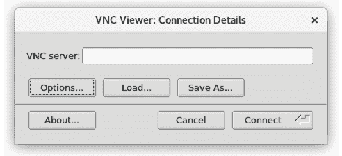

15\. CentOS 8 使用 VNC 进行远程桌面访问

CentOS 8 可以配置为通过网络或互联网连接提供对图形桌面环境的远程访问。尽管默认情况下未启用，但相对简单即可在任何网络或互联网系统上显示和访问 CentOS 8 桌面。无论该系统运行的是 Linux、Windows 还是 macOS，都可以实现这一点。事实上，甚至有适用于 Android 和 iOS 的应用程序，允许你从几乎任何有数据信号的地方访问 CentOS 8 桌面。

远程桌面访问在多种情况下非常有用。例如，它允许你或其他人从另一台计算机系统查看并互动你的 CentOS 8 桌面环境，无论是在同一网络中还是通过互联网。这在你外出旅行等离开办公桌时需要使用计算机时特别有用。如果同事或 IT 支持人员需要访问你的桌面以解决问题时，这也非常有帮助。

在 CentOS 8 系统运行在基于云的服务器上时，它还允许作为使用命令行提示符或 Cockpit Web 控制台执行管理任务的替代方案，访问桌面环境。

CentOS 8 的远程桌面功能基于一种名为虚拟网络计算（VNC）的技术，本章将介绍配置和使用 CentOS 8 远程桌面的关键方面。

15.1 安全和不安全的远程桌面访问

在本章中，我们将讨论安全和不安全的远程桌面访问方法。假设你是在一个安全的内部网络环境中从一台系统访问另一台系统，那么通常使用不安全的访问方法是安全的。另一方面，如果你计划通过任何公共网络远程访问桌面，则必须使用安全的访问方法，以避免系统和数据受到威胁。

15.2 安装 GNOME 桌面环境

当然，只有在桌面环境已经安装的情况下，才能访问桌面环境。例如，如果系统最初配置为服务器，则不太可能安装桌面软件包。安装运行 GNOME 桌面所需的软件包最简单的方法是执行组安装。安装一组软件包以启用特定功能的关键是知道该组的名称。在撰写时，用于在 CentOS 8 上安装桌面环境的组名为“Workstation”。由于组名在不同的 CentOS 版本之间可能会发生变化，因此知道可以使用 dnf 工具获得已安装或可安装的组列表是非常有用的，方法如下：

# 第十四章：dnf grouplist

可用的环境组：

工作站

最小化安装

自定义操作系统

已安装的环境组：

带图形界面的服务器

已安装的组：

容器管理

可用组：

.NET Core 开发

RPM 开发工具

智能卡支持

科学支持

安全工具

开发工具

系统工具

无头管理

网络服务器

传统 UNIX 兼容性

图形管理工具

在上面的示例中，列出了工作站环境组作为可用（因此尚未安装）。要在安装之前了解有关组的更多信息，请使用以下命令：

# dnf groupinfo 工作站

环境组：工作站

描述：工作站是一个用户友好的桌面系统，适用于笔记本电脑和台式机。

强制性组：

常见的 NetworkManager 子模块

核心

字体

GNOME

客户桌面代理

网络浏览器

多媒体

标准

工作站产品核心

base-x

确认这是正确的组后，可以按以下方式进行安装：

# dnf groupinstall 工作站

安装后，如果系统已添加显示器，可以使用以下命令启动桌面：

$ startx

另一方面，如果系统是没有直接连接显示器的服务器，则唯一的方式是配置系统的 VNC 支持，以便运行和访问桌面。

15.3 在 CentOS 8 上安装 VNC

访问远程桌面需要在远程系统上安装 VNC 服务器，在建立访问的系统上安装 VNC 查看器，并可选地使用安全的 SSH 连接。虽然有多种 VNC 服务器和查看器实现，但 CentOS 标准化使用 TigerVNC，它提供了针对基于 Linux 的操作系统的服务器和查看器组件。非 Linux 平台的 VNC 查看器客户端包括 RealVNC 和 TightVNC。

在 CentOS 8 上安装 TigerVNC 服务器软件包，只需运行以下命令：

# dnf install tigervnc-server

如果需要，可以按照以下方式安装 TigerVNC 查看器：

# dnf install tigervnc

安装完服务器后，系统需要配置以运行一个或多个 VNC 服务，并在防火墙上打开适当的端口。

15.4 配置 VNC 服务器

安装了 VNC 服务器软件包后，下一步是配置服务器。第一步是为将访问远程桌面环境的用户指定一个密码。以 root 用户身份登录后，执行以下命令（假设用户名为 demo）：

# su - demo

[demo@demoserver ~]$ vncpasswd

密码：

验证：

您是否希望输入仅查看密码（y/n）？ n

不使用仅查看密码

[demo@demoserver ~]$ exit

#

接下来，需要在 /etc/systemd/system 目录中创建一个名为 vncserver@.service 的 VNC 服务器配置文件。该文件的内容应如下所示，其中所有的 <USER> 替换为设置 VNC 密码时引用的用户名：

[单元]

说明=远程桌面服务（VNC）

After=syslog.target network.target

[服务]

类型=forking

工作目录=/home/<USER>

用户=<USER>

组=<USER>

ExecStartPre=/bin/sh -c '/usr/bin/vncserver -kill %i > /dev/null 2>&1 || :'

ExecStart=/usr/bin/vncserver -autokill %i

ExecStop=/usr/bin/vncserver -kill %i

Restart=on-success

RestartSec=15

[Install]

WantedBy=multi-user.target

接下来，需要配置防火墙以提供外部访问权限，以便远程 VNC 查看器实例访问 VNC 服务器，例如：

# firewall-cmd --permanent --zone=public --add-port=5901/tcp

# firewall-cmd --reload

创建好服务配置文件后，需要按照以下步骤启用并启动服务：

# systemctl daemon-reload

# systemctl start vncserver@:1.service

# systemctl enable vncserver@:1.service

请注意，`:1`包含在服务名称中，表示这是 VNC 服务器显示器号 1 的服务。它与先前在防火墙中打开的端口 5901 相匹配。

检查服务是否已成功启动，方法如下：

# systemctl status vncserver@:1.service

如果服务启动失败，运行以下命令检查错误信息：

# journalctl -xe

重新启动系统后也可以再试。如果服务继续失败，可以通过以指定用户身份登录并运行以下命令手动启动 VNC 服务器：

$ vncserver :1

15.5 连接到 VNC 服务器

VNC 查看器有多个操作系统的实现版本，通过快速的互联网搜索，很可能会找到许多关于如何在所选平台上获取和安装该工具的链接。

从已安装 VNC 查看器（如 TigerVNC）的 Linux 系统桌面，可以通过终端窗口按如下方式建立远程桌面连接：

$ vncviewer <hostname>:<display number>

在上面的示例中，<hostname>是远程系统的主机名或 IP 地址，<display number>是 VNC 服务器桌面的显示号，例如：

$ vncviewer 192.168.1.115:1

或者，运行命令时不带任何选项，以便提示输入远程服务器的详细信息：

图 15-1

在 VNC 服务器字段中输入主机名或 IP 地址，然后是显示号（例如 192.168.1.115:1），并点击连接按钮。查看器将提示输入用户的 VNC 密码以完成连接，此时将出现一个新窗口，其中显示远程桌面。

本节假设远程桌面是从 Linux 或 UNIX 系统访问的，相同的步骤适用于大多数其他操作系统。

使用本节中的步骤连接到远程 VNC 服务器会导致客户端与服务器之间建立一个不安全、未加密的连接。这意味着远程会话期间传输的数据容易被拦截。要建立一个安全且加密的连接，需要额外的几个步骤。

15.6 建立安全的远程桌面会话

到目前为止，我们在本章中探索的远程桌面配置被认为是不安全的，因为没有使用加密。当远程连接仅限于防火墙保护的内部网络时，这种配置是可以接受的。然而，当需要通过互联网连接进行远程会话时，则需要更安全的选项。这可以通过将远程桌面通过安全外壳（SSH）连接进行隧道传输来实现。本节将介绍如何在 Linux、UNIX 和 macOS 客户端系统上进行此配置。

SSH 服务器通常在 CentOS 8 系统上默认安装并启用。如果你的系统没有此配置，请参考标题为 “在 CentOS 8 上配置基于 SSH 密钥的身份验证” 的章节。

假设 SSH 服务器已安装并处于活动状态，现在是时候转到另一台系统。在另一台系统上，使用以下命令登录远程系统，这将建立两台系统之间的安全隧道：

$ ssh -l <username> -L 5901:localhost:5901 <remotehost>

在上述示例中，<username> 指代已经配置了 VNC 访问权限的远程系统上的用户帐户，而 <remotehost> 是远程系统的主机名或 IP 地址，例如：

$ ssh -l neilsmyth -L 5901:localhost:5901 192.168.1.115

当系统提示时，使用帐户密码登录。安全连接建立后，是时候启动 vncviewer 以使其使用安全隧道。保持另一终端窗口中的 SSH 会话运行，启动另一个终端并输入以下命令：

$ vncviewer localhost:5901

如果需要密码，vncviewer 会提示输入密码，然后启动 VNC 查看器，提供对桌面环境的安全访问。

尽管连接现在已加密且安全，但 VNC 查看器仍可能报告连接不安全。例如，图 15-2 显示了在 macOS 系统上运行的 RealVNC 查看器所显示的警告对话框：

图 15-2

不幸的是，尽管连接现在已经安全，但 VNC 查看器软件无法识别这一点，因此继续发出警告。请放心，只要 SSH 隧道正在使用中，连接确实是安全的。

在上述示例中，我们让 SSH 隧道会话在终端窗口中运行。如果你希望将会话在后台运行，可以在启动连接时使用 –f 和 –N 标志：

$ ssh -l <username> -f -N -L 5901:localhost:5901 <remotehost>

上述命令将提示输入远程服务器的密码，然后在后台建立连接，使终端窗口可以用于其他任务。

如果您是从防火墙外部连接远程桌面，请记住，SSH 连接的 IP 地址将是您的 ISP 或云托管提供商提供的外部 IP 地址，而不是远程系统的局域网 IP 地址（因为该 IP 地址对于防火墙外部的人不可见）。您还需要配置防火墙，将端口 22（用于 SSH 连接）转发到运行桌面系统的 IP 地址。无需转发端口 5900。不同防火墙的端口转发步骤不同，因此请参阅您防火墙、路由器或无线基站的文档，以了解适用于您配置的详细信息。

15.7 在 Windows 上使用 PuTTY 建立安全隧道

从 Windows 系统到 CentOS 8 服务器建立安全桌面会话的方法类似。假设你已经安装了一个 VNC 客户端，如 TightVNC，那么唯一剩下的要求是一个 Windows SSH 客户端（此处为 PuTTY）。

下载并安装 PuTTY 后，第一步是建立 Windows 系统与远程 CentOS 8 系统之间的安全连接，并配置适当的隧道。启动 PuTTY 后，将显示以下界面：

图 15-3

输入远程主机的 IP 地址或主机名（如果您是从防火墙外部连接，请输入网关的外部 IP 地址）。下一步是设置隧道。在对话框左侧的类别树中，点击 SSH 旁边的 +，然后点击 Tunnels。屏幕应随后显示如下：

图 15-4

在源端口字段中输入 5901，将目标设置为 localhost:5901，并点击 Add 按钮。最后，通过点击 Session 类别返回主界面。在 Saved Sessions 文本框中输入会话名称并点击 Save。点击 Open 以建立连接。一个终端窗口将会出现，并显示远程系统的登录提示。输入相应的用户名和密码凭证。

SSH 连接已建立。启动 TightVNC 查看器，输入 localhost:5901 到 VNC Server 文本框，并点击 Connect。查看器将建立连接，提示输入密码，然后显示桌面。现在，您通过安全的 SSH 隧道连接从 Windows 访问 Linux 系统的远程桌面。

15.8 关闭桌面会话

若要关闭 VNC Server 托管的桌面会话，使用 --kill 命令行选项，并指定要终止的桌面编号。例如，要关闭桌面 :1：

# vncserver –kill :1

15.9 VNC 连接故障排除

在后台发生如此多的事情时，VNC 有时会显得不透明，特别是在出现问题时，服务器无法启动，或者尝试远程连接时出现错误信息。然而，有许多技巧可以帮助追踪并解决 VNC 问题：

如果 VNC 服务无法启动，请检查该服务的 systemctl 状态并查找错误信息：

# systemctl status vncserver@:1.service

若要获得更详细的信息，请通过运行以下命令检查 systemd 日志：

# journalctl -xe

额外的信息可能可以在以下位置的日志文件中找到：

/home/<用户名>/.vnc/<主机名>.<域名>:<显示号>.log

例如：

/home/neilsmyth/.vnc/server01.localdomain:1.log

如果 systemd 的 VNC 服务仍无法启动 VNC 服务器，请尝试使用以下命令手动启动：

# vncserver :<显示号>

例如：

# vncserver :1

检查输出和日志文件中是否有任何可能帮助识别问题的错误。如果服务器成功启动，请尝试使用 VNC 查看器再次连接。

如果 VNC 服务器似乎正在运行，但从查看器连接失败，可能值得检查是否已打开正确的防火墙端口。首先，通过以下方式识别默认区域：

# firewall-cmd --get-default-zone

public

在获取到默认区域后，检查必要的端口是否已打开：

# firewall-cmd --permanent --zone=public --list-ports

5901/tcp 5900/tcp

如果 VNC 使用的端口未打开，请按以下方式添加端口：

# firewall-cmd --permanent --zone=public --add-port=<端口号>/tcp

15.10 总结

可以通过使用虚拟网络计算（VNC）来启用对 CentOS 8 系统的 GNOME 桌面环境的远程访问。VNC 包括在远程服务器上运行的 VNC 服务器和在本地主机上运行的相应客户端，允许远程访问服务器上运行的多个桌面实例。

当 VNC 连接通过公共连接使用时，建议使用 SSH 隧道来确保客户端和服务器之间的通信是加密且安全的。
