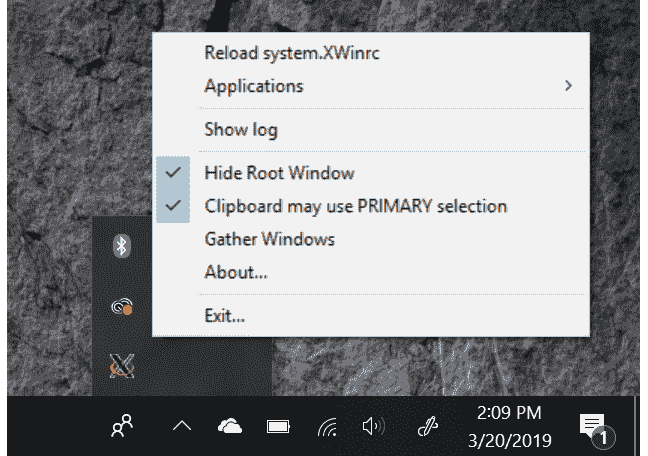

16\. 远程显示 CentOS 8 应用程序（X11 转发）

在前一章节中，我们讨论了如何在远程计算机上显示整个 CentOS 8 桌面。如果你确实需要远程显示整个桌面，这个方法效果很好，但如果你只想显示单个应用程序，这可能就显得有些过于复杂了。因此，在这一章中，我们将探讨如何在远程系统上显示单个应用程序。

16.1 远程显示 CentOS 8 应用程序的要求

为了在一台 CentOS 8 系统上运行应用程序并将其显示在另一台系统上，必须满足一些先决条件。首先，应用程序将要显示的系统必须运行 X 服务器。如果该系统是运行桌面环境的 Linux 或 UNIX 系统，则没有问题。但是，如果该系统运行的是 Windows 或 macOS，则必须先在其上安装 X 服务器，才能从远程系统显示应用程序。有许多商业和免费的 Windows 基础 X 服务器可供选择，网络搜索应该可以提供一些选项。

其次，运行应用程序的系统（与显示应用程序的系统不同）必须配置为允许 SSH 访问。在 CentOS 8 系统上配置 SSH 的详细信息可以在名为“在 CentOS 8 上配置基于 SSH 密钥的身份验证”的章节中找到。该系统还必须运行来自 X.org 的 X Window 系统，而不是 Wayland。要查找正在使用的系统，请打开一个终端窗口并运行以下命令：

# echo $XDG_SESSION_TYPE

x11

如果上述命令输出“wayland”而不是“x11”，则编辑 /etc/gdm/custom.conf 文件并取消注释 WaylandEnable 行，如下所示，并重新启动系统：

# 取消注释以下行以强制登录屏幕使用 Xorg

WaylandEnable=false

最后，必须配置 SSH 以允许 X11 转发。这可以通过在要进行转发的系统的 SSH 配置中添加以下指令来实现。在 CentOS 8 上，/etc/ssh_config 文件默认包含一条指令，用于包含 /etc/ssh/ssh_config.d 目录中所有的配置文件：

Include /etc/ssh/ssh_config.d/*.conf

在新安装的系统中，/etc/ssh/ssh_config.d 目录中唯一的文件是名为 05-redhat.conf 的文件。编辑该文件并添加一行以启用 X11 转发，如下所示：

.

.

Host *

GSSAPIAuthentication yes

X11Forwarding yes

.

.

修改后，保存文件并重新启动 SSH 服务：

# systemctl restart sshd

一旦满足上述要求，就应该能够远程显示基于 X 的桌面应用程序。

16.2 远程显示 CentOS 8 应用程序

远程显示应用程序的第一步是转到要显示应用程序的系统。在该系统上，建立到远程系统的 SSH 连接，以便获取命令提示符。这可以通过使用 ssh 命令来实现。在使用 ssh 命令时，我们需要使用 -X 标志，告诉它我们打算通过连接隧道传输 X11 流量：

$ ssh -X user@hostname

在上述示例中，user 是登录远程系统时使用的用户名，hostname 是远程系统的主机名或 IP 地址。在登录提示符下输入密码，登录后运行以下命令查看 DISPLAY 设置：

$ echo $DISPLAY

执行该命令时，应该输出类似如下的内容：

localhost:10.0

要显示一个应用程序，只需从命令提示符运行它。例如：

$ gedit

执行上述命令时，它应该在远程系统上运行 gedit 工具，但在本地系统上显示输出。

16.3 可信 X11 转发

如果远程系统上的 /etc/ssh/ssh_config.d/05-redhat.conf 文件包含以下行，那么就可以使用可信的 X11 转发：

ForwardX11Trusted yes

可信的 X11 转发比不可信的转发稍微快一点，但由于不涉及 X11 安全控制，它的安全性较低。使用可信 X11 转发时需要使用 -Y 标志：

$ ssh -Y user@hostname

16.4 压缩 X11 转发

在使用较慢的连接时，可以使用 -C 标志压缩 X11 数据以提高性能：

$ ssh -X -C user@hostname

16.5 在 Windows 上显示远程 CentOS 8 应用程序

要在 Windows 上显示基于 CentOS 8 的应用程序，需要在 Windows 系统上安装 SSH 客户端和 X 服务器。本书前面的“在 CentOS 8 上配置基于 SSH 的认证”章节已介绍了如何在 Windows 上安装和使用 PuTTY 客户端。如果您尚未在 Windows 系统上安装 PuTTY，请参阅该章节。

在 X 服务器方面，有多个选项可供选择，但一个流行的选择似乎是 VcXsrv，它可以从以下网址免费下载：

[`sourceforge.net/projects/vcxsrv/`](http://www.ebookfrenzy.com/errata/androidstudio30.html)

安装完 VcXsrv X 服务器后，桌面和开始菜单中会出现一个名为 XLaunch 的应用程序。启动 XLaunch 并选择一个显示选项（最灵活的是多窗口选项，它允许每个客户端应用程序出现在自己的窗口中）：

图 16-1

点击“下一步”按钮，按默认配置设置继续完成剩余的屏幕。在最后一个屏幕上，点击“完成”按钮以启动 X 服务器。如果 Windows Defender 对话框出现，点击按钮以允许访问您选择的网络。

启动后，XLaunch 将出现在任务栏中，可以通过右键点击图标并选择退出菜单选项来退出：

图 16-2

在安装并运行 X 服务器后，启动 PuTTY，输入远程主机的连接信息或加载之前保存的会话配置文件。不过，在建立连接之前，需要启用 X11 转发。在 PuTTY 主窗口中，向下滚动左侧面板的选项，展开 SSH 部分并选择 X11 选项，如图 16-3 所示：

图 16-3

打开 图 16-4 中突出显示的启用 X11 转发复选框，返回会话界面并打开连接（如果计划再次使用，请提前保存会话）。

图 16-4

在 PuTTY 会话窗口中登录到 CentOS 8 系统并运行桌面应用程序。稍等片刻，应用程序将出现在 Windows 桌面上并以单独的窗口显示。由应用程序打开的任何对话框也将以独立的窗口显示，就像它们在 CentOS 8 GNOME 桌面上那样。图 16-5 例如，显示了 CentOS 8 nm-connection-editor 工具在 Windows 10 系统上的显示：

图 16-5

16.6 总结

对于需要远程访问单个 CentOS 8 桌面应用程序的情况，而不是整个 GNOME 桌面，X11 转发提供了一个轻量级的解决方案，用于远程显示图形应用程序。应用程序需要显示的系统必须运行基于 X Window 系统的桌面环境（如 GNOME）或安装并运行 X 服务器。一旦在远程服务器上启用了 X11 转发，并且从本地系统通过 X11 转发选项建立了安全的 SSH 连接，大多数应用程序就可以在本地 X 服务器上远程显示。
