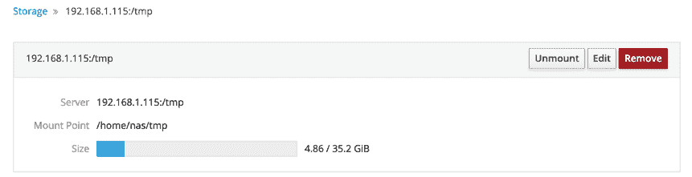

17\. 使用 NFS 将 CentOS 8 文件与远程系统共享

CentOS 8 提供了两种与网络上其他系统共享文件和文件夹的机制。一种方法是使用称为 Samba 的技术。Samba 基于 Microsoft Windows 文件夹共享，允许 Linux 系统使文件夹对 Windows 系统可访问，并从 Linux 访问基于 Windows 的文件夹共享。只要其他系统已安装并配置了 Samba 支持，此方法也可用于在其他 Linux 和 UNIX 系统之间共享文件夹。这是在异构网络环境中共享文件夹的最流行方法。关于使用 Samba 在 CentOS 8 和 Windows 系统之间共享文件夹的主题在 “使用 Samba 在 CentOS 8 和 Windows 系统之间共享文件” 中讨论。

另一种选项专门用于在 Linux 和基于 UNIX 的系统之间共享文件夹，使用称为 Network File System (NFS) 的技术。NFS 允许通过网络连接访问一台 Linux 计算机上的文件系统，其他 Linux 或 UNIX 系统。NFS 最初由 Sun Microsystems（现在是 Oracle Corporation 的一部分）在 1980 年代开发，至今仍是共享远程 Linux/UNIX 文件系统的标准机制。

NFS 与 Windows SMB 资源共享技术（由 Samba 使用）非常不同。在本章中，我们将探讨使用 NFS 在 CentOS 8 和其他基于 UNIX/Linux 的系统之间进行基于网络的文件夹共享。

17.1 确保 CentOS 8 上运行 NFS 服务

第一个任务是验证 NFS 服务是否安装并在 CentOS 8 系统上运行。可以通过命令行或使用 Cockpit 界面完成此操作。

在幕后，NFS 利用远程过程调用（RPC）以 rpcbind 服务的形式在网络中共享文件系统。从终端窗口运行以下命令安装 rpcbind 和 NFS 服务：

# dnf install rpcbind nfs-utils

接下来，配置这些服务，使它们在启动时自动启动：

# systemctl enable rpcbind

# systemctl enable nfs-server

一旦服务已启用，按如下方式启动它们：

# systemctl start rpcbind

# systemctl start nfs-server

17.2 配置 CentOS 8 防火墙以允许 NFS 流量

接下来，需要配置防火墙以允许 NFS 流量。为此，请在以下 firewall-cmd 命令中运行 <zone> 替换为适合您防火墙和系统配置的适当区域：

firewall-cmd --zone=<zone> --permanent --add-service=mountd

firewall-cmd --zone=<zone> --permanent --add-service=nfs

firewall-cmd --zone=<zone> --permanent --add-service=rpc-bind

firewall-cmd --reload

17.3 指定要共享的文件夹

现在 NFS 已启动且防火墙已配置，我们需要指定 CentOS 8 文件系统中哪些部分可以被远程 Linux 或 UNIX 系统访问。这些设置可以在/etc/exports 文件中声明，需要修改该文件以通过 NFS 导出目录供远程访问。该文件中导出行的语法如下：

<export> <host1>(<options>) <host2>(<options>)...

在上述行中，<export>由要导出的目录替换，<host1>是授予访问权限的系统的名称或 IP 地址，<options>表示对该访问权限施加的限制（只读、读写等）。如果需要，可以在同一行中放置多个主机和选项条目。例如，以下行将对 IP 地址为 192.168.2.38 的主机授予/datafiles 目录的只读权限：

/datafiles 192.168.2.38(ro)

允许使用通配符来将导出应用于多个主机。例如，以下行允许所有外部主机对/home/demo 具有读写访问权限：

/home/demo *(rw)

可以通过阅读 exports 手册页，找到 exports 文件支持的完整选项列表：

# man exports

为了本章的目的，我们将配置/etc/exports 文件如下：

/tmp *(rw,sync)

/vol1 192.168.2.21(ro,sync)

配置完成后，NFS 服务器维护的导出文件系统表需要使用 exportfs 命令更新为最新的/etc/exports 设置，如下所示：

# exportfs -a

也可以使用 exportfs 工具从命令行查看当前的共享设置：

# exportfs

上述命令将生成以下输出：

/tmp <world>

/vol1 192.168.2.21

17.4 访问共享的 CentOS 8 文件夹

共享文件夹可以通过从客户端系统手动挂载来访问。在尝试挂载远程 NFS 文件夹之前，应先在客户端系统上安装 nfs-utils 软件包：

# dnf install nfs-utils

要从命令行挂载远程文件夹，打开一个终端窗口并创建一个文件夹，指定要挂载远程文件夹的位置：

# mkdir /home/demo/tmp

接下来，输入命令以使用远程 NFS 服务器的 IP 地址或主机名挂载远程文件夹，例如：

# mount -t nfs 192.168.1.115:/tmp /home/demo/tmp

然后，远程的/tmp 文件夹将在本地系统上挂载。挂载后，/home/demo/tmp 文件夹将包含远程文件夹及其所有内容。

挂载远程 NFS 文件系统时，也可以指定选项。例如，下面的命令挂载相同的文件夹，但将其配置为只读：

# mount -t nfs -o ro 192.168.1.115:/tmp /home/demo/tmp

17.5 在系统启动时挂载 NFS 文件系统

还可以通过编辑 /etc/fstab 文件配置 CentOS 8 系统，在每次系统启动时自动挂载远程文件系统。加载到编辑器后，它可能类似于以下内容：

/dev/mapper/cl-root / xfs 默认 0 0

UUID=c2c3b49a-e1a1-4004 /boot xfs 默认 0 0

/dev/mapper/cl-home /home xfs 默认 0 0

/dev/mapper/cl-swap swap swap 默认 0 0

例如，要将路径为 /tmp 的文件夹挂载到本地路径 /home/demo/tmp（请注意，该文件夹必须已存在），可以将以下行添加到 /etc/fstab 文件中：

192.168.1.115:/tmp /home/demo/tmp nfs rw 0 0

下一次系统重启时，位于远程系统上的 /tmp 文件夹将被挂载到本地的 /home/demo/tmp 挂载点。然后，所有远程文件夹中的文件都可以像本地硬盘驱动器上的文件一样访问。

17.6 卸载 NFS 挂载点

一旦通过 NFS 挂载了远程文件系统，就可以使用 umount 命令卸载它，命令行参数为本地挂载点。例如，以下命令将卸载我们的示例文件系统挂载点：

# umount /home/demo/tmp

17.7 在 Cockpit 中访问 NFS 文件系统

除了使用命令行在客户端挂载远程 NFS 文件系统外，还可以通过 Cockpit Web 界面进行挂载操作。假设 Cockpit 已经在客户端系统上安装并配置完毕，登录到 Cockpit 界面，在浏览器内从左侧导航面板选择“存储”选项。如果没有显示“存储”选项，则需要安装 cockpit-storaged 包并重启 Cockpit 服务，如下所示：

# dnf install cockpit-storaged

# systemctl restart cockpit.socket

一旦 Cockpit 服务重启，重新登录 Cockpit 界面，此时应能看到“存储”选项。

选择后，主存储页面将包括一个部分，列出当前挂载的 NFS 文件系统，如 图 17-1 所示：

图 17-1

要挂载远程文件系统，请点击上方突出显示的“+”按钮，在弹出的对话框中输入远程 NFS 服务器和文件系统共享的相关信息，以及本地挂载点和所需的选项，然后点击“添加”按钮：

图 17-2

要修改、卸载或移除 NFS 文件系统共享，请在 NFS 挂载列表中选择相应的挂载（如上文所示的 图 17-1），以显示下图 图 17-3：

图 17-3

在此界面中，可以执行诸如更改服务器或挂载点，或卸载文件系统等任务。删除选项会卸载文件系统并从/etc/fstab 文件中删除该条目，以确保系统下次重启时不会重新挂载该文件系统。

17.8 总结

网络文件系统（NFS）是一种基于客户端/服务器的系统，最初由 Sun Microsystems 开发，它为 Linux 和 Unix 系统提供了一种通过网络共享文件系统的方法。NFS 允许客户端系统访问并（在权限允许的情况下）修改位于远程服务器上的文件，就像这些文件存储在本地文件系统上一样。本章提供了 NFS 的概述，并概述了使用命令行或 Cockpit Web 界面配置客户端和服务器系统的可用选项。
