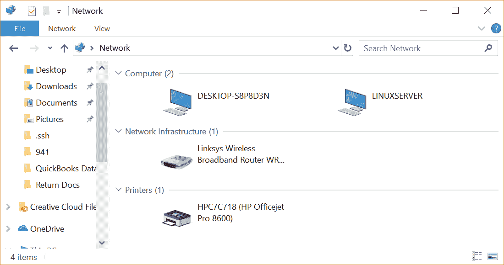
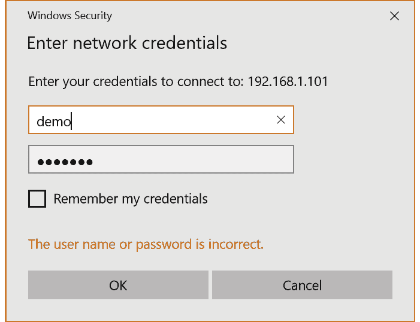
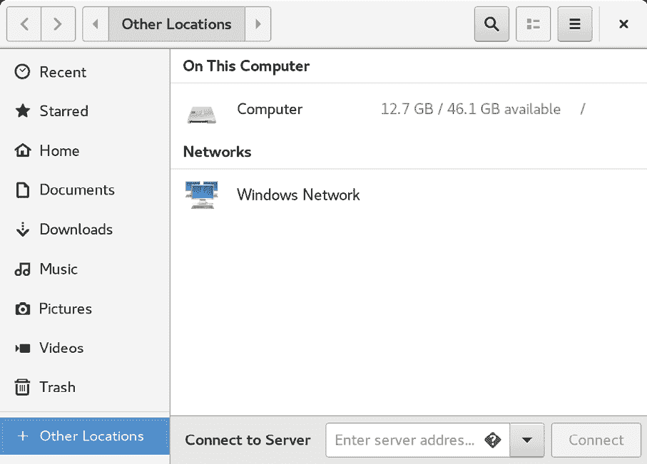
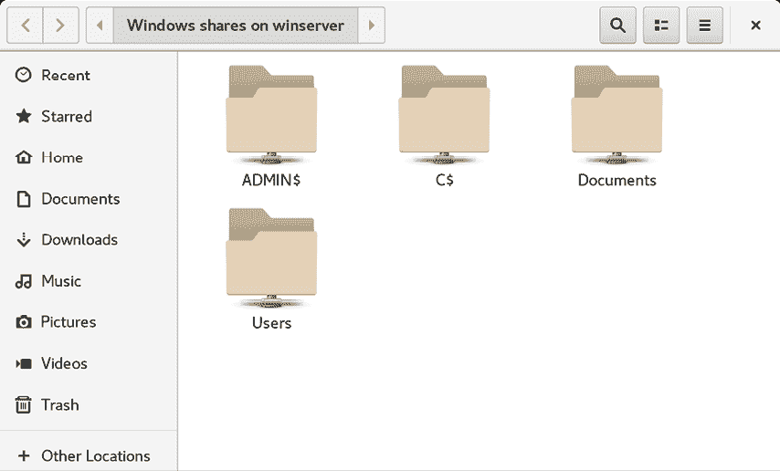

18. 在 CentOS 8 和 Windows 系统之间共享文件

尽管 Linux 在桌面市场取得了一些进展，但它的起源和未来主要是面向服务器的。因此，CentOS 8 能够作为文件服务器并不令人惊讶。因此，CentOS 和 Windows 系统通常会在网络环境中并行使用。因此，CentOS 8 系统上的文件需要能够通过网络连接被 Linux、UNIX 和 Windows 系统访问。同样，位于 Windows 系统上的共享文件夹和打印机也可能需要从 CentOS 8 系统进行访问。

Windows 系统使用一种叫做 Server Message Block (SMB) 的协议来共享文件系统和打印机等资源。因此，为了让 CentOS 8 系统能够通过网络将这些资源提供给 Windows 系统，反之亦然，它必须支持 SMB。这可以通过使用 Samba 技术来实现。除了提供 Linux 和 Windows 系统之间的集成外，Samba 还可以用于在 Linux 系统之间提供文件夹共享（作为替代方案，与上一章介绍的 NFS 相对）。

本章将介绍将文件系统资源和打印机从 CentOS 8 系统共享到远程 Windows 和 Linux 系统的步骤，以及从 CentOS 8 访问 Windows 资源的步骤。

18.1 Samba 和 Samba 客户端

Samba 允许 CentOS 8 资源与 Windows 系统共享，也允许 Windows 资源与 CentOS 8 系统共享。CentOS 使用 Samba 客户端访问 Windows 资源。另一方面，通过安装和配置 Samba 服务，CentOS 资源可以与 Windows 系统共享。

18.2 在 CentOS 8 系统上安装 Samba

在 CentOS 8 安装过程中，默认设置通常不会安装必要的 Samba 包。除非你特别要求安装 Samba，否则系统中很可能没有安装 Samba。要检查 Samba 是否已安装，可以打开终端窗口并运行以下 rpm 命令：

# 第十七章：rpm -q samba samba-common samba-client

如果没有安装任何 Samba 包，rpm 会返回“package is not installed”。如果是这种情况，可以使用 dnf 命令行工具来安装它们：

# dnf install samba samba-common samba-client

18.3 配置 CentOS 8 防火墙以启用 Samba

接下来，需要配置当前保护 CentOS 8 系统的防火墙，以允许 Samba 流量。为此，请执行以下 firewall-cmd 命令：

# firewall-cmd --permanent --add-port={139/tcp,445/tcp}

# firewall-cmd --reload

在启动 Samba 服务之前，需要进行一系列配置步骤，以定义 CentOS 系统如何呈现给 Windows 系统，以及需要与远程客户端共享的资源。大多数配置任务都在 /etc/samba/smb.conf 文件中进行。

18.4 配置 smb.conf 文件

在 CentOS 6 之前，提供了一个名为 system-config-samba 的图形化工具，帮助配置 Samba。然而，在 CentOS 7 及更高版本中，该工具已被移除。这意味着 Samba 环境必须手动配置，通过编辑 /etc/samba/smb.conf 文件并使用 smbpasswd 命令行工具来完成。虽然那些依赖于该工具的用户可能会对此感到惋惜，但该工具的简化实际上掩盖了 Samba 的许多高级功能。实际上，通过花时间理解 smb.conf 文件的复杂性，能实现更多的配置。

Samba 是一个高度灵活且可配置的系统，提供了多种选项来控制 Windows 网络上资源的共享方式。这种灵活性可能导致 Samba 看起来过于复杂。然而，实际上，许多配置选项对于典型安装并不需要，设置基本配置的学习曲线实际上相当短。

本章的目标是将 CentOS 8 系统加入一个 Windows 工作组，并设置一个目录作为共享资源，供特定用户访问。这种配置被称为独立 Samba 服务器。更高级的配置，比如将 Samba 集成到 Active Directory 环境中，也有提供，但这些超出了本书的范围。

配置 Samba 的第一步是编辑 /etc/samba/smb.conf 文件。

18.4.1 配置 [global] 部分

smb.conf 文件被划分为多个部分。第一部分是 [global] 部分，可以在其中指定适用于整个 Samba 配置的设置。尽管这些设置是全局的，但每个选项可以在配置文件的其他部分中被覆盖。

第一个任务是定义 CentOS 8 资源将要共享的 Windows 工作组名称。这个设置通过 [global] 部分的 workgroup = 指令控制，默认情况下配置如下：

workgroup = SAMBA

首先，修改为实际的工作组名称。例如，如果工作组名称为 WORKGROUP（大多数 Windows 网络的默认值）：

[global]

workgroup = WORKGROUP

security = user

passdb backend = tdbsam

.

.

除了 workgroup 设置外，其他设置表明这是一个独立服务器，共享的资源将通过用户密码进行保护。在配置共享资源之前，还需要向 [global] 部分添加以下其他参数：

[global]

workgroup = WORKGROUP

security = user

netbios name = LinuxServer

passdb backend = tdbsam

log file = /var/log/samba/%m.log

log level = 1

.

.

“netbios name” 属性指定服务器在网络中对其他系统可见的名称，而日志设置则仅指定日志输出的文件位置。

18.4.2 配置共享资源

下一步是配置共享资源（换句话说，就是将在 Windows 网络中的其他系统上可以访问的资源）。为了实现这一点，需要为该部分指定一个名称，通过这个名称在共享时进行引用。例如，如果我们计划共享 CentOS 8 系统上的 /sampleshare 目录，可以将该部分命名为 [sampleshare]。在这个部分中，可以进行各种配置选项。然而，为了这个示例，我们将简单地定义要共享的目录，指定该目录可浏览和可写入，并声明该资源为公共资源，以便访客用户能够访问：

[sampleshare]

注释 = 示例 Samba 共享

路径 = /sampleshare

可浏览 = 是

公共 = 是

可写入 = 是

为了限制对特定用户的访问，可以使用“有效用户”属性，例如：

有效用户 = demo, bobyoung, marcewing

18.4.3 移除不必要的共享

smb.conf 文件已预先配置了用于共享打印机和系统上用户主文件夹的部分。如果这些资源不需要共享，可以将相应的部分注释掉，这样 Samba 就会忽略它们。在以下示例中，[homes] 部分已被注释掉：

。

。

#[homes]

# 注释 = 主目录

# 有效用户 = %S, %D%w%S

# 可浏览 = 否

# 只读 = 否

# 继承 ACLs = 是

。

。

18.5 配置 SELinux 以支持 Samba

SELinux 是一个默认集成到所有 CentOS 8 系统的 Linux 内核中的系统，为操作系统和用户文件提供额外的安全性和保护。

传统上，Linux 安全性基于允许用户决定谁可以访问他们拥有的文件和其他资源的概念。例如，考虑一个位于某个特定用户的主目录中的文件，并由该用户拥有。该用户可以控制该文件的访问权限，决定其他系统用户是否可以读取和写入，或者在脚本或二进制文件的情况下，是否可以执行该文件。这种安全性被称为自主访问控制，因为资源的访问权限由用户自行决定。

然而，使用 SELinux 时，访问由系统管理员控制，用户无法覆盖此控制。这被称为强制访问控制，由管理员使用 SELinux 策略进行定义。继续之前的示例，文件的所有者只有在 SELinux 策略（无论是系统默认定义的，还是由管理员定义的）允许时，才能对该文件执行任务。

可以使用 sestatus 工具查看 CentOS 8 系统上 SELinux 的当前状态，方法如下：

# sestatus

SELinux 状态：已启用

SELinuxfs 挂载：/sys/fs/selinux

SELinux 根目录：/etc/selinux

加载的策略名称：targeted

当前模式：启用

配置文件中的模式：启用

策略 MLS 状态：已启用

策略 deny_unknown 状态：已允许

内存保护检查：实际（安全）

最大内核策略版本：31

SELinux 可以在强制执行模式或宽容模式下运行。启用时，强制执行模式会拒绝所有 SELinux 策略未允许的操作。而宽容模式则允许本应被拒绝的操作继续进行，但会将违规操作记录在日志文件中。

SELinux 安全基于上下文标签的概念。系统上的所有资源（包括进程和文件）都被分配 SELinux 上下文标签，标签包括用户、角色、类型和可选的安全级别。例如，可以按如下方式查看文件或文件夹的 SELinux 上下文：

$ ls -Z /home/demo

unconfined_u:object_r:user_home_t:s0 Desktop

unconfined_u:object_r:user_home_t:s0 Documents

同样，可以使用 ps 命令识别正在运行的进程的上下文，这里是 ls 命令：

$ ps -eZ | grep ls

unconfined_u:unconfined_r:unconfined_t:s0-s0:c0.c1023 14311 tty1 00:00:18 ls

当进程（例如上面的 ls 命令）尝试访问文件或文件夹时，SELinux 系统会检查策略以确定是否允许访问。现在考虑 Samba 服务的上下文：

$ ps -eZ | grep smb

system_u:system_r:smbd_t:s0 14129 ? 00:00:00 smbd

system_u:system_r:smbd_t:s0 14132 ? 00:00:00 smbd-notifyd

SELinux 通过多种方式实现安全性，其中最常见的是称为类型强制执行。简单来说，当进程尝试对对象执行任务（例如写入文件）时，SELinux 会检查进程和对象的上下文类型，并验证安全策略是否允许执行该操作。例如，如果类型 A 的进程尝试写入类型 B 的文件，只有当 SELinux 策略明确表示类型 A 的进程可以执行对类型 B 文件的写入操作时，才会被允许。在 SELinux 强制执行模式下，默认情况下拒绝所有操作，除非存在专门允许该操作的规则。

SELinux 与 Samba 的问题在于 SELinux 策略未配置为允许 smb_t 类型的进程对除 samba_share_t 之外的任何类型文件执行操作。例如，上面列出的 /home/demo 目录将无法被 Samba 服务访问，因为它的类型是 user_home_t。为了使系统上的文件或文件夹能够被 Samba 服务访问，必须将这些特定资源的强制执行类型更改为 samba_share_t。

本示例中，我们将创建前面在 smb.conf 文件中提到的 /sampleshare 目录，并更改强制执行类型，使其能够被 Samba 服务访问。首先按以下步骤创建该目录：

# mkdir /sampleshare

接下来，检查该目录的当前 SELinux 上下文：

$ ls -aZ /sampleshare/

unconfined_u:object_r:default_t:s0 .

在此实例中，文件夹的上下文标签被分配为 default_t 类型。为了使文件夹可由 Samba 共享，必须使用 semanage 工具将其强制类型设置为 samba_share_t，如下所示：

# semanage fcontext -a -t samba_share_t "/sampleshare(/.*)?"

注意在 semanage 命令中使用通配符，以确保该类型应用于 /sampleshare 目录中的任何子目录和文件。添加后，需要使用 restorecon 命令应用更改，并使用 -R 标志递归地应用该更改到所有子目录：

# restorecon -R -v /sampleshare

将 /sampleshare 的标签从 unconfined_u:object_r:default_t:s0 更改为 unconfined_u:object_r:samba_share_t:s0

一旦做出这些更改，文件夹将被配置为符合 smb 进程的 SELinux 策略，并准备通过 Samba 共享。

18.6 创建 Samba 用户

任何需要访问 Samba 共享资源的用户，必须配置为 Samba 用户并分配密码。这个任务通过使用 smbpasswd 命令行工具来完成。例如，假设有一个名为 demo 的用户，需要从 Windows 系统访问我们的 CentOS 8 系统上的 /sampleshare 目录。为了实现这个要求，我们必须如下添加 demo 为 Samba 用户：

# smbpasswd -a demo

新的 SMB 密码：

重新输入新的 SMB 密码：

已添加用户 demo。

现在我们已经完成了一个非常基础的 Samba 服务器配置，是时候测试我们的配置文件并启动 Samba 服务了。

18.7 测试 smb.conf 文件

可以使用 testparm 命令行工具检查 smb.conf 文件中的错误，方法如下：

# testparm

从 /etc/samba/smb.conf 加载 smb 配置文件

rlimit_max：将 rlimit_max（1024）增加到 Windows 最小限制（16384）

正在处理部分 "[sampleshare]"

正在处理部分 "[homes]"

正在处理部分 "[printers]"

正在处理部分 "[print$]"

服务文件加载成功。

服务器角色：ROLE_STANDALONE

按下回车键查看服务定义的输出

# 全局参数

[global]

日志文件 = /var/log/samba/%m.log

netbios 名称 = LINUXSERVER

printcap 名称 = cups

安全性 = 用户

WINS 支持 = 是

idmap 配置 * : 后端 = tdb

cups 选项 = raw

[sampleshare]

注释 = 示例 Samba 共享

允许游客访问 = 是

路径 = /sampleshare

只读 = 否

[homes]

可浏览 = 否

注释 = 家庭目录

继承 ACL = 是

只读 = 否

有效用户 = %S %D%w%S

[printers]

可浏览 = 否

注释 = 所有打印机

创建掩码 = 0600

路径 = /var/tmp

可打印 = 是

[print$]

注释 = 打印机驱动程序

创建掩码 = 0664

目录掩码 = 0775

强制组 = @printadmin

路径 = /var/lib/samba/drivers

写入列表 = @printadmin root

18.8 启动 Samba 和 NetBIOS 名称服务

为了使 CentOS 8 服务器能够在 Windows 网络中运行，必须启动 Samba (SMB) 和 NetBIOS 名称服务 (NMB)。另外，也可以启用这些服务，以便每次系统启动时自动启动：

# systemctl enable smb

# systemctl start smb

# systemctl enable nmb

# systemctl start nmb

在尝试从 Windows 系统连接之前，使用 smbclient 工具验证共享是否已配置：

# smbclient -U demo -L localhost

输入 WORKGROUP\demo 的密码：

共享名称 类型 注释

--------- ---- -------

sampleshare 磁盘示例 Samba 共享

print$ 磁盘打印机驱动程序

IPC$ IPC IPC 服务 (Samba 4.9.1)

demo 磁盘主目录

使用 SMB1 重新连接以进行工作组列表。

服务器注释

--------- -------

工作组主机

--------- -------

WORKGROUP LINUXSERVER

18.9 访问 Samba 共享

现在 Samba 资源已配置并且服务正在运行，是时候从 Windows 系统访问共享资源了。在与 CentOS 8 系统处于同一工作组的合适 Windows 系统上，打开 Windows 资源管理器并导航到“网络”面板。此时，资源管理器应搜索网络并列出它找到的任何使用 SMB 协议的系统。下图展示了一个名为 LINUXSERVER 的 CentOS 8 系统，在 Windows 10 系统上通过 Windows 资源管理器找到：

图 18-1

双击 LINUXSERVER 主机将提示输入具有访问权限的用户的用户名和密码。在这种情况下，是我们使用 smbpasswd 工具配置的 demo 帐户：

图 18-2

输入用户名和密码后，配置给该用户的共享资源将出现在资源管理器窗口中，包括之前配置的 /sampleshare 资源：

图 18-3

双击 /sampleshare 共享资源将显示其中包含的文件和目录列表。

18.10 从 CentOS 8 访问 Windows 共享

如前所述，Samba 是一条双向通道，允许 Windows 系统访问托管在 CentOS 8 系统上的文件和打印机，也允许 CentOS 8 系统访问 Windows 系统上的共享资源。通过使用本章开始时安装的 samba-client 软件包来实现这一点。如果目前尚未安装，可以通过终端窗口按如下方式安装：

# dnf install samba-client

可以通过 CentOS 桌面上的“文件”应用程序或通过命令行提示符使用 smbclient 和 mount 工具来访问 Windows 系统上的共享资源。本节的步骤假设 Windows 系统已启用适当的网络共享设置。

要通过桌面访问 Windows 系统上的共享资源，首先启动“文件”应用程序并选择“其他位置”选项。这将显示如下图 图 18-4 所示的屏幕，包括 Windows 网络图标（如果检测到的话）：

图 18-4

选择 Windows 网络选项将显示网络上检测到的 Windows 系统，并允许访问任何共享的资源。

图 18-5

另外，还可以使用“连接到服务器”选项来连接到特定的系统。请注意，远程系统的名称或 IP 地址必须以 smb:// 前缀，并且可以跟随特定共享资源的路径，例如：

smb://WinServer10/Documents

在没有桌面环境的情况下，可以通过命令行使用 mount 命令并指定 cifs 文件系统类型来挂载远程 Windows 共享。例如，以下命令将挂载一个名为 Documents 的共享，该共享位于名为 WinServer 的 Windows 系统上，挂载点为本地路径 /winfiles：

# mount -t cifs //WinServer/Documents /winfiles -o user=demo

18.11 总结

在本章中，我们探讨了配置 CentOS 8 系统作为 Samba 客户端和服务器的必要步骤，从而允许与基于 Windows 的系统共享资源。涵盖的主题包括 Samba 客户端和服务器软件包的安装以及将 Samba 配置为独立服务器。此外，还介绍了 SELinux 的基本概念，并讲解了如何为 Samba 提供访问共享资源的步骤。
