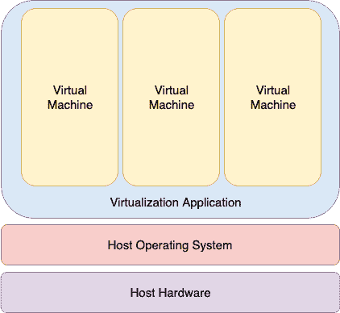
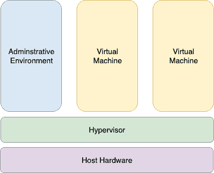

# 第十八章

19. 虚拟化技术概述

虚拟化通常定义为在单个计算机系统上同时运行多个操作系统的能力。虽然这并不一定是一个新概念，但由于它能够充分利用服务器系统的 CPU 和资源容量，同时提供稳定性（即，如果某个虚拟化的客户系统崩溃，主机和任何其他客户系统仍然继续运行），虚拟化在近年来得到了广泛关注。

虚拟化在尝试不同操作系统时也非常有用，无需配置双重启动环境。例如，你可以在虚拟机中运行 Windows，而无需重新分区磁盘、关闭 CentOS 8 并从 Windows 启动。你只需启动一个虚拟化版本的 Windows 作为客户操作系统。类似地，虚拟化允许你在 CentOS 8 系统中运行其他 Linux 发行版，从而实现两个操作系统的并行访问。

在决定实施虚拟化的最佳方法时，清楚了解当前可用的不同虚拟化解决方案是非常重要的。因此，本章的目的是概述今天常用的虚拟化技术。

19.1 客户操作系统虚拟化

客户操作系统虚拟化，也称为基于应用程序的虚拟化，可能是最容易理解的概念。在这种情况下，物理主机计算机系统运行标准的未修改操作系统，如 Windows、Linux、UNIX 或 macOS。在这个操作系统上运行的是一个虚拟化应用程序，它的运行方式与任何其他应用程序（如文字处理器或电子表格）类似。正是在这个虚拟化应用程序中创建一个或多个虚拟机，以便在主机计算机上运行客户操作系统。

虚拟化应用程序负责启动、停止和管理每个虚拟机，实质上代表各个虚拟机控制对物理硬件资源的访问。虚拟化应用程序还参与一种被称为二进制重写的过程，这个过程包括扫描执行中的客户操作系统的指令流，并将任何特权指令替换为安全的仿真指令。这样做的效果是使客户操作系统认为它是直接在系统硬件上运行，而不是在应用程序中的虚拟机内运行。

以下图示例展示了基于客户操作系统的虚拟化：

图 19-1

如上图所示，来宾操作系统在虚拟化应用程序中的虚拟机内运行，而虚拟化应用程序则像其他应用程序一样运行在宿主操作系统之上。显然，来宾操作系统与底层宿主硬件之间的多层抽象不利于虚拟机的高性能。然而，这种技术的优点是，宿主操作系统和来宾操作系统都无需进行任何更改，并且不需要特殊的 CPU 硬件虚拟化支持。

19.2 虚拟机监控程序虚拟化

在虚拟机监控程序虚拟化中，虚拟机监控程序的任务除了处理虚拟机的资源和内存分配外，还提供更高层次的管理和监控工具接口。基于虚拟机监控程序的解决方案分为类型 1 和类型 2 两种\。

类型 2 虚拟机监控程序（有时称为托管虚拟机监控程序）作为软件应用程序安装在宿主操作系统之上，通过协调对资源（如 CPU、内存和网络）的访问，为来宾虚拟机提供虚拟化功能。图 19-2 展示了使用类型 2 虚拟机监控程序虚拟化的系统的典型架构：

图 19-2

要理解类型 1 虚拟机监控程序的工作原理，首先需要了解一些关于 Intel x86 处理器架构的知识。x86 系列 CPU 提供了一系列保护级别，称为环（rings），代码可以在其中执行。环 0 具有最高的特权级，操作系统内核通常在该环中运行。在环 0 中执行的代码被称为在系统空间、内核模式或监控模式下运行。所有其他代码，如在操作系统上运行的应用程序，通常在较低特权的环中运行，通常是环 3。

与类型 2 虚拟机监控程序（hypervisor）相比，类型 1 虚拟机监控程序（也称为金属虚拟机监控程序或原生虚拟机监控程序）直接运行在宿主系统的硬件上，并且在环 0 中运行。显然，由于虚拟机监控程序占用了 CPU 的环 0，任何在该系统上运行的来宾操作系统的内核必须在更低权限的 CPU 环中运行。不幸的是，大多数操作系统内核都是显式编写为在环 0 中运行，原因很简单：它们需要执行仅在该环中可用的任务，例如执行特权 CPU 指令和直接操作内存的能力。近年来，针对这个问题已经设计了许多不同的解决方案，下面将逐一介绍：

19.2.1 半虚拟化

在半虚拟化下，来宾操作系统的内核被专门修改以便在虚拟机监控器上运行。这通常涉及将只能在 CPU 的环 0 中运行的特权操作替换为对虚拟机监控器的调用（称为超级调用）。虚拟机监控器则代表来宾内核执行该任务。通常，这种方式将支持限制为可以自由修改的开源操作系统，如 Linux，以及那些所有者同意对其进行必要代码修改以支持特定虚拟机监控器的专有操作系统。尽管存在这些问题，来宾内核能够直接与虚拟机监控器通信，这使得性能相比其他虚拟化方法更为优越。

19.2.2 完全虚拟化

完全虚拟化支持未修改的来宾操作系统。未修改是指操作系统内核没有被修改以便在虚拟机监控器上运行，因此仍然执行特权操作，就像在 CPU 的环 0 中运行一样。在这种情况下，虚拟机监控器提供 CPU 仿真来处理和修改未修改的来宾操作系统内核所发出的特权和保护 CPU 操作。不幸的是，这一仿真过程需要时间和系统资源，因此与半虚拟化相比，性能较差。

19.2.3 硬件虚拟化

硬件虚拟化利用了英特尔和 AMD 最新一代 CPU 中内置的虚拟化功能。这些技术，分别称为 Intel VT 和 AMD-V，提供了必要的扩展，使得在没有完全虚拟化 CPU 仿真开销的情况下能够运行未修改的来宾虚拟机。简单来说，这些新处理器提供了一个比环 0 更高的特权模式（称为环 -1），虚拟机监控器可以在其中运行，从而将环 0 留给未修改的来宾操作系统。

下图展示了 Type-1 虚拟机监控器的虚拟化方法：

图 19-3

如上图所示，除了虚拟机外，还运行着一个管理操作系统和/或管理控制台，这些都在虚拟机监控器上运行，从而允许系统管理员对虚拟机进行管理。

19.3 虚拟机网络

虚拟机通常需要连接到网络才能发挥实际作用。一种选择是将客户机连接到运行在宿主机操作系统中的虚拟网络。在这种配置下，虚拟网络上的任何虚拟机都可以相互访问，但外部网络的访问是通过网络地址转换（NAT）提供的。在使用虚拟网络和 NAT 时，每个虚拟机在外部网络（宿主机所连接的网络）上都会通过宿主机的 IP 地址进行表示。这是 CentOS 8 上 KVM 虚拟化的默认行为，通常无需额外配置。通常，默认会创建一个虚拟网络，名称为 default，设备为 virbr0。

为了使客户机在外部网络上作为独立的系统出现（即拥有自己的 IP 地址），它们必须配置为共享宿主机上的物理网络接口。实现这一目标的最快方法是将虚拟机配置为使用“直接连接”网络配置选项（也称为 MacVTap），这样将为客户系统分配与宿主机相同网络中的 IP 地址。不幸的是，虽然这可以使虚拟机访问网络上的其他系统，但在使用 MacVTap 驱动时，无法建立客户机与宿主机之间的连接。

更好的选择是配置一个网络桥接接口，在宿主系统上供客户机连接。这为客户机提供外部网络上的 IP 地址，同时也允许客户机与宿主机进行通信，相关内容将在章节“创建 CentOS 8 KVM 网络桥接接口”中进行讲解。

19.4 总结

虚拟化被定义为在单一宿主操作系统内运行多个客户操作系统的能力。已经开发出多种虚拟化方法，包括客户操作系统虚拟化和虚拟机管理程序（Hypervisor）虚拟化。虚拟机管理程序虚拟化分为两类：Type-1 和 Type-2。Type-2 虚拟化解决方案包括准虚拟化、完全虚拟化和硬件虚拟化，后者利用了一些 Intel 和 AMD 处理器型号的特殊虚拟化特性。

虚拟机客户操作系统在网络配置方面有多个选项，包括 NAT、直接连接（MacVTap）和网络桥接配置。
