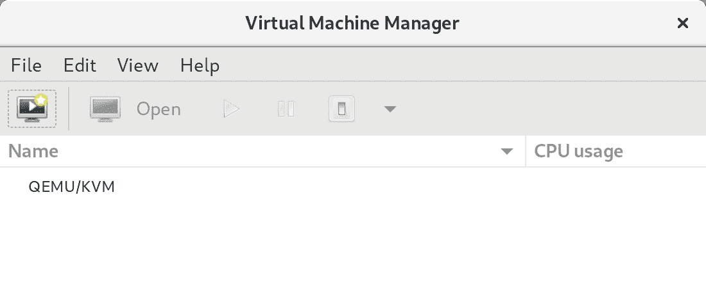
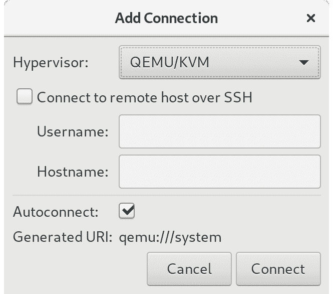

20. 安装 KVM 虚拟化到 CentOS 8

在 CentOS 6 之前，CentOS 提供了两种虚拟化平台：基于内核的虚拟机（KVM）和 Xen。随着 CentOS 6 的发布，Xen 的支持被移除，KVM 成为 CentOS 8 中唯一的捆绑虚拟化选项。除了 KVM 外，第三方解决方案如 VMware 和 Oracle VirtualBox 也可用。然而，由于 KVM 与 CentOS 8 一起提供，因此本章及后续章节将讨论 KVM 作为虚拟化解决方案。

在深入安装和运行 KVM 之前，值得花点时间讨论它如何适应上一章中概述的各种虚拟化类型。

20.1 KVM 概述

KVM 被归类为一种 Type-1 虚拟化解决方案，能够实现完整虚拟化，并支持使用 Intel VT 和 AMD-V 硬件虚拟化技术的未修改客户操作系统。

KVM 与许多其他 Type-1 解决方案不同，它将主机 Linux 操作系统本身转变为虚拟机监控程序（hypervisor），从而实现裸机虚拟化，同时仍然运行完整的企业级主机操作系统。

20.2 KVM 硬件要求

在继续本章之前，我们需要讨论在 KVM 环境中运行虚拟机的硬件要求。首先，KVM 虚拟化仅适用于某些类型的处理器。如前所述，这些处理器必须包含 Intel VT 或 AMD-V 技术。

要检查虚拟化支持情况，请在终端窗口中运行以下命令：

# 第十九章：lscpu | grep Virtualization:

如果系统中包含支持 Intel VT 的 CPU，则上述命令将提供以下输出：

虚拟化：VT-x

当检测到支持 AMD-V 的 CPU 时，将显示以下输出：

虚拟化：AMD-V

如果 CPU 不支持虚拟化，lscpu 命令将不会显示任何输出。

请注意，虽然上述命令仅报告处理器是否支持相应的功能，但并未指示该功能是否已在 BIOS 中启用。实际上，大多数系统的 BIOS 默认禁用虚拟化支持。因此，建议在继续本教程之前，检查 BIOS 设置以确保适当的虚拟化技术已启用。

与双引导环境不同，虚拟化环境涉及在单台计算机系统上同时运行两个或更多完整操作系统。这意味着系统必须具有足够的物理内存、磁盘空间和 CPU 处理能力，以舒适地并行承载所有这些系统。在开始配置和安装过程之前，请检查 CentOS 8 和您选择的客户操作系统的最低系统要求，并验证您的系统是否具备处理这两个系统要求的足够资源。

20.3 为 KVM 虚拟化准备 CentOS 8

与 Xen 不同，不需要运行特殊版本的内核以支持 KVM。因此，通过安装 KVM 内核模块，标准内核已经支持 KVM，从而避免了安装和引导特殊内核的需要。

为避免冲突，如果系统当前正在运行启用了 Xen 的内核，请重新启动系统，并在继续本章剩余部分之前从引导菜单中选择非 Xen 内核。

除非在 CentOS 8 操作系统安装过程中明确选择，默认情况下不会安装设置和维护基于 KVM 的虚拟化系统所需的工具。要从命令提示符安装 KVM，请在终端窗口中执行以下命令：

# dnf install qemu-kvm qemu-img libvirt virt-install libvirt-client

如果您可以访问图形桌面环境，还建议安装 virt-manager 软件包：

# dnf install virt-manager

20.4 验证 KVM 安装

在继续之前，值得检查 KVM 安装是否正常工作。安装和运行 KVM 后，两个模块将已加载到内核中。可以通过在终端窗口中运行以下命令来验证这些模块的存在或否：

# lsmod | grep kvm

假设安装成功，上述命令应生成类似以下内容的输出：

# lsmod | grep kvm

kvm_intel 237568 0

kvm 737280 1 kvm_intel

irqbypass 16384 1 kvm

请注意，如果系统包含 AMD 处理器，kvm 模块可能会读取 kvm_amd 而不是 kvm_intel。

安装过程还应配置 libvirtd 守护程序在后台运行。再次使用终端窗口，运行以下命令以确保 libvirtd 正在运行：

# systemctl status libvirtd

libvirtd.service - 虚拟化守护程序

已加载：loaded (/usr/lib/systemd/system/libvirtd.service; enabled; vendor preset: enabled)

Active: active (running) since Wed 2019-03-06 14:41:22 EST; 3min 54s ago

如果进程未运行，可以按以下方式启动：

# systemctl enable --now libvirtd

# systemctl start libvirtd

如果桌面环境可用，请通过选择“活动”并在搜索框中输入“virt”来运行 virt-manager 工具。当虚拟机管理器图标出现时，点击它以启动。加载完成后，管理器应该如以下图所示：

图 20-1

如果没有列出 QEMU/KVM 入口，请选择文件 -> 添加连接菜单选项，在弹出的对话框中选择 QEMU/KVM 虚拟化管理程序，然后点击连接按钮：

图 20-2

如果管理器当前未连接到虚拟化进程，右键点击列出的条目，并从弹出菜单中选择连接。

20.5 小结

KVM 是一种 Type-1 虚拟化解决方案，通过支持 Intel VT 和 AMD-V 硬件虚拟化，能够实现完全虚拟化并支持未修改的来宾操作系统。它是与 CentOS 8 一起捆绑的默认虚拟化解决方案，可以快速且轻松地在任何支持适当处理器的 CentOS 8 系统上安装。安装并启用 KVM 支持后，接下来的章节将概述一些在 CentOS 8 主机上安装和管理虚拟机的选项。
