21. 使用 Cockpit 和 virt-manager 创建 KVM 虚拟机

基于 KVM 的虚拟机可以通过 virt-install 命令行工具、virt-manager 图形工具或 Cockpit Web 控制台的虚拟机模块在 CentOS 8 上轻松配置。为了本章的目的，我们将使用 Cockpit 和 virt-manager 工具，在 CentOS 8 主机上安装 Fedora 发行版作为 KVM 客户机。然而，需要注意的是，virt-manager 在 CentOS 8 中已被弃用，未来将完全由 Cockpit 模块取代。尽管如此，截至 CentOS 8，virt-manager 仍然可用，并包含一些尚未集成到 Cockpit 虚拟机模块中的功能。

创建虚拟机的命令行方法将在下一章中介绍，章节标题为“使用 virt-install 和 virsh 创建 KVM 虚拟机”。

21.1 安装 Cockpit 虚拟机模块

默认情况下，虚拟机模块不会包含在标准的 Cockpit 安装中。假设 Cockpit 已经安装并配置好，可以按照以下步骤安装虚拟机模块：

# 第二十章：dnf install cockpit-machines

安装完成后，下次登录 Cockpit 界面时，虚拟机选项（如图 21-1 中标记的 A）将出现在导航面板中：

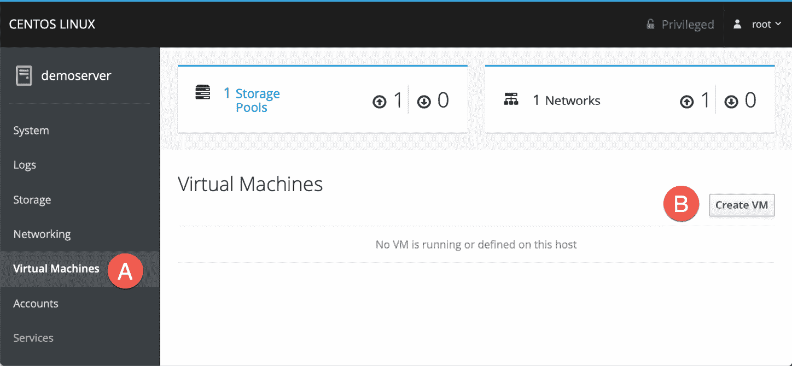

图 21-1

21.2 在 Cockpit 中创建虚拟机

要在 Cockpit 中创建虚拟机，只需点击图 22-1 中标记为 B 的“创建虚拟机”按钮，打开创建对话框。

在对话框中，输入虚拟机的名称，并选择安装介质的形式，可以是通过 URL 访问的 ISO 文件或本地文件系统路径。理想情况下，还应选择客户操作系统的供应商和类型信息。虽然这不是必须的，但它有助于系统为客户优化虚拟机。

还需要指定用于操作系统安装的虚拟磁盘驱动器的大小以及分配给虚拟机的内存量：

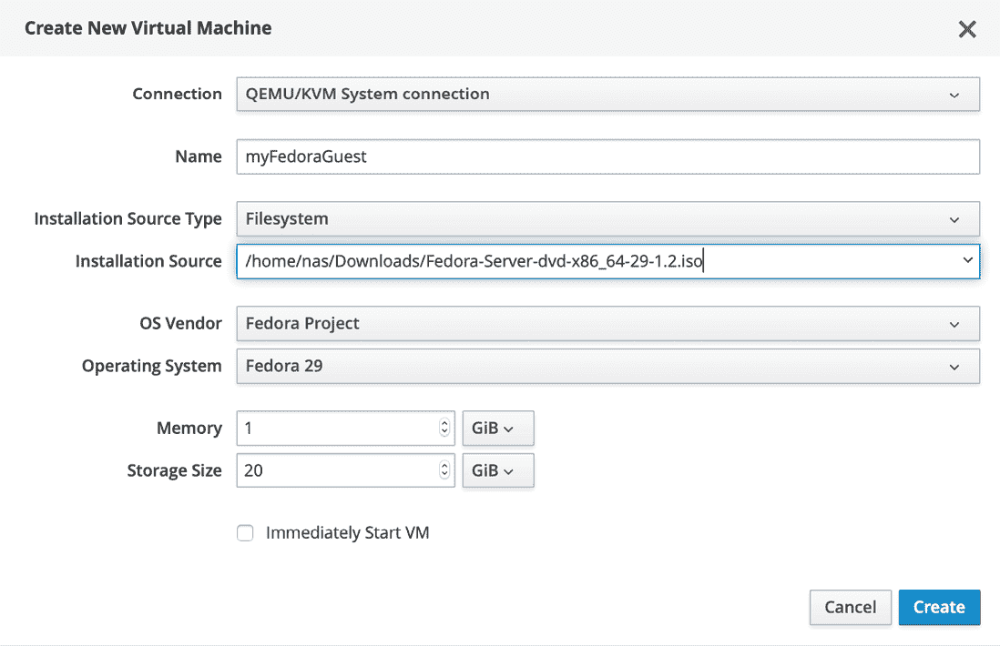

图 21-2

在这个例子中，保持“立即启动虚拟机”选项未选中，配置完新的虚拟机后，点击“创建”按钮来构建虚拟机。创建过程完成后，新的虚拟机会出现在 Cockpit 中，如图 21-3 所示：

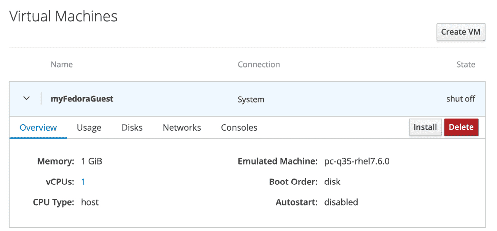

图 21-3

如“虚拟化技术概述”中所述，KVM 为虚拟机提供了多种网络配置选项。要查看和更改虚拟机的网络设置，请点击图 21-4 所示的“网络”标签，然后点击位于网络条目旁边的“编辑”按钮：

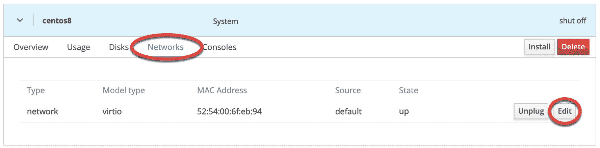

图 21-4

在弹出的对话框中，可以使用“网络类型”菜单更改网络连接类型，例如从虚拟网络（NAT）切换到直接连接（MacVTap）。

21.3 启动安装

要启动新的虚拟机并从指定的安装介质开始安装来宾操作系统，请点击上图图 21-3 中突出显示的“安装”按钮。Cockpit 将启动虚拟机并切换到“控制台”视图，来宾操作系统的屏幕将出现：

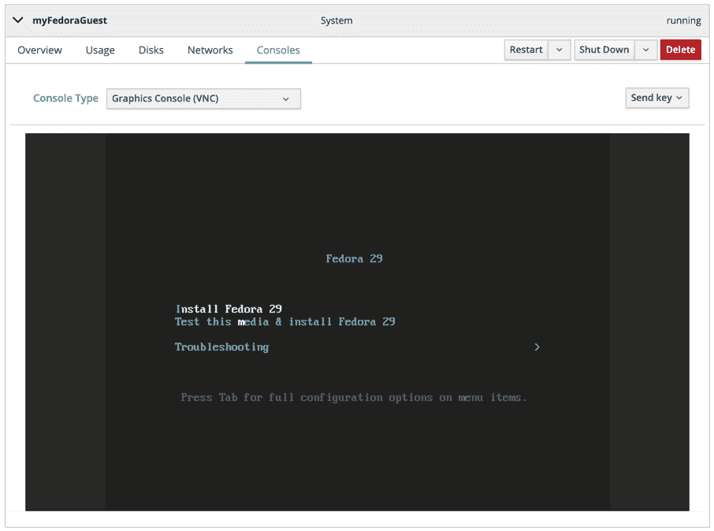

图 21-5

如果安装失败，请检查消息，看看是否显示如下内容：

无法打开‘<path to iso image>’：权限被拒绝

域安装似乎未成功。

这通常是因为 QEMU 模拟器以名为 qemu 的用户身份运行，而该用户没有访问 ISO 安装镜像所在目录的权限。要解决此问题，请切换到 ISO 镜像文件所在的目录，并将 qemu 用户添加到父目录的访问控制列表（ACL）中，如下所示：

# cd /path/to/iso/directory

# setfacl --modify u:qemu:x ..

进行此更改后，检查设置，如下所示：

# getfacl ..

# file: ..

# owner: demo

# group: demo

user::rwx

user:qemu:--x

group::---

mask::--x

other::---

一旦完成这些更改，请再次点击“安装”按钮以完成安装。

要完成安装，请像在物理硬件上安装操作系统一样，在“控制台”视图中与屏幕进行交互。

还可以使用 virt-viewer 工具从 Cockpit 浏览器会话外连接并显示虚拟机的图形控制台。要在 CentOS 8 系统上安装 virt-viewer，请运行以下命令：

# dnf install virt-viewer

virt-viewer 工具也适用于 Windows 系统，可以从以下网址下载：

[`virt-manager.org/download/`](https://virt-manager.org/download/)

要连接到本地主机上运行的虚拟机，只需运行 virt-viewer 并在弹出的对话框中选择您希望连接的虚拟机：

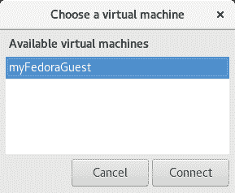

图 21-6

或者，也可以指定虚拟机名称并绕过选择对话框，例如：

# virt-viewer myFedoraGuest

要通过 SSH 将 virt-viewer 实例连接到远程主机上运行的虚拟机，可以使用以下命令：

$ virt-viewer --connect qemu+ssh://<user>@<host>/system <guest name>

例如：

$ virt-viewer --connect qemu+ssh://root@192.168.1.122/system MyFedoraGuest

使用此技术时，需要注意的是，在完全建立连接之前，系统会要求输入用户密码两次。

创建虚拟机后，可以使用 Cockpit 界面来监控虚拟机并执行重启、关机或删除来宾系统等任务。磁盘面板上还提供了添加额外磁盘到虚拟机配置中的选项。

21.4 使用 virt-manager 创建虚拟机

需要注意的是，virt-manager 已经被弃用，并将在虚拟机 Cockpit 扩展完全实现后被移除，本章的其余部分将探讨如何使用该工具创建新的虚拟机。

21.5 启动虚拟机管理器

从命令行终端窗口中启动虚拟机管理器，可以运行 virt-manager。加载后，虚拟机管理器会提示输入当前活动用户的密码，然后显示以下界面：

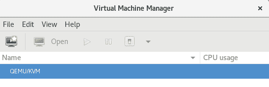

图 21-7

主界面列出了当前系统上运行的虚拟机。此时，应该只有一台虚拟机，即运行在主机系统上的虚拟化管理程序。默认情况下，管理器应该已经连接到主机。如果没有连接，请右键点击列表中的条目，然后从弹出菜单中选择“连接”以连接到主机系统。

要创建一个新的虚拟系统，点击新建虚拟机按钮（工具栏最左侧的按钮），或右键点击虚拟化管理程序条目，从弹出菜单中选择“新建”以显示新虚拟机向导的第一屏。在“名称”字段中输入一个适当描述虚拟系统的名称。在此界面，还需要选择要安装来宾操作系统的介质位置。可以选择 CD 或 DVD 驱动器、本地主机可访问的 ISO 镜像文件、使用 HTTP、FTP、NFS 或 PXE 进行的网络安装，或者来自现有虚拟机的磁盘映像：

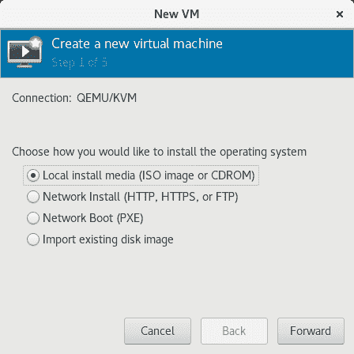

图 21-8

21.6 配置 KVM 虚拟系统

点击“Forward”按钮将显示一个屏幕，要求提供关于安装过程的额外信息。显示的屏幕及所需的信息将取决于前一屏幕中所做的选择。例如，如果选择了 CD、DVD 或 ISO，系统将要求提供 ISO 文件或物理介质设备的具体位置。该屏幕还会尝试根据指定的安装媒体识别要安装的客户操作系统的类型和版本（例如，Windows 版本或 Linux 发行版）。如果无法识别，请取消选中“Automatically detect from installation media / source”选项，输入操作系统名称的前几个字符，并从可能的匹配项列表中选择一个选项：

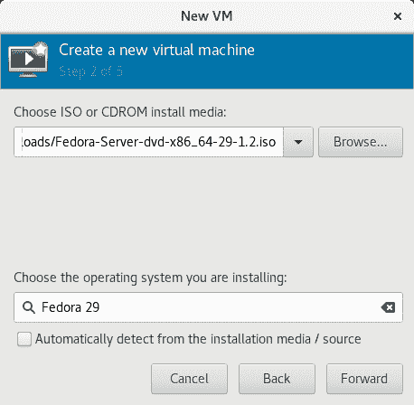

图 21-9

完成这些设置后，点击“Forward”按钮配置 CPU 和内存设置。最佳设置将取决于主机中 CPU 的数量和物理内存的大小，以及与新虚拟机并行运行的其他应用程序和虚拟机的需求：

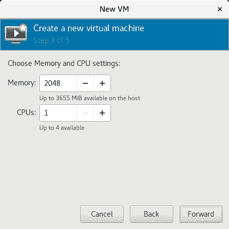

图 21-10

创建虚拟机之前需要配置的最后一项是客户操作系统及其相关用户数据的存储空间。这可以是虚拟磁盘映像或现有存储。虚拟磁盘驱动器本质上是存储在主机计算机文件系统中的一个映像文件，虚拟机将其视为物理磁盘驱动器。

可以选择创建指定大小的映像磁盘、选择现有卷或创建指定格式的存储卷（raw、vmdk、ISO 等）。除非你有特殊需求使用特定格式（例如，你可能需要使用 vmdk 格式以便日后迁移到基于 VMware 的虚拟化环境）或需要使用专用磁盘或分区，否则通常只需在此屏幕上指定大小即可：

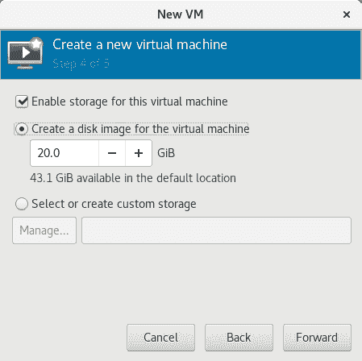

图 21-11

配置好这些设置后，再次点击“Forward”按钮。最终屏幕将显示配置摘要。请检查显示的信息。还提供了高级选项，可以更改客户机的虚拟网络配置，如图 21-12 所示：

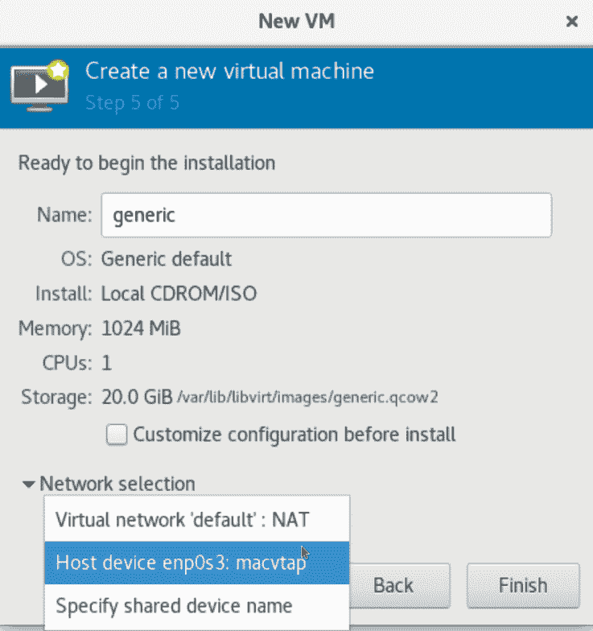

图 21-12

21.7 启动 KVM 虚拟机

点击“Finish”按钮开始创建过程。虚拟化管理器将在启动客户系统之前创建磁盘并配置虚拟机。新的虚拟机将出现在主 virt-manager 窗口中，状态设置为“Running”，如图 21-13 所示：

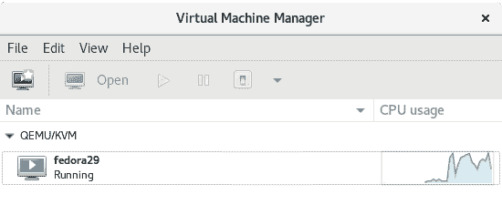

图 21-13

默认情况下，虚拟机的控制台应显示在虚拟机查看器窗口中。如需在未来的任何时间查看正在运行的虚拟机的控制台，请确保在虚拟机列表中选择该虚拟机，并从工具栏中选择“打开”按钮。虚拟机查看器应准备好开始安装过程：

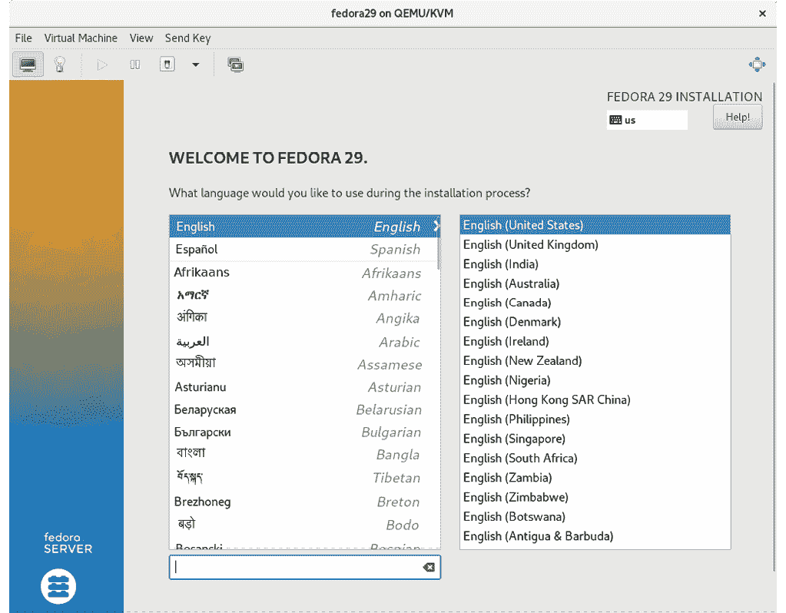

图 21-14

从此时起，只需按照操作系统安装说明在 KVM 虚拟机中安装客操作系统。

21.8 总结

本章概述了在 CentOS 8 主机系统上创建基于 KVM 的新虚拟机的两种不同方法。第一种方法是使用 Cockpit 基于 Web 的界面来创建和管理虚拟机，这种方法的优点是无需访问主机系统上的桌面环境。另一种选择是使用 virt-manager 图形工具。尽管在 CentOS 8 中已被弃用，并且可能会在未来的版本中移除，但 virt-manager 目前提供的某些功能是 Cockpit 虚拟机扩展所不具备的。预计在 virt-manager 被移除后，Cockpit 将提供相同或更强大的功能。

在掌握了这些基础知识之后，下一章将介绍如何通过命令行创建虚拟机。
