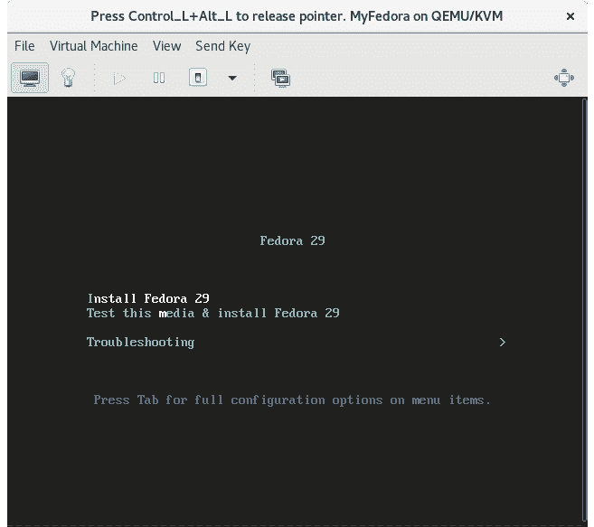

22\. 使用 virt-install 和 virsh 创建 KVM 虚拟机

在上一章中，我们探索了如何使用 Cockpit 和 virt-manager 图形工具在 CentOS 8 主机上创建 KVM 客户操作系统。在本章中，我们将转向使用 virt-install 和 virsh 命令行工具创建基于 KVM 的虚拟机。这些工具提供了与 virt-manager 和 Cockpit 选项相同的功能，且附带的优势是它们可以在脚本中使用，自动化虚拟机的创建。此外，virsh 命令允许根据配置文件中的规范创建虚拟机。

virt-install 工具提供了一种通过列出命令行选项来创建新虚拟机的方式。本章假设已安装必要的 KVM 工具。有关这些要求的详细信息，请阅读名为“在 CentOS 8 上安装 KVM 虚拟化”的章节。

22.1 使用 virt-install 构建 KVM 客户系统

virt-install 实用程序接受广泛的命令行参数，用于提供与所创建虚拟机相关的配置信息。这些命令行选项中有一些是必须提供的（特别是名称、内存和磁盘存储必须提供），而其他选项则是可选的。

至少，一个 virt-install 命令通常需要以下参数：

•--name - 要分配给虚拟机的名称。

•--memory - 分配给虚拟机的内存大小。

•--disk - 用作虚拟机存储的映像文件的名称和位置。如果没有指定 --import 选项以表明使用现有的映像文件，则该文件将在虚拟机创建过程中由 virt-install 创建。

•--cdrom 或 --location - 指定包含客户操作系统安装媒体的本地路径或远程 ISO 镜像的 URL。

所有可用于 virt-install 的参数总结可以在手册页中找到：

$ man virt-install

22.2 一个 CentOS 8 virt-install 命令示例

根据上面的命令行参数列表，我们现在可以查看使用 virt-install 工具的一个示例命令行构造。

请注意，为了能够显示虚拟机并完成安装，virt-viewer 实例需要在 virt-install 工具启动虚拟机后连接到虚拟机。默认情况下，virt-install 会尝试在虚拟机开始运行时自动启动 virt-viewer。如果 virt-viewer 不可用，virt-install 将等待直到建立 virt-viewer 连接。如果主机系统具有图形桌面，virt-viewer 会在本地运行，或者可以从远程客户端建立连接，详细内容请参见章节“使用 Cockpit 和 virt-manager 创建 KVM 虚拟机”。

以下命令创建一个新的 KVM 虚拟机，配置为使用 KVM 半虚拟化运行 Fedora 29。它创建了一个新的 10GB 磁盘镜像，为虚拟机分配了 1024MB 的内存，并为安装介质 ISO 镜像配置了一个虚拟 CD 设备：

# virt-install --name MyFedora --memory 1024 --disk path=/tmp/myFedora.img, size=10 --network network=default --os-variant fedora29 --cdrom /tmp/Fedora-Server-dvd-x86_64-29-1.2.iso

在创建过程中，virt-install 命令将显示创建进度的状态更新：

开始安装...

正在分配‘MyFedora.img’ | 10 GB 00:00:01

域安装仍在进行中，等待安装完成。

一旦来宾系统创建完成，virt-viewer 屏幕将出现，显示从指定安装介质加载的操作系统安装程序：

图 22-1

从此开始，按照来宾操作系统的标准安装程序进行操作。

22.3 从命令行启动和停止虚拟机

既然是通过命令行创建了虚拟机，那么将来你可能也需要通过命令行来启动它。这可以通过使用 virsh 命令行工具来实现，引用在创建过程中分配给虚拟机的名称。例如：

# virsh start MyFedora

同样，虚拟机也可以通过以下方式接收关机信号：

# virsh shutdown MyFedora

如果虚拟机未响应关机信号且未开始正常关机，则可以使用 destroy 指令销毁虚拟机（但会有数据丢失的风险）：

# virsh destroy MyFedora

22.4 从配置文件创建虚拟机

virsh create 命令可以接受一个配置文件名作为参数，用于基于该文件创建新虚拟机。该配置文件采用 XML 格式。可以说，创建配置文件的最简单方法是导出现有虚拟机的配置并对其进行修改以适应新虚拟机。这可以通过 virsh dumpxml 命令实现。以下命令将名为 MyFedora 的虚拟机域的配置数据输出到名为 MyFedora.xml 的文件中：

# virsh dumpxml MyFedora > MyFedora.xml

一旦文件生成完毕，加载到编辑器中以查看并修改新虚拟机的设置。

至少需要更改<name>、<uuid> 和镜像文件路径 <source file>，以避免与配置文件来源虚拟机的冲突。对于 UUID，可以直接从文件中删除这一行。

如果需要，虚拟化类型、内存分配和 CPU 数量等选项也可以进行更改。一旦文件被修改，新虚拟机可以通过以下方式创建：

# virsh create MyFedora.xml

22.5 总结

KVM 提供了 virt-install 和 virsh 命令行工具，作为使用 Cockpit 和 virt-manager 工具创建和管理虚拟机实例的快捷高效替代方案。这些工具的优势在于，它们可以在脚本中使用，从而自动化虚拟机的创建和管理。virsh 命令还包括了从基于 XML 的配置文件创建虚拟机实例的选项。
