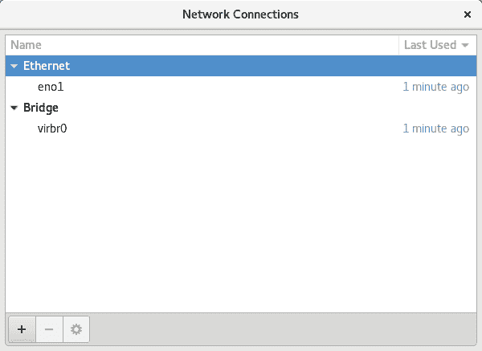
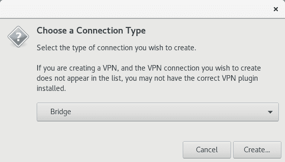
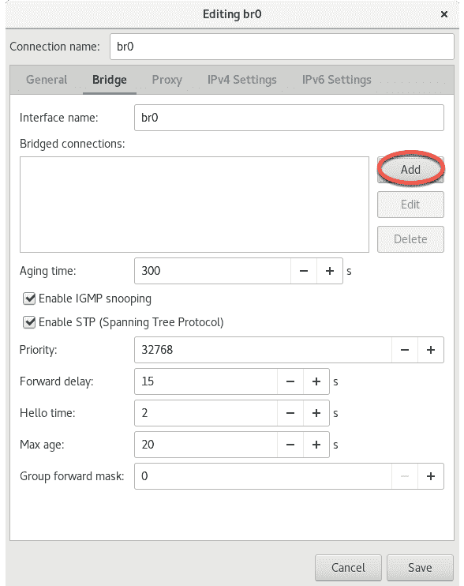
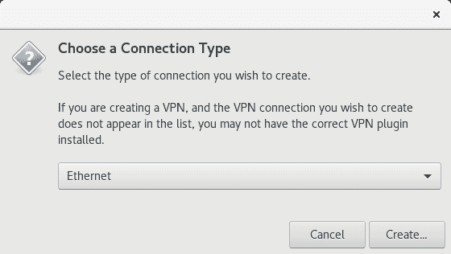
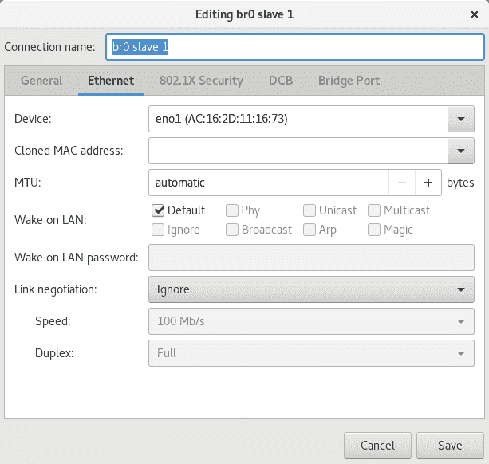
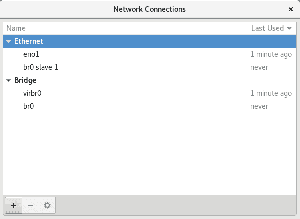

23\. 创建 CentOS 8 KVM 网络桥接接口

默认情况下，CentOS 8 上的 KVM 虚拟化环境会创建一个虚拟网络，虚拟机可以连接到这个网络。也可以使用 MacVTap 驱动程序配置直接连接，尽管正如在名为“虚拟化技术概述”的章节中所概述的那样，这种方法不允许主机和客户系统进行通信。

本章的目标是介绍在 CentOS 8 上创建网络桥接的步骤，使客户系统能够共享主机系统的一个或多个物理网络连接，同时允许客户系统和主机系统之间的通信。

在本章的其余部分，我们将介绍配置 CentOS 8 网络桥接的步骤，以便 KVM 基础的客户操作系统使用。

23.1 获取当前网络设置

可以使用 NetworkManager 命令行工具（nmcli）创建网络桥接。NetworkManager 在 CentOS 8 系统上默认安装并启用，负责检测并连接网络设备，同时提供用于管理网络配置的接口。

当前主机系统上的网络连接列表可以如下显示：

# nmcli con show

NAME UUID TYPE DEVICE

eno1 99d40009-6bb1-4182-baad-a103941c90ff 以太网 eno1

virbr0 7cb1265e-ffb9-4cb3-aaad-2a6fe5880d38 桥接 virbr0

在上述输出中，我们可以看到主机通过名为 eno1 的设备建立了以太网连接，默认的桥接接口 virbr0 提供对基于 NAT 的虚拟网络的访问，该虚拟网络是 KVM 客户系统默认连接的网络。

同样，以下命令可以用来识别当前系统上配置的设备（包括虚拟和物理设备）：

# nmcli device show

GENERAL.DEVICE: eno1

GENERAL.TYPE: 以太网

GENERAL.HWADDR: AC:16:2D:11:16:73

GENERAL.MTU: 1500

GENERAL.STATE: 100（已连接）

GENERAL.CONNECTION: eno1

GENERAL.CON-PATH: /org/freedesktop/NetworkManager/ActiveConnection/1

WIRED-PROPERTIES.CARRIER: on

IP4.ADDRESS[1]: 192.168.86.59/24

IP4.GATEWAY: 192.168.86.1

IP4.ROUTE[1]: dst = 0.0.0.0/0, nh = 192.168.86.1, mt = 100

IP4.ROUTE[2]: dst = 192.168.86.0/24, nh = 0.0.0.0, mt = 100

IP4.DNS[1]: 192.168.86.1

IP4.DOMAIN[1]: lan

IP6.ADDRESS[1]: fe80::6deb:f739:7d67:2242/64

IP6.GATEWAY: --

IP6.ROUTE[1]: dst = fe80::/64, nh = ::, mt = 100

IP6.ROUTE[2]: dst = ff00::/8, nh = ::, mt = 256, table=255

GENERAL.DEVICE: virbr0

GENERAL.TYPE: bridge

GENERAL.HWADDR: 52:54:00:59:30:22

GENERAL.MTU: 1500

GENERAL.STATE: 100（已连接）

GENERAL.CONNECTION: virbr0

GENERAL.CON-PATH: /org/freedesktop/NetworkManager/ActiveConnection/2

IP4.ADDRESS[1]: 192.168.122.1/24

IP4.GATEWAY: --

IP4.ROUTE[1]: dst = 192.168.122.0/24, nh = 0.0.0.0, mt = 0

IP6.GATEWAY: --

.

.

上述部分输出表明，执行命令的主机系统包含一个物理以太网设备（eno1）和虚拟桥接（virbr0）。

也可以使用 virsh 命令列出当前系统上配置的虚拟网络：

# virsh net-list --all

Name State Autostart

-----------------------------------------

default active yes

此时，唯一存在的虚拟网络是 virbr0 提供的默认网络。现在已经获得了当前网络配置的基本信息，下一步是创建一个连接到物理网络设备（在此案例中是 eno1 设备）的网络桥接。

23.2 从命令行创建网络桥接

创建网络桥接的第一步是将新的连接添加到网络配置中。这可以通过 nmcli 工具来实现，指定连接类型为桥接，并为连接和接口提供名称：

# nmcli con add ifname br0 type bridge con-name br0

一旦连接被添加，就需要在物理设备 eno1（从设备）和桥接连接 br0（主设备）之间建立桥接从属接口，命令如下：

# nmcli con add type bridge-slave ifname eno1 master br0

此时，NetworkManager 连接列表应显示如下内容：

# nmcli con show

NAME UUID TYPE DEVICE

eno1 66f0abed-db43-4d79-8f5e-2cbf8c7e3aff ethernet eno1

virbr0 0fa934d5-0508-47b7-a119-33a232b03f64 bridge virbr0

br0 59b6631c-a283-41b9-bbf9-56a60ec75653 bridge br0

bridge-slave-eno1 395bb34b-5e02-427a-ab31-762c9f878908 ethernet --

下一步是启动桥接接口。如果桥接配置是在网络连接（即通过 SSH）中执行的，这一步可能会出现问题，因为在启动桥接连接之前，当前的 eno1 连接必须先关闭。这意味着在启用桥接连接以替代当前连接之前，当前连接将会丢失，可能会导致远程主机无法访问。

如果你是通过远程访问主机系统，可以通过创建一个 Shell 脚本来执行网络更改，从而避免这个问题。这样可以确保在 eno1 接口关闭后，桥接接口被启用，使你在更改完成后能够重新连接到主机。首先创建一个名为 bridge.sh 的 Shell 脚本文件，包含以下命令：

#!/bin/bash

nmcli con down eno1

nmcli con up br0

一旦脚本被创建，可以按以下方式执行它：

# sh ./bridge.sh

当脚本执行时，eno1 连接会被关闭，连接将会丢失。然而，等待几秒钟后，应该可以在 br0 连接激活后重新连接到主机。

如果你是在主机上本地工作，可以在终端窗口中运行这两个 nmcli 命令，不会有丢失连接的风险：

# nmcli con down eno1

# nmcli con up br0

一旦桥接启动并运行，连接列表现在应该包括桥接和桥接从属连接：

# nmcli con show

NAME UUID TYPE DEVICE

br0 59b6631c-a283-41b9-bbf9-56a60ec75653 bridge br0

bridge-slave-eno1 395bb34b-5e02-427a-ab31-762c9f878908 ethernet eno1

virbr0 0fa934d5-0508-47b7-a119-33a232b03f64 bridge virbr0

eno1 66f0abed-db43-4d79-8f5e-2cbf8c7e3aff ethernet --

请注意，eno1 连接仍然列出，但实际上已经不再处于活动状态。要将非活动连接从列表中排除，只需在请求列表时使用--active 标志：

# nmcli con show --active

NAME UUID TYPE DEVICE

br0 c2fa30cb-b1a1-4107-80dd-b1765878ab4f bridge br0

bridge-slave-eno1 21e8c945-cb94-4c09-99b0-17af9b5a7319 ethernet eno1

virbr0 a877302e-ea02-42fe-a3c1-483440aae774 bridge virbr0

23.3 声明 KVM 桥接网络

此时，桥接连接已存在于系统中，但对 KVM 环境不可见。运行 virsh 命令仍然应该将默认网络列为唯一可用的网络选项：

# virsh net-list --all

Name State Autostart Persistent

----------------------------------------------------------

default active yes yes

在虚拟机可以使用桥接之前，必须声明并将其添加到 KVM 网络配置中。这涉及到创建一个定义文件，再次使用 virsh 命令行工具。

首先创建一个名为 bridge.xml 的桥接网络定义文件，内容如下：

<network>

<name>br0</name>

<forward mode="bridge"/>

<bridge name="br0" />

</network>

接下来，使用该文件定义新的网络：

# virsh net-define ./bridge.xml

一旦网络定义完成，启动它，并根据需要配置其在每次系统重启时自动启动：

# virsh net-start br0

# virsh net-autostart br0

再次列出网络，验证桥接网络现在是否可以在 KVM 环境中访问：

# virsh net-list --all

Name State Autostart Persistent

----------------------------------------------------------

br0 active yes yes

default active yes yes

23.4 在虚拟机中使用桥接网络

要创建一个使用桥接网络的虚拟机，使用 virt-install --network 选项并指定 br0 桥接名称。例如：

# virt-install --name MyFedora --memory 1024 --disk path=/tmp/myFedora.img,size=10 --network network=br0 --os-variant fedora29 --cdrom /home/demo/Downloads/Fedora-Server-dvd-x86_64-29-1.2.iso

当客户操作系统运行时，它将与主机系统处于同一物理网络，并且不再处于基于 NAT 的虚拟网络中。

要修改现有虚拟机以使其使用桥接，使用 virsh edit 命令。该命令将 XML 定义文件加载到编辑器中，可以在其中进行更改并保存：

# virsh edit GuestName

默认情况下，文件将加载到 vi 编辑器中。要使用其他编辑器，只需更改$EDITOR 环境变量，例如：

# export EDITOR=gedit

要从默认的虚拟网络进行更改，请找到文件中的 <interface> 部分，对于基于 NAT 的配置，它应如下所示：

<interface type='network'>

<mac address='<your mac address here>'/>

<source network='default'/>

<model type='virtio'/>

<address type='pci' domain='0x0000' bus='0x01' slot='0x00' function='0x0'/>

</interface>

或者，如果虚拟机使用的是直接连接，则该条目可能如下所示：

<interface type='direct'>

<mac address='<your mac address here>'/>

<source dev='eno1' mode='vepa'/>

<model type='virtio'/>

<address type='pci' domain='0x0000' bus='0x01' slot='0x00' function='0x0'/>

要使用桥接功能，在保存文件之前，请将源网络属性更改为如下所示：

<interface type='network'>

<mac address='<your mac address here>'/>

<source network='br0'/>

<model type='virtio'/>

<address type='pci' domain='0x0000' bus='0x01' slot='0x00' function='0x0'/>

</interface>

如果虚拟机已经在运行，变更将需要重启才能生效。

23.5 使用 nm-connection-editor 创建桥接网络

如果主机系统上提供了本地或远程桌面访问，则大部分桥接配置过程可以使用 nm-connection-editor 图形工具完成。要使用此工具，请在桌面内打开一个终端窗口并输入以下命令：

# nm-connection-editor

当工具加载完毕时，显示的窗口将列出当前配置的网络连接（基本上与执行 nmcli con show 命令生成的输出相同），如图 23-1 所示：

图 23-1

要创建新的连接，请点击窗口左下角的‘+’按钮。在弹出的对话框中（图 23-2），从菜单中选择 Bridge 选项：

图 23-2

选择桥接选项后，点击创建...按钮进入桥接配置屏幕。首先，将连接和接口名称字段都更改为 br0，然后点击位于桥接连接列表右侧的添加按钮，如图 23-3 所示：

图 23-3

在连接类型对话框中（图 23-4），将菜单设置更改为以太网，然后点击创建...按钮：

图 23-4

现在会出现另一个对话框，需要在其中配置桥接从属连接。在此对话框中，从设备菜单中选择要连接的物理网络（例如 eno1）：

图 23-5

点击“保存”按钮以应用更改，并返回编辑 br0 对话框（如上图 图 23-3 所示）。在该对话框内，点击“保存”按钮以创建桥接。在返回主窗口后，新的桥接和从属连接应当列出：

图 23-6

剩下的就是按照上一章中概述的步骤，关闭原来的 eno1 连接并启动 br0 连接（如果主机是远程访问的，请记得在 shell 脚本中执行这些步骤）：

# nmcli con down eno1

# nmcli con up br0

同样，就像使用命令行工具创建桥接时一样，还需要将该桥接添加到 KVM 网络配置中。为此，只需重复上一节中名为 “声明 KVM 桥接网络” 的步骤。一旦完成此步骤，桥接就可以供客户虚拟机使用。

23.6 小结

默认情况下，KVM 虚拟机连接到一个虚拟网络，该网络使用 NAT 提供主机系统连接的网络访问。如果需要让客户虚拟机使用自己的 IP 地址出现在网络上，则需要配置虚拟机共享主机系统的物理网络接口。如本章所述，可以使用 nmcli 或 nm-connection-editor 工具来创建一个网络桥接接口。
