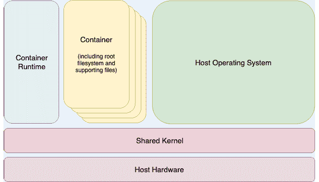

25. Linux 容器简介

前几章介绍了虚拟化的概念，特别强调了使用 KVM 创建和管理虚拟机。本章将介绍与之相关的技术——Linux 容器。尽管虚拟机和容器之间有一些相似之处，但也有一些关键区别，本章将概述这些区别，并介绍 Linux 容器的概念和优势。本章还将提供一些 CentOS 8 容器管理工具的概览。在本章介绍完容器的基本知识后，下一章将通过一些实际示例讲解如何在 CentOS 8 上创建和运行容器。

25.1 Linux 容器和内核共享

简单来说，Linux 容器可以被看作是虚拟化的一种轻量级替代方案。在虚拟化环境中，会创建一个虚拟机，虚拟机中包含并运行整个来宾操作系统。虚拟机又运行在像是虚拟机管理程序（hypervisor）之类的环境上，管理对宿主系统物理资源的访问。

容器通过使用一个被称为内核共享的概念来工作，这一概念利用了 Linux 和 UNIX 基础操作系统的架构设计。

为了理解内核共享和容器是如何工作的，首先需要理解 Linux 或 UNIX 操作系统的两个主要组件。在操作系统的核心部分是内核。简单来说，内核处理操作系统与物理硬件之间的所有交互。第二个关键组件是根文件系统，它包含操作系统正常运行所需的所有库、文件和工具。利用这一结构，容器每个都有自己的根文件系统，但共享宿主操作系统的内核。这个结构在下图中的图 25-1 架构图中有所展示。

这种资源共享得以实现，是因为内核能够动态地将当前的根文件系统（这一概念被称为 change root 或 chroot）更改为不同的根文件系统，而不需要重启整个系统。Linux 容器本质上是这种能力的扩展，并结合了容器运行时，后者的职责是为在宿主系统上执行和管理容器提供接口。现有多个容器运行时可供选择，包括 Docker、lxd、containerd 和 CRI-O。早期版本的 CentOS 默认使用 Docker，但在 CentOS 8 中，Docker 已被 Podman 替代，成为默认选项。

图 25-1

25.2 容器的用途与优势

容器的主要优势在于，它们比虚拟化占用的资源开销要少得多，因此可以在单台服务器上同时运行多个容器实例，并且可以快速高效地根据需求的变化启动和停止容器。容器原生运行在主机系统上，提供了虚拟机无法比拟的性能水平。

容器还具有极高的可移植性，可以在系统之间快速轻松地迁移。当与容器管理系统（如 Docker、OpenShift 和 Kubernetes）结合使用时，可以在多个服务器和云平台之间大规模部署和管理容器，潜在地运行数千个容器。

容器常用于为应用程序创建轻量级的执行环境。在这种情况下，每个容器提供一个隔离的环境，其中包含应用程序以及应用程序运行所需的所有运行时和支持文件。容器可以部署到任何支持容器执行的兼容主机系统上，并且无需担心目标系统是否具有应用程序所需的运行时配置——应用程序的所有依赖项都已包含在容器中。

容器还在弥合开发环境和生产环境之间的差距时发挥作用。通过在容器中进行开发和质量保证工作，这些容器随后可以传递到生产环境中，并且可以放心地启动，因为应用程序在与开发和测试过程中相同的容器环境中运行。

容器还促进了以模块化方式部署大型复杂解决方案的方式。容器可以被用来将应用程序设计为一组相互作用的模块，而不是作为单一的庞大实体，每个模块都运行在一个独立的容器中。

容器的一个潜在缺点是，客户操作系统必须与共享的内核版本兼容。例如，无法在 Linux 系统上的容器中运行 Microsoft Windows。也不能让设计为 2.6 版本内核的 Linux 客户系统共享 2.4 版本内核。然而，这些要求并不是容器设计的初衷。因此，这些限制不应被视为局限性，而应当看作是容器在提供简单、可扩展和可靠的部署平台方面的一些关键优势。

25.3 CentOS 8 容器工具

CentOS 8 提供了多种用于创建、检查和管理容器的工具。主要工具如下：

•buildah – 一款用于构建容器镜像的命令行工具。

•podman – 一款基于命令行的容器运行时和管理工具。执行从远程注册表下载容器镜像、检查、启动和停止镜像等任务。

•skopeo – 一个命令行工具，用于转换容器镜像、在注册表之间复制镜像以及检查存储在注册表中的镜像，无需下载它们。

•runc – 一个轻量级的容器运行时，用于从命令行启动和运行容器。

•OpenShift – 一个企业级容器应用管理平台，包含命令行工具和基于 Web 的工具。

上述所有工具都符合开放容器倡议（Open Container Initiative，OCI），该倡议是一组规范，旨在确保容器在不同的工具和平台之间遵循相同的标准。

25.4 Docker 注册表

尽管 CentOS 提供了一组旨在替代 Docker 提供的工具，这些工具仍然需要访问 CentOS 镜像，以便在构建容器时使用。为此，CentOS 项目在 Docker Hub 中维护了一组 CentOS 容器镜像。Docker Hub 是一个在线容器注册表，由多个仓库组成，每个仓库包含一系列可用于构建容器时下载的容器镜像。仓库中的每个镜像都分配了一个仓库标签（例如，centos8、centos7.7、latest 等），该标签可以在执行镜像下载时引用。例如，以下是 Docker Hub 中 centos8 镜像的 URL：

docker://docker.io/library/centos:centos8

除了从 Docker 和其他第三方主机注册表下载（在容器术语中称为“拉取”）容器镜像外，你还可以使用注册表存储自己的镜像。这可以通过托管自己的注册表，或利用 Docker、Amazon AWS、Google Cloud、Microsoft Azure 和 IBM Cloud 等现有服务来实现，以上仅列举了众多选项中的一些。

25.5 容器网络

默认情况下，容器通过容器网络接口（Container Networking Interface，CNI）桥接网络堆栈连接到网络。在桥接配置中，服务器上运行的所有容器都属于同一子网（默认为 10.88.0.0/16），因此，它们能够相互通信。容器还通过桥接宿主系统的网络连接与外部网络连接。同样，宿主机也可以通过虚拟网络接口（通常命名为 cni0）访问容器，该接口会在容器工具安装时创建。

25.6 总结

Linux 容器提供了一种轻量级的虚拟化替代方案，并充分利用了 Linux 和 Unix 操作系统的结构。Linux 容器本质上共享宿主操作系统的内核，每个容器都有自己的根文件系统，包含文件、库和应用程序。容器具有高效性和可扩展性，是构建和部署模块化企业级解决方案的理想平台。现在有许多工具和平台可用于构建、部署和管理容器，包括第三方解决方案和 CentOS 提供的工具。
