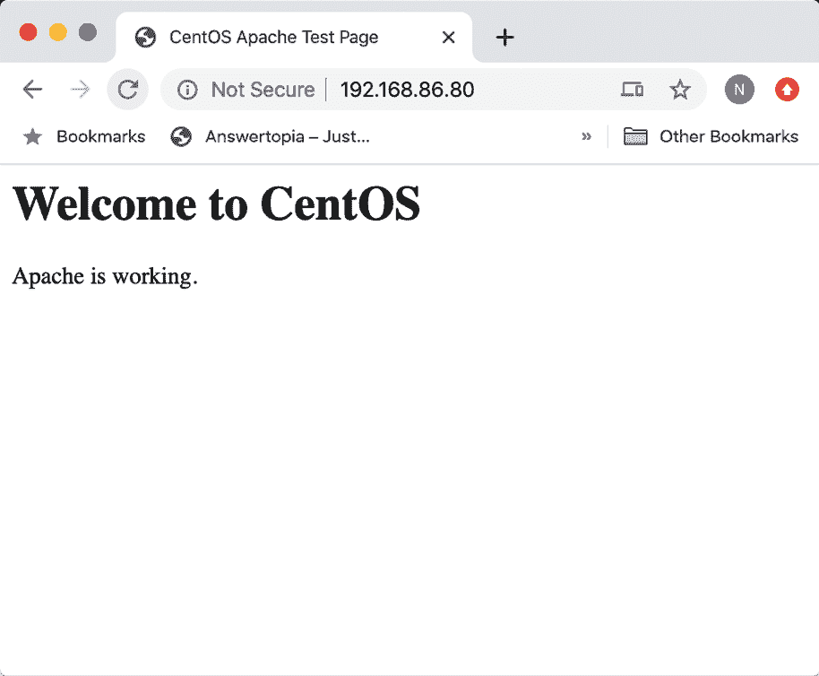
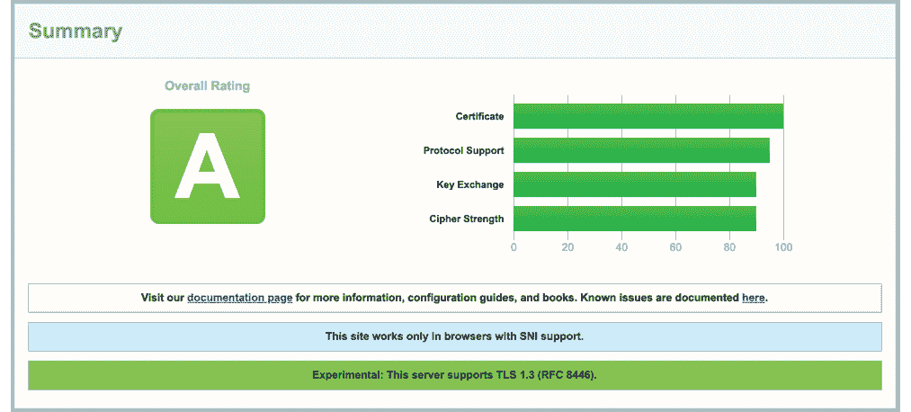
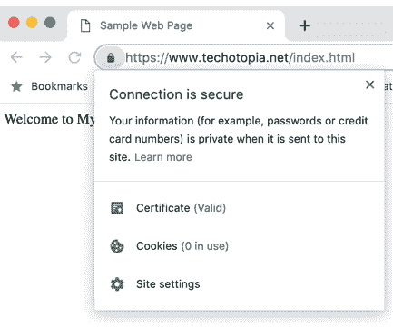

27. 设置 CentOS 8 Web 服务器

CentOS 8 操作系统中包含了 Apache Web 服务器等多个软件包。事实上，CentOS 8 的可扩展性和弹性使其成为托管即使是流量最密集的网站的理想平台。

在本章中，我们将解释如何配置 CentOS 8 系统，使用 Apache 作为 Web 服务器，包括安全（HTTPS）和不安全（HTTP）配置。

27.1 配置 CentOS 8 Web 服务器的要求

要设置你自己的网站，你需要一台计算机（或云服务器实例）、操作系统、Web 服务器、域名、名称服务器和 IP 地址。

在操作系统方面，我们将假设你使用的是 CentOS 8。如前所述，CentOS 8 支持 Apache Web 服务器，一旦操作系统安装并运行起来，便可以轻松安装 Apache Web 服务器。域名可以通过任何域名注册服务进行注册。

如果你在云实例上运行 CentOS 8，提供商分配的 IP 地址将显示在服务器概览信息中。如果你托管自己的服务器，并且互联网服务提供商（ISP）分配了静态 IP 地址，则需要将域名与该地址关联。这是通过名称服务器来实现的，所有域名注册服务都会为你提供此服务。

如果你没有静态 IP 地址（即你的 ISP 提供给你的是动态地址，且频繁变化），那么你可以使用一些免费的动态 DNS（DDNS 或 DynDNS）服务，这些服务将你的动态 IP 地址映射到你的域名。

一旦你配置好域名和名称服务器，下一步就是安装和配置你的 Web 服务器。

27.2 安装 Apache Web 服务器软件包

当前版本的 CentOS 通常默认不安装 Apache Web 服务器。要检查服务器是否已安装，可以运行以下命令：

# 第二十六章：rpm -q httpd

如果 rpm 生成的输出类似于以下内容，则表示 Apache 服务器已安装：

httpd-2.4.35-6.el8+2089+57a79027.x86_64

或者，如果 rpm 生成了“未安装 httpd 包”的消息，那么显然，接下来的步骤是安装它。要安装 Apache，请在命令提示符下运行以下命令：

# dnf install httpd

27.3 配置防火墙

在启动和测试 Apache Web 服务器之前，需要修改防火墙，允许 Web 服务器与外界通信。默认情况下，HTTP 和 HTTPS 协议分别使用 80 和 443 端口，因此，根据使用的协议，需要打开这两个端口中的一个或两个。在打开端口时，请务必指定适用于面向互联网的网络连接的防火墙区域：

# firewall-cmd --permanent --zone=<zone> --add-port=80/tcp

# firewall-cmd --permanent --zone=<zone> --add-port=443/tcp

在打开必要的端口之后，确保重新加载防火墙设置：

# firewall-cmd --reload

对于云托管的服务器，可能还需要在云控制台中为服务器实例启用相应的端口。请查阅云服务提供商的文档，了解如何进行此操作。

27.4 端口转发

如果托管 Web 服务器的 CentOS 8 系统位于受防火墙保护的网络中（无论是由另一台计算机运行防火墙，还是由包含内置防火墙保护的路由器或无线基站），你需要配置防火墙，将 80 端口和/或 443 端口转发到你的 Web 服务器系统。不同防火墙和设备的配置方式有所不同，因此请查阅相关文档了解如何配置端口转发。

27.5 启动 Apache Web 服务器

一旦安装了 Apache 服务器并配置了防火墙，下一步是验证服务器是否正在运行，并在必要时启动它。

要通过命令行检查 Apache httpd 服务的状态，请在命令提示符下输入以下命令：

# systemctl status httpd

如果上述命令显示 httpd 服务未运行，可以通过命令行启动该服务，方法如下：

# systemctl start httpd

如果你希望 Apache httpd 服务在系统启动时自动启动，可以运行以下命令：

# systemctl enable httpd

27.6 测试 Web 服务器

安装完成后，下一步是验证 Web 服务器是否已启动并运行。

第一步是向默认的 Web 网站文件夹添加一个文件。在终端窗口中，切换到 /var/www/html 目录，并创建一个名为 index.html 的新文件，文件内容如下：

<html>

<title>CentOS Apache 测试页面</title>

<body>

<h1>欢迎来到 CentOS</h1>

Apache 正在运行。

</body>

</html>

如果你可以访问服务器的桌面环境（无论是本地还是远程），只需启动浏览器并在地址栏输入 http://127.0.0.1（127.0.0.1 是回送网络地址，表示系统连接到本地计算机）。如果一切设置正确，浏览器应该加载显示在图 27-1 中的页面：

图 27-1

如果桌面环境不可用，可以从同一局域网内的其他系统连接，或者如果服务器托管在远程位置，可以使用分配给系统的外部 IP 地址进行连接。

27.7 为你的域名配置 Apache Web 服务器

设置 Web 服务器的下一步是为你的域名配置服务器。首先通过进入 /etc/httpd 目录开始配置 Web 服务器，该目录包含多个子目录。进入 conf 子目录，你会找到一个名为 httpd.conf 的文件，该文件包含 Apache 服务器的配置设置。

使用你偏好的编辑器并以超级用户权限编辑 httpd.conf 文件，确保你对该文件具有写入权限。加载文件后，需要更改多个设置，以匹配你的环境。

配置 Apache 以支持特定域名的最常见方法是向 httpd.conf 文件中添加虚拟主机条目。这样做的好处是，单个 Apache 服务器可以通过为每个站点域名添加一个虚拟主机条目，支持多个网站。在 httpd.conf 文件中，添加你域名的虚拟主机条目，如下所示：

<VirtualHost *:80>

ServerAdmin feedback@myexample.com

ServerName www.myexample.com

DocumentRoot /var/www/myexample

ErrorLog logs/myexample_error_log

CustomLog logs/myexample_access_log combined

</VirtualHost>

上述虚拟主机条目中的 ServerAdmin 指令定义了一个管理员电子邮件地址，供希望联系你网站的站长的人使用。请将其更改为一个合适的电子邮件地址，以便别人可以联系到你。

接下来，声明 ServerName，以便 Web 服务器知道与此虚拟主机关联的域名。

由于服务器支持的每个网站都有自己的文件集，DocumentRoot 设置用于指定该网站域名的文件位置。传统上，使用/var/www/域名，例如：

DocumentRoot /var/www/myexample

最后，添加访问历史记录和错误日志文件的条目。

按照 httpd.conf 文件中的声明，创建/var/www/<域名>目录，并在其中放置一个包含基本 HTML 的 index.html 文件。例如：

<html>

<title>示例网页</title>

<body>

欢迎访问 MyExample.com

</body>

</html>

最后一步是重新启动 httpd 服务，确保它加载新的设置：

# systemctl restart httpd

最后，打开浏览器窗口，使用域名而不是 IP 地址访问站点，检查服务器配置是否工作正常。加载的网页应该是上述创建的 index.html 文件中定义的页面。

27.8 安全网站的基础

本章中创建的 Web 服务器和网站使用 HTTP 协议在 80 端口上运行，因此被认为是不安全的。问题在于，Web 服务器与客户端（通常是用户的 Web 浏览器）之间的流量是以明文传输的。换句话说，数据没有加密，容易被截获。虽然对于一般的 Web 浏览而言这不是问题，但在执行诸如登录网站或传输敏感信息（如身份或信用卡信息）等任务时，这是一个严重的弱点。

现在，网站通常要求使用 HTTPS，它使用安全套接层（SSL）或传输层安全性（TLS）来建立 Web 服务器与客户端之间的安全加密通信。这种安全性通过使用公钥、私钥和会话加密以及证书来建立。

为支持 HTTPS，网站必须具有由可信的证书颁发机构（Certificate Authority, CA）颁发的证书。当浏览器连接到一个安全的网站时，web 服务器会返回该网站的 SSL 证书副本，其中也包含该站点的公钥副本。浏览器随后会验证该证书的真实性，并通过受信的证书颁发机构进行验证。

如果证书被验证为有效，浏览器将使用服务器发送的公钥来加密会话密钥并将其传送给服务器。服务器使用私钥解密会话密钥，并用它向浏览器发送加密确认。一旦此过程完成，浏览器和服务器将使用会话密钥来加密所有后续数据传输，直到会话结束。

27.9 配置 Apache 以支持 HTTPS

默认情况下，Apache 服务器不包含实现安全 HTTPS 网站所需的模块。因此，第一步是按照以下方式在服务器系统上安装 Apache 的 mod_ssl 模块：

# dnf install mod_ssl

安装完成后，重启 httpd 以将新模块加载到 Apache 服务器中：

# systemctl restart httpd

使用以下命令检查模块是否已加载到服务器中：

# apachectl -M | grep ssl_module

ssl_module (shared)

假设模块已安装，下一步是为网站生成 SSL 证书。

27.10 获取 SSL 证书

网站的证书必须从证书颁发机构（Certificate Authority）获取。市面上有多种选择，价格不一。然而，最好的选择是从 Let's Encrypt 获取免费的证书，网址如下：

https://letsencrypt.org/

从 Let’s Encrypt 获取证书的过程只需要安装并运行 Certbot 工具。该工具会扫描服务器上的 httpd.conf 文件，并提供为系统中配置的任何虚拟主机生成证书的选项。然后，它会生成证书并在 Apache 配置中为相应网站添加虚拟主机条目。

按照 Let’s Encrypt 网站上的步骤，在你的 CentOS 8 系统上下载并安装 Certbot，然后按照以下方式运行 certbot 工具生成并安装证书：

# certbot --apache

在请求电子邮件地址并接受服务条款后，Certbot 将列出在 httpd.conf 文件中找到的域名，并提供选择一个或多个站点来安装证书的选项。然后，Certbot 会在获取和安装证书之前进行一些检查：

你希望为哪些域名启用 HTTPS？

- - - - - - - - - - - - - - - - - - - - - - - - - - - - - - - - - - - - - - - -

1: www.myexample.com

- - - - - - - - - - - - - - - - - - - - - - - - - - - - - - - - - - - - - - - -

选择适当的数字，数字之间用逗号和/或空格分隔，或者保持输入为空

空格选择所有显示的选项（按 ‘c’ 取消）：1

获取新证书

执行以下挑战：

www.myexample.com 的 http-01 挑战

等待验证...

清理挑战

在 /etc/httpd/conf/httpd-le-ssl.conf 创建了一个 SSL 虚拟主机

将证书部署到虚拟主机 /etc/httpd/conf/httpd-le-ssl.conf

通过将 Include 添加到根配置，启用站点 /etc/httpd/conf/httpd-le-ssl.conf

Certbot 还将在 /etc/httpd/conf 目录中创建一个名为 httpd-le-ssl.conf 的新文件，包含为每个生成证书的域名配置的安全虚拟主机条目。以下条目类似：

<IfModule mod_ssl.c>

<VirtualHost *:443>

ServerAdmin feedback@myexample.com

ServerName www.myexample.com

DocumentRoot /var/www/myexample

ErrorLog logs/myexample_error_log

CustomLog logs/myexample_access_log combined

SSLCertificateFile /etc/letsencrypt/live/www.myexample.com/fullchain.pem

SSLCertificateKeyFile /etc/letsencrypt/live/www.myexample.com/privkey.pem

包含 /etc/letsencrypt/options-ssl-apache.conf

</VirtualHost>

</IfModule>

最后，Certbot 会询问是否应该将未来的 HTTP 网络请求重定向到 HTTPS。换句话说，如果用户尝试访问 http://www.myexample.com，web 服务器将把用户重定向到 https://www.myexample.com：

请选择是否将 HTTP 流量重定向到 HTTPS，移除 HTTP 访问。

- - - - - - - - - - - - - - - - - - - - - - - - - - - - - - - - - - - - - - - -

1: 不重定向 - 不对 web 服务器配置做进一步修改。

2: 重定向 - 将所有请求重定向到安全的 HTTPS 访问。选择此项以

新网站，或者如果您确定您的网站已支持 HTTPS。您可以撤销此操作

通过编辑您的 web 服务器配置进行更改。

- - - - - - - - - - - - - - - - - - - - - - - - - - - - - - - - - - - - - - - -

选择适当的数字 [1-2] 然后按 [enter]（按 ‘c’ 取消）：2

如果您当前正在测试 HTTPS 配置，并希望保持 HTTP 版本活跃直到稍后，选择“不重定向”选项。否则，一般建议重定向到 HTTPS。

证书安装完成后，可以在浏览器中通过以下网址测试（将 myexample.com 替换为您自己的域名）：

https://www.ssllabs.com/ssltest/analyze.html?d=www.myexample.com

如果证书配置成功，SSL Labs 报告将提供高评分，如 图 27-2 所示：

图 27-2

最后的测试是，打开一个浏览器窗口并使用 https:// 前缀访问您的域名。页面应与之前一样加载，并且浏览器应显示浏览器与服务器之间的连接是安全的（通常在地址栏显示一个可以点击查看更多信息的挂锁图标）：

图 27-3

27.11 小结

可以通过安装 Apache web 服务器在 CentOS 8 系统上托管网站。CentOS 8 上可以部署不安全的（HTTP）和安全的（HTTPS）网站。安全网站使用安全套接层（SSL）或传输层安全协议（TLS）来通过使用公钥、私钥和会话加密，以及由可信证书颁发机构签发的证书，在 web 服务器和客户端之间建立加密通信。
