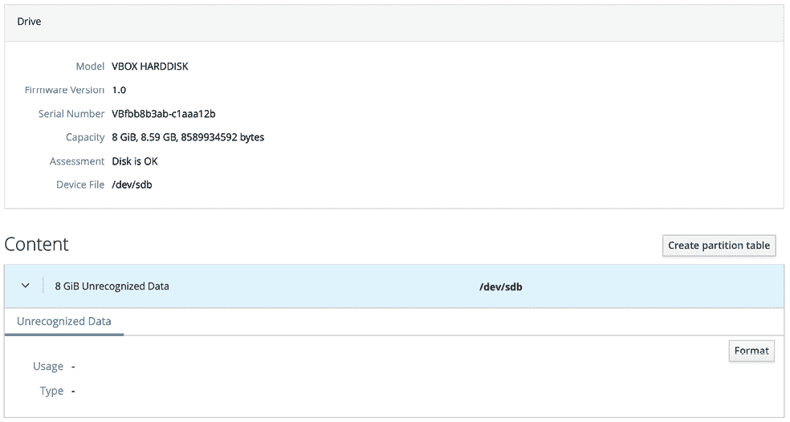

29\. 向 CentOS 8 系统添加新硬盘驱动器

目前用户和系统管理员面临的第一个问题之一是，系统往往会因存储数据的磁盘空间不足而出现问题。幸运的是，磁盘空间现在是最便宜的 IT 商品之一。在接下来的两章中，我们将介绍配置 CentOS 8 以使用新物理或虚拟硬盘驱动器提供的空间所需的步骤。

29.1 挂载的文件系统或逻辑卷

在 CentOS 8 系统上配置新硬盘有两种方法。一种非常简单的方法是，在新硬盘上创建一个或多个 Linux 分区，在这些分区上创建 Linux 文件系统，然后将它们挂载到特定的挂载点，以便访问。此方法将在本章中进行讲解。

另一种方法是将新空间添加到现有的卷组中，或创建一个新的卷组。当 CentOS 8 安装时，会创建一个名为 cl 的卷组。在该卷组中，有三个逻辑卷，分别命名为 root、home 和 swap，用于存储 / 和 /home 文件系统以及交换分区。通过将新硬盘配置为卷组的一部分，我们可以增加现有逻辑卷的磁盘空间。因此，我们可以通过将新硬盘上的部分或全部空间分配给 home 卷，来增大 /home 文件系统的大小。这个话题将在《向 CentOS 8 卷组和逻辑卷添加新硬盘》中详细讨论。

29.2 查找新硬盘

本教程假设系统已安装新物理或虚拟硬盘，并且该硬盘对操作系统可见。添加后，操作系统应自动检测到新硬盘。通常，系统中的硬盘驱动器会分配以 hd 或 sd 开头的设备名称，后跟一个字母表示设备编号。例如，第一个设备可能是 /dev/sda，第二个设备是 /dev/sdb，依此类推。

以下是只有一个硬盘驱动器连接到 SATA 控制器的系统输出：

# ls /dev/sd*

/dev/sda /dev/sda1 /dev/sda2

这显示了由 /dev/sda 表示的硬盘驱动器被分为 2 个分区，分别由 /dev/sda1 和 /dev/sda2 表示。

以下输出来自同一系统，在安装了第二个硬盘驱动器后：

# ls /dev/sd*

/dev/sda /dev/sda1 /dev/sda2 /dev/sdb

如上所示，新硬盘已被分配到设备文件 /dev/sdb。目前该驱动器没有显示任何分区（因为我们尚未创建任何分区）。

此时，我们可以选择在新磁盘上创建分区和文件系统并将其挂载以便访问，或者将该磁盘作为物理卷添加到卷组中。若要执行前者，请继续阅读本章，否则请阅读“将新磁盘添加到 CentOS 8 卷组和逻辑卷”，了解配置逻辑卷的详细信息。

29.3 创建 Linux 分区

下一步是在新磁盘上创建一个或多个 Linux 分区。这是通过使用 fdisk 工具来实现的，fdisk 工具接受一个命令行参数，该参数指定要分区的设备：

# fdisk /dev/sdb

欢迎使用 fdisk（util-linux 2.32.1）。

更改将仅保留在内存中，直到您决定写入它们。

在使用写入命令之前要小心。

设备不包含可识别的分区表。

创建了一个新的 DOS 磁盘标签，磁盘标识符为 0xbd09c991。

命令（输入 m 以获取帮助）：

为了查看磁盘上的当前分区，请输入 p 命令：

命令（输入 m 以获取帮助）：p

磁盘 /dev/sdb：8 GiB，8589934592 字节，16777216 个扇区

单位：1 * 512 = 512 字节的扇区

扇区大小（逻辑/物理）：512 字节 / 512 字节

I/O 大小（最小/最佳）：512 字节 / 512 字节

磁盘标签类型：dos

磁盘标识符：0xbd09c991

从上面的 fdisk 输出可以看出，该磁盘目前没有分区，因为它是一个以前未使用的磁盘。下一步是在磁盘上创建一个新分区，操作方法是输入 n（表示新分区）和 p（表示主分区）：

命令（输入 m 以获取帮助）：n

分区类型

p 主分区（0 主分区，0 扩展分区，4 空闲）

e 扩展分区（逻辑分区的容器）

选择（默认 p）：p

分区号（1-4，默认 1）：

在这个例子中，我们只打算创建一个分区，即分区 1。接下来，我们需要指定分区的起始和结束位置。由于这是第一个分区，我们需要它从第一个可用扇区开始，并且由于我们希望使用整个磁盘，我们将最后一个扇区作为结束位置。请注意，如果您希望创建多个分区，可以通过扇区、字节、千字节或兆字节来指定每个分区的大小。

分区号（1-4，默认 1）：1

第一个扇区（2048-16777215，默认 2048）：

最后一个扇区，+扇区数或+大小{K,M,G,T,P}（2048-16777215，默认 16777215）：

创建了一个新的类型为‘Linux’、大小为 8 GiB 的分区 1。

命令（输入 m 以获取帮助）：

现在我们已经指定了分区，我们需要使用 w 命令将其写入磁盘：

命令（输入 m 以获取帮助）：w

分区表已更改。

正在调用 ioctl()以重新读取分区表。

正在同步磁盘。

如果我们现在再次查看设备，我们会看到新的分区显示为/dev/sdb1：

# ls /dev/sd*

/dev/sda /dev/sda1 /dev/sda2 /dev/sdb /dev/sdb1

下一步是在我们新创建的分区上创建文件系统。

29.4 在 CentOS 8 磁盘分区上创建文件系统

我们现在安装了一块新磁盘，它对 CentOS 8 是可见的，我们已经在该磁盘上配置了一个 Linux 分区。接下来的步骤是在该分区上创建一个 Linux 文件系统，以便操作系统可以使用它来存储文件和数据。创建文件系统的最简单方法是使用 mkfs.xfs 工具：

# mkfs.xfs /dev/sdb1

meta-data=/dev/sdb1 isize=512 agcount=4, agsize=524224 blks

= sectsz=512 attr=2, projid32bit=1

= crc=1 finobt=1, sparse=1, rmapbt=0

= reflink=1

data = bsize=4096 blocks=2096896, imaxpct=25

= sunit=0 swidth=0 blks

naming =version 2 bsize=4096 ascii-ci=0, ftype=1

log =internal log bsize=4096 blocks=2560, version=2

= sectsz=512 sunit=0 blks, lazy-count=1

realtime =none extsz=4096 blocks=0, rtextents=0

在这种情况下，我们创建了一个 XFS 文件系统。XFS 是一个高性能文件系统，是 CentOS 8 上的默认文件系统类型，并且在并行 I/O 性能和使用日志记录方面具有许多优势。

29.5 日志记录文件系统概述

日志记录文件系统会保留一个日志，记录在磁盘写入过程中对文件系统所做的更改，可以用来快速重建由于系统崩溃或断电等事件导致的文件系统损坏。

使用日志记录文件系统有很多优点。随着时间的推移，存储在磁盘驱动器上的数据的大小和数量呈指数增长。非日志记录文件系统的问题是，在发生崩溃后，必须运行 fsck（文件系统一致性检查）工具。fsck 工具会扫描整个文件系统，验证所有条目，并确保块被正确分配和引用。如果发现损坏的条目，它会尝试修复问题。这里有两个问题。首先，fsck 工具并不总是能够修复损坏，结果会将数据存放在 lost+found 目录中。这些数据曾被某个应用程序使用，但系统不再知道它来自哪里。另一个问题是时间问题。在大型文件系统上完成 fsck 过程可能需要很长时间，可能导致不可接受的停机时间。

另一方面，日志记录文件系统会在每次写入时，将信息记录到磁盘上的日志区域（日志和日志本身不需要位于同一设备上）。这本质上是“打算提交”数据到文件系统。日志的记录信息量是可配置的，范围从不记录任何信息，到记录“元数据”（如所有权、时间戳信息等），再到记录“元数据”以及将写入文件的数据块。一旦日志更新，系统会将实际数据写入文件系统的相应区域，并在日志中标记一个条目，表示数据已提交。

在崩溃后，可以使用日志文件快速将文件系统重新上线，从而减少使用 `fsck` 可能需要几分钟的时间，带来的优势是几乎没有数据丢失或损坏的机会。

29.6 挂载文件系统

现在，我们在新磁盘驱动器的 Linux 分区上创建了一个新的文件系统，需要将其挂载以使其可访问和可用。为此，我们需要创建一个挂载点。挂载点只是文件系统将要挂载到其中的目录或文件夹。为了本例子的目的，我们将创建一个 `/backup` 目录以匹配我们的文件系统标签（尽管这些值匹配并非必需）：

# mkdir /backup

然后可以使用 `mount` 命令手动挂载文件系统：

# mount /dev/sdb1 /backup

运行 `mount` 命令而不带任何参数会显示所有当前挂载的文件系统（包括我们的新文件系统）：

# mount

sysfs on /sys type sysfs (rw,nosuid,nodev,noexec,relatime,seclabel)

proc on /proc type proc (rw,nosuid,nodev,noexec,relatime)

.

.

/dev/sdb1 on /backup type xfs (rw,relatime,seclabel,attr2,inode64,noquota)

29.7 配置 CentOS 8 自动挂载文件系统

为了设置系统，使新文件系统在引导时自动挂载，需要向 `/etc/fstab` 文件添加条目。`fstab` 条目的格式如下：

<device> <dir> <type> <options> <dump> <fsck>

这些条目可以总结如下：

•<device> - 文件系统要挂载的设备。

•<dir> - 作为文件系统挂载点的目录。

•<type> - 文件系统类型（xfs、ext4 等）。

•<options> - 额外的文件系统挂载选项，例如使文件系统为只读或控制是否可以由任何用户挂载文件系统。运行 `man mount` 可查看完整的选项列表。将此值设置为 `defaults` 将使用文件系统的默认设置（rw、suid、dev、exec、auto、nouser、async）。

•<dump> - 确定文件系统内容是否包含在由 `dump` 实用程序执行的任何备份中。此设置很少使用，可以通过设置为 0 来禁用。

•<fsck> - 文件系统在系统崩溃后是否由 fsck 检查以及检查顺序。对于像 XFS 这样的日志文件系统，应将此设置为 0，表示不需要检查。

以下示例显示了一个配置自动挂载我们的 `/backup` 分区到 `/dev/sdb1` 分区的 `fstab` 文件：

/dev/mapper/cl-root / xfs defaults 0 0

UUID=b4fc85a1-0b25-4d64-8100-d50ea23340f7 /boot xfs defaults 0 0

/dev/mapper/cl-home /home xfs defaults 0 0

/dev/mapper/cl-swap swap swap defaults 0 0

/dev/sdb1 /backup xfs defaults 0 0

每次系统重新启动时，`/backup` 文件系统都会自动挂载。

29.8 使用 Cockpit 添加磁盘

除了使用本章中概述的命令行工具操作存储外，还可以使用 Cockpit Web 控制台配置新存储设备。要查看当前存储配置，请登录 Cockpit 控制台并选择“存储”选项，如图 29-1 所示：

图 29-1

要查找新添加的存储，请滚动至存储页面底部，直到“驱动器”部分出现：

图 29-2

在上图的情况下，新硬盘是 8 GiB 的硬盘。选择新硬盘以显示如图 29-3 所示的硬盘界面：

图 29-3

点击“创建分区表”按钮，在弹出的对话框中接受默认设置并点击“格式化”按钮：

图 29-4

点击“创建分区”按钮，并使用对话框指定此分区将分配多少空间、文件系统类型（推荐使用 XFS），以及可选的标签、文件系统挂载点和挂载选项。请注意，如果此新分区没有使用所有可用空间，后续可能会在硬盘上添加更多分区。如果需要更改设置，例如文件系统是否为只读或是否在启动时挂载，请将“挂载”菜单选项更改为“自定义”，并调整切换按钮设置：

图 29-5

一旦选择了设置，点击“创建分区”按钮以提交更改。完成创建过程后，新的分区将被添加到磁盘，相关的文件系统将被创建并挂载到指定的挂载点，且/etc/fstab 文件将做出相应的更改。

29.9 小结

本章介绍了如何将额外的物理或虚拟磁盘驱动器添加到现有的 CentOS 8 系统中。这个过程相对简单，主要包括确保操作系统检测到新硬盘、在硬盘上创建一个或多个分区，并在这些分区上创建文件系统。虽然 CentOS 8 上有多种不同的文件系统类型可用，但通常推荐使用 XFS。文件系统准备好后，可以使用`mount`命令进行挂载。为了确保新创建的文件系统在系统启动时自动挂载，可以在/etc/fstab 配置文件中进行相应的添加。
