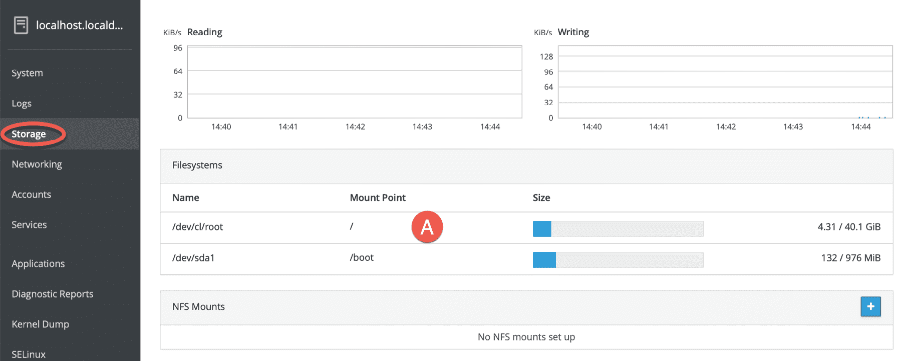
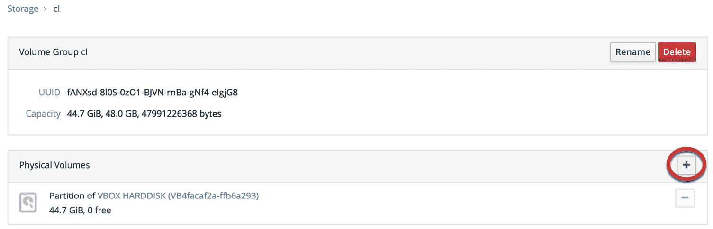
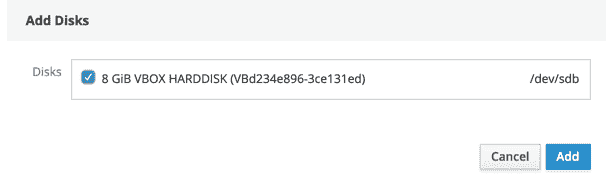
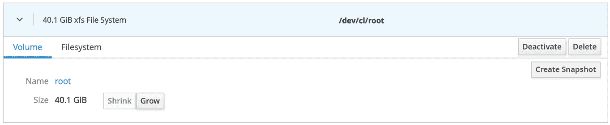
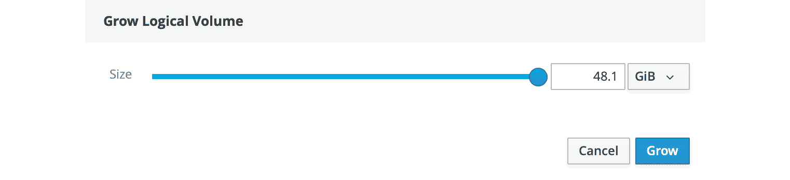

30\. 向 CentOS 8 卷组和逻辑卷添加新磁盘

在上一章中，我们探讨了如何向 CentOS 8 系统添加新硬盘，创建分区和文件系统，然后挂载文件系统以便访问磁盘。创建固定分区和文件系统的替代方案是使用逻辑卷管理（LVM）创建由一个或多个物理磁盘或虚拟磁盘/分区的空间组成的逻辑磁盘。使用 LVM 的好处在于，可以根据需要向逻辑卷添加或移除空间，而无需将数据分散到多个文件系统中。

举个例子，假设我们有一台基于 CentOS 8 的服务器，其根目录（/home）文件系统。没有 LVM 时，操作系统安装时会创建一个特定大小的文件系统。如果安装了新硬盘，则无法将任何空间分配给 /home 文件系统。唯一的选择是创建新的文件系统并将其挂载到特定的挂载点。在这种情况下，你在新文件系统上会有足够的空间，但 /home 文件系统仍然几乎满了。唯一的解决方案是将文件移动到新的文件系统上。而使用 LVM 时，新的磁盘（或其一部分）可以分配给包含根文件系统的逻辑卷，从而动态扩展可用空间。

本章将介绍将新磁盘空间添加到卷组和逻辑卷的步骤，目的是为 CentOS 8 系统的根文件系统添加额外空间。

30.1 逻辑卷管理（LVM）概述

LVM 提供了一种灵活的高级磁盘空间管理方法。不同于将每个磁盘驱动器分割成固定大小的分区，并在这些分区上创建固定大小的文件系统，LVM 提供了一种将磁盘空间聚合成逻辑卷的方式，逻辑卷可以轻松调整大小和移动。此外，LVM 允许管理员通过为不同用户组分配不同的卷组或逻辑卷来精确控制磁盘空间的分配。当最初分配给卷的空间用尽时，管理员可以简单地增加更多空间，而无需将用户文件移动到不同的文件系统中。

LVM 由以下组件组成：

30.1.1 卷组（VG）

卷组是一个高级容器，包含一个或多个逻辑卷和物理卷。

30.1.2 物理卷（PV）

物理卷代表一个存储设备，如磁盘驱动器或其他存储介质。

30.1.3 逻辑卷（LV）

逻辑卷相当于一个磁盘分区，和磁盘分区一样，逻辑卷可以包含文件系统。

30.1.4 物理扩展（PE）

每个物理卷（PV）被划分为大小相等的块，称为物理扩展。

30.1.5 逻辑扩展（LE）

每个逻辑卷（LV）被划分为大小相等的块，这些块称为逻辑扩展。

假设我们正在创建一个名为 VolGroup001 的新卷组。为了使该卷组能够正常工作，它需要物理磁盘空间，因此我们分配了三个磁盘分区 /dev/sda1、/dev/sdb1 和 /dev/sdb2。这些将成为 VolGroup001 中的物理卷。接着，我们将在该卷组中创建一个名为 LogVol001 的逻辑卷，该逻辑卷由这三个物理卷组成。

如果 LogVol001 空间不足，我们只需添加更多磁盘分区作为物理卷，并将它们分配给卷组和逻辑卷。

30.2 获取逻辑卷的信息

作为使用 LVM 与 CentOS 8 的示例，我们将通过一个例子来增加标准 CentOS 8 安装中 / 文件系统的空间。为了预见到根分区大小的灵活性，CentOS 8 将 / 文件系统设置为名为 root 的逻辑卷，该逻辑卷位于名为 cl 的卷组中。然而，在对 LVM 配置进行任何更改之前，首先收集信息是非常重要的。

运行 `mount` 命令将输出关于一系列挂载点的信息，包括根文件系统的以下条目：

/dev/mapper/cl-root 挂载在 / 上，类型 xfs (rw, relatime, seclabel, attr2, inode64, noquota)

可以使用 `vgdisplay` 命令获取有关卷组的信息：

# vgdisplay

--- 卷组 ---

VG 名称 cl

系统 ID

格式 lvm2

元数据区域 1

元数据序列号 3

VG 访问 权限 读/写

VG 状态 可调整大小

最大 LV 0

当前 LV 2

打开 LV 2

最大 PV 0

当前 PV 1

当前 PV 1

VG 大小 <44.70 GiB

PE 大小 4.00 MiB

总 PE 11442

已分配 PE / 大小 11442 / <44.70 GiB

空闲 PE / 大小 0 / 0

VG UUID fANXsd-8l0S-0zO1-BJVN-rnBa-gNf4-eIgjG8

如上例所示，cl 卷组的物理扩展大小为 4.00MB，具有总共 44.7GB 的可用空间可以分配给逻辑卷。目前，已经分配了 11442 个物理扩展，总容量为 44.7GB。如果我们希望增加分配给 cl 卷组中任何逻辑卷的空间，必须添加一个或多个物理卷。`vgs` 工具也很有用，可以快速显示系统中卷组的空间概况：

# vgs

VG #PV #LV #SN 属性 VSize VFree

cl 1 2 0 wz--n- <44.70g 0

可以使用`lvdisplay`命令获取有关卷组中逻辑卷的信息：

# lvdisplay

--- 逻辑卷 ---

LV 路径 /dev/cl/swap

LV 名称 swap

VG 名称 cl

LV UUID FDSEXC-XawV-QhsZ-0CIq-IwV5-rxH6-Q6ATg2

LV 写入访问权限 读/写

LV 创建主机，时间 localhost，2019-11-15 15:59:58 -0500

LV 状态 可用

# 打开 2

LV 大小 4.57 GiB

当前 LE 1170

段 1

分配 继承

预读扇区 自动

- 当前设置为 8192

块设备 253:1

--- 逻辑卷 ---

LV 路径 /dev/cl/root

LV 名称 root

VG 名称 cl

LV UUID Nysd1Y-483C-IKLf-P4ez-c3Kq-s2hZ-eumSB5

LV 写入访问权限 读/写

LV 创建主机，时间 localhost，2019-11-15 15:59:58 -0500

LV 状态 可用

# 打开 1

LV 大小 40.12 GiB

当前 LE 10272

段 1

分配 继承

预读扇区自动

- 当前设置为 8192

块设备 253:0

如上例所示，40.12 GiB 的空间在卷组 cl 中分配给逻辑卷 root（用于/文件系统），4.57 GiB 分配给 swap（用于交换空间）。

现在我们知道了哪些空间正在被使用，通常有助于了解哪些设备提供了这些空间（换句话说，哪些设备被用作物理卷）。为了获取这些信息，我们需要运行 pvdisplay 命令：

# pvdisplay

--- 物理卷 ---

PV 名称 /dev/sda2

卷组名称 cl

物理卷大小 <44.70 GiB / 不可用 3.00 MiB

可分配是的（但已满）

PE 大小 4.00 MiB

总 PE 11442

空闲 PE 0

已分配 PE 11442

PV UUID Gq547r-HUyj-hPeZ-7be0-CvFx-206v-Hy2xmj

显然，逻辑卷 cl 控制的空间是通过位于/dev/sda2 的物理卷提供的。

现在我们对 LVM 配置有了更多了解，可以开始将空间添加到卷组和其中的逻辑卷的过程。

30.3 从命令行向卷组添加额外空间

就像之前收集有关 CentOS 8 系统当前逻辑卷管理配置的信息一样，可以通过命令行对该配置进行更改。

在本章的剩余部分，我们假设系统中已添加了一个新磁盘，并且操作系统将其识别为/dev/sdb。我们还假设这是一个没有包含任何现有分区的新磁盘。如果存在现有分区，应先备份，然后使用 fdisk 工具删除磁盘上的分区。例如，假设一个设备由/dev/sdb 表示，包含两个分区，如下所示：

# fdisk -l /dev/sdb

磁盘/dev/sdb：8 GiB，8589934592 字节，16777216 扇区

单位：每个扇区 1 * 512 = 512 字节

扇区大小（逻辑/物理）：512 字节 / 512 字节

I/O 大小（最小/最佳）：512 字节 / 512 字节

磁盘标签类型：dos

磁盘标识符：0xbd09c991

设备 启动 起始 结束 扇区 数量 大小 ID 类型

/dev/sdb1 2048 5678545 5676498 2.7G 83 Linux

/dev/sdb2 5679104 16777215 11098112 5.3G 83 Linux

一旦这些分区上的文件系统已卸载，就可以按如下方式删除它们：

# fdisk /dev/sdb

欢迎使用 fdisk（util-linux 2.32.1）。

更改将仅保留在内存中，直到您决定写入它们。

使用写入命令时请小心。

命令（m 获取帮助）：d

分区号（1,2，默认为 2）：1

分区 1 已被删除。

命令（m 获取帮助）：d

选择的分区 2

分区 2 已被删除。

命令（m 获取帮助）：w

分区表已被更改。

正在调用 ioctl()以重新读取分区表。

正在同步磁盘。

在进入下一步之前，确保从/etc/fstab 文件中删除这些文件系统的任何条目，以避免系统在下一次重启时尝试挂载它们。

一旦磁盘准备好，下一步是使用 pvcreate 命令将该磁盘转换为物理卷（如果存在，则擦除 DOS 签名）：  

# pvcreate /dev/sdb  

物理卷 "/dev/sdb" 成功创建。  

如果创建失败并显示“设备 /dev/<device> 被过滤器排除”的信息，则可能需要在创建物理卷之前使用 wipefs 命令擦除磁盘：  

# wipefs -a /dev/sdb  

/dev/sdb: 在偏移量 0x00000200 (gpt) 擦除了 8 字节：45 46 49 20 50 41 52 54  

/dev/sdb: 在偏移量 0x1fffffe00 (gpt) 擦除了 8 字节：45 46 49 20 50 41 52 54  

/dev/sdb: 在偏移量 0x000001fe (PMBR) 擦除了 2 字节：55 aa  

/dev/sdb: 调用 ioctl 重新读取分区表：成功  

创建了物理卷后，我们需要使用 vgextend 命令将其添加到卷组（此例中为 cl）：  

# vgextend cl /dev/sdb  

卷组 "cl" 成功扩展  

新的物理卷现在已被添加到卷组，并准备分配给逻辑卷。为此，我们运行 lvextend 工具，指定我们希望扩展的大小。在此例中，我们希望将逻辑卷 root 扩展 7 GB。请注意，我们需要提供逻辑卷的路径，这可以通过 lvdisplay 命令获取（此例中为 /dev/cl/root）：  

# lvextend -L+7G /dev/cl/root  

逻辑卷 cl/root 的大小从 40.12 GiB (10272 extents) 更改为 47.12 GiB (12064 extents)。  

逻辑卷 cl/root 成功调整大小。  

过程的最后一步是调整存储在逻辑卷上的文件系统，以便它使用额外的空间。由于我们假设使用默认的 CentOS 8 安装并使用 XFS 文件系统，因此可以使用 xfs_growfs 工具来实现：  

# xfs_growfs /

meta-data=/dev/mapper/cl-root isize=512 agcount=4, agsize=2629632 blks  

= sectsz=512 attr=2, projid32bit=1  

= crc=1 finobt=1, sparse=1, rmapbt=0  

= reflink=1  

数据 = bsize=4096 blocks=10518528, imaxpct=25  

= sunit=0 swidth=0 blks  

naming =version 2 bsize=4096 ascii-ci=0, ftype=1  

log =internal log bsize=4096 blocks=5136, version=2  

= sectsz=512 sunit=0 blks, lazy-count=1  

realtime =none extsz=4096 blocks=0, rtextents=0  

数据块从 10518528 更改为 12353536  

另一方面，如果文件系统类型为 ext2、ext3 或 ext4，则应使用 resize2fs 工具来执行文件系统的调整大小操作：  

# resize2fs /dev/cl/root  

一旦调整大小完成，文件系统将扩展以使用新磁盘驱动器提供的额外空间。所有这一切都在不移动任何文件或甚至不需要重启服务器的情况下完成。对于系统上的任何用户来说，什么都没有改变（当然，除了现在有更多的磁盘空间）。  

30.4 使用 Cockpit 向卷组添加额外空间  

除了本章中概述的命令行工具外，还可以通过 Cockpit 网页界面的 Storage 页面来访问逻辑卷的信息，并进行卷组和逻辑卷的更改，如图 30-1 所示：

图 30-1

如果 Storage 选项未列出，需要安装 cockpit-storaged 包，并按以下方式重新启动 cockpit 服务：

# dnf install cockpit-storaged

# systemctl restart cockpit.socket

一旦 Cockpit 服务重新启动，重新登录 Cockpit 界面，此时应该可以看到 Storage 选项。

要从 Cockpit 控制台向现有卷组添加新的磁盘驱动器，从上述 Storage 页面开始，点击与要扩展的卷组相关的文件系统，该文件系统在上面的列表中标记为 A。

在结果屏幕上，点击下方图 30-2 中高亮显示的+按钮，以添加一个物理卷：

图 30-2

选择要添加到卷组的新驱动器，并点击“Add”按钮：

图 30-3

返回卷组屏幕后，向下滚动到要扩展的逻辑卷，并点击它以展开更多信息。例如，图 30-4 显示了根逻辑卷的详细信息：

图 30-4

要使用新空间扩展逻辑卷，请点击“Grow”按钮，并在弹出的对话框中使用滑块选择要添加到卷的空间大小。点击“Grow”按钮以提交更改（如果需要，可将可用空间在不同的卷组之间共享）：

图 30-5

完成这些步骤后，卷组将已配置为使用新添加的空间。

30.5 总结

卷组和逻辑卷为 CentOS 8 系统中的物理存储设备提供了一个抽象层，提供了一种灵活的方式来分配由多个磁盘驱动器提供的空间。这使得可以动态地进行磁盘空间分配和更改，而无需重新分区磁盘驱动器并在文件系统之间移动数据。本章概述了卷组、逻辑卷和物理卷的基本概念，并演示了如何使用命令行工具和 Cockpit 网页界面来管理这些。
