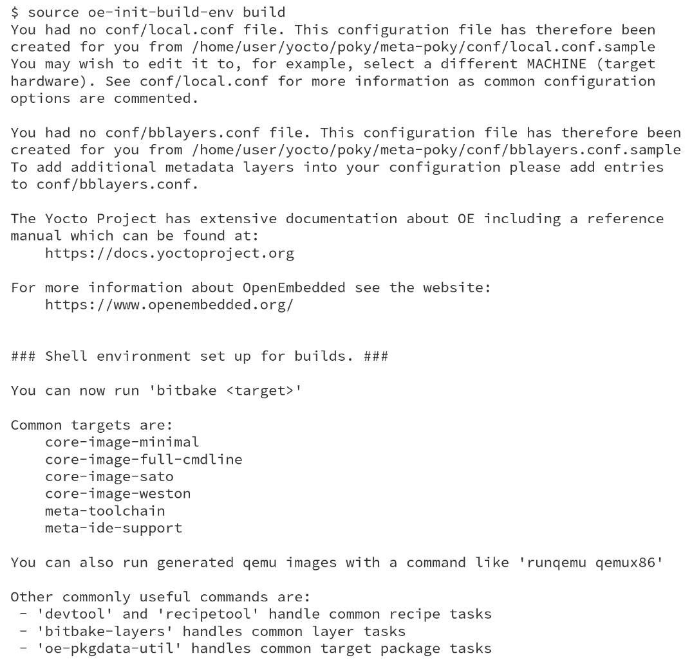

# 构建我们的第一个基于 Poky 的系统

让我们开始动手吧！在本章中，我们将理解 Poky 工作流中涉及的基本概念。我们将介绍下载、配置和准备 Poky 构建环境的步骤，并构建一些可用的内容。本章涵盖的步骤适用于测试和开发，能让我们体验使用 Poky，并感受它的能力。

# 准备构建主机系统

本节描述了如何准备 Windows 和 Linux 分发版主机系统。虽然我们将描述 Windows 的步骤，但我们将重点介绍如何使用 Linux 分发版主机系统。

提示

可以使用 macOS 作为主机系统，但需要使用 **CROss PlatformS**（**CROPS**）框架，该框架利用 Docker，允许使用包括 macOS 在内的外部操作系统。有关更多信息，可以参考 *Yocto 项目开发任务手册* 中的 *设置以使用 CROss PlatformS (CROPS)* 部分（[`docs.yoctoproject.org/4.0.4/dev-manual/start.html#setting-up-to-use-cross-platforms-crops`](https://docs.yoctoproject.org/4.0.4/dev-manual/start.html#setting-up-to-use-cross-platforms-crops)）。

接下来，我们将提供开始构建主机系统准备所需的信息。

## 使用 Windows 子系统 Linux（WSLv2）

如果你是 Windows 用户，可以在 Windows 上设置一个 Linux 分发版。WSLv2 仅适用于 Windows 10+ 版本 18917 及更高版本。WSLv2 允许使用 Yocto 项目进行开发。你可以从 Microsoft Store 安装 Linux 分发版。

请参考 *Yocto 项目开发任务手册* 中的 *设置以使用 Windows 子系统 Linux (WSLv2)* 部分（[`docs.yoctoproject.org/4.0.4/dev-manual/start.html#setting-up-to-use-windows-subsystem-for-linux-wslv2`](https://docs.yoctoproject.org/4.0.4/dev-manual/start.html#setting-up-to-use-windows-subsystem-for-linux-wslv2)）。一旦你设置好 WSLv2，你可以像在本地 Linux 机器上一样继续执行接下来的步骤。

## 准备一个基于 Linux 的系统

设置主机系统的过程取决于我们使用的 Linux 分发版。Poky 有一组支持的 Linux 分发版。假设我们是嵌入式 Linux 开发的新手，在这种情况下，建议使用支持的 Linux 分发版，以避免浪费时间调试与主机系统支持相关的问题。

如果你使用以下分发版的当前版本，你应该可以开始在你的机器上使用 Yocto 项目：

+   Ubuntu

+   Fedora

+   CentOS

+   AlmaLinux

+   Debian

+   OpenSUSE Leap

为了确认你的版本是否受支持，建议在*构建主机所需软件包*部分查阅官方在线文档([`docs.yoctoproject.org/4.0.4/ref-manual/system-requirements.html#required-packages-for-the-build-host`](https://docs.yoctoproject.org/4.0.4/ref-manual/system-requirements.html#required-packages-for-the-build-host))。

如果你偏好的发行版不在上述列表中，并不意味着无法在其上使用 Poky。你的主机开发系统必须满足 Git、tar、Python 和 GCC 的一些特定版本要求。你的 Linux 发行版应该提供这些基本工具的兼容版本。然而，也有可能你的主机开发系统未能满足所有这些要求。在这种情况下，你可以通过安装一个包含这些工具的**buildtools** tar 包来解决这个问题，详细信息请参阅*所需的 Git、tar、Python 和 GCC 版本*([`docs.yoctoproject.org/4.0.4/ref-manual/system-requirements.html#required-git-tar-python-and-gcc-versions`](https://docs.yoctoproject.org/4.0.4/ref-manual/system-requirements.html#required-git-tar-python-and-gcc-versions))。

我们必须在主机系统上安装一些软件包。本书提供了有关**Debian**和**Fedora**的安装说明，我们接下来将详细介绍这两个发行版。其他支持的发行版所需的软件包可以在*Yocto 项目参考手册*中找到([`docs.yoctoproject.org/4.0.4/ref-manual/system-requirements.html#required-packages-for-the-build-host`](https://docs.yoctoproject.org/4.0.4/ref-manual/system-requirements.html#required-packages-for-the-build-host))。

### 基于 Debian 的发行版

要安装适用于无头主机系统的必要软件包，请运行以下命令：

```
$ sudo apt install gawk wget git diffstat unzip texinfo gcc build-essential chrpath socat cpio python3 python3-pip python3-pexpect xz-utils debianutils iputils-ping python3-git python3-jinja2 libegl1-mesa libsdl1.2-dev pylint3 xterm python3-subunit mesa-common-dev zstd liblz4-tool
```

### Fedora

要安装适用于无头主机系统所需的软件包，请运行以下命令：

```
$ sudo dnf install gawk make wget tar bzip2 gzip python3 unzip perl patch diffutils diffstat git cpp gcc gcc-c++ glibc-devel texinfo chrpath ccache perl-Data-Dumper perl-Text-ParseWords perl-Thread-Queue perl-bignum socat python3-pexpect findutils which file cpio python python3-pip xz python3-GitPython python3-jinja2 SDL-devel xterm rpcgen mesa-libGL-devel perl-FindBin perl-File-Compare perl-File-Copy perl-locale zstd lz4
```

# 下载 Poky 源代码

在我们将所需软件包安装到开发主机系统之后，我们可以使用 Git 下载当前 LTS 版本（截至本文编写时）的 Poky 源代码，命令如下：

```
$ git clone https://git.yoctoproject.org/poky -b kirkstone
```

提示

了解更多关于 Git 的信息，请访问[`git-scm.com`](https://git-scm.com)。

下载过程完成后，`poky`目录中应该包含以下内容：


图 2.1 – 下载后的 poky 目录内容

注意

本章及后续章节中呈现的示例和代码以 Yocto 项目 4.0 版本（代号**Kirkstone**）为参考。

# 准备构建环境

在`poky`目录中存在一个名为`oe-init-build-env`的脚本，它用于设置构建环境。但首先，必须以“源”（source）方式运行该脚本（而不是执行它），如下所示：

```
$ source oe-init-build-env [build-directory]
```

在这里，`[build-directory]` 是一个可选参数，表示配置环境的目录名称。如果为空，它默认为 `build`。`[build-directory]` 参数是我们进行构建的地方。

从 `source oe-init-build-env build` 命令输出的内容显示了一些重要的配置，如文件位置、一些项目 URL 以及一些常见的目标，如可用的镜像。下图显示了一个输出示例：



图 2.2 – oe-init-build-env 构建命令的输出

使用不同的构建目录非常方便。我们可以并行处理多个项目或实验性设置，而不会影响其他构建。

注意

在本书中，我们将使用 `build` 作为构建目录。当我们需要指向构建目录中的某个文件时，我们将采用相同的约定——例如，`build/conf/local.conf`。

# 了解 local.conf 文件

当我们初始化一个构建环境时，它会创建一个名为 `build/conf/local.conf` 的文件。这个配置文件非常强大，因为它几乎可以配置构建过程的每个方面。我们可以设置目标机器以及用于自定义交叉工具链的工具链主机架构，优化选项以最大限度地减少构建时间，等等。`build/conf/local.conf` 文件中的注释是极好的文档，提供了可能的变量及其默认值的参考。我们可能需要从默认值中更改的最小变量集如下：

```
MACHINE ??= "qemux86-64"
```

`MACHINE` 变量是我们确定希望构建的目标机器的位置。在撰写本文时，Poky 在其参考 BSP 中支持以下机器：

+   `beaglebone-yocto`: 这是 BeagleBone，它是 32 位 ARM 的参考平台

+   `genericx86`: 这是 32 位 x86 架构机器的通用支持

+   `genericx86-64`: 这是 64 位 x86 架构机器的通用支持

+   `edgerouter`: 这是 EdgeRouter Lite，它是 64 位 MIPS 的参考平台

这些机器由一个名为 `meta-yocto-bsp` 的层提供。除了这些机器之外，OpenEmbedded Core 在 `meta` 目录中还提供对以下快速模拟（QEMU）机器的支持：

+   `qemuarm`: 这是 QEMU ARMv7 模拟

+   `qemuarmv5`: 这是 QEMU ARMv5 模拟

+   `qemuarm64`: 这是 QEMU ARMv8 模拟

+   `qemumips`: 这是 QEMU MIPS 模拟

+   `qemumips64`: 这是 QEMU MIPS64 模拟

+   `qemuppc`: 这是 QEMU PowerPC 模拟

+   `qemuppc64`: 这是 QEMU PowerPC 64 模拟

+   `qemux86-64`: 这是 QEMU x86-64 模拟

+   `qemux86`: 这是 QEMU x86 模拟

+   `qemuriscv32`: 这是 QEMU RISC-V 32 模拟

+   `qemuriscv64`: 这是 QEMU RISC-V 64 模拟

来自多个供应商的额外 BSP 层提供对其他机器的支持。使用额外 BSP 层的过程在*第十一章*中展示，*探索* *外部层*。

注意

`local.conf`文件是一种方便的方式，可以覆盖 Yocto 项目工具中的多个全局默认配置。基本上，我们可以更改或设置任何变量——例如，向镜像文件中添加额外的软件包。更改`build/conf/local.conf`文件很方便；然而，源代码管理系统通常不会跟踪此目录中的临时更改。

`build/conf/local.conf`文件可以设置多个变量。值得花时间阅读文件中生成的注释，以大致了解可以设置的变量。

# 构建目标镜像

Poky 提供了几种预设计的镜像配方，我们可以用来构建二进制镜像。我们可以通过在`poky`目录中运行以下命令来查看可用镜像列表：

```
$ ls meta*/recipes*/*images/*.bb
```

所有配方都提供镜像，这些镜像是已解包并配置好的软件包，生成一个我们可以在硬件或支持的 QEMU 机器上使用的文件系统。

接下来，我们可以看到最常用镜像的列表：

+   `core-image-minimal`：这是一个小型镜像，允许设备启动。它非常适合内核和引导加载程序的测试和开发。

+   `core-image-base`：这个仅有控制台的镜像为目标设备提供了基本的硬件支持。

+   `core-image-weston`：此镜像提供了 Wayland 协议库和参考 Weston 合成器。

+   `core-image-x11`：这是一个基本的 X11 镜像，带有终端。

+   `core-image-sato`：这是一个支持 Sato 和适用于使用 X11 的移动设备的移动环境的镜像。它提供了终端、编辑器、文件管理器、媒体播放器等应用程序。

+   `core-image-full-cmdline`：一个仅有控制台的镜像，安装了更多完整功能的 Linux 系统。

社区提供了其他参考镜像。一些镜像支持诸如实时（Real Time）、`initramfs`和 MTD（闪存工具）等功能。可以查看源代码或*Yocto 项目参考手册*([`docs.yoctoproject.org/4.0.4/ref-manual/index.html`](https://docs.yoctoproject.org/4.0.4/ref-manual/index.html))，以获取完整且更新的列表。

为目标构建镜像的过程是直接的。但首先，我们需要使用`source oe-init-build-env [build-directory]`来设置构建环境，然后才能使用 BitBake 构建镜像。我们可以使用以下命令中的模板来构建镜像：


图 2.3 – 如何使用 BitBake 构建配方

注意

在以下示例中，我们将使用`MACHINE = "qemux86-64"`。你可以在`build/conf/local.conf`中相应设置。

例如，要构建`core-image-full-cmdline`，运行以下命令：

```
$ bitbake core-image-full-cmdline
```

Poky 构建如下面的图所示：


图 2.4 – bitbake core-image-full-cmdline 的结果

# 在 QEMU 中运行镜像

我们可以使用硬件仿真来加速开发过程，因为它允许在不涉及实际硬件的情况下进行测试运行。幸运的是，大多数项目中只有极小部分是依赖硬件的。

QEMU 是一个免费的开源软件包，执行硬件虚拟化。基于 QEMU 的机器允许在没有真实硬件的情况下进行测试和开发。目前支持 ARMv5、ARMv7、ARMv8、MIPS、MIPS64、PowerPC、PowerPC 64、RISC-V 32、RISC-V 64、x86 和 x86-64 仿真。我们将在*sw*中详细讨论 QEMU 的使用，*通过仿真加速产品开发 –* *QEMU*。

OpenEmbedded Core 提供了`runqemu`脚本工具，这是一个便捷的封装器，使得使用 QEMU 更加简便。运行该脚本工具的方法如下：

```
$ runqemu <machine> <zimage> <filesystem>
```

这里，`<machine>`是要使用的机器/架构，例如`qemux86-64`，或任何其他支持的机器。同时，`<zimage>`是内核的路径（例如，`bzImage-qemux86-64.bin`）。最后，`<filesystem>`是`ext4`镜像的路径（例如，`filesystem-qemux86-64.ext4`）或 NFS 目录。在前面的`runqemu`调用中，`<zimage>`和`<filesystem>`都是可选的。只需运行`runqemu`，即可在已设置构建环境的 shell 中启动镜像，因为它会自动从构建环境中获取默认设置。

所以，例如，如果我们运行`runqemu qemux86-64 core-image-full-cmdline`，我们可以看到类似以下截图的内容：


图 2.5 – Linux 内核启动时的 QEMU 屏幕

完成 Linux 启动后，您将看到一个登录提示，如*图 2.6*所示：


图 2.6 – 用户登录时的 QEMU 屏幕

我们可以使用空密码登录到`root`账户。即使在 QEMU 内部执行，系统的表现仍然像一台普通机器。将镜像部署到真实硬件的过程有所不同，取决于所使用的存储类型、引导加载程序等。然而，生成镜像的过程是相同的。我们将在*第十五章*中探讨如何构建并在真实硬件上运行镜像，*启动我们的定制* *嵌入式 Linux*。

# 总结

在本章中，我们学习了设置 Poky 并构建第一个镜像所需的步骤。然后，我们使用`runqemu`运行该镜像，从而对可用功能有了一个很好的概览。在下一章中，我们将介绍 Toaster，这是一个为 BitBake 提供的人性化接口。我们将使用它来构建镜像并进一步自定义它。
