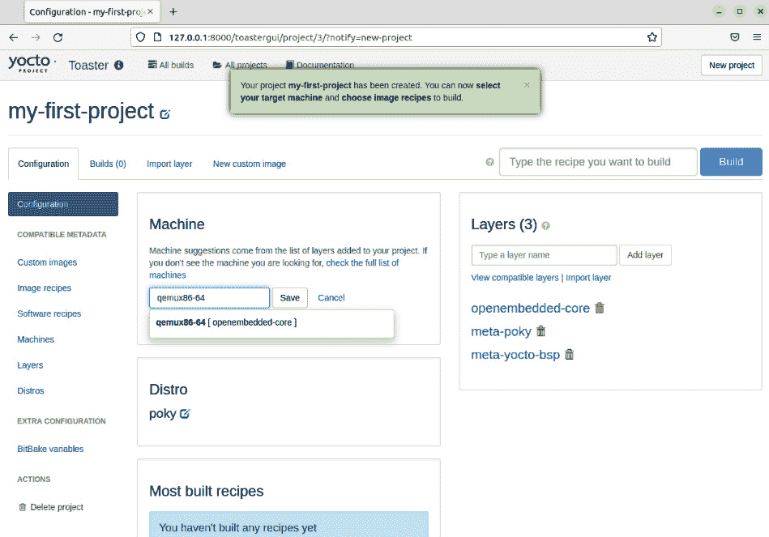

# 使用 Toaster 构建镜像

现在我们已经知道如何在 Poky 中使用 BitBake 构建镜像，接下来我们将学习如何使用 Toaster 做同样的事情。我们将重点介绍 Toaster 的最简单使用方式，并且还会覆盖它的其他功能，以便你了解它的能力。

# 什么是 Toaster？

**Toaster** 是一个配置和运行构建的网页界面。它与 BitBake 和 Poky 构建系统进行通信，管理并收集关于构建、软件包和镜像的信息。

使用 Toaster 有两种方式：

+   **本地模式**：我们可以将 Toaster 作为本地实例运行，适合单用户开发，提供 BitBake 命令行的图形界面和一些构建信息。

+   **托管模式**：适用于多个用户。Toaster 服务器构建并存储用户的产物。在使用托管实例时，其组件可以分布在多台机器上。

在本章中，我们将使用 Toaster 作为本地实例。然而，如果你希望将其作为托管实例使用，请访问以下网站获取说明——*Toaster* *手册*（[`docs.yoctoproject.org/4.0.4/toaster-manual/index.html`](https://docs.yoctoproject.org/4.0.4/toaster-manual/index.html)）。

注意

请记住，所有托管服务都需要注意其安全性。在使用托管实例之前，请考虑这一点。

# 安装 Toaster

Toaster 使用 Python Django 框架。安装它最简单的方式是使用 Python 的 `pip` 工具。在配置我们的主机机器时，我们已经安装了这个工具，具体见 *第二章* 中的 *构建我们的基于 Poky 的系统*。现在，我们可以通过运行以下命令在 Poky 源目录中安装 Toaster 的其余需求：

```
$ pip3 install --user -r bitbake/toaster-requirements.txt
```

# 启动 Toaster

一旦我们安装了 Toaster 的需求，我们就可以启动它的服务器。为此，我们应该进入 Poky 的目录并运行以下命令：

```
$ source oe-init-build-env
$ source toaster start
```

这些命令需要一些时间来完成。当一切设置好后，Web 服务器会启动，结果如图所示。


图 3.1 – 源 Toaster 启动结果

要访问 Toaster 网页界面，打开你喜欢的浏览器并输入以下网址：

`http://127.0.0.1:8000`

注意

默认情况下，Toaster 在端口 `8000` 启动。`webport` 参数允许你使用不同的端口——例如，`$ source toaster` `start webport=8400`。

接下来，我们可以看到 Toaster 的启动页面：


图 3.2 – Toaster 欢迎页面

# 为 QEMU 构建镜像

按照 *第二章* 中使用的相同步骤，*构建我们的基于 Poky 的系统*，我们将构建 QEMU x86-64 模拟的镜像。

由于我们当前没有项目、配置集合和构建，我们需要启动一个新项目。创建项目名称并选择目标版本，如下图所示：


图 3.3 – 使用 Toaster 创建新项目

创建 **my-first-project** 后，我们可以看到主项目界面，如下图所示：


图 3.4 – 项目的首页

在 `qemux86-64` 上：



图 3.5 – 如何选择目标机器

之后，点击 `core-image-full-cmdline`：


图 3.6 – 如何使用搜索找到镜像

下图展示了构建过程：


图 3.7 – Toaster 在镜像构建中的表现

构建过程需要一些时间，但之后我们可以看到构建的镜像以及一些统计信息，如下图所示：


图 3.8 – 镜像构建工件报告

我们还可以验证生成的文件集，如下图所示：


图 3.9 – Toaster 中显示的 core-image-full-cmdline 目录结构

Toaster 是一款强大的工具。你可以在本地开发机器或共享服务器上使用它，以图形方式展示构建过程。你可以返回到启动 Toaster 的终端运行 `runqemu qemux86-64 core-image-full-cmdline`，你将看到如下图所示的内容：


图 3.10 – Linux 内核启动时的 QEMU 屏幕

完成 Linux 启动后，你将看到登录提示，如*图 3.11*所示。


图 3.11 – 用户登录时的 QEMU 屏幕

我们可以使用空密码登录到 `root` 账户。

# 总结

在本章中，我们介绍了 Toaster 及其核心功能。接着，我们讲解了如何安装和配置 Toaster，并构建并检查了一个镜像。

在下一章中，我们将介绍一些关键的 BitBake 概念。我们认为这些概念对于理解 Yocto 项目至关重要。接下来的章节，我们将使用 BitBake 和命令行，因为它们能全面展示所有概念。
