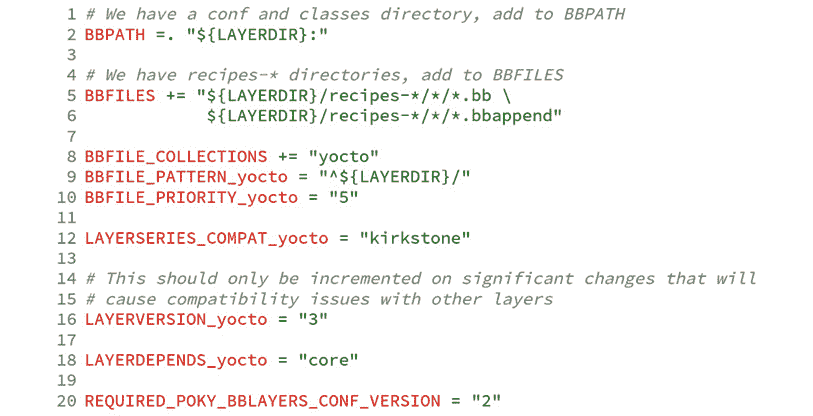
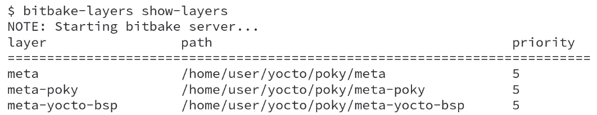

# 认识 BitBake 工具

在本章中，我们将开始学习 Yocto 项目的引擎如何在幕后运作。就像每段旅程一样，沟通至关重要，因此我们需要理解 Yocto 项目工具使用的语言，并学习如何最大限度地利用这些工具来实现我们的目标。

上述章节向我们介绍了创建和仿真镜像的标准 Yocto 项目工作流程。现在，在本章中，我们将探讨元数据的概念，以及 BitBake 如何读取这些元数据以生成内部数据集合。

# 理解 BitBake 工具

BitBake 任务调度器最初是从 Gentoo 分发版中使用的包管理系统 Portage 分叉出来的。然而，由于不同的使用案例，这两个项目的开发方向发生了显著分歧。Yocto 项目和 OpenEmbedded 项目是 BitBake 的重度用户。它仍然是一个独立的项目，拥有自己的开发周期和邮件列表（bitbake-devel@lists.openembedded.org）。

BitBake 是一个类似于 GNU Make 的工具。如 *第一章*，*认识 Yocto 项目* 中所述，BitBake 是一个任务执行器和调度器，它解析 Python 和 Shell 脚本混合代码。

因此，BitBake 负责尽可能并行地运行多个任务，同时确保这些任务按依赖关系执行。

# BitBake 元数据集合

对于 BitBake 来说，元数据没有独立于元数据集合之外的存在。相反，元数据集合有一个独特的名称，Yocto 项目用来描述这些集合的常用术语是 **Layer**。

*第一章*，*认识 Yocto 项目*，解释了我们有以下几层：

+   `meta` 目录

+   `meta-poky` 目录

+   `meta-yocto-bsp` 目录

上面的列表描述了层的实际示例。每个层都包含一个名为 `conf/layer.conf` 的文件。该文件定义了几个层属性，如集合名称和优先级。下图展示了 `meta-poky` 层的 `conf/layer.conf` 文件：

图 4.1 – meta-poky 层的 conf/layer.conf 文件

上面的示例相对简单，但它作为一个基础，帮助我们说明 `conf/layer.conf` 文件的原理。

在第 8 行，`BBFILE_COLLECTIONS`，我们告诉 BitBake 创建一个名为 `yocto` 的新元数据集合。接下来，在第 9 行，`BBFILE_PATTERN_yocto`，我们定义了匹配所有以 `LAYERDIR` 变量开头的路径的规则，以识别属于 `yocto` 集合的元数据。最后，在第 10 行，`BBFILE_PRIORITY_yocto` 确定了 `yocto` 集合与其他元数据集合之间的优先级（数字越大，优先级越高）。

层之间的依赖关系至关重要，因为它确保所有所需的元数据可供使用。一个例子是在第 18 行的`LAYERDEPENDS_yocto`，它来自`conf/layer.conf`文件，并为`core`添加了一个依赖关系，`core`由 OpenEmbedded Core 层提供。

*图 4.2*展示了使用`bitbake-layers`命令的 Poky 层，具体如下：

图 4.2 – bitbake-layers show-layers 命令的 Poky 结果

# 元数据类型

我们可以将 BitBake 使用的元数据分为三个主要领域，具体如下：

+   配置（`.conf` 文件）

+   类（`.bbclass` 文件）

+   配方（`.bb` 和 `.bbappend` 文件）

配置文件定义了全局内容，用于提供信息并配置配方的工作方式。一个典型的配置文件示例是机器文件，它列出了描述硬件的设置。

整个系统使用配方可以根据需要或默认继承的类。它们定义了系统的常用行为并提供基本方法。例如，`kernel.bbclass`抽象了与构建和打包 Linux 内核相关的任务，而不受版本或供应商更改的影响。

注意

配方和类结合了 Python 和 Shell 脚本代码。

类和配方描述了要运行的任务，并提供了所需的信息，允许 BitBake 生成所需的任务列表及其依赖关系。继承机制允许配方继承一个或多个类，从而促进代码重用，提高准确性，并简化维护。一个 Linux 内核配方示例是`linux-yocto_5.15.bb`，它继承了一组类，包括`kernel.bbclass`。

BitBake 在所有类型的元数据（`.conf`、`.bb` 和 `.bbclass`）中最常用的方面已在*第五章*《掌握 BitBake 工具》中进行了涵盖，而元数据语法和语法的详细内容则在*第八章*《深入了解 BitBake 元数据》中进行了阐述。

考虑到*图 4.1*，我们需要注意另外两个变量——`BBPATH`和`BBFILES`。

第 2 行的`BBPATH`类似于`PATH`，但它将目录添加到元数据文件的搜索列表中；第 5 行的`BBFILES`变量列出了用于索引集合配方文件的模式。

# 概要

在本章中，我们了解了元数据、元数据收集的概念以及`conf/layer.conf`的重要性，这是理解 Yocto 项目的基础。在下一章中，我们将研究元数据知识，了解配方如何相互依赖，以及 BitBake 如何处理依赖关系。此外，我们还将更好地了解 BitBake 管理的任务，下载所有必需的源代码，构建并生成包，并查看这些包如何适配生成的镜像。
