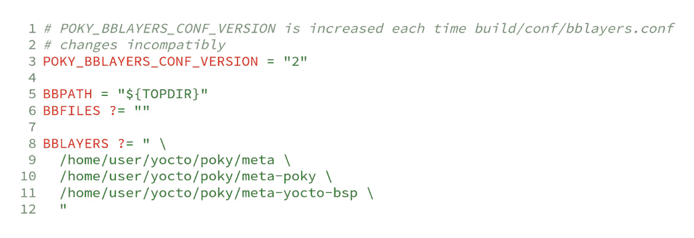
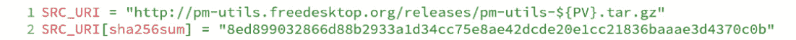
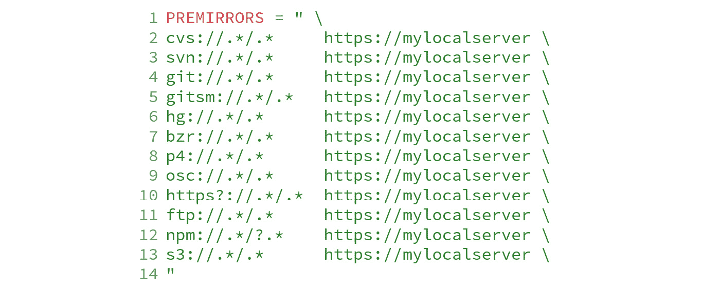
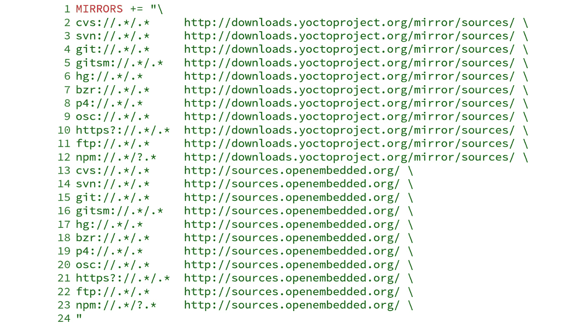
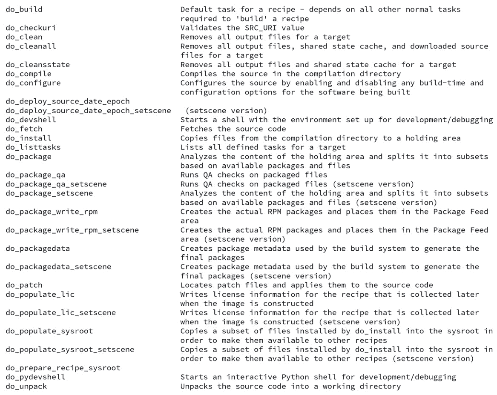

# 第五章：掌握 BitBake 工具

在上一章中，我们了解了元数据、元数据收集概念以及 `conf/layer.conf` 的重要性。在本章中，我们将更深入地研究元数据，理解配方之间的依赖关系，并了解 BitBake 如何处理这些依赖关系。

此外，我们还将介绍一系列任务，从下载源代码到生成镜像和其他制品。这些任务的一些示例包括将源代码存储在用于构建的目录中、打补丁、配置、编译、安装、生成软件包，并确定软件包如何适应生成的镜像，我们将在本章中介绍这些内容。

# 解析元数据

通常，我们的项目包含多个层，这些层提供不同的元数据以满足特定需求。例如，当我们初始化构建目录时，使用 `source oe-init-build-env build`，会生成如下文件：

图 5.1 – 使用 source oe-init-build-env build 创建的文件列表

`build/conf/templateconf.cfg` 文件指向用于创建 `build/conf` 目录的模板目录。

注意

用户可以使用 `TEMPLATECONF` 环境变量提供一个不同的模板目录——例如，`TEMPLATECONF=/some/dir source` `oe-init-build-env build`。

`build/conf/local.conf` 文件是本地配置的占位符。我们在 *第二章*，《*烘焙我们的第一个基于 Poky 的系统*》中使用了此文件，并将在本书中贯穿使用。

BitBake 使用 `build/conf/bblayers.conf` 文件列出构建环境中考虑的层。以下是一个示例：

图 5.2 – 使用 source oe-init-build-env build 后的 build/conf/bblayer.conf 内容

`BBLAYERS` 变量（第 8 行）是一个以空格分隔的层目录列表。BitBake 解析每个层并将其内容加载到元数据集合中。BitBake 使用的元数据可以分为三大类，具体如下：

+   配置（`.conf` 文件）

+   类（`.bbclass` 文件）

+   配方（`.bb` 和 `.bbappend` 文件）

提示

`BBLAYERS` 变量中列出的层的顺序由 BitBake 按照从左到右的顺序解析元数据。因此，如果您的层需要最先解析，请确保将其列在 `BBLAYERS` 变量中的正确位置。

在解析所有使用的层之后，BitBake 开始解析元数据。BitBake 中第一个解析的元数据是配置元数据，它的文件扩展名为 `.conf`。这些元数据是全局性的，因此会影响所有执行的配方和任务。

注意

一个典型的配置文件示例是机器文件，它包含描述硬件的设置列表。

BitBake 首先从 `BBPATH` 列表中包含的路径之一加载 `meta/conf/bitbake.conf`。`meta/conf/bitbake.conf` 文件使用 `include` 指令来引入元数据，例如特定架构的元数据、机器配置文件和 `build/conf/local.conf` 文件。BitBake 配置文件（`.conf`）的一个显著限制是，只允许变量定义和 `include` 指令。

BitBake 的类（`.bbclass`）是 `classes/` 目录中的一个基本继承机制。当在解析过程中出现 `inherit` 指令时，BitBake 会立即解析链接的类。类的内容会根据 `BBPATH` 变量列表的顺序进行搜索。

`BBFILES` 变量是一个以空格分隔的 `.bb` 和 `.bbappend` 文件列表，并且可以使用通配符。它在每个层的 `conf/layer.conf` 中都是必需的，这样 BitBake 就知道去哪里查找配方。BitBake 配方（`.bb`）是要执行的任务的逻辑单元；通常，它指的是一个包。

# 依赖关系

从 BitBake 的角度来看，有三种不同的依赖类型：

+   构建时

+   执行时间

+   任务

需要其他包（如库）的应用程序，在成功编译时有构建依赖关系。构建依赖关系包括编译器、库和本地构建工具（如 **CMake**）。此外，当应用程序仅在执行时需要时，构建依赖关系就会变成执行依赖关系。运行时依赖关系包括字体、图标、动态链接库和语言解释器。

提示

在 Poky 中的约定是对配方名称使用 `-native` 后缀。这是因为这些工具旨在在构建过程中运行，在主机构建系统中执行，而不会部署到目标系统中。

任务依赖关系在任务执行的混乱中创建了顺序——例如，为了编译一个包，需要先下载源代码。在底层，所有依赖关系都是任务依赖关系。这意味着，当包 `B` 依赖包 `A` 进行构建时，包 `A` 的任务需要先完成，包 `B` 才能开始。

元数据表示所有依赖关系。OpenEmbedded Core 提供了一组广泛的类来处理常用的默认任务依赖关系——例如，一个配方可以通过 `DEPENDS` 变量表示构建时的依赖关系，通过 `RDEPENDS` 变量表示执行时的依赖关系。

了解配方依赖链，BitBake 可以将所有配方按可行顺序排序。BitBake 以以下方式组织任务：

+   没有依赖关系的配方任务会并行构建。

+   依赖的配方按顺序串行构建，并以满足依赖关系的方式进行排序。

提示

所有在运行时依赖中包含的配方都会被添加到构建列表中。这看起来很明显，但即使它们在构建过程中没有任何作用，它们仍然需要准备好，以便最终生成的二进制包可供安装。这在构建镜像或填充源时是必需的。

# 偏好和提供配方

依赖是两者之间的关系；一方只有在另一方存在时才能被满足。然而，依赖仅指定某个功能或特性需要被满足，并不具体说明如何满足。

例如，当一个配方依赖于`A`时，最初的想法是它依赖于一个名为`A`的配方。然而，有两种可能的方式来满足`A`的依赖需求：

+   一个名为`A`的配方

+   提供名为`A`的功能或特性的配方

为了让一个配方告诉 BitBake 它可以满足某个功能或特性需求，必须使用`PROVIDES`关键字。一个微妙的后果是，两个或更多的配方可以提供相同的功能或特性。我们必须使用`PREFERRED_PROVIDER`关键字告知 BitBake 哪个配方应该满足该需求。

因此，如果一个名为`foo_1.0.bb`的配方依赖于`bar`，BitBake 会列出所有提供`bar`的配方。`bar`的依赖可以通过以下方式满足：

+   一个以`bar_<version>.bb`格式命名的配方，因为每个配方默认提供自己

+   一个包含`bar`的`PROVIDES`变量的配方

`virtual/kernel` 提供者清楚地展示了这一机制。`virtual/`命名空间是当我们有一组常见的覆盖提供者时所采用的约定。

所有需要构建内核的配方都可以将`virtual/kernel`添加到依赖列表（`DEPENDS`）中，BitBake 会满足该依赖。当我们有多个提供者时，我们必须选择一个来使用——例如，以下情况：

图 5.3 – 如何为虚拟/内核设置首选提供者的示例

`virtual/kernel` 提供者通常在机器定义文件中设置，因为它可能因机器不同而有所变化。我们将在*第十二章* *创建* *自定义层*中看到如何创建机器定义文件。

注意

当依赖无法满足时，BitBake 会报错，这通常是因为缺少提供者。

当 BitBake 有两个不同版本的提供者时，它默认使用最高版本。然而，我们可以通过使用`PREFERRED_VERSION`强制 BitBake 使用不同的版本。这在 BSP（如引导加载程序）中很常见，因为厂商可能会为某个板子使用特定版本。

我们可以通过在配方文件中使用`DEFAULT_PREFERENCE`关键字，默认降低版本偏好来避免使用开发版或不可靠的配方版本，如下所示：

图 5.4 – 如何在配方中降低版本优先级

因此，即使版本较高，如果没有显式设置`PREFERRED_VERSION`来使用该版本，配方也不会被选择。

# 获取源代码

当我们下载 Poky 源代码时，我们同时下载了元数据集合和 BitBake 工具。BitBake 支持的主要功能之一是额外的源代码获取。

获取外部源代码的能力尽可能模块化和灵活。例如，每个基于 Linux 的系统都包括 Linux 内核和一些其他工具，这些工具共同构成了`root`文件系统，如 OpenSSH 或 BusyBox。

OpenSSH 源代码可通过其上游网站获得，作为一个托管在 HTTP 服务器上的`tar.gz`文件，而 Linux 内核发布版本则在一个 Git 仓库中。因此，BitBake 可以轻松获取这两种不同的源代码实例。

BitBake 支持许多不同的 fetcher 模块，允许检索 tar 包文件和其他多个 SCM 系统，例如以下几种：

+   亚马逊 AWS S3

+   Android repo

+   Azure 存储

+   Bazaar

+   ClearCase

+   CVS

+   FTP

+   Git

+   Git Annex

+   Git 子模块

+   HTTP(S)

+   Mercurial

+   NPM

+   NPMSW（`npm` `shrinkwrap`实现）

+   openSUSE 构建服务客户端

+   Perforce

+   Rust Crate

+   SFTP

+   SSH

+   Subversion

BitBake 用于获取源代码的机制在内部称为 fetcher 后端，可以根据用户的需求进行配置，并优化源代码的获取。

## 远程文件下载

BitBake 支持多种远程文件下载方式，最常用的包括`http://`、`https://`和`git://`。我们不会讨论 BitBake 处理远程文件下载的内部细节，而是专注于它的可见效果。

当 BitBake 在配方中执行`do_fetch`任务时，它会检查`SRC_URI`的内容。以`pm-utils`配方为例（可以在`meta/recipes-bsp/pm-utils/pm-utils_1.4.1.bb`中找到）。处理后的变量显示在下图中：

图 5.5 – pm-utils_1.4.1.bb 配方的 SRC_URI

BitBake 将`PV`变量扩展为包的版本号（在此示例中，`1.4.1`来自`pm-utils_1.4.1.bb`配方文件名），然后从[`pm-utils.freedesktop.org/releases/pm-utils-1.4.1.tar.gz`](http://pm-utils.freedesktop.org/releases/pm-utils-1.4.1.tar.gz)下载文件，最后将其保存在`DL_DIR`指定的下载存储目录中。

下载完成后，BitBake 会将下载文件的`sha256sum`值与配方中的值进行比较。如果值匹配，它会创建一个`${DL_DIR}/pm-utils-1.4.1.tar.gz.done`文件，以标记文件已成功下载和验证，允许 BitBake 重用该文件。

注意

默认情况下，`DL_DIR`变量指向`build/downloads`。你可以通过在`build/conf/local.conf`文件中添加以下行来覆盖此设置 – `DL_DIR = "/my/download-cache"`。通过这种方式，我们可以在多个构建目录之间共享相同的下载缓存，从而节省下载时间和带宽。

## Git 仓库

最常用的源代码管理系统之一是 Git。BitBake 对 Git 提供了稳定的支持，当运行`do_fetch`任务并发现`SRC_URI`变量开头是`git://` URL 时，会使用 Git 后端。

BitBake Git 后端处理仓库的默认方式是将仓库克隆到`${DL_DIR}/git2/<git URL>` – 例如，查看以下从 `meta/recipes-support/lz4/lz4_1.9.4.bb` 配方中找到的`lz4_1.9.4.bb`文件：

图 5.6 – lz4_1.9.4.bb 配方的源代码下载配置

在这里，`lz4.git` 仓库被克隆到 `${DL_DIR}/git2/github.com.lz4.lz4.git`。这个目录名避免了可能存在相同项目名的 Git 仓库之间的冲突。

`SRCREV` 变量有两个影响的情况。它们如下：

+   `do_fetch`：此任务使用`SRCREV`变量来确保仓库具有所需的 Git 版本。

+   `do_unpack`：此任务使用`SRCREV`来设置工作目录并获取必要的源代码版本。

注意

我们需要使用`branch=<branch name>`参数，如下所示 – `SRC_URI = "git://myserver/myrepo.git;branch=mybranch"`，来指定包含我们要使用的版本的分支。如果使用的哈希指向一个在分支上不可用的标签，则需要使用`nobranch=1`选项，如下所示 – `SRC_URI = "git://myserver/myrepo.git;nobranch=1"`。

远程文件和 Git 仓库是 BitBake 最常用的获取后端。其他支持的源代码管理系统在实现上有所不同，但基本的理念和概念是相同的。

# 优化源代码下载

为了提高源代码下载的稳定性，Poky 提供了一个镜像机制，可以提供以下内容：

+   用于下载的集中首选服务器

+   一组回退服务器

为了提供这个强大的下载机制，BitBake 遵循了定义的逻辑步骤。在构建过程中，第一步是从本地下载目录（由`DL_DIR`指定）中搜索源代码。如果这一步失败，下一步是尝试由`PREMIRRORS`变量定义的位置。最后，BitBake 会在失败的情况下搜索`MIRRORS`变量指定的位置。总的来说，这些步骤如下：

1.  `DL_DIR`：在主机机器上查找下载。

1.  `MIRRORS`：在镜像列表中搜索下载。

1.  `PREMIRRORS`：用于减少从外部服务器的下载，通常在公司内部使用，以减少或禁止互联网使用。

例如，当配置本地服务器 `https://mylocalserver` 作为 `PREMIRROR` 时，我们可以在全局配置文件（例如 `build/conf/local.conf`）中添加以下代码：

图 5.7 – PREMIRRORS 配置示例

上述代码将 `PREMIRRORS` 变量添加到前面，并指示构建系统拦截所有下载请求。它会将请求重定向到 `https://mylocalserver` 源的镜像。

使用 `PREMIRRORS` 的方式非常常见，以至于有一个类可以帮助其配置。为了简化操作，我们继承 `own-mirror` 类，然后在任何全局配置文件中（例如 `build/conf/local.conf`）设置 `SOURCE_MIRROR_URL` 变量为 `https://mylocalserver`。

图 5.8 – 如何配置 own-mirror

如果所需的组件在源镜像中不可用，BitBake 会回退到 `MIRRORS` 变量。该变量内容的示例如下图所示。它显示了在 `mirrors.bbclass` 中使用的一些服务器，默认情况下会继承该类：

图 5.9 – 使用 MIRRORS 变量的示例

提示

假设目标是拥有一个可共享的下载缓存。在这种情况下，建议在下载文件夹中启用 SCM 后端（例如 Git）的 tarball 生成，方法是在 `build/conf/local.conf` 中设置 `BB_GENERATE_MIRROR_TARBALLS = "1"`。

## 禁用网络访问

有时，我们需要确保在构建过程中不连接到互联网。这样做有几个有效的理由，举例如下：

+   **政策**：我们的公司不允许在产品中包含未经合法验证和审查的外部源。

+   **网络费用**：当我们在路上使用移动宽带时，数据费用可能过高，因为下载的数据量可能非常庞大。

+   **下载与构建解耦**：这种设置在持续集成环境中很常见，其中一个任务负责下载所有所需的源代码，而构建任务则禁用互联网访问。下载与构建的解耦确保不会重复下载源代码，并且我们已经缓存了所有必要的源代码。

+   **缺乏网络访问**：有时我们无法访问网络。

为了禁用网络连接，我们需要在 `build/conf/local.conf` 文件中添加以下代码：

图 5.10 – 如何在构建过程中禁用网络访问

# 理解 BitBake 的任务

BitBake 使用执行单元，实质上是一组按顺序执行的集群指令。这些单元被称为**任务**。在每个配方的构建过程中，BitBake 会调度、执行并检查由类提供的许多任务，从而形成我们用来构建配方的框架。因此，理解其中的一些任务非常重要，因为我们在编写配方时，经常会使用、扩展、实现或替换它们。

当我们运行以下命令时，BitBake 会运行一组已安排的任务：

图 5.11 – 如何运行配方的所有任务

当我们希望运行特定任务时，可以使用以下命令：

图 5.12 – 如何运行特定任务

要列出为配方定义的任务，我们可以使用以下命令：

图 5.13 – 如何列出配方的所有任务

`wget` 配方的 `listtasks` 输出如下：

图 5.14 – wget 配方的任务列表

我们将在这里简要描述最常用的任务：

+   `do_fetch`：构建配方的第一步是使用前面本章中讨论的获取后端功能来获取所需的源代码。需要注意的是，获取源代码或文件并不意味着它是远程源。

+   `do_unpack`：在 `do_fetch` 任务之后的自然任务是 `do_unpack`。它负责解包源代码，或在引用的源代码使用 SCM 系统的情况下，检出请求的修订版本或分支。

+   `do_patch`：一旦源代码被正确解包，BitBake 会启动源代码的适配过程。所有通过 `do_fetch` 获取的具有 `.patch` 扩展名的文件都被认为是需要应用的补丁。此任务应用所需的补丁列表。最终修改后的源代码将用于构建软件包。

+   `do_configure`、`do_compile` 和 `do_install`：这些任务按照此顺序执行。需要注意的是，这些任务中定义的环境变量在不同任务之间是不同的。Poky 提供了一个丰富的预定义任务集合，在类中，我们应该尽可能使用这些任务——例如，当一个配方继承了 `autotools` 类时，它提供了 `do_configure`、`do_compile` 和 `do_install` 任务的已知实现。

+   `do_package`：`do_package` 任务将配方安装的文件分割为逻辑组件，例如调试符号、文档和库。我们将在**第七章**《吸收包支持》中更深入地介绍打包的细节。

# 概述

在本章中，我们学习了配方如何相互依赖，以及 Poky 如何处理依赖关系。我们了解了如何配置下载以及如何优化它。此外，我们还更好地理解了 BitBake 如何管理任务，下载所有所需的源代码，并利用这些代码来构建和生成包。

在下一章中，我们将查看在完成镜像生成后构建目录的内容，并了解 BitBake 如何在烘焙过程中使用这些内容，包括临时构建目录及其生成的文件。
