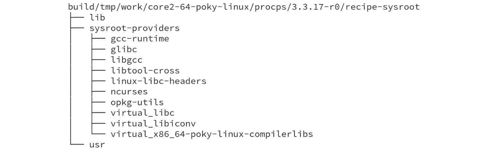

# 详细说明临时构建目录

在本章中，我们将尝试理解镜像生成后临时构建目录的内容，并了解 BitBake 如何在烘焙过程中使用它。此外，我们还将了解这些目录如何在出现问题时，通过作为宝贵的信息源来帮助我们。

# 详细说明构建目录

构建目录是每个 Poky 用户的核心信息和产物源。它的主要目录如下：

+   `conf`：此目录包含我们用来控制 Poky 和 BitBake 的配置文件。我们第一次使用该目录是在*第二章*，《烘焙我们的基于 Poky 的系统》中。它存储了配置文件，如`build/conf/local.conf`和`build/conf/bblayers.conf`。

+   `downloads`：此目录存储所有下载的构建产物，充当下载缓存。我们在*第五章*，《掌握 BitBake 工具》中详细讨论过它。

+   `sstate-cache`：此目录包含打包数据的快照。它是一个缓存，主要用于加速未来的构建过程，因为它作为构建过程的缓存。这一文件夹在*第七章*，《掌握打包支持》中有详细介绍。

+   `tmp`：这是临时构建目录，是本章的主要内容。

# 构建目录的构建

在前面的章节中，我们以抽象的高层次细节了解了 Poky 的输入和输出。我们已经知道，BitBake 使用元数据生成不同类型的构建产物，包括镜像。除了生成的构建产物，BitBake 在此过程中还创建了其他内容，这些内容可能根据我们的目标以不同的方式使用。

BitBake 执行多个任务，并在构建过程中不断修改构建目录。因此，我们可以通过遵循常见的 BitBake 执行流程来更好地理解它，流程如下：

+   `build/download` 目录。

+   `build/tmp/work` 目录。当源代码准备好后，将应用必要的修改（例如，应用必要的补丁并签出正确的 Git 修订版）。

+   `./configure`）和构建（例如，`make`）。

+   `make install`）在`build/tmp/work/<...>/image`下的暂存目录中。

+   `build/tmp/work/<...>/recipe-sysroot` 和 `build/tmp/work/<...>/recipe-sysroot-native`。

+   `.rpm`、`.ipk`、`.deb` 或 `.tar`。

+   **质量保证（QA）检查**：在构建配方时，构建系统对输出执行各种 QA 检查，以确保能够检测到并报告常见问题。

# 探索临时构建目录

了解临时构建目录（`build/tmp`）至关重要。临时构建目录在构建开始后立即创建，并且对于帮助我们识别某些行为未按预期发生的原因非常重要。

下图显示了`build/tmp`目录的内容：

图 6.1 – `build/tmp` 的内容

其中最关键的目录如下所示：

+   `deploy`：该目录包含构建产物，如映像、二进制包和 SDK 安装程序。

+   `sysroots-components`：该目录包含 `recipes-sysroot` 和 `recipes-sysroot-native` 的表示，允许 BitBake 知道每个组件安装的位置。这用于在构建过程中创建特定配方的 `sysroots`。

+   `sysroots-uninative`：该目录包含 `glibc`（C 库），当生成本地工具时使用它。反过来，这有助于在不同主机发行版之间共享状态工件的重用。

+   `work`：该目录包含工作源代码、任务的配置、执行日志以及生成的包的内容。

+   `work-shared`：这是一个用于与多个配方共享源代码的 `work` 目录。`work-shared` 仅用于一部分配方，例如 `linux-yocto` 和 `gcc`。

# 理解工作目录

`build/tmp/work` 目录按架构组织。例如，当使用 `qemux86-64` 机器时，我们有以下四个目录：

图 6.2 – `build/tmp/work` 目录的内容

*图 6.2* 显示了 `x86-64` 主机和 `qemux86-64` 目标下 `build/tmp/work` 目录可能的目录结构示例。它们是架构和机器相关的，如下所示：

+   `all-poky-linux`：该目录包含架构无关的软件包的工作构建目录。这些通常是脚本或基于解释语言的软件包，例如 Perl 脚本和 Python 脚本。

+   `core2-64-poky-linux`：该目录包含针对 `x86-64` 基于目标并使用为 `core2-64` 优化的包的工作构建目录。

+   `qemux86_64-poky-linux`：该目录包含针对 `qemux86-64` 机器的软件包的工作构建目录。

+   `x86_64-linux`：该目录包含面向构建主机机器运行的软件包的工作构建目录。

这种组件化结构是必需的，以便在一个 `build` 目录内为多个机器和架构构建系统映像和软件包，而不会发生冲突。我们将使用的目标机器是 `qemux86-64`。

`build/tmp/work` 目录在检查异常行为或构建失败时非常有用。其内容按照以下模式组织在子目录中：

图 6.3 – 用于 `build/tmp/work` 目录下子目录的模式

在 *图 6.3* 中显示的树形结构下的某些目录如下所示：

+   `<sources>`：这是将要构建的软件的提取源代码。`WORKDIR` 变量指向该目录。

+   `image`：该目录包含由配方安装的文件。

+   `package`：输出包的提取内容存储在这里。

+   `packages-split`：输出包的内容被提取并分割成子目录，存储在这里。

+   `temp`：存储 BitBake 的任务代码和执行日志。

提示

我们可以在每次配方编译周期后自动删除`work`目录，以减少磁盘使用量，只需在`build/conf/local.conf`文件中添加`INHERIT += "rm_work"`。

`work`目录的结构对于所有架构都是相同的。对于每个配方，都会创建一个以配方名称命名的目录。以特定于机器的`work`目录并以`sysvinit-inittab`配方为例，我们看到以下内容：

图 6.4 – build/tmp/work/core2-64-poky-linux/pm-utils/1.4.1-r1/的内容

`sysvinit-inittab`配方是一个很好的例子，因为它是特定于机器的。该配方包含定义串行控制台以启动登录过程的`inittab`文件，而该过程因机器而异。

注意

构建系统使用前面图中显示的目录，但这些目录在这里未详细介绍。因此，除非你从事构建工具开发，否则你不需要与这些目录打交道。

`work`目录对于调试非常有用，我们将在*第十章*中讲解，*使用 Yocto 项目进行调试*。

# 理解 sysroot 目录

`sysroot`目录在 Yocto 项目中起着至关重要的作用。它为每个配方创建一个独立且隔离的环境。这个为每个配方设置的环境对于确保可重现性并避免与主机机器的包污染是必不可少的。

在构建`procps`配方版本`3.3.17`之后，我们会得到两套`sysroot`目录——`recipes-sysroot`和`recipes-sysroot-native`。

在每个`sysroot`集合内部，有一个名为`sysroot-provides`的子目录。该目录列出了安装在各自`sysroot`上的包。以下是`recipe-sysroot`目录：

图 6.5 – recipe procps 的 recipe-sysroot 目录内容

`recipe-sysroot-native`目录包含在构建过程中用于主机系统的构建依赖项。它包括编译器、链接器、工具等。同时，`recipe-sysroot`目录包含目标代码中使用的库和头文件。下图显示了`recipe-sysroot-native`目录：

图 6.6 – recipe procps 的 recipe-sysroot-native 目录内容

当我们看到缺少头文件或链接失败时，我们必须仔细检查我们的`sysroot`目录（目标和主机）内容是否正确。

# 总结

在本章中，我们探讨了生成镜像后临时构建目录的内容。我们看到了 BitBake 在构建过程中如何使用它。

在下一章中，我们将更好地理解在 Poky 中如何进行打包，如何使用软件包源、**软件包修订版**（**PR**）服务，以及它们如何帮助我们进行产品维护。
