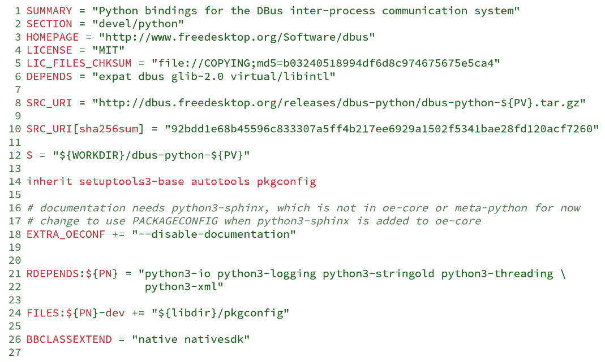

# 7

# 同化打包支持

本章介绍了理解与打包相关的 Poky 和 BitBake 方面的关键概念。我们将了解支持的二进制包格式、共享状态缓存、包版本组件，如何设置和使用二进制包源来支持我们的开发过程等内容。

# 使用支持的包格式

从 Yocto 项目的角度来看，一个配方可能会生成一个或多个输出包。一个包将一组文件和元数据封装起来，使其在未来可用。它们可以被安装到一个或多个镜像中，或者部署以供后续使用。

包对于 Poky 至关重要，因为它们使得构建系统能够生成各种类型的工件，如镜像和工具链。

## 支持的包格式列表

当前，BitBake 支持四种不同的包格式：

+   **Red Hat 包管理器** (**RPM**)：最初名为 Red Hat 包管理器，但现在被称为 RPM 包格式，因为它被多个其他 Linux 发行版采用，这是在 Linux 发行版中广泛使用的格式，如 SuSE、OpenSuSE、Red Hat、Fedora 和 CentOS。

+   **Debian 包管理器** (**DEB**)：这是一个广泛使用的格式，应用于 Debian 和多个其他基于 Debian 的发行版——Ubuntu Linux 和 Linux Mint 是最广为人知的两个。

+   支持 IPK 格式的 `opkg` 包管理器，已在多个发行版中使用，如 OpenEmbedded Core、OpenWRT 和 Poky。

+   `tarball` 文件类型用于将多个文件打包成一个单一文件。

## 选择包格式

格式支持是通过一组类（例如 `package_rpm`、`package_deb` 和 `package_ipk`）提供的。我们可以使用 `PACKAGE_CLASSES` 变量选择一个或多个格式，如以下示例所示：

图 7.1 – 用于配置使用哪种包格式的变量

你可以配置一个或多个包格式——例如，在 `build/conf/local.conf` 文件中。

提示

`PACKAGE_CLASSES` 中的第一个包格式是用于生成镜像的格式。

Poky 默认使用 RPM 包格式，该格式使用 DNF 包管理器。然而，选择包格式取决于多个因素，例如特定格式的特性、内存和资源使用。OpenEmbedded Core 默认使用 IPK 格式和 `opkg` 作为包管理器，因为它提供了更小的内存和资源占用。

另一方面，熟悉基于 Debian 的系统的用户可能更喜欢为他们的产品使用 APT 和 DEB 包格式。

# 在包安装过程中运行代码

包可以在安装和移除过程中使用脚本。所包含的脚本定义如下：

+   `preinst`：此脚本在解包包之前执行。如果包包含服务，它必须在安装或升级之前停止这些服务。

+   `postinst`：解包后，通常完成包的任何必要配置。许多`postinst`脚本在安装或升级后执行任何必要的命令来启动或重启服务。

+   `prerm`：它通常在删除与包相关的文件之前停止任何与包相关的守护进程。

+   `postrm`：这通常修改包创建的链接或其他文件。

`preinst`和`prerm`脚本针对复杂的使用场景，例如在更新包时进行数据迁移。在 Yocto 项目中，`postinst`和`postrm`还负责停止和启动`systemd`或`sysvinit`服务。当我们使用`systemd`和`update-rc.d`类时，会提供默认脚本。它可以定制以包含任何特定的用例。

后安装（`postinst`）脚本在创建`root`文件系统时运行。如果脚本返回成功值，包会被标记为已安装。要为包添加`postinst`脚本，我们可以使用以下方法：

图 7.2 – pkg_postinst 脚本示例

有时，我们需要确保`postinst`脚本在目标设备本身内运行。这可以通过使用`postinst_ontarget`变体来实现，例如以下示例：

图 7.3 – pkg_postinst_ontarget 脚本示例

提示

我们可以使用`PN`变量来代替包名本身，它会自动展开配方的包名。

所有后安装脚本在生成包含`read-only-rootfs`的镜像时必须成功，因为在只读`rootfs`中无法写入，检查必须在构建时进行。这确保我们在构建镜像时识别问题，而不是在目标设备的初次启动时。如果有需求在目标设备内运行任何脚本，`do_rootfs`任务将失败。

提示

最终，将整个镜像设为只读是不可行的。例如，一些项目可能需要持久化一些数据，甚至允许某些应用程序写入一个易失的目录。此类使用场景超出了本书的范围。然而，你可能会在*Yocto 项目参考手册*中找到有关`overlayfs`（[`docs.yoctoproject.org/4.0.4/ref-manual/classes.html#overlayfs-bbclass`](https://docs.yoctoproject.org/4.0.4/ref-manual/classes.html#overlayfs-bbclass)）和`overlayfs-etc`（[`docs.yoctoproject.org/4.0.4/ref-manual/classes.html#overlayfs-etc-bbclass`](https://docs.yoctoproject.org/4.0.4/ref-manual/classes.html#overlayfs-etc-bbclass)）类的有用信息。

在创建后安装脚本时，一个常见的疏忽是没有在绝对路径前加上`D`变量。`D`有两个特性：

+   在`rootfs`生成过程中，`D`被设置为工作目录的根目录

+   在设备内，`D` 是空的

因此，这确保了路径在主机和目标环境中都是有效的。例如，考虑以下代码：

图 7.4 – 使用 D 变量的示例源代码

在 *图 7.4* 中的示例中，`touch` 命令使用了 `D` 变量，因此它根据其值通用地工作。

另一个常见的错误是尝试运行特定于或依赖于目标架构的进程。在这种情况下，最简单的解决方案是将脚本执行推迟到目标（使用`pkg_postinst_ontarget`）。然而，正如之前提到的，这会阻止使用只读文件系统。

# 理解共享状态缓存

Poky 的默认行为是从头开始构建所有内容，除非 BitBake 确定某个配方无需重新构建。从头开始构建的主要优势是结果是全新的，并且不会有以前的数据导致问题的风险。然而，重新构建所有内容需要计算时间和资源。

判断是否需要重新构建配方的策略非常复杂。BitBake 尝试尽可能多地追踪构建过程中每个任务、变量和代码块的信息。然后，BitBake 为每个任务使用的信息生成校验和，包括来自其他任务的依赖关系。总之，BitBake 会递归地追踪使用的变量、任务源代码和配方及其依赖关系。

Poky 使用 BitBake 提供的所有这些信息，将这些任务的快照作为一组打包数据存储在一个名为共享状态缓存（`sstate-cache`）的缓存中。这个缓存将每个任务输出的内容包装在存储在 `SSTATE_DIR` 目录中的包中。每当 BitBake 准备运行某个任务时，它首先检查是否存在与所需的计算校验和匹配的 `sstate-cache` 包。如果该包存在，BitBake 将使用预构建的包。

整个共享状态机制涵盖了相当复杂的代码，前面的解释对此进行了简化。为了获得详细的描述，建议你阅读 *Yocto 项目概述和概念* *手册* 中的 *共享状态缓存* 部分（[`docs.yoctoproject.org/4.0.4/overview-manual/concepts.html#shared-state-cache`](https://docs.yoctoproject.org/4.0.4/overview-manual/concepts.html#shared-state-cache)）。

在使用 Poky 进行多次构建时，我们必须记住，`sstate-cache` 需要定期清理，因为它在每次构建后都会不断增长。清理它有一个直接的方法。请在 `poky` 目录下使用以下命令：

图 7.5 – 移除重复的共享状态缓存的命令行

提示

当我们需要从头开始重新构建时，可以执行以下任一操作：

+   删除 `build/tmp` 以便我们可以使用 `sstate-cache` 来加速构建

+   删除 `build/tmp` 和 `sstate-cache`，以便在构建过程中不重用任何缓存

# 解释包版本控制

包版本控制用于区分同一包在其生命周期不同阶段的版本。从 Poky 的角度来看，它也作为生成 BitBake 用于验证是否需要重新构建任务的校验和的公式的一部分。

包版本，也称为 `PV`，在我们选择构建哪个配方时起着主导作用。Poky 的默认行为是总是优先选择最新的配方版本，除非有其他明确的偏好，如*第五章*《掌握 BitBake 工具》中所讨论的那样。例如，假设我们有两个版本的 `myrecipe` 配方：

+   `myrecipe_1.0.bb`

+   `myrecipe_1.1.bb`

默认情况下，BitBake 会构建版本为 `1.1` 的配方。在配方内部，我们可能有其他变量与 `PV` 变量共同组成包的版本信息。这些变量是 `PE` 和 `PR`。

这些变量通常遵循以下模式：

图 7.6 – 完整的版本模式

`PE` 变量的默认值为零。当包版本模式发生变化，打破常规排序的可能性时，`PE` 会被使用。`PE` 会被加到包版本中，在需要时强制使用更高的数字。

例如，假设一个包使用日期来构成 `PV` 变量，如 `20220101`，并且有版本模式更改来发布 `1.0` 版本。那么，无法确定版本 `1.0` 是否高于版本 `20220101`。因此，使用 `PE = "1"` 来更改配方纪元，强制版本 `1.0` 高于版本 `20220101`，因为 `1:1.0` 大于 `0:20220101`。

`PR` 变量的默认值为 `r0`，并且是包版本的一部分。当它被更新时，会强制 BitBake 重新构建特定配方的所有任务。我们可以在配方元数据中手动更新它，以强制我们知道需要重新构建的内容。但这是一种脆弱的做法，因为它依赖于人工干预和知识。BitBake 使用任务校验和来控制需要重新构建的内容。手动递增 `PR` 仅在任务校验和没有变化时在极少数情况下使用。

# 指定运行时包依赖关系

大多数配方的结果是由包管理器管理的包。正如我们在前面几节中看到的，它需要关于这些包及其相互关系的信息。例如，一个包可能依赖或与另一个包冲突。

包之间存在多重约束关系；然而，这些约束是特定于包格式的，因此 BitBake 有特定的元数据来抽象这些约束。

下面是最常用的包运行时约束的列表：

+   `RDEPENDS`：必须在运行时可用的包列表，连同定义它的包一起使用。

+   `RPROVIDES`：这是软件包提供的符号名称列表。默认情况下，软件包始终将软件包名称作为符号名称。它也可以包括该软件包提供的其他符号名称。

+   `RCONFLICTS`：这是已知与该软件包冲突的软件包列表。最终的镜像必须不包括冲突的软件包。

+   `RREPLACES`：这是一个符号名称列表，表示软件包可以替换的名称。

来自`meta/recipes-devtools/python/python3-dbus_1.2.18.bb`的完整配方如下：

图 7.7 – 如何使用 RDEPENDS 的示例

*图 7.6*中的配方显示，`python3-dbus`软件包在第 21 行列出了几个 Python 模块的运行时依赖关系。

# 使用软件包生成 rootfs 镜像

Poky 最常用的功能之一是`rootfs`镜像生成。`rootfs`镜像应该视为一个用于目标的可用根文件系统。该镜像可以由一个或多个文件系统组成。它可能包括在生成过程中可用的其他工件，如 Linux 内核、设备树和引导加载程序二进制文件。生成镜像的过程包含多个步骤，其最常见的用途如下：

1.  生成`rootfs`目录

1.  创建所需的文件

1.  根据特定需求封装最终的文件系统（它可能是一个包含多个分区和内容的磁盘文件）

1.  最后，如果适用的话，进行压缩

`do_rootfs`的子任务执行所有这些步骤。`rootfs`是一个包含所需软件包并且之后应用了必要调整的目录。这些调整对`rootfs`的内容进行细微修改——例如，在构建开发镜像时，`rootfs`会被调整，以便我们可以无密码登录为`root`。

要安装到`rootfs`中的软件包列表由`IMAGE_INSTALL`列出的软件包和`IMAGE_FEATURES`中包含的软件包的联合定义；镜像定制的详细信息见*第十二章*，*创建自定义层*。每个镜像功能可以包括额外的软件包供安装——例如，`dev-pkgs`，它安装列出要安装到`rootfs`中的所有软件包的开发库和头文件。

要安装的软件包列表现在由`PACKAGE_EXCLUDE`变量过滤，该变量列出了不应安装的软件包。列在`PACKAGE_EXCLUDE`中的软件包仅从明确要安装的软件包列表中排除。

在确定最终安装的软件包列表后，`do_rootfs`任务可以启动解包并配置每个软件包及其所需的依赖项到`rootfs`目录中。`rootfs`生成使用本地软件包源，我们将在下一节中介绍。

在解压 `rootfs` 内容后，必须运行所引用软件包的非目标后安装脚本，以避免在第一次启动时执行它们带来的惩罚。

现在，目录已经准备好生成文件系统了。`IMAGE_FSTYPES` 列出了将要生成的文件系统类型——例如，**EXT4** 或 **UBIFS**。

在 `do_rootfs` 任务完成后，生成的镜像文件会被放置在 `build/tmp/deploy/image/<machine>/` 目录下。创建镜像的过程及 `IMAGE_FEATURES` 和 `IMAGE_FSTYPES` 的可能值在*第十二章*《创建自定义层》中有详细描述。

# 软件包源

如在*第五章*《掌握 BitBake 工具》中讨论的那样，软件包在生成镜像时起着至关重要的作用，因为 `do_rootfs` 会使用本地仓库来获取二进制软件包。这个仓库被称为软件包源。

这个仓库不应该仅仅用于镜像或 SDK 构建步骤。将此仓库设置为可远程访问是有多个合理原因的，既可以在我们的开发环境中内部使用，也可以公开访问。以下是其中的一些原因：

+   你可以在开发阶段轻松测试更新后的应用程序，而无需重新安装整个系统。

+   你可以使附加软件包更加灵活，以便它们能够安装到运行中的镜像中

+   你可以在现场更新产品

为了生成一个稳定的软件包源，我们必须确保每次更改软件包时，软件包的修订版本都有一致的递增。手动实现这一点几乎是不可能的，Yocto 项目提供了一个专门的 `PR` 服务来帮助实现这一目标。

每次 BitBake 检测到任务中的校验和变化时，`PR` 会在没有人工干预的情况下自动增加。它会以 `${PR}.X` 的格式在 `PR` 中注入一个后缀。例如，如果我们有 `PR = "r34"`，那么在后续的 `PR` 服务交互后，`PR` 值将变为 `r34.1`、`r34.2`、`r34.3`，以此类推。使用 `PR` 服务对于稳定的软件包源至关重要，因为它要求版本号按线性顺序增加。

提示

即使我们应该使用 `PR` 服务来确保稳定的软件包版本管理，但在特殊情况下，仍然需要手动设置 `PR`。

默认情况下，`PR` 服务并未启用或运行。我们可以通过在 BitBake 配置中添加 `PRSERV_HOST` 变量来启用它进行本地运行——例如，在 `build/conf/local.conf` 中，配置如下：

图 7.8 – 如何配置 PR 服务以本地运行

当构建发生在单台计算机上时，这种方法是足够的，构建过程会处理软件包源中的每一个软件包。BitBake 在每次构建时启动和停止服务器，并自动增加所需的 `PR` 值。

对于更复杂的设置，多个计算机共同使用共享包源时，我们必须运行一个单一的 `PR` 服务，所有与包源相关的构建系统都需使用该服务。在这种情况下，我们需要在服务器上通过 `bitbake-prserv` 命令启动 `PR` 服务，如下所示：

图 7.9 – 启动 PR 服务服务器的命令行

除了手动启动服务外，我们还需要更新每个构建系统的 BitBake 配置文件（例如 `build/conf/local.conf`），该文件通过 `PRSERV_HOST` 变量连接到服务器，如前所述，以便每个系统指向服务器的 `IP` 和 `port`。

## 使用包源

使用包源时，以下两个组件是必需的：

+   服务器提供对包的访问

+   客户端访问服务器并下载所需的包

包源提供的包集由我们构建的配方决定。我们可以构建一个或多个配方并提供它们，或者构建一组镜像以生成所需的包。一旦对所提供的包满意，我们必须创建包源提供的包索引。以下命令可执行此操作：

图 7.10 – 创建包索引的命令行

包可以在 `build/tmp/deploy` 目录中找到。我们必须根据所选的包格式选择相应的子目录。默认情况下，Poky 使用 RPM，因此我们必须提供 `build/tmp/deploy/rpm` 目录中的内容。

提示

确保在构建所有包后运行 `bitbake package-index`，否则包索引将不包含这些包。

包索引和包必须通过传输协议（如 HTTP）提供。我们可以使用任何服务器来执行此任务，例如 Apache、Nginx 和 Lighttpd。为了方便在本地开发中通过 HTTP 提供包，可以使用 Python 简单的 HTTP 服务器，如下所示：

图 7.11 – 如何使用 Python 简单 HTTP 服务器提供包源

为了向镜像中添加包管理支持，我们需要做一些更改。我们需要在 `EXTRA_IMAGE_FEATURES` 中添加 `package-management`，并在 `PACKAGE_FEED_URIS` 中设置包获取的 URI。例如，我们可以将其添加到 `build/conf/local.conf` 中：

图 7.12 – 如何配置远程包源

我们将在*第十二章*《创建自定义层》中详细讲解`IMAGE_FEATURES`和`EXTRA_IMAGE_FEATURES`变量。如果我们想要一个不支持软件包管理的小型镜像，应该从`EXTRA_IMAGE_FEATURES`中省略`package-management`。

`PACKAGE_FEED_URIS`和`EXTRA_IMAGE_FEATURES`配置确保客户端上的镜像可以访问服务器，并且具备安装、删除和升级软件包所需的工具。在完成这些步骤后，我们可以在目标设备上使用运行时软件包管理。

例如，如果我们为镜像选择 RPM 软件包格式，可以使用以下命令获取仓库信息：

图 7.13 – 获取软件包源仓库的命令行

使用`dnf search <package>`和`dnf install <package>`命令可以从仓库中查找并安装软件包。

根据选择的软件包格式，目标设备更新软件包索引、查找和安装软件包的命令是不同的。请参阅下表中针对每种软件包格式提供的命令行：

| **软件包格式** | **RPM** | **IPK** | **DEB** |
| --- | --- | --- | --- |
| 更新软件包索引 | `dnf check-updates` | `opkg update` | `apt-get update` |
| 查找软件包 | `dnf search``<``package>` | `opkg search``<``package>` | `apt-cache search``<``package>` |
| 安装软件包 | `dnf install``<``package>` | `opkg install``<``package>` | `apt-get install``<``package>` |
| 系统升级 | `dnf upgrade` | `opkg upgrade` | `apt-get` `dist-upgrade` |

表 7.1 – 软件包管理命令比较

在本地开发阶段使用软件包源非常有利，因为它们使我们能够在已经部署的镜像中安装软件包。

注意

在实际使用中，使用软件包源进行系统升级需要大量的测试工作，以确保系统不会进入损坏状态。验证所有不同的升级场景需要巨大的测试工作量。通常，完整的镜像升级对于生产环境的使用来说更为安全。

软件包源的管理要复杂得多，它涉及到多个方面，如软件包依赖链和不同的升级场景。创建复杂的软件包源外部服务器超出了本书的范围，因此请参阅 Yocto 项目文档以获取更多详细信息。

# 总结

本章介绍了打包的基本概念，这在 Poky 和 BitBake 中扮演着重要角色（软件包版本控制），并且阐明了在重新构建软件包和软件包源时，如何影响 Poky 的行为。还展示了如何配置镜像，以便使用远程服务器提供的预构建软件包进行更新。

在下一章中，我们将学习关于 BitBake 元数据语法及其操作符的内容，以及如何向变量、变量扩展等追加、前置和移除内容。然后我们将能够更好地理解 Yocto 项目引擎中使用的语言。
