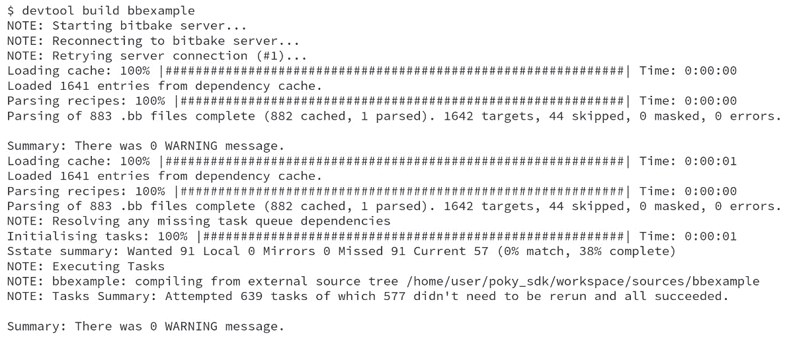

# 使用 Yocto 项目进行开发

到目前为止，本书中我们使用了 Poky 作为构建工具。换句话说，我们把它当作设计和生成交付产品镜像的工具。

在本章中，我们将学习如何设置目标设备内部使用的开发环境，并了解**标准 SDK**和**可扩展 SDK**工具，这些工具可以帮助我们在目标设备外开发应用。例如，它们允许我们进行交叉编译应用、配方和镜像。

# 什么是软件开发工具包？

在嵌入式开发中，工具链通常由跨平台工具组成，这些工具在一种架构上执行，然后生成用于另一种架构的二进制文件——例如，一个在 x86-64 兼容机器上运行并生成 ARM 机器二进制文件的 GCC 工具就是一个交叉编译器。当一个工具和由该工具生成的二进制文件依赖于相同主机上的依赖项时，这通常被称为本地构建。构建和目标架构可能相同，但如果目标二进制文件使用分阶段的根文件系统来查找其依赖项，则这是交叉编译。

**软件开发工具包**（**SDK**）是一组用于开发和调试应用程序的工具和文件。这些工具包括编译器、链接器、调试器、外部库、头文件和二进制文件，也称为工具链。它可能还包括额外的实用工具和应用程序。我们可以有两种类型的 SDK：

+   **交叉开发 SDK**：这些 SDK 旨在用于开发主机，以为目标设备生成二进制文件

+   **本地 SDK**：这些工具旨在运行在目标设备上

# 为设备开发生成本地 SDK

一些嵌入式设备的性能足以作为开发环境使用。然而，构建所需的资源因库或应用的不同而有显著差异，因此使用目标设备作为构建环境可能并不总是可行的。开发镜像需要以下内容：

+   头文件和库

+   工具链

以下行将这些属性添加到镜像中：

图 9.1 - 如何配置镜像以包含开发制品

前述示例中的`IMAGE_FEATURES`扩展了镜像的功能，如下所示：

+   `dev-pkgs`: 为给定镜像中安装的所有包安装开发包（头文件和额外的库链接）

+   `tools-sdk`: 安装在设备上运行的工具链

`IMAGE_FEATURES`变量在*第十二章*中有更详细的描述，*创建* *自定义层*。

提示

如果我们只想修改`build/conf/local.conf`，应该使用的变量是`EXTRA_IMAGE_FEATURES`。

目标设备可以在应用程序开发周期中使用此镜像，并且可以在所有开发人员之间共享此镜像。每个开发人员将拥有一个副本，开发团队将始终使用相同的开发环境。

# 了解交叉开发 SDK 的类型

Yocto 项目可以生成两种类型的交叉开发 SDK，以满足不同的需求。它们的定义如下：

+   **标准 SDK**：提供用于应用程序开发的工件，无论是用于引导加载程序、Linux 内核开发，还是其他用户空间软件

+   `sysroot`目录，以及在 Yocto 项目控制环境中集成的配方和应用程序

标准 SDK 包括一个工具链和调试应用程序。其目标是允许用户生成用于目标设备的二进制文件。可扩展 SDK 更强大，可以构建镜像和配方。两种 SDK 之间的一个显著区别是可扩展 SDK 中包含`devtool`。

`devtool`负责提供可扩展 SDK 的附加功能。它是用于使用 BitBake 和`recipetool`功能的接口。`devtool`和`recipetool`命令也可以在传统的 Yocto 项目环境中使用。

# 使用标准 SDK

通常，一个 SDK 必须提供一组库和应用程序，这些是针对产品量身定制的镜像中定义的。这些被称为基于镜像的 SDK。例如，我们可以使用以下命令为`core-image-full-cmdline`生成标准 SDK：

图 9.2 – 如何为 core-image-full-cmdline 生成标准 SDK

另一种选择是使用工具链和调试工具创建通用 SDK。这个通用 SDK 称为`meta-toolchain`，主要用于 Linux 内核和引导加载程序的开发及其调试过程。它可能不足以构建具有复杂依赖关系的应用程序。要创建`meta-toolchain`，使用以下命令：

图 9.3 – 如何生成通用 SDK

在这两种情况下，生成的 SDK 自安装文件位于`build/tmp/deploy/sdk/`。考虑到我们使用了标准 SDK 来构建`core-image-full-cmdline`，我们可以看到以下生成的文件集：

图 9.4 – 运行 bitbake core-image-full-cmdline -c populate_sdk 后的生成文件

创建标准 SDK 后的下一步是安装它，因为标准 SDK 被打包在一个安装脚本中，可以像任何其他脚本一样执行。以下步骤展示了使用标准目标目录安装标准 SDK 的过程：

图 9.5 – 标准 SDK 安装过程

上述标准 SDK 演示了如何生成和安装标准 SDK。然而，使用未经针对当前需求定制的标准镜像并不是理想选择。因此，强烈建议创建一个适合我们应用需求的自定义镜像。也建议基于此自定义镜像来构建标准 SDK。

标准 SDK 是根据我们使用 `MACHINE` 变量设置的机器架构生成的。要使用标准 SDK 构建自定义应用程序，例如 `hello-world.c`，我们可以使用以下命令，目标架构为 x86-64：

图 9.6 – 使用标准 SDK 构建 C 应用程序的步骤

另一个常用项目是 Linux 内核。当我们想要构建 Linux 内核源代码时，可以使用以下命令顺序：

图 9.7 – 使用标准 SDK 构建 Linux 内核的步骤

必须使用 `unset LDFLAGS` 来避免使用 GCC 进行链接，这是基于 Yocto 项目的标准 SDK 默认的做法。

# 使用可扩展 SDK

可扩展 SDK 扩展了标准 SDK 的功能。包括的一些主要功能如下：

+   生成配方

+   构建配方

+   构建镜像

+   在内部工具链中安装软件包

+   将软件包部署到目标

这些额外功能是由 `devtool` 工具提供的，`devtool` 在标准 Yocto 项目环境中也可用。

生成可扩展 SDK，请使用以下命令：

图 9.8 – 生成可扩展 SDK 的命令

生成的文件位于 `build/tmp/deploy/sdk/` 中。考虑到我们使用可扩展 SDK 进行 `core-image-full-cmdline` 构建，我们可以看到以下文件集：

图 9.9 – 运行 bitbake core-image-full-cmdline -c populate_sdk_ext 后生成的文件

创建可扩展 SDK 后的下一步是安装它。要安装它，我们可以执行生成的脚本。以下命令序列展示了使用标准目标目录安装可扩展 SDK 的过程：

图 9.10 – 可扩展 SDK 安装过程

上述截图展示了我们如何生成并安装一个可扩展的 SDK。然而，使用一个不符合当前需求的标准镜像并不是理想的做法。因此，强烈建议创建一个适合您应用需求的自定义镜像，并基于此创建可扩展 SDK。但是，我们可以通过使用可扩展 SDK 来构建并安装任何额外的依赖项。

在我们的例子中，我们将可扩展 SDK 安装在`/home/user/poky_sdk`目录中。安装完成后，下一步是使用提供的脚本导出所需的环境变量，这样就可以使用可扩展 SDK，命令如下：

图 9.11 – 导出环境变量以允许使用可扩展 SDK

在接下来的部分中，我们将讨论一些使用`devtool`的案例。所有命令都在终端中执行，并且已导出可扩展 SDK 的环境变量。

可扩展 SDK 是一种不同的方式来交付相同的 Yocto 项目工具和元数据。它将以下内容打包在一起：

+   用于 Yocto 项目环境执行的一组基本二进制文件

+   用于开发的标准 SDK

+   一个共享状态缓存，以减少本地构建

+   Yocto 项目元数据和配置的快照

本质上，可扩展 SDK 是用于创建它的环境的快照。因此，所有`devtool`命令，包括我们将在接下来的部分中使用的命令，都可以在 Yocto 项目环境中使用。

## 使用 devtool 构建镜像

让我们从创建镜像开始。可扩展 SDK 能够创建任何支持的镜像。例如，要创建`core-image-full-cmdline`，我们可以使用以下命令行：

图 9.12 – 使用 devtool 构建 core-image-full-cmdline

运行`devtool`命令后，生成的文件可以在`/home/user/poky_sdk/tmp/deploy/images/qemux86-64`目录中找到。

## 在 QEMU 上运行镜像

我们可以使用之前构建的镜像`core-image-full-cmdline`通过 QEMU 仿真目标硬件，命令如下：

图 9.13 – 使用 devtool 和 QEMU 进行仿真

它启动 QEMU 执行并生成启动画面，如下图所示：

图 9.14 – QEMU 启动画面

## 从外部 Git 仓库创建配方

`devtool`还能够从外部 Git 仓库生成配方。在这里，我们将使用[`github.com/OSSystems/bbexample`](https://github.com/OSSystems/bbexample)：

图 9.15 – 使用 devtool 创建配方

`devtool` 为给定的仓库创建一个基本的配方文件。它创建了一个包含包源代码和所需元数据的工作区。在运行 `devtool add https://github.com/OSSystems/bbexample` 命令后，`devtool` 使用的文件结构如下所示：

图 9.16 – 使用 devtool 创建配方时生成的文件结构

当前，`devtool` 根据以下内容生成一个暂定的配方：

+   Autotools（`autoconf` 和 `automake`）

+   CMake

+   Scons

+   `qmake`

+   一个普通的 `Makefile`

+   Node.js 模块

+   使用 `setuptools` 或 `distutils` 的 Python 模块

## 使用 devtool 构建配方

现在，配方已经在工作区目录下创建，我们可以使用以下命令构建它：

图 9.17 – 使用 devtool 构建配方

## 使用 devtool 部署到目标

使用 `devtool` 构建完包后，我们可以将其部署到目标设备。在我们的示例中，目标设备是运行中的 QEMU。要访问它，请使用默认的 QEMU IP 地址 `192.168.7.2`，如下所示的命令：

图 9.18 – 使用 devtool 部署到目标

应用程序已安装在目标设备上。我们可以看到 `bbexample` 在 QEMU 目标上执行，如下图所示：

图 9.19 – 在目标上执行 bbexample

## 扩展 SDK

可扩展 SDK 的目标之一是允许我们在 SDK 环境中安装不同的配方。例如，为了使 `libusb1` 可用，我们可以运行以下命令：

图 9.20 – 在可扩展 SDK 中安装新配方

提示

Yocto 项目的可扩展 SDK 允许分布式开发，开发者可以在项目生命周期内更新和扩展现有的 SDK 环境。为了正确使用可扩展 SDK 作为 `sstate-cache` 镜像和可扩展 SDK 服务器，需要一些基础设施的设置，这涉及复杂的配置，超出了本书的范围。更多细节，请参阅《Yocto 项目应用开发与可扩展软件开发工具包 (**eSDK)**》中的 *安装后向可扩展 SDK 提供更新* 部分 ([`docs.yoctoproject.org/4.0.4/sdk-manual/appendix-customizing.html#providing-updates-to-the-extensible-sdk-after-installation`](https://docs.yoctoproject.org/4.0.4/sdk-manual/appendix-customizing.html#providing-updates-to-the-extensible-sdk-after-installation))。

# 总结

在本章中，我们学习了 Yocto 项目如何用于开发和镜像创建。我们学习了如何创建不同类型的工具链以及如何使用它们。

在下一章中，我们将探讨如何配置 Poky 来帮助我们进行调试过程，如何配置系统以便使用 GDB 提供远程调试所需的工具，以及如何通过`buildhistory`来跟踪我们的更改。
