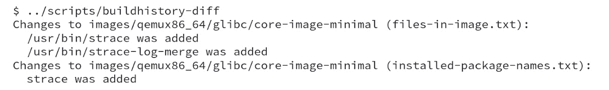
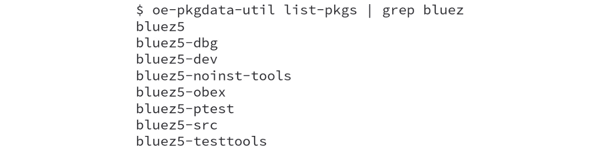
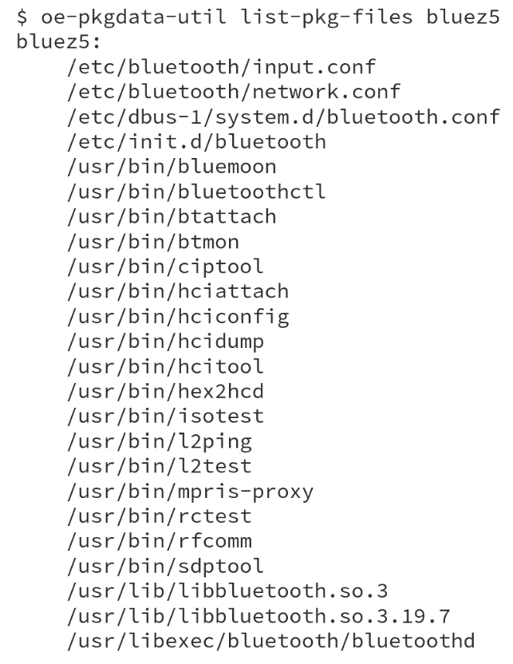
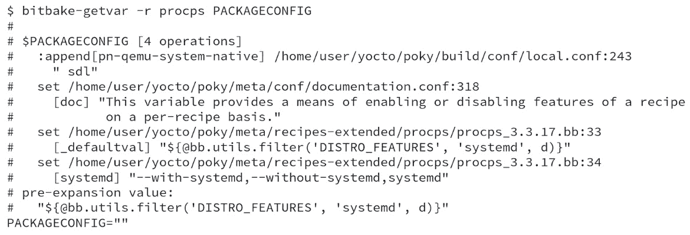
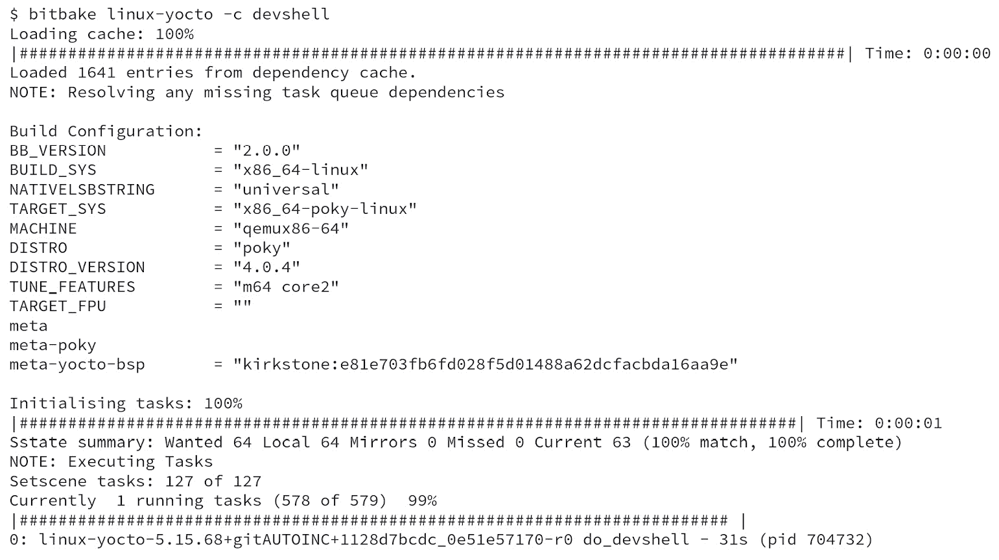
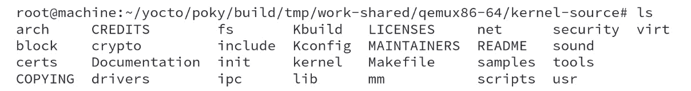

# 10

# 使用 Yocto 项目进行调试

调试过程是每个开发周期中的一个关键步骤。在本章中，我们将学习如何配置 Poky 来帮助我们进行调试过程；例如，如何配置我们的系统以提供进行远程调试所需的工具，如何使用便利的调试工具，如 `oe-pkgdata-util`、`bitbake-getvar` 和 `devshell`。

# 区分元数据调试和应用程序调试

在深入调试细节之前，我们需要认识到调试有不同类型，如元数据调试和运行时代码调试。

元数据调试是必需的，以确保 BitBake 任务的行为符合我们的目标，并在不符合时找出罪魁祸首。例如，某个配方可能需要修复以启用某个功能。在这种情况下，我们可以使用 BitBake 在主机上生成的多个日志文件来帮助追踪相关任务的执行路径。

另一方面，调试运行时代码更为自然，因为它本质上与应用程序、库或内核的典型开发周期相同。根据我们希望解决的问题，所需的工具可能从调试器到代码插装（例如，添加调试打印）不等。

# 跟踪镜像、包和 SDK 内容

确保我们拥有镜像、包和 `buildhistory` 机制的最简单方法。

当某个配方被更新为新版本或其代码发生变化时，可能会影响生成包的内容，从而影响镜像或 SDK。

Poky 涉及许多配方和镜像或 SDK 通常包含数十或数百个包。因此，跟踪包的内容可能会非常具有挑战性。Poky 提供的工具帮助完成这一任务的是 `buildhistory`。

`buildhistory`，顾名思义，保存了在使用 Poky 过程中构建的多个工件的历史记录。它跟踪包、镜像和 SDK 的构建及其内容。

要在系统中启用 `buildhistory`，我们需要在 `build/conf/local.conf` 文件中添加以下几行代码：

图 10.1 – 如何启用 buildhistory 支持

`INHERIT` 方法包括在构建过程中调用 `buildhistory` 类的钩子。同时，`BUILDHISTORY_COMMIT` 行使 BitBake 为每个新包、镜像或 SDK 构建创建 `buildhistory` 仓库中的新 Git 提交。Git 提交使得使用 `git diff` 比较两个提交之间的差异变得非常简单。数据存储在 `build/buildhistory` 目录下，以文本文件的形式方便使用。

Poky 提供了一种工具，称为 `buildhistory-diff`，以更简洁的方式输出两个 `buildhistory` 状态之间的差异，这在检查变化时非常有用。`buildhistory-diff` 工具以更有意义的方式输出任何两个 Git 版本之间的差异。

例如，假设我们在 `core-image-minimal` 镜像中添加了 `strace` 软件包并进行了构建。在这种情况下，可以使用 `buildhistory-diff` 命令检查生成的更改，如下图所示：

图 10.2 – buildhistory-diff 的结果

对于每个软件包构建，`buildhistory` 会生成一个子软件包清单、安装脚本、文件所有权和大小清单、依赖关系等。此外，还会为镜像和 SDK 创建软件包、文件系统文件和依赖图之间的依赖关系。

为了更好地了解 `buildhistory` 提供的功能和特性，请参考 *Yocto 项目开发任务中的构建输出质量维护* *手册*（[`docs.yoctoproject.org/4.0.4/dev-manual/common-tasks.html#maintaining-build-output-quality`](https://docs.yoctoproject.org/4.0.4/dev-manual/common-tasks.html#maintaining-build-output-quality)）。

# 调试软件包

在更复杂的配方中，我们将已安装的内容拆分成几个子软件包。子软件包可以是可选功能、模块或任何其他可选安装的文件集。

要检查配方内容如何被拆分，我们可以使用 `build/tmp/work/<arch>/<recipe name>/<software version>/packages-split` 目录。它包含每个子软件包的子目录，并且在子树中有其内容。

在错误的内容拆分中，可能的原因我们定义如下：

+   内容未被安装（例如，安装脚本中的错误）

+   应用程序或库配置错误（例如，禁用的功能）

+   元数据错误（例如，错误的软件包顺序）

构建失败的另一个常见问题是 `sysroot` 目录中缺少必需的工件（例如，头文件或动态库）。`sysroot` 生成的对照可以在 `build/tmp/work/<arch>/<recipe_name>/<software_version>/sysroot-destdir` 中查看。

如果这还不够，我们可以通过这些日志记录功能来修改任务代码，以确定导致意外结果的逻辑错误或 bug。

## 检查软件包

Yocto 项目的核心之一是处理软件包。因此，该项目设计了 `oe-pkgdata-util` 来帮助我们检查已构建的软件包和相关数据。例如，在运行 `bitbake bluez5` 后，我们可以使用以下命令查找所有与 `bluez` 相关的软件包：

图 10.3 – 列出所有可用的软件包并过滤出与 bluez 相关的

有时，我们需要查找包含此特定文件的软件包。我们可以使用以下命令查询软件包数据库：

图 10.4 – 查找哪个软件包提供了 /usr/bin/rfcomm

另一个使用场景是当我们需要查找软件包的当前版本时，可以使用以下命令：

图 10.5 – 列出 bluez5 软件包的信息

我们还可以使用以下命令列出给定软件包的所有文件：

图 10.6 – 列出 bluez5 软件包中的文件

`oe-pkgdata-util` 脚本是一个有用的工具，帮助我们调试打包过程。

# 任务执行期间的日志信息

BitBake 提供的日志工具对于跟踪代码执行路径非常有用。BitBake 提供了用于 Python 和 Shell 脚本代码的日志功能，具体如下：

+   `bb.fatal`、`bb.error`、`bb.warn`、`bb.note`、`bb.plain` 和 `bb.debug`。

+   `bbfatal`、`bberror`、`bbwarn`、`bbnote`、`bbplain` 和 `bbdebug`。

这些日志功能非常相似，但有一些小的区别，具体如下：

+   `bb.fatal` 和 `bbfatal`：这些日志消息具有最高优先级，因为它们打印消息并终止处理，导致构建中断。

+   `bb.error` 和 `bberror`：这些显示错误信息，但不会强制停止构建。

+   `bb.warn` 和 `bbwarn`：这些用于向用户发出警告。

+   `bb.note` 和 `bbnote`：这些用于向用户添加备注，仅供参考。

+   `bb.plain` 和 `bbplain`：这些用于输出信息。

+   `bb.debug` 和 `bbdebug`：这些用于添加调试信息，显示内容取决于使用的调试级别。

在 Python 和 Shell 脚本中使用日志功能有一个微妙的区别。Python 中的日志功能直接由 BitBake 处理，显示在控制台，并存储在 `build/tmp/log/cooker/<machine>` 中的执行日志中。而在 Shell 脚本中使用日志功能时，信息会输出到单独的任务日志文件，这些文件可以在 `build/tmp/work/<arch>/<recipe name>/<software version>/temp` 中找到。

在 temp 目录中，我们可以检查每个任务的脚本，使用 `run.<task>.<pid>` 模式，并使用 `log.<task>.<pid>` 模式查看输出。符号链接指向最后的日志文件，使用 `log.<task>` 模式。例如，我们可以检查 `log.do_compile`，以验证在构建过程中是否使用了正确的文件。

`build/tmp/work` 目录在 *第六章* 中有详细介绍，*详细说明临时构建目录*。

# 调试元数据变量

要调试元数据变量，我们可以使用 `bitbake-getvar` 脚本。它使用 BitBake 内部数据获取特定变量的值及其归属历史。

例如，要检查 `procps` 配方的 `PACKAGECONFIG` 变量，我们可以使用以下命令：

图 10.7 – bitbake-getvar -r procps PACKAGECONFIG 的结果

从 *图 10.7* 中，我们可以看到 `PACKAGECONFIG` 在末尾是空的。我们还可以看到 `defaultval` 在 `meta/recipes-extended/procps/procps_3.3.17.bb` 文件的第 33 行被设置为 `"${@bb.utils.filter('DISTRO_FEATURES', 'systemd', d)}"`。

我们可以在以下截图中看到 `procps` 食谱的第 33 行和第 34 行：

图 10.8 - procps 食谱的第 33 行和第 34 行

`bitbake-getvar` 脚本可以用来检查某个特性是否启用，或者确保某个变量已按预期展开。

# 使用开发 shell

开发 shell 在编辑软件包或调试构建失败时是一个有用的工具。使用 `devshell` 时会执行以下步骤：

1.  源文件被提取到工作目录中。

1.  补丁已应用。

1.  在工作目录中打开了一个新的终端。

所有构建所需的环境变量都可以在新终端中使用，因此我们可以使用 `configure` 和 `make` 等命令。这些命令的执行方式就像构建系统正在运行它们一样。

以下命令是一个示例，使用 `devshell` 在名为 `linux-yocto` 的目标上：

图 10.9 – 运行 linux-yocto 食谱的 devshell

来自 *图 10.9* 的命令使我们能够重新处理 Linux 内核源代码、构建它，并根据需要修改其代码。在 *图 10.10* 中，您可以看到执行 `bitbake linux-yocto -c devshell` 命令后的日志：

图 10.10 – bitbake linux-yocto -c devshell 的日志

注意

需要特别注意的是，`devshell` 内部所做的更改在不同的构建之间不会持久化；因此，我们必须在离开时记录任何重要的更改。

由于我们有源代码可用，可以使用它生成额外的补丁。一个方便的方法是使用 Git 和 `git format-patch` 创建补丁，然后将其包含到食谱中。

以下截图显示了在调用 `devshell` 任务后打开的 `devshell` 窗口：

图 10.11 – WORKDIR 目录中的文件列表

`devshell` 命令适合处理小任务。但当需要进行更复杂的修改时，使用外部工具链或 `devtool` 可能是更好的选择。

要将生成的补丁包含到食谱中并使其持久化，请参见 *第十三章*，*自定义* *现有食谱*。

# 使用 GNU 调试器进行调试

在开发任何项目时，我们时常会遇到难以理解的微妙错误。GDB 作为一个包包含在 Poky 中。它默认安装在 SDK 镜像中，正如在*第九章*中详细介绍的那样，*使用 Yocto 项目进行开发*。

注意

要在镜像中安装包含调试符号和工具的调试包，请在`build/conf/local.conf`中添加`IMAGE_FEATURES += "dbg-pkgs tools-debug"`。

使用 SDK 或包含调试包和工具的镜像，可以直接在目标设备上调试应用程序，复制我们通常在机器上进行的相同开发工作流程。

由于内存或磁盘空间限制，GDB 可能无法在某些目标设备上使用。此限制的主要原因是 GDB 需要在开始调试之前加载调试信息和调试过程的二进制文件。

为了克服这些限制，我们可以使用`gdbserver`，它在使用`tools-debug`时默认包含在`IMAGE_FEATURES`中。它在目标设备上运行，不会从被调试进程加载任何调试信息。相反，GDB 实例会在构建主机上处理调试信息。主机 GDB 向`gdbserver`发送控制命令，以控制被调试的应用程序，因此目标设备不需要安装调试符号。

然而，我们必须确保主机能够访问包含调试信息的二进制文件。因此，建议目标设备的二进制文件在没有优化的情况下编译，以便于调试过程。

使用`gdbserver`并正确配置主机和目标的过程详细介绍了在 Yocto 项目开发任务手册中的*远程调试 GNU 项目调试器(GDB)部分*（[`docs.yoctoproject.org/4.0.4/dev-manual/common-tasks.html#debugging-with-the-gnu-project-debugger-gdb-remotely`](https://docs.yoctoproject.org/4.0.4/dev-manual/common-tasks.html#debugging-with-the-gnu-project-debugger-gdb-remotely)）。

# 总结

本章中，我们学习了如何配置 Poky 来帮助我们进行调试过程。我们了解了可用于调试的部署目录内容，并且学习了如何使用`buildhistory`跟踪我们的更改。我们还介绍了如何使用`oe-pkgdata-util`查看包信息，使用`bitbake-getvar`调试变量展开，如何使用`devshell`模拟 BitBake 找到的相同构建环境，以及如何配置系统以提供进行 GDB 调试所需的工具。

在下一章中，我们将学习如何使用外部层扩展 Poky 源代码。首先，我们将介绍层次结构的概念。接下来，我们将详细学习每种层类型的目录结构和内容。
