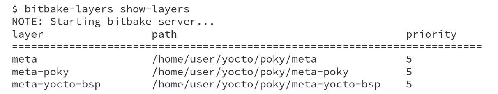
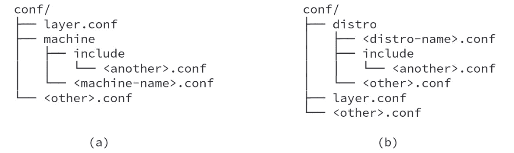
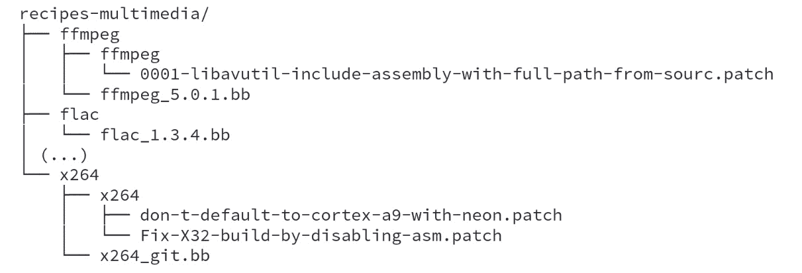
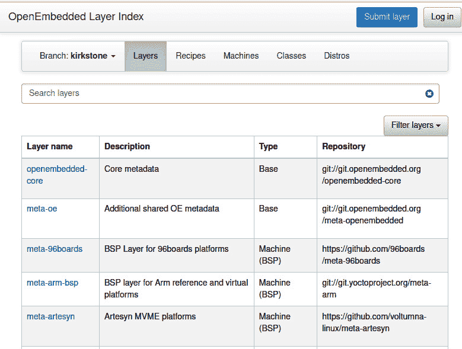
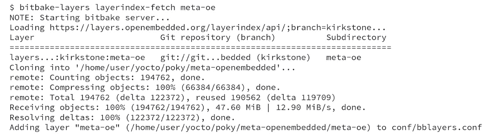

# 探索外部层

Poky 最具魅力的特点之一是使用外部层的灵活性。在本章中，我们将探讨为什么这是一个至关重要的功能，以及如何利用它。我们还将了解不同类型的层及其目录树布局。最后，在本章结束时，我们将学习如何将新层包含到我们的项目中。

# 通过层提供灵活性

Poky 包含散布在配置定义文件（如机器和发行版文件）、类和食谱中的元数据，涵盖了从简单应用程序到完整图形堆栈和框架的所有内容。BitBake 可以从多个地方加载元数据集合，这些地方被称为元数据层。

使用层的最大优势是能够将元数据分割成逻辑单元，这使得用户只需选择项目所需的元数据集合。

使用元数据层使我们能够执行以下操作：

+   改善代码复用

+   在不同团队、社区和供应商之间共享并扩展工作

+   提高 Yocto 项目社区的代码质量，因为多个开发者和用户会共同关注他们感兴趣的特定元数据层。

我们可以出于不同的原因配置系统，例如需要启用/禁用某个功能或更改构建标志以启用特定架构优化。这些都是使用层进行定制的示例。

此外，我们应该将元数据组织在不同的层中，而不是创建自定义项目环境、更改食谱或修改 Poky 层中的文件。组织越分离，未来项目中重用层就越容易，因为 Poky 源代码也分为不同的层。默认情况下，它包含三个层，正如我们从以下命令行的输出中看到的那样：

图 11.1 – bitbake-layers show-layers 的结果

命令行输出显示任何层的以下三个基本属性：

+   `meta` 字符串。

+   `BBPATH` 变量。

+   `.bbappend`文件应该是连接在一起的。这意味着，如果两个层包含相同的食谱文件（`.bb`），则优先级最高的那个文件会被使用。对于`.bbappend`，每个`.bbappend`文件都会包含在原始食谱中。层的优先级决定了包含的顺序，因此优先级最高层中的`.bbappend`文件会最先附加，其他层的文件则依次附加。

以 Poky 为例，它有三个主要的单独层。`meta-yocto-bsp`层是 Poky 的参考**板级支持包**（**BSP**）层。它包含机器配置文件和食谱，用于为机器配置软件包。作为参考 BSP 层，它可以作为示例使用。

`meta-poky` 层是 Poky 参考分发层。它包含 Yocto 项目默认使用的分发配置。此默认分发在 `poky.conf` 文件中进行了描述，广泛用于测试产品。它可以作为设计自定义分发时的起点。

另一种层是软件层，它仅包含应用程序或应用程序的配置文件，可以用于任何架构。软件层的种类繁多。举几个例子，`meta-java`、`meta-qt5` 和 `meta-browser`。`meta-java` 层提供 Java 运行时和 SDK 支持，`meta-qt5` 层包括 Qt5 支持，`meta-browser` 支持 Firefox 和 Chrome 等网页浏览器。

`meta` 层是 OpenEmbedded 核心元数据，包含食谱、类和 QEMU 机器配置文件。它可以视为一种混合层类型，因为它具有软件集合、BSP 定义和 Yocto 项目用作基础的分发。

有时，您的产品可能有特殊需求，需要根据要求修改 `build/conf/local.conf` 文件。最合适且可维护的解决方案是创建一个分发层，将分发定义文件放在其中。

提示

`build/conf/local.conf` 文件是一个易变的文件，不应由 Git 跟踪。

我们不应依赖它来设置包版本、提供者和产品的系统功能，而应仅将其作为开发过程中测试的快捷方式。

避免在 `build/conf/local.conf` 中添加自定义设置，有助于使我们的构建过程在之后可复现。

# 详细描述一个层的源代码

通常，一个层会有一个目录树，如下图所示：

图 11.2 – 标准层布局

在此目录中有两个文件，`<layer>/COPYING` 和 `<layer>/README`，分别是许可证和给用户的消息。在 `<layer>/README` 中，我们必须指定层的用户需要知道的任何其他依赖关系和信息。`meta-` 前缀对于层来说不是必需的，但它是常用的命名约定。

`classes` 文件夹应包含该层特定的类（`.bbclass` 文件）。这是一个可选的目录。

`<layer>/conf` 文件夹是必需的，应提供配置文件（`.conf` 文件）。层配置文件 `<layer>/conf/layer.conf` 将在下一章详细介绍，它是包含层定义的文件。

如*图 11.2*所示，`<layer>/conf` 文件夹的目录布局示例，其中 **(a)** 展示了 BSP 层的结构，**(b)** 展示了分发层的结构：

图 11.3 – BSP 和分发层的 <layer>/conf 布局

`recipe-*` 文件夹是按类别分隔的配方集群——例如，`recipes-core`、`recipes-bsp`、`recipes-graphic`、`recipes-multimedia` 和 `recipes-kernel`。在每个以 `recipes-` 为前缀的文件夹内，有一个目录，存放着配方名称或一组配方。里面放置的是以 `.bb` 或 `.bbappend` 结尾的配方文件。例如，我们可以从 `meta` 层中找到以下截图：

图 11.4 – 配方-*布局示例

# 添加元层

我们可以在 [`layers.openembedded.org`](http://layers.openembedded.org) 找到大多数可用的元层。这里有来自 Yocto 项目、OpenEmbedded、各社区和公司的数百个元层，可以手动克隆到项目的源代码目录中。

例如，要在我们的项目中包含 `meta-oe`（`meta-openembedded` 仓库中的多个元层之一），我们可以修改配置文件的内容，或使用 BitBake 命令行。然而，我们首先需要获取该层的源代码。请在您的 Poky 源代码目录中运行以下命令：

图 11.5 – 克隆 meta-openembedded 层

我们需要修改 `build/conf/bblayer.conf` 文件，添加层的位置，使用其绝对路径。请参见**第 12 行**，如 *图 11.6* 所示：

图 11.6 – 在包含 meta-openembedded 层后，`build/conf/bblayers.conf` 的内容

另外，我们可以使用`bitbake-layers`工具来为我们执行包含操作。这可以通过在`build`目录下运行以下命令来完成：

图 11.7 – 添加层位置的命令行

# Yocto 项目层生态系统

创建一个层是非常方便的。为了让所有可用的层更容易访问，OpenEmbedded 社区开发了一个索引，地址为 [`layers.openembedded.org`](http://layers.openembedded.org)，大部分层都可以在这里找到。其**Layers**标签页的示例如下所示：

图 11.8 – OpenEmbedded 层索引（Kirkstone）

OpenEmbedded 层索引网站的另一个方便的用例是搜索特定的软件类型或配方。OpenEmbedded 层索引可以通过允许我们搜索以下内容来帮助我们：

+   机器

+   发行版

+   层

+   配方

+   类别

`bitbake-layers` 工具还支持使用 OpenEmbedded 层索引。例如，要添加 `meta-oe` 层，我们可以使用以下命令：

图 11.9 – 从 OpenEmbedded 层索引中获取一个层

# 小结

在本章中，我们介绍了层的概念。我们详细了解了目录结构以及每种层类型中的内容。此外，我们还学习了如何手动或使用 BitBake 命令行将外部层添加到我们的项目中，以及如何使用 OpenEmbedded 层索引轻松找到我们需要的可用层。

在下一章，我们将进一步了解为什么需要创建新层，以及它们中包含的常见元数据是什么（如机器定义文件、食谱和镜像）。最后，我们将通过一个分发定制的例子来总结。
