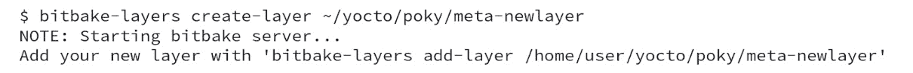
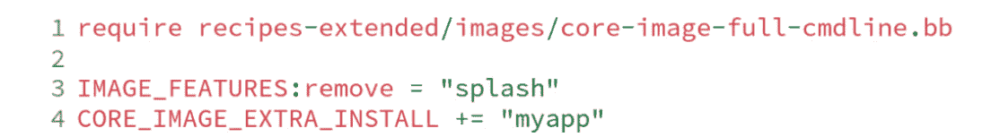
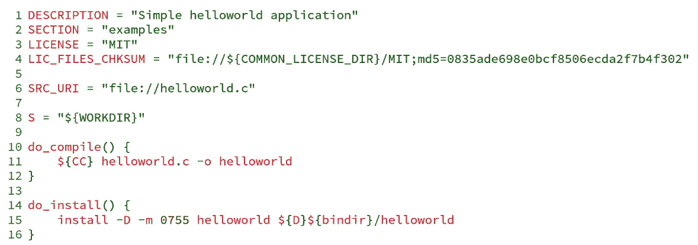
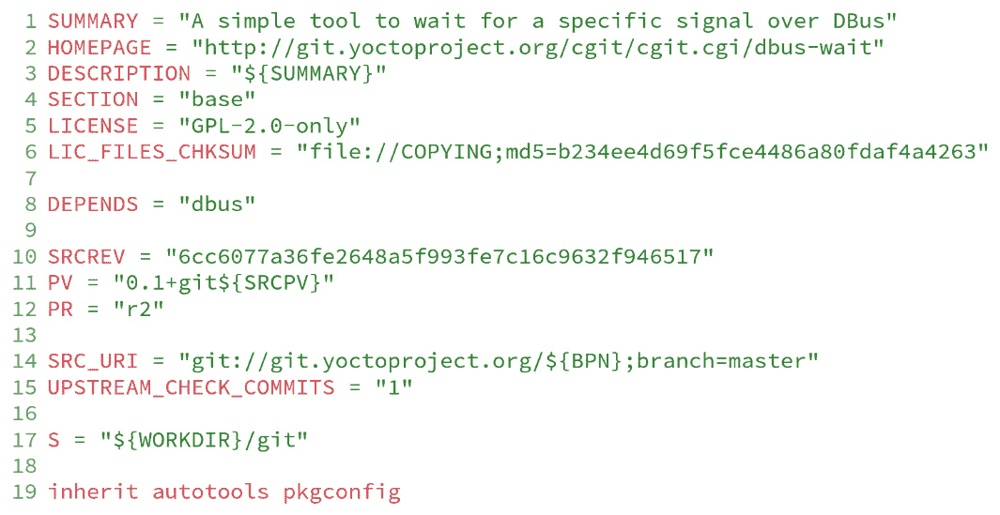
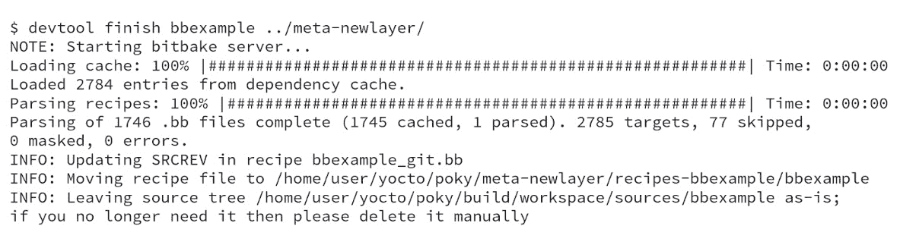
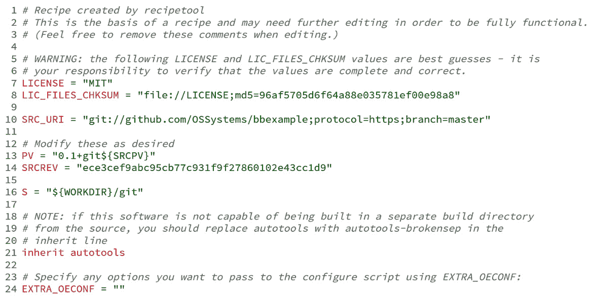
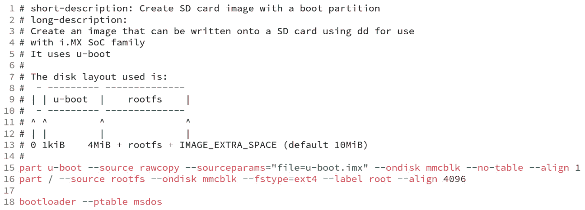
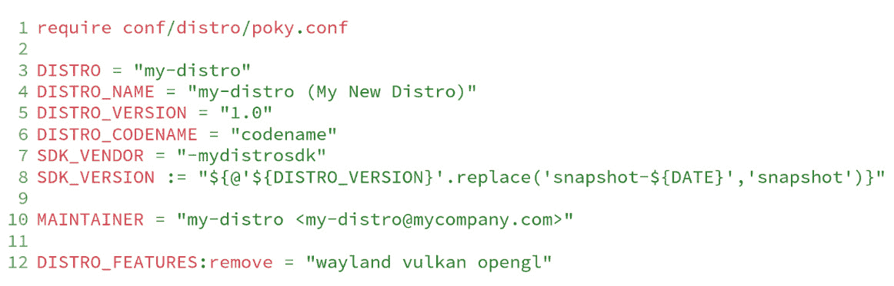

# 第十二章：创建自定义层

除了使用来自社区或供应商的现有层之外，本章将教我们如何为我们的产品创建层。此外，我们还将学习如何创建机器定义和分发，并从中获益，以便更好地组织我们的源代码。

# 创建新层

在创建我们的层之前，最好先检查一下以下网站是否已有类似的层：[`layers.openembedded.org`](http://layers.openembedded.org)。

如果我们仍在寻找适合我们需求的层，下一步是创建目录。通常，层的名称以`meta-`开头，但这不是技术限制。

`<layer>/conf/layer.conf`文件是每个层所需的层配置文件。新层可以通过一个名为`bitbake-layers`的工具创建，该工具来自 Poky 的 BitBake，如下命令所示：

图 12.1 – 使用 bitbake-layers 创建新层

创建层之后，我们需要使用以下命令将其包含在`build/conf/bblayers.conf`文件中：

图 12.2 – 将 meta-newlayer 添加到 build/conf/bblayers.conf

提示

`bitbake-layers`工具默认生成的层优先级为 6。我们仍然可以通过参数自定义优先级。

最后一条命令会生成层，如下图所示：

图 12.3 – 创建时的 meta-newlayer 布局

`meta-newlayer`的默认层配置文件是让层正常工作的最小配置。然而，它可以定制以包含未来所需的配置。

以下图示展示了我们刚创建的`meta-newlayer`层的默认`conf/layer.conf`内容：

图 12.4 – `meta-newlayer/conf/layer.conf`最小配置

一些常用的变量可能需要添加或更改，它们是`LAYERVERSION`和`LAYERDEPENDS`。这些变量在我们的层需要其他层才能工作时很有用。两个变量的名称必须以层的名称作为后缀，如下所示：

+   `LAYERVERSION`：这是一个可选变量，用于指定层的版本号。该变量在`LAYERDEPENDS`变量中使用，用于依赖特定版本的层—例如，`LAYERVERSION_meta-newlayer = "``1"`。

+   `LAYERDEPENDS`：列出了配方所依赖的层，层之间用空格隔开—例如，我们通过`LAYERDEPENDS_meta-newlayer += "``meta-otherlayer:2"`添加对版本`2`的`meta-otherlayer`的依赖。

如果无法满足依赖关系或版本号不匹配，则会发生错误。层结构的基础已创建。在接下来的章节中，我们将学习如何扩展它。

# 向层添加元数据

层元数据可以实现两个目标——添加新软件或特性，以及修改现有元数据。

我们可以在新层中包含多个元数据文件，如配方、图像和 `bbappend` 文件。`meta-yocto-bsp` 和 `meta-yocto` 中有几个 `bbappend` 文件的示例。我们将在 *第十三章* 中探讨它们的一些常见用途，*自定义* *现有配方*。

在接下来的章节中，我们将介绍一些常见的层元数据修改。

## 创建图像

图像文件本质上是一组为某个目的而分组的包，并以受控方式进行配置。我们可以从头开始创建图像，也可以通过重用现有图像并添加额外的必要包来创建图像。

我们应尽可能重用现有图像，这样可以使代码维护更加易于管理，并突出功能差异。例如，我们可能希望包含一个应用程序并从 `core-image-full-cmdline` 图像文件中移除一个图像功能。在这种情况下，我们可以在 `recipes-mine/images/my-image-full-cmdline.bb` 文件中创建一个图像，包含以下代码行：

图 12.5 – my-image-full-cmdline.bb 的内容

`core-image` 类提供了图像功能，提供了常用功能的有用构建块，创建图像时应该使用它。例如，我们可以在 `recipes-mine/images/my-image-strace.bb` 文件中创建一个包含以下代码行的图像：

图 12.6 – my-image-strace.bb 的内容

提示

列表追加操作符（`+=`）确保可以通过 `build/conf/local.conf` 添加新的 `EXTRA_IMAGE_FEATURES` 变量。

`CORE_IMAGE_EXTRA_INSTALL` 是我们在继承 `core-image` 类时应使用的变量，它有助于图像的创建。该类为 `IMAGE_FEATURES` 变量添加了支持，避免了代码重复。

目前，支持以下图像功能，详细信息请见 *Yocto 项目参考手册* 中的 *图像功能* 部分 ([`docs.yoctoproject.org/4.0.4/ref-manual/features.html#image-features`](https://docs.yoctoproject.org/4.0.4/ref-manual/features.html#image-features)):

+   `allow-empty-password`：允许 Dropbear 和 OpenSSH 接受来自密码为空的账户的登录。

+   `allow-root-login`：允许 Dropbear 和 OpenSSH 接受 `root` 登录。

+   `dbg-pkgs`：为给定图像中安装的所有包安装调试符号包。

+   `debug-tweaks`: 使镜像适合开发（例如，允许 root 登录、无密码登录——包括 root 登录，并启用后安装日志记录）。

+   `dev-pkgs`: 为给定镜像中所有已安装的包安装开发包（头文件和额外的库链接）。

+   `doc-pkgs`: 安装所有已安装包的文档包。

+   `empty-root-password`: 如果希望允许以空密码进行 root 登录，则需要此功能或 `debug-tweaks`。

+   `hwcodecs`: 安装硬件加速编解码器。

+   `lic-pkgs`: 安装所有已安装包的许可证包。

+   `nfs-server`: 安装 NFS 服务器。

+   `overlayfs-etc`: 配置 `/etc` 目录使用 `overlayfs`。这使你可以将设备特定的信息存储在其他位置，特别是当根文件系统配置为只读时。

+   `package-management`: 安装包管理工具并保留包管理数据库。

+   `perf`: 安装性能分析工具，如 `perf`、`systemtap` 和 **LTTng**。

+   `post-install-logging`: 使你能够在目标系统的首次启动时，将后安装脚本的运行记录到 `/var/log/postinstall.log` 文件中。

+   `ptest-pkgs`: 安装为所有启用 `ptest` 的配方提供的 `ptest` 包。

+   `read-only-rootfs`: 创建一个根文件系统为只读的镜像。

+   `read-only-rootfs-delayed-postinsts`: 与 `read-only-rootfs` 配合使用时，指定仍然允许后安装脚本的执行。

+   `serial-autologin-root`: 与 `empty-root-password` 配合使用时，将自动在串行控制台上以 `root` 用户登录。

+   `splash`: 使你能够在启动过程中显示启动画面。默认情况下，该画面由 `psplash` 提供，允许进行自定义。

+   `ssh-server-dropbear`: 安装 Dropbear 最小化 SSH 服务器。

+   `ssh-server-openssh`: 安装 OpenSSH SSH 服务器，其功能比 Dropbear 更全面。请注意，如果 `IMAGE_FEATURES` 中同时存在 OpenSSH SSH 服务器和 Dropbear 最小化 SSH 服务器，则 OpenSSH 会优先安装，Dropbear 将不会被安装。

+   `stateless-rootfs`: 指定创建一个无状态的镜像——在使用 `systemd` 时，`systemctl-native` 将不会在镜像上运行，镜像将在运行时由 `systemd` 填充。

+   `staticdev-pkgs`: 安装静态开发包，这是为给定镜像中所有已安装包提供的静态库（例如，`*.a` 文件）。

+   `tools-debug`: 安装调试工具，如 `strace` 和 `gdb`。

+   `tools-sdk`: 安装一个完整的 SDK，运行在设备上。

+   `tools-testapps`: 安装设备测试工具（例如，触摸屏调试）。

+   `weston`: 安装 Weston（参考 Wayland 环境）。

+   `x11-base`: 安装具有最小环境的 X 服务器。

+   `x11`: 安装 X 服务器。

+   `x11-sato`: 安装 OpenedHand Sato 环境。

## 添加包配方

Poky 包含多个类，这些类将基于 Autotools、CMake 和 Meson 的常见开发工具的过程抽象为项目。一个软件包食谱是我们如何指示 BitBake 执行 `fetch`、`unpack`、`patch`、`configure`、`compile` 和 `install` 等任务的方式，适用于我们的应用程序、内核模块或项目提供的任何软件。此外，可以在*Yocto 项目参考手册*的*类*部分查看 Poky 中包含的类的列表（[`docs.yoctoproject.org/4.0.4/ref-manual/classes.html`](https://docs.yoctoproject.org/4.0.4/ref-manual/classes.html)）。

提供了一个简单的食谱，显式地执行 `compile` 和 `install` 任务，如下所示：

图 12.7 – 手动创建的 helloworld 食谱

`do_compile` 和 `do_install` 代码块为我们提供了 Shell 脚本命令，用于构建并将生成的二进制文件安装到目标目录中，该目录被引用为 `${D}`，其目的是将安装目录重新定位到 `build/tmp/work/` 目录中的一个路径。假设我们正在处理一个基于 Autotools 的项目。如果是这样，我们可以通过使用 `autotools` 类来避免大量的代码重复，示例如下，从 `poky/meta/recipes-core/dbus-wait/dbus-wait_git.bb` 文件中的食谱中提取：

图 12.8 – poky/meta/recipes-core/dbus-wait/dbus-wait_git.bb 的内容

在*第 19 行*继承 `autotools` 类的简单操作就是提供执行以下任务所需的所有代码：

+   更新 `configure` 脚本代码和工件

+   更新 `libtool` 脚本

+   运行 `configure` 脚本

+   运行 `make`

+   运行 `make install`

相同的概念适用于其他构建工具，正如**CMake**和**Meson**的情况。此外，支持的类数量在每个版本中不断增长，以支持新的构建系统并避免代码重复。

### 使用 devtool 自动创建基本包食谱

正如我们在*第九章*的*从外部 Git 仓库创建食谱*一节中所学到的，*使用 Yocto 项目开发*，`devtool` 可以通过以下命令自动化基于现有项目创建食谱的过程：

图 12.9 – 用于生成 bbexample 食谱的命令行

在幕后，`devtool` 运行了 `recipetool` 来生成食谱，并将所有预构建的信息自动配置到新的食谱文件中。最终结果存储在 `workspace` 目录中，这是 `devtool` 维护的一个层。要将食谱文件复制到目标层，我们可以使用 `devtool` 命令，如下所示：

图 12.10 – 将 bbexample 配方部署到 meta-newlayer 的命令行

创建的`meta-newlayer/recipes-bbexample/bbexample/bbexample_git.bb`文件如下所示：

图 12.11 – bbexamle_git.bb 的内容

`devtool`已创建一个基础配方，这不应被视为最终配方。你应该检查编译选项、额外的元数据等。

## 为新机器定义添加支持

尽管为 Poky 创建新机器定义是一个简单的任务，但不应低估其复杂性。根据我们在 BSP 层需要支持的功能集，可能需要检查引导加载程序、内核和硬件支持驱动程序。

Yocto 项目支持 ARM、ARM64、x86、x86-64、PowerPC、PowerPC 64、MIPS、MIPS64、RISC-V 32 和 RISC-V 64，代表目前最常用的嵌入式架构。

机器定义中使用的主要变量集如下：

+   `TARGET_ARCH`: 设置机器架构——例如，ARM 和 x86-64

+   `PREFERRED_PROVIDER_virtual/kernel`: 如果需要使用特定内核，这会覆盖默认的内核（`linux-yocto`）

+   `SERIAL_CONSOLES`: 定义串行控制台及其速度

+   `MACHINE_FEATURES`: 描述硬件特性，以便所需的软件栈默认包含在映像中

+   `KERNEL_IMAGETYPE`: 用于选择内核镜像类型——例如，`bzImage`或`Image`

+   `IMAGE_FSTYPES`: 设置生成的文件系统映像类型——例如，`tar.gz`、`ext4`和`ubifs`

你可以在 Poky 源代码中的`meta-yocto-bsp/conf/machine/`目录中查看机器定义文件的示例。描述新机器时，我们应特别注意在`MACHINE_FEATURES`中支持的特定功能。这样，所需的软件就会安装到映像中。当前`MACHINE_FEATURES`的可用值如下：

+   `acpi`: 硬件具有 ACPI（仅限 x86/x86-64）

+   `alsa`: 硬件具有 ALSA 音频驱动

+   `apm`: 硬件使用 APM（或 APM 仿真）

+   `bluetooth`: 硬件集成了蓝牙

+   `efi`: 支持通过 EFI 引导

+   `ext2`: 硬件硬盘或微型硬盘

+   `keyboard`: 硬件具有键盘

+   `numa`: 硬件具有非统一内存访问

+   `pcbios`: 支持通过 BIOS 引导

+   `pci`: 硬件具有 PCI 总线

+   `pcmcia`: 硬件具有 PCMCIA 或 CompactFlash 插槽

+   `phone`: 移动电话（语音）支持

+   `qemu-usermode`: QEMU 可以为此机器提供用户模式仿真

+   `qvga`: 机器具有 QVGA（320x240）显示屏

+   `rtc`: 机器具有实时时钟

+   `screen`: 硬件具有显示屏

+   `serial`: 硬件具有串行支持（通常是 RS232）

+   `touchscreen`: 硬件具有触摸屏

+   `usbgadget`：硬件支持 USB 小工具设备

+   `usbhost`：硬件支持 USB 主机功能

+   `vfat`：支持 FAT 文件系统

+   `wifi`：硬件集成了 Wi-Fi

### 为你的机器打包一个镜像

创建一个可供机器使用的镜像应该在任何 BSP 支持层开发的最后进行。镜像的类型取决于处理器、板上包含的外设和项目的限制。

`wic`提供了一种灵活的方式来生成此镜像。它允许基于模板文件（`.wks`）创建分区镜像，模板文件是用描述目标镜像布局的通用语言编写的。语言定义可以在*OpenEmbedded Kickstart (.wks)参考*部分中找到，该部分来自*Yocto 项目参考*手册（[`docs.yoctoproject.org/4.0.4/ref-manual/kickstart.html#openembedded-kickstart-wks-reference`](https://docs.yoctoproject.org/4.0.4/ref-manual/kickstart.html#openembedded-kickstart-wks-reference)）。

`.wks`文件被放置在我们层中的`wic`目录下。这个目录通常会有多个文件，用于指定不同的镜像布局。然而，必须记住所选择的结构必须与机器匹配——例如，当考虑使用一个基于 i.MX 的机器，该机器通过 SD 卡上的 U-Boot 启动，SD 卡有两个分区，一个用于启动文件，另一个用于`rootfs`。相应的`.wks`文件如下所示：

图 12.12 – 使用 SPL 的 i.MX 设备的.wks 文件示例

要启用基于`wic`的镜像生成，只需将`wic`添加到`IMAGE_FSTYPES`中即可。我们还可以通过设置`WKS_FILE`变量来定义要使用的`.wks`文件。

## 使用自定义发行版

创建一个发行版是简单与复杂的结合。创建发行版文件是直接的，但对 Poky 的行为有重大影响。根据我们的选项，它可能会导致与以前构建的二进制文件的不兼容。

发行版是我们定义全局选项的地方，如工具链版本、图形后端和对**OpenGL**的支持。只有当 Poky 提供的默认设置无法满足我们的要求时，我们才应该创建一个发行版。

通常，我们打算改变 Poky 中的少量选项。例如，我们删除了`<layer>/conf/distro/my-distro.conf`文件，其内容如下：

图 12.13 – 自定义发行版文件的示例

要使用刚刚创建的发行版，我们需要将以下代码添加到`build/conf/local.conf`文件中：

图 12.14 – 设置 DISTRO 的行，在`build/conf/local.conf`中

`DISTRO_FEATURES` 变量可能会影响配方的配置方式以及包在镜像中的安装方式——例如，如果我们想在任何机器和镜像中使用声音，必须具备 `alsa` 功能。以下列表显示了 `DISTRO_FEATURES` 支持值的当前状态，详细信息请参见 *Distro Features* 部分，位于 *Yocto Project Reference* *Manual*（[`docs.yoctoproject.org/4.0.4/ref-manual/features.html#distro-features`](https://docs.yoctoproject.org/4.0.4/ref-manual/features.html#distro-features)）：

+   `3g`: 包括对蜂窝数据的支持

+   `acl`: 包括访问控制列表（Access Control List，简称 ACL）支持

+   `alsa`: 包括高级 Linux 声音架构（Advanced Linux Sound Architecture，简称 ALSA）支持（如果有的话，会安装 OSS 兼容内核模块）

+   `api-documentation`: 在配方构建过程中启用生成 API 文档

+   `bluetooth`: 包括蓝牙支持（仅集成 BT）

+   `cramfs`: 包括 CramFS 支持

+   `debuginfod`: 包括通过 `debuginfod` 服务器获取 ELF 调试信息的支持

+   `ext2`: 包括支持具有内部 HDD/Microdrive 的设备的工具（用于存储文件，适用于仅 Flash 设备以外的设备）

+   `gobject-introspection-data`: 包括支持 GObject 反射的数据

+   `ipsec`: 包括 IPSec 支持

+   `ipv4`: 包括对 IPv4 的支持

+   `ipv6`: 包括对 IPv6 的支持

+   `keyboard`: 包括对键盘的支持

+   `ldconfig`: 包括对目标设备上的 `ldconfig` 和 `ld.so.conf` 的支持

+   `ld-is-gold`: 使用 gold 链接器，而非标准的 GNU 链接器（`bfd`）

+   `lto`: 启用链接时优化（Link-Time Optimization）

+   `multiarch`: 使您能够构建支持多种架构的应用程序

+   `nfc`: 包括对近场通信（Near Field Communication，简称 NFC）的支持

+   `nfs`: 包括 NFS 客户端支持

+   `nls`: 包括 **本地语言** **支持**（**NLS**）

+   `opengl`: 包括 Open Graphics Library 支持，它是一个跨语言、多平台的 API，用于渲染二维和三维图形

+   `overlayfs`: 包括 OverlayFS 支持

+   `pam`: 包括 **可插拔身份验证模块**（**PAM**）支持

+   `pci`: 包括 PCI 总线支持

+   `pcmcia`: 包括对 PCMCIA/CompactFlash 的支持

+   `polkit`: 包括 Polkit 支持

+   `ppp`: 包括 PPP 拨号支持

+   `ptest`: 使您能够构建由各个配方支持的包测试

+   `pulseaudio`: 包括对 PulseAudio 的支持

+   `seccomp`: 使您能够构建支持 `seccomp` 的应用程序，从而严格限制应用程序可调用的系统调用

+   `selinux`: 包括对 `meta-selinux` 的支持

+   `smbfs`: 包括 SMB 网络客户端支持

+   `systemd`: 包括对此 `init` 管理器的支持，完全替代 `init`，并具备并行启动服务、减少 shell 开销等功能

+   `usbgadget`: 包括 USB 小工具设备支持

+   `usbhost`: 包括 USB 主机支持

+   `usrmerge`：将 `/bin`、`/sbin`、`/lib` 和 `/lib64` 目录合并到 `/usr` 目录下的相应目录中，以提供更好的包和应用程序兼容性

+   `vfat`：包括对 FAT 文件系统的支持

+   `vulkan`：包括对 Vulkan API 的支持

+   `wayland`：包括 Wayland 显示服务器协议及其支持库

+   `wifi`：包括 Wi-Fi 支持（仅限集成）

+   `x11`：包括 X 服务器及其库

+   `xattr`：包括对扩展文件属性的支持

+   `zeroconf`：包括对零配置网络的支持

# MACHINE_FEATURES 与 DISTRO_FEATURES

`DISTRO_FEATURES` 和 `MACHINE_FEATURES` 变量一起工作，为最终系统提供可行的支持。当机器支持某个特性时，并不意味着目标系统也支持它，因为发行版必须提供其底层基础支持。

例如，如果某台机器支持 Wi-Fi，但该发行版不支持，那么操作系统使用的应用程序将构建为禁用 Wi-Fi 支持的版本，因此最终的系统将不包含 Wi-Fi 支持。另一方面，如果发行版提供了 Wi-Fi 支持而机器不支持，那么构建该机器的镜像时将不会安装 Wi-Fi 所需的模块和应用程序。然而，操作系统及其模块将启用 Wi-Fi 支持。

# 理解变量的作用范围

BitBake 元数据包含成千上万的变量，但这些变量可用的作用范围取决于定义它的位置。变量有两种类型，如下所示：

+   配置文件中定义的变量是全局的，适用于每个配方，也称为配置元数据。主配置文件的解析顺序如下所示：

    +   `build/conf/local.conf`

    +   `<``layer>/conf/machines/<machine>.conf`

    +   `<``layer>/conf/distro/<distro>.conf`

+   在配方文件中定义的变量具有配方可见性范围，仅在执行任务时对特定配方有效。

# 总结

在本章中，我们介绍了如何创建新的层和元数据。首先，我们了解了如何创建机器配置、发行版定义和配方文件。然后，我们学习了如何制作镜像并将应用程序包含到镜像中。

在下一章中，我们将访问一些额外层常用的定制案例示例，例如修改现有包、向 `autoconf` 添加额外选项、应用新补丁以及将新文件包含到包中。我们将看到如何配置 `BusyBox` 和 `linux-yocto`，这两个包是嵌入式系统制作过程中常见的定制包。
