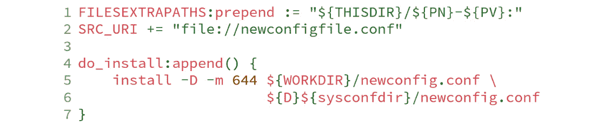
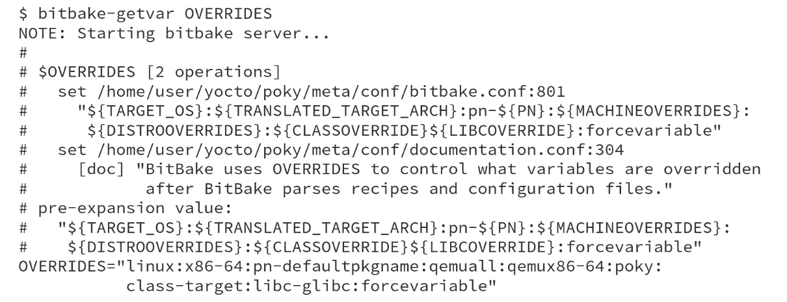
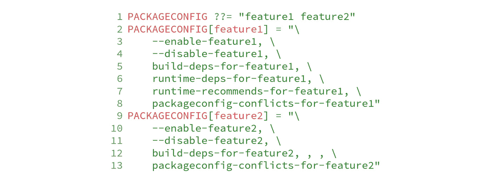
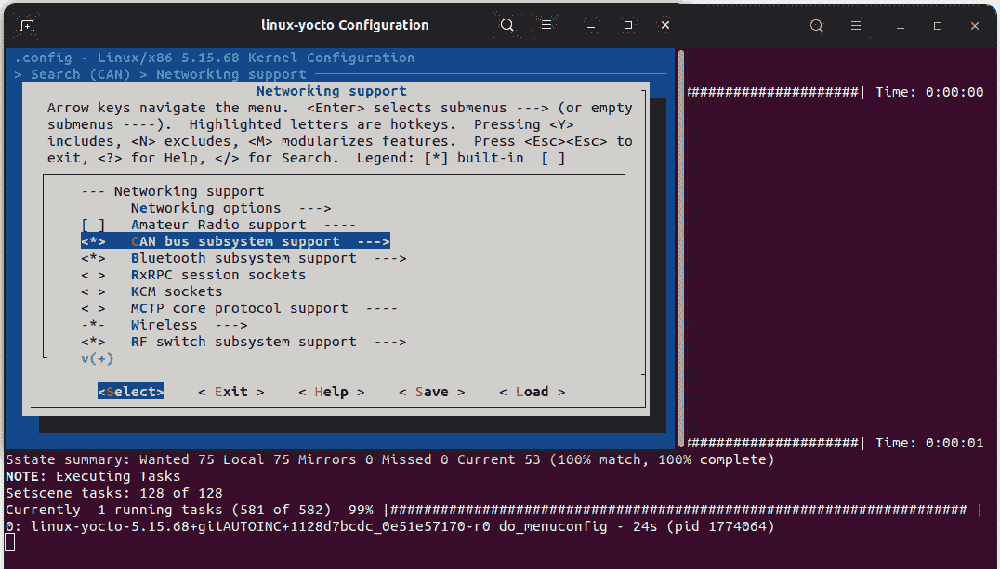

# 自定义现有食谱

在使用 Yocto 项目工具的过程中，预计我们需要自定义现有的食谱。在本章中，我们将探讨一些示例，例如更改编译选项、启用或禁用食谱的功能、应用额外的补丁，以及使用配置片段来自定义一些食谱。

# 理解常见的使用案例

现在，项目通常会有一组层来提供所需的功能。我们肯定需要在这些层的基础上进行更改，以适应我们的特定需求。这些更改可能是外观上的，也可能是实质性的，但实现方法是相同的。

我们必须创建一个 `.bbappend` 文件来更改项目层中的现有食谱。例如，假设原始食谱名为 `<original-layer>/recipes-core/app/app_1.2.3.bb`。当你创建一个 `.bbappend` 文件时，可以使用 `%` 通配符来匹配食谱名称。因此，`.bbappend` 文件可以有以下不同的形式：

+   `App_1.2.3.bbappend`：这只适用于 `1.2.3` 版本

+   `app_1.2.%.bbappend`：这只适用于 `1.2.y` 版本

+   `app_1.%.bbappend`：这只适用于 `1.x` 和 `1.x.y` 版本

+   `app_%.bbappend`：这适用于任何版本

我们可以有多个 `.bbappend` 文件，具体取决于我们希望对应用食谱进行的更改。有时我们可以将更改限制在某个版本，但有时我们希望更改所有可用的食谱。

注意

当一个食谱有多个 `.bbappend` 文件时，所有文件都会按照层的优先级顺序合并。

`.bbappend` 文件可以看作是附加在原始食谱末尾的文本。它为我们提供了一个高度灵活的机制，避免了重复源代码来应用所需的更改到项目的层。

## 扩展任务

当任务内容无法满足我们的要求时，我们会替换它（提供我们自己的实现）或附加内容。正如我们在*第八章*《深入了解 BitBake 元数据》中将更广泛地学习 BitBake 元数据语法一样，`:append` 和 `:prepend` 运算符可以用来扩展任务并加入额外内容。例如，要扩展 `do_install` 任务，我们可以使用以下代码：

图 13.1 – 扩展 do_install 任务的示例

这样，新的内容就会连接到原始任务中。

# 基于 Autotools 向食谱添加额外选项

假设我们有一个基于 Autotools 的应用程序，并且有一个现有的食谱，我们希望执行以下操作：

+   启用 `my-feature`

+   禁用 `another-feature`

用于修改的 `.bbappend` 文件内容如下：

图 13.2 – 向 Autoconf 标志添加额外配置

如果我们需要根据构建的硬件有条件地启用它，同样的策略也可以使用，具体如下：

图 13.3 – 有条件地添加额外的配置到 Autoconf 标志

Yocto 项目支持多种不同的构建系统，配置它们的变量如下表所示：

| **构建系统** | **变量** |
| --- | --- |
| Autotools | `EXTRA_OECONF` |
| Cargo | `EXTRA_OECARGO` |
| CMake | `EXTRA_OECMAKE` |
| Make | `EXTRA_OEMAKE` |
| Meson | `EXTRA_OEMESON` |
| NPM | `EXTRA_OENPM` |
| SCons | `EXTRA_OESCONS` |
| WAF | `EXTRA_OEWAF` |

表 13.1 – 配置每个构建系统的变量列表

*表 13.1*中的变量作为各自构建系统的参数传递。

# 应用补丁

在需要对现有软件包应用补丁的情况下，我们应使用`FILESEXTRAPATHS`，该变量会将新目录包含到搜索算法中，使额外的文件对 BitBake 可见，如下所示：

图 13.4 – .bbappend 文件内容仅用于应用 mypatch.patch

在前面的示例中，`THISDIR`展开为当前目录，`PN`和`PV`分别展开为软件包名称和版本。然后，这个新路径会被包含到用于文件搜索的目录列表中。预处理操作符至关重要，因为它保证即使未来在优先级较低的层中添加了相同名称的文件，文件仍然会从此目录中被选中。

BitBake 假定每个`.patch`或`.diff`扩展名的文件都是补丁文件，并会相应地应用它们。

# 向现有软件包添加额外的文件

如果我们需要包含额外的配置文件，应使用`FILESEXTRAPATHS`，正如之前示例中所解释的，并在以下代码行中展示：

图 13.5 – 安装新配置文件的.bbappend 文件内容

`do_install:append`函数将提供的代码块追加到原始`do_install`函数中已存在的元数据下方。它包括将新配置文件复制到软件包的文件系统中的命令。文件从`${WORKDIR}`复制到`${D}`，因为这两个目录是 Poky 用于构建软件包的目录，也是 Poky 用于创建软件包的目标目录。

在我们的配方中，有许多变量用来定义路径，例如 `bindir`、`datadir` 和 `sysconfdir`。`poky/meta/conf/bitbake.conf` 文件定义了所有这些常用变量。这些变量的存在使得可以根据使用场景自定义二进制文件的安装路径。例如，本地 SDK 二进制文件需要特定的安装路径，以避免与目标二进制文件发生冲突。

以下表格显示了最常用的变量及其默认展开值：

| **变量** | **默认展开值** |
| --- | --- |
| `base_bindir` | `/``bin` |
| `base_sbindir` | `/``sbin` |
| `sysconfdir` | `/``etc` |
| `localstatedir` | `/``var` |
| `datadir` | `/``usr/share` |
| `bindir` | `/``usr/bin` |
| `sbindir` | `/``usr/sbin` |
| `libdir` | `/usr/lib` 或 `/usr/lib64` |
| `libexecdir` | `/``usr/libexec` |
| `includedir` | `/``usr/include` |

表 13.2 – 常用变量及其默认展开值的列表

配方中应避免使用硬编码路径，以减少配置错误的风险。例如，当使用 `usrmerge` `DISTRO_FEATURE` 时，所有配方都会将 `base_bindir` 设置为 `bindir`，因此如果某个配方使用 `/bin` 作为硬编码路径，安装将无法按预期进行。

## 理解文件搜索路径

当一个文件（如补丁或通用文件）被包含在`SRC_URI`中时，BitBake 会搜索 `FILESPATH` 和 `FILESEXTRAPATH` 变量。默认设置是查找以下位置：

1.  `<``recipe>-<version>/`

1.  `<``recipe>/`

1.  `files/`

除此之外，它还会检查每个文件在每个文件夹中是否有要覆盖的`OVERRIDES`。为了说明这一点，考虑`foo_1.0.bb`配方。对于该文件，`OVERRIDES = "<board>:<arch>"`变量将在以下目录中按精确顺序进行搜索：

1.  `foo-1.0/<board>/`

1.  `foo-1.0/<arch>/`

1.  `foo-1.0/`

1.  `foo/<board>/`

1.  `foo/<arch>/`

1.  `foo/`

1.  `files/<board>/`

1.  `files/<arch>/`

1.  `files/`

这仅仅是举例，因为 `OVERRIDES` 的列表庞大且与机器相关。当我们使用配方时，可以使用 `bitbake-getvar OVERRIDES` 查找特定机器的可用覆盖项列表，并相应地使用它们。以下是 Poky 的输出示例：

图 13.6 – 使用 bitbake-getvar 获取 OVERRIDES 变量的值

该命令在调试过程中非常有用，可以帮助调试元数据。

## 更改配方功能配置

`PACKAGECONFIG` 是一种简化配方功能集定制的机制。它提供了一种启用和禁用配方功能的方法。例如，配方有如下配置：

图 13.7 – PACKAGECONFIG 示例

*图 13.7* 有两个功能：`feature1` 和 `feature2`。每个功能的行为由六个参数定义，参数之间用逗号分隔。您可以省略任何参数，但必须保留分隔逗号。顺序至关重要，指定如下：

1.  如果启用了该功能，额外的参数。

1.  如果功能被禁用，额外的参数。

1.  如果启用了该功能，额外的构建依赖项（`DEPENDS`）。

1.  如果启用了该功能，额外的运行时依赖项（`RDEPENDS`）。

1.  如果启用了该功能，额外的运行时推荐项（`RRECOMMENDS`）。

1.  该功能的任何冲突（互斥）`PACKAGECONFIG` 设置。

我们可以创建一个 `.bbappend` 文件，扩展 `PACKAGECONFIG` 变量的默认值，以启用 `feature2`，如下面所示：

图 13.8 – 用于扩展 PACKAGECONFIG 变量的 .bbappend 文件内容

注意

要将相同的功能添加到 `build/conf/local.conf` 文件中，我们可以使用 `PACKAGECONFIG:pn-<recipename>:append = '` `feature2'`。

必须在配方文件中检查特定包的可用 `PACKAGECONFIG` 功能列表，因为没有工具可以列出所有功能。

# 基于 Kconfig 的项目的配置片段

Kconfig 配置基础设施因其灵活性和表现力而受到欢迎。尽管它最初用于 Linux 内核，但一些其他项目也使用相同的基础设施，例如 U-Boot 和 BusyBox。

该配置基于选择性特性，您可以启用或禁用一个特性，并将此选择的结果保存在文件中以供以后使用。请考虑以下图示：

图 13.9 – 在 BusyBox KConfig 上启用或禁用 TFTPD

我们可以控制是否启用 BusyBox 中的 TFTPD 支持 **(a)** 或不启用 **(b)**。

Yocto 项目提供了一个专门的类来处理基于 Kconfig 的项目配置，允许进行称为配置片段的微小修改。我们可以使用它来启用或禁用您的机器功能，例如，在配置 `linux-yocto` 时，我们可以像下面的代码一样使用 `<layer>/recipes-kernel/linux/linux-yocto_%.bbappend`：

图 13.10 – 应用片段的 .bbappend 内容

每个配置片段必须使用 `.cfg` 文件扩展名。因此，`<layer>/recipes-kernel/linux/linux-yocto/linux-yocto/enable-can.cfg` 文件的内容如下所示：

图 13.11 – enable-can.cfg 的内容

我们可以使用 BitBake 配置或生成 Linux 内核配置文件。允许我们配置 Linux 内核的命令 `bitbake virtual/kernel -c menuconfig` 如下截图所示：

图 13.12 – 使用 bitbake virtual/kernel -c menuconfig 启用 CAN 总线子系统支持

*图 13.12* 显示了如何使用 Linux 内核的 `menuconfig` 启用 CAN 总线支持。退出并保存 `menuconfig` 时，内核配置会发生变化。

下一步是使用 `bitbake virtual/kernel -c diffconfig` 创建片段，如下截图所示：

图 13.13 – `diffconfig` 选项生成配置片段

*图 13.13* 显示了命令执行后的日志。需要注意的是，片段文件会在 `<build>/tmp/work/` 目录下创建，并且绝对路径会在日志中显示。我们必须将此片段文件复制到层中，并在 `.bbappend` 文件中使用它，以便应用配置。

提示

要保存完整的配置，我们可以使用 `bitbake virtual/kernel -c savedefconfig` 命令。此命令生成一个 `defconfig` 文件来复制相同的配置。这是一个完整的配置，而不是片段文件。

配置片段支持适用于以下食谱：

+   Linux 内核

+   U-Boot

+   BusyBox

这些食谱还提供了 `menuconfig` 和 `diffconfig` 任务。

# 总结

在本章中，我们学习了如何使用 `.bbappend` 文件定制现有的食谱，并通过此方法避免了源代码的重复。我们了解了如何启用或禁用某个功能，如何应用补丁，以及如何使用配置片段支持。

在下一章中，我们将讨论 Yocto 项目如何帮助我们处理使用不同许可证的包构建基于 Linux 的系统的法律方面。我们将了解需要哪些构件，以及如何配置 Poky 以生成应作为 copyleft 合规过程一部分共享的构件。
