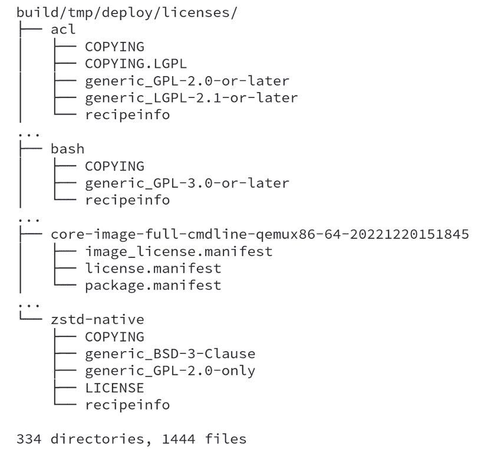

# 第十四章：实现 GPL 合规性

在本章中，我们将看到如何确保开源许可证合规性，并使用 Poky 提供所需的工件，如源代码、许可文本和衍生作品列表。这对大多数如今推出的市场产品至关重要，因为开源代码需要与专有代码共同存在。

# 理解 copyleft

**Copyleft** 是一种利用版权法最大化权利并表达自由的合法方式。然而，它会影响我们的产品。我们必须满足所有开源和自由软件许可证的义务。

在构建 Linux 发行版时，至少使用了两个项目：Linux 内核和编译器。**GNU 编译器集合** (**GCC**) 仍然是最常用的编译器。Linux 内核使用 **通用公共许可证** (**GPL**) **v2** 许可证，而 GCC 根据所使用的项目不同，使用 **GPLv2**、**GPLv2.1** 和 **GPLv3** 许可证。

然而，一个基于 Linux 的系统可以包含全球几乎所有的项目，此外还包括公司为其产品开发的所有应用程序。那么，我们如何知道包含了多少项目和许可证，并且如何满足 copyleft 合规性要求呢？

注意

本章描述了 Yocto 项目如何帮助你完成此任务，但请注意，你必须清楚地知道你需要提供的内容以及可能的许可证不兼容问题。如果有任何疑问，请咨询你的法律部门或版权律师。

在下一节中，我们将探讨 Yocto 项目如何帮助我们完成实现 copyleft 合规性所需的常见任务。

## 理解 copyleft 合规性与专有代码的区别

理解专有代码和 copyleft 覆盖代码能够共存于同一产品中是非常重要的。虽然这是如今大多数产品的标准，但我们必须小心我们链接到代码的库，因为有些库可能存在许可证兼容性问题。

一个基于 Linux 的系统由多个项目组成，每个项目都有不同的许可证。Yocto 项目帮助开发者理解，大多数 copyleft 项目有以下义务：

+   项目的源代码

+   项目的许可证

+   对项目的任何修改

+   配置和构建所需的任何脚本

如果某个 copyleft 项目被修改，许可证文本、基础源代码以及任何修改都必须包含在最终交付物中。

这些假设涵盖了 copyleft 许可证所保障的大多数权利。这些是 Yocto 项目可以帮助我们的部分。然而，在发布任何内容之前，建议我们审计所有待发布的材料，以确保它们的完整性。

# 使用 Poky 管理软件许可

一个重要的 Poky 特性是能够管理许可证。大多数时候，我们只关心我们的 bug。然而，管理许可证和所使用的许可证类型对于创建产品至关重要。

Poky 会跟踪每个配方中的许可证。此外，它在开发周期中有一个与专有应用程序协作的策略。

注意

需要了解的一件重要事情是，配方是根据特定许可证发布的，并且代表一个在不同许可证下发布的项目。因此，配方和项目是两个独立的实体，各自有具体的许可证，因此必须将这两个许可证视为产品的一部分。

在大多数配方中，信息通常是一个包含版权、许可证和作者姓名的注释，这些信息与配方本身相关。然后，有一组变量用于描述包的许可证，它们如下所示：

+   `LICENSE`：它描述了包发布所依据的许可证。

+   `LIC_FILES_CHKSUM`：乍一看，这可能看起来没有什么用处。它描述了特定包的许可证文件和校验和，我们可能会发现一个项目在描述其许可证时有很多不同的方式。最常见的许可证文件存储在`meta/files/common-licenses/`中。

一些项目包含诸如 `COPYING` 或 `LICENSE` 等文件，指定源代码的许可证。其他项目则在每个文件或主文件中使用头部注释。`LIC_FILES_CHKSUM` 变量包含项目许可证文本的校验和；如果任何字母发生变化，校验和也会变化。这确保了任何更改都被记录下来，并且开发人员有意识地接受了这些更改。许可证的变化可能只是修复了一个拼写错误；然而，它也可能是法律义务的变化，因此开发人员需要审查并理解这种差异。

当检测到不同的许可证校验和时，BitBake 会触发构建错误，并指向许可证发生更改的项目。发生这种情况时，必须小心，因为许可证的变化可能会影响软件的使用。为了能够重新构建任何东西，必须相应地更改`LIC_FILE_CHKSUM`值，并更新`LICENSE`字段以匹配许可证的变化。如果许可证条款发生了变化，应咨询你的法务部门。如果许可证有变动，最好在提交信息中记录更改的原因，以便将来参考。

## 理解商业许可证

默认情况下，Poky 不使用任何具有商业许可证限制的配方。在配方文件中，`LICENSE_FLAGS` 变量用于标识该配方具有的许可证限制。对于 `gstreamer1.0-plugins-ugly` 配方，许可证相关的变量从 *第 5 行* 到 *第 10 行*，如 *图 14.1* 所示：

图 14.1 – gstreamer1.0-plugins-ugly 配方的许可证相关变量

*第 10 行* 表示该配方需要明确接受 `commercial` 许可证标志才能使用该配方。为了允许使用 `gstreamer1.0-plugins-ugly` 配方，我们可以使用以下方法：

图 14.2 – 如何接受安装带有商业许可证限制的食谱

我们可以在自定义发行版（例如 `<my-layer>/conf/distro/my-distro.conf`）中，或在 `build/conf/local.conf` 中配置 `LICENSE_FLAGS_ACCEPTED`，以便在开发初期接受安装每个需要此标志的食谱。使用 `commercial` 标志可以接受安装每个需要此标志的食谱。但有时我们希望管理所使用的食谱，并要求特定的许可证条款。在这种情况下，我们可以使用以下格式：

图 14.3 – 如何只接受安装 gstreamer1.0-plugins-ugly

使用 *图 14.3* 中的代码，我们仅接受 `gstreamer1.0-plugins-ugly`（这是食谱名称）上的 `commercial` 许可证标志。确保启用此标志对于一组已获商业使用许可的食谱是一个良好的实践。请咨询您的法务部门以确保这一点。

# 使用 Poky 实现 copyleft 合规

到这一步，我们已经了解了如何使用 Poky，并理解了它的主要目标。接下来是时候了解在构建基于 Linux 的系统时，如何处理使用不同许可证下的软件包的法律问题了。

我们可以配置 Poky 生成应作为 copyleft 合规过程一部分共享的工件。

## 理解许可证审计

为了帮助我们实现 copyleft 合规，Poky 在镜像构建过程中生成一个许可证清单，位于 `build/tmp/deploy/licenses/<image_name-machine_name>-<datastamp>/`。

为了演示这个过程，我们将使用 `qemux86-64` 机器的 `core-image-full-cmdline` 镜像。首先查看位于 `build/tmp/deploy/licenses/core-image-full-cmdline-qemux86-64-<datastamp>` 下的文件，内容如下：

+   `image_license.manifest`：该文件列出了食谱名称、版本、许可证和在 `build/tmp/deploy/image/<machine>` 中可用但未安装到 **根文件系统**（**rootfs**）中的软件包文件。最常见的例子是引导加载程序、Linux 内核镜像和 DTB 文件。

+   `package.manifest`：该文件列出了镜像中的所有软件包。

+   `license.manifest`：该文件列出了所有已安装软件包的名称、版本、食谱名称和许可证。此清单可用于 copyleft 合规性审计。

图 14.4 – build/tmp/deploy 下许可证清单的目录布局

每个食谱的许可证清单位于 `build/tmp/deploy/licenses/<package-name>` 下。*图 14.4* 显示了一些软件包的目录布局。

## 提供源代码

Poky 帮助我们提供每个项目源代码的最直接方式是共享 `DL_DIR` 的内容。然而，这种方法有一个关键的陷阱——任何专有源代码如果直接共享，将会被放入 `DL_DIR` 中。此外，这种方法还会共享任何源代码，包括那些不需要 copyleft 合规性的部分。

必须在创建最终镜像之前配置 Poky 以归档源代码。为了实现这一点，我们可以像 *图 14.5* 所示，将以下变量添加到 `build/conf/local.conf` 中：

图 14.5 – 配置 Poky 以提供 copyleft 下的软件包源代码

`archiver` 类会复制源代码、补丁和过滤后的许可证集合的脚本。默认配置是将 `COPYLEFT_LICENSE_INCLUDE` 设置为 `"GPL* LGPL* AGPL*"`，因此使用这些许可证的源代码将被复制到 `build/tmp/deploy/sources/<architecture>` 文件夹中：

图 14.6 – build/tmp/deploy/sources 目录布局

该类还支持 `COPYLEFT_LICENSE_EXCLUDE` 变量，以确保使用特定许可证源代码的软件包永远不会进入 `sources` 目录。默认情况下，它设置为 `"CLOSED Proprietary"`。*图 14.6* 显示了在 `core-image-full-cmdline` 构建后的一些食谱示例。

## 提供编译脚本和源代码修改

使用前面章节中提供的配置，Poky 会为每个项目打包原始源代码。如果我们想要包括经过修改的源代码，只需使用 `ARCHIVER_MODE[src] = "patched"`；这样，Poky 会在 `do_patch` 任务后将项目源代码打包。这包括了来自食谱或 `.bbappend` 文件的修改。

这样，源代码和任何修改都可以轻松共享。然而，仍然有一种信息需要被创建：用于配置和构建项目的过程。

为了拥有可重复的构建环境，我们可以共享配置后的项目，换句话说，就是 `do_configure` 任务之后的项目。我们可以将 `ARCHIVER_MODE[src] = "configured"` 添加到 `build/conf/local.conf` 来实现这一点。

需要记住的是，我们必须考虑到对方可能并没有使用 Yocto 项目来确保 copyleft 合规；或者，如果他们使用了 Yocto 项目，他们必须知道原始源代码和配置过程的修改是不可用的。这就是为什么我们共享配置后的项目：它允许任何人重现我们的构建环境。

对于所有种类的源代码，默认生成的文件是一个 tarball；其他选项会将 `ARCHIVER_MODE[srpm] = "1"` 添加到 `build/conf/local.conf`，生成的文件将是一个 **SRPM** 包。

## 提供许可证文本

在提供源代码时，许可文本会与其一起共享。如果我们希望将许可文本包含在最终镜像中，可以将以下内容添加到 `build/conf/local.conf` 中：

图 14.7 – 如何配置 Poky 将许可文本部署到最终镜像中

这样，许可证文件将被放置在 `rootfs` 内的 `/usr/share/common-licenses/` 目录下。

# 摘要

本章中，我们了解了 Poky 如何帮助遵守 copyleft 许可证以及为什么它不应该作为法律资源使用。Poky 使我们能够为我们分发的包生成源代码、复制作业脚本和许可文本。此外，我们还了解了生成的镜像中的许可证清单可以用于审核镜像。

在下一章中，我们将学习如何在实际硬件上使用 Yocto 项目的工具。然后，我们将使用 Yocto 项目为几个实际的开发板生成镜像。
