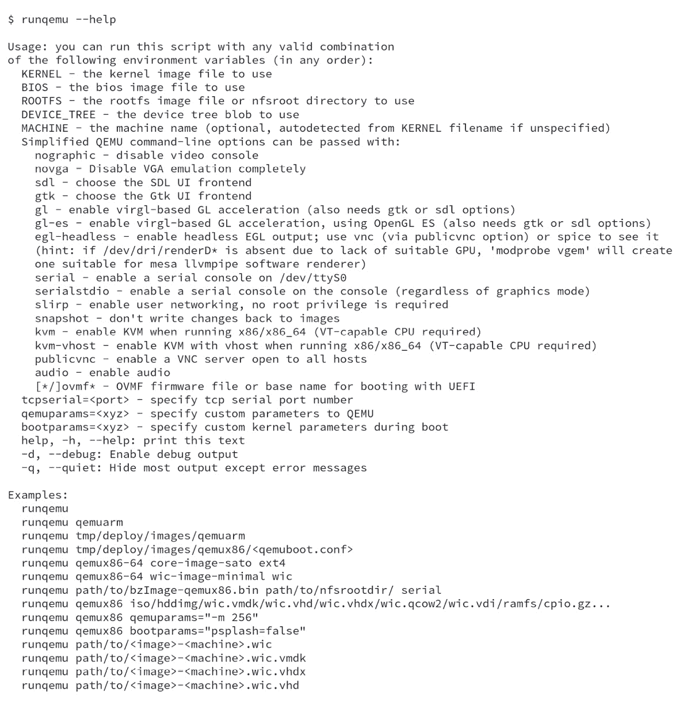
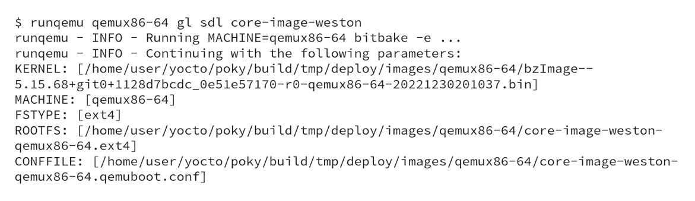
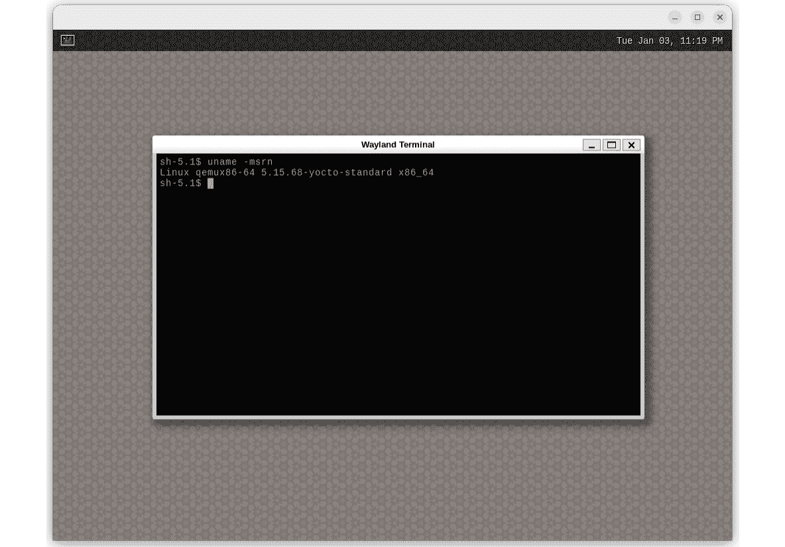
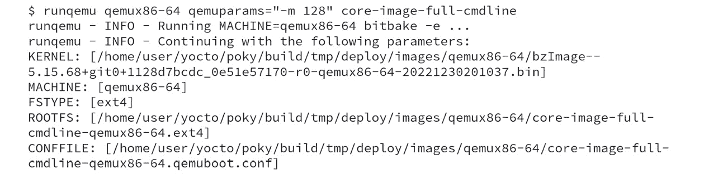
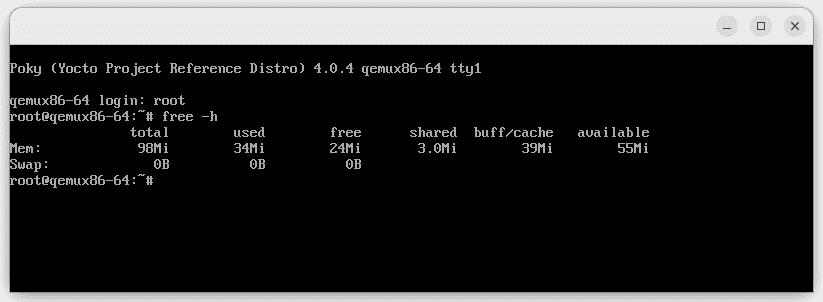
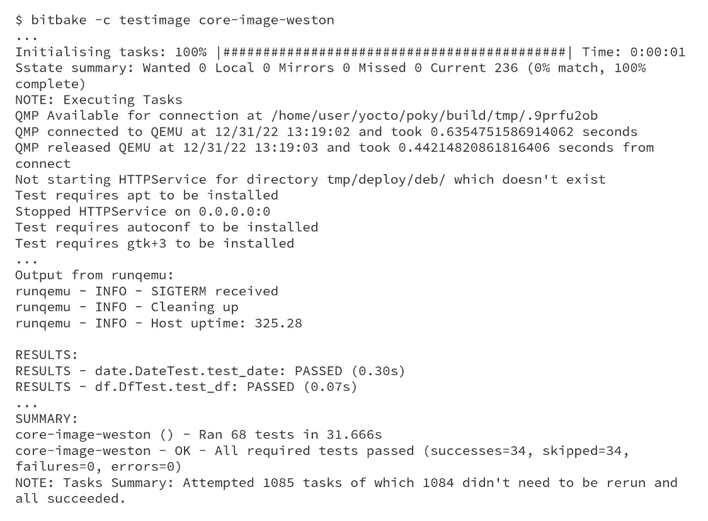

# 第十六章：通过仿真加速产品开发——QEMU

本章将探讨通过仿真缩短产品开发周期的可能性，并减少对真实硬件的依赖。你将了解使用 QEMU 相比硬件的好处，以及在何种情况下选择真实硬件更为可取。我们还将介绍 `runqemu` 的功能并展示一些使用案例。

# 什么是 QEMU？

**快速模拟器**（**QEMU**）是一个免费的开源软件工具，允许用户在同一物理机器上运行多个架构。它是一个系统模拟器，可以虚拟化完整的设备硬件，包括 CPU、内存、存储和外设。

使用 QEMU 进行测试和调试可以在开发过程中节省时间和精力。它允许开发人员在各种模拟环境中测试他们的代码。

除了其他因素外，Yocto 项目使用 QEMU 在每次发布时对最终镜像进行自动化**质量保证**（**QA**）测试。在 Yocto 项目的上下文中，QEMU 允许你将使用 Yocto 项目构建的完整镜像作为另一个任务在构建系统上运行。此外，QEMU 帮助在支持的 Yocto 项目架构上运行和测试镜像及应用程序，而无需实际的硬件。

# 使用 QEMU 相比硬件的好处是什么？

在某些情况下，使用 QEMU 代替真实硬件进行测试和调试可能更为实际：

+   它允许你在各种模拟环境中快速、轻松地测试代码，而无需不断将其部署到目标设备上

+   如果你没有运行软件的硬件，或者硬件的可用性有限

+   当你需要在多个硬件平台上测试软件，而不必设置多个物理机器时

+   当你希望在受控环境中调试软件，例如内存受限时，以观察其行为

+   当你想验证不依赖硬件的通用软件，并希望减少测试所需的时间，例如烧录、板级接线等

然而，必须注意，QEMU 是一个软件模拟器，并不总是能完美替代真实硬件。因此，测试软件在真实硬件上是否正确运行可能是必要的。

# 什么时候选择真实硬件更为可取？

在某些情况下，使用真实硬件进行测试和调试可能更为实用，甚至是必需的，以下是一些例子：

+   当软件依赖于特定硬件特性时，例如某个特定的**视频处理单元**（**VPU**）或**图形处理单元**（**GPU**）特性

+   在评估软件性能时，QEMU 可能无法复制真实硬件的性能

虽然 QEMU 是一个非常有价值的测试和调试软件的工具，但它并不总是能完全替代真实硬件。

# 使用 runqemu 功能

QEMU 与 Yocto 项目深度集成，学习如何利用这种集成至关重要，这样我们才能规划项目的测试。`runqemu`的使用列出了可用的多种选项，您可以在下图中看到：

图 16.1 – runqemu 使用方法

有一些 QEMU 的使用场景需要重点强调：

+   允许选择不同的内核镜像进行测试

+   允许选择不同的`rootfs`进行启动

+   传递内核启动参数的功能

+   支持使用 OpenGL 或 OpenGL ES 选项的图形环境

+   可以传递额外的 QEMU 命令行参数

+   允许仅使用串口控制台进行快速镜像测试

+   测试音频堆栈支持

+   测试不同的初始化系统（例如，systemd）

在接下来的几个章节中，我们以`qemux86-64`机器为参考，介绍一些常见的用例，展示`runqemu`的主要功能。

## 使用 runqemu 测试图形应用程序

当我们旨在验证应用程序时，可以忽略嵌入式设备 GPU 的性能，依赖 QEMU 进行验证，例如一个 Qt 或 GTK+应用程序。首先，我们需要构建`core-image-weston`镜像。接下来，我们可以按以下方式运行验证：

图 16.2 – 运行 QEMU 并启用图形支持后的日志

接下来，您将看到在 QEMU 中执行`core-image-weston`的情况：

图 16.3 – QEMU 运行 core-image-weston 的截图

上面的截图显示了 Wayland 终端打开，展示了正在运行的 Linux 内核的信息。

## 使用 runqemu 验证内存限制

当我们旨在验证应用程序的内存使用情况时，可以依赖 QEMU 进行验证。首先，我们需要构建`core-image-full-cmdline`镜像，并使用以下命令行运行 QEMU：

图 16.4 – 运行 QEMU 并分配 128 MB RAM 后的日志

在下图中，我们可以看到 QEMU 中正在使用的内存量：

图 16.5 – QEMU 运行 core-image-full-cmdline 并分配 128 MB RAM 的截图

更改用于运行 QEMU 的命令行可以帮助我们通过仿真测试一组不同的内存大小。

## 使用 runqemu 帮助进行镜像回归测试

Yocto 项目提供了一个自动化测试框架，这是 Yocto 项目质量保证过程中的关键部分。集成或验证测试支持使用`testimage`类在目标设备内执行镜像。

提示

测试框架可以测试现有的配方和镜像，并通过自定义测试进行增强，以验证新应用程序和集成。测试框架的功能在*Yocto 项目测试类型概述*部分中进行了描述([`docs.yoctoproject.org/4.0.4/test-manual/intro.html#yocto-project-tests-types-of-testing-overview`](https://docs.yoctoproject.org/4.0.4/test-manual/intro.html#yocto-project-tests-types-of-testing-overview))。

首先，我们通过在`build/conf/local.conf`中添加`IMAGE_CLASSES += "testimage"`启用了`testimage`支持，并确保构建了`core-image-weston`镜像。

警告

在镜像测试过程中，使用了`sudo`命令进行网络设置，并可能根据主机配置触发错误。请查看*Yocto 项目开发任务手册*中的*在 QEMU 上启用运行时测试*部分([`docs.yoctoproject.org/4.0.4/dev-manual/common-tasks.html#enabling-runtime-tests-on-qemu`](https://docs.yoctoproject.org/4.0.4/dev-manual/common-tasks.html#enabling-runtime-tests-on-qemu))，了解如何避免这些错误。

然后，我们必须构建`core-image-weston`镜像。现在我们可以开始执行`testimage`，命令如下：

图 16.6 – 运行 testimage 任务的结果，适用于 core-image-weston

在之前的日志中，我们看到了回归测试结果。

# 总结

在本章中，我们学习了如何使用 QEMU，以及它如何通过在可能的情况下进行仿真、在不可能的情况下进行描述，从而缩短开发周期。还介绍了一些`runqemu`的使用案例。

在最后一章，我们提供了一份清单，列出了多年来在开发基于 Yocto 项目的产品时，作者们一直使用的最佳实践。
