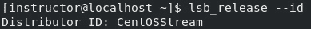

# 第一章：启动并运行 CentOS 服务器

作为系统管理员，您可能会遇到的最基本任务之一是定义您的角色和职责。然而，如何做这一点在很大程度上取决于您问谁。不同的人和公司可能对系统管理员这一职称有不同的看法。

欢迎来到本书的第一章，我们将在这一章学习服务器安装和管理命令。设置 Linux 系统并保持其更新是大多数系统管理员在日常工作中执行的基本任务。在这一章中，我们将从设置 Linux 服务器开始，然后学习包管理的目的以及它如何为 Linux 主机提供一个简单的软件安装方式。接下来，我们将探索允许我们查看 Linux 文件结构、添加用户和组以及归档文件的命令。

到本章结束时，您将掌握设置和管理 Linux 服务器的基本技能。我们将首先学习如何下载 CentOS 服务器安装文件，设置虚拟机管理程序并安装软件包。我们还将探索一些命令，让您能够查看系统、内核、硬件和处理器的信息。通过本章所学的技能，您将能够自信地设置和管理 Linux 服务器。

在本章中，我们将涵盖以下主要内容：

+   下载操作系统（OS）安装文件

+   下载并设置虚拟机管理程序

+   包安装命令

+   信息命令

# 下载操作系统安装文件

在本节中，我们将介绍下载 Linux 服务器操作系统的过程，包括推荐哪些 Linux 发行版以及需要满足的要求。

在为您的服务器选择 Linux 发行版时，有很多选项可供选择。一些流行的选择包括 Ubuntu、Debian 和 Red Hat。然而，对于企业和 Web 服务器环境来说，**社区企业操作系统**（**CentOS**）是最受欢迎且最稳定的选择之一。

CentOS 是基于**红帽企业 Linux**（**RHEL**）的免费开源 Linux 发行版。它以稳定性和可靠性著称，是企业和 Web 服务器环境中常用的选择。它也广泛应用于托管行业、教育、研究和个人使用。它与红帽生态系统兼容，这意味着用户可以利用他们现有的 RHEL 知识、技能和工具。该发行版由一个庞大的开发者和用户社区维护，他们共同提供更新和安全补丁，确保其安全性和稳定性。此外，它设计与上游厂商红帽完全兼容，并提供几乎相同的环境。这意味着用户可以使用与红帽 Linux 相同的命令和包，也可以访问红帽客户门户和技术支持。由于我们将在本书中使用 CentOS，因此我们将从官方网站 ([`www.centos.org/`](https://www.centos.org/)) 下载安装镜像。该网站提供了 DVD 和最小化的 ISO 镜像，可以用于安装服务器。确保下载适合您架构（32 位或 64 位）的正确版本。

在下载 CentOS 8 的安装镜像时，有两种可选的方式：

+   `CentOS-Stream-8-x86_64-20220104-boot.iso`

+   `CentOS-Stream-8-x86_64-20220104-dvd1.iso`

`CentOS-Stream-8-x86_64-20220104-boot.iso` 文件是一个用于启动系统和执行网络安装的最小化镜像。它设计用于网络安装过程，仅包含启动安装过程所需的包。在安装过程中，额外的文件会被下载。

`CentOS-Stream-8-x86_64-20220104-dvd1.iso` 文件是包含所有分发包的 DVD 镜像。它可以用于本地安装（也称为**离线安装**，因为在安装过程中不需要下载文件），并且包含完整的包集合。

需要注意的是，根据你的系统要求和服务器的预期用途，某些镜像可能比其他镜像更合适。对于资源有限的服务器，推荐使用最小化镜像，而对于资源较丰富且需求更广泛的服务器，推荐使用 DVD 镜像。以下是设置我们自己的服务器所需的系统要求：

+   **处理器**：需要一个 64 位处理器。

+   **内存**：建议至少 2GB 的内存，但对于高负载的服务器，推荐使用 8GB 或更多。

+   **磁盘空间**：建议至少 20 GB 的存储空间，但存储空间越大越好。

+   **网络连接**：需要网络连接以下载安装镜像并执行更新。

+   **显卡**：服务器不一定需要显卡，但如果你打算将服务器用于图形应用程序，建议配备显卡。

+   **操作系统**：运行虚拟机管理程序需要 64 位版本的 Windows、macOS 或 Linux。

现在我们已经了解了系统要求，第一步是打开一个网页浏览器并访问 www.google.com：

1.  在搜索栏中输入 `download CentOS ISO` 并按 *Enter* 键。这将打开 CentOS 的官方网站，网址是 [`www.centos.org/`](https://www.centos.org/)（见 *图 1.1*）。

图 1.1 – Google 搜索

1.  我们的第二步是选择适用于所有架构的 **x86_64** 选项：

图 1.2 – x86_64 架构

1.  接下来，我们选择适合我们区域的可用链接。正如图中所示，我选择的是 [`mirror.web4africa.ng/centos/8-stream/isos/x86_64/`](http://mirror.web4africa.ng/centos/8-stream/isos/x86_64/)：

图 1.3 – 按区域选择

从索引`CentOS-Stream-8-x86_64-20221222-dvd1.iso`的 DVD 版本。正如我们之前所读，DVD 镜像包含了所有在发行版中包含的软件包，这意味着它可以用于执行本地安装。

图 1.4 – DVD 下载页面

下载完镜像后，我们需要下载一个虚拟机管理程序。

# 下载和设置虚拟机管理程序

在这一部分，我们将介绍下载和设置虚拟机管理程序的过程。虚拟机管理程序是允许你在物理主机上创建和运行虚拟机的软件。这是系统管理员的基本知识，因为它提供了更多的灵活性和资源管理。市面上有多种虚拟机管理程序，如 VMware、VirtualBox 和 Hyper-V。本书将以 VMware 为例进行说明。

图 1.5 – VMWare（工作站 16 专业版）

下载和设置虚拟机管理程序的步骤如下：

1.  第一步是从官方网站下载 VMware 软件：

图 1.6 – 下载 VMWare 工作站

1.  确保下载适用于你操作系统的正确版本。下载完成后，你需要在物理主机上安装软件。这个过程非常简单，只需按照安装过程中提示的步骤进行操作。

图 1.7 – 设置中

安装完成后，你需要创建一个新的虚拟机。

1.  我们将使用 **自定义** 配置向导。这个过程涉及指定虚拟机的内存、存储空间和网络设置。

图 1.8 – 自定义配置向导

1.  配置**虚拟机硬件兼容性**设置如下：

图 1.9 – 硬件兼容性设置

1.  选择操作系统安装介质，然后选择**我将稍后安装操作系统**选项，以进行手动设置过程：

图 1.10 – 选择操作系统安装介质

1.  为虚拟机提供名称并选择位置。

图 1.11 – 选择虚拟机名称

1.  选择来宾操作系统：

图 1.12 – 选择来宾操作系统

1.  分配处理器资源：

图 1.13 – 指定分配的处理器数量

1.  为虚拟机分配内存。计算内存分配时应与处理器分配方法相同。确保主机系统有足够的内存，并将剩余内存分配给虚拟机。此示例中，我们将选择 8 GB 或更多内存。

图 1.14 – 指定内存大小

1.  配置网络设置。选择符合需求的网络配置，或者直接选择默认的 NAT 网络。为什么要这么做？

    **网络地址转换**（**NAT**）在 VMware 中是一种网络功能，允许虚拟机使用主机计算机的 IP 地址访问互联网和其他网络资源。这个功能为没有自己 IP 地址的虚拟机提供了一种安全且便捷的方式来访问互联网。在 NAT 模式下，虚拟机的网络流量在虚拟网络和主机的物理网络之间透明地进行转换，使虚拟机能够像直接连接到物理网络一样访问网络资源。NAT 常用于虚拟化环境中的测试和开发，在这些环境中，虚拟机需要访问互联网以下载软件、更新等，但不需要公共访问。

图 1.15 – 网络类型

1.  选择 I/O 控制器类型。

    SCSI 控制器类型是用于控制虚拟磁盘的控制器类型。下图包含了这些选项：

    +   **BusLogic**：这种控制器类型不适用于 64 位的来宾操作系统。它是一种较旧的控制器类型，目前已不再常用。

    +   **LSI Logic**（推荐）：这种控制器类型推荐用于大多数来宾操作系统。它是较新的控制器类型，提供比 BusLogic 控制器更好的性能和兼容性。

    +   **LSI Logic SAS**：此控制器类型设计用于与**串行附加 SCSI**（**SAS**）磁盘一起使用。它提供比 LSI Logic 控制器更好的性能，但并不被所有客户操作系统广泛支持。

    +   **并行虚拟化 SCSI**：此控制器类型是一种高性能控制器，设计用于 VMware 客户操作系统。它要求客户操作系统安装特殊的驱动程序。

    如果您不确定选择哪个 SCSI 控制器类型，建议使用 LSI Logic 控制器。它是一种多用途控制器，广泛支持客户操作系统。

图 1.16 – I/O 控制器类型

1.  选择磁盘类型。

    以下截图显示了**新虚拟机向导**窗口中可用的不同磁盘类型选项。选项如下：

    +   **集成驱动电子**（**IDE**）：这是一种较旧的磁盘类型，比 SATA 和 NVMe 等新型磁盘慢。但它仍然被大多数客户操作系统支持。

    +   **小型计算机系统接口**（**SCSI**）：这比 IDE 更快。它还更具多功能性，可以支持多个磁盘和设备。

    +   **串行 ATA**（**SATA**）：这是目前最常见的磁盘类型。它比 IDE 和 SCSI 更快、更可靠。

    +   **开放非易失性内存表达式**（**ONVMe**）：这是最新和最快的磁盘类型。它仍在开发中，但在高性能服务器和工作站中越来越受欢迎。

    如果您运行的客户操作系统支持更新的磁盘类型，如 SATA 和 NVMe，建议选择这些磁盘类型。它们将提供更好的性能和可靠性。

图 1.17 – 磁盘类型

1.  选择虚拟磁盘（如果已有虚拟磁盘，则选择，或创建一个新磁盘）。

图 1.18 – 创建新的虚拟磁盘

1.  指定磁盘容量。推荐的磁盘空间为 20 GB，但我们将分配 30 GB 的空间，以确保虚拟机有足够的空间。请确保勾选**将虚拟磁盘存储为单个** **文件**选项。

图 1.19 – 设置磁盘容量

1.  定义虚拟磁盘文件。

图 1.20 – 指定磁盘文件

1.  通过选择**完成**来创建虚拟机。

图 1.21 – 准备创建虚拟机

1.  接下来，为了在 VMware Workstation 上启动 CentOS 安装，请为虚拟机提供 CentOS ISO 镜像。完成此操作后，点击**启动此虚拟机**选项。这将创建一个新的虚拟机并根据您提供的规格进行配置。

图 1.22 – 选择 ISO 镜像文件

安装完成后，您将启动新创建的虚拟机，它将启动并准备使用。此过程将使您能够在虚拟环境中运行一个完全功能的 CentOS 安装，使您能够轻松测试、运行并管理单台物理机器上的多个操作系统。

下一步是启动虚拟机。这将启动新安装的操作系统，并允许您开始配置和使用它。确保虚拟机在启动之前已正确配置非常重要。这包括验证网络配置、内存和处理器分配以及磁盘空间的可用性。一旦确认所有必要的参数都已正确设置，您可以通过点击 VMware Workstation 中的**开启**按钮来启动虚拟机。这样我们就可以进入配置过程的下一阶段。

1.  我们将从选项列表中选择**安装 CentOS Stream 8-Stream**。在选项之间导航时，使用箭头键并按 *Enter* 键来选择所需的选项。

图 1.23 – 启动 CentOS 8-Stream

1.  成功启动 CentOS 安装后，您将看到一个欢迎屏幕，提供选择偏好语言的选项。只需选择所需语言并点击**继续**以继续操作。

图 1.24 – 选择你偏好的语言

1.  为了继续安装 CentOS，设置一些参数非常重要，如键盘布局、语言支持、时间和日期设置、要安装的软件包、root 密码、安装介质以及磁盘分区信息。这些参数将确保顺利和成功的安装。

图 1.25 – 安装总结

1.  CentOS 8 的安装向导可以在安装过程之前自动检测到所有本地可访问的网络接口。这些接口将显示在左侧窗格中（见 *图 1.26*），允许您轻松选择所需的网络，并根据您的具体需求将其配置为活动或非活动状态。此步骤确保在安装过程中为系统建立正确的网络连接。

图 1.26 – 网络和主机名页面

1.  在配置好所有必要的设置后，是时候开始安装过程了。点击**开始** **安装**按钮：

图 1.27 – 开始安装按钮

当安装过程开始时，安装向导将开始安装 CentOS。根据系统速度和所选配置，过程可能需要几分钟才能完成。请注意进度条，以跟踪安装进度。

图 1.28 – 安装进度

1.  在 CentOS 成功安装后，重启虚拟机非常重要，以确保安装过程中所做的所有更改生效。这将有助于初始化新安装的操作系统并使其准备好使用。要重启虚拟机，只需选择**重启系统**按钮从系统菜单中重启，并等待机器完成重启过程。

图 1.29 – 重启系统按钮

1.  重启虚拟机后，在 GRUB 菜单中选择第一个选项，以便成功启动到已安装的 CentOS 操作系统。

图 1.30 – CentOS 8 GRUB 菜单

1.  另一个重要步骤是阅读并接受许可信息，因为这是继续启动过程所必需的。

图 1.31 – 接受许可信息

1.  在接受许可信息后，过程的最后一步是通过点击**完成配置**按钮来完成配置。此操作将最终确定设置和配置过程，并使系统能够启动到新安装的 CentOS 操作系统。

图 1.32 – 完成配置

1.  使用你的凭据登录到新安装的 CentOS Linux 系统。

图 1.33 – 登录

1.  登录后，选择**开始使用 CentOS Linux**选项，开始使用操作系统的全部功能。

图 1.34 – 准备就绪

推荐尽早以 `root` 超级用户身份登录，并运行下一节中的命令，以确保新安装的 CentOS Linux 系统拥有最新的更新和修复。

# 软件包安装命令

软件包安装命令用于 CentOS 系统上安装和管理软件包。CentOS 中的软件包管理系统称为**Yellowdog Updater Modified**（**YUM**），它提供了一种集中化的方法来管理和安装软件包。

## YUM 软件包管理系统

YUM 是 CentOS 的默认软件包管理器。它通过解决依赖关系并下载所需的软件包，使得管理软件包变得更加容易。使用 YUM，用户可以根据需要安装新软件包、更新现有软件包和移除软件包。YUM 提供了一个命令行界面，允许用户从终端管理软件包，也提供了一个图形用户界面，方便那些喜欢可视化操作的用户。

## 常见的软件包安装命令

与 YUM 一起使用的最常见命令包括`yum install`用于安装新软件包，`yum update`用于更新现有软件包，以及`yum remove`用于移除软件包。此外，`yum list`可以列出所有可用软件包，`yum search`可以用于搜索软件包。需要记住的是，在使用 YUM 管理软件包时，必须保持活动的互联网连接，并且需要以 root 用户或具有管理员权限的身份运行这些命令。

以下命令是*每个系统管理员应该* *了解的 100 个 Linux 命令*的起点：

+   `yum upgrade`：`yum upgrade`命令用于 CentOS Linux，将所有已安装的软件包升级到最新版本。该命令通过更新系统的最新软件包、修复错误和提供安全补丁来确保系统保持安全和稳定。`yum upgrade`命令在终端中执行，并且通常需要以管理员权限（通常是 root 用户）执行。通过运行此命令，系统将升级所有已安装的软件包，并解决在升级过程中可能出现的任何依赖关系或冲突。

图 1.35 – 升级服务器

+   `yum update`：这个软件包管理工具用于 CentOS 和其他 Linux 发行版，用于升级和更新系统软件包。它从软件源下载最新的软件包更新并将其安装到系统上，确保你的系统拥有最新的安全补丁和错误修复。定期运行`yum update`是系统维护的重要部分，因为它有助于保持系统安全和流畅运行。

图 1.36 – 更新服务器

+   `reboot`：此命令用于重启运行 Unix 系统（如 Linux）的计算机。它用于应用对系统所做的更改或在完成某个过程后刷新系统。该命令可以由具有 root 或超级用户权限的用户执行。执行该命令后，系统将启动重启序列，所有正在运行的进程将被终止。然后，系统将重新启动。`reboot`命令通常在完成系统更新或升级后使用，以确保更改已被应用。

图 1.37 – 重启服务器

# 信息命令

CentOS 为系统管理员提供了一系列命令，用于获取关于系统各个方面的信息，包括硬件、软件、网络和用户。这些命令是监控和排除系统及其组件故障的基本工具，提供了有关系统当前状态、配置和性能的深入见解。通过获取系统的准确信息，系统管理员可以快速识别和解决问题，确保系统的最佳性能和稳定性。这些命令分别提供有关系统主机名、磁盘使用情况、进程、CPU 和网络接口的信息，因此对于需要诊断和解决系统问题的系统管理员来说，它们是非常有价值的工具。

这里列出了一些在 CentOS 中常用的信息命令：

+   `uname`：`uname`命令用于显示操作系统和系统主机名的信息。该命令还可以显示硬件类型、操作系统版本和内核的发布号。

图 1.38 – 显示操作系统

`uname`命令带有不同的标志，可以执行。例如，`-a`参数显示所有信息，包括系统名称、网络节点主机名、内核发布、版本和机器硬件名称，如下所示的终端输出：

图 1.39 – 显示所有系统信息

+   `lsb_release`：`lsb_release`命令用于显示有关**Linux 标准基础**（**LSB**）版本、发行商 ID 和发布号的信息。LSB 是一个定义 Linux 操作系统的标准，确保不同 Linux 发行版之间的兼容性。

图 1.40 – 显示 Linux 标准基础版本

为了执行更多的标志，我们将使用管理员常用的一个标志来显示发行商指示符。

图 1.41 – 显示发行商指示符

+   `hostnamectl`：`hostnamectl`命令用于显示和修改系统主机名，并查看诸如操作系统架构、启动模式和系统时区等各种系统设置。这个命令在不需要以 root 用户身份登录系统的情况下修改主机名或查看系统设置时非常有用。

图 1.42 – 显示系统设置和架构

让我们执行带有另一个标志`set-hostname`的`hostnamectl`命令。这个标志用于将系统主机名设置为指定的值。例如，你可以执行`hostnamectl` `set-hostname myhost`：

图 1.43 – 设置系统主机名

本节中我们介绍的有用信息命令将帮助你收集关于系统的信息。在本章中，我们强调了正确进行服务器设置和安装的重要性，包括定期的软件升级和更新，以确保系统平稳运行并保持安全。通过遵循本章中概述的步骤，你将能够顺利设置一个可靠且安全的服务器，既适用于个人使用，也为进一步学习 Linux 系统管理打下基础。

# 总结

在第一章中，我们集中讨论了下载和设置服务器的步骤。我们首先讨论了下载服务器操作系统的过程，这是设置过程中的关键步骤。接着，我们深入探讨了下载和设置虚拟化平台的主题，虚拟化平台使得可以创建虚拟机。虚拟化平台为每个虚拟机提供一个隔离的环境，从而允许多个虚拟机在同一台物理服务器上运行。

接下来，我们讨论了包安装命令在服务器设置过程中的重要性。这些命令允许系统管理员从服务器安装、升级和移除包，这些包对于服务器的正常运行至关重要。我们还概述了如`yum`等一些常见的包安装命令。

最后，在第四部分中，我们强调了信息命令在服务器设置过程中的作用。这些命令提供了有关系统的重要信息，包括操作系统和硬件信息。我们介绍了 CentOS 中的三条常见信息命令，包括`uname`、`lsb_release`和`hostnamectl`，并描述了它们的用途和优点。这些信息命令对于监控和故障排除服务器以及确保其正常运行非常有用。

在下一章中，我们将深入探讨 Linux 用户和组的管理。此章节是系统安全、稳定性和资源分配的关键，涵盖了系统管理员管理用户和组所需的核心命令和工具。
