# Linux 用户和组命令

选择合适的 Linux 发行版非常重要，同样，理解 Linux 系统管理的关键组成部分也同样重要，包括 Linux 用户和组管理。Linux 操作系统允许管理员创建多个用户并分配不同的权限和组策略，从而确保系统的安全性、稳定性和资源分配。在本章中，我们将深入探讨 Linux 用户和组管理，并重点介绍 Linux 系统管理员用于管理用户和组的关键命令和工具。

Linux 用户和组命令的历史可以追溯到 Unix 操作系统的早期时期，当时用户和组管理是系统安全和资源分配的关键方面。随着开源运动的兴起，Linux 采纳了这些概念并加以扩展，允许对用户和组的权限、用户身份验证和访问控制等进行细粒度的控制。如今，Linux 用户和组命令构成了任何 Linux 系统的关键组成部分，为系统管理员提供了管理用户、分配权限并确保对敏感资源和数据安全访问的工具。

在本章中，我们将涵盖以下主要内容：

+   useradd、userdel 和 usermod

+   文件、目录和权限命令

+   groupdel、groupmod、groupadd 和 grpck

+   pwck、chage 和 passwd 命令

+   find、locate 和 whereis 命令

# useradd、userdel 和 usermod

在 Linux 系统中，管理用户和组非常重要，以确保安全性和访问控制。`useradd`、`userdel` 和 `usermod` 命令是创建、删除和修改 Linux 系统用户的基本工具。这些命令允许管理员创建用户账户、分配权限，并限制资源访问。了解如何使用这些命令对于管理 Linux 系统中的用户至关重要。无论你是设置单用户系统还是企业级环境，`useradd`、`userdel` 和 `usermod` 命令都是 Linux 管理员必不可少的工具。我们将详细探讨这些命令，包括它们的用法、选项和示例，以便让你全面了解 Linux 系统中的用户管理。

这些工具——`useradd`、`userdel` 和 `usermod`——是 Shadow Password Suite 的一部分，通常用于 Linux 系统来管理用户账户。正确使用这些工具对于确保 Linux 系统的安全性和稳定性至关重要。虽然这些工具主要用于 Linux 系统，但它们也可以在其他类 Unix 系统中使用。

我们将详细讲解它们的使用，包括每个命令的选项和语法。我们还将讨论管理 Linux 系统用户账户的最佳实践，例如创建标准用户账户并使用 `sudo` 执行管理任务。现在，让我们在接下来的小节中深入了解这些命令。

## useradd

Linux 中的`useradd`命令用于创建新的用户账户或更新现有账户。它是一个强大的工具，可以用来以多种方式管理用户账户，从分配主目录和默认 shell 到设置用户密码和过期日期。当创建新用户账户时，`useradd`需要提供一些信息，例如用户名，`useradd`还可以用来定制用户账户。例如，可以使用`-m`选项为用户创建主目录，而`-s`选项指定用户的默认 shell。`-c`选项可以用于向用户账户添加注释或描述，这有助于识别账户的用途。创建用户账户后，可以使用`usermod`命令对其进行修改。该命令用于修改用户的账户信息，例如密码或过期日期。它还可以用来将用户添加或移除出某些组、改变用户的默认 shell 等。`useradd`命令的基本语法如下（注意，你需要`sudo`权限才能成功运行该命令）：

```
useradd command:
			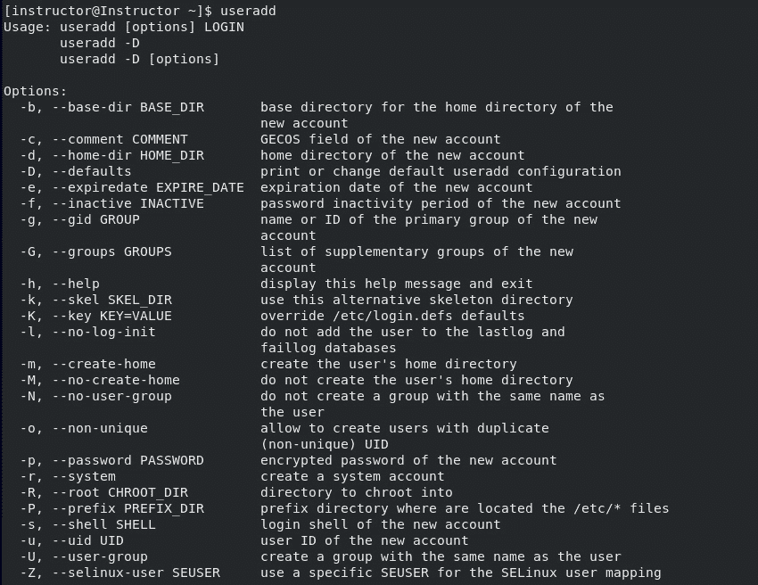

			Figure 2.1 – useradd usage and options
			To create a new user account named `tester1` and a corresponding home directory, as well as displaying the UID, use the following command:
			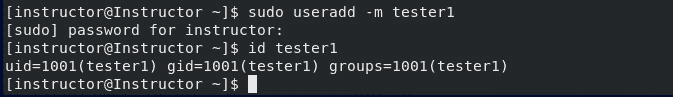

			Figure 2.2 – Creating a user and a home directory for the user
			The `-m` option tells the system to create the home directory, which is where the user will store their files and settings. The purpose of creating a home directory for a new user is to ensure that they have their own space on the system to work in and allow them to store files and customize their environment without affecting other users. Additionally, it provides a place for the user to store configuration files and other settings that are specific to their account.
			We also introduced another command, `id`, in the process of creating a new user.
			The `id` command from the preceding example is a Linux/Unix command that is used to display the UID and GID of our `tester1` user account. When used with a specific username as an argument, such as `id username`, the `id instructor` command will display output similar to the following if the `instructor` user exists on the system:
			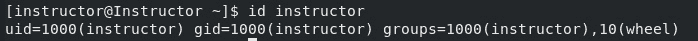

			Figure 2.3 – Displaying the ID
			We can also check the existence of this user in the `/``etc/passwd` file:

```

instructor:x:1000:1000:instructor:/home/instructor:/bin/bash

tester1:x:1001:1001::/home/tester1:/bin/bash

```

			The following screenshot shows the result:
			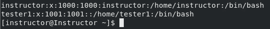

			Figure 2.4 – Evidence of the existence of the users
			The following are the details of the user information in the preceding figure:

				*   `tester1`: Username
				*   `1001`: UID
				*   `1001`: GID
				*   `/home/tester1`: User’s home directory
				*   `/bin/bash`: Login shell
				*   `:`: Separator
				*   `::`: A password-less user account
				*   `x`: The stored password in the `/``etc/shadow` file

			userdel
			`userdel` is a Linux command used to delete a user account and its associated files and directories. It’s important to note that when a user account is deleted using `userdel`, all the files and directories under the user’s home directory are also deleted. Therefore, `userdel` should be used with caution to avoid the accidental deletion of important files. The command requires root privileges, and the syntax is `userdel [options] username`. The most commonly used option is `-r`, which removes the home directory and mail spool of the deleted user. When deleting a user with `userdel`, it’s important to make sure that the user account is no longer needed. It’s also important to consider the impact that deleting the user account will have on any applications or services that rely on the user account. This is especially true if the user account is used for system administration or runs any critical services. In such cases, it’s important to create a backup or a copy of the user’s files and directories before deleting the account.
			Another consideration when using `userdel` is that it only deletes the user account from the system’s user database. Any processes that were started by the user before the account was deleted will continue to run until they are finished or manually stopped. It’s also possible that some system files or configuration files might still reference the deleted user, which could cause issues in the future.
			The following screenshot shows the usage and options of the `userdel` command:
			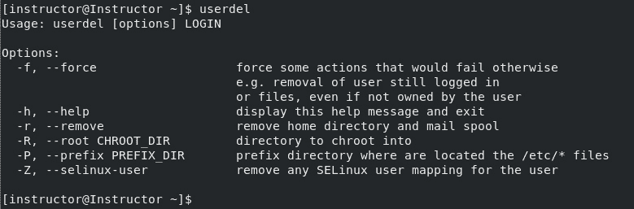

			Figure 2.5 – userdel usage and options
			To delete the `tester2` user, you would run the following command:
			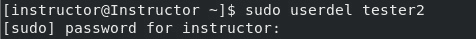

			Figure 2.6 – Deleting the user account
			As we observe the deletion of the `tester2` entry from the `/etc/passwd` file, we can also confirm whether the `tester2` user’s home directory is still accessible:
			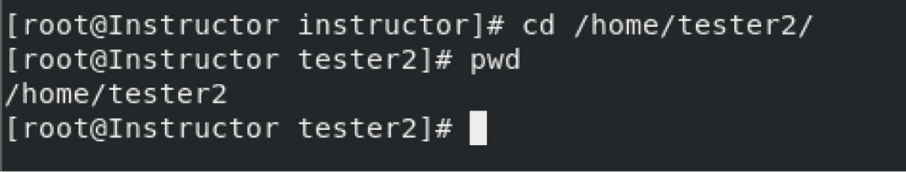

			Figure 2.7 – Switching to the user’s home directory
			When you run the `userdel` command, it removes the user’s entry in the `/etc/passwd` file and the user’s group, but it does not remove the user’s home directory, `/home/tester2`. To remove a user and their home directory simultaneously, execute the `userdel` command followed by the `-r` option. Attempting to switch to the deleted user’s home directory will not be successful, as it has been removed. This can be verified by the following example:
			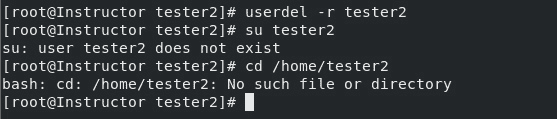

			Figure 2.8 – Deleting the user and the home directory
			Here are the steps we took:

				1.  Deleted the user and the home directory using the `-``r` flag
				2.  Verified whether we could do a switch to the user for confirmation
				3.  Checked whether we could switch to that user’s home directory

			Overall, `userdel` is a powerful command that should be used with caution. It’s important to ensure that the user account being deleted is no longer needed and that all necessary backups and precautions have been taken to avoid data loss or system issues.
			usermod
			The `usermod` command is a powerful Linux administration tool that allows system administrators to modify user account information. This includes changes to the user’s home directory, login shell, UID, GID, and other account properties. Additionally, `usermod` can be used to add or remove user groups, set password-aging policies, and more. This tool helps system administrators to manage user accounts on a Linux system effectively.
			To use `usermod`, the command is followed by options that specify the changes to be made. For example, to add a user to a specific group, the `-aG` option is used, followed by the group name. Similarly, to change the user’s home directory, the `-d` option is used, followed by the new directory path. When making changes to a user’s account, it is important to consider the impact that the changes will have on the system and other users.
			`usermod` also has a useful feature that allows for the modification of multiple user accounts at once using a script or a list of usernames. This feature saves time and effort when making changes to a large number of user accounts. However, it is important to use `usermod` with caution, as improper use of the command can result in unintended consequences or even system damage. We’ll take a look at execution examples using `usermod`:

				*   `tester1` to the `developers` group and verify that the user has been added to the group. You can use the following command:

			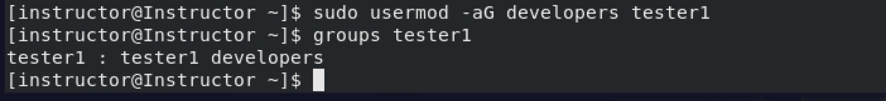

			Figure 2.9 – Adding a user to a group

				*   `tester1` to `/home/tester1_new`. You can use the following command:

			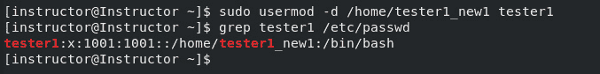

			Figure 2.10 – Changing the user’s home directory

				*   `tester1`, you can use the following command:

			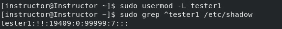

			Figure 2.11 – Locking a user
			The exclamation mark indicates that the `tester1` account is locked. If the account is not locked, the second field will contain the password hash for the user’s password.
			Now let’s unlock the `tester1` user:
			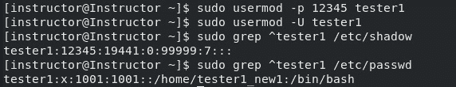

			Figure 2.12 – Unlocking a user

				*   `tester1` to `1001` and the GID to `1002`. You can use the following command:

			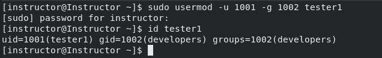

			Figure 2.13 – Changing a user’s UID and GID
			This will change the UID of the user `tester1` to `1001` and the GID to `1002`.
			Files, directories, and permission commands
			Files and directories are organized in a hierarchical structure, with the `root` directory as the top-most level. Each file and directory has a set of permissions that determine who can read, write, or execute it. The file permissions are divided into three categories—user, group, and others:

				*   **user**: This refers to the owner of the file
				*   **group**:  This refers to a group of users assigned to the file (e.g., developers)
				*   **others**: This refers to anyone else who is not the owner or part of the assigned group

			Let’s take a look at the hierarchical structure:
			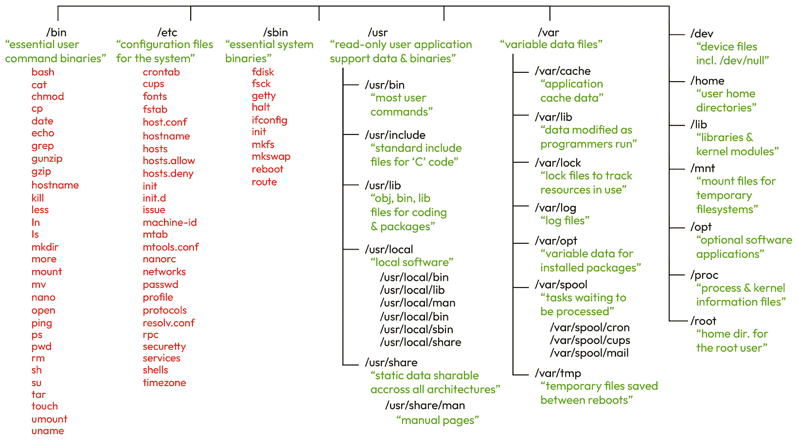

			Figure 2.14 – Linux files and directory hierarchical structure
			To manage file and directory permissions in Linux, there are several command line tools available. Some of the commonly used commands include `chmod`, `chown`, and `chgrp`.
			chmod
			The `chmod` command is used to change the permissions of a file or directory. To recursively change the permissions of all files and subdirectories within a directory, we can use the `-R` flag of the `chmod` command. This flag is essential for applying permissions changes to all contents within a directory.
			However, the suggested text after that doesn’t seem to directly address the significance of the `700` permission setting.
			For example, in the following screenshot, `700` signifies that the owner of the `Confidential_files` directory has `7`), while the group and others have no permissions (`0`). This configuration ensures that only the owner can access, modify, or execute files within the directory, providing a high level of security for sensitive information:
			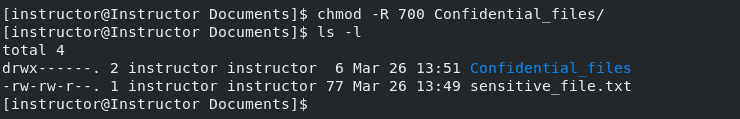

			Figure 2.15 – Granting the owner RWX permissions
			chown
			The `chown` command is used to change the owner and group of a given file or directory. To change the owner and group of a directory, we must pass both arguments separated by the `:` sign. Just like the `chmod` command, you can replicate the new settings recursively by adding `-R` to the command:
			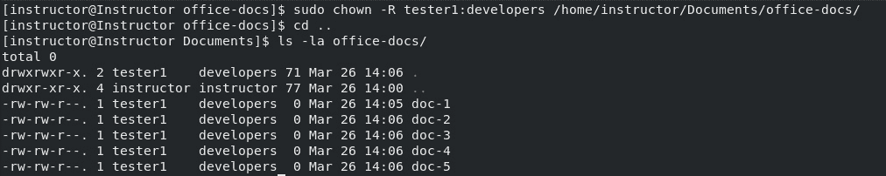

			Figure 2.16 – Changing the owner and group of a directory
			This command changes the owner and group of the directory located at `/home/instructor/Documents/office-docs/` along with all its content recursively. The `-R` option stands for **recursive**.
			chgrp
			`chgrp` is used to change the group of a file or directory without touching the owner’s permission. To change the group ownership of a directory named `project-001` and all of its contents to a group named `developers`, use the following command:
			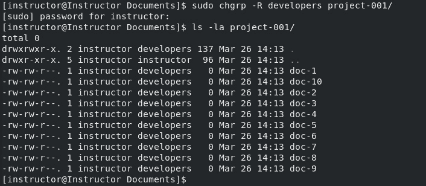

			Figure 2.17 – Changing the group ownership of a directory
			Security is also an essential aspect of file and directory management in Linux. System administrators must ensure that files and directories are secured and only accessible to authorized users. This can be achieved by implementing access control measures such as using strong passwords and configuring user access permissions appropriately.
			groupdel, groupmod, groupadd, and grpck
			Group management is an important aspect of Linux system administration. Groups are used to organize users and define their access privileges to files and directories on the system. The four main commands used for group management are `groupadd`, `groupmod`, `grpck`, and `groupdel`.
			`groupadd` is used to create a new group on the system. To use this command, type `groupadd` followed by the desired options and the new group name. For example, to create a new group called `DevSec-group`, the command would be `groupadd DevSec-group`:
			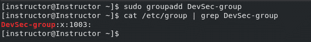

			Figure 2.18 – Adding a new group
			This command will create a new group with the default settings, including a new GID.
			Now that we’ve created our groups, let’s do some modifications such as changing its membership using the `groupmod` command. This is a command used to modify an existing group on the system. This command can be used to change the group’s name, GID, or membership. To modify a group, type `groupmod` followed by the desired options and the group name. For example, to change the name of the group `DevSec-group` to `DevSec-group-new`, the command would be `groupmod -n` `DevSec-group-new DevSec-group`:
			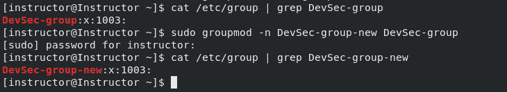

			Figure 2.19 – Modifying an existing group
			Our next command is `grpck`, which is used to check the integrity of the group files on the system. This command will check the group file (`/etc/group`) and make sure that all groups listed in the file have valid entries in the password file (`/etc/passwd`). To use this command, simply type `grpck -``r /etc/passwd`:
			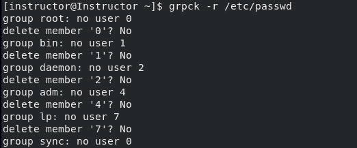

			Figure 2.20 – Checking the integrity of the /etc/passwd file
			Lastly, the `groupdel` command is used to delete a group from the system. To use this command, simply type `groupdel` followed by the group name. For example, to delete a group called `DevSec-group-new`, the command would be `groupdel -``f DevSec-group-new`.
			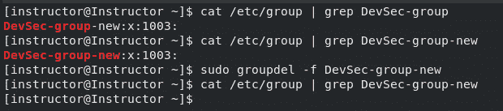

			Figure 2.21 – Deleting a group
			This command will remove the group from the system. The `-f` option is used to force the deletion of the group, along with any users who were assigned to that group.
			Overall, group management is a critical aspect of Linux system administration. Proper management of groups can ensure the security and accessibility of files and directories on the system. The four main commands used for group management, `groupdel`, `groupmod`, `groupadd`, and `grpck`, provide system administrators with the necessary tools to effectively manage groups on a Linux system.
			pwck, chage, and passwd commands
			The `pwck` command is a Linux system administration tool that is used to verify the consistency of the `passwd`, `shadow`, and `group` files. The purpose of the command is to ensure that the user accounts and groups listed in these files are valid and to detect any inconsistencies between them. It is useful in maintaining the integrity and security of a Linux system, as it can help to identify and correct errors that may arise due to manual edits of these files. For example, if a user account exists in the `passwd` file but not in the `shadow` file, `pwck` will detect this and prompt the user to fix the inconsistency. Let’s take a look at some examples using this tool:

				*   Verify the consistency of the `passwd` file with `sudo` `pwck /etc/passwd`.

    The following output from the `pwck` command checks the consistency of the `/etc/passwd` file on our Linux system:

			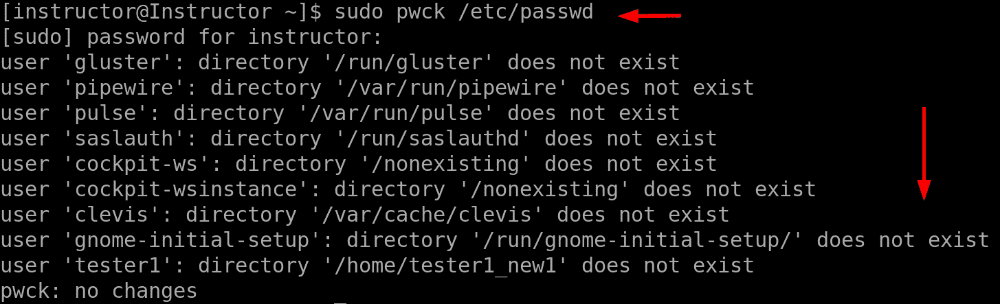

			Figure 2.22 – Checking the consistency of the /etc/passwd file

				*   Check the consistency of the `shadow` file:

			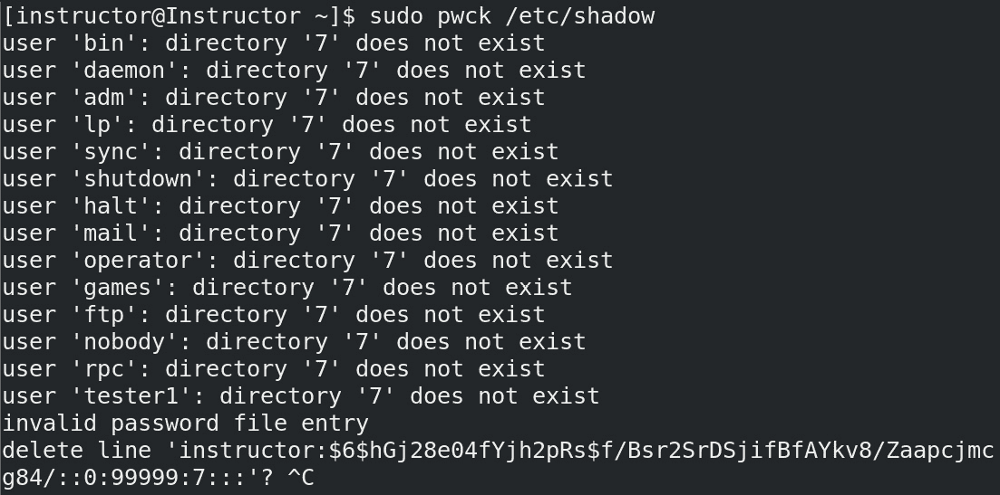

			Figure 2.23 – Checking the consistency of /etc/shadow file
			The `invalid password file entry` message for the `instructor` user suggests deleting the invalid line for the `instructor` user account. However, we can keep the `instructor` user and resolve the error without deleting the invalid line by correcting it to ensure that it is properly formatted.
			First, open the `/etc/shadow` file with the `vipw` command to edit the `/etc/passwd` and `/etc/shadow` files, or their respective shadow versions (`/etc/gshadow` and `/etc/gshadow`), with `vigr`. Locate the line that corresponds to the `instructor` user or any user you created and correct any syntax errors.
			Using `vipw` and `vigr` is the recommended and safer approach to editing these critical system files, as these commands are specifically designed for this purpose and set appropriate locks to prevent file corruption.
			The line should contain nine fields separated by colons (`:`). We’ll fix this error using our next command. Overall, the purpose of the `pwck` command is to ensure that the user and group information stored on a Linux system is accurate and consistent:

```

username:password:lastpasswordchanged:minpasswordage:maxpasswordage:passwordwarningperiod:inactivityperiod:expirationdate:reservedfield

```

			The `chage` command is a Linux system administration tool that is used to change the aging and expiration policy of a user’s password. The purpose of the command is to enforce password policies and increase the security of a system by setting limits on the age of a password, the time between password changes, and the maximum number of failed logins attempts before a user is locked out. This helps to ensure that passwords are changed regularly and that users are prompted to create strong and secure passwords. Now, let’s use this command to correct our error.
			We’ll use the `chage -d 2023-12-1 instructor` command to set the date of the last password change for the `instructor` user to December 1st, 2023\. The `-d` option in the `chage` command is used to set the date of the last password change. By default, the last password change date is set to the current date, but using the `-d` option allows you (the admin) to set it to a specific date. In this case, the date is set to December 1st, 2023.
			`chage -E 2023-12-31 instructor` is used to set the account expiration date for a specific user. The `-E` option is used to specify the expiration date, and the `2023-12-31` argument is the date when the account will expire. The `instructor` parameter at the end of the command is the username of the account that we want to set the expiration date for.
			The `chage -l instructor` command shows the password aging information for the user account named `instructor`:
			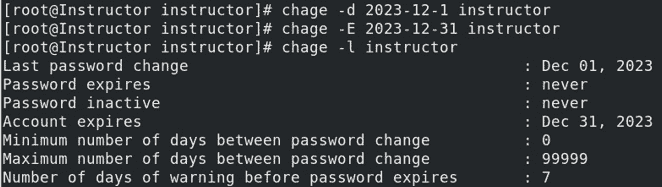

			Figure 2.24 – Using chage
			It displays the following information:

				*   **Last password change date**: This shows the date when the password for the account was last changed
				*   **Password expiration date**: This shows the date when the current password will expire
				*   **Password inactive date**: This shows the date when the password will be disabled and the account will no longer be accessible
				*   **Account expiration date**: This shows the date when the account will expire and be disabled
				*   **Minimum password age**: This shows the minimum number of days that must pass before the password can be changed
				*   **Maximum password age**: This shows the maximum number of days that the password can be used before it must be changed
				*   **Password warning period**: This is the number of days before the password expiration date that a warning is given to the user

			`chage` is a very powerful command that’s useful for every system administrator who wants to improve the security of their systems by enforcing strong password policies.
			The `passwd` command, on the other hand, is used to manage user passwords, allowing users to change their own password, while administrators can use it to change the password of another user. Its purpose is to ensure that user passwords are secure and that the password policies are enforced. The following are some examples:

				*   Configure password policies.

    The `/etc/security/pwquality.conf` file is used to configure password quality-checking policies. It defines rules and settings that control the complexity and strength of user passwords. This file is used by the `sudo` privileges, you can locate and edit the `/etc/security/pwquality.conf` file using the Vim editor. Here are the specific requirements for password quality configuration you need to follow:

    *   `minlen` = `8` or `16` (for the sake of this example we selected `8`)
    *   `minclass` = `3`
    *   `maxrepeat` = `2`
    *   `minsequence` = `4`
    *   `maxclassrepeat` = `4`
    *   `reject_username` = `true`

			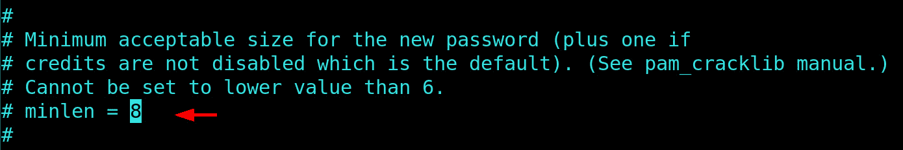

			Figure 2.25 – Editing /etc/security/pwquality.conf
			Here’s a brief summary of the configuration parameters:

				*   `minlen`: This specifies the minimum length of a password (eight characters)
				*   `minclass`: This sets the minimum number of character classes required (three classes, e.g., lowercase, uppercase, and digits)
				*   `maxrepeat`: This limits the maximum number of consecutive identical characters (two consecutive identical characters are allowed)
				*   `minsequence`: This sets the minimum length of a sequence (four characters, e.g., ‘1234’ or ‘abcd’)
				*   `maxclassrepeat`: This limits the maximum number of consecutive characters from the same character class (four consecutive characters from the same class are allowed)
				*   `reject_username`: This ensures that the password does not contain the username

				*   Change the password of a specific user:

			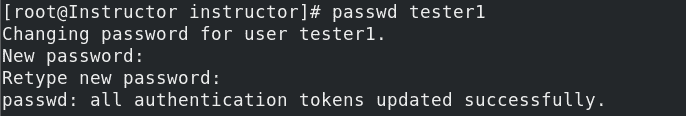

			Figure 2.26 – Changing a user’s password

				*   Lock a user’s password:

			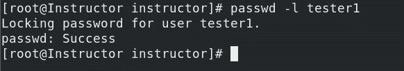

			Figure 2.27 – Locking a user’s password

				*   Unlock a user’s password:

			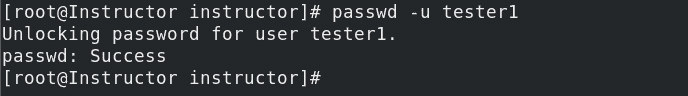

			Figure 2.28 – Unlocking a user’s password
			Unlocking a user’s account with the `passwd -u tester1` command is a crucial part of managing user account settings in Linux. In our next topic, we’ll explore techniques for discovering and locating files and identifying them within the Linux filesystem.
			find, locate, and whereis commands
			One of the most common tasks in Linux system administration is finding files. In CentOS 8, there are several commands that you can use to find files based on different criteria. The most commonly used commands for finding files are `find`, `locate`, and `whereis`. Each command has its own syntax and options, making them suitable for different use cases.
			The `find` command is used to search for files and directories based on various criteria such as name, size, type, and modification time. Here’s an example of how to use the `find` command to search for all files with the `.txt` extension in the current directory and its subdirectories:
			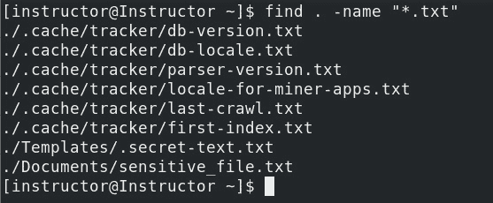

			Figure 2.29 – Finding files with the .txt extension
			The first argument of the command is the starting directory for the search. In our example, the dot `.` character means “current directory,” and `-name` is used to specify the filename pattern to match. The `*` character is a wildcard that matches any number of characters, and `*.txt` matches all files that end with `.txt`.
			The `locate` command, on the other hand, uses a pre-built database to search for files based on name or pattern. The advantage of `locate` over `find` is that it’s much faster since it searches a pre-built database.
			Here’s an example of how to use the `locate` command to find all files with `sensitive` in their names:
			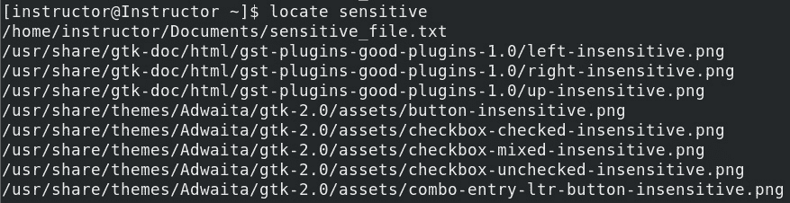

			Figure 2.30 – Using the locate command to find all files
			Finally, the `whereis` command is used to locate the binary, source, and manual page files for a given command. Here’s an example of how to use the `whereis` command to find the location of the `ls` command:
			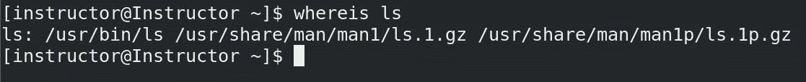

			Figure 2.31 – Locating binary, source, and manual page files for the ls command
			Here’s another example using `whereis` to find the location of the `passwd` command:
			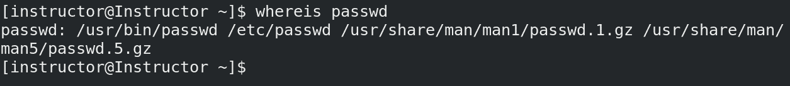

			Figure 2.32 – Locating binary, source, and manual page files for the passwd command
			These commands are essential tools for managing and locating files on a Linux system. By mastering these commands, you can easily search for and identify files based on various criteria and improve your productivity as a system administrator.
			Summary
			In this chapter, we explored Linux user and group management, a crucial aspect of system security, stability, and resource allocation. We began by introducing the concept of user management and explained how to use commands such as `useradd`, `userdel`, and `usermod` to add, remove, and modify users on a Linux system. We also covered how to verify and set password expiration using the `pwck`, `chage`, and `passwd` commands, ensuring that user accounts remain secure.
			The second section focused on file permissions and security basics, essential knowledge for any system administrator. We discussed the various file and directory permissions and how to use commands such as `chmod` and `chown` to modify them. In the third section, we delved into group management and covered commands such as `groupadd`, `groupmod`, `groupdel`, and `grpck`. We explained how groups allow for the efficient management of multiple users with similar permissions and access, and we learned how to use these commands to create and modify groups on a Linux system.
			Moving on to the fourth section, we discussed the `pwck` `and` `chage` commands, which are used to verify the integrity of user and password files and set password expiration policies, respectively. We also covered the `passwd` command, which is used to change user passwords. Finally, the fifth section, *find, locate, and whereis commands*, covered how to locate files in directories and print their location using the `find`, `locate`, and `whereis` commands, which are particularly useful for system administrators who need to quickly locate files on a Linux system.
			The next chapter delves into the topic of file compression and archiving in Linux. Through this chapter, readers will gain an understanding of how to use various commands such as `gzip`, `tar`, `zip`, and more to compress and decompress files.

```
