# 3

# 文件压缩和归档命令

文件压缩和归档命令已成为现代计算的一个重要部分。随着数据量的不断增加和共享，使用压缩技术来减小文件大小，方便存储、传输和共享，已变得越来越必要。这个过程涉及使用软件工具通过去除文件中的不必要数据来压缩文件。压缩后的文件可以存储在更小的空间内，或者通过互联网更快速地传输。

在 Linux 中，有多种文件压缩和归档命令，包括 `gunzip` 和 `gzip`、`tar`、`rar` 和 `unrar`、`zip` 和 `unzip`、`bunzip2` 和 `bzip2` 等等。每个命令都有其独特的特点、优点和限制，使它们适用于特定的使用场景。例如，`gzip` 命令是一个简单易用的压缩工具，可以快速压缩文件。另一方面，`tar` 是一个流行的工具，用于创建和管理 tar 包，可以将多个文件打包成一个归档文件。在本章中，我们将探讨这些命令及其他相关工具，向读者提供 Linux 中不同压缩和归档选项的概览。

在本章中，我们将涵盖以下主要主题：

+   gunzip 和 gzip

+   tar、rar 和 unrar

+   zip 和 unzip

+   bunzip2、bzip2 等

# gunzip 和 gzip

`gunzip`（`gzip`）命令用于压缩文件并创建一个带有 `.gz` 扩展名的压缩文件，而 `gunzip` 命令则用于解压这些 `.gz` 文件。这些命令对于需要通过压缩文件和文件夹来节省磁盘空间的系统管理员尤其重要，同时也有助于通过减少带宽使用来传输文件。

除了实际的好处外，`gunzip` 和 `gzip` 命令在维护系统安全方面也至关重要。压缩文件可以被用来隐藏恶意代码，因此系统管理员必须能够快速、轻松地扫描压缩文件，寻找安全威胁。`gzip` 命令还包括设置文件权限和修改文件时间戳的选项，使系统管理员能够更精细地控制文件的访问和修改。

`gunzip` 是一个命令行工具，用于解压使用 `gzip` 工具压缩的文件。该工具用于从 `.gz` 文件中提取压缩数据并将其恢复到原始状态。该命令对系统管理员至关重要，因为它有助于减小文件大小并节省磁盘空间。此外，该命令还可以在通过网络传输文件时进行压缩和解压，从而减少使用的带宽。通过一个基于场景的示例，我们可以更好地理解 `gunzip` 的基本用法。

假设系统管理员收到一个名为 `largefile.txt.gz` 的压缩文件，该文件来自其他团队成员，包含他们需要访问的重要数据。然而，由于文件过大，无法通过电子邮件或其他消息平台传输。为了访问文件中的数据，管理员需要使用 `gunzip` 命令将其解压。以下是操作方法：

1.  首先，导航到压缩文件所在的目录。例如，如果文件位于 `/home/instructor/Desktop/administrator/data` 目录下，可以通过在终端中运行以下命令来进入该目录：

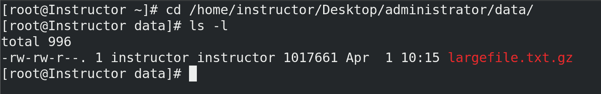

图 3.1 – 导航到文件位置

1.  接下来，使用 `gunzip` 命令解压文件。我们可以通过在终端中运行以下命令来实现：

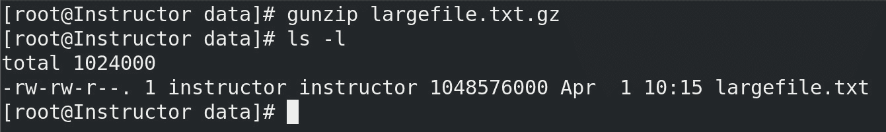

图 3.2 – 使用 gunzip 解压大文件

这将解压文件并将其恢复到原始状态，然后我们可以使用自己喜欢的文本编辑器或其他工具来访问文件中的数据。

`gzip` 是一个命令行工具，用于压缩和解压文件。它通常在 Linux 和 Unix 系统中使用，用于减小文件的大小以便存储或传输。`gzip` 命令通过使用压缩算法将文件压缩成更小的尺寸，从而更方便存储或传输文件，因为它占用更少的空间。

`gzip` 命令是系统管理员的重要工具，因为它可以帮助管理员更高效地管理大文件。例如，如果系统管理员需要通过互联网传输一个大文件，他们可以使用 `gzip` 命令先压缩文件再发送。这样可以减少文件传输所需的时间，并且减少所需的带宽。我们来看以下两个示例：

+   系统管理员希望压缩一个名为 `app.log` 的日志文件，该文件位于 `/var/log` 目录下。管理员可以使用以下命令来压缩该文件：

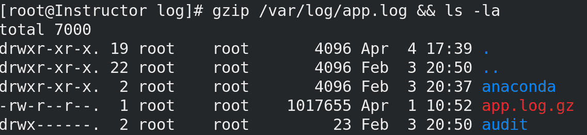

图 3.3 – 使用 gzip 压缩日志文件

这将创建一个名为 `app.log.gz` 的压缩文件，存放在相同的 `/var/log/` 目录下：

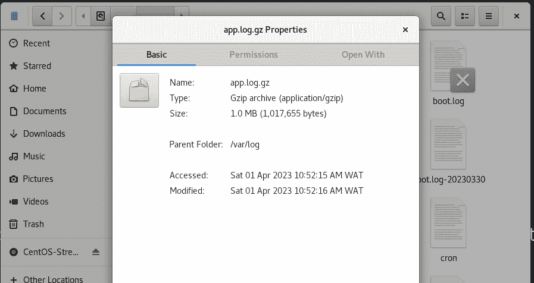

图 3.4 – 将压缩的 app.log.gz 文件从 1 GB 压缩到 1.0 MB

+   系统管理员希望压缩位于 `/home/instructor` 目录下的名为 `backup` 的目录。这个目录压缩过程通常被称为创建一个“tarball”，它是将多个文件或目录打包并压缩成一个归档文件的常用方法。管理员可以使用以下命令来压缩 `backup` 目录：

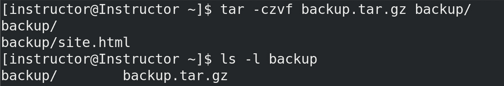

图 3.5 – 压缩名为 backup.tar.gz 的目录

这将创建一个名为 `backup.tar.gz` 的压缩文件，保存在相同的目录中。`tar` 命令也将在我们的下一个主题中介绍。前面命令中提供的 `czvf` 选项用于创建一个 `gzip` 格式的压缩归档。

选项如下：

+   创建一个归档

+   使用 `gzip` 压缩归档

+   显示进度信息

+   指定归档文件的名称

# tar、rar 和 unrar

`tar`、`rar` 和 `unrar` 命令是系统管理员必不可少的工具，提供了压缩和归档文件的能力，以便更高效地存储和传输。通过这些命令，管理员可以将多个文件和目录打包成一个归档文件，然后对其进行压缩以节省更多空间。这些归档文件随后可以在系统之间传输、备份到远程存储或为将来使用存储。

`tar` 命令对于创建归档文件特别有用，因为它允许管理员指定一系列的压缩和文件组织选项。另一方面，`rar` 和 `unrar` 命令是 RARLAB 开发的专有工具，用于创建和解压 RAR 归档文件。这些命令在 Windows 环境中被广泛使用，但也可以通过适当的安装在 Linux 系统上使用。

总体来说，`tar`、`rar` 和 `unrar` 命令大大简化了系统管理员管理和组织文件的过程。通过将文件打包成归档文件并进行压缩以提高存储和传输效率，这些命令使得在多个系统之间管理大量数据变得更加容易。

`tar` 是 `tar` 命令的简称，允许用户使用以下语法将多个文件和目录打包成一个文件：

```
tar [options] [archive-file] [file or directory to be archived]
```

这个归档文件可以很容易地压缩、传输和备份。

这个工具非常重要，因为它简化了创建和管理备份的过程，并且允许用户轻松地与他人共享文件。

`tar` 的一个常见用例是为系统上的重要文件和目录创建备份。例如，系统管理员可以使用 `tar` 命令在对系统进行重大更改之前，先创建关键配置文件和目录的备份。在这种情况下，`tar` 命令可以用来将所有必要的文件和目录打包成一个归档文件，然后将其存储在单独的备份设备上，或者传输到远程位置以便保存。`tar` 的另一个用例是用于分发软件包。开发者可以使用 `tar` 将软件包所需的所有文件和目录打包成一个归档文件，之后可以轻松地分发给最终用户。

系统管理员可能需要通过网络将一个大文件或目录传输到另一个服务器。在这种情况下，可以使用`tar`命令将必要的文件和目录打包成一个压缩文件，然后使用如`webBackups`等工具进行压缩并通过网络传输，压缩使用`gzip`压缩算法：

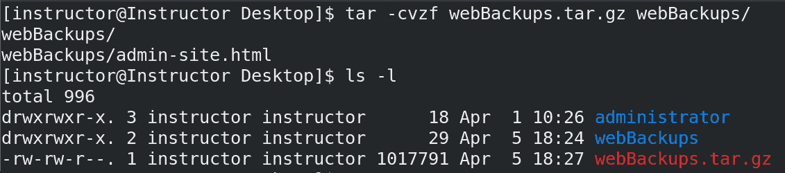

图 3.6 – 创建一个目录的 TAR 压缩包

`rar`是一个专有的文件归档工具，用于在 Linux 系统上压缩和解压文件。该工具由尤金·罗斯哈尔（Eugene Roshal）开发，用于创建扩展名为`.rar`的压缩文件。它是一种流行的文件压缩格式，允许用户将大文件压缩成较小的压缩包，便于存储、传输和分发。`rar`支持密码保护、错误恢复和归档分割等功能，使其成为管理大批量文件的多功能和高效工具。

系统管理员可以使用`rar`来压缩大文件或文件集，减少文件大小并释放磁盘空间。这有助于提高系统性能并减少备份和文件传输所需的存储空间。此外，RAR 压缩包可以设置密码，提供额外的安全性保护敏感文件。系统管理员还可以使用`rar`将大文件分割成多个较小的文件，这在通过互联网传输文件或将其存储在 USB 驱动器等可移动介质上时非常有用。

**场景 1**

系统管理员需要通过互联网将一个大型备份文件传输到另一个服务器。由于文件太大，无法以当前格式传输，因此管理员决定使用`rar`进行压缩。管理员使用`rar a backup.rar backup_folder`命令来创建`backup`文件夹的压缩包：

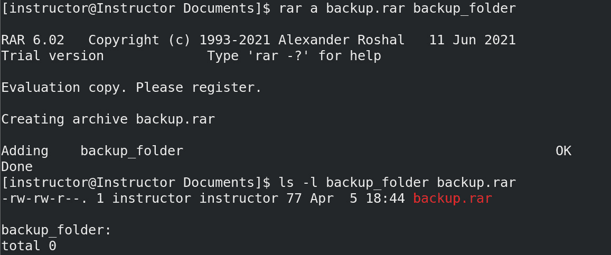

图 3.7 – 创建备份文件夹的压缩包

结果生成的 RAR 压缩包比原始备份文件夹小，且可以轻松通过互联网传输。

# zip 和 unzip

`zip`和`unzip`是系统管理员广泛使用的文件压缩和归档命令。`zip`用于压缩和归档文件，而`unzip`用于从 ZIP 压缩包中提取和解压文件。`zip`和`unzip`是重要的命令，因为它们使系统管理员能够高效管理大文件和目录，减少存储空间的使用，并加快文件传输。这些命令易于使用，支持各种压缩和归档格式，是系统管理任务中多功能的工具。

`zip` 用于将文件压缩并归档为一个单独的文件，以便于备份、存储和传输。压缩后的 `.zip` 文件占用更少的存储空间，从而减少了对额外存储设备的需求。系统管理员可以使用 `zip` 命令来压缩和归档文件、目录，甚至整个文件系统。接下来我们来看一些基于场景的示例。

一位系统管理员需要在 Linux 机器上创建 Web 服务器目录的备份。该目录包含多个文件和子目录，管理员决定使用 `zip` 将目录压缩并归档为一个单独的文件，便于备份和存储。管理员使用 `zip -r backup.zip web_server` 命令创建一个包含所有子目录和文件的 Web 服务器目录的 ZIP 压缩包。生成的 ZIP 压缩包可以存储在便携式硬盘上，或通过网络传输到另一台服务器上以进行保管：

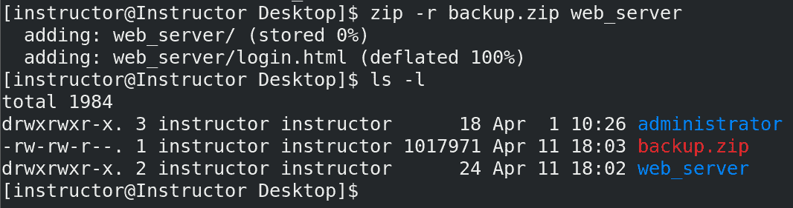

图 3.8 – 创建 Web 服务器目录的备份

在这个示例中，管理员使用 `-r` 标志将 `web_server` 目录压缩为名为 `backup.zip` 的 ZIP 压缩包，并递归地包括所有子目录和文件。稍后，当管理员需要恢复该目录时，他们使用带有 `-d` 标志的 `unzip` 命令，将压缩包提取到一个名为 `restored_web_server` 的新目录中。

`unzip` 也可以用于列出 ZIP 压缩包的内容，测试压缩包的完整性，以及从压缩包中提取特定文件。它还用于从 ZIP 压缩包中提取和解压文件，允许系统管理员检索并使用压缩包中包含的文件。下面是使用 `unzip` 的示例：

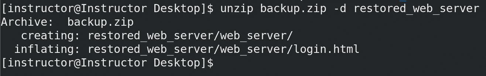

图 3.9 – 使用 unzip 的 “-d” 标志将压缩包提取到一个新目录

`unzip backup.zip -d restored_web_server` 命令用于将名为 `backup.zip` 的 ZIP 压缩包内容提取到名为 `restored_web_server` 的目录中。

要确定目录的大小，可以使用 `du -H restored_web_server/` 命令，它计算文件和目录的磁盘使用情况，如下图所示：

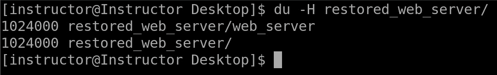

图 3.10 – restored_web_server 命令

`-d` 标志指定提取文件的目标目录。在此案例中，目标目录是 `restored_web_server`。ZIP 压缩包的内容将被提取到该目录中，并保留原始压缩包的目录结构。在下一个主题中，我们将探索如何使用 `tar` 命令通过 `bzip2` 和 `bunzip` 格式来压缩文件。我们还将涉及系统管理员在日常任务中常用的其他归档命令。

# bunzip2, bzip2 和更多

`bzip2` 和 `bunzip2` 是两个在基于 Unix 的系统中用于文件压缩和解压缩的命令。`bzip2` 命令用于压缩文件，而 `bunzip2` 命令用于解压使用 `bzip2` 压缩的文件。这些命令通常由系统管理员使用，以节省磁盘空间并在系统之间传输大型文件。

`bzip2` 是一个强大的压缩工具，它使用 Burrows-Wheeler 块排序文本压缩算法，随后进行 Huffman 编码。这种算法使得 `bzip2` 在保持相对较快解压时间的同时，能够实现较高的压缩比。这使得 `bzip2` 非常适合压缩大型文件，如备份文件、数据库和软件分发包。当一个文件使用 `bzip2` 压缩时，通常会被赋予 `.bz2` 扩展名。以下是几个例子来演示这一过程。

**场景 1**

系统管理员希望压缩一个大型日志文件并节省服务器上的磁盘空间。管理员决定使用 `bzip2` 压缩该文件。管理员导航到日志文件所在的目录，并输入命令 `bzip2 -k -v syslog.log` 来使用 `bzip2` 压缩日志文件：

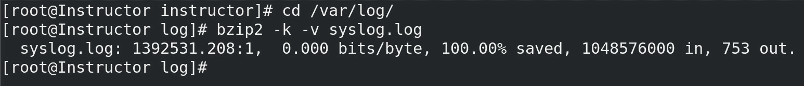

图 3.11 – 使用 bzip2 压缩大型日志文件

接着，我们验证压缩后的 `syslog.log` 文件：

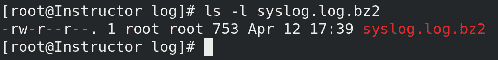

图 3.12 – 验证压缩后的日志文件

`-k` 选项保留原始文件并创建一个压缩版本，而 `-v` 选项则显示压缩过程的进度。压缩后的文件比原始文件小得多，可以安全删除以释放磁盘空间。

**场景 2**

系统管理员需要备份一个包含多个文件和子目录的大目录。管理员决定使用 `bzip2` 将该目录及其内容压缩成一个单独的文件。管理员输入命令 `tar -cvf - directory_to_backup | bzip2 -9 -c > backup.tar.bz2` 来创建该目录的 TAR 存档文件，使用最高压缩级别（`-9`）通过 `bzip2` 压缩，并将输出重定向到一个备份文件中：

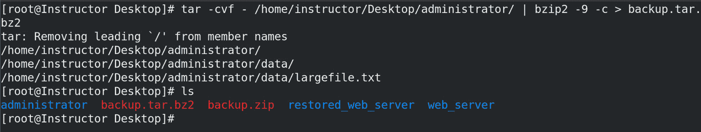

图 3.13 – 压缩一个包含子目录的目录

让我们深入了解这些链式命令。

`tar -cvf - /home/instructor/Desktop/administrator`命令用于创建`/home/instructor/Desktop/administrator`目录的 TAR 归档文件；这是我们在本章中介绍的第一个命令。`-c`选项指定正在创建一个新的归档，`-v`选项启用详细模式以显示归档过程的进度，`-f`选项指定输出文件。`-f`选项后的短横线表示输出应发送到**标准输出**（**stdout**），而不是磁盘上的文件。

`|`（管道）符号用于将`tar`命令的输出重定向到`bzip2`命令的输入；然后，我们使用`bzip2 -9 -c`命令压缩`tar`命令创建的 TAR 归档文件，采用`bzip2`算法。`-9`选项指定最高压缩级别，而`-c`选项将输出发送到标准输出。最后，`> backup.tar.bz2`将压缩后的输出重定向到名为`backup.tar.bz2`的文件。

下面是对`bzip2`常见压缩级别的简要解释：

+   `-1`（最快）：此级别提供最快的压缩速度，但生成较大的压缩文件。适用于速度比文件大小缩减更为关键的情况。

+   `-9`（最大压缩——我们在*图 3.13*中选择的压缩级别）：此级别提供最高的压缩率，生成较小的压缩文件。然而，它比较低级别的压缩速度慢。当节省磁盘空间是首要任务且你不介意等待压缩过程完成时，这个级别很有用。

+   `-2`到`-8`（中间级别）：这些级别提供压缩速度和文件大小之间的折中。随着从`-2`到`-8`的增加，压缩效果变得更好（文件更小），但相比于较低的级别，压缩速度更慢。根据你对速度和文件大小缩减的具体需求选择一个中间级别。

生成的备份文件比原始目录小得多，且可以轻松传输或存储以备安全保存。

`bunzip2`命令用于解压已使用`bzip2`压缩的文件。当使用`bunzip2`解压压缩文件时，原始文件将以与压缩文件相同的名称和目录路径恢复，但没有`.bz2`扩展名。`bunzip2`命令还可以解压使用`gzip`命令压缩的文件。

系统管理员可以通过多种方式使用`bzip2`和`bunzip2`。一个常见的使用场景是压缩和解压 web 服务器上的大型日志文件。通过使用`bzip2`压缩日志文件，系统管理员可以节省磁盘空间，并将日志传输到另一个系统进行分析。另一个使用场景是压缩和传输数据库备份文件。通过使用`bzip2`压缩备份文件，系统管理员可以减少传输时间并节省网络带宽。让我们通过一个例子进一步解释这一点。

**场景 1**

系统管理员需要提取并解压一个已经被分割成多个部分的大压缩文件。该压缩文件具有 `.bz2` 扩展名，并且是使用 `bzip2` 命令创建的。为了提取并解压该文件，管理员可以使用 `bunzip2` 命令，后跟文件名。如果压缩文件已被分割成多个部分，管理员可以使用 `cat` 命令将文件合并，然后将输出通过管道传递给 `bunzip2` 命令。以下是管理员可以使用的示例命令：

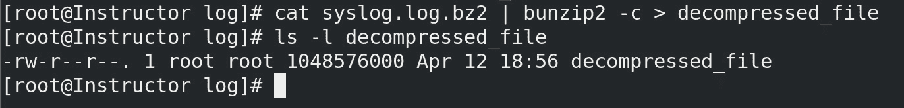

图 3.14 – 使用 bunzip2 解压缩压缩文件

`cat syslog.log.bz2` 命令读取 `syslog.log.bz2` 压缩文件的内容，并将其作为输入传递给 `bunzip2 -c` 命令。`-c` 选项指定命令的输出应发送到标准输出（即终端），而不是文件。

`bunzip2 -c` 命令使用 `bzip2` 压缩算法解压输入文件，并将解压后的数据发送到标准输出(stdout)。最后，输出通过 `>` 运算符重定向到名为 `decompressed_file` 的文件中。

让我们探索其他可以使用的归档命令，例如 `7zip` 和 `xz`。

7-Zip 是一个流行的开源文件归档工具，能够处理各种压缩格式，如 ZIP、GZIP、TAR 以及其自有的 7z 格式。它被系统管理员广泛用于压缩和解压文件及目录。该工具具有高压缩比，能够显著减少文件大小。7-Zip 使用的压缩格式也以安全性著称，适合用于存档机密数据。它还可以创建自解压归档文件，允许用户在无需安装任何附加软件的情况下提取压缩文件。接下来，我们将通过一个场景进行说明。

**场景 1**

系统管理员需要创建一个包含机密信息的大目录的压缩归档。管理员使用 `7z a -t7z -p -mhe=on archive.7z directory_to_compress` 命令创建一个密码保护且加密的 7z 归档文件。`-mhe=on` 选项启用文件名加密，以确保数据的机密性：

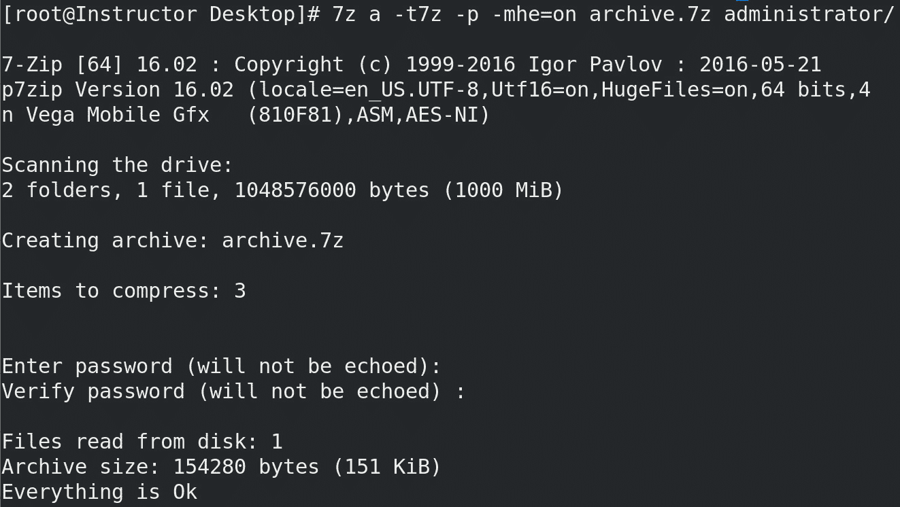

图 3.15 – 7-Zip 提示用户输入密码

`-p` 选项用于指定压缩归档文件的密码。由于在 `-p` 选项后没有提供密码，`7z` 将提示用户输入密码。生成的 `7z` 归档文件可以轻松地转移并存储到另一个服务器或外部硬盘上，只有拥有密码的授权人员才能提取数据。

XZ 是一个用于数据压缩和解压缩的命令行工具。它基于 **Lempel-Ziv-Markov 链算法**（**LZMA**），该算法以高压缩比和低内存占用著称。XZ 用于创建大型文件和目录的压缩归档，尤其在 Linux 系统中应用广泛。它也用于在安装过程中压缩 Linux 内核。XZ 能显著减少文件大小，同时保持原始文件的完整性。此外，XZ 还可以用于动态压缩和解压文件，这在某些场景中非常有用。

**场景 2**

系统管理员需要压缩并归档一个由 web 服务器生成的大型日志文件。管理员使用 `xz -z -k -9 logfile.log` 命令以最大压缩级别（`-9`）压缩该文件并保留原始文件（`-k`）。压缩后的文件明显比原始文件小，从而更便于存储和传输。管理员可以使用 `xz -d logfile.log.xz` 命令解压该文件，以便进行分析或进一步处理。

以下命令用于压缩日志文件：


图 3.16 – 压缩 syslog 文件

在这里，`xz` 命令用于将 `syslog.log` 文件以最大压缩级别 9（`-9`）进行压缩，并保留原始文件（`-k`）。压缩后的文件将具有 `.xz` 扩展名。

以下命令用于解压缩压缩的日志文件：

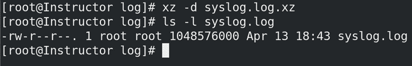

图 3.17 – 解压缩 syslog 文件

要解压缩 syslog 文件，我们使用相同的 `xz` 命令解压缩 `syslog.log.xz` 压缩文件。解压后的文件将恢复为原始名称 `logfile.log`。

总之，Linux 系统拥有多种强大的工具用于文件的压缩与解压缩，包括 `bunzip2`、`bzip2`、`7z` 和 `xz`。这些工具特别适用于归档大型文件和目录，以及在系统之间或通过网络传输文件。通过一些命令提供的密码保护和数据加密功能，管理员可以确保文件的安全性和机密性。通过使用这些命令，系统管理员可以更高效地管理文件和存储，优化计算资源。例如，`7z` 可以压缩大型数据库，`bzip2` 可以归档文件，而 `xz` 可以压缩日志文件。无论管理员需要压缩、传输还是解压缩文件，这些工具都提供了可靠且高效的解决方案。

# 总结

本章介绍了文件压缩与归档命令，这些命令对于高效的文件管理和通过网络传输文件非常重要。它还介绍了几种强大的工具，包括`gunzip`、`gzip`、`tar`、`rar`、`unrar`、`zip`、`unzip`、`bunzip2`、`bzip2`、`7z`和`xz`，这些工具使得系统管理员能够高效地压缩和解压文件、归档大型文件和目录，并通过网络或系统之间传输文件。这些命令提供了各种压缩级别和加密选项，以确保数据的安全性和机密性。它们对于管理大型数据库、备份重要文件以及通过互联网传输文件特别有用。通过使用这些命令，系统管理员可以高效地管理文件和存储，最大化计算资源的利用。

总体来说，本章提供了一个全面的指南，讲解了 Linux 中文件压缩与归档命令，这些命令对有效的文件管理和存储优化至关重要。通过掌握这些命令，系统管理员能够高效地管理文件和存储，确保数据的安全性和机密性。

随着我们进入*第二部分*，下一章将专注于格式化和磁盘空间命令，这些命令对于系统管理员管理磁盘空间和文件系统至关重要。通过本章，读者将学习如`mkfs`、`fdisk`、`du`、`df`等命令，了解如何格式化磁盘、分区硬盘、检查磁盘使用情况并管理文件系统。通过学习这些命令，系统管理员可以有效地管理磁盘空间并优化存储性能。

# 第二部分：常用命令 – 第一部分

在这一部分，我们探索系统管理员在**命令行界面**（**CLI**）中常用的基本命令。我们将讨论它们的实用性和执行方式，并提供实践经验以确保正确理解。

本节包含以下章节：

+   *第四章*，*格式化与磁盘空间命令*

+   *第五章*，*Linux 权限命令*

+   *第六章*，*文件系统挂载与操作命令*
