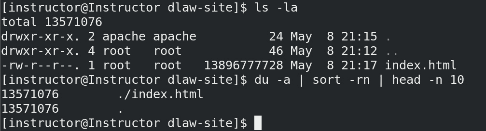
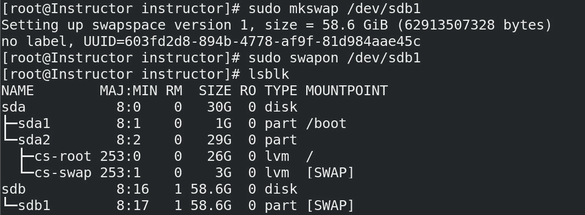

# 格式化和磁盘空间命令

在我们全面系列的系统管理员常用命令中，**命令行界面**（**CLI**）是完成许多任务的必备工具。CLI 提供了一种简洁高效的方式来执行各种任务，从管理文件和目录到监控系统性能和排查问题。在这一部分中，我们将深入探讨常用命令，了解它们的实用性、执行方法以及有效的最佳实践。通过掌握这些命令，系统管理员能够更加高效、有效地工作，充分利用计算资源。

作为一名系统管理员，管理存储和文件系统是确保系统顺利运行的关键部分。能够格式化、分区和管理磁盘空间对于管理文件、备份重要数据以及维护系统稳定性至关重要。在本章节中，我们将探讨用于格式化和磁盘空间管理的各种命令，包括`fdisk`、`lsblk`、`df`、`du`等。

我们将首先讨论磁盘格式化和分区的历史与演变，从早期的磁带存储到现代的`mkfs`、`mke2fs`、`fdformat`等工具。在本章结束时，您将对格式化和磁盘空间命令有一个全面的了解，能够有效地管理存储和文件系统。需要注意的是，格式化磁盘会删除磁盘上的所有数据，因此在使用这些命令时应小心谨慎。

本章我们将涵盖以下主要内容：

+   Linux 中磁盘格式化和分区的历史与演变

+   创建分区的步骤

+   fdisk、lsblk、df 和 du

+   显示（dpkg 和 rpm）软件包空间

+   mkfs、mke2fs 和 fdformat 等工具

# Linux 中磁盘格式化和分区的历史与演变

Unix/Linux 中磁盘格式化和分区的历史可以追溯到计算机早期，那时磁盘存储资源稀缺。磁盘分区在将磁盘空间划分为更小、可管理的部分时至关重要。这使得系统管理员可以更高效地分配磁盘空间，并减少在磁盘故障时数据丢失的风险。在 Unix 早期，磁盘分区是通过`fdisk`命令完成的，用户可以使用该命令创建、删除和修改磁盘分区。随着 Linux 的引入，分区工具更新为使用更先进的**GUID 分区表**（**GPT**）格式，支持更大的磁盘和更多的分区。

随着时间的推移，Unix/Linux 中的磁盘格式化和分区变得越来越复杂，新增了许多命令和工具，以改进这一过程。例如，`mke2fs` 命令用于创建 `ext2` 或 `ext3` 文件系统，它是在 Linux 1.2 版本中引入的。该命令创建了一种更高效的文件系统，减少了数据丢失的风险，并使磁盘管理更加可控。`mke2fs` 命令的引入是 Unix/Linux 中磁盘格式化和分区发展史上的一个重要里程碑，因为它使管理员能够创建更可靠的文件系统并更高效地管理磁盘空间。云计算和虚拟化的出现也对 Unix/Linux 中的磁盘格式化和分区产生了重大影响。云计算使虚拟磁盘的使用成为可能，虚拟磁盘可以像物理磁盘一样使用相同的工具进行分区和格式化。在虚拟化环境中，管理员可以轻松地创建、修改和调整虚拟磁盘的大小，使存储空间的管理变得更加简单。此外，云存储提供商还开发了自己的磁盘格式化和分区工具，如 Amazon **弹性块存储**（**EBS**），它允许用户为实例创建并附加虚拟磁盘。这些工具使管理员在云中管理磁盘空间变得更加容易，并确保数据的安全存储。

有三种类型的分区：

+   **主分区**：主分区是可以用来启动操作系统的基本分区。在硬盘上，你可以创建最多四个主分区。如果想创建更多的分区，可以创建一个扩展分区，它是一种特殊的分区，可以包含多个逻辑分区。

+   **逻辑分区**：逻辑分区是在扩展分区内创建的分区。你可以在扩展分区内创建多个逻辑分区，这在你想创建多个分区但已创建四个主分区时会非常有用。

+   **扩展分区**：扩展分区是一种特殊的分区，用于创建多个逻辑分区。只有在硬盘上没有超过四个主分区的情况下，才能创建扩展分区。创建了扩展分区后，可以在其中创建多个逻辑分区。

这些分区类型用于组织和管理硬盘上的数据。通过创建多个分区，可以将不同类型的数据分开，并更有效地管理它们。例如，可以为操作系统创建一个单独的分区，为用户数据创建一个分区，为备份文件创建一个分区。这可以使数据的管理更加方便，并在发生故障或数据丢失时进行保护。不同类型的分区提供了在硬盘上根据需要和硬盘的限制组织数据的灵活性。

# 创建分区的步骤

分区是将一个物理硬盘分割成多个逻辑存储单元的过程。在 Linux 中，创建分区的过程包括定义新分区的大小和位置，然后使用`ext4`、`XFS`或`btrfs`等文件系统对其进行格式化。创建分区对于有效管理磁盘空间至关重要。通过分区，系统管理员可以在硬盘上组织和分配空间，用于操作系统、应用程序文件、用户数据和交换空间等多个功能。

在 Linux 中创建分区的过程包括几个步骤。第一步是使用`fdisk`命令或其他磁盘管理工具（如`lsblk`、`df`和`du`）识别需要分区的物理硬盘。接下来，系统管理员必须决定新分区的大小和位置，并使用`fdisk`命令创建它。然后，必须使用`mkfs`命令将新分区格式化为文件系统。最后，系统管理员必须挂载新分区，以便操作系统及其应用程序能够访问它。

分区对于几个方面非常重要。首先，它通过将数据组织成逻辑单元，帮助系统管理员有效管理磁盘空间。通过分区，备份和恢复数据变得更加容易，也更方便为特定的应用程序或功能分配空间。其次，分区可以通过减少磁盘碎片和优化访问时间来提高系统性能。此外，分区还可以通过将敏感数据隔离在独立的分区中，保护其免受未经授权的访问，从而提高安全性。请记住，分区是系统管理员管理磁盘空间、优化系统性能和增强安全性的关键工具。

演示将会很简单，因为我们只需要一块连接到 Linux 机器的驱动器，然后通过启动终端就可以开始分区。我们将使用的命令是`lsblk`和`fdisk`。`lsblk`命令会列出可用的设备，以便我们选择正确的设备进行格式化，而`fdisk`命令则会有效地格式化所选的设备。让我们开始演示：

1.  要验证可用设备，请执行`lsblk`命令：

图 4.1 – 验证磁盘空间

如我们所见，我们已经列出了可用设备及其各自的磁盘空间，但我们主要关注的是连接在`/dev/sdb`上的驱动器。请注意，`/dev`表示 Linux 中的设备目录，其中硬件设备作为文件表示。在这种情况下，`/dev/sdb`是系统上的第二个 SCSI 磁盘驱动器。注意，它已经有一个分区（`sdb1`）。我们将删除该分区，重新验证一次，然后创建我们自己的分区。让我们继续进行下一步。

1.  接下来，执行`fdisk`命令来打开`/dev/sdb`驱动器的工具。请确保你有`sudo`权限来运行此命令。打开工具后，你可以创建新分区，但首先，让我们删除之前的分区：

图 4.2 – 查看`/dev/sdb`驱动器的 fdisk 工具

在这里，我们使用了`p`命令，它表示打印，用来显示我们之前通过`lsblk`命令识别的现有分区的信息。现在，我们需要删除该分区，以便根据我们的需求创建一个新分区。

1.  要删除`sdb1`分区，请使用`d`命令（表示删除）来移除`sdb1`分区：

图 4.3 – 删除并保存所做的更改

1.  之后，我们可以使用`lsblk`命令检查分区是否真的被删除。如我们所见，已删除的分区（`sdb1`）不再列出，证明删除成功：

图 4.4 – 验证分区已删除

一旦确认这一点，我们就可以继续创建我们自己的分区。

1.  现在，调用`fdisk`工具来查看`/dev/sdb`驱动器的分区，并输入`p`以打印当前的分区表。这将帮助你了解磁盘当前的分区情况。接下来，输入`n`以创建新分区。`fdisk`工具中的`n`命令用于在所选磁盘上创建新分区。输入命令后，我们会被提示选择我们希望创建的分区类型。在这种情况下，我们将看到两种分区类型——`主分区`和`扩展分区`：

图 4.5 – 创建新分区

1.  接下来，我们选择了`p`作为主分区类型。然后，我们被提示选择分区数量，我们按*Enter*键保留默认值。对于第一个扇区，我们也按了*Enter*键。最后一个扇区也是如此。最后，我们通过输入`yes`确认要删除签名，并使用`w`命令保存我们所做的所有更改：

图 4.6 – 选择主分区并保存更改

1.  通过调用`fdisk -l /dev/sdb`和`lsblk`来验证其创建：

图 4.7 – 验证新分区（sdb1）

恭喜！你已经成功创建了一个分区。

# fdisk、lsblk、df 和 du

在 Linux 系统中，用于管理文件系统的工具包括`fdisk`、`lsblk`、`df`和`du`。这些工具各自执行磁盘管理中的特定功能，正确使用它们对确保系统高效运行至关重要。

我们之前介绍了 `fdisk`，一个用于分区的命令行工具。它允许我们创建和修改分区表，帮助管理员根据需要组织存储空间。分区对于高效利用存储空间、提高系统性能以及简化文件系统管理至关重要。`fdisk` 可以创建不同类型的分区，包括主分区、逻辑分区和扩展分区。此外，它还可以用于更改分区大小、删除分区和修改分区类型。如果没有 `fdisk`，管理和组织文件系统将变得复杂、繁琐且容易出错。我们可以通过输入 `fdisk -l` 来列出分区：

图 4.8 – 使用 fdisk 列出分区

`lsblk` 是另一个命令行工具，用于 Linux 系统中列出所有可用的块设备，包括硬盘、USB 设备和光盘驱动器。这个工具有助于识别系统上附加的存储设备及其详细信息。`lsblk` 的输出提供了关于块设备的关键信息，如设备名称、大小、文件系统类型和挂载点。以下是一个例子：

图 4.9 – 块设备的输出

这些信息对于决定如何分配存储空间和高效组织文件系统至关重要。`lsblk` 在磁盘管理中是必不可少的，它帮助系统管理员识别附加到系统上的存储设备，排除设备连接问题，并就分区和磁盘组织做出明智决策。

`df` (**磁盘空闲**) 工具是一个命令行工具，用于显示 Linux 系统中文件系统使用的磁盘空间和可用的磁盘空间。这个工具在监控文件系统使用情况、识别存储空间消耗模式以及做出如何有效分配存储空间的决策中非常重要。我们来尝试显示特定文件系统（如根文件系统）的磁盘空间使用情况：

图 4.10 – 使用 df 显示磁盘使用情况

使用 `df`，管理员可以识别出磁盘空间不足的文件系统，这可能会导致系统性能问题或数据丢失：

图 4.11 – 监控磁盘使用情况

在这个示例中，管理员正在监控存储网站文件的文件系统的磁盘空间使用情况，该文件系统挂载在 `/var/www/html`。使用 `df` 命令并加上 `-h` 选项，可以以人类可读的格式显示输出，使磁盘空间的使用情况更易理解。输出显示文件系统的总大小、已用空间、可用空间、已用空间的百分比以及挂载点。管理员可以利用这些信息识别出占用最多空间的目录，并进行优化以提升性能。此外，管理员还可以根据这些信息为未来的磁盘空间需求进行规划。`df` 工具提供了关于文件系统使用情况的详细报告，包括文件系统类型、总大小、已用空间、可用空间和已用磁盘空间的百分比。有了这些信息，管理员可以优化磁盘使用、提高性能并避免系统崩溃。

`du` 工具是另一个在 Linux 系统中用于确定特定目录和文件所占空间的基本命令行工具。通过 `du`，管理员可以识别出占用过多空间的文件或目录，并决定是否删除、归档或将它们移至另一个文件系统。`du` 工具还会显示每个子目录所占的空间，使管理员能够快速定位占用空间的文件。`du` 工具在磁盘管理中的重要性不言而喻，它帮助系统管理员优化磁盘使用、识别占空间的文件，并排除空间消耗问题。

## 检查目录的磁盘空间使用情况

在这个示例中，我们将使用 `du` 命令检查目录的磁盘空间使用情况。

步骤如下：

1.  导航到您想要检查磁盘空间使用情况的目录。

1.  输入以下命令：

图 4.12 – 使用 du 检查磁盘使用情况

我们使用了 `du -sh` 命令来检查目录的磁盘空间使用情况。输出显示该目录使用了 13 GB 的磁盘空间。

## 查找目录中的大文件

在这个示例中，我们将使用 `du` 命令查找目录中的大文件。

步骤如下：

1.  导航到您想要查找大文件的目录。

1.  输入以下命令：

图 4.13 – 使用 du 查找大文件

使用 `du -a | sort -rn | head –n 10` 命令识别目录中 10 个最大文件。生成的输出提供了每个文件的字节大小及其相应的文件路径。让我们将此命令应用于另一个文件夹并观察结果：

图 4.14 – 使用 du 查看文件大小

`fdisk`、`lsblk`、`df`和`du`等工具对于在 Linux 系统中管理和组织磁盘空间至关重要。`fdisk`用于磁盘分区，`lsblk`用于识别连接到系统的存储设备，`df`用于监控文件系统的使用情况，而`du`用于确定特定目录和文件所占用的空间。正确使用这些工具对于优化磁盘使用、提高系统性能和避免数据丢失至关重要。

# 显示（dpkg 和 rpm）软件包空间

包管理系统如`dpkg`和`rpm`用于在 Linux 和 Unix 操作系统中安装、删除和管理软件包。`dpkg`工具用于基于 Debian 的系统，如 Ubuntu，而`rpm`工具则用于基于 Red Hat 的系统，如 CentOS。这些工具不仅提供了一种便捷的方式来管理软件包，还提供了关于已安装软件包的磁盘空间使用情况的有价值信息。`dpkg`和`rpm`工具的一个重要用途是显示软件包空间，这指的是已安装软件包所占用的磁盘空间。通过使用这些工具，管理员可以识别出占用最多磁盘空间的包，并决定是否删除或保留它们。这在磁盘空间有限的系统中尤其有用，因为优化磁盘空间的使用对避免系统崩溃、性能问题或数据丢失至关重要。

此外，`dpkg`和`rpm`工具还提供了关于软件包依赖关系的信息，这些是安装的软件包正常运行所需的其他软件包。这些信息有助于识别出可以安全删除的包，而不会影响系统的稳定性或功能性。通过删除不必要的包，管理员可以释放磁盘空间，减少系统复杂性，并提高系统性能。`dpkg`和`rpm`工具还提供了一种简便的方式来自动解决依赖关系，升级或安装软件包。通过这些工具，管理员可以轻松安装安全补丁、更新和新的软件包，而无需担心依赖关系问题。这减少了管理软件包所需的时间和精力，并确保系统保持最新的软件版本。我们目前使用的是 CentOS 8，这意味着`rpm`（**Red Hat 软件包管理器**）将是我们的第一个示例。

## 安装软件包

以下示例演示了如何在 CentOS 8 上使用`rpm`安装软件包：

图 4.15 – 使用 rpm 安装软件包

此命令使用 RPM 安装指定的软件包。它会在当前目录中搜索`package`文件，或者你可以指定`package`文件的路径。这个命令对于在 Linux 系统上安装新软件非常有用，无论是单个软件包还是一组软件包。

## 查询软件包的详细信息

`rpm` 命令可用于查询系统中已安装软件包的详细信息。例如，要查询 `ftp` 软件包的详细信息，可以使用以下命令：

图 4.16 – 查询已安装软件包的详细信息

`dpkg` 和 `rpm` 工具对于管理软件包和优化 Linux 和 Unix 系统中的磁盘空间使用至关重要。通过提供有关软件包空间、依赖关系和升级选项的有价值信息，这些工具使管理员能够做出明智的决策，确保系统的稳定性、安全性和性能。

# mkfs、mke2fs、fdformat 等

磁盘格式化是准备存储设备（如硬盘、SSD 或 USB 闪存驱动器）以进行数据存储的过程。格式化会在存储设备上创建文件系统，操作系统可以通过该文件系统来组织和管理设备上的文件。在 Linux 中，可以使用多种磁盘格式化工具命令来格式化存储设备。这些工具包括 `mkfs`、`mke2fs`、`fdformat` 等。

`mkfs` 是用于在存储设备上创建文件系统的命令。此命令可用于创建多种文件系统，包括 `ext2`、`ext3`、`ext4`、`XFS`、`btrfs` 等。`mkfs` 命令在为 Linux 系统准备存储设备时非常重要。例如，当一个新的硬盘添加到 Linux 服务器时，必须先进行格式化才能用于数据存储。我们来看一下在 CentOS 8 上使用此工具的简单方法：

图 4.17 – 使用 mkfs.ext4 格式化分区

这将使用 `ext4` 文件系统格式化 `/dev/sdb1` 分区。新格式化的分区可以挂载并用于数据存储。

`mke2fs` 是 `mkfs` 命令的一个变体，专门用于创建 `ext2`、`ext3` 和 `ext4` 文件系统。`mke2fs` 命令在创建和管理 Linux 文件系统中非常重要。使用此命令，管理员可以指定文件系统的大小、块大小以及其他参数，以优化文件系统以适应特定的使用场景。例如，使用 `mke2fs` 命令创建的文件系统可以优化以应对高性能工作负载，或用于处理大文件，如以下示例所示：

图 4.18 – 创建 ext3 文件系统

在这里，命令会在 `/dev/sdb1` 分区上创建一个 `ext3` 文件系统。`-t ext3` 选项指定文件系统类型为 `ext3`。

`fdformat` 命令主要用于对软盘进行低级格式化，这是较旧的存储介质。它会将新的磁盘几何结构和扇区布局写入软盘，准备其使用。然而，该命令并不适用于格式化现代存储设备，如 U 盘或 USB 闪存驱动器。

在 Linux 中格式化 U 盘或 USB 闪存驱动器时，通常使用`mkfs`（创建文件系统）命令，如使用`mkfs.fat`创建`FAT`文件系统，或使用`mkfs.ext4`创建`ext4`文件系统，正如前面的示例所示。这些命令专门设计用于格式化不同类型的存储设备，包括 U 盘、USB 闪存驱动器和硬盘。

`mkswap`命令用于在 Linux 系统上创建交换区域。交换区域是硬盘上专用的空间，当系统的物理内存不足时，可以将其作为虚拟内存使用。`mkswap`命令将磁盘分区或文件初始化为交换区域，并为其分配唯一的标识符。

让我们通过全面的示例，演示这些命令的实际应用：

1.  检查可用的磁盘分区：

图 4.19 – 查看可用的磁盘分区

1.  确定所需的交换分区，如`/dev/sdb1`，然后执行`sudo mkswap /dev/sdb1`命令。该命令将分区格式化为`swap`，输出如下：

图 4.20 – 使用 mkswap 将分区格式化为 swap

`gdisk`命令是`fdisk`命令的一种变体，用于 Linux 系统上的硬盘分区。`gdisk`主要设计用于 GPT，这是一种较新的分区方案，已经取代了较旧的分区方式。`gdisk`是一个强大的工具，允许你在 GPT 磁盘上创建、修改和删除分区。

1.  在此场景中，系统管理员使用`gdisk`命令在`/dev/sdb`磁盘上创建一个新分区。管理员输入`gdisk /dev/sdb`命令以启动指定磁盘的`gdisk`工具。

1.  进入`gdisk`工具后，管理员使用`n`命令创建一个新分区。工具会提示输入分区号、起始扇区和结束扇区。管理员可以选择默认值，也可以根据需求指定自定义值：

图 4.21 – 使用 gdisk 创建新分区

1.  在此示例中，管理员通过输入十六进制代码`8300`将分区类型设置为`Linux swap`。确认更改后，管理员使用`w`命令将更改写入磁盘并退出`gdisk`工具：

图 4.22 – 分区已创建

`parted`命令是一个分区编辑器，允许你在硬盘上创建、删除、调整大小和移动分区。Parted 支持 MBR 和 GPT 两种分区方案，并能够处理多种文件系统类型。它是管理磁盘分区的强大工具，通常用于服务器环境中。

让我们探索一个使用 `parted` 命令的实际场景：

1.  在此场景中，系统管理员使用 `parted` 命令在 `/dev/sdb` 磁盘上创建一个新分区。管理员输入 `parted /dev/sdb` 命令来启动指定磁盘的 parted 工具。

1.  进入 parted 工具后，管理员使用 `mklabel gpt` 命令在磁盘上创建一个新的 GPT 分区表。这可以确保与现代系统和更大磁盘大小的兼容性。

1.  接下来，管理员使用 `mkpart primary ext4 0% 100%` 命令创建一个新的主分区，该分区覆盖整个磁盘。该分区采用 `ext4` 文件系统格式化。

1.  创建分区后，管理员可以使用 `print` 命令验证分区布局和详细信息。这有助于确保分区正确创建。

1.  最后，管理员使用 `quit` 命令退出 parted 工具：

图 4.23 – 使用 parted 创建分区表

通过在此场景中使用 `parted` 命令，系统管理员可以轻松创建和管理指定磁盘上的分区，从而实现有效的磁盘管理和利用。

`dd` 命令是一个低级工具，用于在文件、磁盘和分区之间复制和转换数据。`dd` 命令通常用于创建可启动的 USB 驱动器、备份和恢复磁盘映像以及克隆磁盘。它还可以用于将零写入硬盘，这对于安全擦除敏感数据非常有用。

让我们探索一个 `dd` 命令的实际示例场景：

1.  在此场景中，系统管理员使用 `dd` 命令将源文件的内容复制到由 `/dev/sdb` 表示的 USB 设备上。

1.  管理员首先执行 `dd` 命令。`if` 选项用于指定输入文件，后跟源文件的路径（在此示例中为 `/home/instructor/backup.tar.gz`）：

图 4.24 – 使用 dd 命令在 USB 设备上复制

1.  接下来，`of` 选项用于指定输出文件，即由 `/dev/sdb` 表示的 USB 设备。这意味着源文件的内容将被写入到 USB 设备中。

1.  `bs` 选项用于指定数据传输的块大小。在此示例中，`bs=4M` 表示块大小为 4 兆字节。

1.  通过执行此命令，系统管理员可以有效地将源文件的内容复制到 USB 设备上。这对于创建可启动 USB 驱动器、传输大型文件或创建磁盘映像等任务非常有用。

1.  在使用`dd`命令处理块设备如`/dev/sdb`时，必须小心，因为目标设备上的所有数据都将被覆盖。作为管理员，你应该仔细检查并确保选择了正确的设备，以避免意外的数据丢失。

总之，磁盘格式化工具命令是管理 Linux 系统中存储设备的重要组成部分。这些命令帮助管理员准备存储设备，优化文件系统以适应特定的使用场景，并确保设备的可靠性和性能。理解这些命令的目的和使用方式对于任何从事存储设备管理的 Linux 管理员都非常重要。

# 总结

本章探讨了创建分区的步骤，这是磁盘管理的基础过程。我们详细介绍了如何使用`fdisk`、`lsblk`、`df`和`du`等工具来创建、修改和分析存储设备上的分区。这些工具在分区管理中起着至关重要的作用，帮助系统管理员高效分配磁盘空间、监控磁盘使用情况，并做出明智的决策，以优化存储利用率。此外，本章还深入讨论了如何使用`dpkg`和`rpm`等命令来显示包的空间信息。这些命令帮助系统管理员获取已安装包的信息，包括其大小和磁盘空间占用情况。通过使用`dpkg`和`rpm`，管理员可以跟踪包的安装情况，识别占用大量空间的包，并管理包的依赖关系，以确保磁盘空间的高效利用。

此外，本章介绍了`mkfs`、`mke2fs`和`fdformat`等磁盘格式化工具的使用。这些命令为管理员提供了格式化磁盘和分区的能力，支持多种文件系统，便于数据的组织和兼容性。正确的磁盘格式化对优化性能和存储利用率至关重要。系统管理员可以使用这些工具准备磁盘用于特定用途，创建用于数据存储的文件系统，或格式化可移动存储介质。

总结来说，本章是关于 Linux 中有效文件管理和存储优化的全面指南。通过创建分区、使用`fdisk`、`lsblk`、`df`和`du`等工具、展示`dpkg`和`rpm`的包空间，并采用`mkfs`、`mke2fs`和`fdformat`等磁盘格式化命令，系统管理员可以高效地管理文件和存储资源。这能帮助他们提升存储利用率，确保数据完整性，并保持系统环境的有序和优化。

在下一章，我们将深入探讨并讨论一些重要的命令，如`chmod`、`chown`、`chgrp`、`umask`和`sudo`。这些命令在授予和管理文件权限、修改所有权和组设置、设置默认文件权限以及以管理员权限执行命令方面起着至关重要的作用。
