# Linux 权限命令

Linux 权限命令是 Linux 系统管理的基本组成部分，提供了一个强大的机制来控制对文件和目录的访问。这些命令，包括`chmod`、`chown`等，在保持安全性、保护敏感数据和管理用户权限方面发挥着重要作用。它们允许 Linux 系统管理员定义谁可以读取、写入和执行文件，并为不同的用户和组指定访问权限。Linux 权限命令的重要性在于它们能够执行最小权限原则，确保用户和进程只有执行其预定任务所需的权限。通过分配适当的权限，系统管理员可以保护关键文件，防止未经授权的访问，减少数据泄露和未经授权修改的风险。此外，这些命令使管理员能够根据用户角色分配权限，在系统中保持一个明确的安全模型。

Linux 权限命令的目的是双重的：安全性和组织性。从安全角度看，它们允许管理员限制对敏感文件、目录和系统资源的访问。通过授予或撤销权限，管理员可以限制关键数据的暴露，防止恶意活动。在组织方面，这些命令有助于文件和目录的管理，确保它们被适当地分类、保护，并且能被目标用户访问。由于其多功能性和在维护系统安全性以及管理用户访问方面的有效性，Linux 系统管理员广泛使用这些命令。它们提供了对权限的精细控制，允许管理员为所有者、用户组和其他用户设置不同的访问级别。此外，这些命令还可以递归地应用，便于跨目录和子目录高效地管理权限。通过使用符号模式和绝对模式，管理员可以根据特定要求轻松修改权限。

Linux 权限命令对于管理文件和目录的访问权限至关重要。系统管理员可以使用这些命令执行安全措施，控制用户访问，并保护敏感数据。在本章结束时，你将全面了解 Linux 权限命令，使你能够有效地管理文件和目录权限。

在本章中，我们将涵盖以下主要主题：

+   为什么使用权限命令？

+   权限类型

+   chmod

+   chown

+   在命令中使用绝对路径

+   chgrp

+   umask

+   sudo

# 为什么使用权限命令？

通过使用权限命令，管理员可以实施最小权限原则，仅授予用户执行任务所需的必要权限。这种做法减少了未经授权访问或意外修改关键文件的风险，最大限度地降低了数据泄露和系统危害的可能性。正确的权限设置可以帮助组织控制敏感信息，防止未经授权的披露或篡改。此外，权限命令使管理员能够实施与行业最佳实践和合规规定一致的安全策略。例如，通过限制对配置文件或系统目录的访问，管理员可以保护系统文件免受未经授权的修改，确保系统的稳定性并防止恶意活动。此外，通过分配适当的所有权和组权限，管理员可以促进授权用户之间的协作，同时保持数据隐私和隔离。

然而，尽管权限重要，Linux 权限配置和管理不当仍可能导致安全漏洞。配置错误，如授予过多权限或在不再需要时未撤销访问权限，可能会使敏感数据暴露给未经授权的人，或增加内部威胁的风险。管理员必须定期审查和审核权限设置，以发现并纠正任何与组织安全政策不一致或偏离的地方。

此外，在大规模环境中管理权限的复杂性可能带来挑战。确保跨多个用户和组为众多文件和目录设置适当的权限，可能既耗时又容易出错。管理员必须实施适当的访问控制框架，利用自动化工具，遵循标准化程序，以减轻配置错误的风险，并维持一个安全的环境。权限命令是保护组织和管理文件的基本支柱。它们提供了执行访问控制、维护数据机密性以及减轻安全风险的手段。然而，管理员必须认真配置、监控和管理权限，以避免疏漏并确保系统和数据的持续完整性与安全。

# 权限类型

在 Linux 中，可以为文件和目录分配三种类型的权限：`r`、`w`和`x`。这些权限定义了用户对文件和目录的访问和控制级别。让我们逐一探讨每种权限及其含义和影响：

+   读取（`r`）权限：

    +   读取权限允许用户查看和读取文件内容，或列出目录内容。

    +   对于目录，读权限使用户能够查看目录内文件和子目录的名称。

    需要注意的是，拥有读权限允许用户打开并查看文件的内容。然而，他们无法修改或删除文件，除非拥有额外的权限。

+   写（`w`）权限：

    +   写权限允许用户修改或删除文件的内容，或在目录中创建新文件。

    +   对于目录，写权限使得用户能够在目录内添加、删除和重命名文件和子目录。

+   执行（`x`）权限：

    +   执行权限允许用户执行或运行文件，前提是它是程序或脚本。

    对于目录，执行权限使得用户能够访问并进入目录，允许他们浏览目录的内容。与读权限不同，执行权限特别授予遍历或导航目录结构并访问其子目录的能力。有了执行权限，用户可以在目录中执行程序、脚本和命令，前提是他们拥有查看文件内容所需的读权限。这意味着他们可以运行目录中的可执行文件，但如果没有读权限，使用`ls`等命令列出目录内容可能不被允许。

权限分别分配给三种不同的实体：*文件所有者（也称为“用户”）*、*与文件关联的组*，以及*所有其他非所有者或非组成员的用户（其他人）*。这些权限可以单独设置，也可以组合成一个三位数字的表示形式（例如，`755`），用以表示所有者、组和其他用户的权限。

当用户尝试访问文件或目录时，Linux 会按照特定的顺序检查权限：

+   **用户所有权**（**所有者**）：首先，Linux 会检查访问的用户是否是文件的所有者。如果是所有者，系统将评估为所有者配置的权限。

+   **组所有权**（**组**）：如果访问的用户不是所有者，Linux 会继续检查用户是否属于与文件关联的组。如果用户是组成员，系统会考虑为该组指定的权限。

+   **其他人**：如果前两种条件都不适用，Linux 会评估授予“其他人”的权限，这包括所有不属于所有者或组的用户。

这种顺序的权限检查方法使得 Linux 能够精确地确定访问权限。它确保了文件的访问和操作（如读取、写入和执行）是根据用户与文件所有者和组的关系来授予或拒绝的，从而促进了强有力的访问控制。

让我们深入探讨授予权限时使用的各种工具，从广泛使用的命令`chmod`开始。

# chmod

`chmod`是 Linux 和类 Unix 操作系统中的一个命令，允许用户修改文件和目录的权限。它在控制文件访问和确保数据安全方面起着基础作用。`chmod`的重要性在于它能够定义谁可以读取、写入和执行文件，从而决定不同用户对系统资源的交互和控制级别。

`chmod`至关重要的原因之一是它可以在组织内部强制执行安全措施。通过设置适当的文件权限，系统管理员可以限制对敏感数据的未授权访问，并防止未经授权的修改。例如，关键的系统配置文件或机密文件可能需要严格的只读权限，以确保只有授权人员才能查看和访问这些文件。`chmod`使管理员能够建立精细的访问控制，从而在可访问性和安全性之间找到平衡。`chmod`的另一个重要作用是在管理用户访问权限时，不同的用户或组可以根据其角色和职责拥有不同级别的权限。`chmod`使管理员能够将特定的权限分配给个人或组，确保每个用户拥有执行任务所需的适当访问级别。这种控制有助于保持数据的完整性，防止未经授权的用户对文件进行意外或故意的损坏。通过使用`chmod`，管理员可以确保只有受信任的个人或组拥有修改关键文件或执行某些程序的必要权限。

此外，`chmod`在文件管理的行政方面也起着至关重要的作用。它允许管理员高效地组织和控制文件权限，使得在复杂的目录结构中管理访问权限更加容易。通过将`chmod`与其他工具如`chown`（**更改所有者**）一起使用，管理员可以有效地为文件和目录分配所有权和权限，从而简化与用户管理相关的行政任务。在多个用户和多样化文件系统的大型组织中，这一功能尤其关键，因为高效的权限管理对于维护秩序和安全至关重要。让我们探索并观察一些场景，展示如何有效使用此命令。

**场景 1**：授予文件读写权限：

1.  确定要授予读写权限的文件。

1.  使用带有适当选项的`chmod`命令设置所需的权限：

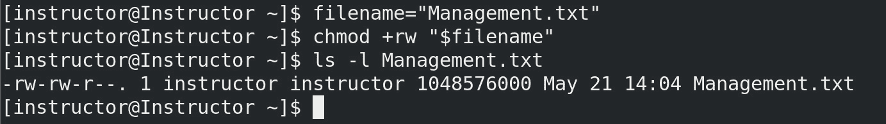

图 5.1 – 授予文件权限

此命令授予对`Management.txt`文件的读写权限，允许用户既能读取文件，也能写入文件。

**场景 2**: 撤销组的执行权限：

1.  确定你想要从中撤销特定组执行权限的文件或目录。

1.  使用 `chmod` 命令和适当的选项来撤销执行权限：

    +   `g-w`: 这个选项移除文件所属组的写权限。

    +   `g-x`: 这个选项移除文件所属组的执行权限。这意味着该组成员即使有读和写权限，也无法执行文件：

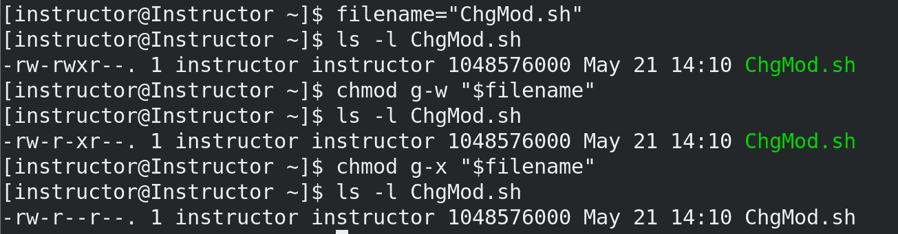

图 5.2 – 撤销执行权限

这个命令将 `ChgMod.sh` 文件的组执行权限移除，确保组成员无法执行该脚本。

**场景 3**: 使用数字模式设置特定权限：

1.  确定你想要为其设置特定权限的文件或目录。

1.  计算所需权限的数字值——例如，读（`4`）、写（`2`）和执行（`1`）：

    ```
    user_permission=6 # read and write permission for the owner
    group_permission=4 # read permission for the group
    other_permission=4 # read permission for others
    ```

    在 Linux 中，文件和目录的权限通常用三位数字代码表示，其中每个数字对应一个特定的权限类型。三个数字分别表示所有者、组和其他用户的权限，顺序如下。每个数字是一个值的组合，表示读、写和执行权限，如下所示：

    +   `4`: 这个数字表示读权限。它允许用户（或实体）查看文件内容或列出目录中的文件。

    +   `2`: 这个数字表示写权限。它赋予用户修改或删除文件内容的能力，或在目录中创建新文件。

    +   `1`: 这个数字表示执行权限。它使用户能够运行可执行文件和脚本，或进入（进入）目录。

    要创建三位数字的权限代码，你可以根据所有者、组和其他用户的所需权限来组合这些值。以下是一个示例：

    +   `6`: 这个代码表示所有者拥有读和写权限（`4` + `2`），但没有执行权限

    +   `7`: 在这个代码中，所有者拥有读、写和执行权限（`4` + `2` + `1`）

    +   `4`: 这个代码表示该组只有只读权限，没有写入或执行权限。

    +   `5`: 在这里，组拥有读和执行权限（`4` + `1`），但没有写权限

    +   `0`: 这个代码表示某个实体（所有者、组或其他人）没有任何权限

    通过理解权限代码中每个数字的含义，你可以精确控制谁可以读、写和执行文件和目录，从而确保系统的安全性和完整性。

1.  使用 `chmod` 命令和适当的数字模式来设置权限：

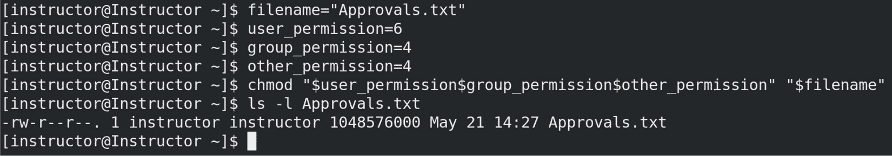

图 5.3 – 数字权限模式

这个命令将 `Approvals.txt` 文件的权限设置为所有者可读写，组可读，其他人可读。

**场景 4**：为目录及其子目录应用递归权限：

1.  确定你想要递归应用权限的目录。

1.  使用 `chmod` 命令和适当的选项来递归地应用所需的权限：

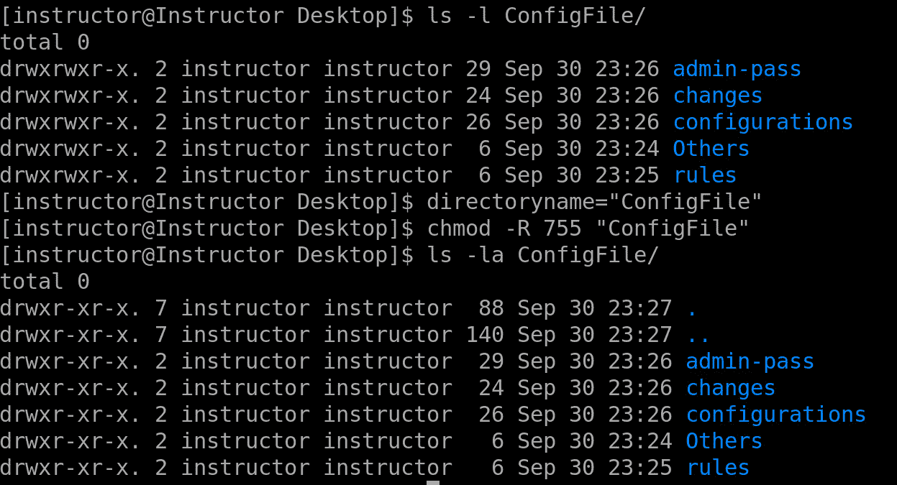

图 5.4 – 为目录应用递归权限

此命令将权限 `755`（所有者具有读取、写入和执行权限，组和其他用户具有读取和执行权限）应用于 `ConfigFile` 目录及其所有子目录。

`chmod` 是一个强大的命令，在 Linux 和类 Unix 系统中，负责控制文件和目录的权限。它的重要性在于能够执行安全措施，管理用户访问权限，并简化管理员的任务。通过有效地使用 `chmod`，系统管理员可以确保组织内数据的机密性、完整性和可用性，同时保持结构化和安全的文件系统。

# chown

`chown` 命令是 Linux 和基于 Unix 的操作系统中的一个强大工具，用于更改文件和目录的所有权。然而，需要注意的是，在许多情况下，你需要超级用户权限（通常通过 `sudo` 命令获得）来执行 `chown`。此命令允许系统管理员为文件分配新的所有权，确定哪些用户和组对文件有控制权。

`chown` 在管理文件权限、执行安全措施和组织管理文件方面起着至关重要的作用。它的一个关键用途是确保在 Linux 系统内有适当的访问控制和安全性。

通过为文件和目录指定正确的用户和组所有权，系统管理员可以维护安全性，控制谁可以访问、修改或删除特定资源。在多用户和多组环境中，这一点尤其重要，因为对文件访问的精确控制对于系统完整性和数据保护至关重要。

通过更改文件和目录的所有权，管理员可以限制对敏感信息的访问，并防止未经授权的用户修改或访问重要文件。在多用户环境和数据机密性至关重要的组织中，这一点尤其重要。`chown` 使管理员能够为特定用户和组分配所有权，确保只有授权的个人拥有必要的权限。

此外，`chown` 对于系统管理任务和文件管理至关重要。它允许管理员在用户被添加或从系统中删除时转移文件的所有权。例如，当用户帐户被删除时，必须将他们的文件所有权分配给另一个用户或系统帐户，以确保连续性并防止数据丢失。`chown` 还通过允许组成员之间的文件所有权转移，促进了团队内的高效协作，使他们能够在共享项目或文档上共同工作。

除了其安全性和管理优势外，`chown` 是组织和维护文件系统的基础工具。它使管理员能够通过根据角色或目的将所有权分配给特定用户或组，来对文件和目录进行分类。这有助于简化文件管理，简化权限管理，并确保文件正确地组织和可供合适的人访问。`chown` 在维护结构良好且高效的文件系统中发挥着至关重要的作用，增强了管理员和用户的生产力和易用性。

`chown` 命令允许进行多种类型的所有权变更，使管理员能够根据不同的标准修改文件和目录的所有权。以下是 Linux 权限中常用的所有权变更类型：

+   `chown` 命令可用于更改文件或目录的用户所有权。通过指定一个新用户作为所有者，管理员可以将所有权转移给另一个用户帐户。

+   `chown` 还支持更改文件或目录的组所有权。管理员可以将文件分配给一个新组，使该组的成员可以访问和修改该文件。

+   `chown` 还提供了同时更改用户和组所有权的灵活性。这使得管理员能够完全修改文件或目录的所有权，分配新的用户和新组。

+   `chown` 命令中的 `-R` 选项启用递归所有权更改，确保对指定目录中的所有文件和目录进行所有权修改。

+   `chown` 命令中的 `-h` 选项确保文件上下文保持不变。

让我们探索不同的场景，展示如何有效地使用此命令：

+   更改目录及其内容的所有权：

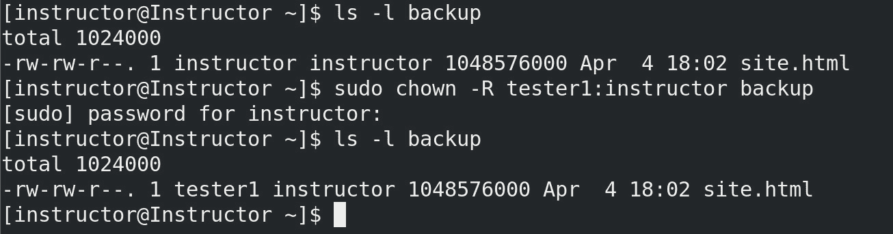

图 5.5 – 更改目录的所有权

在此场景中，我们将 `backup` 目录及其所有内容的所有权转交给 `tester1` 用户，包括文件和子目录。组所有权也更改为 `instructor`。当将项目的所有权转交给新的团队负责人，或将文件按特定用户和组组织时，这非常有用。

+   恢复系统文件的所有权：

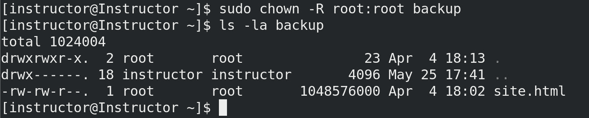

图 5.6 – 恢复文件的所有权

此命令递归地将`backup`目录下的所有文件和目录的所有权更改回`root`用户和`root`组。这对于保持系统配置文件的完整性和安全性非常重要，确保只有`root`用户具有修改它们的必要权限。

+   在共享目录中将所有权分配给特定用户：

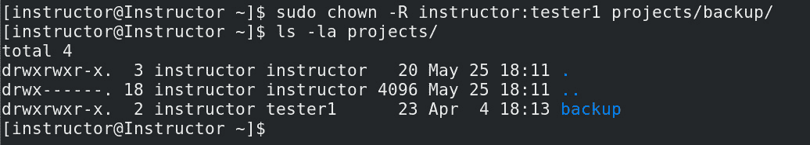

图 5.7 – 在共享目录中将所有权分配给特定用户

在这里，`project/backup/`目录的所有权被更改为`instructor`用户和`tester1`组。这在多个用户需要访问共享目录，但要求对目录内某些文件或文件夹具有特定所有权的场景中非常有用。

通过自定义用户和组名称并应用适当的选项，您可以在各种情况下有效地管理所有权和权限。

最后，`chown`是系统管理员的一个关键命令。它更改文件所有权的能力使得适当的访问控制成为可能，增强了安全性，简化了管理任务，并有助于保持文件系统的良好组织。通过有效地利用`chown`，管理员可以确保数据机密性，维护系统完整性，并促进用户和组之间的高效协作。

# 在命令中使用绝对路径

在命令中使用绝对路径是操作 Linux 操作系统时的一个关键方面。绝对路径指的是文件或目录在文件系统层次结构中的完整精确位置。它从`root`目录（`/`）开始，并包含所有必要的目录，以精确指定位置。使用绝对路径的主要原因是提供一种明确且可靠的方式来引用文件或目录。通过使用绝对路径，您消除了对当前工作目录的依赖。这确保了命令将始终准确地指向目标文件或目录，无论您在文件系统中的位置如何。绝对路径消除了混淆，并防止了依赖相对路径时可能出现的潜在错误。

在需要从不同目录或不同用户执行脚本或命令的场景中，使用绝对路径的重要性变得显而易见。绝对路径可以确保无论执行环境如何，都能访问到相同的文件或目录。在进行系统管理任务、自动化脚本或多个用户共享环境操作时，尤其需要注意这一点。绝对路径在各种 Linux 操作中被广泛使用，尤其在执行需要精确指定文件或目录的命令时，如文件操作、数据备份、系统配置或应用程序部署。绝对路径常用于文件复制、移动、删除、权限修改和程序执行等命令中。通过使用绝对路径，你可以确保这些操作的准确性和可预测性，最大限度减少意外后果或错误的风险。为了更好地理解我们所说的内容，我们将重点展示不同场景下使用绝对路径命令的示例：

+   位于你主目录中的`document.txt`，你希望将其复制到`/var/www/html`目录。你可以使用以下绝对路径命令来完成此操作：

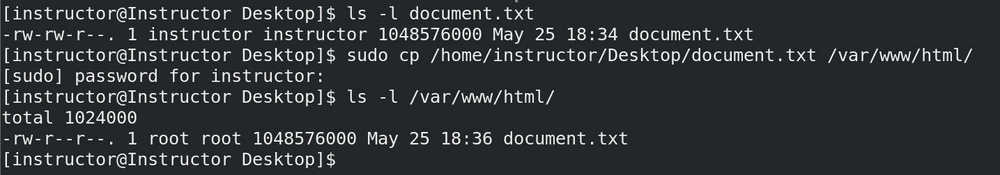

图 5.8 – 将文件复制到指定目录

+   当前工作目录中的`document.txt`，你希望将其移动到`/home/instructor/Documents`目录。你可以使用以下绝对路径命令来完成此操作：

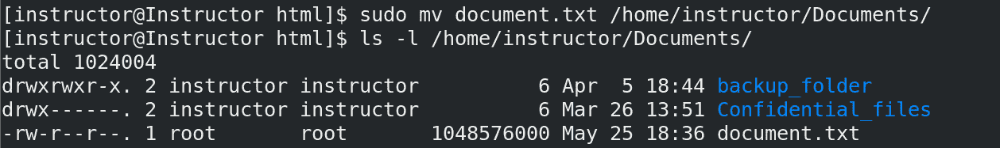

图 5.9 – 将目录移动到另一个位置

+   `/usr/local/bin`目录，并且需要访问位于`/etc`目录下名为`config.ini`的配置文件。你可以使用以下绝对路径命令来引用该文件：


图 5.10 – 访问另一个目录中的文件

这些示例展示了如何使用绝对路径命令来指定文件和目录的确切位置，无论当前工作目录在哪里。通过提供完整路径，可以确保文件操作的准确性，避免文件引用的模糊性。

总之，绝对命令通过使用从`root`目录开始的完整路径来精确可靠地引用文件和目录。这对于保持一致性、简化系统管理任务、在脚本和程序中进行精确文件访问和操作，以及确保脚本在不同环境中的可移植性非常重要。通过理解并利用绝对路径的优势，系统管理员可以有效地浏览文件系统，并自信且精确地执行任务。

# chgrp

在 Linux 中，`chgrp` 命令用于更改文件和目录的组所有权。`chgrp`的作用是确保适当的访问控制，并促进 Linux 系统中基于组的权限管理。使用 `chgrp` 的一个关键原因是将文件或目录的所有权与特定组对齐。在多用户环境中，不同的用户组需要对文件和目录有不同的访问权限，通过使用 `chgrp` 更改组所有权，管理员可以确保文件对适当的组可访问，并限制其他组的访问，从而增强敏感数据的安全性和完整性。

`chgrp` 的重要性在于其在有效管理文件权限中的作用。它与其他与权限相关的命令（如 `chmod`）协同工作，定义访问权限并保持正确的所有权。通过使用 `chgrp`，管理员可以将所有权分配给特定组，允许该组的成员协作处理文件和目录，同时保持对访问权限的控制。`chgrp` 在各种场景中都得到了广泛应用。

`chown` 和 `chgrp` 都用于修改文件和目录的所有权属性。然而，它们的用途不同：

+   `chown` 用于更改文件或目录的所有者和组所有者。它允许你将文件或目录的完全所有权从一个用户转移到另一个用户，包括相关的组所有权。

+   `chgrp`则专门用于更改文件或目录的组所有权，同时保持文件所有者不变。它不会影响用户所有者，只会更改组所有者。

使用 `chown` 还是 `chgrp` 取决于你的具体需求。如果你想更改文件或目录的所有者和组所有者，请使用 `chown`。如果你只需要修改组所有权并保留用户所有者，则 `chgrp` 是合适的选择。

例如，在基于项目的环境中，管理员可以为每个项目创建不同的组，并为与项目相关的文件和目录分配适当的组所有权。这样，只有相关项目组的成员才能访问和修改这些资源。在管理共享目录时，`chgrp` 也很有价值，因为多个用户需要在文件上进行协作，它简化了授予或撤销基于组的权限的过程。

让我们来看一些示例：

+   将组所有权分配给目录。

    假设你有一个名为 `project` 的目录，需要由 `tester1` 组进行访问和修改。你可以使用以下命令：

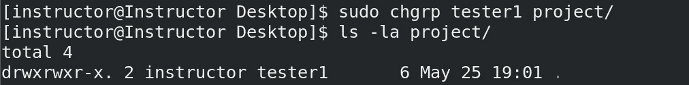

图 5.11 – 使用 chgrp 分配组所有权给目录

+   递归更改组所有权。

    你希望将名为 `data` 的目录内所有文件和目录的组所有权更改为 `tester1` 组。你可以使用以下命令：

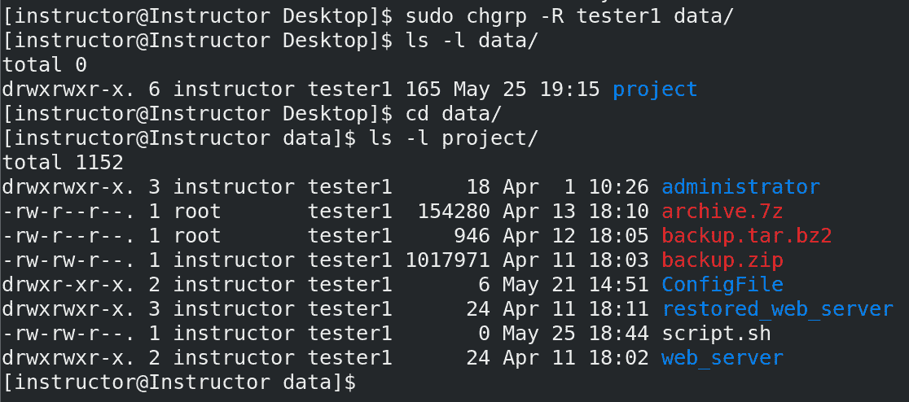

图 5.12 – 使用 chgrp -R 递归

通过使用 `chgrp`，管理员可以强制基于组的权限，简化用户之间的协作，并确保文件和目录仅对授权的个人或组可访问。这对于 Linux 中的组所有权管理至关重要。它提供了一种将文件和目录所有权与特定组对齐的方法，从而促进正确的访问控制并增强安全性。

# umask

`umask` 命令用于设置新创建的文件和目录的默认文件权限。术语 `umask` 表示将 `umask` 值从最大权限中减去（通常文件权限为 `666`，目录权限为 `777`），从而得出实际权限。这个变化反映了 `umask` 值所修改的权限更准确的术语。

`umask` 命令的重要性在于增强安全性并在多用户环境中控制文件权限。通过设置适当的 `umask` 值，系统管理员可以确保新文件和目录拥有所需的权限。这有助于执行安全策略、防止未经授权的访问，并保持敏感数据的完整性。

`umask` 命令在多个用户共享同一系统或创建动态生成文件的脚本和应用程序时特别有用。通过定义特定的 `umask` 值，系统管理员可以在整个系统中建立一致的权限方案，从而减少敏感信息意外暴露的风险。

需要注意的是，设置更严格的 `umask` 可能会带来一定的后果。例如，如果全系统应用了非常严格的 `umask`，新安装的库及其相关文件可能无法被某些应用程序读取，从而可能导致兼容性问题。系统管理员应仔细考虑 `umask` 设置的影响，并在配置 `umask` 值时，在安全性和功能性之间找到平衡。

我们来看一些示例：

+   限制新创建文件的文件权限：

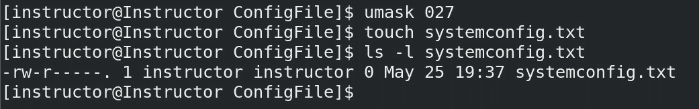

图 5.13 – 限制新创建文件的文件权限

在这种情况下，`umask` 命令用于计算新创建文件的默认权限。应用 `umask` 值 `027` 如下：

+   最左边的 `0` 代表用户的最大权限，保持不变

+   中间位置的 `2`（屏蔽写权限）会减去组的写权限（`2`），从而有效地移除它

+   右侧位置的 `7`（屏蔽了所有其他用户的权限）减去了所有其他用户的权限（`4` 代表读权限，`2` 代表写权限，`1` 代表执行权限），只保留读权限

接着，使用 `touch` 命令创建一个名为 `systemconfig.txt` 的新文件。最后，使用 `ls -l` 命令列出该文件的权限，权限应与 `umask` 值指定的权限一致。

+   允许组成员对目录中的文件进行读写操作：


图 5.14 – 允许组读/写权限

在这个场景中，`umask` 命令将默认权限掩码设置为 `002`，允许组成员对目录中创建的新文件具有读写权限。`mkdir` 命令用于创建一个名为 `dir_files` 的新目录。

现在，让我们深入探讨 `setgid` 位的意义。`chmod g+s` 命令用于在目录上设置 `setgid` 位。这个位具有特定的功能：它确保新创建的文件不仅继承父目录的组所有权，还会继承组权限。

例如，如果用户在 `dir_files` 目录中创建一个新文件，该文件将自动被分配为 `dir_files` 的组所有权，并且会具有与 `dir_files` 相同的组权限，即使该用户不是该组的成员。这在协作环境中尤其有用，在这种环境下，多个用户需要访问共享目录，确保这些目录中的文件保持正确的组所有权和权限。

+   为新创建的可执行文件设置限制性权限：

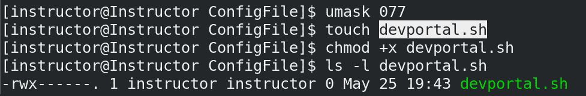

图 5.15 – 为新创建的可执行文件设置限制性权限

在这个场景中，`umask` 命令将默认权限掩码设置为 `077`，这意味着新创建的文件对于组和其他用户没有任何权限。使用 `touch` 命令创建一个名为 `devportal.sh` 的新文件。然后使用 `chmod +x` 命令使该文件变为可执行文件。由于 `umask` 值限制了组和其他用户的权限，生成的文件将仅对所有者具有执行权限。

# sudo

`sudo`命令在 Linux 中是一个至关重要的工具，系统管理员通过它可以增强安全性、限制对关键操作的访问，并促进最小权限原则。`sudo`命令的重要性在于它能够控制和限制对特权操作的访问。通过使用`sudo`，管理员可以授予特定用户或用户组以提升权限执行某些命令的能力，同时仍保留其操作记录。这有助于减轻与对根账户无限制访问相关的风险，因为它提供了一种受控且可审计的方式来执行管理任务。

`sudo`命令的主要用途是以根用户或其他指定的具有提升权限的用户身份执行命令。它要求用户在执行特权命令之前，通过其凭据（如密码）进行身份验证。通过确保只有授权的用户才能执行管理员操作，这增加了额外的安全层，减少了意外或恶意修改系统的可能性。`sudo`的目的是促进最小权限原则，即用户应仅被授予完成任务所需的最小权限。通过使用`sudo`，管理员可以根据需要授予普通用户临时管理员权限，而不暴露系统于不必要的风险。这有助于维护系统的整体安全性和稳定性，并防止未经授权的修改或滥用特权命令。

让我们来看一些例子：

+   以特权用户身份安装软件。

    在这种情况下，`sudo`命令用于运行`yum install`（yum 代表`sudo`，用户会被提示输入密码，如果授权，则该命令会以提升的权限执行）。这允许用户安装软件或进行需要管理员权限的系统级更改：

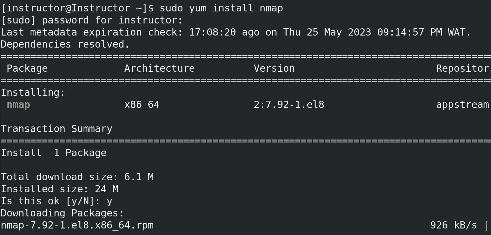

图 5.16 – 以特权用户安装软件

+   重启系统并检查服务。

    在这种情况下，使用`sudo`命令来重新启动并验证`sshd`系统服务的状态。通过以管理员权限执行`systemctl restart`/`status`命令，用户可以重新启动并监控需要根用户权限的关键服务的状态。这保证了对服务配置所做的任何修改或应用的更新都能正确实施并激活：

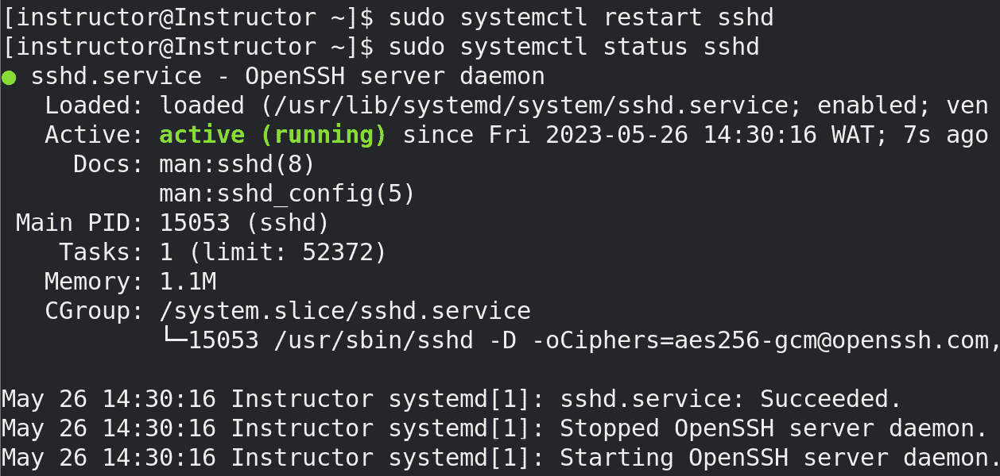

图 5.17 – 使用 sudo 重新启动并验证服务状态

总结来说，Linux 权限命令在管理 Linux 系统中文件和目录的访问方面起着至关重要的作用。这些命令允许系统管理员控制和执行权限，确保只有授权用户才能读取、写入或执行特定文件。理解不同类型的权限以及如何操作它们对于维护系统的安全性和完整性至关重要。

# 摘要

本章深入探讨了 Linux 权限命令的领域，探索了各种工具和技术，以有效管理文件和目录的访问权限。本章首先介绍了 `chmod` 命令，该命令允许用户修改文件和目录的权限。理解 `chmod` 对于执行安全措施、控制用户访问和保护敏感数据至关重要。通过使用数字和符号表示，管理员可以为用户、组和其他人分配特定权限。接下来，我们探讨了 `chown` 命令，它用于更改文件和目录的所有权。通过将所有权分配给特定的用户和组，管理员可以控制访问权限并确保文件和目录的适当责任。理解 `chown` 对于管理文件权限、促进协作和维护数据完整性至关重要。本章还涉及了在命令中使用绝对路径的问题。绝对路径提供了文件或目录在文件系统层次结构中的精确位置。这一知识使管理员能够准确高效地浏览和操作文件和目录。理解如何使用绝对路径对于执行命令、管理权限和执行文件操作至关重要。此外，本章还探讨了 `chgrp` 命令，它用于更改文件和目录的组所有权。通过将文件和目录分配给特定的组，管理员可以控制访问权限和组级协作。我们还介绍了 `umask` 命令，它在为新创建的文件和目录设置默认权限时发挥着重要作用。通过定义 `umask` 值，管理员可以指定应用于文件的初始权限，确保一致性并遵守安全标准。最后，我们深入探讨了 `sudo` 命令，这是一种强大的工具，授予用户以提升权限执行命令的能力。通过使用 `sudo`，管理员可以执行需要 root 权限的管理任务，同时通过限制管理权限的范围来维护安全性。

总结来说，本章涵盖了 Linux 权限命令的广泛内容，包括 `chown`、`chmod`、`chgrp`、`umask` 和 `sudo`。这些命令在管理组权限、促进协作、建立标准化文件权限以及以提升的权限执行管理任务方面起着至关重要的作用。

在下一章中，我们将深入探讨使系统管理员能够管理挂载文件系统并执行文件操作任务的基本工具和技术。我们将涵盖四个关键主题：`mount` 命令、`umount` 命令、`fuser` 命令，以及使用 `cat`、`grep` 等命令进行文件操作。
